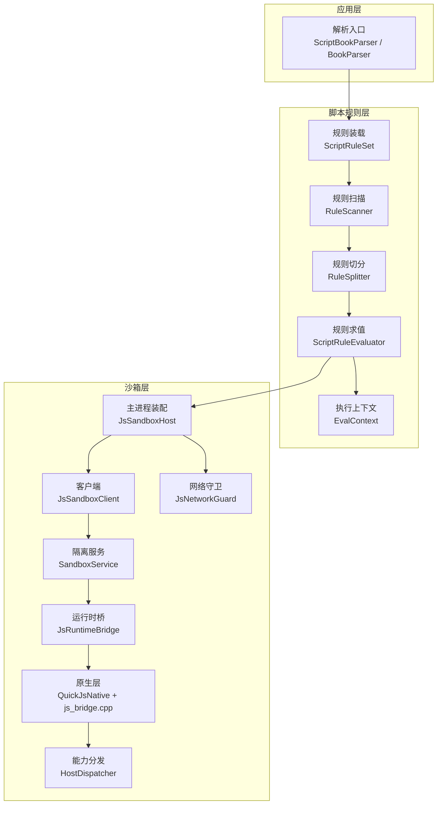
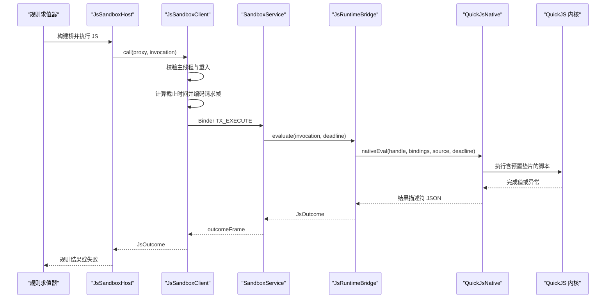
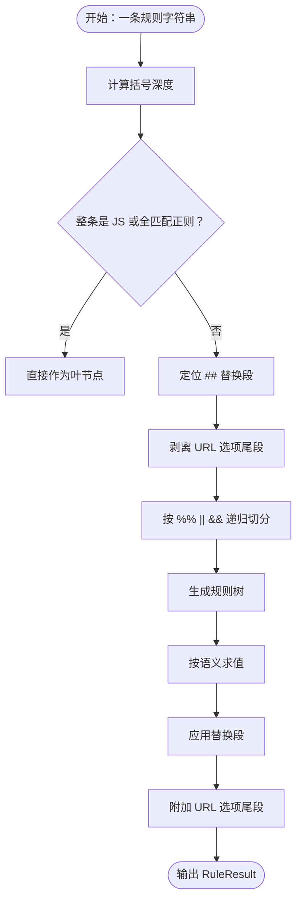
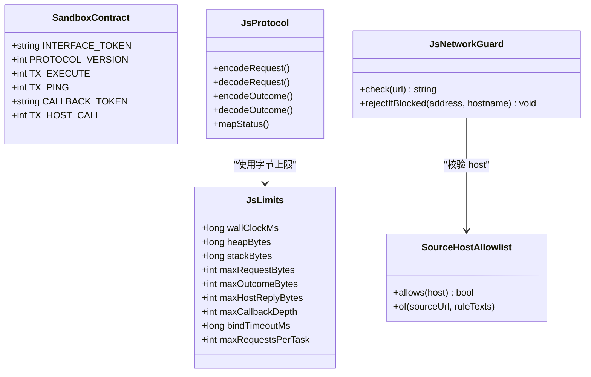
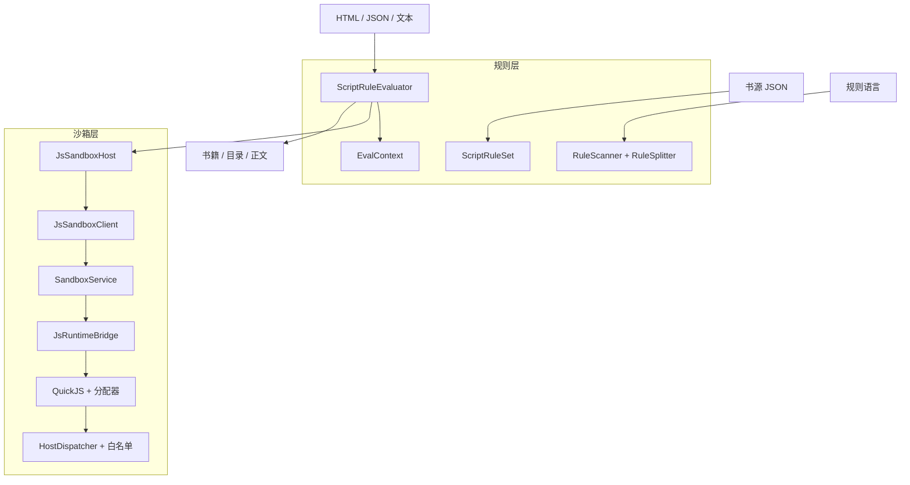
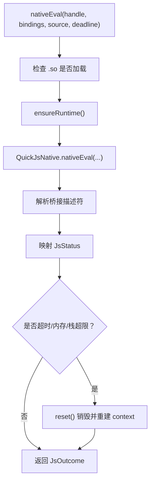
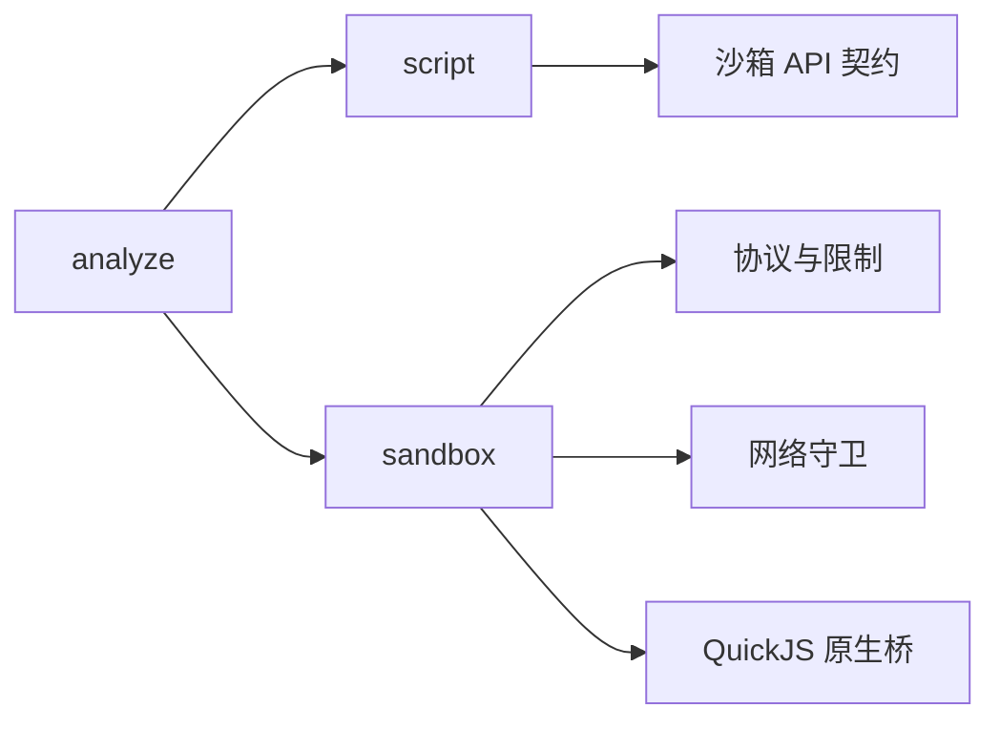

# 书源解析引擎 (lib_book_source)

<cite>
**本文引用的文件**   
- [SandboxProcess.kt](file://lib_book_source/src/main/java/com/ebook/source/sandbox/SandboxProcess.kt)
- [SandboxService.kt](file://lib_book_source/src/main/java/com/ebook/source/sandbox/SandboxService.kt)
- [JsSandboxClient.kt](file://lib_book_source/src/main/java/com/ebook/source/sandbox/JsSandboxClient.kt)
- [JsSandboxHost.kt](file://lib_book_source/src/main/java/com/ebook/source/sandbox/JsSandboxHost.kt)
- [JsRuntimeBridge.kt](file://lib_book_source/src/main/java/com/ebook/source/sandbox/JsRuntimeBridge.kt)
- [QuickJsNative.kt](file://lib_book_source/src/main/java/com/ebook/source/sandbox/QuickJsNative.kt)
- [js_bridge.cpp](file://lib_book_source/src/main/cpp/bridge/js_bridge.cpp)
- [SandboxContract.kt](file://lib_book_source/src/main/java/com/ebook/source/sandbox/SandboxContract.kt)
- [JsProtocol.kt](file://lib_book_source/src/main/java/com/ebook/source/sandbox/JsProtocol.kt)
- [JsLimits.kt](file://lib_book_source/src/main/java/com/ebook/source/sandbox/JsLimits.kt)
- [HostDispatcher.kt](file://lib_book_source/src/main/java/com/ebook/source/sandbox/HostDispatcher.kt)
- [SourceHostAllowlist.kt](file://lib_book_source/src/main/java/com/ebook/source/sandbox/SourceHostAllowlist.kt)
- [JsNetworkGuard.kt](file://lib_book_source/src/main/java/com/ebook/source/sandbox/JsNetworkGuard.kt)
- [QuickJsPrelude.kt](file://lib_book_source/src/main/java/com/ebook/source/sandbox/QuickJsPrelude.kt)
- [ScriptRuleEvaluator.kt](file://lib_book_source/src/main/java/com/ebook/source/script/ScriptRuleEvaluator.kt)
- [ScriptRuleSet.kt](file://lib_book_source/src/main/java/com/ebook/source/script/ScriptRuleSet.kt)
- [RuleScanner.kt](file://lib_book_source/src/main/java/com/ebook/source/script/RuleScanner.kt)
- [RuleSplitter.kt](file://lib_book_source/src/main/java/com/ebook/source/script/RuleSplitter.kt)
- [RuleNode.kt](file://lib_book_source/src/main/java/com/ebook/source/script/RuleNode.kt)
- [RuleValue.kt](file://lib_book_source/src/main/java/com/ebook/source/script/RuleValue.kt)
- [EvalContext.kt](file://lib_book_source/src/main/java/com/ebook/source/script/EvalContext.kt)
</cite>

## 目录
1. [引言](#引言)
2. [项目结构](#项目结构)
3. [核心组件](#核心组件)
4. [架构总览](#架构总览)
5. [详细组件分析](#详细组件分析)
6. [依赖关系分析](#依赖关系分析)
7. [性能与安全考量](#性能与安全考量)
8. [调试与故障排查](#调试与故障排查)
9. [结论](#结论)
10. [附录：JSON 规则语法与 JavaScript API 参考](#附录json-规则语法与-javascript-api-参考)

## 引言
本仓库中的 `lib_book_source` 模块实现了“书源解析引擎”的核心能力：以 JSON 描述的书源规则驱动，通过一套自定义规则语言在 HTML、JSON 或文本中抽取书籍、目录、正文等信息；对需要复杂逻辑的片段，引擎提供受控的 JavaScript 执行环境。该环境运行在 Android 的隔离进程内，并通过 QuickJS 原生桥访问宿主能力，同时由白名单、网络守卫和多种资源上限严格限制脚本行为。

文档面向两类读者：
- 书源作者：需要了解 JSON 规则语法、JavaScript API、安全边界与调试方法。
- 库开发者：需要了解沙箱进程、JNI 通信、规则解析器与求值器的实现细节。

## 项目结构
`lib_book_source` 的主要代码按职责分为三个子包：

| 包 | 职责 | 关键文件 |
|---|---|---|
| `sandbox` | 沙箱进程、Binder 协议、QuickJS 桥接、资源限制、网络守卫 | `SandboxProcess`、`SandboxService`、`JsSandboxClient`、`JsRuntimeBridge`、`QuickJsNative`、`js_bridge.cpp`、`JsProtocol`、`JsLimits`、`HostDispatcher`、`JsNetworkGuard`、`SourceHostAllowlist`、`QuickJsPrelude` |
| `script` | 书源 JSON 装载、规则扫描与切分、规则求值、上下文与后端 | `ScriptRuleSet`、`RuleScanner`、`RuleSplitter`、`RuleNode`、`ScriptRuleEvaluator`、`EvalContext`、`RuleValue` |
| `analyze` | 书源解析入口（对外暴露） | `BookParser`、`ScriptBookParser`、`JsoupBookParser`、`ScriptContentParser` |

**图示来源**
- [ScriptRuleSet.kt:1-200](file://lib_book_source/src/main/java/com/ebook/source/script/ScriptRuleSet.kt#L1-L200)
- [ScriptRuleEvaluator.kt:1-200](file://lib_book_source/src/main/java/com/ebook/source/script/ScriptRuleEvaluator.kt#L1-L200)
- [JsSandboxHost.kt:1-60](file://lib_book_source/src/main/java/com/ebook/source/sandbox/JsSandboxHost.kt#L1-L60)
- [JsSandboxClient.kt:1-185](file://lib_book_source/src/main/java/com/ebook/source/sandbox/JsSandboxClient.kt#L1-L185)
- [SandboxService.kt:1-200](file://lib_book_source/src/main/java/com/ebook/source/sandbox/SandboxService.kt#L1-L200)
- [JsRuntimeBridge.kt:1-113](file://lib_book_source/src/main/java/com/ebook/source/sandbox/JsRuntimeBridge.kt#L1-L113)
- [QuickJsNative.kt:1-59](file://lib_book_source/src/main/java/com/ebook/source/sandbox/QuickJsNative.kt#L1-L59)
- [js_bridge.cpp:1-200](file://lib_book_source/src/main/cpp/bridge/js_bridge.cpp#L1-L200)

**章节来源**
- [ScriptRuleSet.kt:1-200](file://lib_book_source/src/main/java/com/ebook/source/script/ScriptRuleSet.kt#L1-L200)
- [ScriptRuleEvaluator.kt:1-200](file://lib_book_source/src/main/java/com/ebook/source/script/ScriptRuleEvaluator.kt#L1-L200)
- [JsSandboxClient.kt:1-185](file://lib_book_source/src/main/java/com/ebook/source/sandbox/JsSandboxClient.kt#L1-L185)

## 核心组件
本节聚焦引擎的五个关键维度：脚本加载与执行流程、规则解析器、JSON 规则模型、安全沙箱和网络守卫。

### 脚本加载与执行流程
脚本执行从规则层进入沙箱层，再落到 QuickJS 原生层：

1. 规则求值器发现 JS 段或需要初始化对象时，调用上下文持有的 `ScriptJsBridge`。
2. `JsSandboxHost.bridgeFor` 组装一次任务桥，把当前上下文、网络守卫、传输通道和 Cookie 状态注入到沙箱垫片。
3. `JsSandboxClient.execute` 序列化请求、加截止时间、串行化并发，并通过 Binder 发送给 `:js` 隔离进程。
4. `SandboxService` 校验协议版本与接口标识后，交给 `JsRuntimeBridge.evaluate`。
5. `JsRuntimeBridge` 确保 QuickJS runtime 存在，拼接预置脚本与用户脚本，调用 `QuickJsNative.nativeEval`。
6. C++ 层设置堆栈限值和中断器，执行脚本，返回结构化结果描述符。
7. Kotlin 侧将描述符映射为 `JsStatus`，并回传成功数据或错误信息。

**图示来源**
- [ScriptRuleEvaluator.kt:1-200](file://lib_book_source/src/main/java/com/ebook/source/script/ScriptRuleEvaluator.kt#L1-L200)
- [JsSandboxHost.kt:1-60](file://lib_book_source/src/main/java/com/ebook/source/sandbox/JsSandboxHost.kt#L1-L60)
- [JsSandboxClient.kt:1-185](file://lib_book_source/src/main/java/com/ebook/source/sandbox/JsSandboxClient.kt#L1-L185)
- [SandboxService.kt:1-200](file://lib_book_source/src/main/java/com/ebook/source/sandbox/SandboxService.kt#L1-L200)
- [JsRuntimeBridge.kt:1-113](file://lib_book_source/src/main/java/com/ebook/source/sandbox/JsRuntimeBridge.kt#L1-L113)
- [QuickJsNative.kt:1-59](file://lib_book_source/src/main/java/com/ebook/source/sandbox/QuickJsNative.kt#L1-L59)
- [js_bridge.cpp:1-200](file://lib_book_source/src/main/cpp/bridge/js_bridge.cpp#L1-L200)

**章节来源**
- [JsSandboxClient.kt:1-185](file://lib_book_source/src/main/java/com/ebook/source/sandbox/JsSandboxClient.kt#L1-L185)
- [JsRuntimeBridge.kt:1-113](file://lib_book_source/src/main/java/com/ebook/source/sandbox/JsRuntimeBridge.kt#L1-L113)
- [QuickJsNative.kt:1-59](file://lib_book_source/src/main/java/com/ebook/source/sandbox/QuickJsNative.kt#L1-L59)
- [js_bridge.cpp:1-200](file://lib_book_source/src/main/cpp/bridge/js_bridge.cpp#L1-L200)

### 规则解析器实现
规则解析器负责把一条规则字符串变成可求值的树，再根据输入类型输出节点、匹配项、文本或 JSON。

- **规则扫描**：基于 `{}`、`[]`、`{{}}` 的括号深度扫描分隔符，避免正则字面量、URL 选项、插值表达式被误切。
- **规则切分**：固定优先级 `%%` → `||` → `&&`，并把 `@js:` 与全匹配正则提前识别为叶节点，同时剥离 `##` 替换段与 URL 选项尾段。
- **规则节点**：支持空节点、叶节点、全部合并、首支短路、交错取数。
- **规则求值**：先展开 `{{}}`，再切分，再逐支求值，最后应用替换段和 URL 选项尾段。

**图示来源**
- [RuleScanner.kt:1-78](file://lib_book_source/src/main/java/com/ebook/source/script/RuleScanner.kt#L1-L78)
- [RuleSplitter.kt:1-117](file://lib_book_source/src/main/java/com/ebook/source/script/RuleSplitter.kt#L1-L117)
- [RuleNode.kt:1-32](file://lib_book_source/src/main/java/com/ebook/source/script/RuleNode.kt#L1-L32)
- [ScriptRuleEvaluator.kt:1-200](file://lib_book_source/src/main/java/com/ebook/source/script/ScriptRuleEvaluator.kt#L1-L200)

**章节来源**
- [RuleScanner.kt:1-78](file://lib_book_source/src/main/java/com/ebook/source/script/RuleScanner.kt#L1-L78)
- [RuleSplitter.kt:1-117](file://lib_book_source/src/main/java/com/ebook/source/script/RuleSplitter.kt#L1-L117)
- [RuleNode.kt:1-32](file://lib_book_source/src/main/java/com/ebook/source/script/RuleNode.kt#L1-L32)
- [ScriptRuleEvaluator.kt:1-200](file://lib_book_source/src/main/java/com/ebook/source/script/ScriptRuleEvaluator.kt#L1-L200)

### JSON 规则模型
书源以 JSON 描述，每个书源包含搜索、发现、书目信息、目录和正文等规则对象。装载阶段会把原始 JSON 转成两个视图：
- 字符串规则表：供求值层读取规则串。
- 原始 JSON 节点表：供非常规字段展开，例如多页 URL 数组。

同时装载阶段会标记不支持的能力，如登录、WebJS、XPath、评论等，以便导入报告明确告知使用者。

**章节来源**
- [ScriptRuleSet.kt:1-200](file://lib_book_source/src/main/java/com/ebook/source/script/ScriptRuleSet.kt#L1-L200)

### 安全沙箱配置
沙箱通过四层机制限制脚本：

| 层级 | 控制点 | 主要目的 |
|---|---|---|
| 进程隔离 | `SandboxProcess`、`SandboxService` | 不在非隔离进程中执行脚本 |
| 协议与帧大小 | `SandboxContract`、`JsProtocol`、`JsLimits` | 防止 Binder 事务过大、协议错位 |
| 资源上限 | `JsLimits`、QuickJS 堆/栈/超时 | 防止死循环、内存溢出、无限递归 |
| 能力白名单 | `HostDispatcher`、`QuickJsPrelude` | 只暴露有限计算、网络、变量和页面改写能力 |

**图示来源**
- [JsLimits.kt:1-58](file://lib_book_source/src/main/java/com/ebook/source/sandbox/JsLimits.kt#L1-L58)
- [SandboxContract.kt:1-47](file://lib_book_source/src/main/java/com/ebook/source/sandbox/SandboxContract.kt#L1-L47)
- [JsProtocol.kt:1-200](file://lib_book_source/src/main/java/com/ebook/source/sandbox/JsProtocol.kt#L1-L200)
- [SourceHostAllowlist.kt:1-74](file://lib_book_source/src/main/java/com/ebook/source/sandbox/SourceHostAllowlist.kt#L1-L74)
- [JsNetworkGuard.kt:1-167](file://lib_book_source/src/main/java/com/ebook/source/sandbox/JsNetworkGuard.kt#L1-L167)

**章节来源**
- [JsLimits.kt:1-58](file://lib_book_source/src/main/java/com/ebook/source/sandbox/JsLimits.kt#L1-L58)
- [SandboxContract.kt:1-47](file://lib_book_source/src/main/java/com/ebook/source/sandbox/SandboxContract.kt#L1-L47)
- [JsProtocol.kt:1-200](file://lib_book_source/src/main/java/com/ebook/source/sandbox/JsProtocol.kt#L1-L200)
- [SourceHostAllowlist.kt:1-74](file://lib_book_source/src/main/java/com/ebook/source/sandbox/SourceHostAllowlist.kt#L1-L74)
- [JsNetworkGuard.kt:1-167](file://lib_book_source/src/main/java/com/ebook/source/sandbox/JsNetworkGuard.kt#L1-L167)

## 架构总览
整体系统由“规则层”和“沙箱层”组成：

- 规则层负责理解书源 JSON 和规则语言，产出结构化数据。
- 沙箱层负责安全执行脚本，并通过受限能力访问网络、计算和变量。
- 两者之间通过 `EvalContext.js` 和 `JsSandboxHost` 解耦：规则层不知道进程隔离，沙箱层不知道规则语法。

**图示来源**
- [ScriptRuleSet.kt:1-200](file://lib_book_source/src/main/java/com/ebook/source/script/ScriptRuleSet.kt#L1-L200)
- [ScriptRuleEvaluator.kt:1-200](file://lib_book_source/src/main/java/com/ebook/source/script/ScriptRuleEvaluator.kt#L1-L200)
- [JsSandboxHost.kt:1-60](file://lib_book_source/src/main/java/com/ebook/source/sandbox/JsSandboxHost.kt#L1-L60)
- [JsSandboxClient.kt:1-185](file://lib_book_source/src/main/java/com/ebook/source/sandbox/JsSandboxClient.kt#L1-L185)
- [SandboxService.kt:1-200](file://lib_book_source/src/main/java/com/ebook/source/sandbox/SandboxService.kt#L1-L200)
- [JsRuntimeBridge.kt:1-113](file://lib_book_source/src/main/java/com/ebook/source/sandbox/JsRuntimeBridge.kt#L1-L113)
- [QuickJsNative.kt:1-59](file://lib_book_source/src/main/java/com/ebook/source/sandbox/QuickJsNative.kt#L1-L59)

## 详细组件分析

### 沙箱进程与 Binder 协议
`SandboxProcess` 提供“是否处于隔离进程”的唯一判断；`SandboxService` 是 `:js` 进程中的唯一服务，负责处理 `TX_EXECUTE` 和 `TX_PING`，并通过反向回调把网络等能力请求转发给主进程。协议由 `SandboxContract` 集中声明，避免 AIDL 生成的桩成为审计盲区。

关键点：
- 协议 token 与版本先校验，再读帧体。
- `onTransact` 不向外抛未类型化异常，所有失败包装为可命名结果。
- Binder 线程池默认最多 15 条线程，但并发由 `JsSandboxClient.inFlight` 串行化，而不是由 service 保证单帧。
- `bind` 只在隔离进程返回 binder，否则主进程拿不到可用连接，最终表现为“沙箱不可用”。

**章节来源**
- [SandboxProcess.kt:1-28](file://lib_book_source/src/main/java/com/ebook/source/sandbox/SandboxProcess.kt#L1-L28)
- [SandboxService.kt:1-200](file://lib_book_source/src/main/java/com/ebook/source/sandbox/SandboxService.kt#L1-L200)
- [SandboxContract.kt:1-47](file://lib_book_source/src/main/java/com/ebook/source/sandbox/SandboxContract.kt#L1-L47)

### QuickJS 桥接层与原生实现
Kotlin 侧 `QuickJsNative` 是 C++ 函数的影子声明；`JsRuntimeBridge` 管理 runtime、context、预置脚本和资源重置；C++ 侧 `js_bridge.cpp` 实现 QuickJS runtime、分配器、中断器和 host 回调。

重点：
- runtime 生命周期与 context 生命周期分离：每次执行前重建 context，遇到超时、内存或栈超限时强制 reset。
- 分配器拦截 malloc/realloc/free，记录是否拒绝过分配，从而区分“真正的内存超限”与普通运行时异常。
- 截止时间使用单调时钟，跨进程可比，避免系统时间修改绕过超时。
- 微任务轮数上限用于阻止自驱动的 Promise 队列导致 wall-clock 失效。

**图示来源**
- [JsRuntimeBridge.kt:1-113](file://lib_book_source/src/main/java/com/ebook/source/sandbox/JsRuntimeBridge.kt#L1-L113)
- [QuickJsNative.kt:1-59](file://lib_book_source/src/main/java/com/ebook/source/sandbox/QuickJsNative.kt#L1-L59)
- [js_bridge.cpp:1-200](file://lib_book_source/src/main/cpp/bridge/js_bridge.cpp#L1-L200)

**章节来源**
- [JsRuntimeBridge.kt:1-113](file://lib_book_source/src/main/java/com/ebook/source/sandbox/JsRuntimeBridge.kt#L1-L113)
- [QuickJsNative.kt:1-59](file://lib_book_source/src/main/java/com/ebook/source/sandbox/QuickJsNative.kt#L1-L59)
- [js_bridge.cpp:1-200](file://lib_book_source/src/main/cpp/bridge/js_bridge.cpp#L1-L200)

### 脚本引擎设计与规则求值
`ScriptRuleEvaluator` 是规则求值的主调度器，遵循规格第 9 步的执行顺序：展开插值、切分、逐支求值、应用替换、附加 URL 选项尾段。它把不同取值方式委托给对应后端，并在组合符分支上分别实现短路、合并与交错语义。

上下文 `EvalContext` 保存一次解析任务的基准地址、页码、键、变量表和 JS 桥；嵌套规则求值使用关闭 JS 的上下文视图，避免递归求值再次触发沙箱调用。

**章节来源**
- [ScriptRuleEvaluator.kt:1-200](file://lib_book_source/src/main/java/com/ebook/source/script/ScriptRuleEvaluator.kt#L1-L200)
- [EvalContext.kt:1-83](file://lib_book_source/src/main/java/com/ebook/source/script/EvalContext.kt#L1-L83)
- [RuleValue.kt:1-31](file://lib_book_source/src/main/java/com/ebook/source/script/RuleValue.kt#L1-L31)

### JavaScript API 参考
JavaScript 能力通过 `QuickJsPrelude` 装配，并由 `HostDispatcher` 做第二次白名单校验。脚本可见的 API 分为四类：

| 类别 | 示例 | 说明 |
|---|---|---|
| 纯计算 | `md5`、`sha256`、`base64Encode`、`aesEncode`、`hmacBase64`、`randomUUID`、`timestamp`、`FormatDate` | 在沙箱进程内本地计算，结果经 `HostCompute` 处理 |
| 网络 | `ajax`、`load`、`post`、`responseCode` | 经主进程代理，受 URL 长度、scheme、host 白名单、内网地址、DNS 重绑、响应大小和请求次数限制 |
| 变量 | `java.put`、`java.get`、`java.rmKey` | 写入当前解析任务变量表；持久变量通过 `source.getVariable()` / `source.putVariable()` 等宿主回调读写 |
| 页面改写 | `getElements`、`getElement`、`queryString`、`putToPage`、`setContent` | 在当前规则求值上下文中继续解析或改写后续规则基准页 |

此外，脚本还可通过绑定获得 `result`、`baseUrl`、`src`、`key`、`page`、`title`、`book`、`chapter`、`source` 等数据面；其中 `book`、`chapter`、`source` 可能为 `undefined`，取决于当前解析阶段。

**章节来源**
- [QuickJsPrelude.kt:1-200](file://lib_book_source/src/main/java/com/ebook/source/sandbox/QuickJsPrelude.kt#L1-L200)
- [HostDispatcher.kt:1-74](file://lib_book_source/src/main/java/com/ebook/source/sandbox/HostDispatcher.kt#L1-L74)
- [JsSandboxHost.kt:1-60](file://lib_book_source/src/main/java/com/ebook/source/sandbox/JsSandboxHost.kt#L1-L60)

## 依赖关系分析
`lib_book_source` 内部依赖关系清晰分层：

- `script` 层依赖规则数据结构与解析工具，不依赖 Android Binder 或 JNI。
- `sandbox` 层依赖协议、限制、网络守卫和宿主能力分发，但不直接了解规则语言。
- `analyze` 层聚合解析入口，通常依赖 `script` 与 `sandbox`，但对上层隐藏实现细节。

**图示来源**
- [ScriptRuleEvaluator.kt:1-200](file://lib_book_source/src/main/java/com/ebook/source/script/ScriptRuleEvaluator.kt#L1-L200)
- [JsSandboxClient.kt:1-185](file://lib_book_source/src/main/java/com/ebook/source/sandbox/JsSandboxClient.kt#L1-L185)
- [JsNetworkGuard.kt:1-167](file://lib_book_source/src/main/java/com/ebook/source/sandbox/JsNetworkGuard.kt#L1-L167)

**章节来源**
- [ScriptRuleEvaluator.kt:1-200](file://lib_book_source/src/main/java/com/ebook/source/script/ScriptRuleEvaluator.kt#L1-L200)
- [JsSandboxClient.kt:1-185](file://lib_book_source/src/main/java/com/ebook/source/sandbox/JsSandboxClient.kt#L1-L185)
- [JsNetworkGuard.kt:1-167](file://lib_book_source/src/main/java/com/ebook/source/sandbox/JsNetworkGuard.kt#L1-L167)

## 性能与安全考量

### 性能特性
- **串行执行**：`JsSandboxClient.inFlight` 保证同一执行器进程只有一个 runtime，避免多个书源并发解析互相抢占。
- **断连重放**：仅在尚未转发任何 host 回调时重放一次；一旦有副作用就停止重放，避免重复请求同一页。
- **截止时间统一**：主进程和执行器都使用单调毫秒截止时间，避免各进程 `nanoTime` 起点不同导致超时失效。
- **context 复用与重建**：runtime 常驻，context 按需重建；失败后重建代价摊薄在一次正文请求旁。
- **分配器记账**：原生侧跟踪 `malloc_size`，比事后解析异常更可靠地区分 OOM。

### 安全策略
- **进程隔离**：只在 `android:isolatedProcess="true"` 的进程中提供 Binder。
- **协议加固**：token、版本、双向回调 token 均校验，未知键解码失败视为两侧不同步。
- **能力白名单**：脚本不能直接调用任意 Java 类；`__host_call` 仍要经过 `HostDispatcher`。
- **网络守卫**：仅允许 http(s)，禁止内嵌凭证，限制 URL 长度，按规则导出的 host 白名单放行，并在 DNS 解析后拒绝环回、私有、链路本地、云元数据和保留地址。
- **资源上限**：挂钟超时、堆上限、栈上限、请求帧上限、响应帧上限、host 回复上限、回调深度上限、单任务请求次数上限。

**章节来源**
- [JsSandboxClient.kt:1-185](file://lib_book_source/src/main/java/com/ebook/source/sandbox/JsSandboxClient.kt#L1-L185)
- [JsLimits.kt:1-58](file://lib_book_source/src/main/java/com/ebook/source/sandbox/JsLimits.kt#L1-L58)
- [JsNetworkGuard.kt:1-167](file://lib_book_source/src/main/java/com/ebook/source/sandbox/JsNetworkGuard.kt#L1-L167)
- [SourceHostAllowlist.kt:1-74](file://lib_book_source/src/main/java/com/ebook/source/sandbox/SourceHostAllowlist.kt#L1-L74)
- [HostDispatcher.kt:1-74](file://lib_book_source/src/main/java/com/ebook/source/sandbox/HostDispatcher.kt#L1-L74)

## 调试与故障排查

### 常见问题与定位方向

| 现象 | 可能原因 | 排查建议 |
|---|---|---|
| 沙箱不可用 | `.so` 未加载、ABI 不匹配、协议版本不合 | 检查 `QuickJsNative.loaded`、`loadError`、`SandboxContract.PROTOCOL_VERSION` |
| 主进程无法连接 | 非隔离进程、Binder 连接失败、服务未启动 | 确认 `SandboxProcess.isInIsolatedProcess`，查看连接超时 |
| 脚本报 UNSUPPORTED_API | 调用了未登记能力 | 对照 `QuickJsPrelude` 白名单与 `HostDispatcher.byJsName` |
| 网络请求被拒 | host 不在白名单、URL scheme 非法、目标地址被阻断 | 查看 `JsNetworkGuard.check` 和 `AddressPolicy` 日志 |
| 规则解析为空 | 选择器写错、JSONPath 路径不对、列表分支短路 | 先用简单规则验证 HTML/JSON 结构 |
| 正文太大 | 超过 `maxOutcomeBytes` 或 `maxRequestBytes` | 缩小正文、分页或改用更精确的选择器 |
| 超时 | 死循环、大量异步微任务、网络慢 | 减少循环、限制并发、检查 host 回调链 |
| 内存超限 | 大字符串、正则回溯、无限增长缓存 | 减少正文绑定、优化正则、避免无界缓存 |
| 栈超限 | 深递归规则、递归调用自身 | 扁平化规则、限制递归深度 |

### 调试技巧
- 优先使用纯计算能力 `md5`、`base64Encode`、`timestamp` 验证规则输入是否稳定。
- 使用 `log` 输出中间结果，注意日志走宿主代理，不是 UI toast。
- 使用 `setContent` 把 ajax 结果写回基准页，再用简单的 `getElements` 逐步缩小问题范围。
- 对 JSON 响应，先用最小 JSONPath 取叶子字段，再扩展到嵌套结构。
- 对 HTML，先用标签名取元素，再逐步加入属性、索引、父级关系。
- 当怀疑协议问题时，关注两端是否来自同一次构建；`ignoreUnknownKeys = false` 会让字段错位立刻失败。

**章节来源**
- [JsSandboxClient.kt:1-185](file://lib_book_source/src/main/java/com/ebook/source/sandbox/JsSandboxClient.kt#L1-L185)
- [JsProtocol.kt:1-200](file://lib_book_source/src/main/java/com/ebook/source/sandbox/JsProtocol.kt#L1-L200)
- [JsNetworkGuard.kt:1-167](file://lib_book_source/src/main/java/com/ebook/source/sandbox/JsNetworkGuard.kt#L1-L167)
- [QuickJsPrelude.kt:1-200](file://lib_book_source/src/main/java/com/ebook/source/sandbox/QuickJsPrelude.kt#L1-L200)

## 结论
`lib_book_source` 的书源解析引擎采用“声明式规则为主、可控脚本为辅”的设计：大部分站点可以通过规则语言稳定抽取数据，只有少数需要复杂逻辑的场景才进入 QuickJS 沙箱。进程隔离、协议校验、能力白名单、网络守卫和多层资源上限共同构成可信执行边界；规则扫描、切分与求值则保证规则语言具备足够表达力。对于书源作者而言，最重要的是遵守白名单、避免无界循环和超大正文；对于库开发者而言，最重要的是保持协议一致性、正确区分“规则错误”和“沙箱错误”，并在失败路径上给出可诊断的信息。

## 附录：JSON 规则语法与 JavaScript API 参考

### JSON 规则概览
一个脚本书源至少包含若干规则对象，常见键包括：
- `ruleSearch`：搜索规则
- `ruleExplore`：发现规则
- `ruleBookInfo`：书名、作者、简介、封面等书目信息
- `ruleToc`：目录条目和翻页
- `ruleContent`：正文内容

规则对象内部字段通常是字符串形式的规则表达式，也可能出现数组形态，例如多页 URL 列表。装载阶段会对这些字段进行分类，并把不支持的能力标记出来。

**章节来源**
- [ScriptRuleSet.kt:1-200](file://lib_book_source/src/main/java/com/ebook/source/script/ScriptRuleSet.kt#L1-L200)

### 规则语言要点
- 组合符：
  - `||`：第一支成功即短路。
  - `&&`：每支都求值后合并。
  - `%%`：多路交错取数。
- 模式：
  - 链式/CSS 风格选择器
  - 正则
  - `@js:` 或 `<js>` JavaScript 段
  - JSONPath（配合 JSON 响应）
- 插值：
  - `{{name}}` 插入内置变量
  - `@@<规则>` 递归求值
- 替换：
  - `##正则` 对结果进行替换
- URL 选项：
  - 尾段以逗号开头，携带 charset、headers 等选项

**章节来源**
- [RuleScanner.kt:1-78](file://lib_book_source/src/main/java/com/ebook/source/script/RuleScanner.kt#L1-L78)
- [RuleSplitter.kt:1-117](file://lib_book_source/src/main/java/com/ebook/source/script/RuleSplitter.kt#L1-L117)
- [ScriptRuleEvaluator.kt:1-200](file://lib_book_source/src/main/java/com/ebook/source/script/ScriptRuleEvaluator.kt#L1-L200)

### JavaScript API 分类摘要
- 计算能力：哈希、Base64、Hex、AES/DES、时间戳、日期格式化、URI 编码、随机 UUID、对称加密门面。
- 网络能力：`ajax`、`load`、`post`、`responseCode`，均受 `JsNetworkGuard` 与 `SourceHostAllowlist` 约束。
- 变量能力：`java.put`、`java.get`、`java.rmKey`，以及通过宿主回调读写源级变量。
- 页面能力：选择器、查询串、页面变量、重写基准页。
- 日志能力：`toast`、`log`，在本仓中落地为日志而非 UI 弹窗。
- 不支持能力：浏览器、文件系统、CookieManager、批量外呼等会在脚本中抛出明确的“不支持”错误。

**章节来源**
- [QuickJsPrelude.kt:1-200](file://lib_book_source/src/main/java/com/ebook/source/sandbox/QuickJsPrelude.kt#L1-L200)
- [HostDispatcher.kt:1-74](file://lib_book_source/src/main/java/com/ebook/source/sandbox/HostDispatcher.kt#L1-L74)
- [JsSandboxHost.kt:1-60](file://lib_book_source/src/main/java/com/ebook/source/sandbox/JsSandboxHost.kt#L1-L60)