# 共享库模块 (lib_book_common)

<cite>
**本文引用的文件**   
- [build.gradle.kts](file://lib_book_common/build.gradle.kts)
- [BookApplication.kt](file://lib_book_common/src/main/java/com/ebook/common/BookApplication.kt)
- [IBookProvider.kt](file://lib_book_common/src/main/java/com/ebook/common/provider/IBookProvider.kt)
- [IFindProvider.kt](file://lib_book_common/src/main/java/com/ebook/common/provider/IFindProvider.kt)
- [IMeProvider.kt](file://lib_book_common/src/main/java/com/ebook/common/provider/IMeProvider.kt)
- [ILoginProvider.kt](file://lib_book_common/src/main/java/com/ebook/common/provider/ILoginProvider.kt)
- [AnalyzeModule.kt](file://lib_book_common/src/main/java/com/ebook/common/di/AnalyzeModule.kt)
- [SessionModule.kt](file://lib_book_common/src/main/java/com/ebook/common/di/SessionModule.kt)
- [ContentStoreModule.kt](file://lib_book_common/src/main/java/com/ebook/common/di/ContentStoreModule.kt)
- [ThemeModule.kt](file://lib_book_common/src/main/java/com/ebook/common/di/ThemeModule.kt)
- [TransactionModule.kt](file://lib_book_common/src/main/java/com/ebook/common/di/TransactionModule.kt)
- [SandboxModule.kt](file://lib_book_common/src/main/java/com/ebook/common/di/SandboxModule.kt)
- [ImportScratch.kt](file://lib_book_common/src/main/java/com/ebook/common/di/ImportScratch.kt)
- [UserSession.kt](file://lib_book_common/src/main/java/com/ebook/common/domain/UserSession.kt)
- [UserSessionManager.kt](file://lib_book_common/src/main/java/com/ebook/common/domain/UserSessionManager.kt)
- [AndroidUserSessionManager.kt](file://lib_book_common/src/main/java/com/ebook/common/domain/AndroidUserSessionManager.kt)
- [ThemeModeManager.kt](file://lib_book_common/src/main/java/com/ebook/common/domain/ThemeModeManager.kt)
- [BookRepository.kt](file://lib_book_common/src/main/java/com/ebook/common/repository/BookRepository.kt)
- [CommentRepository.kt](file://lib_book_common/src/main/java/com/ebook/common/repository/CommentRepository.kt)
- [ProfileRepository.kt](file://lib_book_common/src/main/java/com/ebook/common/repository/ProfileRepository.kt)
- [ChapterTocDiff.kt](file://lib_book_common/src/main/java/com/ebook/common/repository/ChapterTocDiff.kt)
- [BookStore.kt](file://lib_book_common/src/main/java/com/ebook/common/store/BookStore.kt)
- [ChapterContentCache.kt](file://lib_book_common/src/main/java/com/ebook/common/store/ChapterContentCache.kt)
- [ReaderResumeStore.kt](file://lib_book_common/src/main/java/com/ebook/common/store/ReaderResumeStore.kt)
- [WriteTransactionRunner.kt](file://lib_book_common/src/main/java/com/ebook/common/store/WriteTransactionRunner.kt)
- [CommonPainters.kt](file://lib_book_common/src/main/java/com/ebook/common/ui/CommonPainters.kt)
- [Avatar.kt](file://lib_book_common/src/main/java/com/ebook/common/ui/Avatar.kt)
- [BookCover.kt](file://lib_book_common/src/main/java/com/ebook/common/ui/BookCover.kt)
- [LocalBookImporter.kt](file://lib_book_common/src/main/java/com/ebook/common/importer/LocalBookImporter.kt)
- [LocalImportCoordinator.kt](file://lib_book_common/src/main/java/com/ebook/common/importer/LocalImportCoordinator.kt)
- [LoginInterceptor.kt](file://lib_book_common/src/main/java/com/ebook/common/interceptor/LoginInterceptor.kt)
- [EncodingProbe.kt](file://lib_book_common/src/main/java/com/ebook/common/text/EncodingProbe.kt)
- [StrictTextReader.kt](file://lib_book_common/src/main/java/com/ebook/common/text/StrictTextReader.kt)
- [TextNormalizer.kt](file://lib_book_common/src/main/java/com/ebook/common/text/TextNormalizer.kt)
- [DateUtil.kt](file://lib_book_common/src/main/java/com/ebook/common/util/DateUtil.kt)
- [SPUtil.kt](file://lib_book_common/src/main/java/com/ebook/common/util/SPUtil.kt)
- [FormatSize.kt](file://lib_book_common/src/main/java/com/ebook/common/util/FormatSize.kt)
- [FileTree.kt](file://lib_book_common/src/main/java/com/ebook/common/util/FileTree.kt)
- [FailureReport.kt](file://lib_book_common/src/main/java/com/ebook/common/util/FailureReport.kt)
- [ErrorCode.kt](file://lib_book_common/src/main/java/com/ebook/common/event/ErrorCode.kt)
- [KeyCode.kt](file://lib_book_common/src/main/java/com/ebook/common/event/KeyCode.kt)
- [RouteArgs.kt](file://lib_book_common/src/main/java/com/ebook/common/event/RouteArgs.kt)
- [Constant.kt](file://lib_book_common/src/main/java/com/ebook/common/event/Constant.kt)
- [ChapterReader.kt](file://lib_book_common/src/main/java/com/ebook/common/analyze/local/ChapterReader.kt)
- [ChapterSplitter.kt](file://lib_book_common/src/main/java/com/ebook/common/analyze/local/ChapterSplitter.kt)
- [Contracts.kt](file://lib_book_common/src/main/java/com/ebook/common/analyze/local/Contracts.kt)
- [EpubSourceReader.kt](file://lib_book_common/src/main/java/com/ebook/common/analyze/local/EpubSourceReader.kt)
- [TxtSourceReader.kt](file://lib_book_common/src/main/java/com/ebook/common/analyze/local/TxtSourceReader.kt)
- [BookSourceItem.kt](file://lib_book_common/src/main/java/com/ebook/common/analyze/source/BookSourceItem.kt)
- [BookSourceManager.kt](file://lib_book_common/src/main/java/com/ebook/common/analyze/source/BookSourceManager.kt)
- [BookSourceManagerImpl.kt](file://lib_book_common/src/main/java/com/ebook/common/analyze/source/BookSourceManagerImpl.kt)
- [JsoupSourceReader.kt](file://lib_book_common/src/main/java/com/ebook/common/analyze/source/JsoupSourceReader.kt)
- [LibraryCacheData.kt](file://lib_book_common/src/main/java/com/ebook/common/analyze/source/LibraryCacheData.kt)
- [LibraryDiskCache.kt](file://lib_book_common/src/main/java/com/ebook/common/analyze/source/LibraryDiskCache.kt)
- [SourceExploreEntry.kt](file://lib_book_common/src/main/java/com/ebook/common/analyze/source/SourceExploreEntry.kt)
- [SourceStorageJson.kt](file://lib_book_common/src/main/java/com/ebook/common/analyze/source/SourceStorageJson.kt)
- [0006-shared-ui-components-in-lib-book-common.md](file://docs/adr/0006-shared-ui-components-in-lib-book-common.md)
- [0015-common-lib-boundary.md](file://docs/adr/0015-common-lib-boundary.md)
</cite>

## 目录
1. [简介](#简介)
2. [项目结构](#项目结构)
3. [核心组件](#核心组件)
4. [架构总览](#架构总览)
5. [详细组件分析](#详细组件分析)
6. [依赖关系分析](#依赖关系分析)
7. [性能与可维护性](#性能与可维护性)
8. [在业务模块中使用共享组件](#在业务模块中使用共享组件)
9. [故障排查](#故障排查)
10. [结论](#结论)

## 简介
`lib_book_common` 是本项目中阅读类应用的共享基础设施层。它不承载具体页面，而是收敛跨模块复用的领域模型、数据仓储、内容存储、章节解析、书源管理、会话主题、事件常量、通用工具以及 Compose UI 组件。其设计目标有三点：

- 提供稳定的 Provider 接口，让宿主应用以最小耦合接入书架、书城、个人中心等页面级能力。
- 通过 `BookRepository` 统一封装书架、评论、换源、目录对账等内容访问入口，屏蔽 Room DAO 与本地内容仓库细节。
- 沉淀可复用工具与 UI 契约，避免业务模块各自实现重复逻辑，降低视觉与行为漂移。

该模块同时承担“通用脚手架”和“项目专属 common”的分界职责：与书籍领域无关、可在任意 Android 项目中原样复用的能力应上移到更外层的 `lib_common`；而受本仓领域约束、被多个模块共用的能力则留在 `lib_book_common`。

**章节来源**
- [0006-shared-ui-components-in-lib-book-common.md:1-28](file://docs/adr/0006-shared-ui-components-in-lib-book-common.md#L1-L28)
- [0015-common-lib-boundary.md:1-51](file://docs/adr/0015-common-lib-boundary.md#L1-L51)

## 项目结构
`lib_book_common` 的源码根为 `com.ebook.common`，按职责划分为如下子包：

| 子包 | 主要职责 | 关键类型或文件 |
|---|---|---|
| `di` | Hilt 依赖注入模块，绑定抽象接口与其实现 | `AnalyzeModule`、`SessionModule`、`ThemeModule`、`TransactionModule`、`SandboxModule`、`ContentStoreModule`、`ImportScratch` |
| `domain` | 无 Android 依赖的领域模型与会话、主题状态 | `UserSession`、`UserSessionManager`、`AndroidUserSessionManager`、`ThemeModeManager`、`ThemeMode` |
| `provider` | 面向宿主的页面级服务接口 | `IBookProvider`、`IFindProvider`、`IMeProvider`、`ILoginProvider` |
| `repository` | 数据仓储与跨表聚合逻辑 | `BookRepository`、`CommentRepository`、`ProfileRepository`、`ChapterTocDiff` |
| `store` | 本地内容仓库、内存缓存、读写事务与阅读恢复标记 | `BookStore`、`ChapterContentCache`、`ReaderResumeStore`、`WriteTransactionRunner` |
| `analyze` | 本地文件格式解析与网络书源管理 | `local/*`、`source/*` |
| `importer` | 本地书籍导入流程 | `LocalBookImporter`、`LocalImportCoordinator` |
| `interceptor` | 登录拦截相关横切逻辑 | `LoginInterceptor` |
| `text` | 文本编码探测、严格读取与正文规范化 | `EncodingProbe`、`StrictTextReader`、`TextNormalizer` |
| `ui` | 跨模块 Compose UI 组件与绘图辅助 | `CommonPainters`、`Avatar`、`BookCover` |
| `util` | 工具类与格式化工具 | `DateUtil`、`SPUtil`、`FormatSize`、`FileTree`、`FailureReport` |
| `event` | 全局事件键、路由参数与错误码常量 | `KeyCode`、`RouteArgs`、`ErrorCode`、`Constant` |
| 根包 | 应用生命周期与主题装配入口 | `BookApplication` |

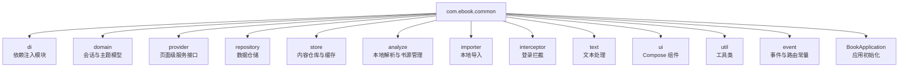

**图示来源**
- [BookApplication.kt:1-64](file://lib_book_common/src/main/java/com/ebook/common/BookApplication.kt#L1-L64)
- [IBookProvider.kt:1-23](file://lib_book_common/src/main/java/com/ebook/common/provider/IBookProvider.kt#L1-L23)
- [BookRepository.kt:1-40](file://lib_book_common/src/main/java/com/ebook/common/repository/BookRepository.kt#L1-L40)
- [BookStore.kt:1-40](file://lib_book_common/src/main/java/com/ebook/common/store/BookStore.kt#L1-L40)

**章节来源**
- [BookApplication.kt:1-64](file://lib_book_common/src/main/java/com/ebook/common/BookApplication.kt#L1-L64)
- [build.gradle.kts:1-105](file://lib_book_common/build.gradle.kts#L1-L105)

## 核心组件
本节聚焦共享库中最关键的三个抽象与实现面：Provider 接口模式、用户会话抽象、以及 `BookRepository` 数据仓储。

### Provider 接口设计模式
`provider` 包暴露的是“页面级服务”而非 Activity 或 Fragment。宿主应用（例如 `module_main`）通过 NavHost 直接组合这些 Composable 页面，并由调用处的 `NavBackStackEntry` 决定 ViewModel 作用域。

- `IBookProvider`：返回书架主页面，并允许宿主注入“前往书城”回调。空回调表示当前宿主没有书城 Tab，UI 侧据此隐藏动作而不是渲染一个不可点击按钮。
- `IFindProvider`：返回书城主页面。
- `IMeProvider`：返回个人中心主页面。
- `ILoginProvider`：登录域 SPI，仅暴露服务端登出能力；本地会话清理由 `UserSessionManager.clearSession` 集中负责。独立运行模式下登录实现不可用，调用方需容忍空实现。

这种设计的优势在于：
- 宿主与应用内各业务模块解耦。
- 页面组合方式统一为 Composable，便于测试和预览。
- 需要宿主上下文的能力以回调形式传入，避免在共享库中持有 NavController。

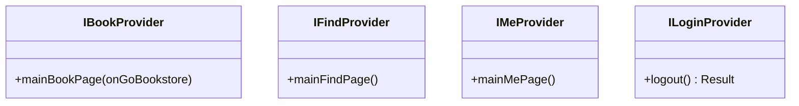

**图示来源**
- [IBookProvider.kt:1-23](file://lib_book_common/src/main/java/com/ebook/common/provider/IBookProvider.kt#L1-L23)
- [IFindProvider.kt:1-13](file://lib_book_common/src/main/java/com/ebook/common/provider/IFindProvider.kt#L1-L13)
- [IMeProvider.kt:1-13](file://lib_book_common/src/main/java/com/ebook/common/provider/IMeProvider.kt#L1-L13)
- [ILoginProvider.kt:1-19](file://lib_book_common/src/main/java/com/ebook/common/provider/ILoginProvider.kt#L1-L19)

**章节来源**
- [IBookProvider.kt:1-23](file://lib_book_common/src/main/java/com/ebook/common/provider/IBookProvider.kt#L1-L23)
- [IFindProvider.kt:1-13](file://lib_book_common/src/main/java/com/ebook/common/provider/IFindProvider.kt#L1-L13)
- [IMeProvider.kt:1-13](file://lib_book_common/src/main/java/com/ebook/common/provider/IMeProvider.kt#L1-L13)
- [ILoginProvider.kt:1-19](file://lib_book_common/src/main/java/com/ebook/common/provider/ILoginProvider.kt#L1-L19)

### 用户会话抽象
`domain` 包定义了跨认证流程共享的会话语义：

- `UserSession`：替代网络层 `LoginDTO` 作为跨模块 seam 类型，包含身份字段与刷新 token。
- `UserSessionManager`：纯 Kotlin 接口，暴露是否登录、当前会话、保存会话、轮换凭证、清除会话与获取 token 的能力。
- `AndroidUserSessionManager`：Android 实现，负责 StateFlow 内存态、SharedPreferences 持久化、TokenHolder 同步，以及与旧版 `LoginInterceptor` 兼容的双份 SP 键清理。

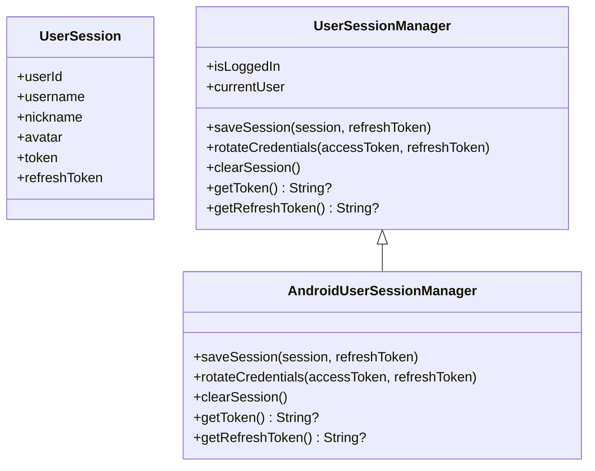

**图示来源**
- [UserSession.kt:1-17](file://lib_book_common/src/main/java/com/ebook/common/domain/UserSession.kt#L1-L17)
- [UserSessionManager.kt:1-62](file://lib_book_common/src/main/java/com/ebook/common/domain/UserSessionManager.kt#L1-L62)
- [AndroidUserSessionManager.kt:1-162](file://lib_book_common/src/main/java/com/ebook/common/domain/AndroidUserSessionManager.kt#L1-L162)

**章节来源**
- [UserSession.kt:1-17](file://lib_book_common/src/main/java/com/ebook/common/domain/UserSession.kt#L1-L17)
- [UserSessionManager.kt:1-62](file://lib_book_common/src/main/java/com/ebook/common/domain/UserSessionManager.kt#L1-L62)
- [AndroidUserSessionManager.kt:1-162](file://lib_book_common/src/main/java/com/ebook/common/domain/AndroidUserSessionManager.kt#L1-L162)

### BookRepository 数据仓储
`BookRepository` 是书架内容访问的统一入口，职责包括：

- 书架 CRUD 与阅读进度保存。
- 章节正文统一读取：经 `ChapterReader` 路由本地书与网络书，正文规范化收口在读取路径。
- 评论聚合键处理：读并集、写主键、合并与拆分。
- 阅读中换源：跨书源原地替换书架条目，并维护章节序号映射。
- 内容仓库对账：启动时清理无主目录。
- 书架变化事件发布：使用 Flow 替代旧 RxBus。

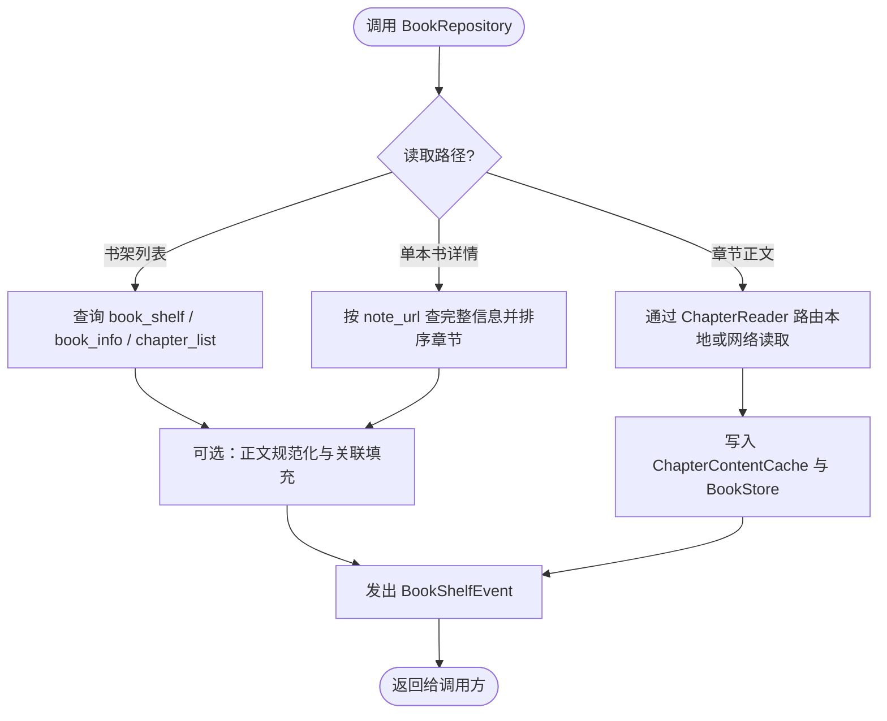

**图示来源**
- [BookRepository.kt:1-40](file://lib_book_common/src/main/java/com/ebook/common/repository/BookRepository.kt#L1-L40)
- [BookStore.kt:1-40](file://lib_book_common/src/main/java/com/ebook/common/store/BookStore.kt#L1-L40)
- [ChapterContentCache.kt:1-63](file://lib_book_common/src/main/java/com/ebook/common/store/ChapterContentCache.kt#L1-L63)

**章节来源**
- [BookRepository.kt:1-40](file://lib_book_common/src/main/java/com/ebook/common/repository/BookRepository.kt#L1-L40)

## 架构总览
从构建与运行时两个维度观察 `lib_book_common`：

- 构建层面：模块声明为 Android Library，启用 Compose、Hilt、KSP、序列化；通过 `api` 暴露下游常用依赖，使业务模块只依赖本模块即可编译通过。
- 运行时层面：`BookApplication` 负责沙箱进程门、主题装配、以及把 `ThemeModeManager` 挂到伴生对象供 Compose 重组读取。

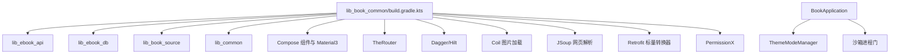

**图示来源**
- [build.gradle.kts:1-105](file://lib_book_common/build.gradle.kts#L1-L105)
- [BookApplication.kt:1-64](file://lib_book_common/src/main/java/com/ebook/common/BookApplication.kt#L1-L64)

**章节来源**
- [build.gradle.kts:1-105](file://lib_book_common/build.gradle.kts#L1-L105)
- [BookApplication.kt:1-64](file://lib_book_common/src/main/java/com/ebook/common/BookApplication.kt#L1-L64)

## 详细组件分析

### 依赖注入与模块装配
`di` 包中的 Hilt 模块分别绑定不同领域的抽象：

- `AnalyzeModule`：将 `BookSourceManager` 绑定到 `BookSourceManagerImpl`。
- `SessionModule`：将 `UserSessionManager` 绑定到 `AndroidUserSessionManager`，并将 `TokenRefresher` 绑定到 `SessionTokenRefresher`。
- `ThemeModule`：绑定主题模式管理。
- `TransactionModule`：绑定 Room 写事务执行器。
- `SandboxModule`、`ContentStoreModule`、`ImportScratch`：分别处理沙箱、内容仓库与导入暂存相关的装配。

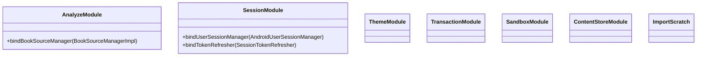

**图示来源**
- [AnalyzeModule.kt:1-18](file://lib_book_common/src/main/java/com/ebook/common/di/AnalyzeModule.kt#L1-L18)
- [SessionModule.kt:1-37](file://lib_book_common/src/main/java/com/ebook/common/di/SessionModule.kt#L1-L37)

**章节来源**
- [AnalyzeModule.kt:1-18](file://lib_book_common/src/main/java/com/ebook/common/di/AnalyzeModule.kt#L1-L18)
- [SessionModule.kt:1-37](file://lib_book_common/src/main/java/com/ebook/common/di/SessionModule.kt#L1-L37)
- [ThemeModule.kt](file://lib_book_common/src/main/java/com/ebook/common/di/ThemeModule.kt)
- [TransactionModule.kt](file://lib_book_common/src/main/java/com/ebook/common/di/TransactionModule.kt)
- [SandboxModule.kt](file://lib_book_common/src/main/java/com/ebook/common/di/SandboxModule.kt)
- [ContentStoreModule.kt](file://lib_book_common/src/main/java/com/ebook/common/di/ContentStoreModule.kt)
- [ImportScratch.kt](file://lib_book_common/src/main/java/com/ebook/common/di/ImportScratch.kt)

### 内容仓库与章节缓存
`store` 包定义了两层存储语义：

- `BookStore`：磁盘内容仓库，按 `filesDir/books/<书目录名>/cNNNNN.txt` 组织章节文件，支持导入暂存、封面写入、对账、删除整书或单章、占用统计。
- `ChapterContentCache`：内存缓存，默认容量为当前章及前后各一章，键使用 `content_ref`，按书失效时通过 `cacheMarker` 片段匹配清理。

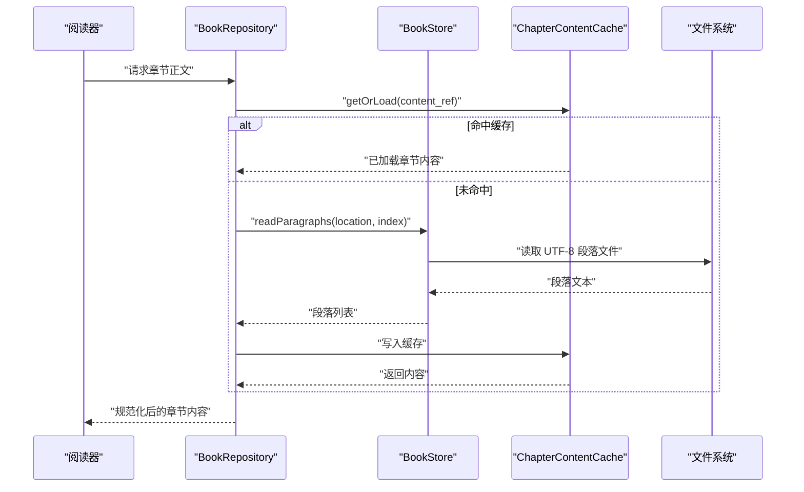

**图示来源**
- [BookStore.kt:1-200](file://lib_book_common/src/main/java/com/ebook/common/store/BookStore.kt#L1-L200)
- [ChapterContentCache.kt:1-63](file://lib_book_common/src/main/java/com/ebook/common/store/ChapterContentCache.kt#L1-L63)
- [BookRepository.kt:1-40](file://lib_book_common/src/main/java/com/ebook/common/repository/BookRepository.kt#L1-L40)

**章节来源**
- [BookStore.kt:1-200](file://lib_book_common/src/main/java/com/ebook/common/store/BookStore.kt#L1-L200)
- [ChapterContentCache.kt:1-63](file://lib_book_common/src/main/java/com/ebook/common/store/ChapterContentCache.kt#L1-L63)

### 本地书籍导入流程
`importer` 包通过协调者模式管理本地书籍导入：

- `LocalBookImporter`：负责具体书籍文件的解析与导入。
- `LocalImportCoordinator`：协调导入阶段、内容落盘、封面写入、对账与失败回滚。

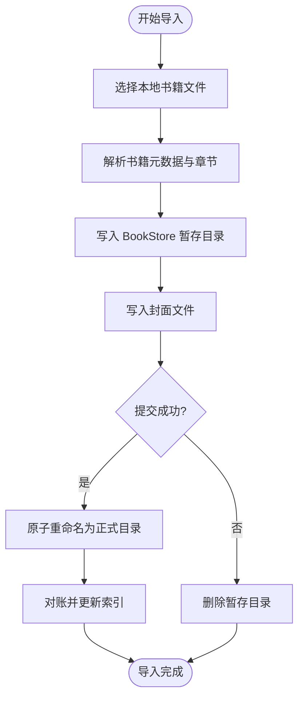

**图示来源**
- [LocalBookImporter.kt](file://lib_book_common/src/main/java/com/ebook/common/importer/LocalBookImporter.kt)
- [LocalImportCoordinator.kt](file://lib_book_common/src/main/java/com/ebook/common/importer/LocalImportCoordinator.kt)
- [BookStore.kt:1-200](file://lib_book_common/src/main/java/com/ebook/common/store/BookStore.kt#L1-L200)

**章节来源**
- [LocalBookImporter.kt](file://lib_book_common/src/main/java/com/ebook/common/importer/LocalBookImporter.kt)
- [LocalImportCoordinator.kt](file://lib_book_common/src/main/java/com/ebook/common/importer/LocalImportCoordinator.kt)

### 主题与会话的生命周期
`BookApplication` 在进程启动时执行以下关键步骤：

1. 判断是否处于沙箱进程，若是则跳过应用级初始化。
2. 安装 `AppTheme`，并根据 `ThemeModeManager` 的 `StateFlow` 决定深色模式。
3. 通过 Hilt EntryPoint 取出 `ThemeModeManager` 单例，调用 `installIntoCompanion` 使其可在非 Composable 上下文中读取。

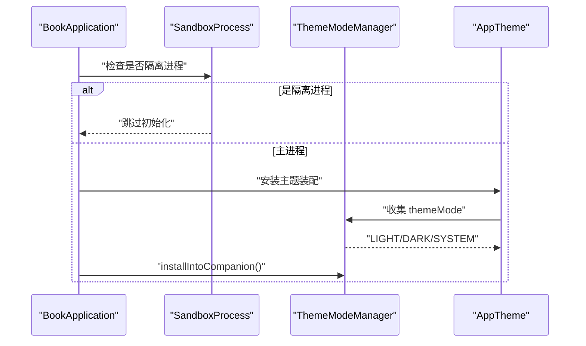

**图示来源**
- [BookApplication.kt:1-64](file://lib_book_common/src/main/java/com/ebook/common/BookApplication.kt#L1-L64)
- [ThemeModeManager.kt:1-92](file://lib_book_common/src/main/java/com/ebook/common/domain/ThemeModeManager.kt#L1-L92)

**章节来源**
- [BookApplication.kt:1-64](file://lib_book_common/src/main/java/com/ebook/common/BookApplication.kt#L1-L64)
- [ThemeModeManager.kt:1-92](file://lib_book_common/src/main/java/com/ebook/common/domain/ThemeModeManager.kt#L1-L92)

### UI 组件与共享视觉语言
`ui` 包收敛跨模块 Compose 组件与绘图辅助：

- `CommonPainters`：提供默认书籍封面占位 Painter，用于 Coil 占位与错误回退。
- `Avatar`：头像组件，处理 URL 为空、加载中、加载失败三态。
- `BookCover`：书籍封面组件，基于 Coil AsyncImage，采用 Crop 缩放避免变形。

ADR-0006 明确了共享 UI 组件的收录判据：组件属于本应用且被至少两个业务模块使用时上浮至 `lib_book_common`；与书籍领域无关的通用工具不归入本包。

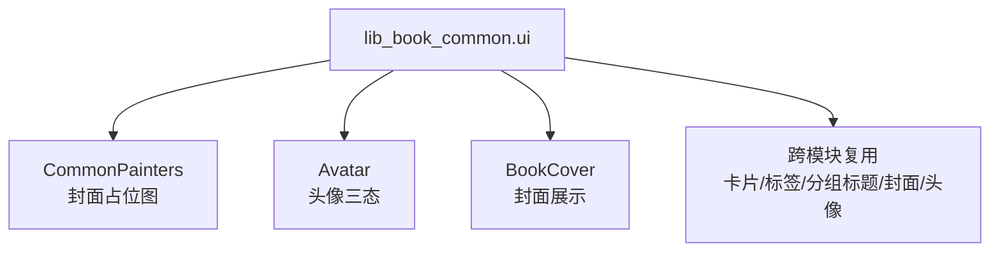

**图示来源**
- [CommonPainters.kt:1-38](file://lib_book_common/src/main/java/com/ebook/common/ui/CommonPainters.kt#L1-L38)
- [Avatar.kt](file://lib_book_common/src/main/java/com/ebook/common/ui/Avatar.kt)
- [BookCover.kt](file://lib_book_common/src/main/java/com/ebook/common/ui/BookCover.kt)
- [0006-shared-ui-components-in-lib-book-common.md:1-28](file://docs/adr/0006-shared-ui-components-in-lib-book-common.md#L1-L28)

**章节来源**
- [CommonPainters.kt:1-38](file://lib_book_common/src/main/java/com/ebook/common/ui/CommonPainters.kt#L1-L38)
- [Avatar.kt](file://lib_book_common/src/main/java/com/ebook/common/ui/Avatar.kt)
- [BookCover.kt](file://lib_book_common/src/main/java/com/ebook/common/ui/BookCover.kt)
- [0006-shared-ui-components-in-lib-book-common.md:1-28](file://docs/adr/0006-shared-ui-components-in-lib-book-common.md#L1-L28)

### 文本处理与编码探测
`text` 包提供与正文质量相关的工具：

- `EncodingProbe`：探测文本编码。
- `StrictTextReader`：严格文本读取，避免乱码或截断。
- `TextNormalizer`：正文规范化，去除多余空白、统一段落分隔。

这些工具被 `BookRepository` 与本地解析器共同使用，确保 UI 看到的正文一致、稳定。

**章节来源**
- [EncodingProbe.kt](file://lib_book_common/src/main/java/com/ebook/common/text/EncodingProbe.kt)
- [StrictTextReader.kt](file://lib_book_common/src/main/java/com/ebook/common/text/StrictTextReader.kt)
- [TextNormalizer.kt](file://lib_book_common/src/main/java/com/ebook/common/text/TextNormalizer.kt)

### 工具类与事件常量
`util` 与 `event` 包提供横切能力：

- `DateUtil`、`FormatSize`、`FileTree`：日期格式化、体积显示、树形文件大小统计。
- `SPUtil`：SharedPreferences 封装，供会话、登录、阅读恢复等场景使用。
- `FailureReport`：失败报告汇总。
- `KeyCode`、`RouteArgs`、`ErrorCode`、`Constant`：全局事件键、路由参数与错误码。

**章节来源**
- [DateUtil.kt](file://lib_book_common/src/main/java/com/ebook/common/util/DateUtil.kt)
- [SPUtil.kt](file://lib_book_common/src/main/java/com/ebook/common/util/SPUtil.kt)
- [FormatSize.kt](file://lib_book_common/src/main/java/com/ebook/common/util/FormatSize.kt)
- [FileTree.kt](file://lib_book_common/src/main/java/com/ebook/common/util/FileTree.kt)
- [FailureReport.kt](file://lib_book_common/src/main/java/com/ebook/common/util/FailureReport.kt)
- [ErrorCode.kt](file://lib_book_common/src/main/java/com/ebook/common/event/ErrorCode.kt)
- [KeyCode.kt](file://lib_book_common/src/main/java/com/ebook/common/event/KeyCode.kt)
- [RouteArgs.kt](file://lib_book_common/src/main/java/com/ebook/common/event/RouteArgs.kt)
- [Constant.kt](file://lib_book_common/src/main/java/com/ebook/common/event/Constant.kt)

## 依赖关系分析
`lib_book_common` 的 Gradle 依赖体现其定位：既依赖上层 SDK 与第三方库，又向上游开放大量 API，使业务模块不必重复声明。

```mermaid
graph TB
    Lib["lib_book_common"] --> Common["lib_common"]
    Lib --> Api["lib_ebook_api"]
    Lib --> Db["lib_ebook_db"]
    Lib --> Source["lib_book_source"]
    Lib --> Core["androidx.core.ktx"]
    Lib --> Lifecycle["lifecycle/viewmodel/runtime"]
    Lib --> Compose["compose/material3/foundation/runtime"]
    Lib --> Coil["coil.kt.compose"]
    Lib --> Router["router"]
    Lib --> Hilt["dagger/hilt"]
    Lib --> Room["room.runtime"]
    Lib --> JSoup["jsoup"]
    Lib --> Retrofit["retrofit.converter.scalars"]
    Lib --> Perm["permissionx"]
```

**图示来源**
- [build.gradle.kts:1-105](file://lib_book_common/build.gradle.kts#L1-L105)

### 组件耦合关系
- `BookRepository` 耦合 DAO、`BookStore`、`ChapterContentCache`、`BookSourceManager`、`WriteTransactionRunner`。
- `AndroidUserSessionManager` 耦合 `TokenHolder`、`ProfileRepository`、`SPUtil`。
- `BookStore` 与 `ChapterContentCache` 通过 `content_ref` 与 `cacheMarker` 建立弱耦合。
- `BookApplication` 与 `ThemeModeManager` 通过 Hilt EntryPoint 解耦装配顺序。

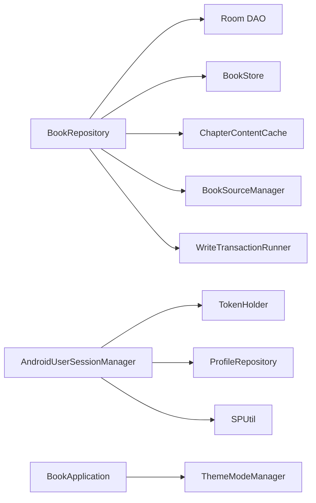

**图示来源**
- [BookRepository.kt:1-40](file://lib_book_common/src/main/java/com/ebook/common/repository/BookRepository.kt#L1-L40)
- [AndroidUserSessionManager.kt:1-162](file://lib_book_common/src/main/java/com/ebook/common/domain/AndroidUserSessionManager.kt#L1-L162)
- [BookStore.kt:1-200](file://lib_book_common/src/main/java/com/ebook/common/store/BookStore.kt#L1-L200)
- [BookApplication.kt:1-64](file://lib_book_common/src/main/java/com/ebook/common/BookApplication.kt#L1-L64)

**章节来源**
- [build.gradle.kts:1-105](file://lib_book_common/build.gradle.kts#L1-L105)
- [BookRepository.kt:1-40](file://lib_book_common/src/main/java/com/ebook/common/repository/BookRepository.kt#L1-L40)
- [AndroidUserSessionManager.kt:1-162](file://lib_book_common/src/main/java/com/ebook/common/domain/AndroidUserSessionManager.kt#L1-L162)
- [BookStore.kt:1-200](file://lib_book_common/src/main/java/com/ebook/common/store/BookStore.kt#L1-L200)
- [BookApplication.kt:1-64](file://lib_book_common/src/main/java/com/ebook/common/BookApplication.kt#L1-L64)

## 性能与可维护性
### 性能特征
- `BookStore.storageUsage` 一次遍历得出字节数与书目数，避免两次 IO。
- `ChapterContentCache` 使用带访问序的 LinkedHashMap 实现 LRU，默认容量覆盖当前章及前后章节。
- `ReaderResumeStore` 使用轻量 SP 记录异常退出标记，避免为单一开关引入数据库实体。
- `BookRepository` 在读取全部书籍时显式按章节序号排序，修复因物理 rowid 跳变导致的章节错序。

### 可维护性原则
- ADR-0015 明确：无调用方即死代码，应删除而非迁移；单模块能力下沉到业务模块；专项库（如 `lib_book_source`）保持独立构建形态。
- ADR-0006 明确：共享 UI 组件仅限应用内复用，不引入过度扩展图标；封面组件统一使用 Crop；头像三态收口在组件内部。

**章节来源**
- [BookStore.kt:1-200](file://lib_book_common/src/main/java/com/ebook/common/store/BookStore.kt#L1-L200)
- [ChapterContentCache.kt:1-63](file://lib_book_common/src/main/java/com/ebook/common/store/ChapterContentCache.kt#L1-L63)
- [ReaderResumeStore.kt:1-68](file://lib_book_common/src/main/java/com/ebook/common/store/ReaderResumeStore.kt#L1-L68)
- [0015-common-lib-boundary.md:1-51](file://docs/adr/0015-common-lib-boundary.md#L1-L51)
- [0006-shared-ui-components-in-lib-book-common.md:1-28](file://docs/adr/0006-shared-ui-components-in-lib-book-common.md#L1-L28)

## 在业务模块中使用共享组件
### 引用共享库
业务模块通常通过 Gradle 依赖引入 `lib_book_common`，从而获得：

- Provider 接口：用于宿主组合书架、书城、个人中心页面。
- 数据仓储：通过 `BookRepository` 访问书架、评论、换源与内容仓库。
- 领域模型：通过 `UserSessionManager` 管理登录态与 token。
- UI 组件：使用 `BookCover`、`Avatar`、`CommonPainters` 等共享 Compose 组件。
- 工具类：使用 `SPUtil`、`FormatSize`、`FileTree`、`FailureReport` 等。

### 使用 Provider 接口
宿主应用通过 Hilt 或其他装配机制获取 `IBookProvider`、`IFindProvider`、`IMeProvider`，并在 NavHost 中组合对应 Composable 页面。对于 `IBookProvider.mainBookPage`，宿主应传入“前往书城”回调；若当前宿主没有书城 Tab，则传 null，UI 侧不渲染该动作。

### 使用 BookRepository
业务 ViewModel 注入 `BookRepository`，并通过其 Flow 或 suspend 方法获取书架数据、保存阅读进度、触发换源或评论内容变更。仓储内部负责 DAO 调用、事务、缓存与事件发布，调用方无需关心 Room 表结构。

### 使用用户会话
业务模块通过 `UserSessionManager` 订阅 `isLoggedIn` 与 `currentUser`，并在登录成功后调用 `saveSession`；登出时调用 `clearSession`，由实现类统一清理内存、SP、TokenHolder 与 ProfileRepository 状态。

### 使用内容与缓存
- 下载或导入完成后，由仓储或服务端调用 `BookStore.commitImport` 与 `reconcile`。
- 阅读器翻页热路径优先走 `ChapterContentCache.getOrLoad`，减少重复 IO。
- 换源或删除书籍后，调用 `invalidateBook` 失效内存缓存。

### 使用 UI 组件
- 书架条目与搜索结果统一使用共享卡片与封面组件。
- 头像组件自动处理空 URL、加载中与失败回退。
- 封面组件使用 Crop 缩放，避免非 3:4 比例失真。

**章节来源**
- [IBookProvider.kt:1-23](file://lib_book_common/src/main/java/com/ebook/common/provider/IBookProvider.kt#L1-L23)
- [IFindProvider.kt:1-13](file://lib_book_common/src/main/java/com/ebook/common/provider/IFindProvider.kt#L1-L13)
- [IMeProvider.kt:1-13](file://lib_book_common/src/main/java/com/ebook/common/provider/IMeProvider.kt#L1-L13)
- [UserSessionManager.kt:1-62](file://lib_book_common/src/main/java/com/ebook/common/domain/UserSessionManager.kt#L1-L62)
- [BookStore.kt:1-200](file://lib_book_common/src/main/java/com/ebook/common/store/BookStore.kt#L1-L200)
- [ChapterContentCache.kt:1-63](file://lib_book_common/src/main/java/com/ebook/common/store/ChapterContentCache.kt#L1-L63)
- [CommonPainters.kt:1-38](file://lib_book_common/src/main/java/com/ebook/common/ui/CommonPainters.kt#L1-L38)

## 故障排查
### 阅读进度越界
当书架目录行数与阅读器内存目录不一致时，`BookRepository.saveProgress` 会将进度钳制到有效范围并记录日志。常见原因包括从搜索直接开读、远端目录比本地多一章，或章节列表排序异常。

### 网络书目录名导致缓存误删
`BookStore` 对含非法字符的 bookId 取 md5 作为目录名；如果调用方自行拼接目录名而不经过 `dirName`，会导致对账逻辑把网络书缓存当作无主目录删除。排查时应确认所有读写都经过 `BookStore` 提供的 API。

### 登录状态不一致
`AndroidUserSessionManager.clearSession` 会一次性清理内存、user_session SP、spUtils 兼容键与 ProfileRepository 状态。若仍出现“已登出但昵称仍在”，应检查是否有其他路径单独重置了 profile 流。

### 沙箱进程误初始化
若沙箱进程仍执行主题装配或读取 SharedPreferences，应检查 `SandboxProcess.isInIsolatedProcess` 分支是否生效。`BookApplication` 在沙箱进程中应直接返回。

### 共享 UI 组件视觉差异
若业务模块仍使用自绘卡片或头像，应改为 `CommonCard`、`InfoChip`、`BookCover`、`Avatar`。ADR-0006 强调组件语义属于本应用时才上浮到 `lib_book_common`，不应混入领域无关通用工具。

**章节来源**
- [BookRepository.kt:1-40](file://lib_book_common/src/main/java/com/ebook/common/repository/BookRepository.kt#L1-L40)
- [BookStore.kt:1-200](file://lib_book_common/src/main/java/com/ebook/common/store/BookStore.kt#L1-L200)
- [AndroidUserSessionManager.kt:1-162](file://lib_book_common/src/main/java/com/ebook/common/domain/AndroidUserSessionManager.kt#L1-L162)
- [BookApplication.kt:1-64](file://lib_book_common/src/main/java/com/ebook/common/BookApplication.kt#L1-L64)
- [0006-shared-ui-components-in-lib-book-common.md:1-28](file://docs/adr/0006-shared-ui-components-in-lib-book-common.md#L1-L28)

## 结论
`lib_book_common` 是本项目阅读能力的“公共地基”。它通过 Provider 接口解耦宿主与业务模块，通过 `BookRepository` 统一数据访问边界，通过 `BookStore` 与 `ChapterContentCache` 规范内容存储与缓存，通过 `UserSessionManager` 与 `ThemeModeManager` 收敛会话与主题状态，并通过 `ui` 与 `util` 包沉淀跨模块复用的视觉与工具能力。

扩展该模块时应遵循两条判据：能力是否受书籍领域约束；是否被多个模块共用。若答案均为“是”，则放入 `lib_book_common`；若仅为前者，则下沉到唯一使用者；若仅为后者，则考虑上移到 `lib_common`；若无调用方，则直接删除。这样可避免共享库再次退化为垃圾场，并保持宿主、业务模块与专项库之间的清晰边界。