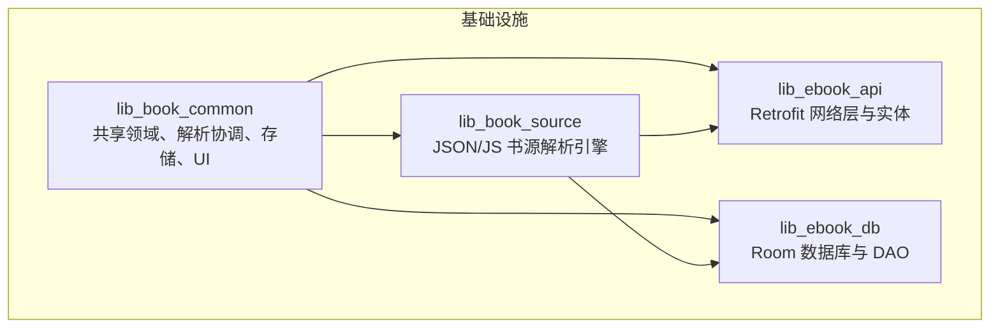
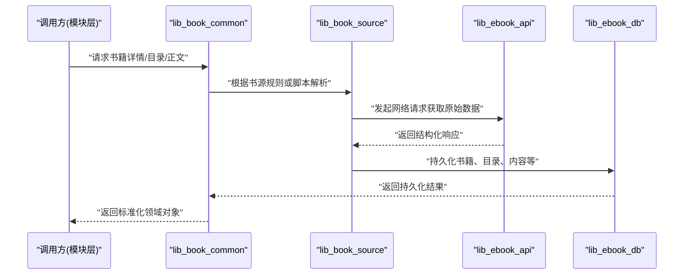
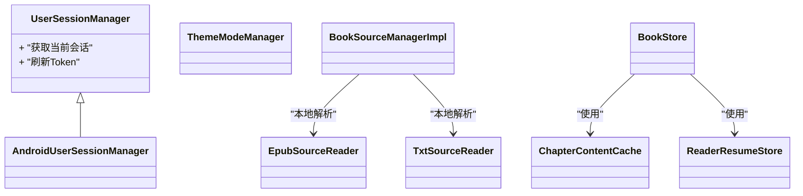
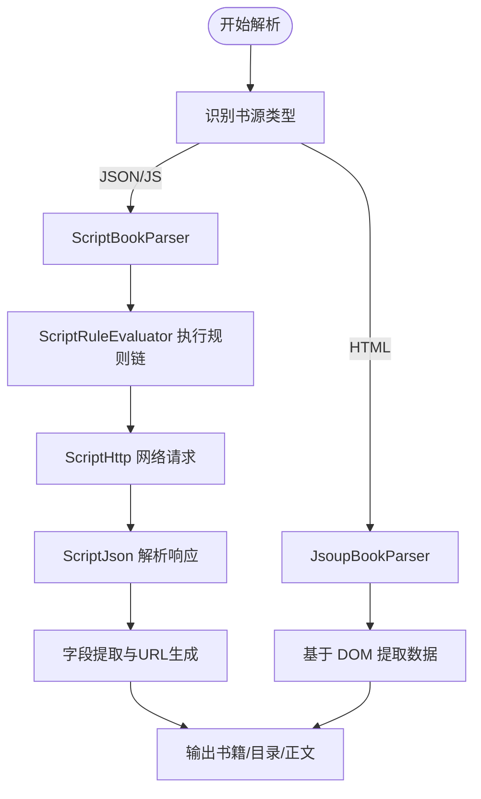
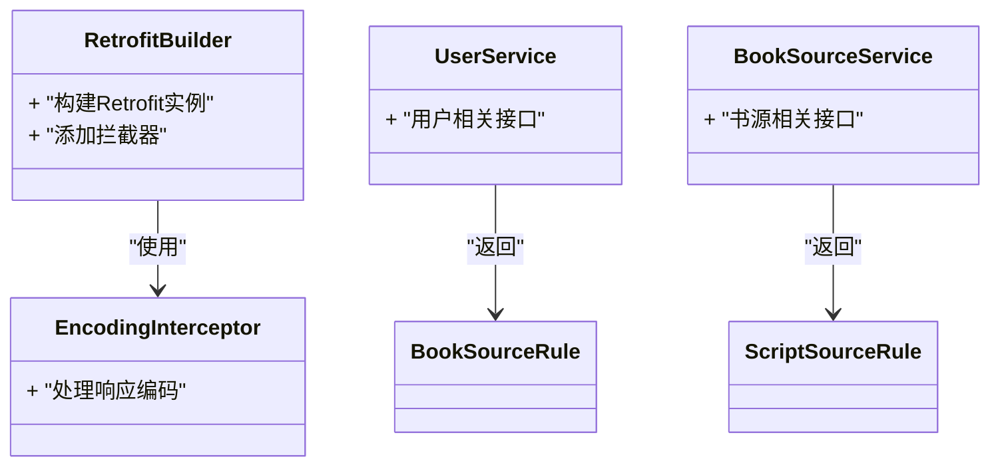
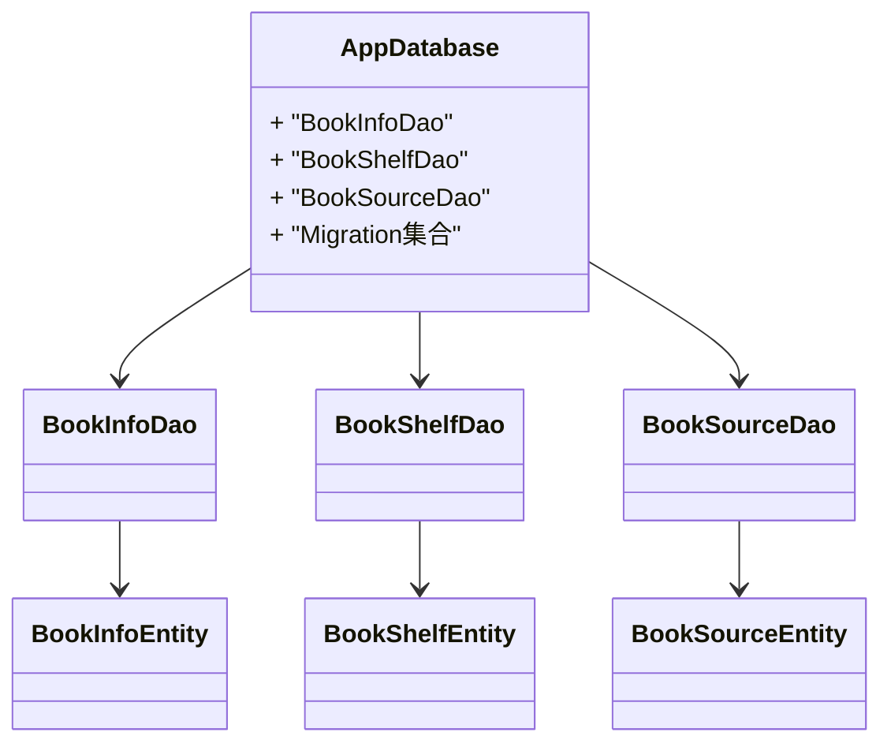
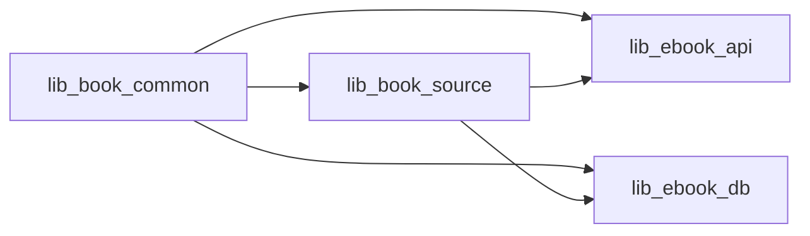

# 基础设施模块

<cite>
**本文引用的文件**
- [lib_book_common/BookApplication.kt](file://lib_book_common/src/main/java/com/ebook/common/BookApplication.kt)
- [lib_book_common/di/AnalyzeModule.kt](file://lib_book_common/src/main/java/com/ebook/common/di/AnalyzeModule.kt)
- [lib_book_common/di/SandboxModule.kt](file://lib_book_common/src/main/java/com/ebook/common/di/SandboxModule.kt)
- [lib_book_common/di/ThemeModule.kt](file://lib_book_common/src/main/java/com/ebook/common/di/ThemeModule.kt)
- [lib_book_common/di/ContentStoreModule.kt](file://lib_book_common/src/main/java/com/ebook/common/di/ContentStoreModule.kt)
- [lib_book_common/domain/UserSessionManager.kt](file://lib_book_common/src/main/java/com/ebook/common/domain/UserSessionManager.kt)
- [lib_book_common/domain/AndroidUserSessionManager.kt](file://lib_book_common/src/main/java/com/ebook/common/domain/AndroidUserSessionManager.kt)
- [lib_book_common/domain/ThemeModeManager.kt](file://lib_book_common/src/main/java/com/ebook/common/domain/ThemeModeManager.kt)
- [lib_book_common/repository/BookRepository.kt](file://lib_book_common/src/main/java/com/ebook/common/repository/BookRepository.kt)
- [lib_book_common/store/BookStore.kt](file://lib_book_common/src/main/java/com/ebook/common/store/BookStore.kt)
- [lib_book_common/store/ChapterContentCache.kt](file://lib_book_common/src/main/java/com/ebook/common/store/ChapterContentCache.kt)
- [lib_book_common/store/ReaderResumeStore.kt](file://lib_book_common/src/main/java/com/ebook/common/store/ReaderResumeStore.kt)
- [lib_book_common/analyze/source/BookSourceManagerImpl.kt](file://lib_book_common/src/main/java/com/ebook/common/analyze/source/BookSourceManagerImpl.kt)
- [lib_book_common/analyze/local/EpubSourceReader.kt](file://lib_book_common/src/main/java/com/ebook/common/analyze/local/EpubSourceReader.kt)
- [lib_book_common/analyze/local/TxtSourceReader.kt](file://lib_book_common/src/main/java/com/ebook/common/analyze/local/TxtSourceReader.kt)
- [lib_book_common/ui/CommonUiComponents.kt](file://lib_book_common/src/main/java/com/ebook/common/ui/CommonUiComponents.kt)
- [lib_book_source/analyze/ScriptBookParser.kt](file://lib_book_source/src/main/java/com/ebook/source/analyze/ScriptBookParser.kt)
- [lib_book_source/analyze/JsoupBookParser.kt](file://lib_book_source/src/main/java/com/ebook/source/analyze/JsoupBookParser.kt)
- [lib_book_source/analyze/BookParser.kt](file://lib_book_source/src/main/java/com/ebook/source/analyze/BookParser.kt)
- [lib_book_source/script/ScriptRuleEvaluator.kt](file://lib_book_source/src/main/java/com/ebook/source/script/ScriptRuleEvaluator.kt)
- [lib_book_source/script/ScriptHttp.kt](file://lib_book_source/src/main/java/com/ebook/source/script/ScriptHttp.kt)
- [lib_book_source/script/ScriptJson.kt](file://lib_book_source/src/main/java/com/ebook/source/script/ScriptJson.kt)
- [lib_book_source/script/ScriptExplore.kt](file://lib_book_source/src/main/java/com/ebook/source/script/ScriptExplore.kt)
- [lib_book_source/script/ScriptTocPager.kt](file://lib_book_source/src/main/java/com/ebook/source/script/ScriptTocPager.kt)
- [lib_book_source/sandbox/JsSandboxHost.kt](file://lib_book_source/src/main/java/com/ebook/source/sandbox/JsSandboxHost.kt)
- [lib_book_source/sandbox/SandboxService.kt](file://lib_book_source/src/main/java/com/ebook/source/sandbox/SandboxService.kt)
- [lib_book_source/sandbox/SandboxProcess.kt](file://lib_book_source/src/main/java/com/ebook/source/sandbox/SandboxProcess.kt)
- [lib_book_source/sandbox/JsRuntimeBridge.kt](file://lib_book_source/src/main/java/com/ebook/source/sandbox/JsRuntimeBridge.kt)
- [lib_book_source/sandbox/QuickJsNative.kt](file://lib_book_source/src/main/java/com/ebook/source/sandbox/QuickJsNative.kt)
- [lib_ebook_api/RetrofitBuilder.kt](file://lib_ebook_api/src/main/java/com/ebook/api/RetrofitBuilder.kt)
- [lib_ebook_api/config/API.kt](file://lib_ebook_api/src/main/java/com/ebook/api/config/API.kt)
- [lib_ebook_api/service/user/UserService.kt](file://lib_ebook_api/src/main/java/com/ebook/api/service/user/UserService.kt)
- [lib_ebook_api/service/source/BookSourceService.kt](file://lib_ebook_api/src/main/java/com/ebook/api/service/source/BookSourceService.kt)
- [lib_ebook_api/entity/BookSourceRule.kt](file://lib_ebook_api/src/main/java/com/ebook/api/entity/BookSourceRule.kt)
- [lib_ebook_api/entity/ScriptSourceRule.kt](file://lib_ebook_api/src/main/java/com/ebook/api/entity/ScriptSourceRule.kt)
- [lib_ebook_api/intercepter/EncodingInterceptor.kt](file://lib_ebook_api/src/main/java/com/ebook/api/intercepter/EncodingInterceptor.kt)
- [lib_ebook_db/AppDatabase.kt](file://lib_ebook_db/src/main/java/com/ebook/db/AppDatabase.kt)
- [lib_ebook_db/di/DatabaseModule.kt](file://lib_ebook_db/src/main/java/com/ebook/db/di/DatabaseModule.kt)
- [lib_ebook_db/dao/BookInfoDao.kt](file://lib_ebook_db/src/main/java/com/ebook/db/dao/BookInfoDao.kt)
- [lib_ebook_db/dao/BookShelfDao.kt](file://lib_ebook_db/src/main/java/com/ebook/db/dao/BookShelfDao.kt)
- [lib_ebook_db/dao/BookSourceDao.kt](file://lib_ebook_db/src/main/java/com/ebook/db/dao/BookSourceDao.kt)
- [lib_ebook_db/entity/BookInfoEntity.kt](file://lib_ebook_db/src/main/java/com/ebook/db/entity/BookInfoEntity.kt)
- [lib_ebook_db/entity/BookShelfEntity.kt](file://lib_ebook_db/src/main/java/com/ebook/db/entity/BookShelfEntity.kt)
- [lib_ebook_db/entity/BookSourceEntity.kt](file://lib_ebook_db/src/main/java/com/ebook/db/entity/BookSourceEntity.kt)
</cite>

## 目录
1. [引言](#引言)
2. [项目结构](#项目结构)
3. [核心组件](#核心组件)
4. [架构总览](#架构总览)
5. [详细组件分析](#详细组件分析)
6. [依赖关系分析](#依赖关系分析)
7. [性能考量](#性能考量)
8. [故障排查指南](#故障排查指南)
9. [结论](#结论)

## 引言
本文件面向“基础设施层”四个关键模块：
- lib_book_common：跨模块共享领域模型、Provider 接口、解析协调、存储与 UI 组件。
- lib_book_source：书源解析引擎，支持 JSON 规则与 JavaScript 脚本执行，并实现沙箱隔离。
- lib_ebook_api：网络层 API 定义、Retrofit 配置、数据实体与服务接口。
- lib_ebook_db：Room 数据库实体、DAO、迁移与 DI 装配。

文档重点说明各模块职责边界、技术选型、扩展点、核心数据流与模块间依赖，帮助读者快速理解并在不侵入上层业务的前提下扩展能力。

## 项目结构
四个基础设施模块采用 Android Library 形式组织，遵循清晰的分层命名空间：
- lib_book_common 提供应用级公共能力与跨模块契约；
- lib_book_source 专注书源解析与脚本运行；
- lib_ebook_api 聚焦网络契约与 DTO；
- lib_ebook_db 聚焦本地持久化。

图表来源
- [lib_book_common/BookApplication.kt](file://lib_book_common/src/main/java/com/ebook/common/BookApplication.kt)
- [lib_book_source/analyze/ScriptBookParser.kt](file://lib_book_source/src/main/java/com/ebook/source/analyze/ScriptBookParser.kt)
- [lib_ebook_api/RetrofitBuilder.kt](file://lib_ebook_api/src/main/java/com/ebook/api/RetrofitBuilder.kt)
- [lib_ebook_db/AppDatabase.kt](file://lib_ebook_db/src/main/java/com/ebook/db/AppDatabase.kt)

章节来源
- [lib_book_common/BookApplication.kt](file://lib_book_common/src/main/java/com/ebook/common/BookApplication.kt)

## 核心组件
- 共享领域与 Provider 契约
  - UserSessionManager 及其 Android 实现封装用户会话与 Token 刷新策略；IBookProvider、IFindProvider、IMeProvider、ILoginProvider 暴露跨模块服务入口，使业务模块通过约定接入而不直接耦合具体实现。
  - ThemeModeManager 统一主题模式状态管理。
- 解析协调与本地内容解析
  - BookSourceManagerImpl 协调 JSON 规则书源与 JS 脚本书源；EpubSourceReader/TxtSourceReader 负责本地电子书解析。
- 缓存与读取恢复
  - BookStore 作为通用内容读写门面；ChapterContentCache 按章节缓存内容；ReaderResumeStore 维护阅读进度。
- 网络 API 定义
  - RetrofitBuilder 集中构建 Retrofit 实例；API 常量集中管理；UserService/BookSourceService 等描述 HTTP 契约；EncodingInterceptor 处理编码问题。
- 数据库定义
  - AppDatabase 是 Room 数据库入口；BookInfoDao/BookShelfDao/BookSourceDao 等提供类型安全访问；BookInfoEntity/BookShelfEntity/BookSourceEntity 映射表结构。

章节来源
- [lib_book_common/domain/UserSessionManager.kt](file://lib_book_common/src/main/java/com/ebook/common/domain/UserSessionManager.kt)
- [lib_book_common/domain/AndroidUserSessionManager.kt](file://lib_book_common/src/main/java/com/ebook/common/domain/AndroidUserSessionManager.kt)
- [lib_book_common/domain/ThemeModeManager.kt](file://lib_book_common/src/main/java/com/ebook/common/domain/ThemeModeManager.kt)
- [lib_book_common/analyze/source/BookSourceManagerImpl.kt](file://lib_book_common/src/main/java/com/ebook/common/analyze/source/BookSourceManagerImpl.kt)
- [lib_book_common/analyze/local/EpubSourceReader.kt](file://lib_book_common/src/main/java/com/ebook/common/analyze/local/EpubSourceReader.kt)
- [lib_book_common/analyze/local/TxtSourceReader.kt](file://lib_book_common/src/main/java/com/ebook/common/analyze/local/TxtSourceReader.kt)
- [lib_book_common/store/BookStore.kt](file://lib_book_common/src/main/java/com/ebook/common/store/BookStore.kt)
- [lib_book_common/store/ChapterContentCache.kt](file://lib_book_common/src/main/java/com/ebook/common/store/ChapterContentCache.kt)
- [lib_book_common/store/ReaderResumeStore.kt](file://lib_book_common/src/main/java/com/ebook/common/store/ReaderResumeStore.kt)
- [lib_ebook_api/RetrofitBuilder.kt](file://lib_ebook_api/src/main/java/com/ebook/api/RetrofitBuilder.kt)
- [lib_ebook_api/config/API.kt](file://lib_ebook_api/src/main/java/com/ebook/api/config/API.kt)
- [lib_ebook_api/intercepter/EncodingInterceptor.kt](file://lib_ebook_api/src/main/java/com/ebook/api/intercepter/EncodingInterceptor.kt)
- [lib_ebook_db/AppDatabase.kt](file://lib_ebook_db/src/main/java/com/ebook/db/AppDatabase.kt)
- [lib_ebook_db/dao/BookInfoDao.kt](file://lib_ebook_db/src/main/java/com/ebook/db/dao/BookInfoDao.kt)
- [lib_ebook_db/dao/BookShelfDao.kt](file://lib_ebook_db/src/main/java/com/ebook/db/dao/BookShelfDao.kt)
- [lib_ebook_db/dao/BookSourceDao.kt](file://lib_ebook_db/src/main/java/com/ebook/db/dao/BookSourceDao.kt)
- [lib_ebook_db/entity/BookInfoEntity.kt](file://lib_ebook_db/src/main/java/com/ebook/db/entity/BookInfoEntity.kt)
- [lib_ebook_db/entity/BookShelfEntity.kt](file://lib_ebook_db/src/main/java/com/ebook/db/entity/BookShelfEntity.kt)
- [lib_ebook_db/entity/BookSourceEntity.kt](file://lib_ebook_db/src/main/java/com/ebook/db/entity/BookSourceEntity.kt)

## 架构总览
整体数据流从“书源定义”出发，经“解析引擎”得到书籍元信息、目录与正文，再写入“本地数据库”，并通过“缓存与恢复”提升阅读体验。网络侧由 lib_ebook_api 抽象出统一接口，被 lib_book_common 的仓库层调用。

图表来源
- [lib_book_common/repository/BookRepository.kt](file://lib_book_common/src/main/java/com/ebook/common/repository/BookRepository.kt)
- [lib_book_source/analyze/ScriptBookParser.kt](file://lib_book_source/src/main/java/com/ebook/source/analyze/ScriptBookParser.kt)
- [lib_ebook_api/RetrofitBuilder.kt](file://lib_ebook_api/src/main/java/com/ebook/api/RetrofitBuilder.kt)
- [lib_ebook_db/AppDatabase.kt](file://lib_ebook_db/src/main/java/com/ebook/db/AppDatabase.kt)

## 详细组件分析

### lib_book_common：共享基础层
职责
- 提供跨模块契约（Provider）与领域模型（用户会话、主题模式）。
- 编排本地与远端书源的解析流程。
- 提供统一的存储门面与章节缓存、阅读恢复。
- 提供可复用的 Compose UI 组件与预览工具。

关键设计
- 以 Provider 接口解耦模块间通信，避免循环依赖；通过 Hilt Module 注入具体实现。
- 解析协调器将 JSON 规则书源与 JS 脚本书源统一到一致的输入输出协议，便于扩展新解析后端。
- 存储门面屏蔽底层差异，对外暴露稳定的领域语义。

扩展点
- 新增 Provider 实现以接入新的业务域；
- 新增本地解析器（如 Epub/Txt 变体）；
- 新增 UI 组件或主题扩展。

图表来源
- [lib_book_common/domain/UserSessionManager.kt](file://lib_book_common/src/main/java/com/ebook/common/domain/UserSessionManager.kt)
- [lib_book_common/domain/AndroidUserSessionManager.kt](file://lib_book_common/src/main/java/com/ebook/common/domain/AndroidUserSessionManager.kt)
- [lib_book_common/domain/ThemeModeManager.kt](file://lib_book_common/src/main/java/com/ebook/common/domain/ThemeModeManager.kt)
- [lib_book_common/analyze/source/BookSourceManagerImpl.kt](file://lib_book_common/src/main/java/com/ebook/common/analyze/source/BookSourceManagerImpl.kt)
- [lib_book_common/analyze/local/EpubSourceReader.kt](file://lib_book_common/src/main/java/com/ebook/common/analyze/local/EpubSourceReader.kt)
- [lib_book_common/analyze/local/TxtSourceReader.kt](file://lib_book_common/src/main/java/com/ebook/common/analyze/local/TxtSourceReader.kt)
- [lib_book_common/store/BookStore.kt](file://lib_book_common/src/main/java/com/ebook/common/store/BookStore.kt)
- [lib_book_common/store/ChapterContentCache.kt](file://lib_book_common/src/main/java/com/ebook/common/store/ChapterContentCache.kt)
- [lib_book_common/store/ReaderResumeStore.kt](file://lib_book_common/src/main/java/com/ebook/common/store/ReaderResumeStore.kt)

章节来源
- [lib_book_common/domain/UserSessionManager.kt](file://lib_book_common/src/main/java/com/ebook/common/domain/UserSessionManager.kt)
- [lib_book_common/domain/AndroidUserSessionManager.kt](file://lib_book_common/src/main/java/com/ebook/common/domain/AndroidUserSessionManager.kt)
- [lib_book_common/domain/ThemeModeManager.kt](file://lib_book_common/src/main/java/com/ebook/common/domain/ThemeModeManager.kt)
- [lib_book_common/analyze/source/BookSourceManagerImpl.kt](file://lib_book_common/src/main/java/com/ebook/common/analyze/source/BookSourceManagerImpl.kt)
- [lib_book_common/analyze/local/EpubSourceReader.kt](file://lib_book_common/src/main/java/com/ebook/common/analyze/local/EpubSourceReader.kt)
- [lib_book_common/analyze/local/TxtSourceReader.kt](file://lib_book_common/src/main/java/com/ebook/common/analyze/local/TxtSourceReader.kt)
- [lib_book_common/store/BookStore.kt](file://lib_book_common/src/main/java/com/ebook/common/store/BookStore.kt)
- [lib_book_common/store/ChapterContentCache.kt](file://lib_book_common/src/main/java/com/ebook/common/store/ChapterContentCache.kt)
- [lib_book_common/store/ReaderResumeStore.kt](file://lib_book_common/src/main/java/com/ebook/common/store/ReaderResumeStore.kt)
- [lib_book_common/ui/CommonUiComponents.kt](file://lib_book_common/src/main/java/com/ebook/common/ui/CommonUiComponents.kt)

### lib_book_source：书源解析引擎
职责
- 解析 JSON 规则书源与 JavaScript 脚本书源，统一产出书籍、目录、正文等标准结构。
- 为脚本提供受限的网络、JSON、DOM 与表达式能力。
- 通过独立进程沙箱隔离不可信脚本执行。

关键技术
- ScriptBookParser/JsoupBookParser 分别对应 JS 与 HTML DOM 两种解析路径。
- ScriptRuleEvaluator 解析并执行规则链，结合 RuleNode/RuleValue/RuleSplitter/Interpolation 等组件完成字段提取与 URL 拼装。
- ScriptHttp/ScriptJson/ScriptExplore/ScriptTocPager 为脚本暴露的能力域。
- JsSandboxHost/SandboxService/SandboxProcess/JsRuntimeBridge/QuickJsNative 组成沙箱运行时，限制计算资源、网络访问与宿主交互。

扩展点
- 新增规则后端（例如 JsonPathBackend/RegexBackend 已体现多后端思想），或新增脚本内置对象。
- 扩展沙箱允许列表或桥接能力，以适配更多书源需求。

图表来源
- [lib_book_source/analyze/ScriptBookParser.kt](file://lib_book_source/src/main/java/com/ebook/source/analyze/ScriptBookParser.kt)
- [lib_book_source/analyze/JsoupBookParser.kt](file://lib_book_source/src/main/java/com/ebook/source/analyze/JsoupBookParser.kt)
- [lib_book_source/script/ScriptRuleEvaluator.kt](file://lib_book_source/src/main/java/com/ebook/source/script/ScriptRuleEvaluator.kt)
- [lib_book_source/script/ScriptHttp.kt](file://lib_book_source/src/main/java/com/ebook/source/script/ScriptHttp.kt)
- [lib_book_source/script/ScriptJson.kt](file://lib_book_source/src/main/java/com/ebook/source/script/ScriptJson.kt)

章节来源
- [lib_book_source/analyze/ScriptBookParser.kt](file://lib_book_source/src/main/java/com/ebook/source/analyze/ScriptBookParser.kt)
- [lib_book_source/analyze/JsoupBookParser.kt](file://lib_book_source/src/main/java/com/ebook/source/analyze/JsoupBookParser.kt)
- [lib_book_source/script/ScriptRuleEvaluator.kt](file://lib_book_source/src/main/java/com/ebook/source/script/ScriptRuleEvaluator.kt)
- [lib_book_source/script/ScriptHttp.kt](file://lib_book_source/src/main/java/com/ebook/source/script/ScriptHttp.kt)
- [lib_book_source/script/ScriptJson.kt](file://lib_book_source/src/main/java/com/ebook/source/script/ScriptJson.kt)
- [lib_book_source/script/ScriptExplore.kt](file://lib_book_source/src/main/java/com/ebook/source/script/ScriptExplore.kt)
- [lib_book_source/script/ScriptTocPager.kt](file://lib_book_source/src/main/java/com/ebook/source/script/ScriptTocPager.kt)
- [lib_book_source/sandbox/JsSandboxHost.kt](file://lib_book_source/src/main/java/com/ebook/source/sandbox/JsSandboxHost.kt)
- [lib_book_source/sandbox/SandboxService.kt](file://lib_book_source/src/main/java/com/ebook/source/sandbox/SandboxService.kt)
- [lib_book_source/sandbox/SandboxProcess.kt](file://lib_book_source/src/main/java/com/ebook/source/sandbox/SandboxProcess.kt)
- [lib_book_source/sandbox/JsRuntimeBridge.kt](file://lib_book_source/src/main/java/com/ebook/source/sandbox/JsRuntimeBridge.kt)
- [lib_book_source/sandbox/QuickJsNative.kt](file://lib_book_source/src/main/java/com/ebook/source/sandbox/QuickJsNative.kt)

### lib_ebook_api：网络层与实体
职责
- 集中构建 Retrofit 客户端与拦截器；
- 定义 RESTful 接口与数据实体；
- 提供统一的协程适配器与工具方法。

关键技术
- RetrofitBuilder 统一配置 baseUrl、日志、超时与拦截器；
- EncodingInterceptor 处理响应编码，确保中文等非 ASCII 文本正确解码；
- UserService/BookSourceService 等 Service 声明网络契约；
- 实体类（如 BookSourceRule、ScriptSourceRule）承载服务端数据结构。

扩展点
- 新增 API 服务时，仅需在 Service 中声明接口并在 RetrofitBuilder 中注册；
- 新增拦截器用于鉴权、埋点或重试。

图表来源
- [lib_ebook_api/RetrofitBuilder.kt](file://lib_ebook_api/src/main/java/com/ebook/api/RetrofitBuilder.kt)
- [lib_ebook_api/intercepter/EncodingInterceptor.kt](file://lib_ebook_api/src/main/java/com/ebook/api/intercepter/EncodingInterceptor.kt)
- [lib_ebook_api/service/user/UserService.kt](file://lib_ebook_api/src/main/java/com/ebook/api/service/user/UserService.kt)
- [lib_ebook_api/service/source/BookSourceService.kt](file://lib_ebook_api/src/main/java/com/ebook/api/service/source/BookSourceService.kt)
- [lib_ebook_api/entity/BookSourceRule.kt](file://lib_ebook_api/src/main/java/com/ebook/api/entity/BookSourceRule.kt)
- [lib_ebook_api/entity/ScriptSourceRule.kt](file://lib_ebook_api/src/main/java/com/ebook/api/entity/ScriptSourceRule.kt)

章节来源
- [lib_ebook_api/RetrofitBuilder.kt](file://lib_ebook_api/src/main/java/com/ebook/api/RetrofitBuilder.kt)
- [lib_ebook_api/config/API.kt](file://lib_ebook_api/src/main/java/com/ebook/api/config/API.kt)
- [lib_ebook_api/intercepter/EncodingInterceptor.kt](file://lib_ebook_api/src/main/java/com/ebook/api/intercepter/EncodingInterceptor.kt)
- [lib_ebook_api/service/user/UserService.kt](file://lib_ebook_api/src/main/java/com/ebook/api/service/user/UserService.kt)
- [lib_ebook_api/service/source/BookSourceService.kt](file://lib_ebook_api/src/main/java/com/ebook/api/service/source/BookSourceService.kt)
- [lib_ebook_api/entity/BookSourceRule.kt](file://lib_ebook_api/src/main/java/com/ebook/api/entity/BookSourceRule.kt)
- [lib_ebook_api/entity/ScriptSourceRule.kt](file://lib_ebook_api/src/main/java/com/ebook/api/entity/ScriptSourceRule.kt)

### lib_ebook_db：Room 数据库与 DAO
职责
- 定义 Room 数据库与实体；
- 提供类型安全的 DAO 接口；
- 管理数据库版本与迁移。

关键技术
- AppDatabase 声明所有 Entity 与 Migration；
- BookInfoDao/BookShelfDao/BookSourceDao 等提供增删改查与事务操作；
- Entity 类映射表结构，配合索引与约束保证数据一致性。

扩展点
- 新增实体与 DAO，并在 AppDatabase 中注册；
- 新增 Migration 以支持数据库结构演进。

图表来源
- [lib_ebook_db/AppDatabase.kt](file://lib_ebook_db/src/main/java/com/ebook/db/AppDatabase.kt)
- [lib_ebook_db/dao/BookInfoDao.kt](file://lib_ebook_db/src/main/java/com/ebook/db/dao/BookInfoDao.kt)
- [lib_ebook_db/dao/BookShelfDao.kt](file://lib_ebook_db/src/main/java/com/ebook/db/dao/BookShelfDao.kt)
- [lib_ebook_db/dao/BookSourceDao.kt](file://lib_ebook_db/src/main/java/com/ebook/db/dao/BookSourceDao.kt)
- [lib_ebook_db/entity/BookInfoEntity.kt](file://lib_ebook_db/src/main/java/com/ebook/db/entity/BookInfoEntity.kt)
- [lib_ebook_db/entity/BookShelfEntity.kt](file://lib_ebook_db/src/main/java/com/ebook/db/entity/BookShelfEntity.kt)
- [lib_ebook_db/entity/BookSourceEntity.kt](file://lib_ebook_db/src/main/java/com/ebook/db/entity/BookSourceEntity.kt)

章节来源
- [lib_ebook_db/AppDatabase.kt](file://lib_ebook_db/src/main/java/com/ebook/db/AppDatabase.kt)
- [lib_ebook_db/di/DatabaseModule.kt](file://lib_ebook_db/src/main/java/com/ebook/db/di/DatabaseModule.kt)
- [lib_ebook_db/dao/BookInfoDao.kt](file://lib_ebook_db/src/main/java/com/ebook/db/dao/BookInfoDao.kt)
- [lib_ebook_db/dao/BookShelfDao.kt](file://lib_ebook_db/src/main/java/com/ebook/db/dao/BookShelfDao.kt)
- [lib_ebook_db/dao/BookSourceDao.kt](file://lib_ebook_db/src/main/java/com/ebook/db/dao/BookSourceDao.kt)
- [lib_ebook_db/entity/BookInfoEntity.kt](file://lib_ebook_db/src/main/java/com/ebook/db/entity/BookInfoEntity.kt)
- [lib_ebook_db/entity/BookShelfEntity.kt](file://lib_ebook_db/src/main/java/com/ebook/db/entity/BookShelfEntity.kt)
- [lib_ebook_db/entity/BookSourceEntity.kt](file://lib_ebook_db/src/main/java/com/ebook/db/entity/BookSourceEntity.kt)

## 依赖关系分析
模块间依赖方向明确，避免循环依赖：
- lib_book_common 依赖 lib_book_source、lib_ebook_api、lib_ebook_db；
- lib_book_source 依赖 lib_ebook_api（网络）、lib_ebook_db（持久化）；
- lib_ebook_api 与 lib_ebook_db 彼此独立，仅向上层暴露契约。

图表来源
- [lib_book_common/analyze/source/BookSourceManagerImpl.kt](file://lib_book_common/src/main/java/com/ebook/common/analyze/source/BookSourceManagerImpl.kt)
- [lib_book_source/analyze/ScriptBookParser.kt](file://lib_book_source/src/main/java/com/ebook/source/analyze/ScriptBookParser.kt)
- [lib_ebook_api/RetrofitBuilder.kt](file://lib_ebook_api/src/main/java/com/ebook/api/RetrofitBuilder.kt)
- [lib_ebook_db/AppDatabase.kt](file://lib_ebook_db/src/main/java/com/ebook/db/AppDatabase.kt)

章节来源
- [lib_book_common/analyze/source/BookSourceManagerImpl.kt](file://lib_book_common/src/main/java/com/ebook/common/analyze/source/BookSourceManagerImpl.kt)
- [lib_book_source/analyze/ScriptBookParser.kt](file://lib_book_source/src/main/java/com/ebook/source/analyze/ScriptBookParser.kt)
- [lib_ebook_api/RetrofitBuilder.kt](file://lib_ebook_api/src/main/java/com/ebook/api/RetrofitBuilder.kt)
- [lib_ebook_db/AppDatabase.kt](file://lib_ebook_db/src/main/java/com/ebook/db/AppDatabase.kt)

## 性能考量
- 网络层
  - 合理设置超时与重试；对大体积响应启用压缩；必要时引入连接池与缓存策略。
- 解析层
  - 优先复用已解析的规则与编译后的正则；对高频访问的书源做轻量缓存。
  - JS 脚本在沙箱内执行，需限制 CPU、内存与 I/O 时间，避免阻塞主线程。
- 存储层
  - 批量写入与事务合并减少磁盘抖动；对热点章节使用内存缓存与 LRU 淘汰。
  - 利用 Room 的异步查询与 Flow 进行非阻塞观察。
- UI 层
  - 预渲染与分页加载降低首帧延迟；图片与封面按需加载与尺寸裁剪。

## 故障排查指南
常见问题与定位要点：
- 中文乱码
  - 检查 EncodingInterceptor 是否正确设置响应字符集；确认上游响应头 Content-Type 是否包含 charset。
- 书源解析失败
  - 校验 JSON 规则或 JS 脚本语法；查看 ScriptRuleEvaluator 抛出的异常链路；确认 HostCompute 与 JsSandboxHost 权限白名单。
- 沙箱执行异常
  - 检查 SandboxService 启动与连接；核对 JsLimits 与 QuickJsNative 初始化；确认 JsRuntimeBridge 的消息序列化。
- 网络请求错误
  - 查看 RetrofitBuilder 的配置与拦截器链；确认认证 Token 刷新流程与 SessionEventBus 事件分发。
- 数据库迁移失败
  - 检查 AppDatabase 的 Migration 集合与版本号；对照 schema 变更历史验证兼容性。

章节来源
- [lib_ebook_api/intercepter/EncodingInterceptor.kt](file://lib_ebook_api/src/main/java/com/ebook/api/intercepter/EncodingInterceptor.kt)
- [lib_book_source/script/ScriptRuleEvaluator.kt](file://lib_book_source/src/main/java/com/ebook/source/script/ScriptRuleEvaluator.kt)
- [lib_book_source/sandbox/JsSandboxHost.kt](file://lib_book_source/src/main/java/com/ebook/source/sandbox/JsSandboxHost.kt)
- [lib_book_source/sandbox/SandboxService.kt](file://lib_book_source/src/main/java/com/ebook/source/sandbox/SandboxService.kt)
- [lib_book_source/sandbox/JsRuntimeBridge.kt](file://lib_book_source/src/main/java/com/ebook/source/sandbox/JsRuntimeBridge.kt)
- [lib_book_source/sandbox/QuickJsNative.kt](file://lib_book_source/src/main/java/com/ebook/source/sandbox/QuickJsNative.kt)
- [lib_ebook_api/RetrofitBuilder.kt](file://lib_ebook_api/src/main/java/com/ebook/api/RetrofitBuilder.kt)
- [lib_ebook_db/AppDatabase.kt](file://lib_ebook_db/src/main/java/com/ebook/db/AppDatabase.kt)

## 结论
这四个基础设施模块形成了稳定且可扩展的基础设施层：
- lib_book_common 提供跨模块契约、解析编排与存储门面；
- lib_book_source 通过 JSON 规则与 JS 脚本支撑多样化的书源解析，并以沙箱保障安全性；
- lib_ebook_api 统一网络契约与实体，便于替换实现与测试；
- lib_ebook_db 提供类型安全的数据访问与可靠的迁移机制。

推荐在扩展时遵循“契约先行、实现后置”的原则：先在 lib_book_common 或 lib_ebook_api 中定义接口与实体，再分别在对应模块实现。这样可以保持模块低耦合、高内聚，同时便于单测与集成测试。