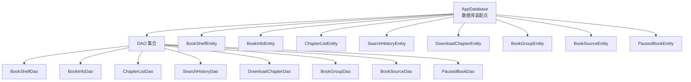
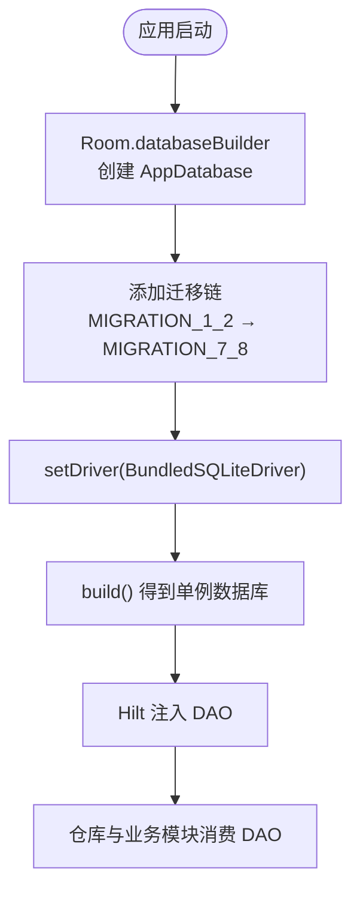
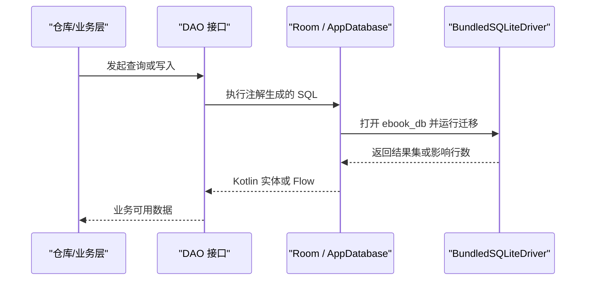
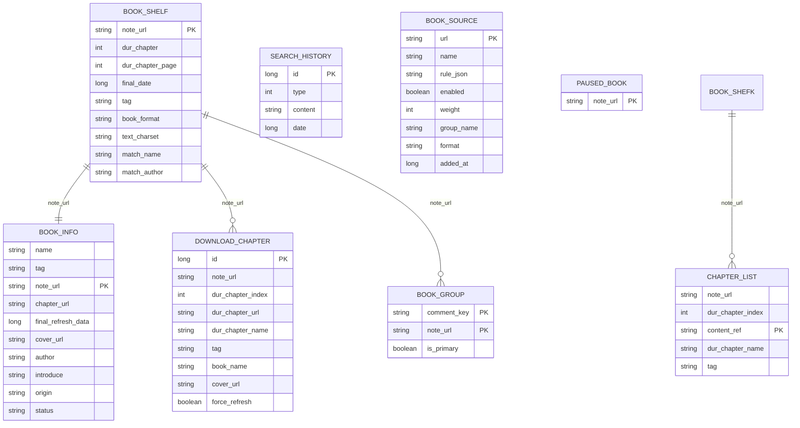
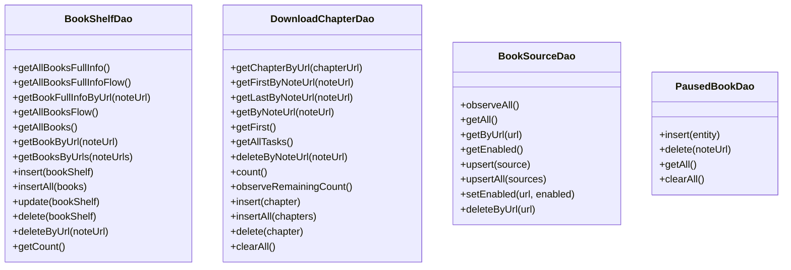
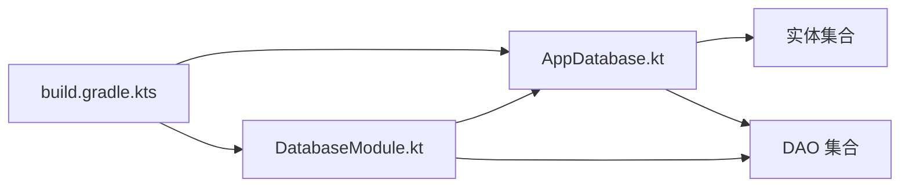
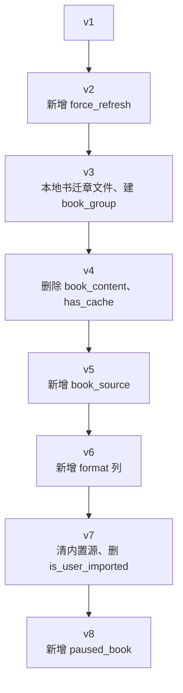
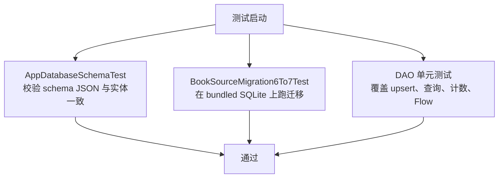

# 数据库模块（lib_ebook_db）

<cite>
**本文引用的文件**   
- [AppDatabase.kt](file://lib_ebook_db/src/main/java/com/ebook/db/AppDatabase.kt)
- [DatabaseModule.kt](file://lib_ebook_db/src/main/java/com/ebook/db/di/DatabaseModule.kt)
- [build.gradle.kts](file://lib_ebook_db/build.gradle.kts)
- [DBCode.kt](file://lib_ebook_db/src/main/java/com/ebook/db/event/DBCode.kt)
- [BookShelfEntity.kt](file://lib_ebook_db/src/main/java/com/ebook/db/entity/BookShelfEntity.kt)
- [BookInfoEntity.kt](file://lib_ebook_db/src/main/java/com/ebook/db/entity/BookInfoEntity.kt)
- [ChapterListEntity.kt](file://lib_ebook_db/src/main/java/com/ebook/db/entity/ChapterListEntity.kt)
- [SearchHistoryEntity.kt](file://lib_ebook_db/src/main/java/com/ebook/db/entity/SearchHistoryEntity.kt)
- [DownloadChapterEntity.kt](file://lib_ebook_db/src/main/java/com/ebook/db/entity/DownloadChapterEntity.kt)
- [BookGroupEntity.kt](file://lib_ebook_db/src/main/java/com/ebook/db/entity/BookGroupEntity.kt)
- [BookSourceEntity.kt](file://lib_ebook_db/src/main/java/com/ebook/db/entity/BookSourceEntity.kt)
- [PausedBookEntity.kt](file://lib_ebook_db/src/main/java/com/ebook/db/entity/PausedBookEntity.kt)
- [BookShelfFullInfo.kt](file://lib_ebook_db/src/main/java/com/ebook/db/entity/BookShelfFullInfo.kt)
- [LocBookShelfEntity.kt](file://lib_ebook_db/src/main/java/com/ebook/db/entity/LocBookShelfEntity.kt)
- [LibraryEntity.kt](file://lib_ebook_db/src/main/java/com/ebook/db/entity/LibraryEntity.kt)
- [LibraryKindBookListEntity.kt](file://lib_ebook_db/src/main/java/com/ebook/db/entity/LibraryKindBookListEntity.kt)
- [SearchBookEntity.kt](file://lib_ebook_db/src/main/java/com/ebook/db/entity/SearchBookEntity.kt)
- [WebChapterEntity.kt](file://lib_ebook_db/src/main/java/com/ebook/db/entity/WebChapterEntity.kt)
- [WebContentEntity.kt](file://lib_ebook_db/src/main/java/com/ebook/db/entity/WebContentEntity.kt)
- [BookShelfDao.kt](file://lib_ebook_db/src/main/java/com/ebook/db/dao/BookShelfDao.kt)
- [BookInfoDao.kt](file://lib_ebook_db/src/main/java/com/ebook/db/dao/BookInfoDao.kt)
- [ChapterListDao.kt](file://lib_ebook_db/src/main/java/com/ebook/db/dao/ChapterListDao.kt)
- [SearchHistoryDao.kt](file://lib_ebook_db/src/main/java/com/ebook/db/dao/SearchHistoryDao.kt)
- [DownloadChapterDao.kt](file://lib_ebook_db/src/main/java/com/ebook/db/dao/DownloadChapterDao.kt)
- [BookGroupDao.kt](file://lib_ebook_db/src/main/java/com/ebook/db/dao/BookGroupDao.kt)
- [BookSourceDao.kt](file://lib_ebook_db/src/main/java/com/ebook/db/dao/BookSourceDao.kt)
- [PausedBookDao.kt](file://lib_ebook_db/src/main/java/com/ebook/db/dao/PausedBookDao.kt)
- [AppDatabaseSchemaTest.kt](file://lib_ebook_db/src/test/java/com/ebook/db/AppDatabaseSchemaTest.kt)
- [BookSourceMigration6To7Test.kt](file://lib_ebook_db/src/test/java/com/ebook/db/BookSourceMigration6To7Test.kt)
</cite>

## 目录
1. [引言](#引言)
2. [项目结构](#项目结构)
3. [核心组件](#核心组件)
4. [架构总览](#架构总览)
5. [详细组件分析](#详细组件分析)
6. [依赖关系分析](#依赖关系分析)
7. [性能与索引设计](#性能与索引设计)
8. [数据迁移与版本管理](#数据迁移与版本管理)
9. [测试策略](#测试策略)
10. [故障排查指南](#故障排查指南)
11. [备份与恢复建议](#备份与恢复建议)
12. [结论](#结论)

## 引言
本模块 `lib_ebook_db` 是电子书应用的核心本地数据层，基于 Room 3（artifact 群组 `androidx.room3`）提供 SQLite 持久化能力。它负责书架、书籍信息、章节目录、搜索历史、下载队列、作品分组、书源规则以及按书暂停标记等离线数据的建模、访问和迁移。所有读写都通过 DAO 暴露给上层仓库和业务模块；实体包内还包含若干仅用于内存传输的非持久化模型。

该模块当前数据库名为 `ebook_db`，版本为 8，包含八张持久化表，并通过 Hilt 以单例形式装配到应用生命周期中。

## 项目结构
`lib_ebook_db` 采用“领域 + 分层”组织方式：
- `entity`：Room 实体与非持久化传输模型。
- `dao`：每张持久化表的访问接口。
- `di`：Hilt 模块，提供 `AppDatabase` 与各 DAO 的依赖注入。
- `event`：跨层共享常量（如阅读页码边界）。
- 根级 `AppDatabase.kt`：声明实体集合、DAO 入口、数据库名称与版本。
- `build.gradle.kts`：Room、Hilt、BundledSQLiteDriver 与测试依赖配置。
- `schemas/`：Room 导出的各版本 JSON schema，由约定插件写入。

**图示来源**
- [AppDatabase.kt:1-76](file://lib_ebook_db/src/main/java/com/ebook/db/AppDatabase.kt#L1-L76)
- [BookShelfDao.kt:1-109](file://lib_ebook_db/src/main/java/com/ebook/db/dao/BookShelfDao.kt#L1-L109)
- [BookInfoDao.kt:1-50](file://lib_ebook_db/src/main/java/com/ebook/db/dao/BookInfoDao.kt#L1-L50)
- [ChapterListDao.kt:1-54](file://lib_ebook_db/src/main/java/com/ebook/db/dao/ChapterListDao.kt#L1-L54)
- [SearchHistoryDao.kt:1-66](file://lib_ebook_db/src/main/java/com/ebook/db/dao/SearchHistoryDao.kt#L1-L66)
- [DownloadChapterDao.kt:1-131](file://lib_ebook_db/src/main/java/com/ebook/db/dao/DownloadChapterDao.kt#L1-L131)
- [BookGroupDao.kt:1-63](file://lib_ebook_db/src/main/java/com/ebook/db/dao/BookGroupDao.kt#L1-L63)
- [BookSourceDao.kt:1-101](file://lib_ebook_db/src/main/java/com/ebook/db/dao/BookSourceDao.kt#L1-L101)
- [PausedBookDao.kt:1-36](file://lib_ebook_db/src/main/java/com/ebook/db/dao/PausedBookDao.kt#L1-L36)

**章节来源**
- [AppDatabase.kt:1-76](file://lib_ebook_db/src/main/java/com/ebook/db/AppDatabase.kt#L1-L76)
- [build.gradle.kts:1-51](file://lib_ebook_db/build.gradle.kts#L1-L51)

## 核心组件
### 数据库装配与初始化
`AppDatabase` 是 Room 数据库类，承担以下职责：
- 声明八个持久化实体。
- 声明版本号为 8，并开启 `exportSchema = true`。
- 暴露八条 DAO 抽象方法。
- 定义数据库文件名常量 `ebook_db`。

`DatabaseModule` 使用 Hilt 提供：
- 单例 `AppDatabase`，使用 `Room.databaseBuilder` 构建。
- 注册六条相邻迁移：v1→v2、v2→v3、v3→v4、v4→v5、v5→v6、v6→v7、v7→v8。
- 设置 `BundledSQLiteDriver`，使 DDL 能力取决于随包 SQLite，而非设备系统版本。
- 分别提供八个 DAO 的单例实例。

**图示来源**
- [DatabaseModule.kt:1-243](file://lib_ebook_db/src/main/java/com/ebook/db/di/DatabaseModule.kt#L1-L243)
- [AppDatabase.kt:1-76](file://lib_ebook_db/src/main/java/com/ebook/db/AppDatabase.kt#L1-L76)

**章节来源**
- [AppDatabase.kt:1-76](file://lib_ebook_db/src/main/java/com/ebook/db/AppDatabase.kt#L1-L76)
- [DatabaseModule.kt:1-243](file://lib_ebook_db/src/main/java/com/ebook/db/di/DatabaseModule.kt#L1-L243)
- [build.gradle.kts:1-51](file://lib_ebook_db/build.gradle.kts#L1-L51)

## 架构总览
从调用方视角，数据流遵循“仓库 → DAO → Room → SQLite”的单向路径：
- 上层仓库（如 `lib_book_common` 的 `BookRepository`、`module_book` 的 `DownloadRepository`）负责事务编排、去重、空态处理等业务语义。
- DAO 只暴露最小必要 SQL，并在注释中明确主键策略、索引使用和不变式。
- 实体描述列映射、自然键与部分业务约束；非持久化模型不参与 `@Database(entities)`。
- 迁移在 `DatabaseModule` 中以相邻版本对象表达，禁止破坏性迁移。

**图示来源**
- [AppDatabase.kt:1-76](file://lib_ebook_db/src/main/java/com/ebook/db/AppDatabase.kt#L1-L76)
- [DatabaseModule.kt:1-243](file://lib_ebook_db/src/main/java/com/ebook/db/di/DatabaseModule.kt#L1-L243)
- [build.gradle.kts:1-51](file://lib_ebook_db/build.gradle.kts#L1-L51)

## 详细组件分析

### 实体类设计与字段映射
#### 持久化实体
| 表名 | 主键 | 关键字段 | 业务含义 |
|---|---|---|---|
| `book_shelf` | `note_url` | `dur_chapter`、`dur_chapter_page`、`final_date`、`tag`、`book_format`、`text_charset`、`match_name`、`match_author` | 书架条目、阅读进度、最后阅读时间、书源归属标记、本地书格式与编码探测值 |
| `book_info` | `note_url` | `name`、`author`、`cover_url`、`chapter_url`、`final_refresh_data`、`status`、`origin`、`introduce`、`tag` | 书籍元数据，与书架行一对一 |
| `chapter_list` | `content_ref` | `note_url`、`dur_chapter_index`、`dur_chapter_name`、`tag` | 章节目录，内容定位符承载网络 URL 或本地章文件相对路径 |
| `search_history` | 自增 `id` | `type`、`content`、`date` | 搜索历史流水记录，按类型隔离 |
| `download_chapter` | 自增 `id` | `note_url`、`dur_chapter_index`、`dur_chapter_url`、`dur_chapter_name`、`tag`、`book_name`、`cover_url`、`force_refresh` | 未完成下载任务，唯一索引保证同章不重复排队 |
| `book_group` | `(comment_key, note_url)` | `is_primary` | 作品分组关联，连接来源条目与评论桶键 |
| `book_source` | `url` | `name`、`rule_json`、`enabled`、`weight`、`group_name`、`format`、`added_at` | 书源站点解析规则，运行时可导入管理 |
| `paused_book` | `note_url` | 无额外列 | v8 新增，存在即该书下载暂停 |

注意：上述 ER 图仅反映实体间的自然键关联思路；实际代码未使用 Room 的 `@ForeignKey`，外键一致性由仓库层维护。

**图示来源**
- [BookShelfEntity.kt:1-83](file://lib_ebook_db/src/main/java/com/ebook/db/entity/BookShelfEntity.kt#L1-L83)
- [BookInfoEntity.kt:1-73](file://lib_ebook_db/src/main/java/com/ebook/db/entity/BookInfoEntity.kt#L1-L73)
- [ChapterListEntity.kt:1-52](file://lib_ebook_db/src/main/java/com/ebook/db/entity/ChapterListEntity.kt#L1-L52)
- [SearchHistoryEntity.kt:1-43](file://lib_ebook_db/src/main/java/com/ebook/db/entity/SearchHistoryEntity.kt#L1-L43)
- [DownloadChapterEntity.kt:1-88](file://lib_ebook_db/src/main/java/com/ebook/db/entity/DownloadChapterEntity.kt#L1-L88)
- [BookGroupEntity.kt:1-37](file://lib_ebook_db/src/main/java/com/ebook/db/entity/BookGroupEntity.kt#L1-L37)
- [BookSourceEntity.kt:1-91](file://lib_ebook_db/src/main/java/com/ebook/db/entity/BookSourceEntity.kt#L1-L91)
- [PausedBookEntity.kt:1-30](file://lib_ebook_db/src/main/java/com/ebook/db/entity/PausedBookEntity.kt#L1-L30)

#### 非持久化传输模型
- `BookShelfFullInfo`：通过 `@Embedded` 与 `@Relation` 拼装书架、书籍信息与章节列表，不是独立表。
- `LocBookShelfEntity`：本地导入链路中的临时书架载体。
- `LibraryEntity`、`LibraryKindBookListEntity`、`SearchBookEntity`：书城搜索结果与分类推荐内存模型。
- `WebChapterEntity<T>`、`WebContentEntity`：书源解析链路的通用响应容器。

这些类不在 `@Database(entities)` 列表中，也不参与 schema 生成。

**章节来源**
- [BookShelfFullInfo.kt:1-32](file://lib_ebook_db/src/main/java/com/ebook/db/entity/BookShelfFullInfo.kt#L1-L32)
- [LocBookShelfEntity.kt:1-15](file://lib_ebook_db/src/main/java/com/ebook/db/entity/LocBookShelfEntity.kt#L1-L15)
- [LibraryEntity.kt:1-18](file://lib_ebook_db/src/main/java/com/ebook/db/entity/LibraryEntity.kt#L1-L18)
- [LibraryKindBookListEntity.kt:1-16](file://lib_ebook_db/src/main/java/com/ebook/db/entity/LibraryKindBookListEntity.kt#L1-L16)
- [SearchBookEntity.kt:1-25](file://lib_ebook_db/src/main/java/com/ebook/db/entity/SearchBookEntity.kt#L1-L25)
- [WebChapterEntity.kt:1-11](file://lib_ebook_db/src/main/java/com/ebook/db/entity/WebChapterEntity.kt#L1-L11)
- [WebContentEntity.kt:1-15](file://lib_ebook_db/src/main/java/com/ebook/db/entity/WebContentEntity.kt#L1-L15)

### DAO 接口与数据访问模式
| DAO | 主要职责 | 关键访问模式 |
|---|---|---|
| `BookShelfDao` | 书架 CRUD、完整书架聚合、Flow 观察 | `REPLACE` upsert、`UPDATE`、`@Transaction` 包裹 `@Relation` |
| `BookInfoDao` | 书籍元数据 CRUD | 定向 `UPDATE final_refresh_data` 避免整行覆盖风险 |
| `ChapterListDao` | 章节目录查询、批量 upsert、按书删除 | 显式 `ORDER BY dur_chapter_index` |
| `SearchHistoryDao` | 搜索历史流水操作 | 精确匹配查重、按类型整体展示与清除 |
| `DownloadChapterDao` | 下载队列队头/队尾、任务插入与出队、剩余数观察 | 唯一索引防重复、按书取队头防止无限重试 |
| `BookGroupDao` | 作品分组 upsert、主键切换、拆分合并 | 调用方保证 `is_primary` 恰好一行 |
| `BookSourceDao` | 书源全量、启用过滤、upsert、启用状态切换 | 统一排序口径 `weight ASC, added_at ASC, url ASC` |
| `PausedBookDao` | 按书暂停标记插入、删除、清空 | 仓库层遍历跳过命中书 |

**图示来源**
- [BookShelfDao.kt:1-109](file://lib_ebook_db/src/main/java/com/ebook/db/dao/BookShelfDao.kt#L1-L109)
- [DownloadChapterDao.kt:1-131](file://lib_ebook_db/src/main/java/com/ebook/db/dao/DownloadChapterDao.kt#L1-L131)
- [BookSourceDao.kt:1-101](file://lib_ebook_db/src/main/java/com/ebook/db/dao/BookSourceDao.kt#L1-L101)
- [PausedBookDao.kt:1-36](file://lib_ebook_db/src/main/java/com/ebook/db/dao/PausedBookDao.kt#L1-L36)

**章节来源**
- [BookShelfDao.kt:1-109](file://lib_ebook_db/src/main/java/com/ebook/db/dao/BookShelfDao.kt#L1-L109)
- [BookInfoDao.kt:1-50](file://lib_ebook_db/src/main/java/com/ebook/db/dao/BookInfoDao.kt#L1-L50)
- [ChapterListDao.kt:1-54](file://lib_ebook_db/src/main/java/com/ebook/db/dao/ChapterListDao.kt#L1-L54)
- [SearchHistoryDao.kt:1-66](file://lib_ebook_db/src/main/java/com/ebook/db/dao/SearchHistoryDao.kt#L1-L66)
- [DownloadChapterDao.kt:1-131](file://lib_ebook_db/src/main/java/com/ebook/db/dao/DownloadChapterDao.kt#L1-L131)
- [BookGroupDao.kt:1-63](file://lib_ebook_db/src/main/java/com/ebook/db/dao/BookGroupDao.kt#L1-L63)
- [BookSourceDao.kt:1-101](file://lib_ebook_db/src/main/java/com/ebook/db/dao/BookSourceDao.kt#L1-L101)
- [PausedBookDao.kt:1-36](file://lib_ebook_db/src/main/java/com/ebook/db/dao/PausedBookDao.kt#L1-L36)

### 事务管理与并发语义
- 书架完整信息查询使用 `@Transaction`，因为 `@Relation` 会触发子查询，同一读事务可避免“书已删但章节仍在”的中间态。
- 书架 upsert 与多表写入（书架、书籍信息、章节目录、分组）应由上层仓库收进同一写事务；DAO 本身只做单表操作。
- 作品分组要求调用方在写事务内保证每本书的 `is_primary` 恰好一行，因为 SQLite 无法用部分唯一索引表达该约束。
- 下载队列的任务出队必须成功或放弃后执行，否则队头不变会导致无限重试。
- 搜索历史使用自增主键 + `REPLACE`，由仓库先查旧 id 再覆盖，实现“重搜更新时间戳但不产生重复记录”。

**章节来源**
- [BookShelfDao.kt:1-109](file://lib_ebook_db/src/main/java/com/ebook/db/dao/BookShelfDao.kt#L1-L109)
- [BookGroupDao.kt:1-63](file://lib_ebook_db/src/main/java/com/ebook/db/dao/BookGroupDao.kt#L1-L63)
- [SearchHistoryDao.kt:1-66](file://lib_ebook_db/src/main/java/com/ebook/db/dao/SearchHistoryDao.kt#L1-L66)
- [DownloadChapterDao.kt:1-131](file://lib_ebook_db/src/main/java/com/ebook/db/dao/DownloadChapterDao.kt#L1-L131)

## 依赖关系分析
模块内部依赖清晰：
- `AppDatabase` 依赖全部实体和 DAO。
- DAO 依赖对应实体。
- `DatabaseModule` 依赖 `AppDatabase` 和各 DAO，并通过 Hilt 暴露。
- 非持久化实体不进入 Room 依赖图。
- 外部依赖集中在 Gradle 配置中：Room 3、Hilt、AndroidX Core、AppCompat、BundledSQLiteDriver 及其 JVM 变体、JUnit、Robolectric、协程测试库。

**图示来源**
- [AppDatabase.kt:1-76](file://lib_ebook_db/src/main/java/com/ebook/db/AppDatabase.kt#L1-L76)
- [DatabaseModule.kt:1-243](file://lib_ebook_db/src/main/java/com/ebook/db/di/DatabaseModule.kt#L1-L243)
- [build.gradle.kts:1-51](file://lib_ebook_db/build.gradle.kts#L1-L51)

**章节来源**
- [AppDatabase.kt:1-76](file://lib_ebook_db/src/main/java/com/ebook/db/AppDatabase.kt#L1-L76)
- [DatabaseModule.kt:1-243](file://lib_ebook_db/src/main/java/com/ebook/db/di/DatabaseModule.kt#L1-L243)
- [build.gradle.kts:1-51](file://lib_ebook_db/build.gradle.kts#L1-L51)

## 性能与索引设计
### 已识别索引
| 表 | 索引 | 用途 |
|---|---|---|
| `chapter_list` | `idx_chapter_list_note_url` | 按书取目录、统计章节数量 |
| `download_chapter` | `idx_download_chapter_note_url` | 按书取队头、队尾、取消任务 |
| `download_chapter` | `idx_download_chapter_dur_chapter_url`（唯一） | 同章不重复排队 |
| `book_group` | `idx_book_group_note_url` | 按来源条目查关联键 |

### 查询优化要点
- 书架完整信息使用 `@Relation` 时加 `@Transaction`，避免跨事务拼接。
- 章节数量查询使用 `COUNT(*)` 而非拉取完整目录，减少对象构造开销。
- 下载队列使用唯一索引避免重复任务；队头失败时必须出队，防止无限重试。
- 书源查询统一排序口径，避免列表顺序抖动。
- 搜索历史不使用模糊匹配做面板展示，避免通配符转义与性能问题。

**章节来源**
- [ChapterListEntity.kt:1-52](file://lib_ebook_db/src/main/java/com/ebook/db/entity/ChapterListEntity.kt#L1-L52)
- [DownloadChapterEntity.kt:1-88](file://lib_ebook_db/src/main/java/com/ebook/db/entity/DownloadChapterEntity.kt#L1-L88)
- [BookGroupEntity.kt:1-37](file://lib_ebook_db/src/main/java/com/ebook/db/entity/BookGroupEntity.kt#L1-L37)
- [BookShelfDao.kt:1-109](file://lib_ebook_db/src/main/java/com/ebook/db/dao/BookShelfDao.kt#L1-L109)
- [ChapterListDao.kt:1-54](file://lib_ebook_db/src/main/java/com/ebook/db/dao/ChapterListDao.kt#L1-L54)
- [DownloadChapterDao.kt:1-131](file://lib_ebook_db/src/main/java/com/ebook/db/dao/DownloadChapterDao.kt#L1-L131)
- [BookSourceDao.kt:1-101](file://lib_ebook_db/src/main/java/com/ebook/db/dao/BookSourceDao.kt#L1-L101)
- [SearchHistoryDao.kt:1-66](file://lib_ebook_db/src/main/java/com/ebook/db/dao/SearchHistoryDao.kt#L1-L66)

## 数据迁移与版本管理
### 迁移链概览
| 版本 | 迁移目标 | 变更摘要 |
|---|---|---|
| v1 → v2 | 下载队列增强 | 新增 `force_refresh` 列 |
| v2 → v3 | 本地书正文迁到章文件 | 建 `book_group`、补书架列、改 `chapter_list` 主键列名、清理本地书数据 |
| v3 → v4 | 网络书正文迁到章文件 | 删除 `book_content` 表、删除 `chapter_list.has_cache` 列 |
| v4 → v5 | 多书源共存 | 新建 `book_source` 表 |
| v5 → v6 | 脚本书源双格式 | `book_source` 增加 `format` 列，默认 `native` |
| v6 → v7 | 内置书源下线 | 删除内置源行，删除 `is_user_imported` 列 |
| v7 → v8 | 按书暂停标记 | 新增 `paused_book` 表 |

### 迁移设计原则
- 相邻版本追加迁移，不跳版、不删除旧迁移。
- 不启用破坏性迁移。
- 迁移 SQL 与 Room 导出 schema 保持一致，尤其是 `NOT NULL` 与 `DEFAULT`。
- 对可再生数据（本地书旧正文）直接清理，不对损毁数据做静默兼容。
- 对不可再生或易漂移的列（如 `format`），迁移必须与实体 `@ColumnInfo(defaultValue = ...)` 完全一致。

**图示来源**
- [DatabaseModule.kt:1-243](file://lib_ebook_db/src/main/java/com/ebook/db/di/DatabaseModule.kt#L1-L243)

**章节来源**
- [DatabaseModule.kt:1-243](file://lib_ebook_db/src/main/java/com/ebook/db/di/DatabaseModule.kt#L1-L243)
- [AppDatabase.kt:1-76](file://lib_ebook_db/src/main/java/com/ebook/db/AppDatabase.kt#L1-L76)

## 测试策略
### 架构契约测试
`AppDatabaseSchemaTest` 使用 Robolectric 检查：
- `schemas/` 下 1 到最新版本 JSON 连续存在，无多余版本。
- 最新 JSON 的 `database.version` 与代码声明一致。
- 指定版本间字段差集符合预期（v5→v6 只多出 `format`，v6→v7 只少掉 `is_user_imported`，v7→v8 只多出 `paused_book`）。
- `book_source.format` 的 `affinity`、`notNull`、`defaultValue` 与建表语句片段一致。
- `paused_book` 主键为 `note_url`，且迁移 DDL 与 Room 生成建表语句一致。
- 实体的 Kotlin 默认值与 schema 列默认值保持“同字”语义。

### 迁移行为测试
`BookSourceMigration6To7Test` 使用生产同款 `BundledSQLiteDriver` 驱动手写迁移：
- 前置断言 SQLite 版本 ≥ 3.35，确保 `DROP COLUMN` 语法可用。
- 构造 v6 形态表，插入内置源和用户导入源。
- 执行 `MIGRATION_6_7` 后验证：内置源行被删除、用户导入行保留、`is_user_imported` 列消失。
- 不依赖 `MigrationTestHelper`，直接驱动 `Migration.migrate(connection)`，让失败形态落在真实 SQL 上。

### DAO 回归测试
模块还提供多个 DAO 单元测试（如 `BookInfoDaoTest`、`BookSourceDaoTest`、`PausedBookDaoTest`、`SearchHistoryDaoTest`），覆盖常用写入、查询与 upsert 语义。

**图示来源**
- [AppDatabaseSchemaTest.kt:1-224](file://lib_ebook_db/src/test/java/com/ebook/db/AppDatabaseSchemaTest.kt#L1-L224)
- [BookSourceMigration6To7Test.kt:1-209](file://lib_ebook_db/src/test/java/com/ebook/db/BookSourceMigration6To7Test.kt#L1-L209)

**章节来源**
- [AppDatabaseSchemaTest.kt:1-224](file://lib_ebook_db/src/test/java/com/ebook/db/AppDatabaseSchemaTest.kt#L1-L224)
- [BookSourceMigration6To7Test.kt:1-209](file://lib_ebook_db/src/test/java/com/ebook/db/BookSourceMigration6To7Test.kt#L1-L209)

## 故障排查指南
### 常见错误与定位
| 现象 | 可能原因 | 排查建议 |
|---|---|---|
| 升级后报 schema 不匹配 | 修改实体但未同步版本号、迁移或 schema JSON | 检查 `AppDatabase.version`、迁移链与 `schemas/` 下的 JSON |
| 新增列导致全新安装与覆盖安装行为不一致 | 迁移中 `DEFAULT` 与实体 `@ColumnInfo(defaultValue = ...)` 不一致 | 对照 `AppDatabaseSchemaTest` 中关于 `createSql` 与 `defaultValue` 的断言 |
| 书源管理页顺序不稳定 | 查询未稳定排序或未加末位唯一键 | 确认所有全量查询使用 `weight ASC, added_at ASC, url ASC` |
| 下载任务无限重试 | 失败章未出队，队头不变 | 检查下载服务出队逻辑，确认失败重试耗尽后删除任务 |
| 书架移除后仍有孤立数据 | DAO 无外键级联 | 由仓库层显式清理 `book_info`、`chapter_list`、`download_chapter`、`book_group` |
| 暂停标记残留 | 暂停行与书架行无外键约束 | 取消本书、清空队列或清理孤儿任务时同步调用 `PausedBookDao.clearAll` 或按 `note_url` 删除 |
| 搜索历史面板首开空白 | 误用通配查询或参数语义不清 | 区分“面板全量展示”与“upsert 精确查重”，不要混用 LIKE |
| 测试报 `sqlite-bundled-jvm` 加载失败 | 测试 classpath 缺少 JVM 原生库变体 | 确认 `build.gradle.kts` 中包含 `testImplementation(libs.sqlite.bundled.jvm)` |

### 调试建议
- 优先查看 DAO 注释中的不变式，例如“表内只存未完成任务”“队头不动会导致无限重试”。
- 遇到 schema 相关错误，先对比 `schemas/` 中相邻版本的 JSON 差异。
- 遇到迁移问题，参考 `BookSourceMigration6To7Test` 的测试结构，用 bundled 驱动复现真实引擎行为。
- 涉及 `book_source` 的默认值问题，重点核对 `format` 列的 `NOT NULL DEFAULT 'native'`。

**章节来源**
- [AppDatabaseSchemaTest.kt:1-224](file://lib_ebook_db/src/test/java/com/ebook/db/AppDatabaseSchemaTest.kt#L1-L224)
- [BookSourceMigration6To7Test.kt:1-209](file://lib_ebook_db/src/test/java/com/ebook/db/BookSourceMigration6To7Test.kt#L1-L209)
- [DownloadChapterDao.kt:1-131](file://lib_ebook_db/src/main/java/com/ebook/db/dao/DownloadChapterDao.kt#L1-L131)
- [BookSourceDao.kt:1-101](file://lib_ebook_db/src/main/java/com/ebook/db/dao/BookSourceDao.kt#L1-L101)
- [SearchHistoryDao.kt:1-66](file://lib_ebook_db/src/main/java/com/ebook/db/dao/SearchHistoryDao.kt#L1-L66)
- [PausedBookDao.kt:1-36](file://lib_ebook_db/src/main/java/com/ebook/db/dao/PausedBookDao.kt#L1-L36)
- [build.gradle.kts:1-51](file://lib_ebook_db/build.gradle.kts#L1-L51)

## 备份与恢复建议
当前模块没有内置备份恢复 API，但根据现有结构可以形成如下方案：
- **备份范围**：`ebook_db` 文件位于应用数据库目录，包含八张表及索引。
- **轻量备份**：可在应用退出或下载任务完成时，复制数据库文件到外部存储或加密备份位置。
- **恢复策略**：恢复前需确保应用版本与 schema 版本兼容；若 schema 升级，应优先执行迁移链，不应直接替换数据库文件绕过 Room。
- **分域备份**：可按功能拆分为书架/进度、下载队列、书源规则三类备份，便于选择性恢复。
- **幂等恢复**：恢复书源规则时应走 `BookSourceDao.upsertAll`，利用 `url` 主键自然去重；恢复书架与章节目录时应由仓库层处理去重与关联完整性。
- **一致性保障**：恢复后建议重新校验 `book_shelf`、`book_info`、`chapter_list`、`download_chapter`、`book_group`、`book_source`、`paused_book` 的行数与关键键集合。

[本节为概念性建议，不直接分析具体源码文件]

## 结论
`lib_ebook_db` 是一个结构清晰、约束明确的 Room 数据层：
- 以自然键为主，辅以自增主键处理流水数据。
- 通过 DAO 注释明确主键策略、索引使用、事务边界和不变式。
- 通过相邻迁移链和 schema JSON 契约测试保证版本演进安全。
- 通过 BundledSQLiteDriver 屏蔽设备 SQLite 版本差异。
- 通过非持久化传输模型与 `@Relation` 组装复杂视图，同时保持底层表解耦。

后续扩展应遵循现有约定：改实体必须同步更新版本号、迁移链和 schema JSON；新增 DAO 要说明是否改变事务边界、是否引入新索引；新增列要明确默认值、是否可空、是否与实体 `@ColumnInfo(defaultValue = ...)` 一致。