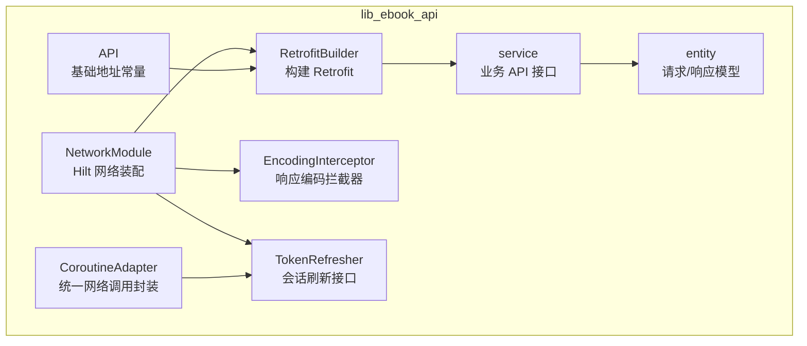
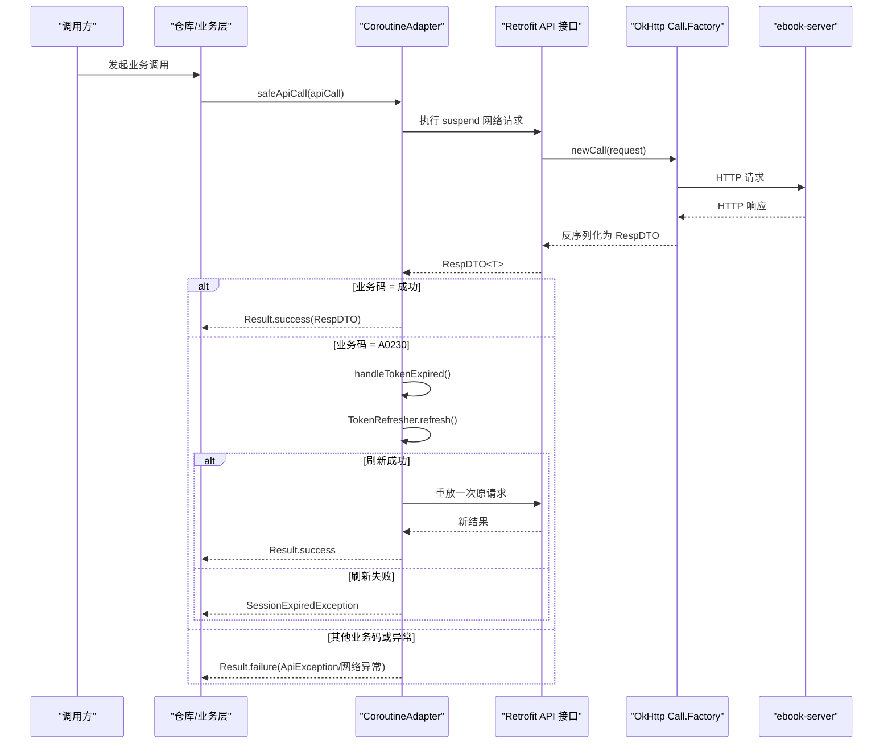
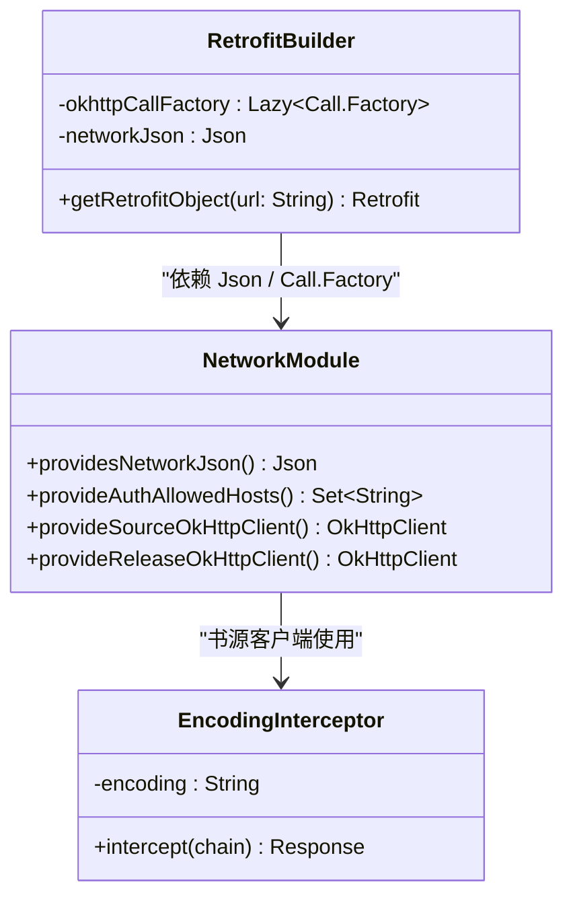
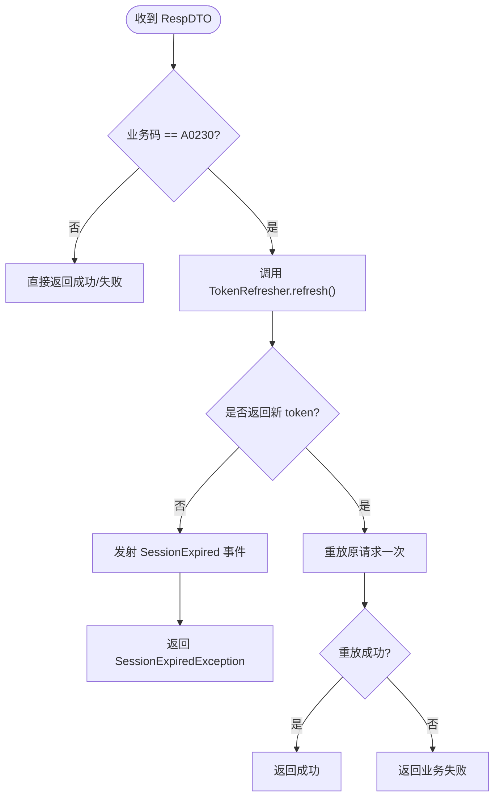
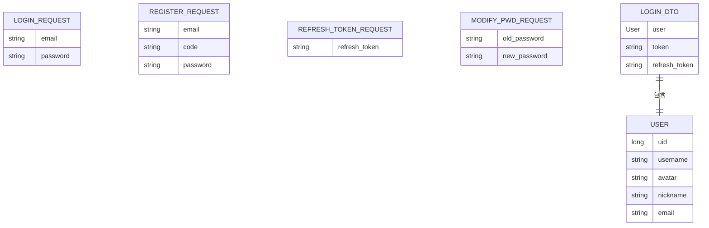
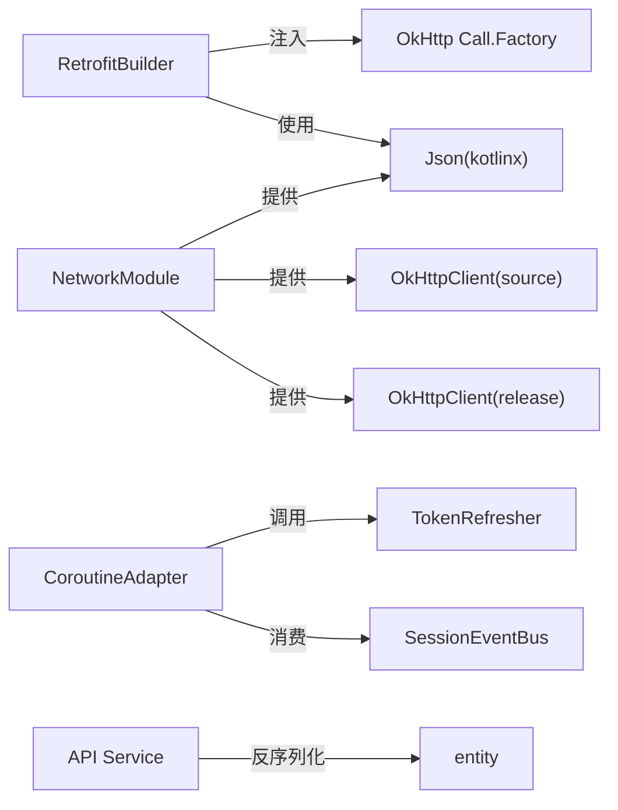

# 网络API模块 (lib_ebook_api)

<cite>
**本文引用的文件**   
- [RetrofitBuilder.kt](file://lib_ebook_api/src/main/java/com/ebook/api/RetrofitBuilder.kt)
- [API.kt](file://lib_ebook_api/src/main/java/com/ebook/api/config/API.kt)
- [NetworkModule.kt](file://lib_ebook_api/src/main/java/com/ebook/api/utils/NetworkModule.kt)
- [CoroutineAdapter.kt](file://lib_ebook_api/src/main/java/com/ebook/api/utils/CoroutineAdapter.kt)
- [EncodingInterceptor.kt](file://lib_ebook_api/src/main/java/com/ebook/api/intercepter/EncodingInterceptor.kt)
- [TokenRefresher.kt](file://lib_ebook_api/src/main/java/com/ebook/api/auth/TokenRefresher.kt)
- [LoginRequest.kt](file://lib_ebook_api/src/main/java/com/ebook/api/entity/LoginRequest.kt)
- [RegisterRequest.kt](file://lib_ebook_api/src/main/java/com/ebook/api/entity/RegisterRequest.kt)
- [RefreshTokenRequest.kt](file://lib_ebook_api/src/main/java/com/ebook/api/entity/RefreshTokenRequest.kt)
- [ModifyPwdRequest.kt](file://lib_ebook_api/src/main/java/com/ebook/api/entity/ModifyPwdRequest.kt)
- [LoginDTO.kt](file://lib_ebook_api/src/main/java/com/ebook/api/entity/LoginDTO.kt)
- [User.kt](file://lib_ebook_api/src/main/java/com/ebook/api/entity/User.kt)
</cite>

## 目录
1. [引言](#引言)
2. [项目结构](#项目结构)
3. [核心组件](#核心组件)
4. [架构总览](#架构总览)
5. [详细组件分析](#详细组件分析)
6. [依赖关系分析](#依赖关系分析)
7. [性能与缓存策略](#性能与缓存策略)
8. [故障排查指南](#故障排查指南)
9. [结论](#结论)

## 引言
本模块是 ebook 应用的网络 API 层，围绕 Retrofit + OkHttp + kotlinx.serialization 构建。它负责：
- 提供统一的 Retrofit 构建器；
- 通过 Hilt 注入 OkHttp 客户端、JSON 解析配置与认证相关拦截器；
- 定义用户认证、评论、书源、发布检查等业务的 API 服务接口与数据实体；
- 统一封装协程式网络调用、错误转换与会话过期静默刷新；
- 为第三方书源请求提供纯净的 OkHttp 实例，避免 Token 泄漏。

## 项目结构
lib_ebook_api 以“功能域”组织源码：
- config：基础 URL 常量；
- auth：会话刷新接缝；
- intercepter：响应编码改写拦截器；
- utils：Hilt 网络模块、协程适配器、通用工具；
- entity：请求/响应数据模型；
- service：按业务划分的 API 服务（用户、评论、书源、发布检查）。

**图表来源**
- [RetrofitBuilder.kt:1-45](file://lib_ebook_api/src/main/java/com/ebook/api/RetrofitBuilder.kt#L1-L45)
- [NetworkModule.kt:1-76](file://lib_ebook_api/src/main/java/com/ebook/api/utils/NetworkModule.kt#L1-L76)
- [CoroutineAdapter.kt:1-150](file://lib_ebook_api/src/main/java/com/ebook/api/utils/CoroutineAdapter.kt#L1-L150)
- [EncodingInterceptor.kt:1-51](file://lib_ebook_api/src/main/java/com/ebook/api/intercepter/EncodingInterceptor.kt#L1-L51)
- [TokenRefresher.kt:1-27](file://lib_ebook_api/src/main/java/com/ebook/api/auth/TokenRefresher.kt#L1-L27)
- [API.kt:1-26](file://lib_ebook_api/src/main/java/com/ebook/api/config/API.kt#L1-L26)

**章节来源**
- [RetrofitBuilder.kt:1-45](file://lib_ebook_api/src/main/java/com/ebook/api/RetrofitBuilder.kt#L1-L45)
- [NetworkModule.kt:1-76](file://lib_ebook_api/src/main/java/com/ebook/api/utils/NetworkModule.kt#L1-L76)
- [API.kt:1-26](file://lib_ebook_api/src/main/java/com/ebook/api/config/API.kt#L1-L26)

## 核心组件
- RetrofitBuilder：创建 Retrofit 实例，挂载 kotlinx.serialization 转换器、Scalars 转换器与共享 Call.Factory。
- NetworkModule：提供 Json 配置、白名单 Host、书源与发布检查用的 OkHttpClient。
- CoroutineAdapter：统一 safeApiCall/callData，处理 IO 调度、业务码 A0230 静默刷新、异常翻译。
- EncodingInterceptor：强制书源响应体 Content-Type 编码，避免中文乱码。
- TokenRefresher：声明式会话刷新接口，由上层注入实现。
- API：集中暴露 ebook-server 主机与端口常量。
- entity：登录、注册、改密、刷新 token、用户信息等序列化数据模型。

**章节来源**
- [RetrofitBuilder.kt:1-45](file://lib_ebook_api/src/main/java/com/ebook/api/RetrofitBuilder.kt#L1-L45)
- [NetworkModule.kt:1-76](file://lib_ebook_api/src/main/java/com/ebook/api/utils/NetworkModule.kt#L1-L76)
- [CoroutineAdapter.kt:1-150](file://lib_ebook_api/src/main/java/com/ebook/api/utils/CoroutineAdapter.kt#L1-L150)
- [EncodingInterceptor.kt:1-51](file://lib_ebook_api/src/main/java/com/ebook/api/intercepter/EncodingInterceptor.kt#L1-L51)
- [TokenRefresher.kt:1-27](file://lib_ebook_api/src/main/java/com/ebook/api/auth/TokenRefresher.kt#L1-L27)
- [API.kt:1-26](file://lib_ebook_api/src/main/java/com/ebook/api/config/API.kt#L1-L26)

## 架构总览
整体网络栈遵循“Hilt 装配 → OkHttp 链 → Retrofit 适配 → 业务 API → 数据模型”的分层。

**图表来源**
- [CoroutineAdapter.kt:1-150](file://lib_ebook_api/src/main/java/com/ebook/api/utils/CoroutineAdapter.kt#L1-L150)
- [TokenRefresher.kt:1-27](file://lib_ebook_api/src/main/java/com/ebook/api/auth/TokenRefresher.kt#L1-L27)
- [RetrofitBuilder.kt:1-45](file://lib_ebook_api/src/main/java/com/ebook/api/RetrofitBuilder.kt#L1-L45)

## 详细组件分析

### Retrofit 构建器与网络装配
RetrofitBuilder 使用 Hilt 注入共享的 Call.Factory 和 Json，保证 debug 脱敏日志、超时、白名单等能力复用。其 getRetrofitObject(url) 会：
- 设置 baseUrl；
- 优先注册 kotlinx.serialization 转换器，复用全局 Json 配置；
- 追加 ScalarsConverterFactory 支持 String 返回类型；
- 通过 callFactory 委托给共享 OkHttp Call.Factory。

NetworkModule 提供：
- 全局 Json：忽略未知字段，便于兼容服务端演进；
- AuthAllowedHosts：限定认证域名白名单；
- “source” OkHttpClient：仅用于第三方书源抓取，不含 Authorization，带 UTF-8 编码拦截器，10 秒三超时；
- “release” OkHttpClient：用于 GitHub/Gitcode Releases 公开接口，不带 token，无额外拦截器。

**图表来源**
- [RetrofitBuilder.kt:1-45](file://lib_ebook_api/src/main/java/com/ebook/api/RetrofitBuilder.kt#L1-L45)
- [NetworkModule.kt:1-76](file://lib_ebook_api/src/main/java/com/ebook/api/utils/NetworkModule.kt#L1-L76)
- [EncodingInterceptor.kt:1-51](file://lib_ebook_api/src/main/java/com/ebook/api/intercepter/EncodingInterceptor.kt#L1-L51)

**章节来源**
- [RetrofitBuilder.kt:1-45](file://lib_ebook_api/src/main/java/com/ebook/api/RetrofitBuilder.kt#L1-L45)
- [NetworkModule.kt:1-76](file://lib_ebook_api/src/main/java/com/ebook/api/utils/NetworkModule.kt#L1-L76)

### 认证与会话刷新机制
TokenRefresher 是位于 lib_ebook_api 的刷新接口，由上层注入实现。触发条件为业务码 A0230（access token 过期），由 CoroutineAdapter 在 safeApiCall 中检测并调用 refresh(expiredAccessToken)。刷新器需要保证并发安全，只刷一次；若刷新失败，则发射会话过期事件，由上层统一清会话并跳转登录页。

**图表来源**
- [CoroutineAdapter.kt:1-150](file://lib_ebook_api/src/main/java/com/ebook/api/utils/CoroutineAdapter.kt#L1-L150)
- [TokenRefresher.kt:1-27](file://lib_ebook_api/src/main/java/com/ebook/api/auth/TokenRefresher.kt#L1-L27)

**章节来源**
- [CoroutineAdapter.kt:1-150](file://lib_ebook_api/src/main/java/com/ebook/api/utils/CoroutineAdapter.kt#L1-L150)
- [TokenRefresher.kt:1-27](file://lib_ebook_api/src/main/java/com/ebook/api/auth/TokenRefresher.kt#L1-L27)

### 请求响应转换器与错误处理
- JSON 转换器：kotlinx.serialization，由 Hilt 注入的 Json 提供 ignoreUnknownKeys，提升对服务端字段演进的兼容性。
- Scalars 转换器：允许 API 接口返回 String（例如书源 HTML）。
- 业务错误：safeApiCall 将非 SUCCESS 的业务码包装为 ApiException(code, message)，message 直接采用服务端原始消息，便于 UI 展示与日志定位。
- 网络异常：统一交由 lib_common 的 handleException 转换后抛出。
- 取消异常：CancellationException 不视为失败，直接上抛，避免误触发会话过期流程。

**章节来源**
- [RetrofitBuilder.kt:1-45](file://lib_ebook_api/src/main/java/com/ebook/api/RetrofitBuilder.kt#L1-L45)
- [CoroutineAdapter.kt:1-150](file://lib_ebook_api/src/main/java/com/ebook/api/utils/CoroutineAdapter.kt#L1-L150)

### 书源响应编码拦截器
EncodingInterceptor 针对第三方书源站点的 Content-Type 缺少 charset 或编码声明错误的情况，将响应体强制改为 application/rss+xml;charset=UTF-8，并通过 OkHttp 公开 API 替换 ResponseBody，不再反射修改私有字段，从而提升跨 OkHttp 版本稳定性。该拦截器仅作用于书源专用 OkHttpClient，不影响认证链路。

**章节来源**
- [EncodingInterceptor.kt:1-51](file://lib_ebook_api/src/main/java/com/ebook/api/intercepter/EncodingInterceptor.kt#L1-L51)
- [NetworkModule.kt:1-76](file://lib_ebook_api/src/main/java/com/ebook/api/utils/NetworkModule.kt#L1-L76)

### API 端点与数据模型
以下数据模型定义了认证相关请求/响应的字段语义。实际 REST 路径由各 service 接口定义，本节聚焦于请求参数与响应结构。

#### 登录
- 请求体 LoginRequest
  - email：邮箱，作为账号主标识；
  - password：密码。
- 响应载荷 LoginDTO
  - user：User 对象；
  - token：access_token；
  - refresh_token：refresh_token（Kotlin 属性 refreshToken）。

#### 注册
- 请求体 RegisterRequest
  - email：邮箱；
  - code：6 位邮箱验证码；
  - password：密码。
- 说明：注册即激活建号，不返回 token。

#### 刷新 token
- 请求体 RefreshTokenRequest
  - refresh_token：刷新令牌。
- 响应载荷 LoginDTO：同登录响应结构。

#### 已登录改密
- 请求体 ModifyPwdRequest
  - old_password：旧密码；
  - new_password：新密码。
- 说明：旧密码校验失败时返回业务码 A0210。

#### 用户信息
- User
  - uid → id：账号根标识；
  - avatar → image：头像地址；
  - username：展示用户名；
  - nickname：昵称；
  - email：邮箱。

**图表来源**
- [LoginRequest.kt:1-15](file://lib_ebook_api/src/main/java/com/ebook/api/entity/LoginRequest.kt#L1-L15)
- [RegisterRequest.kt:1-17](file://lib_ebook_api/src/main/java/com/ebook/api/entity/RegisterRequest.kt#L1-L17)
- [RefreshTokenRequest.kt:1-15](file://lib_ebook_api/src/main/java/com/ebook/api/entity/RefreshTokenRequest.kt#L1-L15)
- [ModifyPwdRequest.kt:1-18](file://lib_ebook_api/src/main/java/com/ebook/api/entity/ModifyPwdRequest.kt#L1-L18)
- [LoginDTO.kt:1-16](file://lib_ebook_api/src/main/java/com/ebook/api/entity/LoginDTO.kt#L1-L16)
- [User.kt:1-29](file://lib_ebook_api/src/main/java/com/ebook/api/entity/User.kt#L1-L29)

**章节来源**
- [LoginRequest.kt:1-15](file://lib_ebook_api/src/main/java/com/ebook/api/entity/LoginRequest.kt#L1-L15)
- [RegisterRequest.kt:1-17](file://lib_ebook_api/src/main/java/com/ebook/api/entity/RegisterRequest.kt#L1-L17)
- [RefreshTokenRequest.kt:1-15](file://lib_ebook_api/src/main/java/com/ebook/api/entity/RefreshTokenRequest.kt#L1-L15)
- [ModifyPwdRequest.kt:1-18](file://lib_ebook_api/src/main/java/com/ebook/api/entity/ModifyPwdRequest.kt#L1-L18)
- [LoginDTO.kt:1-16](file://lib_ebook_api/src/main/java/com/ebook/api/entity/LoginDTO.kt#L1-L16)
- [User.kt:1-29](file://lib_ebook_api/src/main/java/com/ebook/api/entity/User.kt#L1-L29)

### 基础地址与服务划分
API 对象集中暴露开发期 ebook-server 的主机与端口常量，其中用户/认证与评论服务在开发环境同机部署，端口对齐服务端默认 9090。真实场景下可通过 BuildConfig.EBOOK_SERVER_HOST 覆盖。

**章节来源**
- [API.kt:1-26](file://lib_ebook_api/src/main/java/com/ebook/api/config/API.kt#L1-L26)

## 依赖关系分析
- RetrofitBuilder 依赖：
  - Hilt 提供的 Lazy<Call.Factory>，避免循环依赖；
  - Hilt 提供的 Json，保证与 mock 链路一致；
  - Retrofit、kotlinx.serialization、Scalars 转换器。
- NetworkModule 依赖：
  - Hilt 注解与 Android Context；
  - okhttp3；
  - 内部拦截器 EncodingInterceptor；
  - 外部 common 模块的 AuthAllowedHosts。
- CoroutineAdapter 依赖：
  - TokenRefresher（会话刷新）；
  - SessionEventBus（会话事件总线）；
  - TokenHolder（当前 token）；
  - common 模块的 ErrorCode、RespDTO、ExceptionHandler、Logger。
- 服务层依赖：
  - RetrofitBuilder 创建的 Retrofit 实例；
  - entity 序列化模型。

**图表来源**
- [RetrofitBuilder.kt:1-45](file://lib_ebook_api/src/main/java/com/ebook/api/RetrofitBuilder.kt#L1-L45)
- [NetworkModule.kt:1-76](file://lib_ebook_api/src/main/java/com/ebook/api/utils/NetworkModule.kt#L1-L76)
- [CoroutineAdapter.kt:1-150](file://lib_ebook_api/src/main/java/com/ebook/api/utils/CoroutineAdapter.kt#L1-L150)

**章节来源**
- [RetrofitBuilder.kt:1-45](file://lib_ebook_api/src/main/java/com/ebook/api/RetrofitBuilder.kt#L1-L45)
- [NetworkModule.kt:1-76](file://lib_ebook_api/src/main/java/com/ebook/api/utils/NetworkModule.kt#L1-L76)
- [CoroutineAdapter.kt:1-150](file://lib_ebook_api/src/main/java/com/ebook/api/utils/CoroutineAdapter.kt#L1-L150)

## 性能与缓存策略
- 线程模型：safeApiCall 统一在 Dispatchers.IO 执行网络请求，避免阻塞主线程。
- 连接复用：通过 Hilt 单例注入 OkHttpClient，复用连接池与线程池。
- 超时控制：
  - 认证链路：由 lib_common 共享 Call.Factory 配置（文档注释指出 30 秒超时）；
  - 书源请求：connect/write/read 均为 10 秒，快速失败；
  - 发布检查：connect/read 10 秒，保持轻量。
- 序列化优化：Json.ignoreUnknownKeys 减少反序列化失败风险；kotlinx.serialization 配合 ScalarsConverterFactory 支持多返回类型。
- 缓存建议：
  - 认证类接口通常不应缓存；
  - 发布检查可考虑基于 ETag/Last-Modified 的缓存策略；
  - 书源内容不建议在此层做长期缓存，应由上层结合本地存储管理。
- 去重与幂等：
  - 刷新 token 应使用 TokenRefresher 的单飞互斥；
  - 重试逻辑仅在刷新成功后重放一次，避免风暴。

[本节为通用指导，不直接分析具体代码文件]

## 故障排查指南
- 中文乱码：
  - 现象：书源响应正文中文乱码；
  - 原因：第三方站点 Content-Type 未声明 charset；
  - 解决：确认使用了书源专用 OkHttpClient（携带 EncodingInterceptor）。
- 会话过期但页面反复报错不跳转：
  - 现象：A0230 出现但无统一登录提示；
  - 原因：刷新失败未正确触发 SessionExpired 事件；
  - 排查：检查 TokenRefresher 实现与 CoroutineAdapter 的 catch 分支。
- 返回类型无法解析：
  - 现象：Retrofit 报 @Serializable 返回类型无法解析；
  - 原因：未添加 kotlinx.serialization 转换器；
  - 解决：确保 RetrofitBuilder 已注册 networkJson.asConverterFactory。
- 字符串返回类型异常：
  - 现象：String 返回类型无法被反序列化；
  - 原因：未添加 ScalarsConverterFactory；
  - 解决：确保 RetrofitBuilder 已追加 Scalars 转换器。
- Token 泄漏给第三方网站：
  - 现象：书源请求携带 Authorization；
  - 原因：混用了认证链路 OkHttpClient；
  - 解决：使用 Named("source") 的纯净 OkHttpClient。

**章节来源**
- [EncodingInterceptor.kt:1-51](file://lib_ebook_api/src/main/java/com/ebook/api/intercepter/EncodingInterceptor.kt#L1-L51)
- [CoroutineAdapter.kt:1-150](file://lib_ebook_api/src/main/java/com/ebook/api/utils/CoroutineAdapter.kt#L1-L150)
- [RetrofitBuilder.kt:1-45](file://lib_ebook_api/src/main/java/com/ebook/api/RetrofitBuilder.kt#L1-L45)
- [NetworkModule.kt:1-76](file://lib_ebook_api/src/main/java/com/ebook/api/utils/NetworkModule.kt#L1-L76)

## 结论
lib_ebook_api 将 Retrofit 构建、OkHttp 装配、JSON 转换、错误处理与会话刷新解耦为清晰组件：RetrofitBuilder 专注构建，NetworkModule 专注依赖注入，CoroutineAdapter 专注调用契约与安全刷新，EncodingInterceptor 专注书源兼容性。通过 Hilt 与共享 Call.Factory，认证、调试、超时等横切关注点得到统一管理；entity 层用 kotlinx.serialization 精确描述边界契约。建议在新增 API 时优先使用 CoroutineAdapter.safeApiCall，并严格区分认证与书源网络客户端，避免 Token 泄漏与编码问题。