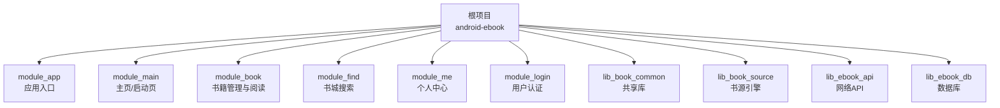
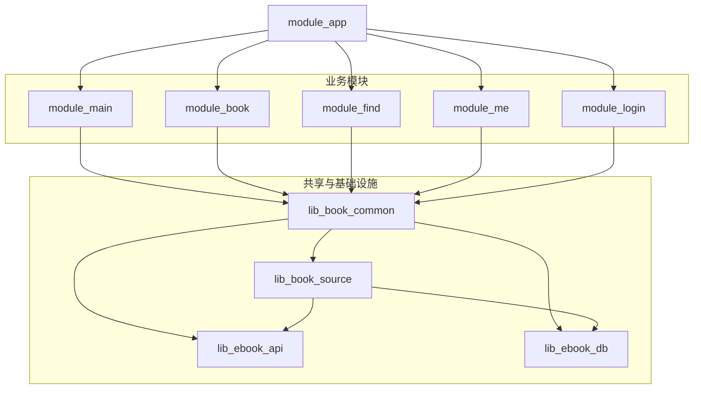
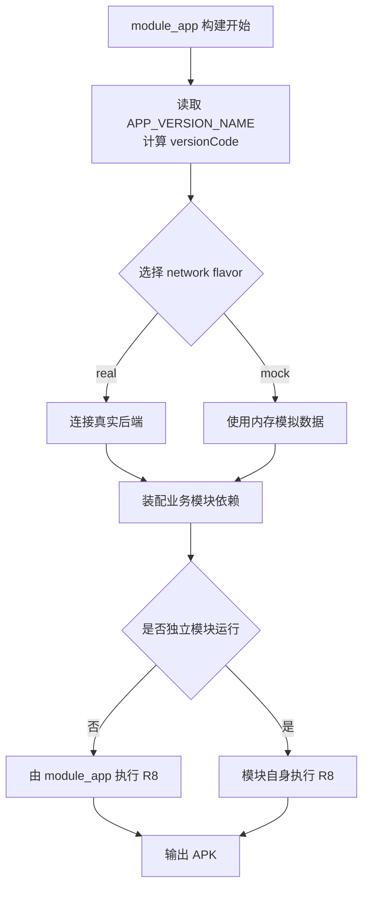
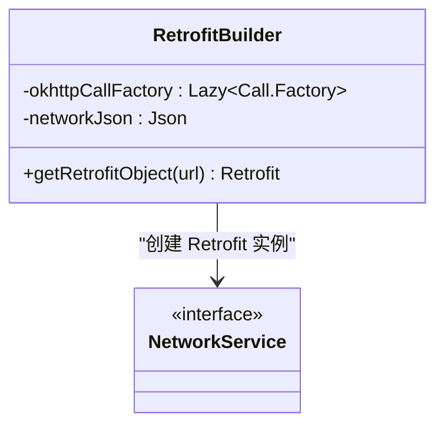
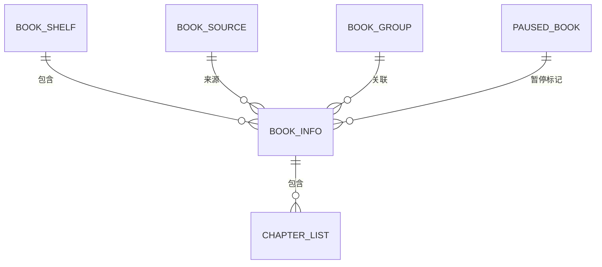
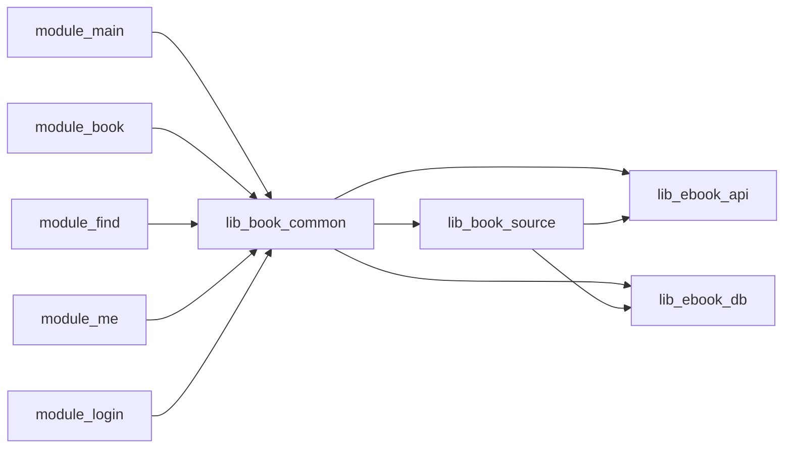
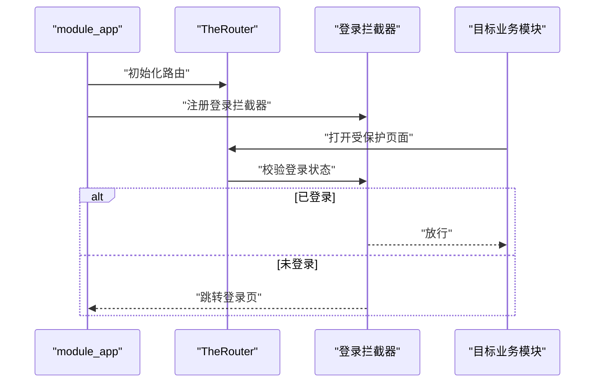
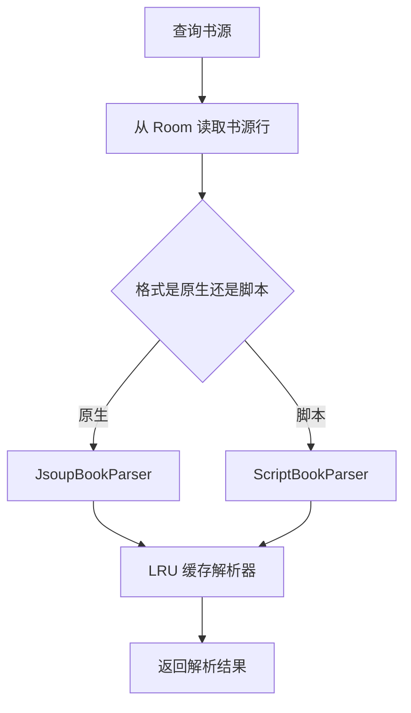
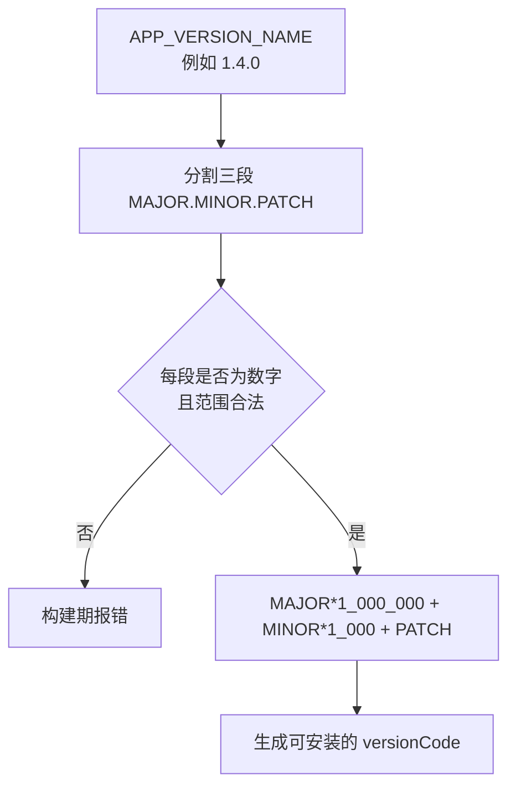

# 模块化设计

<cite>
**本文引用的文件**   
- [settings.gradle.kts](file://settings.gradle.kts)
- [build.gradle.kts](file://build.gradle.kts)
- [gradle/libs.versions.toml](file://gradle/libs.versions.toml)
- [README.MD](file://README.MD)
- [docs/versioning-practice.md](file://docs/versioning-practice.md)
- [module_app/build.gradle.kts](file://module_app/build.gradle.kts)
- [module_main/build.gradle.kts](file://module_main/build.gradle.kts)
- [module_book/build.gradle.kts](file://module_book/build.gradle.kts)
- [module_find/build.gradle.kts](file://module_find/build.gradle.kts)
- [module_me/build.gradle.kts](file://module_me/build.gradle.kts)
- [module_login/build.gradle.kts](file://module_login/build.gradle.kts)
- [lib_book_common/build.gradle.kts](file://lib_book_common/build.gradle.kts)
- [lib_book_source/build.gradle.kts](file://lib_book_source/build.gradle.kts)
- [lib_ebook_api/build.gradle.kts](file://lib_ebook_api/build.gradle.kts)
- [lib_ebook_db/build.gradle.kts](file://lib_ebook_db/build.gradle.kts)
- [module_app/src/main/java/com/ebook/MyApplication.kt](file://module_app/src/main/java/com/ebook/MyApplication.kt)
- [lib_book_common/src/main/java/com/ebook/common/analyze/source/BookSourceManagerImpl.kt](file://lib_book_common/src/main/java/com/ebook/common/analyze/source/BookSourceManagerImpl.kt)
- [lib_ebook_api/src/main/java/com/ebook/api/RetrofitBuilder.kt](file://lib_ebook_api/src/main/java/com/ebook/api/RetrofitBuilder.kt)
- [lib_ebook_db/src/main/java/com/ebook/db/AppDatabase.kt](file://lib_ebook_db/src/main/java/com/ebook/db/AppDatabase.kt)
</cite>

## 目录
1. [引言](#引言)
2. [项目结构](#项目结构)
3. [核心模块职责](#核心模块职责)
4. [架构总览](#架构总览)
5. [详细组件分析](#详细组件分析)
6. [依赖关系与通信机制](#依赖关系与通信机制)
7. [Gradle 构建与版本管理](#gradle-构建与版本管理)
8. [性能与可测试性特征](#性能与可测试性特征)
9. [故障排查指南](#故障排查指南)
10. [结论](#结论)

## 引言
本仓库是一个基于 Kotlin、Jetpack Compose、MVVM 和 Hilt 的 Android 小说阅读器。其核心工程决策是采用多模块架构：把应用入口、业务页面、书源解析引擎、网络 API 与本地数据库拆成独立 Gradle 模块，并通过 TheRouter 路由与 Provider 接口完成跨模块通信。这样做的直接收益是业务解耦、独立编译、独立调试、更强的可测试性和更清晰的演进边界。

该文档从模块划分、依赖方向、通信机制、构建配置四个维度展开，既适合初次接触项目的开发者快速定位代码，也适合长期维护者理解架构约束和设计原则。

## 项目结构
根项目通过 `settings.gradle.kts` 声明所有模块，并启用 `dependencyResolutionManagement.repositoriesMode = FAIL_ON_PROJECT_REPOS`，强制所有子模块统一使用根级仓库与 `libs.versions.toml` 中的版本别名，避免各模块各自引入不同版本造成运行时冲突。

**图示来源**
- [settings.gradle.kts:46-65](file://settings.gradle.kts#L46-L65)

根构建脚本 `build.gradle.kts` 仅声明插件别名，不直接依赖任何业务模块；真正的模块装配由 `module_app/build.gradle.kts` 完成。这种“顶层只管工具链，应用层负责装配”的结构，让新增模块时只需在两个地方登记：根 `settings.gradle.kts` 与 `module_app` 的依赖。

**章节来源**
- [settings.gradle.kts:1-65](file://settings.gradle.kts#L1-L65)
- [build.gradle.kts:1-15](file://build.gradle.kts#L1-L15)

## 核心模块职责
项目采用“功能模块 + 基础设施模块”的分层方式。功能模块之间互不依赖，基础设施模块提供被多个功能模块共享的能力。

| 模块 | 类型 | 主要职责 | 关键依赖方向 |
|---|---|---|---|
| `module_app` | 应用入口 | 组装所有业务模块、Hilt 初始化、TheRouter 拦截器、内容仓库对账、real/mock flavor 切换 | 依赖全部功能模块 |
| `module_main` | 业务模块 | 启动页、主界面、底部导航、Splash 逻辑 | `lib_book_common` |
| `module_book` | 业务模块 | 书架、阅读、评论、下载管理、阅读器状态机 | `lib_book_common` |
| `module_find` | 业务模块 | 书城浏览、跨源搜索、搜索结果聚合 | `lib_book_common` |
| `module_me` | 业务模块 | 个人设置、头像裁剪、缓存管理、更新检查、书源管理 UI | `lib_book_common`、`lib_ebook_api` |
| `module_login` | 业务模块 | 登录、注册、验证身份、修改密码 | `lib_book_common` |
| `lib_book_common` | 共享库 | 共享 UI 组件、Provider 接口、书源管理器、会话管理、通用工具 | `lib_ebook_api`、`lib_ebook_db`、`lib_book_source` |
| `lib_book_source` | 基础设施 | 原生规则解析（Jsoup）、脚本书源解释器、QuickJS 沙箱桥接 | `lib_ebook_api`、`lib_ebook_db` |
| `lib_ebook_api` | 基础设施 | Retrofit 服务、数据实体、OkHttp 拦截器、服务端地址注入 | 基础公共库 |
| `lib_ebook_db` | 基础设施 | Room 数据库、实体、DAO、迁移 | 无业务依赖 |

这些职责划分与 README 中描述的依赖方向一致：**业务模块 → lib_book_common → lib_book_source → lib_ebook_api / lib_ebook_db**。

**章节来源**
- [README.MD:1-200](file://README.MD#L1-L200)

## 架构总览
下图展示了模块间的数据和控制流向。注意：功能模块之间没有直接依赖，跨模块调用必须走 TheRouter 路由与 Provider 接口；数据访问则通过 `lib_book_common` 暴露的统一接口，底层由 `lib_ebook_api` 和 `lib_ebook_db` 实现。

**图示来源**
- [settings.gradle.kts:46-65](file://settings.gradle.kts#L46-L65)
- [README.MD:120-200](file://README.MD#L120-L200)

## 详细组件分析

### module_app：应用装配中心
`module_app` 是整个工程的唯一应用模块，承担以下职责：

1. **声明版本号与 versionCode 生成规则**  
   版本号以 `APP_VERSION_NAME = "1.4.0"` 为单一事实源，通过 `versionCodeOf()` 按三段语义版本计算 `MAJOR*1_000_000 + MINOR*1_000 + PATCH`，避免 versionName 与 versionCode 不一致导致安装失败。

2. **real / mock 双 flavor**  
   通过 `network` flavor dimension 区分真实后端与内存模拟数据，mock flavor 还追加 `.mock` applicationId 后缀，便于同时安装两套应用。

3. **R8 混淆策略**  
   release 开启 minify，consumer rules 随 AAR 传播给宿主；模块级 R8 仅在独立运行模式开启，避免 library 模式下提前剥离类导致宿主找不到符号。

4. **模块装配**  
   非独立模块下，显式依赖 `module_main`、`module_find`、`module_me`、`module_book`、`module_login`；当 `isModule=true` 时，这些依赖被跳过，使单个业务模块可作为独立 App 运行。

**图示来源**
- [module_app/build.gradle.kts:1-96](file://module_app/build.gradle.kts#L1-L96)

**章节来源**
- [module_app/build.gradle.kts:1-96](file://module_app/build.gradle.kts#L1-L96)

### module_main：主页与启动流程
`module_main` 是用户进入应用后的第一层界面，包含 SplashActivity 与 MainActivity。它依赖 `lib_book_common` 获取共享 UI 组件与能力，并通过 TheRouter 与其他模块解耦。

构建上，它遵循统一约定：

- 使用 `xrn1997.android.component` 与 `xrn1997.android.compose` 插件。
- 独立运行时开启 R8，集成模式下关闭模块级 R8。
- 单元测试开启 `isIncludeAndroidResources = true`，以便渲染冒烟测试能解析 stringResource。
- 依赖 `router.apt` 与 `router`，并由 Hilt 提供依赖注入。

**章节来源**
- [module_main/build.gradle.kts:1-75](file://module_main/build.gradle.kts#L1-L75)

### module_book：书籍管理与阅读器
`module_book` 承载书架、书籍详情、导入、编辑元信息、评论、下载管理和阅读器等复杂场景。它是 Compose 化程度最高的模块之一，也是测试覆盖最密集的业务模块。

关键特点：

- 依赖 `lib_book_common`，不直接依赖 `lib_ebook_api` 或 `lib_ebook_db`，体现“业务模块只面向共享抽象”。
- 测试依赖中显式加入 Room runtime、Robolectric、Compose UI test、Hilt testing，以支持真 DAO、页面渲染回归和仪器测试。
- 注释明确说明：生产代码不直接操作 Room，而是通过 `lib_book_common` 的 Repository 层，因此 Room runtime 只在 `testImplementation` 中出现。

**章节来源**
- [module_book/build.gradle.kts:1-100](file://module_book/build.gradle.kts#L1-L100)

### module_find：书城与搜索
`module_find` 负责书城浏览、跨源搜索和搜索结果合并。它同样只依赖 `lib_book_common`，并把具体书源解析交给 `lib_book_source`。

构建关注点包括：

- 使用 Compose 构建页面。
- 依赖 `hilt-navigation-compose`，用于 Compose 页面的 ViewModel 注入。
- 单元测试使用协程测试、Robolectric 和 Compose UI test，保持与其他业务模块一致的测试口径。

**章节来源**
- [module_find/build.gradle.kts:1-85](file://module_find/build.gradle.kts#L1-L85)

### module_me：个人中心
`module_me` 提供用户资料、头像裁剪、缓存管理、设置、关于、版本检查和书源管理 UI。它是少数直接依赖 `lib_ebook_api` 的功能模块，因为更新检查等能力需要直接与网络层契约交互。

构建上的特殊处理：

- 独立运行时设置默认 `versionCode=1`、`versionName="1.0.0"`，供设置页展示占位；集成模式由宿主 `module_app` 提供版本。
- 显式声明 Coil、EXIF、Hilt Navigation Compose 等依赖，避免因上游传递依赖变化而静默断裂。
- 单元测试覆盖 ViewModel、Repository、UI 渲染和 ReleaseStateStore。

**章节来源**
- [module_me/build.gradle.kts:1-91](file://module_me/build.gradle.kts#L1-L91)

### module_login：用户认证
`module_login` 实现邮箱为主标识的登录、注册、身份验证和密码修改流程。它通过 Provider 接口与外部模块交互，而不是直接耦合其他业务模块。

构建特点：

- 所有表单页面都是 Compose。
- 开启资源合并，以支持表单渲染冒烟测试。
- 测试依赖 Robolectric 与 Compose UI test。

**章节来源**
- [module_login/build.gradle.kts:1-75](file://module_login/build.gradle.kts#L1-L75)

### lib_book_common：共享库
`lib_book_common` 是多模块架构的核心枢纽。它向上暴露共享 UI 组件、Provider 接口、书源管理器、会话管理等能力；向下依赖 `lib_ebook_api`、`lib_ebook_db` 和 `lib_book_source`。

关键设计：

- 使用 `api()` 暴露下游模块也需要用到的类型，例如 `lib_book_source` 的解析器类型；用 `implementation()` 隐藏内部实现细节。
- 通过 TheRouter 和 Hilt 进行依赖注入与跨模块访问。
- 将共享 Compose UI 组件集中管理，并在模块内编写 UI 测试，避免共享组件契约只能通过消费方回归发现。

**章节来源**
- [lib_book_common/build.gradle.kts:1-105](file://lib_book_common/build.gradle.kts#L1-L105)

### lib_book_source：书源引擎
`lib_book_source` 是书源解析专用层，封装原生规则解析、脚本书源解释器和 QuickJS 沙箱桥接。它依赖 `lib_ebook_api` 和 `lib_ebook_db` 提供的数据模型，但对外只暴露解析器契约。

重要特性：

- 通过 NDK 约定插件加载 native 库，debug 模式额外放宽 ABI 过滤器以支持模拟器。
- 原生规则使用 Jsoup，脚本规则通过 JS 沙箱执行。
- JSON 序列化依赖仅 `implementation`，避免把 JSON 形态泄露到解析器的公开 API 中。
- 提供桌面端沙箱库构建任务，用于开发环境下的真 QuickJS 测试。

**章节来源**
- [lib_book_source/build.gradle.kts:1-111](file://lib_book_source/build.gradle.kts#L1-L111)

### lib_ebook_api：网络 API
`lib_ebook_api` 定义 Retrofit 服务、数据实体、OkHttp 拦截器和统一的网络构建器。服务端基址从 `local.properties` 的 `ebook.server.host` 注入，默认回退到模拟器宿主机地址。

核心构建器 `RetrofitBuilder` 的设计原则：

- 复用共享的 `Call.Factory`，避免重复构造 OkHttpClient。
- 使用 `dagger.Lazy` 防止 Hilt 循环依赖。
- 显式注册 kotlinx.serialization 转换器与 Scalars 转换器，确保 `@Serializable` 返回类型与 HTML String 返回类型都能正常工作。

**图示来源**
- [lib_ebook_api/src/main/java/com/ebook/api/RetrofitBuilder.kt:1-45](file://lib_ebook_api/src/main/java/com/ebook/api/RetrofitBuilder.kt#L1-L45)

**章节来源**
- [lib_ebook_api/build.gradle.kts:1-64](file://lib_ebook_api/build.gradle.kts#L1-L64)
- [lib_ebook_api/src/main/java/com/ebook/api/RetrofitBuilder.kt:1-45](file://lib_ebook_api/src/main/java/com/ebook/api/RetrofitBuilder.kt#L1-L45)

### lib_ebook_db：数据库
`lib_ebook_db` 是 Room 3.0.0 的持久化层，定义八张表及其 DAO。它只声明实体与 DAO 对应关系，读写请求由上层仓库发起。

关键约束：

- 主键策略区分自然键和自增键：书籍、书源、暂停标记用自然键，下载任务和搜索历史用自增 ID。
- Schema 演进要求三件事同步：版本号 +1、追加紧邻迁移、提交 Room 生成的 schema JSON。
- 禁止启用破坏性迁移回退，保证数据迁移可追溯。

**图示来源**
- [lib_ebook_db/src/main/java/com/ebook/db/AppDatabase.kt:1-76](file://lib_ebook_db/src/main/java/com/ebook/db/AppDatabase.kt#L1-L76)

**章节来源**
- [lib_ebook_db/build.gradle.kts:1-51](file://lib_ebook_db/build.gradle.kts#L1-L51)
- [lib_ebook_db/src/main/java/com/ebook/db/AppDatabase.kt:1-76](file://lib_ebook_db/src/main/java/com/ebook/db/AppDatabase.kt#L1-L76)

## 依赖关系与通信机制

### 模块依赖方向
依赖方向遵循“业务模块依赖共享库，共享库再依赖基础设施”的分层模型。功能模块之间不直接依赖，从而避免业务耦合扩散。

**图示来源**
- [settings.gradle.kts:46-65](file://settings.gradle.kts#L46-L65)
- [README.MD:120-200](file://README.MD#L120-L200)

### TheRouter 路由系统
每个业务模块都在 `assets/therouter/routeMap.json` 中注册路由，`module_app` 在启动时添加路由拦截器。登录相关页面通过拦截器保护，未登录时自动跳转到登录流程。

**图示来源**
- [module_app/src/main/java/com/ebook/MyApplication.kt:1-66](file://module_app/src/main/java/com/ebook/MyApplication.kt#L1-L66)

### Provider 接口设计
业务模块通过 Provider 接口向外暴露能力，而不是直接引用其他模块的具体类。`lib_book_common` 是 Provider 的主要阵地，例如书源管理器、会话管理、共享 UI 组件等。

`BookSourceManagerImpl` 体现了 Provider 的典型设计：

- 以 Room 为唯一事实源，用户导入的书源规则只落库。
- 按 `format` 分派原生规则与脚本规则两条求值路径。
- 通过注入的 parser 工厂实现可测性，测试可以替换真实解析器。
- 默认源每次现算，不维护易出错的内存快照。

**图示来源**
- [lib_book_common/src/main/java/com/ebook/common/analyze/source/BookSourceManagerImpl.kt:1-120](file://lib_book_common/src/main/java/com/ebook/common/analyze/source/BookSourceManagerImpl.kt#L1-L120)

**章节来源**
- [lib_book_common/src/main/java/com/ebook/common/analyze/source/BookSourceManagerImpl.kt:1-120](file://lib_book_common/src/main/java/com/ebook/common/analyze/source/BookSourceManagerImpl.kt#L1-L120)

## Gradle 构建与版本管理

### 根级仓库与版本目录
根 `settings.gradle.kts` 启用 `RepositoriesMode.FAIL_ON_PROJECT_REPOS`，强制所有子模块使用根级仓库列表。`gradle/libs.versions.toml` 集中管理 AGP、Kotlin、Compose、Room、Retrofit、Hilt、TheRouter 等依赖版本，避免模块各自写死版本号。

### 自定义构建约定
`build-logic` 提供 Android Application、Library、Compose、Room、Hilt 等约定插件，统一 Java/Kotlin 版本、ProGuard、测试选项等。业务模块只需应用约定插件，不需要重复配置。

### 模块独立运行模式
通过 `gradle.properties` 中的 `isModule=true`，业务模块可以作为独立 App 运行，自带 mock 数据源，无需后端即可开发调试。`module_app` 根据该属性决定是否装配所有业务模块。

### 语义版本与 versionCode 映射
`module_app/build.gradle.kts` 以 `APP_VERSION_NAME` 为唯一入口，按三段 SemVer 反解 `versionCode`。预发布后缀不参与计算，同号码正式版共用同一个 code，符合 GitHub Release 分发场景。

版本实践文档进一步规定：

- SemVer 必须是 `MAJOR.MINOR.PATCH` 三段。
- tag 前缀建议使用小写 `v`，但当前仓库历史使用大写 `V`。
- Android `versionCode` 必须单调递增且为正整数。
- 应用没有 public API，但内部实质新功能仍建议升 MINOR。

**图示来源**
- [module_app/build.gradle.kts:10-33](file://module_app/build.gradle.kts#L10-L33)
- [docs/versioning-practice.md:1-200](file://docs/versioning-practice.md#L1-L200)

**章节来源**
- [settings.gradle.kts:1-45](file://settings.gradle.kts#L1-L45)
- [gradle/libs.versions.toml:1-237](file://gradle/libs.versions.toml#L1-L237)
- [module_app/build.gradle.kts:1-96](file://module_app/build.gradle.kts#L1-L96)
- [docs/versioning-practice.md:1-200](file://docs/versioning-practice.md#L1-L200)

## 性能与可测试性特征

### 编译性能
- 根级仓库和版本目录减少依赖解析分支。
- 约定插件统一构建配置，减少重复脚本。
- 业务模块在集成模式下关闭模块级 R8，避免重复剥离类。

### 运行时性能
- Retrofit 复用共享 Call.Factory，避免重复构造 OkHttp。
- 书源解析器使用 LRU 缓存，避免频繁重建解析器。
- 默认源不再维护易过期的内存快照，统一从 Room 计算。

### 可测试性
- 功能模块与基础设施模块分离，方便替换网络与数据库实现。
- `BookSourceManagerImpl` 通过 parser 工厂注入实现可测性。
- 各模块都有 Robolectric、Compose UI test、协程测试、Room DAO 测试。
- `module_app` 提供 real/mock 双 flavor，无需后端也能完整调试。

## 故障排查指南

### 无法连接后端
检查 `local.properties` 中的 `ebook.server.host` 是否正确；默认值为 `10.0.2.2`，适用于模拟器访问宿主机。若使用局域网真机，需改为宿主机 IP。

**章节来源**
- [lib_ebook_api/build.gradle.kts:10-26](file://lib_ebook_api/build.gradle.kts#L10-L26)

### 模块编译找不到类
确认该模块是否应依赖 `lib_book_common` 而非直接依赖 `lib_ebook_api` 或 `lib_ebook_db`。业务模块之间的直接依赖通常违反架构约定。

**章节来源**
- [README.MD:120-200](file://README.MD#L120-L200)

### 升级 Room 后迁移失败
改实体时必须同时做三件事：增加数据库版本号、追加紧邻迁移、提交 Room 生成的 schema JSON。不要启用破坏性迁移回退。

**章节来源**
- [lib_ebook_db/src/main/java/com/ebook/db/AppDatabase.kt:40-76](file://lib_ebook_db/src/main/java/com/ebook/db/AppDatabase.kt#L40-L76)

### 独立模块无法运行
确认 `gradle.properties` 中 `isModule=true`，并确保该模块有独立的入口 Activity 和 manifest。`module_app` 在 `isModule=false` 时才装配所有业务模块。

**章节来源**
- [module_app/build.gradle.kts:60-96](file://module_app/build.gradle.kts#L60-L96)

## 结论
这个项目的模块化设计围绕“业务解耦、清晰依赖、独立可测、统一构建”展开。`module_app` 负责装配，业务模块聚焦页面与领域逻辑，`lib_book_common` 作为共享契约层，`lib_book_source`、`lib_ebook_api`、`lib_ebook_db` 分别承担书源解析、网络与数据库职责。跨模块通信通过 TheRouter 与 Provider 接口完成，Gradle 通过根级仓库、版本目录和约定插件保证依赖一致性与构建效率。

对于新加入的开发者，建议优先熟悉 `lib_book_common` 的 Provider 接口和 TheRouter 路由，再逐步深入业务模块；对于长期维护者，则应严格遵守依赖方向、Provider 抽象和版本管理约定，避免模块边界再次模糊。