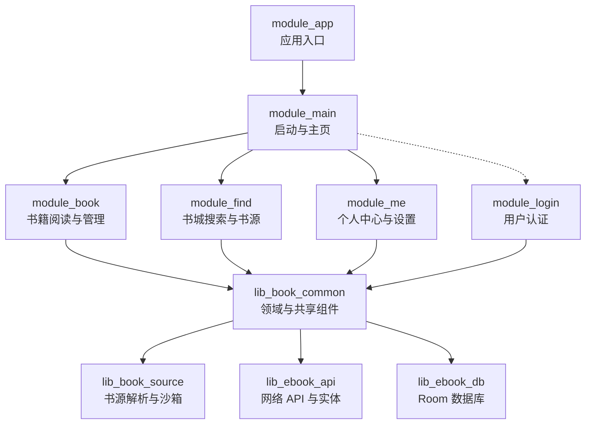
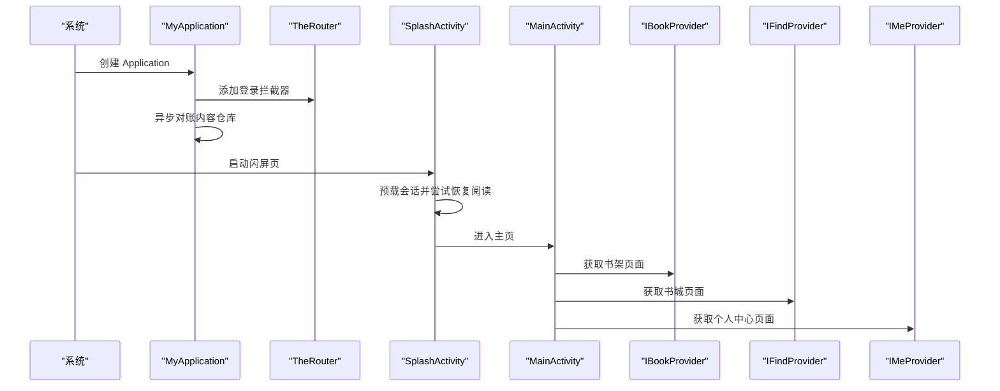
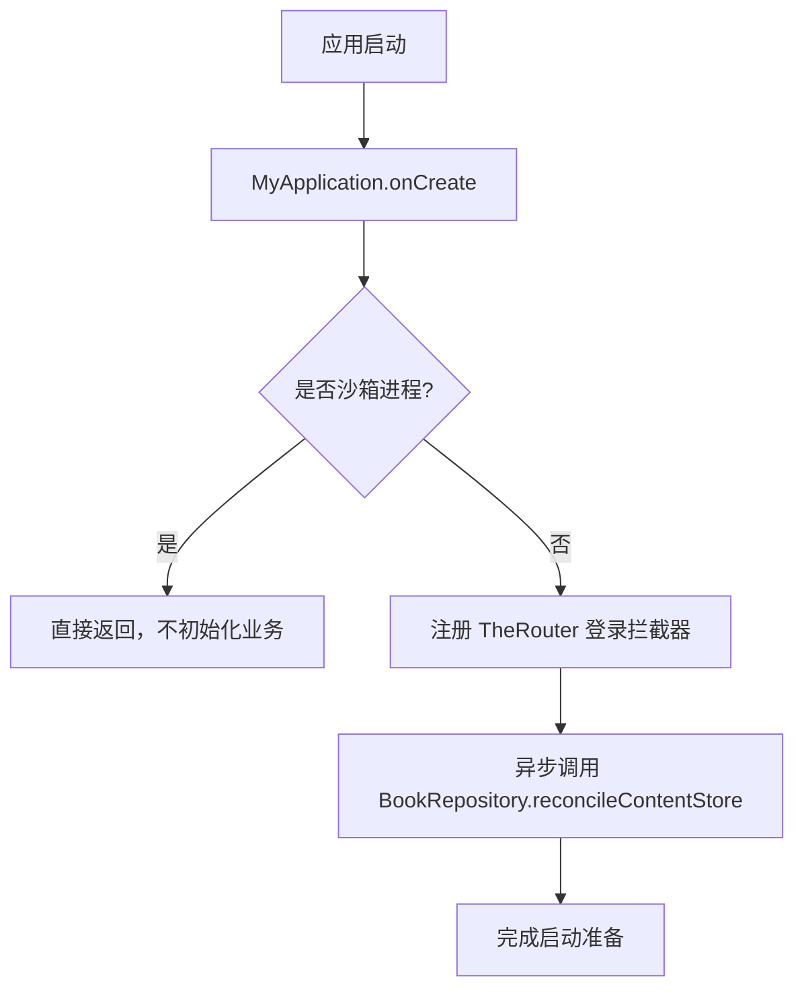
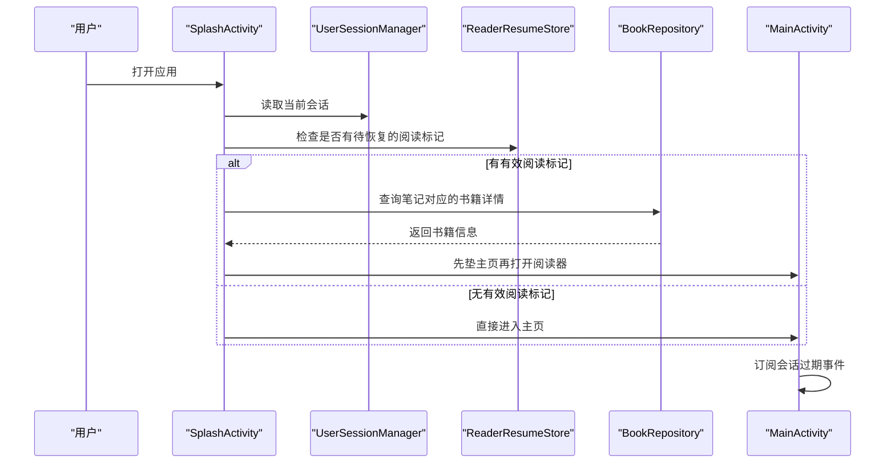
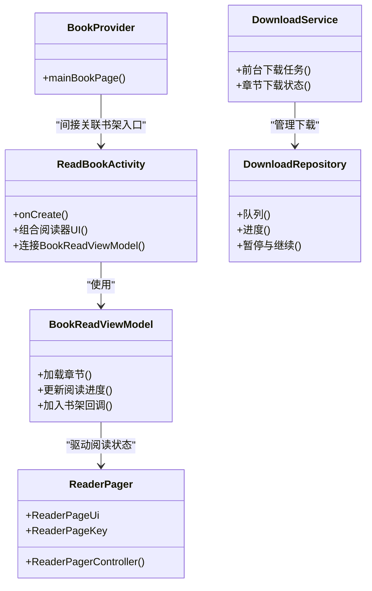
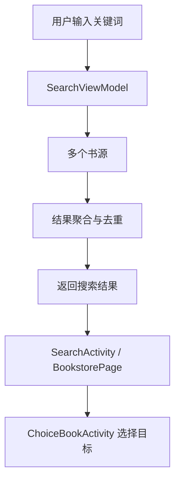
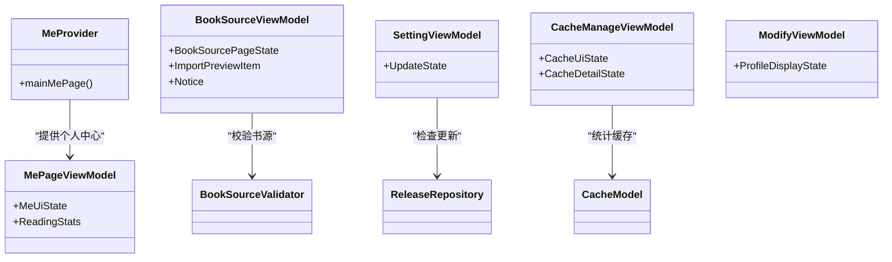
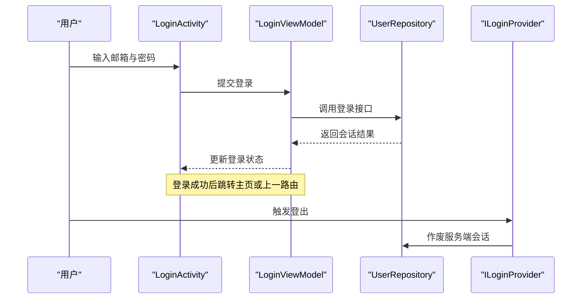
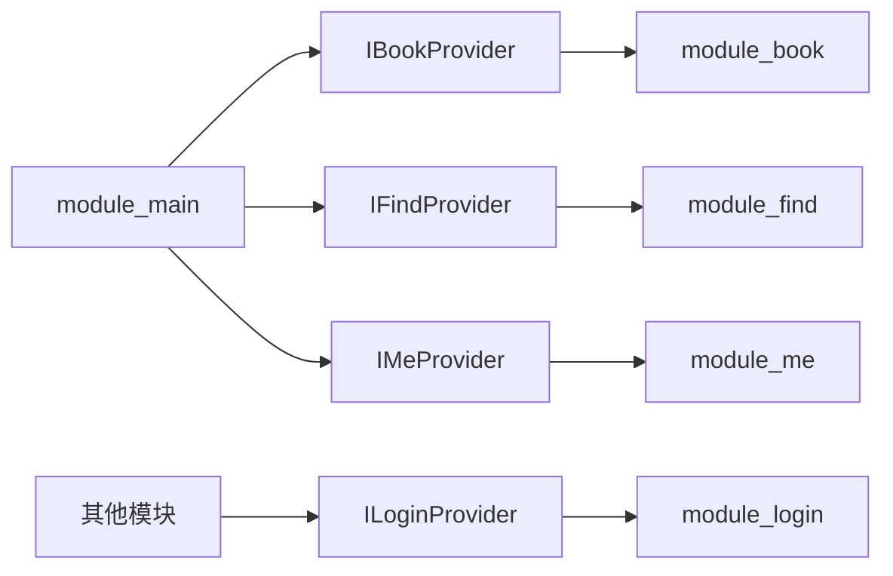

# 模块职责划分

<cite>
**本文引用的文件**   
- [README.MD](file://README.MD)
- [MyApplication.kt](file://module_app/src/main/java/com/ebook/MyApplication.kt)
- [SplashActivity.kt](file://module_main/src/main/java/com/ebook/main/SplashActivity.kt)
- [MainActivity.kt](file://module_main/src/main/java/com/ebook/main/MainActivity.kt)
- [BookProvider.kt](file://module_book/src/main/java/com/ebook/book/provider/BookProvider.kt)
- [BookShelfPage.kt](file://module_book/src/main/java/com/ebook/book/page/BookShelfPage.kt)
- [ReadBookActivity.kt](file://module_book/src/main/java/com/ebook/book/ReadBookActivity.kt)
- [BookDetailActivity.kt](file://module_book/src/main/java/com/ebook/book/BookDetailActivity.kt)
- [DownloadManageActivity.kt](file://module_book/src/main/java/com/ebook/book/DownloadManageActivity.kt)
- [ImportBookActivity.kt](file://module_book/src/main/java/com/ebook/book/ImportBookActivity.kt)
- [EditBookMetaActivity.kt](file://module_book/src/main/java/com/ebook/book/EditBookMetaActivity.kt)
- [BookCommentsActivity.kt](file://module_book/src/main/java/com/ebook/book/BookCommentsActivity.kt)
- [DownloadService.kt](file://module_book/src/main/java/com/ebook/book/service/DownloadService.kt)
- [DownloadRepository.kt](file://module_book/src/main/java/com/ebook/book/repository/DownloadRepository.kt)
- [BookImportRepository.kt](file://module_book/src/main/java/com/ebook/book/repository/BookImportRepository.kt)
- [BookReadViewModel.kt](file://module_book/src/main/java/com/ebook/book/mvvm/viewmodel/BookReadViewModel.kt)
- [ReaderPager.kt](file://module_book/src/main/java/com/ebook/book/reader/ReaderPager.kt)
- [FindProvider.kt](file://module_find/src/main/java/com/ebook/find/provider/FindProvider.kt)
- [SearchActivity.kt](file://module_find/src/main/java/com/ebook/find/SearchActivity.kt)
- [ChoiceBookActivity.kt](file://module_find/src/main/java/com/ebook/find/ChoiceBookActivity.kt)
- [BookstorePage.kt](file://module_find/src/main/java/com/ebook/find/page/BookstorePage.kt)
- [BookSourceRepository.kt](file://module_find/src/main/java/com/ebook/find/repository/BookSourceRepository.kt)
- [SearchHistoryRepository.kt](file://module_find/src/main/java/com/ebook/find/repository/SearchHistoryRepository.kt)
- [SearchViewModel.kt](file://module_find/src/main/java/com/ebook/find/mvvm/viewmodel/SearchViewModel.kt)
- [LibraryViewModel.kt](file://module_find/src/main/java/com/ebook/find/mvvm/viewmodel/LibraryViewModel.kt)
- [MeProvider.kt](file://module_me/src/main/java/com/ebook/me/provider/MeProvider.kt)
- [SettingActivity.kt](file://module_me/src/main/java/com/ebook/me/view/SettingActivity.kt)
- [CacheManageActivity.kt](file://module_me/src/main/java/com/ebook/me/view/CacheManageActivity.kt)
- [BookSourceManageActivity.kt](file://module_me/src/main/java/com/ebook/me/view/BookSourceManageActivity.kt)
- [ModifyInformationActivity.kt](file://module_me/src/main/java/com/ebook/me/view/ModifyInformationActivity.kt)
- [ModifyNicknameActivity.kt](file://module_me/src/main/java/com/ebook/me/view/ModifyNicknameActivity.kt)
- [MyCommentActivity.kt](file://module_me/src/main/java/com/ebook/me/view/MyCommentActivity.kt)
- [AboutActivity.kt](file://module_me/src/main/java/com/ebook/me/view/AboutActivity.kt)
- [LicensesActivity.kt](file://module_me/src/main/java/com/ebook/me/view/LicensesActivity.kt)
- [MePageViewModel.kt](file://module_me/src/main/java/com/ebook/me/mvvm/viewmodel/MePageViewModel.kt)
- [SettingViewModel.kt](file://module_me/src/main/java/com/ebook/me/mvvm/viewmodel/SettingViewModel.kt)
- [BookSourceViewModel.kt](file://module_me/src/main/java/com/ebook/me/mvvm/viewmodel/BookSourceViewModel.kt)
- [LoginProvider.kt](file://module_login/src/main/java/com/ebook/login/provider/LoginProvider.kt)
- [LoginActivity.kt](file://module_login/src/main/java/com/ebook/login/LoginActivity.kt)
- [RegisterActivity.kt](file://module_login/src/main/java/com/ebook/login/RegisterActivity.kt)
- [VerifyUserActivity.kt](file://module_login/src/main/java/com/ebook/login/VerifyUserActivity.kt)
- [ModifyPwdActivity.kt](file://module_login/src/main/java/com/ebook/login/ModifyPwdActivity.kt)
- [LoginViewModel.kt](file://module_login/src/main/java/com/ebook/login/mvvm/viewmodel/LoginViewModel.kt)
- [RegisterViewModel.kt](file://module_login/src/main/java/com/ebook/login/mvvm/viewmodel/RegisterViewModel.kt)
- [ModifyPwdViewModel.kt](file://module_login/src/main/java/com/ebook/login/mvvm/viewmodel/ModifyPwdViewModel.kt)
</cite>

## 目录
1. [引言](#引言)
2. [项目结构](#项目结构)
3. [核心模块与边界原则](#核心模块与边界原则)
4. [架构总览](#架构总览)
5. [模块详细职责分析](#模块详细职责分析)
6. [跨模块依赖与接口契约](#跨模块依赖与接口契约)
7. [性能与可维护性考量](#性能与可维护性考量)
8. [常见问题排查](#常见问题排查)
9. [结论](#结论)

## 引言
本项目是一个基于 Kotlin、Jetpack Compose、MVVM 与多模块架构的 Android 小说阅读器。整体采用“功能模块 + 基础库”的分层方式：业务功能按 module_ 划分，通用能力下沉到 lib_book_common、lib_book_source、lib_ebook_api、lib_ebook_db；模块之间不直接互相依赖，而是通过 TheRouter 路由和 Provider SPI 暴露页面与服务。

从仓库说明可知，各模块职责已经收敛为：
- module_app：应用入口，组装 Hilt、TheRouter、登录拦截、内容仓库对账等全局初始化逻辑。
- module_main：启动页、主页容器与三个 Tab（书架、书城、我的）导航宿主。
- module_book：书籍阅读与管理，包括书架、详情页、阅读器、下载、导入、评论等。
- module_find：书城搜索、书库浏览、书源聚合与搜索历史。
- module_me：个人中心、设置、缓存管理、书源管理、版本检查与用户资料修改。
- module_login：邮箱账号认证流程，包括登录、注册、验证身份与改密。

本文件围绕这些目标，梳理每个模块的目录结构、主要类职责、对外暴露接口，并给出模块边界的划分原则与代码级示例路径。

## 项目结构
仓库采用 Gradle 多模块组织，关键顶层目录如下：
- module_app：Android Application 入口，负责 DI 图装配、路由拦截、沙箱进程隔离、内容仓库对账。
- module_main：启动与主界面，承载底部三个 Tab。
- module_book / module_find / module_me / module_login：四大业务域模块，各自拥有 Activity、ViewModel、Repository、Provider、page/view 等子包。
- lib_book_common / lib_book_source / lib_ebook_api / lib_ebook_db：共享基础库，提供领域模型、书源解析引擎、网络 API 与数据库实体。
- docs/adr：架构决策记录，是理解模块边界的重要设计依据。

**图表来源**
- [README.MD:104-142](file://README.MD#L104-L142)
- [MyApplication.kt:1-66](file://module_app/src/main/java/com/ebook/MyApplication.kt#L1-L66)

**章节来源**
- [README.MD:1-212](file://README.MD#L1-L212)

## 核心模块与边界原则
项目明确采用 MVVM + Hilt + Coroutines + Flow，并通过 TheRouter + Provider 实现跨模块解耦。模块边界遵循以下设计原则：

| 原则 | 在本项目中的体现 |
| --- | --- |
| 单一职责 | 每个 module_ 只负责一个业务域：book 管阅读与本地内容，find 管搜索与书源，me 管个人与设置，login 管认证。 |
| 高内聚低耦合 | 模块内部按 activity → viewmodel → repository 分层；模块之间通过 Provider 接口与路由跳转交互，避免直接 import 对方 Activity。 |
| 稳定抽象在上 | 模块对外以 IBookProvider / IFindProvider / IMeProvider / ILoginProvider 暴露页面和服务，具体实现由 TheRouter 装配。 |
| 可独立调试 | README 中说明 isModule=true 时各功能模块可作为独立 App 运行，便于单模块开发。 |
| 数据流清晰 | ViewModel 持有 UI State，Repository 封装 Room 与网络，Activity/Compose Page 仅消费状态。 |
| 启动逻辑集中 | 会话恢复、路由拦截、沙箱进程门控集中在 MyApplication 与 SplashActivity，不在业务模块散落。 |

这些原则在仓库的 ADR、README 和各模块注释中反复出现，例如：
- 模块互不依赖，跨模块走 TheRouter + Provider。
- 所有页面使用 Compose，ViewModel 使用 @HiltViewModel。
- 认证统一由 login 模块提供，其他模块通过 ILoginProvider 调用登出能力。
- 书源规则由 JSON 或脚本驱动，解析与执行落在 lib_book_source，业务模块只消费结果。

**章节来源**
- [README.MD:104-142](file://README.MD#L104-L142)
- [LoginProvider.kt:1-36](file://module_login/src/main/java/com/ebook/login/provider/LoginProvider.kt#L1-L36)

## 架构总览
下图展示应用启动、会话恢复、主页 Tab 与跨模块 Provider 的整体关系：

**图表来源**
- [MyApplication.kt:1-66](file://module_app/src/main/java/com/ebook/MyApplication.kt#L1-L66)
- [SplashActivity.kt:1-200](file://module_main/src/main/java/com/ebook/main/SplashActivity.kt#L1-L200)
- [MainActivity.kt:1-200](file://module_main/src/main/java/com/ebook/main/MainActivity.kt#L1-L200)
- [BookProvider.kt:1-16](file://module_book/src/main/java/com/ebook/book/provider/BookProvider.kt#L1-L16)
- [FindProvider.kt:1-19](file://module_find/src/main/java/com/ebook/find/provider/FindProvider.kt#L1-L19)
- [MeProvider.kt:1-20](file://module_me/src/main/java/com/ebook/me/provider/MeProvider.kt#L1-L20)

## 模块详细职责分析

### module_app：应用入口与全局装配
module_app 不是业务模块，而是应用壳。它的核心职责是：
- 继承 lib_book_common 的 BookApplication，保留 Hilt 注入与基类初始化顺序。
- 在 Application.onCreate 中注册 TheRouter 登录拦截器。
- 在隔离的沙箱进程中跳过业务初始化，避免 `:js` 沙箱进程误读 Room 数据。
- 通过 Hilt EntryPoint 延迟获取 BookRepository，在应用作用域中对账内容存储，回收导入中断留下的无主目录。
- 将 BookRepository 构造从字段注入改为 EntryPoint 访问，避免沙箱进程提前注入崩溃。

对外暴露的主要能力：
- 应用生命周期钩子（Application.onCreate）。
- Hilt EntryPoint：ContentStoreEntryPoint.bookRepository()。

**图表来源**
- [MyApplication.kt:1-66](file://module_app/src/main/java/com/ebook/MyApplication.kt#L1-L66)

**章节来源**
- [MyApplication.kt:1-66](file://module_app/src/main/java/com/ebook/MyApplication.kt#L1-L66)

### module_main：启动与主页容器
module_main 的职责是“把应用带进来，并把三个 Tab 组合起来”。它不负责书架、书城、个人的具体业务逻辑，只负责：
- SplashActivity：显示欢迎图、并行等待最小展示时长与会话预载、判断是否恢复上次阅读、超时保护、防重复跳转。
- MainActivity：作为三个 Tab 的 NavHost 宿主，订阅 SessionEventBus，处理会话过期事件；管理退出双击逻辑。
- 底部导航与路由：定义 Bookshelf、Bookstore、Me 三个 Screen，并通过统一 switchTab 操作回退栈。

对外暴露的主要能力：
- 路由入口 KeyCode.Main.MAIN_PATH。
- 启动流程控制（自动登录、会话恢复、主页跳转）。
- 会话过期统一处置。

**图表来源**
- [SplashActivity.kt:1-200](file://module_main/src/main/java/com/ebook/main/SplashActivity.kt#L1-L200)
- [MainActivity.kt:1-200](file://module_main/src/main/java/com/ebook/main/MainActivity.kt#L1-L200)

**章节来源**
- [SplashActivity.kt:1-200](file://module_main/src/main/java/com/ebook/main/SplashActivity.kt#L1-L200)
- [MainActivity.kt:1-200](file://module_main/src/main/java/com/ebook/main/MainActivity.kt#L1-L200)

### module_book：书籍阅读与管理
module_book 是阅读器核心，承担“书架、书籍详情、阅读、下载、导入、评论”等业务。其目录结构呈现典型的 MVVM + Compose 布局：

| 目录或类 | 职责 |
| --- | --- |
| book/ReadBookActivity | 阅读器入口，组合 BookReadViewModel 与 Compose 阅读器界面。 |
| book/BookDetailActivity | 书籍详情页面，展示书名、作者、简介、来源、加入书架等操作。 |
| book/DownloadManageActivity | 下载中心，支持批量选择、暂停、继续、按书分组。 |
| book/ImportBookActivity | 本地 TXT 导入入口。 |
| book/EditBookMetaActivity | 编辑书籍元数据。 |
| book/BookCommentsActivity | 查看某本书的章节评论。 |
| reader/* | 阅读器渲染与滚动控制器，如 ReaderPager、ReaderScrollController、ChapterLayoutCache、ReaderTypesetter。 |
| mvvm/viewmodel/* | 阅读、详情、导入、下载、换源、评论等 ViewModel。 |
| repository/* | DownloadRepository、BookImportRepository 等下载与导入仓储。 |
| service/DownloadService | 前台下载服务。 |
| provider/BookProvider | 向主页暴露书架页面。 |

主要对外接口：
- BookProvider.mainBookPage：返回书架 Compose 页面。
- 各类 Activity：通过 TheRouter 被其他模块或测试宿主拉起。
- ViewModel：管理阅读进度、下载状态、评论列表、换源候选等 UI State。

**图表来源**
- [ReadBookActivity.kt:108-108](file://module_book/src/main/java/com/ebook/book/ReadBookActivity.kt#L108-L108)
- [BookReadViewModel.kt:16-16](file://module_book/src/main/java/com/ebook/book/mvvm/viewmodel/BookReadViewModel.kt#L16-L16)
- [ReaderPager.kt:59-101](file://module_book/src/main/java/com/ebook/book/reader/ReaderPager.kt#L59-L101)
- [DownloadService.kt:57-57](file://module_book/src/main/java/com/ebook/book/service/DownloadService.kt#L57-L57)
- [DownloadRepository.kt:45-45](file://module_book/src/main/java/com/ebook/book/repository/DownloadRepository.kt#L45-L45)
- [BookProvider.kt:1-16](file://module_book/src/main/java/com/ebook/book/provider/BookProvider.kt#L1-L16)

**章节来源**
- [BookProvider.kt:1-16](file://module_book/src/main/java/com/ebook/book/provider/BookProvider.kt#L1-L16)
- [BookShelfPage.kt:107-107](file://module_book/src/main/java/com/ebook/book/page/BookShelfPage.kt#L107-L107)
- [ReadBookActivity.kt:108-108](file://module_book/src/main/java/com/ebook/book/ReadBookActivity.kt#L108-L108)
- [BookDetailActivity.kt:63-63](file://module_book/src/main/java/com/ebook/book/BookDetailActivity.kt#L63-L63)
- [DownloadManageActivity.kt:80-80](file://module_book/src/main/java/com/ebook/book/DownloadManageActivity.kt#L80-L80)
- [ImportBookActivity.kt:90-90](file://module_book/src/main/java/com/ebook/book/ImportBookActivity.kt#L90-L90)
- [EditBookMetaActivity.kt:65-65](file://module_book/src/main/java/com/ebook/book/EditBookMetaActivity.kt#L65-L65)
- [BookCommentsActivity.kt:86-86](file://module_book/src/main/java/com/ebook/book/BookCommentsActivity.kt#L86-L86)
- [DownloadService.kt:57-57](file://module_book/src/main/java/com/ebook/book/service/DownloadService.kt#L57-L57)
- [DownloadRepository.kt:45-310](file://module_book/src/main/java/com/ebook/book/repository/DownloadRepository.kt#L45-L310)
- [BookImportRepository.kt:29-29](file://module_book/src/main/java/com/ebook/book/repository/BookImportRepository.kt#L29-L29)
- [BookReadViewModel.kt:16-146](file://module_book/src/main/java/com/ebook/book/mvvm/viewmodel/BookReadViewModel.kt#L16-L146)
- [ReaderPager.kt:59-101](file://module_book/src/main/java/com/ebook/book/reader/ReaderPager.kt#L59-L101)

### module_find：书城搜索与书源管理
module_find 聚焦“找书”，包括：
- SearchActivity：搜索入口，委托 SearchViewModel 执行跨源搜索。
- ChoiceBookActivity：选择目标书源或条目。
- BookstorePage：书城浏览页面，支持按书源切换、分类浏览。
- BookSourceRepository：书源仓库，管理书源列表、启用状态、默认源与缓存策略。
- SearchHistoryRepository：搜索历史仓库。
- SearchViewModel：聚合多个书源搜索结果，处理轮询、失败合并、进度反馈。
- LibraryViewModel：书城书库状态，包含 LibrarySourceState、分页与合并逻辑。

主要对外接口：
- FindProvider.mainFindPage：返回书城页面。
- 搜索与书库相关 Activity：供其他模块跳转到书城或选择书。

**图表来源**
- [SearchActivity.kt:133-133](file://module_find/src/main/java/com/ebook/find/SearchActivity.kt#L133-L133)
- [SearchViewModel.kt:56-56](file://module_find/src/main/java/com/ebook/find/mvvm/viewmodel/SearchViewModel.kt#L56-L56)
- [BookstorePage.kt:110-110](file://module_find/src/main/java/com/ebook/find/page/BookstorePage.kt#L110-L110)
- [BookSourceRepository.kt:55-55](file://module_find/src/main/java/com/ebook/find/repository/BookSourceRepository.kt#L55-L55)
- [SearchHistoryRepository.kt:18-18](file://module_find/src/main/java/com/ebook/find/repository/SearchHistoryRepository.kt#L18-L18)
- [ChoiceBookActivity.kt:38-38](file://module_find/src/main/java/com/ebook/find/ChoiceBookActivity.kt#L38-L38)

**章节来源**
- [FindProvider.kt:1-19](file://module_find/src/main/java/com/ebook/find/provider/FindProvider.kt#L1-L19)
- [SearchActivity.kt:133-133](file://module_find/src/main/java/com/ebook/find/SearchActivity.kt#L133-L133)
- [ChoiceBookActivity.kt:38-38](file://module_find/src/main/java/com/ebook/find/ChoiceBookActivity.kt#L38-L38)
- [BookstorePage.kt:110-110](file://module_find/src/main/java/com/ebook/find/page/BookstorePage.kt#L110-L110)
- [BookSourceRepository.kt:31-67](file://module_find/src/main/java/com/ebook/find/repository/BookSourceRepository.kt#L31-L67)
- [SearchHistoryRepository.kt:18-18](file://module_find/src/main/java/com/ebook/find/repository/SearchHistoryRepository.kt#L18-L18)
- [SearchViewModel.kt:56-492](file://module_find/src/main/java/com/ebook/find/mvvm/viewmodel/SearchViewModel.kt#L56-L492)
- [LibraryViewModel.kt:42-103](file://module_find/src/main/java/com/ebook/find/mvvm/viewmodel/LibraryViewModel.kt#L42-L103)

### module_me：个人中心与设置
module_me 是“我”的领域，包含：
- MePage 及 MePageViewModel：个人中心首页、阅读概览、用户信息展示。
- SettingActivity / SettingViewModel：应用设置、主题、更新检查。
- CacheManageActivity / CacheManageViewModel：缓存类型、大小、清理。
- BookSourceManageActivity / BookSourceViewModel：书源导入、预览、启用禁用、删除。
- ModifyInformationActivity / ModifyNicknameActivity / ModifyViewModel：修改昵称、头像、个人资料。
- MyCommentActivity / CommentViewModel：我的评论管理。
- AboutActivity / LicensesActivity：关于与开源许可。
- domain/BookSourceValidator：书源校验、脚本警告、验证结果。
- repository/ReleaseRepository、ReleaseStateStore、CacheModel、ModifyRepository：版本检查、缓存统计、资料修改。

主要对外接口：
- MeProvider.mainMePage：返回个人中心页面。
- 设置、书源管理、评论管理等 Activity：作为独立页面被主页或其他模块跳转。

**图表来源**
- [MeProvider.kt:1-20](file://module_me/src/main/java/com/ebook/me/provider/MeProvider.kt#L1-L20)
- [MePageViewModel.kt:27-70](file://module_me/src/main/java/com/ebook/me/mvvm/viewmodel/MePageViewModel.kt#L27-L70)
- [BookSourceViewModel.kt:67-163](file://module_me/src/main/java/com/ebook/me/mvvm/viewmodel/BookSourceViewModel.kt#L67-L163)
- [SettingViewModel.kt:63-359](file://module_me/src/main/java/com/ebook/me/mvvm/viewmodel/SettingViewModel.kt#L63-L359)
- [CacheManageViewModel.kt:36-67](file://module_me/src/main/java/com/ebook/me/mvvm/viewmodel/CacheManageViewModel.kt#L36-L67)
- [ModifyViewModel.kt:28-44](file://module_me/src/main/java/com/ebook/me/mvvm/viewmodel/ModifyViewModel.kt#L28-L44)

**章节来源**
- [MeProvider.kt:1-20](file://module_me/src/main/java/com/ebook/me/provider/MeProvider.kt#L1-L20)
- [SettingActivity.kt:85-85](file://module_me/src/main/java/com/ebook/me/view/SettingActivity.kt#L85-L85)
- [CacheManageActivity.kt:82-82](file://module_me/src/main/java/com/ebook/me/view/CacheManageActivity.kt#L82-L82)
- [BookSourceManageActivity.kt:116-116](file://module_me/src/main/java/com/ebook/me/view/BookSourceManageActivity.kt#L116-L116)
- [ModifyInformationActivity.kt:70-70](file://module_me/src/main/java/com/ebook/me/view/ModifyInformationActivity.kt#L70-L70)
- [ModifyNicknameActivity.kt:52-52](file://module_me/src/main/java/com/ebook/me/view/ModifyNicknameActivity.kt#L52-L52)
- [MyCommentActivity.kt:62-62](file://module_me/src/main/java/com/ebook/me/view/MyCommentActivity.kt#L62-L62)
- [AboutActivity.kt:57-57](file://module_me/src/main/java/com/ebook/me/view/AboutActivity.kt#L57-L57)
- [LicensesActivity.kt:43-43](file://module_me/src/main/java/com/ebook/me/view/LicensesActivity.kt#L43-L43)
- [MePageViewModel.kt:27-70](file://module_me/src/main/java/com/ebook/me/mvvm/viewmodel/MePageViewModel.kt#L27-L70)
- [SettingViewModel.kt:63-359](file://module_me/src/main/java/com/ebook/me/mvvm/viewmodel/SettingViewModel.kt#L63-L359)
- [BookSourceViewModel.kt:67-163](file://module_me/src/main/java/com/ebook/me/mvvm/viewmodel/BookSourceViewModel.kt#L67-L163)

### module_login：用户认证流程
module_login 专注“账号认证”，覆盖邮箱为主标识的三步注册、登录、验证身份与改密。其职责包括：
- LoginActivity：登录表单、预填、错误提示。
- RegisterActivity：发送验证码、建号、注册流程。
- VerifyUserActivity：验证身份流程。
- ModifyPwdActivity：旧密码改密或忘记密码流程。
- LoginViewModel / RegisterViewModel / ModifyPwdViewModel：认证状态、倒计时、错误码映射。
- UserRepository：登录、注册、刷新、改密、登出等用户仓储。
- LoginProvider：向其他模块暴露服务端登出能力，避免直接依赖 login 模块内部实现。

**图表来源**
- [LoginActivity.kt:60-60](file://module_login/src/main/java/com/ebook/login/LoginActivity.kt#L60-L60)
- [LoginViewModel.kt:30-30](file://module_login/src/main/java/com/ebook/login/mvvm/viewmodel/LoginViewModel.kt#L30-L30)
- [RegisterActivity.kt:60-60](file://module_login/src/main/java/com/ebook/login/RegisterActivity.kt#L60-L60)
- [VerifyUserActivity.kt:53-53](file://module_login/src/main/java/com/ebook/login/VerifyUserActivity.kt#L53-L53)
- [ModifyPwdActivity.kt:54-54](file://module_login/src/main/java/com/ebook/login/ModifyPwdActivity.kt#L54-L54)
- [LoginProvider.kt:1-36](file://module_login/src/main/java/com/ebook/login/provider/LoginProvider.kt#L1-L36)

**章节来源**
- [LoginProvider.kt:1-36](file://module_login/src/main/java/com/ebook/login/provider/LoginProvider.kt#L1-L36)
- [LoginActivity.kt:60-60](file://module_login/src/main/java/com/ebook/login/LoginActivity.kt#L60-L60)
- [RegisterActivity.kt:60-60](file://module_login/src/main/java/com/ebook/login/RegisterActivity.kt#L60-L60)
- [VerifyUserActivity.kt:53-53](file://module_login/src/main/java/com/ebook/login/VerifyUserActivity.kt#L53-L53)
- [ModifyPwdActivity.kt:54-54](file://module_login/src/main/java/com/ebook/login/ModifyPwdActivity.kt#L54-L54)
- [LoginViewModel.kt:30-30](file://module_login/src/main/java/com/ebook/login/mvvm/viewmodel/LoginViewModel.kt#L30-L30)
- [RegisterViewModel.kt:31-31](file://module_login/src/main/java/com/ebook/login/mvvm/viewmodel/RegisterViewModel.kt#L31-L31)
- [ModifyPwdViewModel.kt:36-36](file://module_login/src/main/java/com/ebook/login/mvvm/viewmodel/ModifyPwdViewModel.kt#L36-L36)

## 跨模块依赖与接口契约
模块之间的边界主要通过以下机制维持：

| 机制 | 作用 | 示例 |
| --- | --- | --- |
| TheRouter | 模块间页面跳转，避免直接 import Activity。 | SplashActivity 恢复阅读后通过路由打开阅读器；MainActivity 根据 route 切换 Tab。 |
| Provider SPI | 模块对外暴露 Compose 页面或服务。 | IBookProvider、IFindProvider、IMeProvider、ILoginProvider。 |
| Hilt EntryPoint | 在 Application 或特殊进程中延迟获取 Repository，避免沙箱进程崩溃。 | MyApplication.ContentStoreEntryPoint；LoginProvider 桥接 UserRepositoryEntryPoint。 |
| 共享领域模型 | 通过 lib_book_common 暴露 BookRepository、UserSessionManager 等通用能力。 | module_main 在 SplashActivity 中读取会话并查询书籍详情。 |

**图表来源**
- [BookProvider.kt:1-16](file://module_book/src/main/java/com/ebook/book/provider/BookProvider.kt#L1-L16)
- [FindProvider.kt:1-19](file://module_find/src/main/java/com/ebook/find/provider/FindProvider.kt#L1-L19)
- [MeProvider.kt:1-20](file://module_me/src/main/java/com/ebook/me/provider/MeProvider.kt#L1-L20)
- [LoginProvider.kt:1-36](file://module_login/src/main/java/com/ebook/login/provider/LoginProvider.kt#L1-L36)

**章节来源**
- [README.MD:104-142](file://README.MD#L104-L142)
- [BookProvider.kt:1-16](file://module_book/src/main/java/com/ebook/book/provider/BookProvider.kt#L1-L16)
- [FindProvider.kt:1-19](file://module_find/src/main/java/com/ebook/find/provider/FindProvider.kt#L1-L19)
- [MeProvider.kt:1-20](file://module_me/src/main/java/com/ebook/me/provider/MeProvider.kt#L1-L20)
- [LoginProvider.kt:1-36](file://module_login/src/main/java/com/ebook/login/provider/LoginProvider.kt#L1-L36)

## 性能与可维护性考量
从现有代码结构可以总结以下性能与维护性特征：

1. **启动阶段不阻塞**  
   - SplashActivity 使用 withTimeoutOrNull 限制自动登录等待时间，弱网或无网不会无限阻塞启动。
   - 内容仓库对账放在协程中异步执行，失败只记日志，不影响启动。

2. **避免沙箱进程崩溃**  
   - MyApplication 在沙箱进程早期 return，防止 `:js` 进程读取 Room 文件导致崩溃。
   - BookRepository 通过 EntryPointAccessors 延迟获取，避免 Application 字段注入在沙箱中触发。

3. **UI 与状态分离**  
   - 所有页面迁移至 Compose，ViewModel 管理 UI State，Activity 只负责生命周期与路由。
   - MainActivity 的底部导航选中态来自 NavHost 回退栈，避免本地状态与导航状态不一致。

4. **下载与阅读解耦**  
   - DownloadService 作为前台服务管理下载任务，DownloadRepository 暴露下载状态与队列。
   - ReaderPager、ReaderScrollController、ChapterLayoutCache 分别负责翻页、滚动与章节布局缓存，降低渲染压力。

5. **书源解析与业务解耦**  
   - 书源规则由 lib_book_source 的原生解析器和 JS 沙箱执行，module_find 与 module_book 只消费解析后的结果。
   - 用户导入的书源由 module_me 管理，module_find 负责聚合搜索，module_book 负责绑定阅读来源。

这些特性共同保证了模块职责清晰、启动稳定、渲染流畅、扩展方便。

[本节为通用性能与维护性讨论，未直接分析具体文件，故不附“章节来源”]

## 常见问题排查
结合各模块职责，常见定位思路如下：

| 问题现象 | 可能原因 | 定位建议 |
| --- | --- | --- |
| 启动后白屏或卡闪屏 | 会话预载超时、路由未加载、阅读器路由缺失 | 检查 SplashActivity 的自动登录与 tryResumeReading 分支；确认 TheRouter 路由表是否落地。 |
| 登录后立即跳登录页 | 会话过期或 refresh 失败 | 检查 MainActivity 订阅的 SessionEvent.SessionExpired 处理逻辑。 |
| 阅读器无法恢复 | ReaderResumeStore 标记无效或书籍已删除 | 检查 ReaderResumeStore.pendingNoteUrl 与 BookRepository.getBookWithDetails 的结果。 |
| 书城搜索无结果 | 书源未启用、书源规则错误或网络失败 | 检查 BookSourceRepository 的书源状态；确认 SearchViewModel 的多源聚合是否全部失败。 |
| 下载中断或状态异常 | DownloadService 与 DownloadRepository 状态不同步 | 检查 DownloadService 的前台任务与 DownloadRepository 的 DownloadState。 |
| 个人中心书源导入失败 | 书源规则不可读或脚本校验失败 | 检查 BookSourceViewModel 的导入预览与 BookSourceValidator 的 ValidationResult。 |
| 其他模块无法调用登出 | ILoginProvider 未正确暴露 | 检查 LoginProvider 是否通过 TheRouter ServiceProvider 注册，以及 UserRepositoryEntryPoint 是否可用。 |

**章节来源**
- [SplashActivity.kt:1-200](file://module_main/src/main/java/com/ebook/main/SplashActivity.kt#L1-L200)
- [MainActivity.kt:1-200](file://module_main/src/main/java/com/ebook/main/MainActivity.kt#L1-L200)
- [SearchViewModel.kt:468-492](file://module_find/src/main/java/com/ebook/find/mvvm/viewmodel/SearchViewModel.kt#L468-L492)
- [DownloadService.kt:57-57](file://module_book/src/main/java/com/ebook/book/service/DownloadService.kt#L57-L57)
- [DownloadRepository.kt:302-310](file://module_book/src/main/java/com/ebook/book/repository/DownloadRepository.kt#L302-L310)
- [BookSourceViewModel.kt:134-163](file://module_me/src/main/java/com/ebook/me/mvvm/viewmodel/BookSourceViewModel.kt#L134-L163)
- [LoginProvider.kt:1-36](file://module_login/src/main/java/com/ebook/login/provider/LoginProvider.kt#L1-L36)

## 结论
本项目的模块职责划分清晰且可维护：
- module_app 负责“装配与兜底”，保证应用启动过程稳定。
- module_main 负责“入口与导航”，统一管理会话、Tab 与路由。
- module_book 负责“阅读与内容”，涵盖书架、详情、阅读器、下载、导入与评论。
- module_find 负责“发现与搜索”，聚合书源、管理书库与搜索历史。
- module_me 负责“个人与配置”，管理用户资料、设置、缓存、书源与版本。
- module_login 负责“认证”，提供登录、注册、验证与改密流程。

模块之间通过 TheRouter 与 Provider 解耦，通过 lib_book_common 共享领域能力，通过 lib_book_source、lib_ebook_api、lib_ebook_db 复用底层能力。这种“业务模块 + 基础库 + SPI 接口”的结构，既支持独立模块调试，也保证了多模块协作时的稳定性与可扩展性。