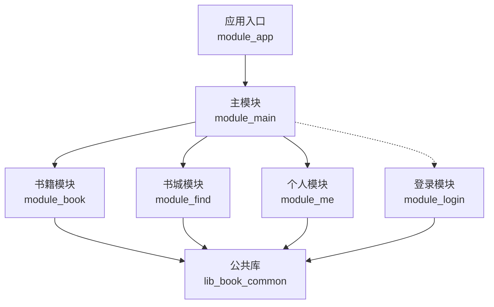
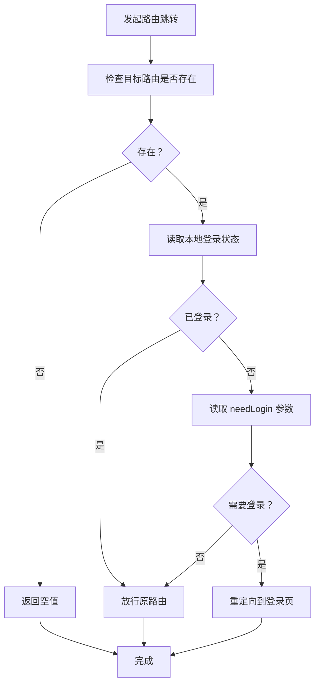
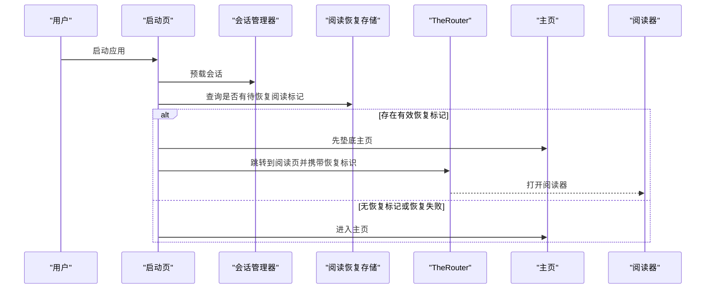
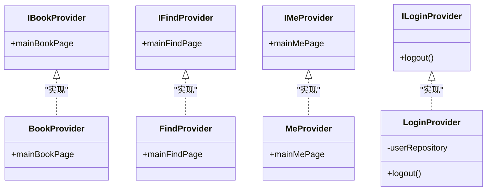
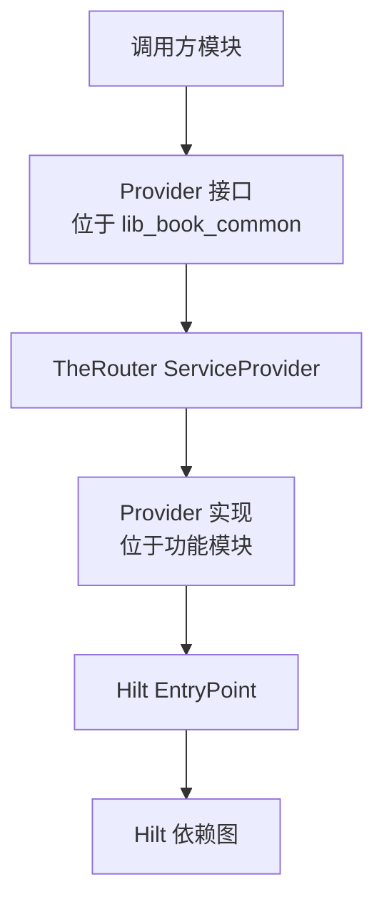
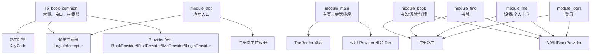

# 模块通信机制

<cite>
**本文引用的文件**   
- [lib_book_common/src/main/java/com/ebook/common/event/RouteArgs.kt](file://lib_book_common/src/main/java/com/ebook/common/event/RouteArgs.kt)
- [lib_book_common/src/main/java/com/ebook/common/event/KeyCode.kt](file://lib_book_common/src/main/java/com/ebook/common/event/KeyCode.kt)
- [lib_book_common/src/main/java/com/ebook/common/provider/IBookProvider.kt](file://lib_book_common/src/main/java/com/ebook/common/provider/IBookProvider.kt)
- [module_book/src/main/java/com/ebook/book/provider/BookProvider.kt](file://module_book/src/main/java/com/ebook/book/provider/BookProvider.kt)
- [lib_book_common/src/main/java/com/ebook/common/provider/ILoginProvider.kt](file://lib_book_common/src/main/java/com/ebook/common/provider/ILoginProvider.kt)
- [module_login/src/main/java/com/ebook/login/provider/LoginProvider.kt](file://module_login/src/main/java/com/ebook/login/provider/LoginProvider.kt)
- [lib_book_common/src/main/java/com/ebook/common/provider/IFindProvider.kt](file://lib_book_common/src/main/java/com/ebook/common/provider/IFindProvider.kt)
- [module_find/src/main/java/com/ebook/find/provider/FindProvider.kt](file://module_find/src/main/java/com/ebook/find/provider/FindProvider.kt)
- [lib_book_common/src/main/java/com/ebook/common/provider/IMeProvider.kt](file://lib_book_common/src/main/java/com/ebook/common/provider/IMeProvider.kt)
- [module_me/src/main/java/com/ebook/me/provider/MeProvider.kt](file://module_me/src/main/java/com/ebook/me/provider/MeProvider.kt)
- [lib_book_common/src/main/java/com/ebook/common/interceptor/LoginInterceptor.kt](file://lib_book_common/src/main/java/com/ebook/common/interceptor/LoginInterceptor.kt)
- [module_app/src/main/java/com/ebook/MyApplication.kt](file://module_app/src/main/java/com/ebook/MyApplication.kt)
- [module_main/src/main/java/com/ebook/main/SplashActivity.kt](file://module_main/src/main/java/com/ebook/main/SplashActivity.kt)
- [module_main/src/main/java/com/ebook/main/MainActivity.kt](file://module_main/src/main/java/com/ebook/main/MainActivity.kt)
- [module_book/src/main/java/com/ebook/book/page/BookShelfPage.kt](file://module_book/src/main/java/com/ebook/book/page/BookShelfPage.kt)
</cite>

## 目录

1. [引言](#引言)
2. [项目结构与通信边界](#项目结构与通信边界)
3. [TheRouter 路由系统](#therouter-路由系统)
4. [Provider 接口模式](#provider-接口模式)
5. [核心通信示例](#核心通信示例)
6. [依赖关系与架构总览](#依赖关系与架构总览)
7. [性能考虑](#性能考虑)
8. [错误处理策略](#错误处理策略)
9. [最佳实践](#最佳实践)
10. [故障排查](#故障排查)
11. [结论](#结论)

## 引言

本项目的模块通信机制围绕两个核心能力构建：

- **TheRouter 路由系统**：用于跨模块页面跳转、参数传递、登录拦截和可插拔的路由替换。
- **Provider 接口模式**：用于跨模块暴露 Compose 页面和服务能力，让宿主模块（如 `module_main`）组合功能模块的 UI，同时避免功能模块之间直接互相依赖。

这两种机制共同解决了“模块之间如何安全地调用对方页面与服务”的问题。路由负责“跳到哪里”，Provider 负责“提供什么能力”。

## 项目结构与通信边界

项目采用多模块结构，典型边界如下：

| 模块 | 职责 | 对外通信方式 |
|---|---|---|
| `lib_book_common` | 公共领域模型、事件常量、Provider 接口、拦截器 | 被所有业务模块依赖；定义通信契约 |
| `module_main` | 应用启动、主界面 Tab 容器、会话过期统一处理 | 通过 Provider 组合三个 Tab，通过 TheRouter 跳转到登录页 |
| `module_book` | 书架、阅读、详情、下载管理 | 通过 TheRouter 注册页面，通过 Provider 暴露书架页面 |
| `module_find` | 书城搜索与分类 | 通过 TheRouter 注册页面，通过 Provider 暴露书城页面 |
| `module_login` | 登录、注册、改密、验证 | 通过 TheRouter 注册页面，通过 Provider 暴露服务端登出能力 |
| `module_me` | 设置、关于、缓存、书源管理、个人中心 | 通过 TheRouter 注册页面，通过 Provider 暴露我的页面 |

**图表来源**
- [module_app/src/main/java/com/ebook/MyApplication.kt:1-66](file://module_app/src/main/java/com/ebook/MyApplication.kt#L1-L66)
- [module_main/src/main/java/com/ebook/main/MainActivity.kt:1-200](file://module_main/src/main/java/com/ebook/main/MainActivity.kt#L1-L200)
- [lib_book_common/src/main/java/com/ebook/common/event/KeyCode.kt:1-111](file://lib_book_common/src/main/java/com/ebook/common/event/KeyCode.kt#L1-L111)

**章节来源**
- [lib_book_common/src/main/java/com/ebook/common/event/KeyCode.kt:1-111](file://lib_book_common/src/main/java/com/ebook/common/event/KeyCode.kt#L1-L111)
- [module_app/src/main/java/com/ebook/MyApplication.kt:1-66](file://module_app/src/main/java/com/ebook/MyApplication.kt#L1-L66)

## TheRouter 路由系统

### 路由配置与路径约定

项目中路由路径不靠手写字符串散落在各处，而是集中在 `lib_book_common` 的 `KeyCode` 中统一管理：

- 每个模块有独立的命名空间前缀，例如 `/ebook/main/`、`/ebook/user/`、`/ebook/book/`、`/ebook/find/`、`/ebook/me/`。
- 具体路由常量按模块分组声明，例如 `Login.LOGIN_PATH`、`Book.READ_PATH`、`Me.SETTING_PATH`。
- 目标 Activity 使用 `@Route(path = ...)` 注解声明路由。
- 调用方通过 `TheRouter.build(KeyCode.XXX.PATH).navigation()` 发起跳转。

这种设计把“路由地址”和“路由实现”解耦：修改路径时只需改常量，减少拼写错误；新增页面时必须显式注册，便于发现未落地的路由。

**章节来源**
- [lib_book_common/src/main/java/com/ebook/common/event/KeyCode.kt:1-111](file://lib_book_common/src/main/java/com/ebook/common/event/KeyCode.kt#L1-L111)
- [module_main/src/main/java/com/ebook/main/MainActivity.kt:1-200](file://module_main/src/main/java/com/ebook/main/MainActivity.kt#L1-L200)

### 路由表加载与 routeMap.json

TheRouter 在运行时从各模块 `assets/therouter/routeMap.json` 加载路由表。虽然这些 JSON 文件在当前仓库快照中被忽略，但从代码中的导入和使用可以看到：

- 路由拦截器使用 `matchRouteMap` 查找已注册路由。
- 启动页逻辑中明确提到路由表是异步加载的，因此不能依赖“此刻是否匹配到路由”做最终判断。
- 模块内同模块跳转通常直接使用 `Intent`，只有跨模块或启动恢复等场景才走 TheRouter。

这意味着 `routeMap.json` 的作用不是替代 Activity 类名，而是提供跨模块可见的路由映射。如果某个路由没有进入路由表，跨模块调用可能失败或被拦截器重定向。

**章节来源**
- [lib_book_common/src/main/java/com/ebook/common/interceptor/LoginInterceptor.kt:1-42](file://lib_book_common/src/main/java/com/ebook/common/interceptor/LoginInterceptor.kt#L1-L42)
- [module_main/src/main/java/com/ebook/main/SplashActivity.kt:1-200](file://module_main/src/main/java/com/ebook/main/SplashActivity.kt#L1-L200)

### 页面跳转与参数传递

#### 基础跳转

常见用法包括：

- 从设置页跳转到缓存管理、书源管理、关于页。
- 从主页会话过期分支跳转到登录页。
- 从书架长按详情页跳转到书籍详情。
- 从书架跳转到下载管理页。

#### 传参方式

项目主要使用 `withString`、`withInt` 等方式向 Bundle 附加参数。为避免跨模块 key 不一致导致静默丢参，关键参数统一放在 `RouteArgs` 中：

| 常量 | 用途 |
|---|---|
| `CHAPTER_URL` | 评论区定位章节（已废弃，保留兼容） |
| `CHAPTER_NAME` | 评论区展示章节名 |
| `BOOK_NAME` | 评论区展示书名 |
| `COMMENT_KEY` | 评论聚合键 |
| `PRIMARY_COMMENT_KEY` | 写入用评论聚合键 |
| `NOTE_URL` | 修键面板定位书架条目 |
| `RESUME_NOTE_URL` | 启动恢复阅读的书籍标识 |

特别需要注意的是：恢复阅读使用的是 `RESUME_NOTE_URL`，而不是 `NOTE_URL`。两者语义不同，注释明确指出共用一个 key 会导致接收方根据当前路由反推含义，从而出现静默串味。

**章节来源**
- [lib_book_common/src/main/java/com/ebook/common/event/RouteArgs.kt:1-50](file://lib_book_common/src/main/java/com/ebook/common/event/RouteArgs.kt#L1-L50)
- [module_book/src/main/java/com/ebook/book/page/BookShelfPage.kt:1-200](file://module_book/src/main/java/com/ebook/book/page/BookShelfPage.kt#L1-L200)
- [module_main/src/main/java/com/ebook/main/SplashActivity.kt:1-200](file://module_main/src/main/java/com/ebook/main/SplashActivity.kt#L1-L200)

### 路由拦截器

项目实现了登录拦截器 `LoginInterceptor`，继承自 `RouterReplaceInterceptor`，优先级为 6。其核心行为如下：

1. 如果目标路由为空，记录日志并返回空。
2. 读取本地登录状态。
3. 如果已登录，直接放行。
4. 如果目标路由没有标注需要登录，直接放行。
5. 如果未登录且目标路由需要登录，则拦截并重定向到登录页。

是否需要登录由路由参数中的 `needLogin` 控制。例如评论页、修改昵称页、修改信息页都带有 `params = ["needLogin", "true"]`。

**图表来源**
- [lib_book_common/src/main/java/com/ebook/common/interceptor/LoginInterceptor.kt:1-42](file://lib_book_common/src/main/java/com/ebook/common/interceptor/LoginInterceptor.kt#L1-L42)

拦截器在 `MyApplication.onCreate()` 中通过 `addRouterReplaceInterceptor(LoginInterceptor())` 注册。这样所有通过 TheRouter 发起的跳转都会经过该拦截器，而不需要在每个目标页重复判断登录态。

**章节来源**
- [lib_book_common/src/main/java/com/ebook/common/interceptor/LoginInterceptor.kt:1-42](file://lib_book_common/src/main/java/com/ebook/common/interceptor/LoginInterceptor.kt#L1-L42)
- [module_app/src/main/java/com/ebook/MyApplication.kt:1-66](file://module_app/src/main/java/com/ebook/MyApplication.kt#L1-L66)

### 路由生命周期与启动恢复

启动页 `SplashActivity` 承担启动期内容加载和恢复阅读的职责。其关键逻辑包括：

- 自动登录与会话预载并行进行。
- 最小展示时长与会话加载完成后决定落点。
- 优先尝试恢复阅读；若失败则进入主页。
- 恢复阅读时使用 `RESUME_NOTE_URL` 携带书籍标识。
- 因为路由表异步加载，启动页不依赖 `matchRouteMap` 探测阅读器路由是否存在，而是先垫底主页，再尝试打开阅读器。

**图表来源**
- [module_main/src/main/java/com/ebook/main/SplashActivity.kt:1-200](file://module_main/src/main/java/com/ebook/main/SplashActivity.kt#L1-L200)

**章节来源**
- [module_main/src/main/java/com/ebook/main/SplashActivity.kt:1-200](file://module_main/src/main/java/com/ebook/main/SplashActivity.kt#L1-L200)

## Provider 接口模式

### 设计目标

Provider 接口模式用于解决以下问题：

- 宿主模块需要组合功能模块的 Compose 页面。
- 功能模块不应反向依赖宿主模块。
- 跨模块服务需要通过稳定接口暴露，而不是直接依赖具体实现。
- 独立运行模式下某些模块不可用时，调用方应能优雅降级。

项目中的 Provider 分为两类：

| 类型 | 说明 | 示例 |
|---|---|---|
| 页面级 Provider | 返回 Compose 页面，供宿主 NavHost 直接组合 | `IBookProvider`、`IFindProvider`、`IMeProvider` |
| 服务能力 Provider | 暴露跨模块的业务能力 | `ILoginProvider` |

### 核心接口定义

#### IBookProvider

`IBookProvider` 是书架模块对外暴露的页面级服务。它提供一个 Composable 函数，宿主用它组合书架页面。该接口还允许宿主注入一个可选回调 `onGoBookstore`，用于从书架空态跳转到书城 Tab。

这种设计避免了书架模块知道宿主的 Tab 路由；宿主把自己知道的能力递进来，书架模块只负责渲染和调用。

#### IFindProvider

`IFindProvider` 暴露书城主页面。宿主通过它获取书城 Compose 页面，并由宿主 NavHost 组合。

#### IMeProvider

`IMeProvider` 暴露个人中心主页面。它与 `IFindProvider` 的设计一致。

#### ILoginProvider

`ILoginProvider` 暴露登录域的服务能力，目前主要是服务端侧的登出操作。它不直接依赖 Hilt 创建的实例，而是通过 TheRouter 提供的 `ServiceProvider` 获取实现。

**章节来源**
- [lib_book_common/src/main/java/com/ebook/common/provider/IBookProvider.kt:1-23](file://lib_book_common/src/main/java/com/ebook/common/provider/IBookProvider.kt#L1-L23)
- [lib_book_common/src/main/java/com/ebook/common/provider/IFindProvider.kt:1-13](file://lib_book_common/src/main/java/com/ebook/common/provider/IFindProvider.kt#L1-L13)
- [lib_book_common/src/main/java/com/ebook/common/provider/IMeProvider.kt:1-13](file://lib_book_common/src/main/java/com/ebook/common/provider/IMeProvider.kt#L1-L13)
- [lib_book_common/src/main/java/com/ebook/common/provider/ILoginProvider.kt:1-19](file://lib_book_common/src/main/java/com/ebook/common/provider/ILoginProvider.kt#L1-L19)

### Provider 实现与 SPI 注册

各模块的实现类使用 `@ServiceProvider` 注解，表示由 TheRouter 创建和管理：

| 接口 | 实现类 | 模块 |
|---|---|---|
| `IBookProvider` | `BookProvider` | `module_book` |
| `IFindProvider` | `FindProvider` | `module_find` |
| `IMeProvider` | `MeProvider` | `module_me` |
| `ILoginProvider` | `LoginProvider` | `module_login` |

`LoginProvider` 还使用了 `@Singleton`，并通过 Hilt 的 `EntryPointAccessors` 从 Hilt 图中桥接获取 `UserRepository`。这说明 TheRouter 和 Hilt 可以共存：TheRouter 负责跨模块 SPI 发现和实例化，Hilt 负责模块内部依赖注入。

**图表来源**
- [lib_book_common/src/main/java/com/ebook/common/provider/IBookProvider.kt:1-23](file://lib_book_common/src/main/java/com/ebook/common/provider/IBookProvider.kt#L1-L23)
- [module_book/src/main/java/com/ebook/book/provider/BookProvider.kt:1-16](file://module_book/src/main/java/com/ebook/book/provider/BookProvider.kt#L1-L16)
- [lib_book_common/src/main/java/com/ebook/common/provider/IFindProvider.kt:1-13](file://lib_book_common/src/main/java/com/ebook/common/provider/IFindProvider.kt#L1-L13)
- [module_find/src/main/java/com/ebook/find/provider/FindProvider.kt:1-19](file://module_find/src/main/java/com/ebook/find/provider/FindProvider.kt#L1-L19)
- [lib_book_common/src/main/java/com/ebook/common/provider/IMeProvider.kt:1-13](file://lib_book_common/src/main/java/com/ebook/common/provider/IMeProvider.kt#L1-L13)
- [module_me/src/main/java/com/ebook/me/provider/MeProvider.kt:1-20](file://module_me/src/main/java/com/ebook/me/provider/MeProvider.kt#L1-L20)
- [lib_book_common/src/main/java/com/ebook/common/provider/ILoginProvider.kt:1-19](file://lib_book_common/src/main/java/com/ebook/common/provider/ILoginProvider.kt#L1-L19)
- [module_login/src/main/java/com/ebook/login/provider/LoginProvider.kt:1-36](file://module_login/src/main/java/com/ebook/login/provider/LoginProvider.kt#L1-L36)

**章节来源**
- [module_book/src/main/java/com/ebook/book/provider/BookProvider.kt:1-16](file://module_book/src/main/java/com/ebook/book/provider/BookProvider.kt#L1-L16)
- [module_find/src/main/java/com/ebook/find/provider/FindProvider.kt:1-19](file://module_find/src/main/java/com/ebook/find/provider/FindProvider.kt#L1-L19)
- [module_me/src/main/java/com/ebook/me/provider/MeProvider.kt:1-20](file://module_me/src/main/java/com/ebook/me/provider/MeProvider.kt#L1-L20)
- [module_login/src/main/java/com/ebook/login/provider/LoginProvider.kt:1-36](file://module_login/src/main/java/com/ebook/login/provider/LoginProvider.kt#L1-L36)

### 依赖注入方式

项目中存在两种依赖注入体系：

1. **Hilt**：用于模块内部的依赖注入，例如 ViewModel、Repository、UserSessionManager、SessionEventBus 等。
2. **TheRouter 的 ServiceProvider**：用于跨模块获取 Provider 实现。

`LoginProvider` 是一个典型例子：它本身由 TheRouter 创建，但内部需要访问 Hilt 管理的 `UserRepository`，因此通过 `EntryPointAccessors.fromApplication(context, UserRepositoryEntryPoint::class.java)` 从 Hilt 图中取出来。

**图表来源**
- [module_login/src/main/java/com/ebook/login/provider/LoginProvider.kt:1-36](file://module_login/src/main/java/com/ebook/login/provider/LoginProvider.kt#L1-L36)
- [module_app/src/main/java/com/ebook/MyApplication.kt:1-66](file://module_app/src/main/java/com/ebook/MyApplication.kt#L1-L66)

**章节来源**
- [module_login/src/main/java/com/ebook/login/provider/LoginProvider.kt:1-36](file://module_login/src/main/java/com/ebook/login/provider/LoginProvider.kt#L1-L36)
- [module_app/src/main/java/com/ebook/MyApplication.kt:1-66](file://module_app/src/main/java/com/ebook/MyApplication.kt#L1-L66)

## 核心通信示例

### 示例一：从设置页跳转到模块内二级页

设置页通过 `TheRouter.build(KeyCode.Me.CACHE_PATH).navigation()` 打开缓存管理页，通过 `KeyCode.Me.BOOK_SOURCE_PATH` 打开书源管理页，通过 `KeyCode.Me.ABOUT_PATH` 打开关于页。

这些路由在本模块内注册，集成模式和独立模式都可以解析，因此不需要额外探测路由是否存在。

**章节来源**
- [module_me/src/main/java/com/ebook/me/view/SettingActivity.kt:1-200](file://module_me/src/main/java/com/ebook/me/view/SettingActivity.kt#L1-L200)
- [lib_book_common/src/main/java/com/ebook/common/event/KeyCode.kt:87-111](file://lib_book_common/src/main/java/com/ebook/common/event/KeyCode.kt#L87-L111)

### 示例二：从书架长按跳转到书籍详情

书架页长按书籍时，使用 `BitIntentDataManager.putData(bookShelf.copy())` 生成临时数据 key，再通过 `TheRouter.build(KeyCode.Book.DETAIL_PATH).withInt("from", FROM_BOOKSHELF).withString("data_key", key).navigation()` 跳转。

这种方式适合跨模块传递较大对象，避免直接通过 Intent 的 Bundle 传输大对象导致事务上限问题。

**章节来源**
- [module_book/src/main/java/com/ebook/book/page/BookShelfPage.kt:1-200](file://module_book/src/main/java/com/ebook/book/page/BookShelfPage.kt#L1-L200)

### 示例三：从启动页恢复阅读

启动页检测到恢复标记后，会先打开主页作为栈底，再尝试通过 TheRouter 打开阅读页，参数使用 `RESUME_NOTE_URL`。如果阅读器路由尚未加载或不存在，启动页不会白屏，而是停留在主页。

**章节来源**
- [module_main/src/main/java/com/ebook/main/SplashActivity.kt:1-200](file://module_main/src/main/java/com/ebook/main/SplashActivity.kt#L1-L200)
- [lib_book_common/src/main/java/com/ebook/common/event/RouteArgs.kt:1-50](file://lib_book_common/src/main/java/com/ebook/common/event/RouteArgs.kt#L1-L50)

### 示例四：会话过期后跳转登录

主页订阅会话过期事件后，清理本地会话、提示用户，并通过 `TheRouter.build(KeyCode.Login.LOGIN_PATH).navigation()` 跳转到登录页。这是应用级的统一会话失效处理入口。

**章节来源**
- [module_main/src/main/java/com/ebook/main/MainActivity.kt:1-200](file://module_main/src/main/java/com/ebook/main/MainActivity.kt#L1-L200)

## 依赖关系与架构总览

**图表来源**
- [lib_book_common/src/main/java/com/ebook/common/event/KeyCode.kt:1-111](file://lib_book_common/src/main/java/com/ebook/common/event/KeyCode.kt#L1-L111)
- [lib_book_common/src/main/java/com/ebook/common/interceptor/LoginInterceptor.kt:1-42](file://lib_book_common/src/main/java/com/ebook/common/interceptor/LoginInterceptor.kt#L1-L42)
- [lib_book_common/src/main/java/com/ebook/common/provider/IBookProvider.kt:1-23](file://lib_book_common/src/main/java/com/ebook/common/provider/IBookProvider.kt#L1-L23)
- [lib_book_common/src/main/java/com/ebook/common/provider/IFindProvider.kt:1-13](file://lib_book_common/src/main/java/com/ebook/common/provider/IFindProvider.kt#L1-L13)
- [lib_book_common/src/main/java/com/ebook/common/provider/IMeProvider.kt:1-13](file://lib_book_common/src/main/java/com/ebook/common/provider/IMeProvider.kt#L1-L13)
- [lib_book_common/src/main/java/com/ebook/common/provider/ILoginProvider.kt:1-19](file://lib_book_common/src/main/java/com/ebook/common/provider/ILoginProvider.kt#L1-L19)
- [module_app/src/main/java/com/ebook/MyApplication.kt:1-66](file://module_app/src/main/java/com/ebook/MyApplication.kt#L1-L66)
- [module_main/src/main/java/com/ebook/main/MainActivity.kt:1-200](file://module_main/src/main/java/com/ebook/main/MainActivity.kt#L1-L200)

**章节来源**
- [module_app/src/main/java/com/ebook/MyApplication.kt:1-66](file://module_app/src/main/java/com/ebook/MyApplication.kt#L1-L66)
- [module_main/src/main/java/com/ebook/main/MainActivity.kt:1-200](file://module_main/src/main/java/com/ebook/main/MainActivity.kt#L1-L200)

## 性能考虑

### 路由表异步加载

路由表加载是异步的。启动页逻辑中明确指出：不能依赖 `matchRouteMap` 探测阅读器路由是否存在，因为“此刻查不到”可能是路由表还没加载完。因此，启动恢复阅读采用“先垫主页，再尝试打开阅读器”的策略，避免误判导致功能静默失效。

这对开发者的建议是：**不要在路由表未完全就绪的关键路径上依赖 matchRouteMap 做最终决策**。

### 大对象传参

对于大型数据对象，项目倾向于使用进程内暂存区（如 `BitIntentDataManager`）加 key 的方式，而不是直接通过 Bundle 传输 Parcelable。原因是 Binder 事务有大小限制，长篇书籍的章节列表很容易触发 `TransactionTooLargeException`。

恢复阅读也遵循这一原则：只传 `noteUrl`，不在启动流程中传输整本书实体。

### Compose 页面组合成本

Provider 返回的是 Composable 页面，每次组合会创建新的页面实例，ViewModel 作用域由 `hiltViewModel` 决定。宿主 NavHost 负责组合时机，功能模块只提供页面能力。这样可以避免 Fragment 级别的复杂生命周期耦合，但也意味着不要在设计层面假设 Provider 实例会被复用。

### 登录拦截开销

登录拦截器在每次路由跳转时执行，但主要开销是读取 SharedPreferences 和判断布尔参数，整体成本很低。需要注意的只是不要把大量网络请求放入拦截器。

**章节来源**
- [module_main/src/main/java/com/ebook/main/SplashActivity.kt:1-200](file://module_main/src/main/java/com/ebook/main/SplashActivity.kt#L1-L200)
- [lib_book_common/src/main/java/com/ebook/common/event/RouteArgs.kt:1-50](file://lib_book_common/src/main/java/com/ebook/common/event/RouteArgs.kt#L1-L50)
- [lib_book_common/src/main/java/com/ebook/common/provider/IBookProvider.kt:1-23](file://lib_book_common/src/main/java/com/ebook/common/provider/IBookProvider.kt#L1-L23)
- [lib_book_common/src/main/java/com/ebook/common/interceptor/LoginInterceptor.kt:1-42](file://lib_book_common/src/main/java/com/ebook/common/interceptor/LoginInterceptor.kt#L1-L42)

## 错误处理策略

### 路由未找到

登录拦截器在目标路由为空时会记录日志并返回空值。这表示 TheRouter 无法解析到目标路由，调用方应做好降级处理，例如提示用户或回到上一页。

### 路由表未就绪

启动恢复阅读的场景明确区分了“路由没落地”和“路由还没加载完”。由于路由表异步加载，启动页不会等待路由表就绪后再决定是否恢复阅读，而是优先保证用户体验：即使阅读器路由暂时不可用，用户也能看到主页。

### 会话过期

主页订阅 `SessionEvent.SessionExpired`，统一执行：

1. 清理本地会话。
2. 提示用户。
3. 跳转到登录页。

这是会话过期的统一收口，避免多个页面各自处理。

### 登录失败与网络异常

`ILoginProvider.logout()` 返回 `Result<Unit>`，调用方可根据成功与否决定是否提示用户。注释明确指出：本地会话清理由 `UserSessionManager.clearSession` 单点负责，Provider 只负责服务端侧登出。

### 跨模块 Provider 缺失

当模块独立运行时，某些 Provider 可能不在依赖图中。例如 `ILoginProvider` 的注释说明：独立运行时无需作废服务端凭证，调用方应允许空实现。类似地，`IBookProvider.mainBookPage` 的宿主回调 `onGoBookstore` 允许为 null，调用方据此不渲染“去书城”动作。

**章节来源**
- [lib_book_common/src/main/java/com/ebook/common/interceptor/LoginInterceptor.kt:1-42](file://lib_book_common/src/main/java/com/ebook/common/interceptor/LoginInterceptor.kt#L1-L42)
- [module_main/src/main/java/com/ebook/main/SplashActivity.kt:1-200](file://module_main/src/main/java/com/ebook/main/SplashActivity.kt#L1-L200)
- [module_main/src/main/java/com/ebook/main/MainActivity.kt:1-200](file://module_main/src/main/java/com/ebook/main/MainActivity.kt#L1-L200)
- [lib_book_common/src/main/java/com/ebook/common/provider/ILoginProvider.kt:1-19](file://lib_book_common/src/main/java/com/ebook/common/provider/ILoginProvider.kt#L1-L19)
- [lib_book_common/src/main/java/com/ebook/common/provider/IBookProvider.kt:1-23](file://lib_book_common/src/main/java/com/ebook/common/provider/IBookProvider.kt#L1-L23)

## 最佳实践

### 路由相关

1. **统一使用 KeyCode 管理路由常量**，不要散落手写字符串。
2. **跨模块跳转使用 TheRouter**，同模块短距离跳转可直接使用 Intent。
3. **敏感页面使用 needLogin 参数**，让拦截器统一处理登录校验。
4. **大对象不走 Bundle**，改用进程内暂存区加 key。
5. **跨模块共享 Bundle key**，放在 `RouteArgs` 中，避免键名漂移。
6. **不要把路由表是否就绪作为最终业务判据**，尤其启动阶段。

### Provider 相关

1. **接口放在公共库**，实现放在对应功能模块。
2. **页面级 Provider 返回 Composable**，由宿主 NavHost 组合。
3. **宿主把自身能力以回调形式注入 Provider**，避免功能模块反向依赖宿主。
4. **独立运行模式要允许 Provider 或回调为空**，做优雅降级。
5. **跨模块服务使用 TheRouter ServiceProvider**，模块内部依赖仍交给 Hilt。
6. **Provider 实现尽量幂等**，避免副作用与宿主组合次数强绑定。

### 拦截器相关

1. **拦截器只做轻量判断**，不做耗时网络请求。
2. **拦截失败要有日志**，便于排查路由未注册或参数错误。
3. **拦截器优先级要明确**，避免多个拦截器顺序不确定。
4. **登录状态变更时要确保拦截器能感知最新状态**，否则会出现“已登录仍跳登录页”或“未登录仍可访问”的竞态。

**章节来源**
- [lib_book_common/src/main/java/com/ebook/common/event/KeyCode.kt:1-111](file://lib_book_common/src/main/java/com/ebook/common/event/KeyCode.kt#L1-L111)
- [lib_book_common/src/main/java/com/ebook/common/event/RouteArgs.kt:1-50](file://lib_book_common/src/main/java/com/ebook/common/event/RouteArgs.kt#L1-L50)
- [lib_book_common/src/main/java/com/ebook/common/interceptor/LoginInterceptor.kt:1-42](file://lib_book_common/src/main/java/com/ebook/common/interceptor/LoginInterceptor.kt#L1-L42)
- [lib_book_common/src/main/java/com/ebook/common/provider/IBookProvider.kt:1-23](file://lib_book_common/src/main/java/com/ebook/common/provider/IBookProvider.kt#L1-L23)
- [lib_book_common/src/main/java/com/ebook/common/provider/ILoginProvider.kt:1-19](file://lib_book_common/src/main/java/com/ebook/common/provider/ILoginProvider.kt#L1-L19)

## 故障排查

| 现象 | 可能原因 | 排查方向 |
|---|---|---|
| 跨模块跳转无效 | 路由未在 `routeMap.json` 中注册 | 检查目标 Activity 是否使用 `@Route`，并确认路由表包含该路径 |
| 路由参数丢失 | 使用了字面量 Bundle key | 改为引用 `RouteArgs` 中的常量 |
| 未登录仍能访问受限页面 | 路由未标注 `needLogin=true` | 检查 `@Route(params = ["needLogin", "true"])` |
| 登录后仍被拦截到登录页 | 本地登录状态未更新或拦截器读取陈旧状态 | 检查登录成功后是否写入 `SP_IS_LOGIN` |
| 启动恢复阅读失败 | 阅读标记存在但书籍已被删除 | 检查恢复流程中的书籍存在性校验 |
| 长书页启动崩溃 | 通过 Bundle 传输过大对象 | 改用 `BitIntentDataManager` 或只传 `noteUrl` |
| 独立运行缺少某 Tab | 宿主没有对应的 Provider 或回调为 null | 检查宿主组合 Provider 的逻辑和降级处理 |
| 登录模块服务不可用 | 独立运行时 `module_login` 未参与依赖图 | 调用方允许 `ILoginProvider` 为空或仅跳过服务端登出 |

**章节来源**
- [lib_book_common/src/main/java/com/ebook/common/event/RouteArgs.kt:1-50](file://lib_book_common/src/main/java/com/ebook/common/event/RouteArgs.kt#L1-L50)
- [lib_book_common/src/main/java/com/ebook/common/interceptor/LoginInterceptor.kt:1-42](file://lib_book_common/src/main/java/com/ebook/common/interceptor/LoginInterceptor.kt#L1-L42)
- [module_main/src/main/java/com/ebook/main/SplashActivity.kt:1-200](file://module_main/src/main/java/com/ebook/main/SplashActivity.kt#L1-L200)
- [lib_book_common/src/main/java/com/ebook/common/provider/ILoginProvider.kt:1-19](file://lib_book_common/src/main/java/com/ebook/common/provider/ILoginProvider.kt#L1-L19)

## 结论

该项目的模块通信机制以 TheRouter 和 Provider 接口模式为核心：

- TheRouter 负责跨模块路由跳转、参数传递和登录拦截，配合 `KeyCode` 和 `RouteArgs` 提供稳定的通信契约。
- Provider 接口模式负责跨模块暴露 Compose 页面和服务能力，使宿主能够组合功能模块 UI，同时保持模块间低耦合。
- 启动恢复、会话过期、登录拦截和大对象传参等关键场景都有明确的错误处理和降级策略。
- 性能方面强调路由表异步加载、避免大对象直传、以及 Provider 组合的可预测性。

在实际开发中，新增跨模块通信时应优先回答三个问题：

1. 这个通信是页面跳转吗？如果是，优先考虑 TheRouter。
2. 这个通信是服务调用吗？如果是，优先考虑 Provider 接口。
3. 调用方是否可能在独立运行模式下遇到缺失实现？如果是，必须做空值和降级保护。