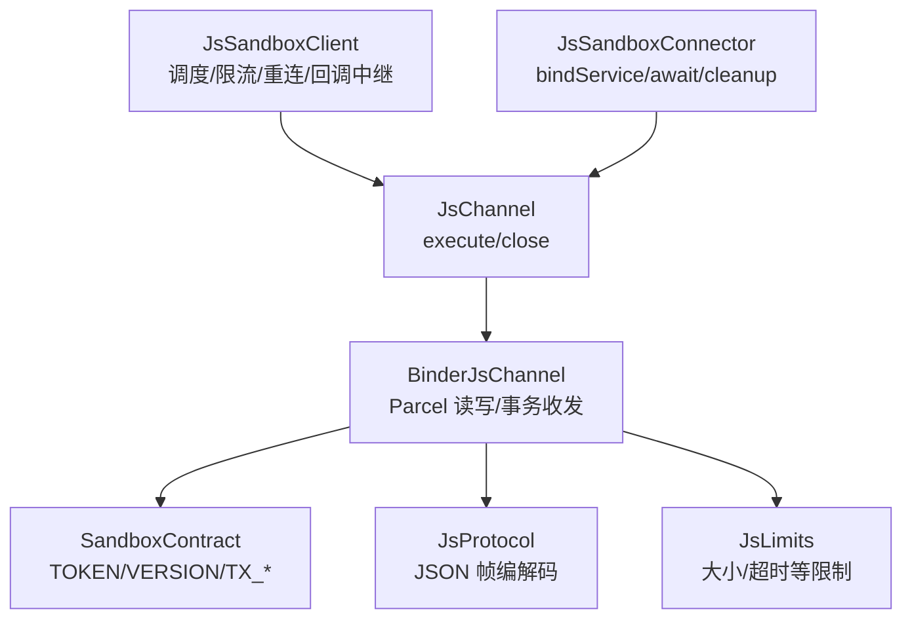
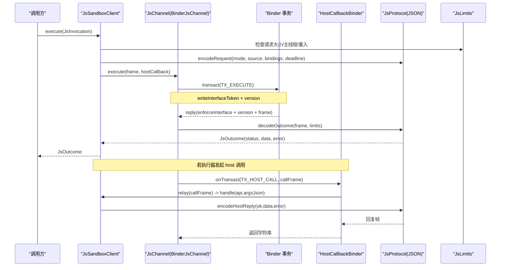
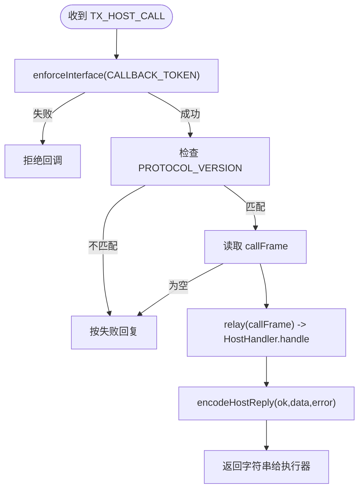
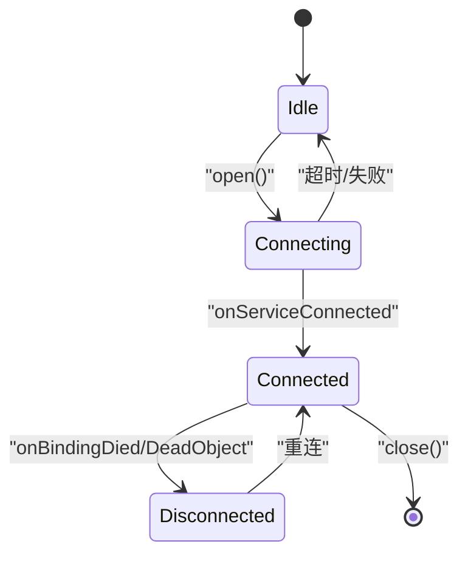
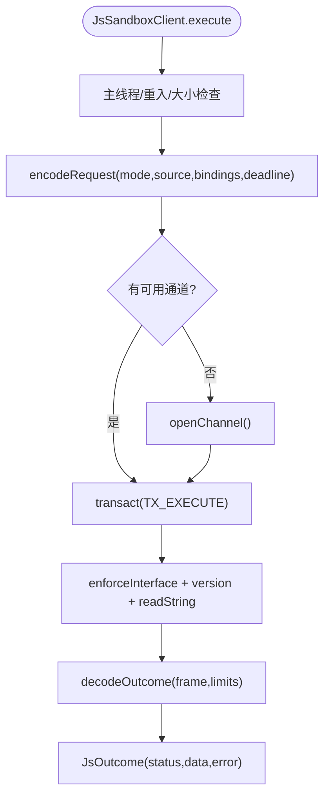
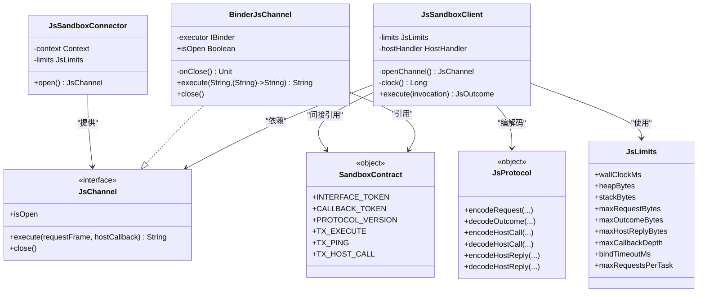
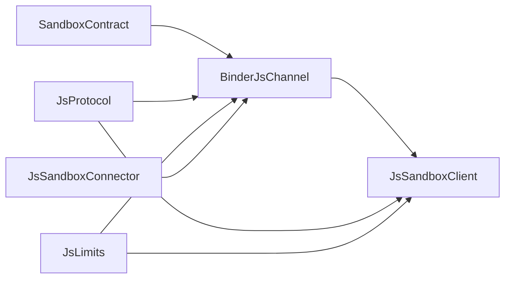

# Binder 双向协议设计

<cite>
**本文引用的文件**
- [SandboxContract.kt](file://lib_book_source/src/main/java/com/ebook/source/sandbox/SandboxContract.kt)
- [BinderJsChannel.kt](file://lib_book_source/src/main/java/com/ebook/source/sandbox/BinderJsChannel.kt)
- [JsChannel.kt](file://lib_book_source/src/main/java/com/ebook/source/sandbox/JsChannel.kt)
- [JsSandboxClient.kt](file://lib_book_source/src/main/java/com/ebook/source/sandbox/JsSandboxClient.kt)
- [JsProtocol.kt](file://lib_book_source/src/main/java/com/ebook/source/sandbox/JsProtocol.kt)
- [JsLimits.kt](file://lib_book_source/src/main/java/com/ebook/source/sandbox/JsLimits.kt)
- [JsSandboxConnector.kt](file://lib_book_source/src/main/java/com/ebook/source/sandbox/JsSandboxConnector.kt)
- [SandboxConnectionTest.kt](file://lib_book_source/src/androidTest/java/com/ebook/source/sandbox/SandboxConnectionTest.kt)
</cite>

## 目录
1. [简介](#简介)
2. [项目结构](#项目结构)
3. [核心组件](#核心组件)
4. [架构总览](#架构总览)
5. [详细组件分析](#详细组件分析)
6. [依赖关系分析](#依赖关系分析)
7. [性能与安全考量](#性能与安全考量)
8. [故障排查指南](#故障排查指南)
9. [结论](#结论)

## 简介
本文件面向“主进程 ↔ :js 沙箱执行器”的 Binder 双向协议，围绕 execute(模式, 脚本, 绑定) → (status, result, error) 契约展开，覆盖：
- 请求帧与响应帧的 JSON 格式、字段定义、序列化策略
- 回调通道的双向通信机制（HostCallbackBinder 实现、回调分发、异常处理）
- 协议版本管理与接口标识校验（向后兼容策略）
- 事务码 TX_EXECUTE / TX_PING / TX_HOST_CALL 的处理流程
- 连接生命周期管理（建立、心跳、断线重连、优雅关闭）
- 安全性（输入验证、大小限制、超时控制）
- 调试工具与排障方法

## 项目结构
协议相关代码集中在 lib_book_source 的沙箱子模块中，采用“契约 + 通道 + 客户端 + 协议编解码 + 连接器”的分层组织：
- 契约层：SandboxContract 定义接口标识、协议版本、事务码
- 通道层：JsChannel 抽象、BinderJsChannel 具体实现
- 客户端层：JsSandboxClient 负责调度、限流、重连、中继回调
- 协议层：JsProtocol 定义 JSON 帧结构与编解码
- 连接器：JsSandboxConnector 负责 Service 绑定、等待 binder、提供 close 语义
- 限制：JsLimits 集中配置各项资源上限与超时

图表来源
- [BinderJsChannel.kt:10-85](file://lib_book_source/src/main/java/com/ebook/source/sandbox/BinderJsChannel.kt#L10-L85)
- [JsChannel.kt:1-24](file://lib_book_source/src/main/java/com/ebook/source/sandbox/JsChannel.kt#L1-L24)
- [SandboxContract.kt:13-47](file://lib_book_source/src/main/java/com/ebook/source/sandbox/SandboxContract.kt#L13-L47)
- [JsProtocol.kt:83-256](file://lib_book_source/src/main/java/com/ebook/source/sandbox/JsProtocol.kt#L83-L256)
- [JsLimits.kt:13-58](file://lib_book_source/src/main/java/com/ebook/source/sandbox/JsLimits.kt#L13-L58)
- [JsSandboxConnector.kt:13-65](file://lib_book_source/src/main/java/com/ebook/source/sandbox/JsSandboxConnector.kt#L13-L65)

章节来源
- [SandboxContract.kt:13-47](file://lib_book_source/src/main/java/com/ebook/source/sandbox/SandboxContract.kt#L13-L47)
- [BinderJsChannel.kt:10-85](file://lib_book_source/src/main/java/com/ebook/source/sandbox/BinderJsChannel.kt#L10-L85)
- [JsChannel.kt:1-24](file://lib_book_source/src/main/java/com/ebook/source/sandbox/JsChannel.kt#L1-L24)
- [JsProtocol.kt:83-256](file://lib_book_source/src/main/java/com/ebook/source/sandbox/JsProtocol.kt#L83-L256)
- [JsLimits.kt:13-58](file://lib_book_source/src/main/java/com/ebook/source/sandbox/JsLimits.kt#L13-L58)
- [JsSandboxConnector.kt:13-65](file://lib_book_source/src/main/java/com/ebook/source/sandbox/JsSandboxConnector.kt#L13-L65)

## 核心组件
- SandboxContract：协议事实源，声明 INTERFACE_TOKEN、CALLBACK_TOKEN、PROTOCOL_VERSION、TX_EXECUTE、TX_PING、TX_HOST_CALL
- JsChannel：通道抽象，定义 execute(requestFrame, hostCallback) → responseFrame；close()；isOpen
- BinderJsChannel：基于 Binder 的具体实现，负责写/读 Parcel、enforceInterface、版本校验、回帧读取、回调分派
- JsSandboxClient：主进程侧统一入口，串行化调用、死线计算、重放策略、host 回调中继、异常归类
- JsProtocol：JSON 帧模型与编解码，严格 ignoreUnknownKeys=false，保证线上形态稳定
- JsLimits：集中配置 wallClockMs、堆/栈/报文/回调深度/绑定超时等
- JsSandboxConnector：封装 bindService、等待 binder、解绑清理

章节来源
- [SandboxContract.kt:13-47](file://lib_book_source/src/main/java/com/ebook/source/sandbox/SandboxContract.kt#L13-L47)
- [JsChannel.kt:1-24](file://lib_book_source/src/main/java/com/ebook/source/sandbox/JsChannel.kt#L1-L24)
- [BinderJsChannel.kt:10-85](file://lib_book_source/src/main/java/com/ebook/source/sandbox/BinderJsChannel.kt#L10-L85)
- [JsSandboxClient.kt:8-35](file://lib_book_source/src/main/java/com/ebook/source/sandbox/JsSandboxClient.kt#L8-L35)
- [JsProtocol.kt:83-256](file://lib_book_source/src/main/java/com/ebook/source/sandbox/JsProtocol.kt#L83-L256)
- [JsLimits.kt:13-58](file://lib_book_source/src/main/java/com/ebook/source/sandbox/JsLimits.kt#L13-L58)
- [JsSandboxConnector.kt:13-65](file://lib_book_source/src/main/java/com/ebook/source/sandbox/JsSandboxConnector.kt#L13-L65)

## 架构总览
下图展示了从上层调用到 Binder 事务再到 JSON 帧往返的整体流程，并标注了关键校验点与错误分类。

图表来源
- [JsSandboxClient.kt:65-99](file://lib_book_source/src/main/java/com/ebook/source/sandbox/JsSandboxClient.kt#L65-L99)
- [BinderJsChannel.kt:41-84](file://lib_book_source/src/main/java/com/ebook/source/sandbox/BinderJsChannel.kt#L41-L84)
- [JsProtocol.kt:127-169](file://lib_book_source/src/main/java/com/ebook/source/sandbox/JsProtocol.kt#L127-L169)
- [JsLimits.kt:13-58](file://lib_book_source/src/main/java/com/ebook/source/sandbox/JsLimits.kt#L13-L58)

## 详细组件分析

### 协议契约与事务码
- 接口标识：INTERFACE_TOKEN 用于 TX_EXECUTE 方向，CALLBACK_TOKEN 用于反向回调，避免传错 binder 时误解析
- 协议版本：PROTOCOL_VERSION 在两端写入/读取，不一致即协议不匹配
- 事务码：
  - TX_EXECUTE：主进程→执行器，请求帧包含 mode/source/bindings/deadline，回帧为 outcome
  - TX_PING：仅校验 token/version，不回帧体，用于探活
  - TX_HOST_CALL：执行器→主进程，callFrame 包含 api/argsJson，回帧为 ok/data/error

章节来源
- [SandboxContract.kt:13-47](file://lib_book_source/src/main/java/com/ebook/source/sandbox/SandboxContract.kt#L13-L47)

### 请求帧与响应帧 JSON 规范
- 请求帧（主进程→执行器）
  - 字段：mode（枚举名）、source（脚本字符串）、bindings（Map<String,String?>）、deadline（单调时间毫秒）
  - 序列化：kotlinx.serialization，ignoreUnknownKeys=false，encodeDefaults=true
- 响应帧（执行器→主进程）
  - 字段：status（枚举名）、data（可选 JSON 值）、error（失败时为消息）
  - 解码：先做 UTF-8 字节数限制，再解析；未知状态名不会折叠为 OK
- Host 调用帧
  - 请求：api（字符串）、args（未解析的 JSON 串）
  - 回复：ok（布尔）、data（可选 JSON 值）、error（失败消息）

章节来源
- [JsProtocol.kt:83-111](file://lib_book_source/src/main/java/com/ebook/source/sandbox/JsProtocol.kt#L83-L111)
- [JsProtocol.kt:127-169](file://lib_book_source/src/main/java/com/ebook/source/sandbox/JsProtocol.kt#L127-L169)
- [JsProtocol.kt:219-256](file://lib_book_source/src/main/java/com/ebook/source/sandbox/JsProtocol.kt#L219-L256)

### 回调通道与 HostCallbackBinder
- 每次 execute 新建一次 HostCallbackBinder，捕获本次执行的账本，避免跨次复用导致回调打乱
- 回调入口 onTransact 处理 PING/DUMP/INTERFACE 以及 TX_HOST_CALL
- 对回调进行接口标识校验、版本校验、空帧保护，并将异常包装为 ok=false 的回复，防止异常穿透到 .so 栈
- 主进程侧通过 JsSandboxClient.relay 将 callFrame 交给 HostHandler 处理，再编码回复

图表来源
- [BinderJsChannel.kt:93-132](file://lib_book_source/src/main/java/com/ebook/source/sandbox/BinderJsChannel.kt#L93-L132)
- [JsSandboxClient.kt:161-181](file://lib_book_source/src/main/java/com/ebook/source/sandbox/JsSandboxClient.kt#L161-L181)

章节来源
- [BinderJsChannel.kt:93-132](file://lib_book_source/src/main/java/com/ebook/source/sandbox/BinderJsChannel.kt#L93-L132)
- [JsSandboxClient.kt:161-181](file://lib_book_source/src/main/java/com/ebook/source/sandbox/JsSandboxClient.kt#L161-L181)

### 协议版本管理与向后兼容
- 强制接口标识校验：enforceInterface 确保双方是同一契约
- 版本比对：readInt(PROTOCOL_VERSION) 与本地一致才继续，否则抛出协议不匹配异常
- 严格解析：ignoreUnknownKeys=false，新增字段必须两侧同步，否则解析失败而非静默丢弃
- 向后兼容策略：只允许向前兼容扩展（如新增可空字段），禁止改变既有字段语义或顺序

章节来源
- [BinderJsChannel.kt:73-84](file://lib_book_source/src/main/java/com/ebook/source/sandbox/BinderJsChannel.kt#L73-L84)
- [JsProtocol.kt:123-126](file://lib_book_source/src/main/java/com/ebook/source/sandbox/JsProtocol.kt#L123-L126)

### 连接生命周期管理
- 建立连接：JsSandboxConnector.open 使用 bindService + ServiceConnection，等待 binder 到达（带超时）
- 心跳检测：通过 TX_PING 仅校验 token 与版本，不创建 runtime，区分“服务存在但协议不合”和“服务不存在”
- 断线重连：通道抛 ChannelDeadException（含 DeadObject/缓冲爆满）后，客户端 dropChannel 并尝试 afterDisconnect 重连重放
- 优雅关闭：channel.close 触发解绑，多次调用幂等；连接器在 close 回调中释放连接

图表来源
- [JsSandboxConnector.kt:37-65](file://lib_book_source/src/main/java/com/ebook/source/sandbox/JsSandboxConnector.kt#L37-L65)
- [JsSandboxConnector.kt:75-142](file://lib_book_source/src/main/java/com/ebook/source/sandbox/JsSandboxConnector.kt#L75-L142)
- [JsSandboxClient.kt:116-135](file://lib_book_source/src/main/java/com/ebook/source/sandbox/JsSandboxClient.kt#L116-L135)

章节来源
- [JsSandboxConnector.kt:37-65](file://lib_book_source/src/main/java/com/ebook/source/sandbox/JsSandboxConnector.kt#L37-L65)
- [JsSandboxConnector.kt:75-142](file://lib_book_source/src/main/java/com/ebook/source/sandbox/JsSandboxConnector.kt#L75-L142)
- [JsSandboxClient.kt:116-135](file://lib_book_source/src/main/java/com/ebook/source/sandbox/JsSandboxClient.kt#L116-L135)

### execute 调用链与异常分类
- 入口：JsSandboxClient.execute
  - 主线程守卫、重入守卫、请求大小限制
  - 构造 RequestFrame（含 deadline 单调时间）
  - 串行执行 runOnce，必要时 openChannel
- 通道：BinderJsChannel.execute
  - 写入 INTERFACE_TOKEN、version、requestFrame、HostCallbackBinder
  - transact(TX_EXECUTE)，读取回帧前 enforceInterface + version 校验
  - 对 RemoteException 统一归为 ChannelDeadException
- 结果：JsProtocol.decodeOutcome
  - 先做 UTF-8 字节数限制
  - 解析 OutcomeFrame，映射 status（OK/TIMEOUT/MEMORY/STACK/SYNTAX/RUNTIME/UNSUPPORTED_API/TOO_LARGE/UNAVAILABLE）

图表来源
- [JsSandboxClient.kt:65-99](file://lib_book_source/src/main/java/com/ebook/source/sandbox/JsSandboxClient.kt#L65-L99)
- [BinderJsChannel.kt:41-84](file://lib_book_source/src/main/java/com/ebook/source/sandbox/BinderJsChannel.kt#L41-L84)
- [JsProtocol.kt:159-169](file://lib_book_source/src/main/java/com/ebook/source/sandbox/JsProtocol.kt#L159-L169)

章节来源
- [JsSandboxClient.kt:65-99](file://lib_book_source/src/main/java/com/ebook/source/sandbox/JsSandboxClient.kt#L65-L99)
- [BinderJsChannel.kt:41-84](file://lib_book_source/src/main/java/com/ebook/source/sandbox/BinderJsChannel.kt#L41-L84)
- [JsProtocol.kt:159-169](file://lib_book_source/src/main/java/com/ebook/source/sandbox/JsProtocol.kt#L159-L169)

### 类图：关键类型与关系

图表来源
- [JsChannel.kt:1-24](file://lib_book_source/src/main/java/com/ebook/source/sandbox/JsChannel.kt#L1-L24)
- [BinderJsChannel.kt:20-85](file://lib_book_source/src/main/java/com/ebook/source/sandbox/BinderJsChannel.kt#L20-L85)
- [JsSandboxClient.kt:35-99](file://lib_book_source/src/main/java/com/ebook/source/sandbox/JsSandboxClient.kt#L35-L99)
- [JsProtocol.kt:123-256](file://lib_book_source/src/main/java/com/ebook/source/sandbox/JsProtocol.kt#L123-L256)
- [JsLimits.kt:13-58](file://lib_book_source/src/main/java/com/ebook/source/sandbox/JsLimits.kt#L13-L58)
- [JsSandboxConnector.kt:24-65](file://lib_book_source/src/main/java/com/ebook/source/sandbox/JsSandboxConnector.kt#L24-L65)
- [SandboxContract.kt:13-47](file://lib_book_source/src/main/java/com/ebook/source/sandbox/SandboxContract.kt#L13-L47)

## 依赖关系分析
- 契约驱动：所有 Binder 调用以 SandboxContract 为单一事实源，避免 AIDL 生成桩带来的审计盲区
- 通道抽象：JsChannel 屏蔽设备差异，使重连、重放、回调中继可在 JVM 测试
- 协议稳定：JsProtocol 的 JSON 模型作为跨进程边界唯一契约，ignoreUnknownKeys=false 强化兼容性
- 资源集中：JsLimits 统一管控超时与大小限制，便于调优与审计
- 连接管理：JsSandboxConnector 聚焦 Service 绑定与清理，避免连接泄漏

图表来源
- [SandboxContract.kt:13-47](file://lib_book_source/src/main/java/com/ebook/source/sandbox/SandboxContract.kt#L13-L47)
- [BinderJsChannel.kt:10-85](file://lib_book_source/src/main/java/com/ebook/source/sandbox/BinderJsChannel.kt#L10-L85)
- [JsProtocol.kt:123-256](file://lib_book_source/src/main/java/com/ebook/source/sandbox/JsProtocol.kt#L123-L256)
- [JsLimits.kt:13-58](file://lib_book_source/src/main/java/com/ebook/source/sandbox/JsLimits.kt#L13-L58)
- [JsSandboxConnector.kt:24-65](file://lib_book_source/src/main/java/com/ebook/source/sandbox/JsSandboxConnector.kt#L24-L65)

章节来源
- [SandboxContract.kt:13-47](file://lib_book_source/src/main/java/com/ebook/source/sandbox/SandboxContract.kt#L13-L47)
- [BinderJsChannel.kt:10-85](file://lib_book_source/src/main/java/com/ebook/source/sandbox/BinderJsChannel.kt#L10-L85)
- [JsProtocol.kt:123-256](file://lib_book_source/src/main/java/com/ebook/source/sandbox/JsProtocol.kt#L123-L256)
- [JsLimits.kt:13-58](file://lib_book_source/src/main/java/com/ebook/source/sandbox/JsLimits.kt#L13-L58)
- [JsSandboxConnector.kt:24-65](file://lib_book_source/src/main/java/com/ebook/source/sandbox/JsSandboxConnector.kt#L24-L65)

## 性能与安全考量
- 性能
  - 串行执行：inFlight 锁保证同一时刻只有一帧在飞，避免并发争用 runtime
  - 单调时钟：deadline 使用 SystemClock.elapsedRealtime，跨进程可比
  - 零分配长度检查：utf8Length 纯算术计算 UTF-8 字节数，避免中间数组
  - Binder 缓冲保护：请求/响应/host 回复均受 900 KB 限制，避免 TransactionTooLarge
- 安全
  - 接口标识与版本双重校验：enforceInterface + PROTOCOL_VERSION 比对
  - 严格 JSON 解析：ignoreUnknownKeys=false，未知字段直接报错
  - 主线程保护：禁止在主线程阻塞执行，避免 ANR
  - 回调异常隔离：HostCallbackBinder 将异常转为 ok=false 回复，不泄露到 .so 栈
  - 白名单与资源限制：通过 JsLimits 控制 wallClock、堆、栈、回调深度、网络次数等

章节来源
- [JsSandboxClient.kt:65-99](file://lib_book_source/src/main/java/com/ebook/source/sandbox/JsSandboxClient.kt#L65-L99)
- [JsProtocol.kt:159-169](file://lib_book_source/src/main/java/com/ebook/source/sandbox/JsProtocol.kt#L159-L169)
- [JsProtocol.kt:258-281](file://lib_book_source/src/main/java/com/ebook/source/sandbox/JsProtocol.kt#L258-L281)
- [JsLimits.kt:13-58](file://lib_book_source/src/main/java/com/ebook/source/sandbox/JsLimits.kt#L13-L58)
- [BinderJsChannel.kt:93-132](file://lib_book_source/src/main/java/com/ebook/source/sandbox/BinderJsChannel.kt#L93-L132)

## 故障排查指南
- 常见症状与定位
  - “不可用”：可能是服务不存在、绑定超时、协议版本不合、接口标识不符
  - “通道已关闭”：通道已被显式关闭或对端死亡
  - “协议版本不合”：两侧构建不同步，需对齐 PROTOCOL_VERSION
  - “帧形态不符”：JSON 结构变化或未知键，需检查序列化配置
  - “太大”：请求/响应/host 回复超出 JsLimits 限制
  - “超时”：deadline 到期，注意 wallClockMs 与排队等待
- 调试建议
  - 使用 TX_PING 快速探测服务存活与协议一致性
  - 打印/记录 RequestFrame 与 OutcomeFrame，对比两端序列化
  - 关注日志中的“通道判死”“重连重放”“主进程处理失败”等关键字
  - 在集成测试中验证隔离性、双向事务与无全局量残留

章节来源
- [JsSandboxConnector.kt:37-65](file://lib_book_source/src/main/java/com/ebook/source/sandbox/JsSandboxConnector.kt#L37-L65)
- [JsSandboxConnector.kt:75-142](file://lib_book_source/src/main/java/com/ebook/source/sandbox/JsSandboxConnector.kt#L75-L142)
- [JsSandboxClient.kt:116-135](file://lib_book_source/src/main/java/com/ebook/source/sandbox/JsSandboxClient.kt#L116-L135)
- [SandboxConnectionTest.kt:37-132](file://lib_book_source/src/androidTest/java/com/ebook/source/sandbox/SandboxConnectionTest.kt#L37-L132)

## 结论
该 Binder 双向协议通过严格的契约定义、稳定的 JSON 帧、集中的资源限制与完善的连接管理，实现了主进程与 :js 执行器之间的高可靠交互。其设计重点在于：
- 以契约为中心，避免生成桩带来的不可审计风险
- 以协议版本与接口标识保障跨进程一致性
- 以集中限制与严格解析保障性能与安全
- 以重连重放与异常隔离提升鲁棒性
- 以测试用例固化连通性与隔离性要求