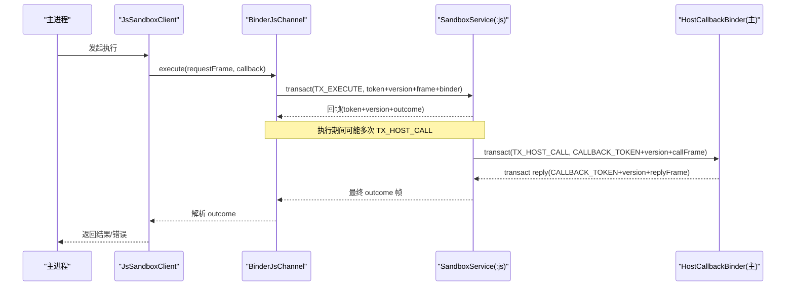
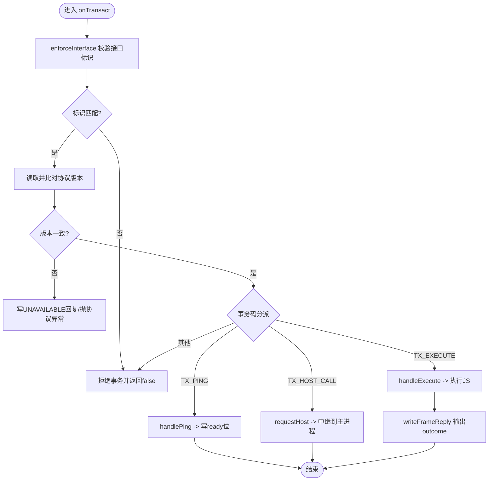
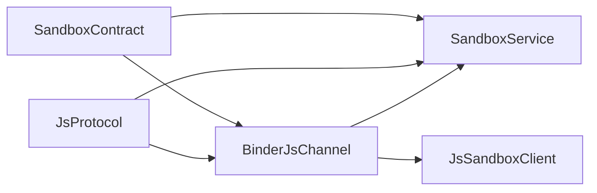

# 事务码设计

<cite>
**本文引用的文件**   
- [SandboxContract.kt](file://lib_book_source/src/main/java/com/ebook/source/sandbox/SandboxContract.kt)
- [SandboxService.kt](file://lib_book_source/src/main/java/com/ebook/source/sandbox/SandboxService.kt)
- [BinderJsChannel.kt](file://lib_book_source/src/main/java/com/ebook/source/sandbox/BinderJsChannel.kt)
- [JsProtocol.kt](file://lib_book_source/src/main/java/com/ebook/source/sandbox/JsProtocol.kt)
- [JsChannel.kt](file://lib_book_source/src/main/java/com/ebook/source/sandbox/JsChannel.kt)
- [JsSandboxClient.kt](file://lib_book_source/src/main/java/com/ebook/source/sandbox/JsSandboxClient.kt)
- [2026-09-09-js-sandbox-executor.md](file://docs/superpowers/plans/2026-09-09-js-sandbox-executor.md)
</cite>

## 目录
1. [简介](#简介)
2. [项目结构](#项目结构)
3. [核心组件](#核心组件)
4. [架构总览](#架构总览)
5. [详细组件分析](#详细组件分析)
6. [依赖关系分析](#依赖关系分析)
7. [性能考量](#性能考量)
8. [故障排查指南](#故障排查指南)
9. [结论](#结论)
10. [附录](#附录)

## 简介
本文件围绕 Binder 控制面在“主进程 ↔ :js 沙箱执行器”之间的契约展开，聚焦事务码（transaction code）的设计、隔离与治理。核心目标包括：
- 明确 TX_EXECUTE、TX_PING、TX_HOST_CALL 等关键事务的语义与使用场景
- 说明正向事务（主进程→执行器）与反向事务（执行器→主进程）的事务码空间隔离
- 阐述事务码扩展机制、版本兼容策略与向后兼容保证
- 解释接口标识校验、版本检查与非法事务码拒绝策略
- 梳理异常路径与错误处理原则
- 给出调试、监控、最佳实践与命名规范建议

## 项目结构
与事务码直接相关的代码集中在 lib_book_source 的沙箱子包中，采用手写 Binder.onTransact 的方式实现跨进程控制面，避免 AIDL 带来的生成代码黑盒与审计成本。关键文件职责如下：
- SandboxContract：定义唯一的线上事实源——接口标识、协议版本、事务码以及回调通道标识
- SandboxService：:js 进程内唯一服务，负责接收并分发事务，封装回帧格式
- BinderJsChannel：主进程侧的通道实现，封装一次事务一帧的收发与协议校验
- JsProtocol：控制面 JSON 帧编解码、状态映射、host call 报文封装与长度限制
- JsChannel / ChannelDeadException：通道抽象与“通道死亡”异常类型
- JsSandboxClient：客户端编排（重连、失败归类、重试），对上层屏蔽底层细节
- Plan 文档：记录为何选择手写 Binder、事务码设计取舍与实施边界

```mermaid
graph TB
    subgraph "主进程"
        C["JsSandboxClient"]
        CH["BinderJsChannel"]
        P["JsProtocol"]
    end

    subgraph ":js 执行器进程"
        S["SandboxService"]
        B["HostDispatcher(宿主回调路由)"]
    end

    C -->|TX_EXECUTE(主→执)| S
    S -->|TX_HOST_CALL(执→主)| CH
    CH -->|TX_HOST_CALL(主→执)| S
    C -->|协议帧| P
    S -->|协议帧| P
```

**图示来源**
- [SandboxContract.kt:13-46](file://lib_book_source/src/main/java/com/ebook/source/sandbox/SandboxContract.kt#L13-L46)
- [SandboxService.kt:50-81](file://lib_book_source/src/main/java/com/ebook/source/sandbox/SandboxService.kt#L50-L81)
- [BinderJsChannel.kt:41-84](file://lib_book_source/src/main/java/com/ebook/source/sandbox/BinderJsChannel.kt#L41-L84)
- [JsProtocol.kt:123-256](file://lib_book_source/src/main/java/com/ebook/source/sandbox/JsProtocol.kt#L123-L256)

**章节来源**
- [SandboxContract.kt:13-46](file://lib_book_source/src/main/java/com/ebook/source/sandbox/SandboxContract.kt#L13-L46)
- [SandboxService.kt:50-81](file://lib_book_source/src/main/java/com/ebook/source/sandbox/SandboxService.kt#L50-L81)
- [BinderJsChannel.kt:41-84](file://lib_book_source/src/main/java/com/ebook/source/sandbox/BinderJsChannel.kt#L41-L84)
- [JsProtocol.kt:123-256](file://lib_book_source/src/main/java/com/ebook/source/sandbox/JsProtocol.kt#L123-L256)

## 核心组件
- 合约常量与事务码
  - INTERFACE_TOKEN：主进程到执行器的接口标识，用于 enforceInterface 校验
  - PROTOCOL_VERSION：协议版本号，变更即 +1，两侧不一致立即判定不可用
  - TX_EXECUTE：一次 JS 求值请求（主→执）
  - TX_PING：探活（主→执），只校验 token 与版本，不建 runtime
  - CALLBACK_TOKEN：执行器到主进程的反向接口标识，避免复用主接口导致误绑
  - TX_HOST_CALL：反向事务码（执→主），在 CALLBACK_TOKEN 空间编号，与 TX_EXECUTE 分属不同空间
- 服务端（:js 进程）
  - SandboxService：统一入口 onTransact，先放行框架管家事务（PING/INTERFACE/DUMP），再按 token+version 校验后分派
- 客户端（主进程）
  - BinderJsChannel：发送 TX_EXECUTE，读取回帧；同时维护 HostCallbackBinder 接收 TX_HOST_CALL
  - JsProtocol：帧编解码、状态映射、host call 报文封装、长度上限检查
  - JsSandboxClient：对外暴露 execute 能力，统一失败分类（协议错误 vs 通道死亡）、重连策略
- 通道抽象
  - JsChannel：execute/close 抽象；ChannelDeadException：通道失效（对端死、缓冲满等）

**章节来源**
- [SandboxContract.kt:13-46](file://lib_book_source/src/main/java/com/ebook/source/sandbox/SandboxContract.kt#L13-L46)
- [SandboxService.kt:50-123](file://lib_book_source/src/main/java/com/ebook/source/sandbox/SandboxService.kt#L50-L123)
- [BinderJsChannel.kt:41-131](file://lib_book_source/src/main/java/com/ebook/source/sandbox/BinderJsChannel.kt#L41-L131)
- [JsProtocol.kt:30-256](file://lib_book_source/src/main/java/com/ebook/source/sandbox/JsProtocol.kt#L30-L256)
- [JsChannel.kt:1-24](file://lib_book_source/src/main/java/com/ebook/source/sandbox/JsChannel.kt#L1-L24)

## 架构总览
事务码作为跨进程控制面的最小原子单位，贯穿“请求→处理→响应”全链路：
- 主进程通过 BinderJsChannel 以 TX_EXECUTE 发起一次 JS 求值，携带 token、version、请求帧与回调 binder
- :js 进程通过 SandboxService 校验 token/version，若通过则执行任务，并通过 TX_HOST_CALL 反向回调主进程获取受限能力或递归求值
- 主进程通过 HostCallbackBinder 受理 TX_HOST_CALL，调用 JsSandboxClient.relay 执行对应 host API，并以 CALLBACK_TOKEN 空间的 TX_HOST_CALL 返回结果
- 两端均严格遵循 write/read 顺序：token → version → frame，任何错位都会触发协议异常



**图示来源**
- [BinderJsChannel.kt:41-84](file://lib_book_source/src/main/java/com/ebook/source/sandbox/BinderJsChannel.kt#L41-L84)
- [SandboxService.kt:63-123](file://lib_book_source/src/main/java/com/ebook/source/sandbox/SandboxService.kt#L63-L123)
- [BinderJsChannel.kt:93-131](file://lib_book_source/src/main/java/com/ebook/source/sandbox/BinderJsChannel.kt#L93-L131)
- [JsProtocol.kt:127-229](file://lib_book_source/src/main/java/com/ebook/source/sandbox/JsProtocol.kt#L127-L229)

## 详细组件分析

### 事务码定义与管理
- 正向事务（主→执）
  - TX_EXECUTE：一次 JS 求值，写 token/version/requestFrame/host 回调 binder，回 token/version/outcomeFrame
  - TX_PING：探活，仅验证 token/version，不回帧体，仅写 ready 位，避免内核调用的额外代价
- 反向事务（执→主）
  - TX_HOST_CALL：在 CALLBACK_TOKEN 空间编号，写 token/version/callFrame，回 token/version/replyFrame
- 接口标识隔离
  - 正向使用 INTERFACE_TOKEN，反向使用 CALLBACK_TOKEN，防止传错 binder 时把对方帧当自己的读下去
- 版本管理
  - 所有帧首段都写入 PROTOCOL_VERSION，两侧不一致直接报不可用，避免字段错位导致的随机内存解读

**章节来源**
- [SandboxContract.kt:15-46](file://lib_book_source/src/main/java/com/ebook/source/sandbox/SandboxContract.kt#L15-L46)
- [SandboxService.kt:63-81](file://lib_book_source/src/main/java/com/ebook/source/sandbox/SandboxService.kt#L63-L81)
- [BinderJsChannel.kt:73-84](file://lib_book_source/src/main/java/com/ebook/source/sandbox/BinderJsChannel.kt#L73-L84)

### 事务码的空间隔离
- 正向事务与反向事务分别位于不同的接口标识空间
  - 正向：INTERFACE_TOKEN 下的 TX_EXECUTE/TX_PING
  - 反向：CALLBACK_TOKEN 下的 TX_HOST_CALL
- 好处
  - 即使事务码数值相同，因接口标识不同也会当场拒绝
  - 降低“误绑 binder 导致数据串流”的风险

**章节来源**
- [SandboxContract.kt:35-46](file://lib_book_source/src/main/java/com/ebook/source/sandbox/SandboxContract.kt#L35-L46)
- [BinderJsChannel.kt:93-101](file://lib_book_source/src/main/java/com/ebook/source/sandbox/BinderJsChannel.kt#L93-L101)

### 事务码的扩展机制与兼容性
- 新增事务码流程
  - 在 SandboxContract 中声明新常量，明确方向、参数顺序与返回值
  - 在服务端 onTransact 分支中添加处理逻辑，保持 token/version 前置校验
  - 在客户端 BinderJsChannel 中增加对应的收发逻辑，确保读写顺序一致
- 版本兼容
  - 协议版本号 PROTOCOL_VERSION 递增；旧客户端连接新版本会收到 UNAVAILABLE，提示升级
  - 对未知事务码：服务端默认 false，拒绝该事务，避免静默降级
- 向后兼容保证
  - 严格 enforceInterface + 版本检查在前，帧体读取在后，避免读到垃圾值
  - 未知模式名/状态名一律视为协议错误，不折叠为默认行为

**章节来源**
- [SandboxService.kt:63-81](file://lib_book_source/src/main/java/com/ebook/source/sandbox/SandboxService.kt#L63-L81)
- [BinderJsChannel.kt:73-84](file://lib_book_source/src/main/java/com/ebook/source/sandbox/BinderJsChannel.kt#L73-L84)
- [JsProtocol.kt:204-218](file://lib_book_source/src/main/java/com/ebook/source/sandbox/JsProtocol.kt#L204-L218)
- [2026-09-09-js-sandbox-executor.md:95-99](file://docs/superpowers/plans/2026-09-09-js-sandbox-executor.md#L95-L99)

### 事务码的验证机制
- 接口标识校验
  - 每次收发均以 enforceInterface 校验 token，不匹配则拒绝
- 版本检查
  - 读取 version 与本地 PROTOCOL_VERSION 比较，不一致返回 UNAVAILABLE 或抛协议异常
- 非法事务码拒绝
  - 未识别的 code 直接返回 false，拒绝处理，防止未知路径被利用
- 帧大小与形态限制
  - 使用 utf8Length 进行零分配长度检查，超限直接返回 TOO_LARGE
  - JSON 解码忽略未知键关闭，确保字段变化可检测

**章节来源**
- [SandboxService.kt:63-75](file://lib_book_source/src/main/java/com/ebook/source/sandbox/SandboxService.kt#L63-L75)
- [BinderJsChannel.kt:73-84](file://lib_book_source/src/main/java/com/ebook/source/sandbox/BinderJsChannel.kt#L73-L84)
- [BinderJsChannel.kt:103-121](file://lib_book_source/src/main/java/com/ebook/source/sandbox/BinderJsChannel.kt#L103-L121)
- [JsProtocol.kt:159-168](file://lib_book_source/src/main/java/com/ebook/source/sandbox/JsProtocol.kt#L159-L168)
- [JsProtocol.kt:251-256](file://lib_book_source/src/main/java/com/ebook/source/sandbox/JsProtocol.kt#L251-L256)

### 事务处理的异常路径
- 事务码不匹配
  - enforceInterface 失败：立即拒绝，记录日志并返回 false
- 服务不可用
  - 协议版本不合：返回 UNAVAILABLE 或抛出协议异常，客户端据此提示升级
  - 通道死亡（RemoteException、TransactionTooLargeException）：统一归类为 ChannelDeadException，触发重连
- 内部错误
  - 桥接层描述符形态不符、垫片装载失败：抛出 SandboxProtocolException
  - 脚本执行异常：按中断标志与消息关键字映射为 TIMEOUT/MEMORY/STACK/SYNTAX/RUNTIME/UNSUPPORTED_API/TOO_LARGE
- 回调失败
  - 主进程中继失败：以 ok=false 的回覆帧返回，执行器侧记录错误但不崩溃



**图示来源**
- [SandboxService.kt:50-123](file://lib_book_source/src/main/java/com/ebook/source/sandbox/SandboxService.kt#L50-L123)
- [BinderJsChannel.kt:73-84](file://lib_book_source/src/main/java/com/ebook/source/sandbox/BinderJsChannel.kt#L73-L84)
- [JsProtocol.kt:186-202](file://lib_book_source/src/main/java/com/ebook/source/sandbox/JsProtocol.kt#L186-L202)

**章节来源**
- [SandboxService.kt:63-123](file://lib_book_source/src/main/java/com/ebook/source/sandbox/SandboxService.kt#L63-L123)
- [BinderJsChannel.kt:41-84](file://lib_book_source/src/main/java/com/ebook/source/sandbox/BinderJsChannel.kt#L41-L84)
- [JsProtocol.kt:159-202](file://lib_book_source/src/main/java/com/ebook/source/sandbox/JsProtocol.kt#L159-L202)

### 调试与监控
- 事务追踪
  - 每笔事务在进入 handleContractCall 前均做 token/version 校验，失败处有日志
  - 协议帧编码/解码集中在一处，便于统一打点与断言
- 性能统计
  - TX_PING 轻量探活，避免构建 runtime 的开销
  - utf8Length 零分配长度检查，避免大报文放大内存占用
- 问题定位
  - 通道死亡与协议错误区分清晰：前者可重连，后者需修复版本/字段
  - 执行器侧不向外抛异常，所有错误收敛为帧内的 status/error 字段，便于上层统一处置

**章节来源**
- [SandboxService.kt:63-123](file://lib_book_source/src/main/java/com/ebook/source/sandbox/SandboxService.kt#L63-L123)
- [BinderJsChannel.kt:54-64](file://lib_book_source/src/main/java/com/ebook/source/sandbox/BinderJsChannel.kt#L54-L64)
- [JsProtocol.kt:259-281](file://lib_book_source/src/main/java/com/ebook/source/sandbox/JsProtocol.kt#L259-L281)

### 最佳实践与设计原则
- 命名约定
  - 事务码常量集中于 SandboxContract，使用前缀 TX_ 表示事务，TOKEN_* 表示接口标识
- 编号分配
  - 正向事务在 INTERFACE_TOKEN 空间编号，反向事务在 CALLBACK_TOKEN 空间编号，互不干扰
- 文档维护
  - 每个事务码注释写明读写顺序、用途与回帧字段，保证实现与契约同步
- 安全与健壮性
  - 严格 enforceInterface + 版本检查在前，帧体读取在后
  - 未知事务码直接拒绝，未知模式/状态不折叠为默认
  - 使用 CALLBACK_TOKEN 与 INTERFACE_TOKEN 分离，防止误绑
- 可观测性
  - 日志集中在关键校验点；协议帧集中编解码，便于埋点与测试断言

**章节来源**
- [SandboxContract.kt:15-46](file://lib_book_source/src/main/java/com/ebook/source/sandbox/SandboxContract.kt#L15-L46)
- [SandboxService.kt:63-81](file://lib_book_source/src/main/java/com/ebook/source/sandbox/SandboxService.kt#L63-L81)
- [BinderJsChannel.kt:73-84](file://lib_book_source/src/main/java/com/ebook/source/sandbox/BinderJsChannel.kt#L73-L84)
- [JsProtocol.kt:204-218](file://lib_book_source/src/main/java/com/ebook/source/sandbox/JsProtocol.kt#L204-L218)

## 依赖关系分析
- 组件耦合
  - SandboxService 依赖 SandboxContract 与 JsProtocol
  - BinderJsChannel 依赖 SandboxContract、JsProtocol 与 JsChannel 抽象
  - JsSandboxClient 依赖 BinderJsChannel 与 JsProtocol，并对上层屏蔽重连与失败分类
- 外部依赖
  - Android Binder 框架（onTransact、transact、enforceInterface）
  - kotlinx-serialization（JSON 帧编解码）
- 潜在循环
  - 无循环依赖：合约常量集中、协议编解码集中、服务与通道解耦



**图示来源**
- [SandboxContract.kt:13-46](file://lib_book_source/src/main/java/com/ebook/source/sandbox/SandboxContract.kt#L13-L46)
- [SandboxService.kt:63-123](file://lib_book_source/src/main/java/com/ebook/source/sandbox/SandboxService.kt#L63-L123)
- [BinderJsChannel.kt:41-131](file://lib_book_source/src/main/java/com/ebook/source/sandbox/BinderJsChannel.kt#L41-L131)
- [JsProtocol.kt:123-256](file://lib_book_source/src/main/java/com/ebook/source/sandbox/JsProtocol.kt#L123-L256)

**章节来源**
- [SandboxContract.kt:13-46](file://lib_book_source/src/main/java/com/ebook/source/sandbox/SandboxContract.kt#L13-L46)
- [SandboxService.kt:63-123](file://lib_book_source/src/main/java/com/ebook/source/sandbox/SandboxService.kt#L63-L123)
- [BinderJsChannel.kt:41-131](file://lib_book_source/src/main/java/com/ebook/source/sandbox/BinderJsChannel.kt#L41-L131)
- [JsProtocol.kt:123-256](file://lib_book_source/src/main/java/com/ebook/source/sandbox/JsProtocol.kt#L123-L256)

## 性能考量
- TX_PING 探活不建 runtime，避免不必要的内核调用与 JSON 编解码开销
- 使用 utf8Length 零分配长度检查，避免大报文造成的二次内存分配
- 单次 execute 期间回调 binder 新建而非复用，避免账本污染与并发竞争
- 事务处理尽量早判早退（token/version 先行），减少无效工作

[本节为通用指导，无需具体文件引用]

## 故障排查指南
- 症状：接口标识不符
  - 原因：传错 binder 或实现不一致
  - 处理：检查是否使用了正确的 CALLBACK_TOKEN/INTERFACE_TOKEN，确认双方实现一致
- 症状：协议版本不合
  - 原因：主进程与执行器不同步
  - 处理：升级至同一版本；客户端将收到 UNAVAILABLE 或协议异常
- 症状：事务未被执行器受理
  - 原因：对端未实现或未启用该事务码
  - 处理：确认服务端 onTransact 分支已添加对应处理
- 症状：通道死亡
  - 原因：对端进程死亡、Binder 缓冲满等
  - 处理：触发重连；客户端会将此类异常归类为 ChannelDeadException
- 症状：帧形态不符
  - 原因：字段缺失/多余或枚举名不一致
  - 处理：修正 JsProtocol 序列化配置与枚举名称，确保 ignoreUnknownKeys = false 生效

**章节来源**
- [BinderJsChannel.kt:54-84](file://lib_book_source/src/main/java/com/ebook/source/sandbox/BinderJsChannel.kt#L54-L84)
- [SandboxService.kt:63-81](file://lib_book_source/src/main/java/com/ebook/source/sandbox/SandboxService.kt#L63-L81)
- [JsProtocol.kt:251-256](file://lib_book_source/src/main/java/com/ebook/source/sandbox/JsProtocol.kt#L251-L256)

## 结论
本设计以手写 Binder 控制面为核心，将事务码置于单一事实源中管理，配合接口标识隔离与严格的版本校验，实现了高可靠、可审计、易扩展的跨进程通信机制。TX_EXECUTE、TX_PING、TX_HOST_CALL 各司其职，正向与反向事务码空间分离，有效避免了误绑与数据串流风险。通过集中化的协议编解码与清晰的异常分类，系统具备良好的可观测性与可维护性。

[本节为总结性内容，无需具体文件引用]

## 附录
- 参考计划与决策背景
  - 为何选择手写 Binder 而非 AIDL：协议简单且处于安全关键路径，手写更利于审计与控制
  - 事务码设计的取舍：单文件集中管理、双向回调通道分离、轻量探活策略

**章节来源**
- [2026-09-09-js-sandbox-executor.md:95-99](file://docs/superpowers/plans/2026-09-09-js-sandbox-executor.md#L95-L99)