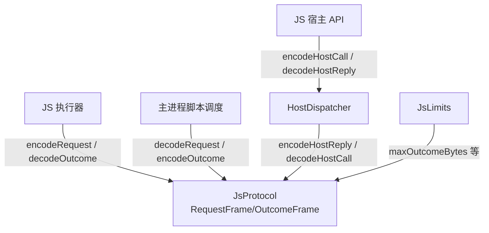
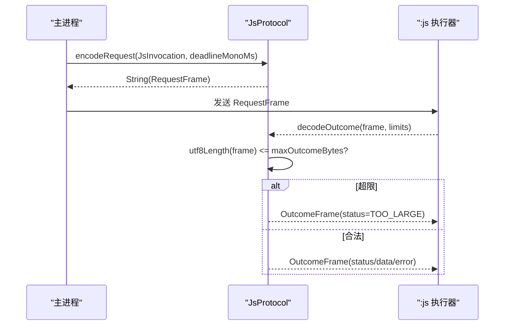
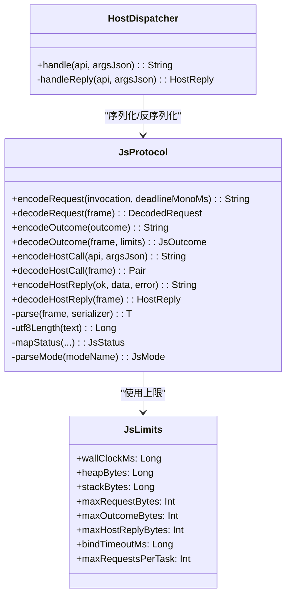

# 协议帧格式规范

<cite>
**本文引用的文件**
- [JsProtocol.kt](file://lib_book_source/src/main/java/com/ebook/source/sandbox/JsProtocol.kt)
- [JsLimits.kt](file://lib_book_source/src/main/java/com/ebook/source/sandbox/JsLimits.kt)
- [HostDispatcher.kt](file://lib_book_source/src/main/java/com/ebook/source/sandbox/HostDispatcher.kt)
- [JsProtocolTest.kt](file://lib_book_source/src/test/java/com/ebook/source/sandbox/JsProtocolTest.kt)
</cite>

## 目录
1. [简介](#简介)
2. [项目结构](#项目结构)
3. [核心组件](#核心组件)
4. [架构总览](#架构总览)
5. [详细组件分析](#详细组件分析)
6. [依赖关系分析](#依赖关系分析)
7. [性能与内存保护](#性能与内存保护)
8. [故障排查指南](#故障排查指南)
9. [结论](#结论)
10. [附录：完整帧示例与兼容性策略](#附录完整帧示例与兼容性策略)

## 简介
本文档围绕 Binder 双向通信中的 JSON 协议帧，给出请求帧（RequestFrame）与响应帧（OutcomeFrame）的严格定义，以及宿主调用帧 HostCallFrame、HostReplyFrame 的设计与约束。文档同时覆盖序列化配置、枚举字符串化、JsonElement 的使用、帧大小限制机制、错误处理模式与向后兼容策略，帮助读者在跨进程边界上稳定、安全地交换数据。

## 项目结构
与协议帧直接相关的代码集中在脚本沙箱模块中，核心位于 JsProtocol 对象，统一承担“跨进程契约”的编解码与失败归类；资源上限集中由 JsLimits 管理；宿主能力入口通过 HostDispatcher 将 JS 侧的 host call 接入主进程。

**图示来源**
- [JsProtocol.kt:91-111](file://lib_book_source/src/main/java/com/ebook/source/sandbox/JsProtocol.kt#L91-L111)
- [JsProtocol.kt:123-169](file://lib_book_source/src/main/java/com/ebook/source/sandbox/JsProtocol.kt#L123-L169)
- [JsLimits.kt:13-58](file://lib_book_source/src/main/java/com/ebook/source/sandbox/JsLimits.kt#L13-L58)
- [HostDispatcher.kt:24-74](file://lib_book_source/src/main/java/com/ebook/source/sandbox/HostDispatcher.kt#L24-L74)

**章节来源**
- [JsProtocol.kt:91-111](file://lib_book_source/src/main/java/com/ebook/source/sandbox/JsProtocol.kt#L91-L111)
- [JsLimits.kt:13-58](file://lib_book_source/src/main/java/com/ebook/source/sandbox/JsLimits.kt#L13-L58)
- [HostDispatcher.kt:24-74](file://lib_book_source/src/main/java/com/ebook/source/sandbox/HostDispatcher.kt#L24-L74)

## 核心组件
- RequestFrame：主进程 → :js 执行器的请求帧，包含 mode、source、bindings、deadline 四个字段。
- OutcomeFrame：:js 执行器 → 主进程的响应帧，包含 status、data、error。
- HostCallFrame：脚本 → 主进程的宿主调用请求，包含 api、args。
- HostReplyFrame：主进程 → 脚本的宿主调用回复，包含 ok、data、error。
- JsProtocol：负责所有帧的序列化、反序列化、状态映射与长度检查。
- JsLimits：提供各项资源与报文上限，包括 maxOutcomeBytes 等。

**章节来源**
- [JsProtocol.kt:91-111](file://lib_book_source/src/main/java/com/ebook/source/sandbox/JsProtocol.kt#L91-L111)
- [JsProtocol.kt:123-169](file://lib_book_source/src/main/java/com/ebook/source/sandbox/JsProtocol.kt#L123-L169)
- [JsLimits.kt:13-58](file://lib_book_source/src/main/java/com/ebook/source/sandbox/JsLimits.kt#L13-L58)

## 架构总览
协议层作为跨进程的唯一契约，屏蔽了 Kotlin 领域模型与 JSON 传输形态的差异，确保两侧只受 Json 字段名与类型约束。请求侧把枚举转为字符串写入帧，响应侧将未知状态折叠为运行时错误，避免误判成功。

**图示来源**
- [JsProtocol.kt:127-139](file://lib_book_source/src/main/java/com/ebook/source/sandbox/JsProtocol.kt#L127-L139)
- [JsProtocol.kt:150-169](file://lib_book_source/src/main/java/com/ebook/source/sandbox/JsProtocol.kt#L150-L169)
- [JsLimits.kt:27-42](file://lib_book_source/src/main/java/com/ebook/source/sandbox/JsLimits.kt#L27-L42)

## 详细组件分析

### 请求帧 RequestFrame
- 字段
  - mode: 字符串，表示执行模式（如 SEGMENT、EXPRESSION、URL_OPTION、BODY_JS、INIT）。以枚举名称序列化，保证跨进程稳定。
  - source: 字符串，脚本源码或规则片段。
  - bindings: Map<String, String?>，绑定表。值为 null 表示该量在本场景不可用，垫片会将其显式设为 undefined。
  - deadline: 单调时钟毫秒（BOOTTIME），用于死线控制，不受系统时间调整影响。
- 设计考量
  - 使用独立私有 DTO 而非直接序列化领域模型，使跨进程契约仅由本文件的字段与名字决定，避免领域模型变化导致线上形态漂移。
  - 字段可空性与命名参与 ignoreUnknownKeys=false 的严格解析，未知字段会导致解码失败，从而尽早发现版本不一致。

**章节来源**
- [JsProtocol.kt:91-97](file://lib_book_source/src/main/java/com/ebook/source/sandbox/JsProtocol.kt#L91-L97)
- [JsProtocol.kt:123-139](file://lib_book_source/src/main/java/com/ebook/source/sandbox/JsProtocol.kt#L123-L139)

### 响应帧 OutcomeFrame
- 字段
  - status: 字符串，表示结果分类（OK、TIMEOUT、MEMORY、STACK、SYNTAX、RUNTIME、UNSUPPORTED_API、TOO_LARGE、UNAVAILABLE）。
  - data: JsonElement?，成功时承载完成值的 JSON 形态；失败时为 null。
  - error: String?，失败时承载错误信息；成功时为 null。
- 语义
  - 成功帧：status=OK，data 非空可为标量或对象，error=null。
  - 失败帧：status≠OK，data=null，error 携带错误描述。
  - 文本提取：当 data 是 JsonPrimitive 且非 JsonNull 时，可通过 text 获取字面量；对象/数组视为无值。

**章节来源**
- [JsProtocol.kt:56-73](file://lib_book_source/src/main/java/com/ebook/source/sandbox/JsProtocol.kt#L56-L73)
- [JsProtocol.kt:106-111](file://lib_book_source/src/main/java/com/ebook/source/sandbox/JsProtocol.kt#L106-L111)

### 宿主调用帧 HostCallFrame 与 HostReplyFrame
- HostCallFrame
  - api: 字符串，能力名（例如 ajax、base64Encode）。由脚本侧以 JS 能力名传递，不在本层解析参数。
  - args: 字符串，未解析的 JSON 串。参数解析由宿主侧按 api 分派后再进行，避免重复解析与口径不一。
- HostReplyFrame
  - ok: Boolean，是否成功。
  - data: JsonElement?，成功时的数据体。
  - error: String?，失败时的错误信息。
- 设计考量
  - 将协议帧与领域模型分离：HostCallFrame/HostReplyFrame 仅用于跨进程 JSON 契约；HostReply 为强类型领域值，避免协议与领域互相牵动。
  - args 保持原始 JSON 串，职责清晰：本层只做搬移与校验，业务解析下沉到宿主侧。

**章节来源**
- [JsProtocol.kt:219-229](file://lib_book_source/src/main/java/com/ebook/source/sandbox/JsProtocol.kt#L219-L229)
- [JsProtocol.kt:231-249](file://lib_book_source/src/main/java/com/ebook/source/sandbox/JsProtocol.kt#L231-L249)
- [HostDispatcher.kt:24-74](file://lib_book_source/src/main/java/com/ebook/source/sandbox/HostDispatcher.kt#L24-L74)

### 序列化机制与配置
- Json 配置
  - ignoreUnknownKeys = false：未知字段直接导致解码失败，用于检测两侧构建不一致。
  - encodeDefaults = true：默认值会编码，确保协议稳定。
- 枚举字符串化
  - 请求帧使用枚举 name 作为 mode/status 的值，跨进程稳定可比对。
  - 解析未知枚举名时：
    - 模式名未知：抛出类型化协议异常（SandboxProtocolException），不静默降级。
    - 状态名未知：折叠为 RUNTIME，绝不为 OK，避免把失败说成没有结果。
- JsonElement 的使用
  - OutcomeFrame.data 使用 JsonElement，允许任意 JSON 结构；text 仅在标量时取字面量，对象/数组视为无值，避免强转失败导致的静默丢失。

**章节来源**
- [JsProtocol.kt:123-126](file://lib_book_source/src/main/java/com/ebook/source/sandbox/JsProtocol.kt#L123-L126)
- [JsProtocol.kt:204-218](file://lib_book_source/src/main/java/com/ebook/source/sandbox/JsProtocol.kt#L204-L218)

### 帧大小限制机制
- 长度计算
  - utf8Length(text)：逐码点统计 UTF-8 字节数，零分配，正确处理代理对（增补平面字符 4 字节）。
- 限制策略
  - 在 decodeOutcome 中先进行 utf8Length 检查，再进入 JSON 解析，防止攻击者利用解析阶段制造大对象。
  - 上限来自 JsLimits：
    - maxOutcomeBytes：响应帧上限（默认约 900KB）。
    - maxRequestBytes：请求帧上限（含整页 HTML 绑定时）。
    - maxHostReplyBytes：host 回调上限。
- 设计考量
  - 以 binder 事务缓冲为尺子，避免现场抛 TransactionTooLargeException 等未类型化异常。
  - 三个上限采用同一长度口径，确保两侧一致判定。

**章节来源**
- [JsProtocol.kt:150-169](file://lib_book_source/src/main/java/com/ebook/source/sandbox/JsProtocol.kt#L150-L169)
- [JsProtocol.kt:258-281](file://lib_book_source/src/main/java/com/ebook/source/sandbox/JsProtocol.kt#L258-L281)
- [JsLimits.kt:27-42](file://lib_book_source/src/main/java/com/ebook/source/sandbox/JsLimits.kt#L27-L42)

### 错误处理模式
- 解码失败
  - 所有解码统一经 parse 包装，将 kotlinx 的 SerializationException 转换为 SandboxProtocolException，避免 .so 路径出现未类型化异常。
- 状态归类
  - mapStatus(kind, errorName, errorMessage, timedOut)：优先判断超时标志，其次按 errorName/message 区分内存/栈/语法/运行时。
  - 未知 kind 一律归为 RUNTIME，绝不折叠为 OK。
- 未知字段与非法值
  - ignoreUnknownKeys=false 使未知字段直接报错；非法模式名抛出类型化异常；非法状态名折叠为 RUNTIME。
- 测试覆盖
  - 往返保留字段、null 绑定、标量 text 取值、超上限、UTF-8 长度、host 回调往返、未知模式名拒绝等均有用例验证。

**章节来源**
- [JsProtocol.kt:171-218](file://lib_book_source/src/main/java/com/ebook/source/sandbox/JsProtocol.kt#L171-L218)
- [JsProtocol.kt:251-255](file://lib_book_source/src/main/java/com/ebook/source/sandbox/JsProtocol.kt#L251-L255)
- [JsProtocolTest.kt:23-185](file://lib_book_source/src/test/java/com/ebook/source/sandbox/JsProtocolTest.kt#L23-L185)

## 依赖关系分析
- JsProtocol 依赖
  - kotlinx.serialization：JSON 编解码与 JsonElement。
  - JsLimits：提供各报文与资源上限。
  - HostDispatcher：宿主能力分发，返回 HostReply 并序列化为 HostReplyFrame。
- 外部耦合
  - 协议帧与 .so 桥接层通过固定方法签名交互，Kotlin 侧必须保持公开可见性，避免 R8 剥离。
- 内聚性
  - 协议层集中封装跨进程契约，领域模型与 JSON 形态解耦，降低变更风险。

**图示来源**
- [JsProtocol.kt:123-281](file://lib_book_source/src/main/java/com/ebook/source/sandbox/JsProtocol.kt#L123-L281)
- [JsLimits.kt:13-58](file://lib_book_source/src/main/java/com/ebook/source/sandbox/JsLimits.kt#L13-L58)
- [HostDispatcher.kt:24-74](file://lib_book_source/src/main/java/com/ebook/source/sandbox/HostDispatcher.kt#L24-L74)

**章节来源**
- [JsProtocol.kt:123-281](file://lib_book_source/src/main/java/com/ebook/source/sandbox/JsProtocol.kt#L123-L281)
- [JsLimits.kt:13-58](file://lib_book_source/src/main/java/com/ebook/source/sandbox/JsLimits.kt#L13-L58)
- [HostDispatcher.kt:24-74](file://lib_book_source/src/main/java/com/ebook/source/sandbox/HostDispatcher.kt#L24-L74)

## 性能与内存保护
- 零分配长度计算：utf8Length 遍历码点累加 UTF-8 字节数，避免 toByteArray 复制。
- 先测长后解析：decodeOutcome 在解析前进行长度检查，阻断超大报文进入解析流程。
- 上限依据 binder 缓冲：三个字节上限基于 Android 进程间缓冲，避免现场抛未类型化异常。
- 资源限制集中管理：JsLimits 统一暴露 wall-clock、堆、栈与报文上限，便于调校与审计。

[本节为通用性能指导，无需具体文件引用]

## 故障排查指南
- 解码失败（帧形态不符）
  - 现象：抛出类型化协议异常，消息包含帧片段。
  - 排查：确认两端构建一致、字段名与类型匹配；注意 ignoreUnknownKeys=false 会拒绝未知字段。
- 未知模式名
  - 现象：请求帧中 mode 不是已定义枚举名。
  - 处置：抛出类型化协议异常，不应静默降级。
- 响应过大
  - 现象：decodeOutcome 返回 TOO_LARGE，带错误信息。
  - 排查：检查 maxOutcomeBytes 与实际响应大小；优化脚本输出或分页策略。
- 状态未知
  - 现象：响应帧 status 为本端未知枚举名。
  - 处置：折叠为 RUNTIME，避免误判成功；需同步双方枚举。
- host 回调失败
  - 现象：ok=false，error 携带原因（如私网地址、能力不存在）。
  - 排查：确认能力白名单、网络策略与参数 JSON 合法性。

**章节来源**
- [JsProtocol.kt:171-218](file://lib_book_source/src/main/java/com/ebook/source/sandbox/JsProtocol.kt#L171-L218)
- [JsProtocolTest.kt:123-185](file://lib_book_source/src/test/java/com/ebook/source/sandbox/JsProtocolTest.kt#L123-L185)

## 结论
本协议帧以严格的 JSON 契约与集中化的序列化/限制逻辑，保障了主进程与 :js 执行器之间的稳定通信。通过 ignoreUnknownKeys=false、枚举字符串化、JsonElement 的灵活承载、零分配长度计算与前置大小检查，实现了强一致、可审计、可防御的跨进程协议。错误处理遵循“宁可报错也不误导”的原则，确保用户看到真实问题与正确处方。

## 附录：完整帧示例与兼容性策略

### 请求帧示例（RequestFrame）
- 字段
  - mode: 字符串，枚举名（如 SEGMENT）。
  - source: 字符串，脚本源码。
  - bindings: Map<String, String?>，绑定表。
  - deadline: 单调时钟毫秒。
- 说明
  - 字段顺序不影响 JSON 解析；ignoreUnknownKeys=false 会拒绝未知字段。
  - 死线使用单调时钟，避免系统时间调整影响。

**章节来源**
- [JsProtocol.kt:91-97](file://lib_book_source/src/main/java/com/ebook/source/sandbox/JsProtocol.kt#L91-L97)
- [JsProtocol.kt:127-139](file://lib_book_source/src/main/java/com/ebook/source/sandbox/JsProtocol.kt#L127-L139)

### 响应帧示例（OutcomeFrame）
- 字段
  - status: 字符串，结果分类。
  - data: JsonElement?，完成值 JSON。
  - error: String?，错误信息。
- 说明
  - 成功帧：status=OK，error=null，data 可能为空或标量/对象。
  - 失败帧：status≠OK，data=null，error 携带错误。

**章节来源**
- [JsProtocol.kt:56-73](file://lib_book_source/src/main/java/com/ebook/source/sandbox/JsProtocol.kt#L56-L73)
- [JsProtocol.kt:106-111](file://lib_book_source/src/main/java/com/ebook/source/sandbox/JsProtocol.kt#L106-L111)

### 宿主调用帧示例（HostCallFrame / HostReplyFrame）
- HostCallFrame
  - api: 字符串，能力名。
  - args: 字符串，未解析 JSON。
- HostReplyFrame
  - ok: Boolean。
  - data: JsonElement?。
  - error: String?。
- 说明
  - 参数在宿主侧解析，协议层只负责搬移与校验。

**章节来源**
- [JsProtocol.kt:219-249](file://lib_book_source/src/main/java/com/ebook/source/sandbox/JsProtocol.kt#L219-L249)
- [HostDispatcher.kt:24-74](file://lib_book_source/src/main/java/com/ebook/source/sandbox/HostDispatcher.kt#L24-L74)

### 兼容性保证与向后兼容策略
- 未知字段：忽略未知字段会破坏契约一致性，因此启用 ignoreUnknownKeys=false，遇到未知字段即失败，促使两侧同步升级。
- 枚举漂移：
  - 模式名未知：抛出类型化协议异常，阻止静默降级。
  - 状态名未知：折叠为 RUNTIME，避免误判成功。
- 文本取值：text 仅在标量时有效，对象/数组视为无值，避免强转失败导致静默丢失。
- 长度上限：统一以 utf8Length 计算，避免两侧长度口径不一致。

**章节来源**
- [JsProtocol.kt:123-126](file://lib_book_source/src/main/java/com/ebook/source/sandbox/JsProtocol.kt#L123-L126)
- [JsProtocol.kt:204-218](file://lib_book_source/src/main/java/com/ebook/source/sandbox/JsProtocol.kt#L204-L218)
- [JsProtocol.kt:258-281](file://lib_book_source/src/main/java/com/ebook/source/sandbox/JsProtocol.kt#L258-L281)