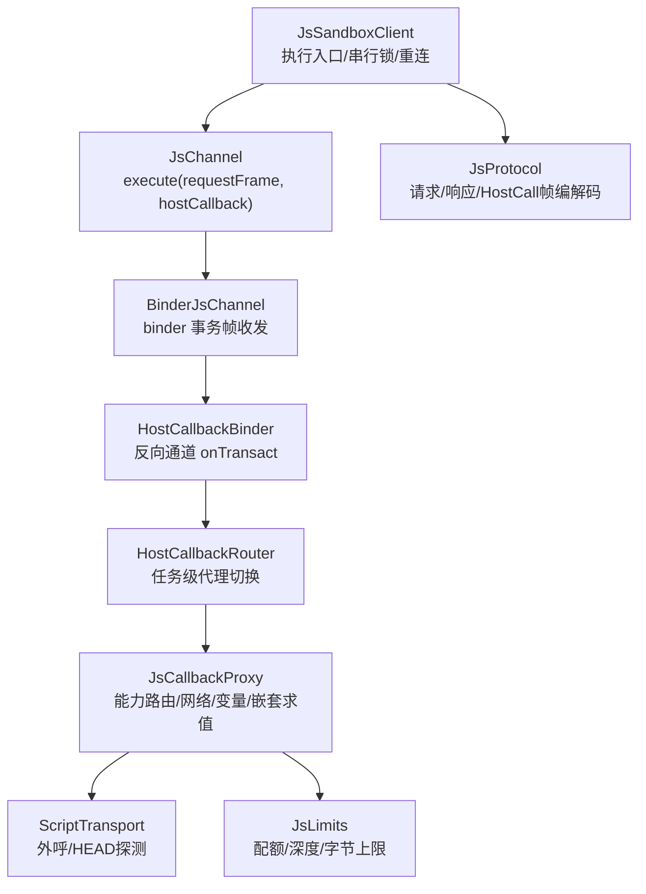
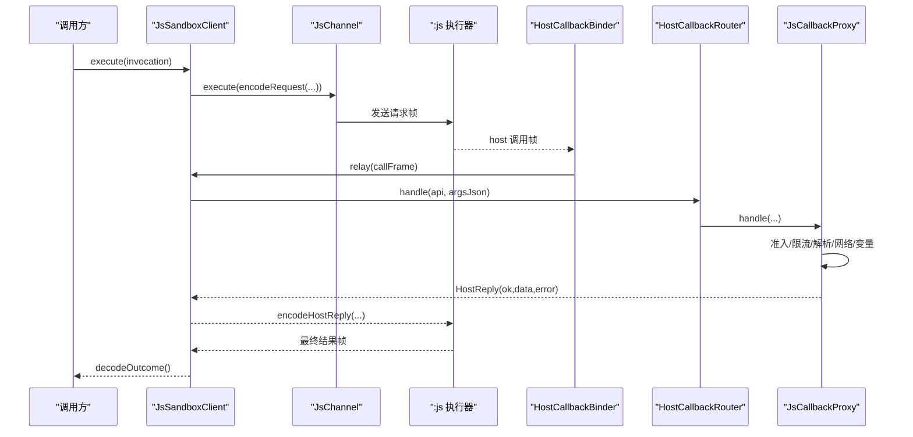
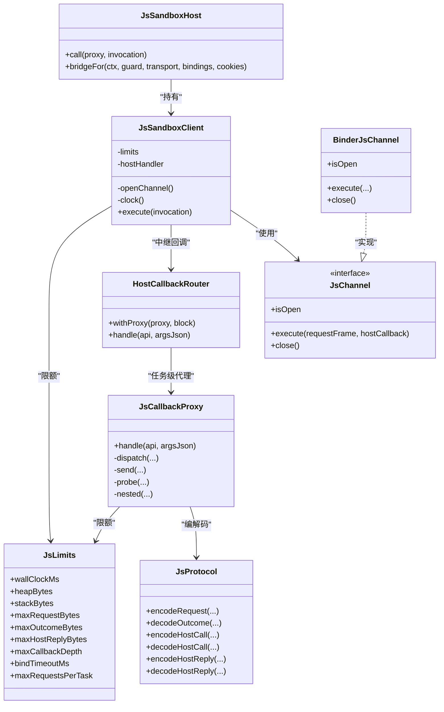

# 宿主回调机制

<cite>
**本文引用的文件**
- [JsSandboxHost.kt](file://lib_book_source/src/main/java/com/ebook/source/sandbox/JsSandboxHost.kt)
- [JsCallbackProxy.kt](file://lib_book_source/src/main/java/com/ebook/source/sandbox/JsCallbackProxy.kt)
- [JsChannel.kt](file://lib_book_source/src/main/java/com/ebook/source/sandbox/JsChannel.kt)
- [BinderJsChannel.kt](file://lib_book_source/src/main/java/com/ebook/source/sandbox/BinderJsChannel.kt)
- [JsSandboxClient.kt](file://lib_book_source/src/main/java/com/ebook/source/sandbox/JsSandboxClient.kt)
- [JsLimits.kt](file://lib_book_source/src/main/java/com/ebook/source/sandbox/JsLimits.kt)
- [JsProtocol.kt](file://lib_book_source/src/main/java/com/ebook/source/sandbox/JsProtocol.kt)
</cite>

## 目录
1. [简介](#简介)
2. [项目结构（与宿主回调相关）](#项目结构与宿主回调相关)
3. [核心组件](#核心组件)
4. [架构总览](#架构总览)
5. [详细组件分析](#详细组件分析)
6. [依赖关系分析](#依赖关系分析)
7. [性能与线程模型](#性能与线程模型)
8. [超时、取消与死线](#超时取消与死线)
9. [错误处理与分类](#错误处理与分类)
10. [安全性保障](#安全性保障)
11. [使用示例与调试技巧](#使用示例与调试技巧)
12. [故障排查清单](#故障排查清单)
13. [结论](#结论)

## 简介
本文件系统性阐述“宿主回调机制”：主进程与执行器之间通过双向通道进行请求与回调，实现脚本在沙箱中执行时访问宿主能力。重点包括：
- 双向通信：主进程→执行器的请求通道；执行器→主进程的回调通道。
- HostHandler 接口契约与实现要求：API 路由、参数解析、业务逻辑与结果封装。
- 回调线程模型：同步 handle 与 suspend 传输的桥接、并发与重入保护。
- 超时与取消：基于单调时钟的死线、超时判定与中断语义。
- 错误处理：异常捕获、错误分类与用户友好消息。
- 安全性：输入校验、权限控制、恶意代码防护与资源限制。
- 使用示例与调试：常见问题定位与排障建议。

## 项目结构（与宿主回调相关）
与宿主回调直接相关的核心位于 lib_book_source 模块的沙箱子包：
- 通道与协议：JsChannel、BinderJsChannel、JsProtocol
- 客户端与服务装配：JsSandboxClient、JsSandboxHost
- 回调代理与能力实现：HostHandler、JsCallbackProxy、HostCallbackRouter
- 限制与配置：JsLimits

图表来源
- [JsSandboxClient.kt:65-185](file://lib_book_source/src/main/java/com/ebook/source/sandbox/JsSandboxClient.kt#L65-L185)
- [BinderJsChannel.kt:41-84](file://lib_book_source/src/main/java/com/ebook/source/sandbox/BinderJsChannel.kt#L41-L84)
- [JsCallbackProxy.kt:152-239](file://lib_book_source/src/main/java/com/ebook/source/sandbox/JsCallbackProxy.kt#L152-L239)
- [JsProtocol.kt:123-255](file://lib_book_source/src/main/java/com/ebook/source/sandbox/JsProtocol.kt#L123-L255)

章节来源
- [JsSandboxClient.kt:1-185](file://lib_book_source/src/main/java/com/ebook/source/sandbox/JsSandboxClient.kt#L1-L185)
- [BinderJsChannel.kt:1-132](file://lib_book_source/src/main/java/com/ebook/source/sandbox/BinderJsChannel.kt#L1-L132)
- [JsCallbackProxy.kt:1-506](file://lib_book_source/src/main/java/com/ebook/source/sandbox/JsCallbackProxy.kt#L1-L506)
- [JsProtocol.kt:1-282](file://lib_book_source/src/main/java/com/ebook/source/sandbox/JsProtocol.kt#L1-L282)

## 核心组件
- JsSandboxClient：执行入口，负责串行化、断连重放、主线程守卫、host 回调中继与失败归类。
- JsChannel/BinderJsChannel：跨进程通道抽象与 binder 实现，单次 execute 一帧进出。
- HostHandler：主进程侧 host 回调统一入口，不得抛出未类型化异常。
- HostCallbackRouter：任务级代理转子，保证一次仅一个代理活跃。
- JsCallbackProxy：具体能力实现（ajax/load/post/responseCode/cookie/*变量/日志/嵌套求值等），含准入、限流、超时与大小限制。
- JsProtocol：请求/响应/HostCall 帧的编解码与状态映射。
- JsLimits：集中资源限制（挂钟、堆、栈、报文大小、回调深度、绑定超时、请求次数）。

章节来源
- [JsSandboxClient.kt:1-185](file://lib_book_source/src/main/java/com/ebook/source/sandbox/JsSandboxClient.kt#L1-L185)
- [JsChannel.kt:1-37](file://lib_book_source/src/main/java/com/ebook/source/sandbox/JsChannel.kt#L1-L37)
- [BinderJsChannel.kt:1-132](file://lib_book_source/src/main/java/com/ebook/source/sandbox/BinderJsChannel.kt#L1-L132)
- [JsCallbackProxy.kt:1-506](file://lib_book_source/src/main/java/com/ebook/source/sandbox/JsCallbackProxy.kt#L1-L506)
- [JsProtocol.kt:1-282](file://lib_book_source/src/main/java/com/ebook/source/sandbox/JsProtocol.kt#L1-L282)
- [JsLimits.kt:1-58](file://lib_book_source/src/main/java/com/ebook/source/sandbox/JsLimits.kt#L1-L58)

## 架构总览
主进程到执行器：JsSandboxClient.encodeRequest → JsChannel.execute → 执行器运行 JS，期间可能触发 host 调用。
执行器到主进程：执行器通过 binder 调用 HostCallbackBinder.onTransact → JsSandboxClient.relay → HostHandler.handle → 返回 HostReply → 编码为帧回给执行器。

图表来源
- [JsSandboxClient.kt:65-185](file://lib_book_source/src/main/java/com/ebook/source/sandbox/JsSandboxClient.kt#L65-L185)
- [BinderJsChannel.kt:93-132](file://lib_book_source/src/main/java/com/ebook/source/sandbox/BinderJsChannel.kt#L93-L132)
- [JsCallbackProxy.kt:152-239](file://lib_book_source/src/main/java/com/ebook/source/sandbox/JsCallbackProxy.kt#L152-L239)
- [JsProtocol.kt:123-255](file://lib_book_source/src/main/java/com/ebook/source/sandbox/JsProtocol.kt#L123-L255)

## 详细组件分析

### HostHandler 接口与实现要求
- 接口契约：handle(api, argsJson) 必须返回 HostReply，且不得抛出未类型化异常（异常会被上层兜底并转为 ok=false）。
- API 路由：按能力名查找可执行项（如 ajax/load/post/responseCode/cookie/get/set/remove/var/log/toast 等）。
- 参数解析：严格元数与类型校验，拒绝非法参数，避免静默错误。
- 业务逻辑：网络请求准入（白名单/私网）、配额计数、超时与大小限制、变量读写、嵌套求值等。
- 结果封装：成功返回数据或空值；失败返回错误信息，保持用户可读。

章节来源
- [JsChannel.kt:27-37](file://lib_book_source/src/main/java/com/ebook/source/sandbox/JsChannel.kt#L27-L37)
- [JsCallbackProxy.kt:152-239](file://lib_book_source/src/main/java/com/ebook/source/sandbox/JsCallbackProxy.kt#L152-L239)
- [JsCallbackProxy.kt:449-460](file://lib_book_source/src/main/java/com/ebook/source/sandbox/JsCallbackProxy.kt#L449-L460)

### 请求通道（主进程→执行器）
- 请求帧构造：JsSandboxClient.encodeRequest，附带单调时钟死线。
- 串行执行：inFlight 锁保证同一时刻只有一帧在飞，避免资源竞争与竞态。
- 主线程守卫：禁止在主线程执行，防止 ANR。
- 断连重放：断连后尝试重连并重放一次，若已转发过 host 回调则不重放以避免重复副作用。

章节来源
- [JsSandboxClient.kt:35-99](file://lib_book_source/src/main/java/com/ebook/source/sandbox/JsSandboxClient.kt#L35-L99)
- [JsSandboxClient.kt:116-143](file://lib_book_source/src/main/java/com/ebook/source/sandbox/JsSandboxClient.kt#L116-L143)

### 回调通道（执行器→主进程）
- 反向通道：BinderJsChannel.HostCallbackBinder.onTransact 接收 host 调用帧。
- 中继：JsSandboxClient.relay 将调用帧转交给 HostHandler。
- 任务级代理：HostCallbackRouter 维护当前任务的 HostHandler，确保唯一代理生效。
- 安全兜底：任何异常都被捕获并转为 ok=false 的 HostReply，防止跨进程异常传播导致执行器进程崩溃。

章节来源
- [BinderJsChannel.kt:93-132](file://lib_book_source/src/main/java/com/ebook/source/sandbox/BinderJsChannel.kt#L93-L132)
- [JsSandboxClient.kt:161-181](file://lib_book_source/src/main/java/com/ebook/source/sandbox/JsSandboxClient.kt#L161-L181)
- [JsCallbackProxy.kt:57-75](file://lib_book_source/src/main/java/com/ebook/source/sandbox/JsCallbackProxy.kt#L57-L75)

### 能力路由与参数解析
- 能力表：JsHostApi.byJsName 匹配能力名，区分 COMPUTE（纯计算不走主进程）与需主进程处理的能力。
- 参数解析：argsOf 严格校验 JSON 数组与元数，非法参数直接拒绝。
- 选项解析：optionsOf/postOptions/headerMap 对 URL 选项与 POST 头做严格解析与约束。

章节来源
- [JsCallbackProxy.kt:152-239](file://lib_book_source/src/main/java/com/ebook/source/sandbox/JsCallbackProxy.kt#L152-L239)
- [JsCallbackProxy.kt:317-359](file://lib_book_source/src/main/java/com/ebook/source/sandbox/JsCallbackProxy.kt#L317-L359)
- [JsCallbackProxy.kt:449-460](file://lib_book_source/src/main/java/com/ebook/source/sandbox/JsCallbackProxy.kt#L449-L460)

### 网络与变量操作
- 准入与限流：admit 检查主机白名单并计数，超出上限立即拒绝。
- 外呼与响应体限制：send/probe 走 ScriptTransport，响应体超界拒绝并记录。
- 变量存取：put/get/remove 变量、sourceVariable 整串存取。
- Cookie 管理：get/set/remove cookie，未装配会话罐时报错而非静默空值。

章节来源
- [JsCallbackProxy.kt:241-384](file://lib_book_source/src/main/java/com/ebook/source/sandbox/JsCallbackProxy.kt#L241-L384)

### 嵌套规则求值
- 嵌套求值：nested 将规则串交由 evaluateNested 处理，支持 getElements/getElement/queryString。
- 深度限制：maxCallbackDepth 控制嵌套深度，防止无限递归。
- 形态控制：LIST/SINGLE 决定返回数组或单项。

章节来源
- [JsCallbackProxy.kt:400-430](file://lib_book_source/src/main/java/com/ebook/source/sandbox/JsCallbackProxy.kt#L400-L430)

## 依赖关系分析
- JsSandboxHost 持有 JsSandboxClient、OkHttpClient、JsLimits、HostCallbackRouter，提供 call/bridgeFor 组装任务。
- JsSandboxClient 依赖 JsChannel（真实为 BinderJsChannel）、JsProtocol、HostHandler。
- JsCallbackProxy 依赖 JsNetworkGuard、ScriptTransport、EvalContext、SourceCookieJar、JsLimits。
- BinderJsChannel 依赖 SandboxContract 协议常量与 binder 机制。
- JsProtocol 提供跨进程帧编解码与状态映射。

图表来源
- [JsSandboxHost.kt:21-59](file://lib_book_source/src/main/java/com/ebook/source/sandbox/JsSandboxHost.kt#L21-L59)
- [JsSandboxClient.kt:35-185](file://lib_book_source/src/main/java/com/ebook/source/sandbox/JsSandboxClient.kt#L35-L185)
- [BinderJsChannel.kt:20-84](file://lib_book_source/src/main/java/com/ebook/source/sandbox/BinderJsChannel.kt#L20-L84)
- [JsCallbackProxy.kt:57-75](file://lib_book_source/src/main/java/com/ebook/source/sandbox/JsCallbackProxy.kt#L57-L75)
- [JsCallbackProxy.kt:105-460](file://lib_book_source/src/main/java/com/ebook/source/sandbox/JsCallbackProxy.kt#L105-L460)
- [JsProtocol.kt:123-255](file://lib_book_source/src/main/java/com/ebook/source/sandbox/JsProtocol.kt#L123-L255)
- [JsLimits.kt:13-58](file://lib_book_source/src/main/java/com/ebook/source/sandbox/JsLimits.kt#L13-L58)

## 性能与线程模型
- 串行执行：inFlight 锁保证单一请求在飞，避免并发冲突与资源争用。
- 回调线程：binder 线程池处理回调，非主线程；handle 同步，传输层 suspend 通过 runBlocking 桥接。
- 线程安全：可变字段使用 @Volatile，避免跨线程可见性问题；ThreadLocal 跟踪回调深度。
- 性能优化：
  - 报文长度零分配检查（utf8Length）避免额外内存分配。
  - 准入与限流前置，减少无效请求。
  - 缓存会话罐，避免重复登录。
  - 嵌套求值深度限制，防止深递归。

章节来源
- [JsSandboxClient.kt:57-114](file://lib_book_source/src/main/java/com/ebook/source/sandbox/JsSandboxClient.kt#L57-L114)
- [JsCallbackProxy.kt:137-148](file://lib_book_source/src/main/java/com/ebook/source/sandbox/JsCallbackProxy.kt#L137-L148)
- [JsCallbackProxy.kt:241-300](file://lib_book_source/src/main/java/com/ebook/source/sandbox/JsCallbackProxy.kt#L241-L300)
- [JsProtocol.kt:258-281](file://lib_book_source/src/main/java/com/ebook/source/sandbox/JsProtocol.kt#L258-L281)

## 超时、取消与死线
- 死线：请求帧携带 deadlineMonoMs（单调时钟毫秒），跨进程可比。
- 超时判定：await 使用 withTimeout(limits.wallClockMs) 保护 binder 线程不被长时间占用。
- 中断处理：超时抛 JsApiRejectedException，转换为 ok=false 回复；执行器侧根据 timedOut 标记归类为 TIMEOUT。
- 断连重放：断连后最多重放一次，若已转发回调则不重放，避免重复副作用。

章节来源
- [JsProtocol.kt:83-97](file://lib_book_source/src/main/java/com/ebook/source/sandbox/JsProtocol.kt#L83-L97)
- [JsProtocol.kt:159-169](file://lib_book_source/src/main/java/com/ebook/source/sandbox/JsProtocol.kt#L159-L169)
- [JsCallbackProxy.kt:285-300](file://lib_book_source/src/main/java/com/ebook/source/sandbox/JsCallbackProxy.kt#L285-L300)
- [JsSandboxClient.kt:116-135](file://lib_book_source/src/main/java/com/ebook/source/sandbox/JsSandboxClient.kt#L116-L135)

## 错误处理与分类
- 异常捕获：所有异常被捕获并转为 HostReply(ok=false, error=...)，避免跨进程异常传播。
- 错误分类：JsStatus 区分 OK/TIMEOUT/MEMORY/STACK/SYNTAX/RUNTIME/UNSUPPORTED_API/TOO_LARGE/UNAVAILABLE。
- 用户友好消息：错误信息包含能力名、URL、限制值等上下文，便于定位问题。
- 协议错误：帧格式不符或版本不一致直接抛 SandboxProtocolException，由调用方处理。

章节来源
- [JsCallbackProxy.kt:152-177](file://lib_book_source/src/main/java/com/ebook/source/sandbox/JsCallbackProxy.kt#L152-L177)
- [JsProtocol.kt:30-47](file://lib_book_source/src/main/java/com/ebook/source/sandbox/JsProtocol.kt#L30-L47)
- [JsProtocol.kt:171-202](file://lib_book_source/src/main/java/com/ebook/source/sandbox/JsProtocol.kt#L171-L202)
- [BinderJsChannel.kt:73-84](file://lib_book_source/src/main/java/com/ebook/source/sandbox/BinderJsChannel.kt#L73-L84)

## 安全性保障
- 输入验证：参数元数、类型、JSON 格式严格校验。
- 权限控制：主机白名单与私网拒绝，cookie 会话隔离。
- 恶意代码防护：
  - 资源限制：挂钟、堆、栈、报文大小、回调深度、请求次数上限。
  - 能力白名单：仅暴露必要能力，计算型能力不经过主进程。
  - 嵌套求值深度限制，防止无限递归。
- 会话安全：cookie 罐与传输客户端绑定，避免会话泄漏。

章节来源
- [JsLimits.kt:13-58](file://lib_book_source/src/main/java/com/ebook/source/sandbox/JsLimits.kt#L13-L58)
- [JsCallbackProxy.kt:241-256](file://lib_book_source/src/main/java/com/ebook/source/sandbox/JsCallbackProxy.kt#L241-L256)
- [JsCallbackProxy.kt:400-430](file://lib_book_source/src/main/java/com/ebook/source/sandbox/JsCallbackProxy.kt#L400-L430)
- [JsCallbackProxy.kt:377-384](file://lib_book_source/src/main/java/com/ebook/source/sandbox/JsCallbackProxy.kt#L377-L384)

## 使用示例与调试技巧
- 典型流程：
  - 构建 JsSandboxHost，注入 JsSandboxClient、OkHttpClient、JsLimits。
  - 创建 EvalContext 与 ScriptJsBridge，设置静态绑定与传输。
  - 调用 bridgeFor.executeTask 执行脚本，期间可能触发 host 回调。
- 调试技巧：
  - 启用日志：JsCallbackProxy 内部使用 Logger 输出 toast/log。
  - 监控配额：观察 requests 计数与 limits.maxRequestsPerTask。
  - 检查报文大小：注意 maxRequestBytes/maxOutcomeBytes/maxHostReplyBytes。
  - 定位超时：查看 wallClockMs 与 withTimeout 异常。
  - 断连重放：关注 afterDisconnect 日志与 retransmission 行为。

章节来源
- [JsSandboxHost.kt:21-59](file://lib_book_source/src/main/java/com/ebook/source/sandbox/JsSandboxHost.kt#L21-L59)
- [JsCallbackProxy.kt:121-125](file://lib_book_source/src/main/java/com/ebook/source/sandbox/JsCallbackProxy.kt#L121-L125)
- [JsSandboxClient.kt:116-135](file://lib_book_source/src/main/java/com/ebook/source/sandbox/JsSandboxClient.kt#L116-L135)

## 故障排查清单
- 脚本无法执行：
  - 检查是否在主线程调用（isMainThread 守卫）。
  - 确认执行器连接正常（bindTimeoutMs）。
- 回调无响应：
  - 检查 HostCallbackRouter 是否挂载了正确代理。
  - 查看 binder 线程池是否繁忙。
- 请求被拒绝：
  - 检查主机白名单与私网策略。
  - 确认请求体与方法匹配（POST/PUT/PATCH 必须有 body）。
- 响应过大：
  - 调整 maxHostReplyBytes 或优化脚本逻辑。
- 嵌套求值失败：
  - 检查 maxCallbackDepth 是否达到上限。
  - 确认 evaluateNested 实现是否正确。

章节来源
- [JsSandboxClient.kt:65-69](file://lib_book_source/src/main/java/com/ebook/source/sandbox/JsSandboxClient.kt#L65-L69)
- [JsCallbackProxy.kt:258-264](file://lib_book_source/src/main/java/com/ebook/source/sandbox/JsCallbackProxy.kt#L258-L264)
- [JsCallbackProxy.kt:413-424](file://lib_book_source/src/main/java/com/ebook/source/sandbox/JsCallbackProxy.kt#L413-L424)

## 结论
宿主回调机制通过清晰的通道、协议与限制，实现了安全、可控、高性能的主进程与执行器双向通信。HostHandler 接口提供了统一的回调入口，JsCallbackProxy 实现了丰富的宿主能力，JsSandboxClient 保障了执行的串行性与健壮性。通过严格的输入验证、权限控制与资源限制，有效防护了恶意代码与滥用。超时与取消机制确保了系统响应性，错误处理与分类提升了可诊断性。在实际使用中，应遵循最佳实践，合理配置限制参数，并充分利用调试工具定位问题。