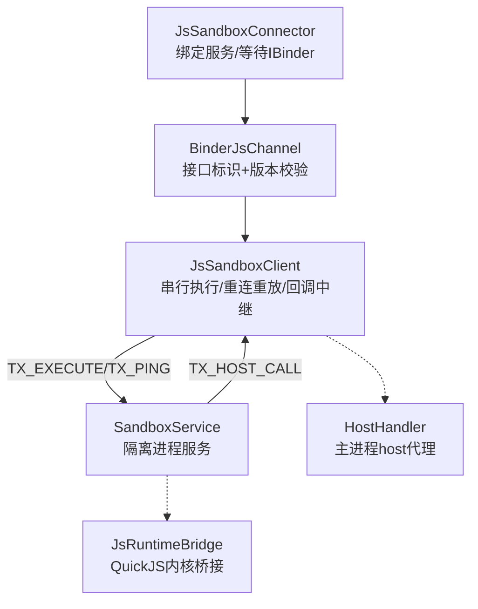
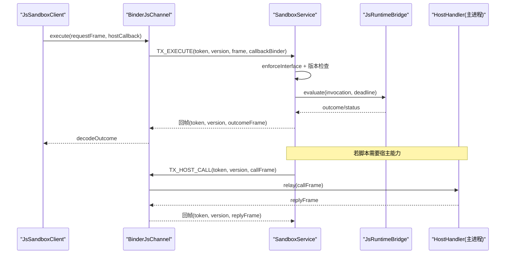
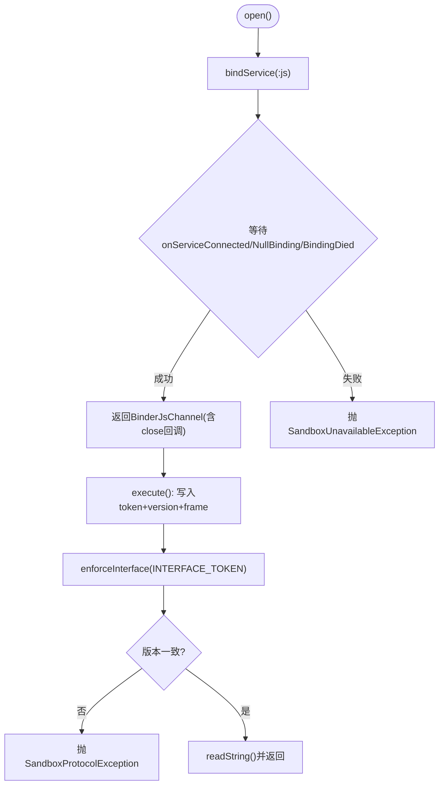
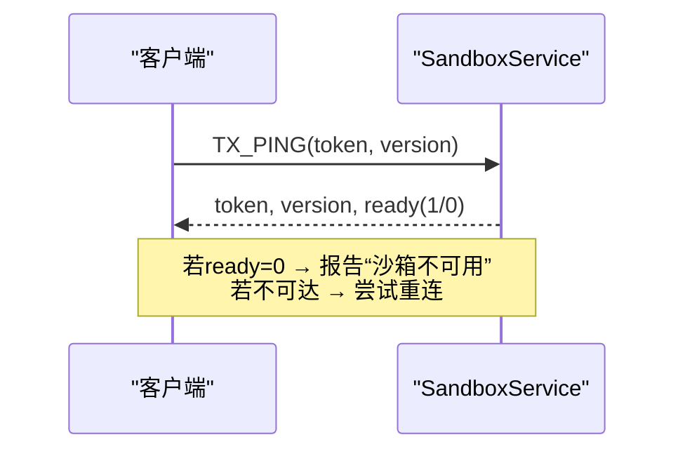
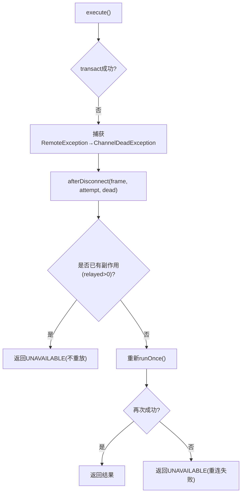
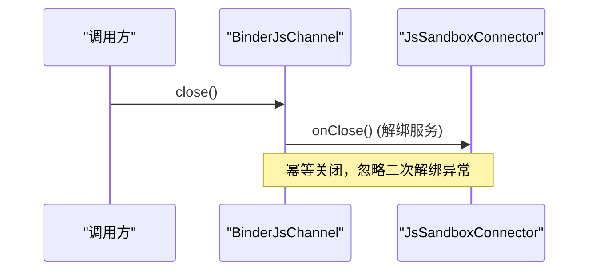
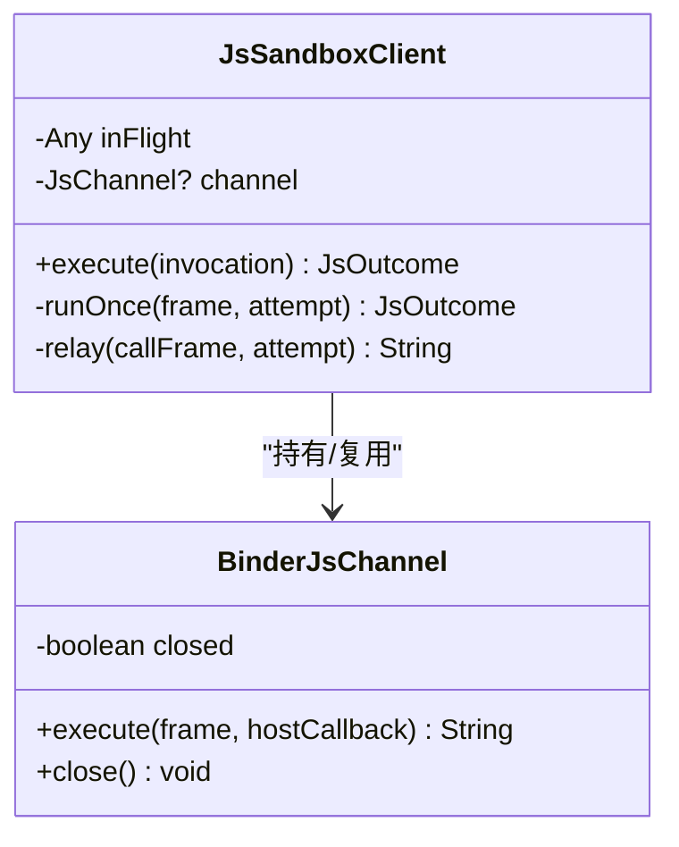
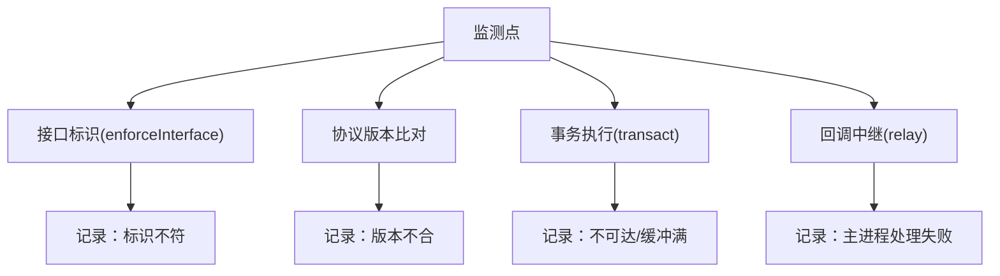
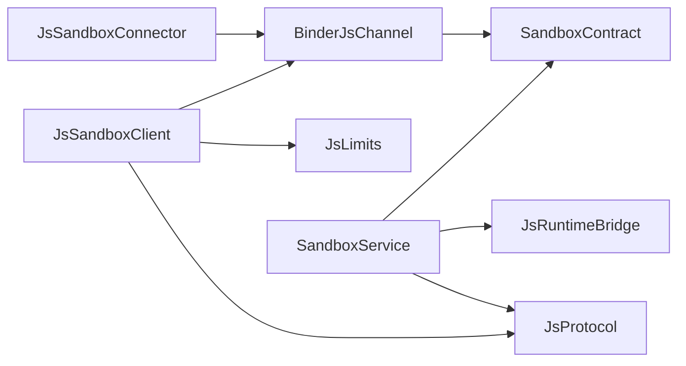

# 连接生命周期管理

<cite>
**本文引用的文件**
- [JsSandboxConnector.kt](file://lib_book_source/src/main/java/com/ebook/source/sandbox/JsSandboxConnector.kt)
- [BinderJsChannel.kt](file://lib_book_source/src/main/java/com/ebook/source/sandbox/BinderJsChannel.kt)
- [SandboxContract.kt](file://lib_book_source/src/main/java/com/ebook/source/sandbox/SandboxContract.kt)
- [JsSandboxClient.kt](file://lib_book_source/src/main/java/com/ebook/source/sandbox/JsSandboxClient.kt)
- [JsLimits.kt](file://lib_book_source/src/main/java/com/ebook/source/sandbox/JsLimits.kt)
- [SandboxService.kt](file://lib_book_source/src/main/java/com/ebook/source/sandbox/SandboxService.kt)
- [JsChannel.kt](file://lib_book_source/src/main/java/com/ebook/source/sandbox/JsChannel.kt)
- [SandboxProcess.kt](file://lib_book_source/src/main/java/com/ebook/source/sandbox/SandboxProcess.kt)
- [JsProtocol.kt](file://lib_book_source/src/main/java/com/ebook/source/sandbox/JsProtocol.kt)
</cite>

## 目录
1. [引言](#引言)
2. [项目结构](#项目结构)
3. [核心组件](#核心组件)
4. [架构总览](#架构总览)
5. [详细组件分析](#详细组件分析)
6. [依赖关系分析](#依赖关系分析)
7. [性能与资源限制](#性能与资源限制)
8. [故障诊断与排错](#故障诊断与排错)
9. [结论](#结论)
10. [附录：最佳实践与常见问题](#附录最佳实践与常见问题)

## 引言
本文聚焦于沙箱执行器（:js）的 Binder 连接生命周期管理，覆盖连接建立、协议协商、心跳探活、断线检测与重连、优雅关闭、连接复用与并发控制、状态监控与日志策略等关键主题。该实现以最小化跨进程边界复杂性为目标，通过显式接口标识、协议版本与事务码对齐，确保在“对端不可用”和“协议不兼容”两类故障间清晰分流，从而让上层调用方获得可预测的重连与降级行为。

## 项目结构
本模块围绕“主进程客户端 ↔ :js 隔离进程服务”的双向 Binder 通信构建，核心由以下职责清晰的组件组成：
- 连接器：负责绑定服务、等待 IBinder 并返回通道
- 通道层：封装一次事务一帧的发送与回读，进行接口标识与协议版本校验
- 客户端：统一调度执行、回调中继、断连后重放、并发串行化
- 服务侧：接收事务、解析协议、桥接到内核执行、提供 ping 探活
- 协议与限制：定义接口标识、事务码、协议版本及字节/时间/深度等限制

图表来源
- [JsSandboxConnector.kt:24-64](file://lib_book_source/src/main/java/com/ebook/source/sandbox/JsSandboxConnector.kt#L24-L64)
- [BinderJsChannel.kt:20-84](file://lib_book_source/src/main/java/com/ebook/source/sandbox/BinderJsChannel.kt#L20-L84)
- [JsSandboxClient.kt:35-185](file://lib_book_source/src/main/java/com/ebook/source/sandbox/JsSandboxClient.kt#L35-L185)
- [SandboxService.kt:27-136](file://lib_book_source/src/main/java/com/ebook/source/sandbox/SandboxService.kt#L27-L136)

章节来源
- [JsSandboxConnector.kt:24-64](file://lib_book_source/src/main/java/com/ebook/source/sandbox/JsSandboxConnector.kt#L24-L64)
- [BinderJsChannel.kt:20-84](file://lib_book_source/src/main/java/com/ebook/source/sandbox/BinderJsChannel.kt#L20-L84)
- [JsSandboxClient.kt:35-185](file://lib_book_source/src/main/java/com/ebook/source/sandbox/JsSandboxClient.kt#L35-L185)
- [SandboxService.kt:27-136](file://lib_book_source/src/main/java/com/ebook/source/sandbox/SandboxService.kt#L27-L136)

## 核心组件
- JsSandboxConnector：负责 bindService，等待 IBinder，超时抛不可用异常；每次 open 创建独立 Connection，close 时解绑，避免旧连接与新连接互相干扰。
- BinderJsChannel：封装 execute/close，写入接口标识与协议版本，读取响应时严格 enforceInterface 与版本检查；失败分两类：通道死亡（可重连）与协议错误（不可重连）。
- JsSandboxClient：唯一对外执行入口；串行化 execute；处理 host 回调中继；断连后按“是否已产生副作用”决定重放；主线程保护与重入保护。
- SandboxService：隔离进程中的 Binder 服务；处理 TX_EXECUTE/TX_PING；只暴露受控能力；进程安全门（隔离进程检查）。
- SandboxContract：线上契约集中定义（INTERFACE_TOKEN、PROTOCOL_VERSION、事务码、CALLBACK_TOKEN）。
- JsLimits：统一资源限制（挂钟、堆、栈、报文上限、回调深度、绑定超时、任务网络请求次数）。
- JsProtocol：跨进程 JSON 帧编解码与状态映射；UTF-8 长度统计零分配；严格忽略未知键，保证协议演进可见性。

章节来源
- [JsSandboxConnector.kt:24-142](file://lib_book_source/src/main/java/com/ebook/source/sandbox/JsSandboxConnector.kt#L24-L142)
- [BinderJsChannel.kt:20-132](file://lib_book_source/src/main/java/com/ebook/source/sandbox/BinderJsChannel.kt#L20-L132)
- [JsSandboxClient.kt:35-185](file://lib_book_source/src/main/java/com/ebook/source/sandbox/JsSandboxClient.kt#L35-L185)
- [SandboxService.kt:27-210](file://lib_book_source/src/main/java/com/ebook/source/sandbox/SandboxService.kt#L27-L210)
- [SandboxContract.kt:13-47](file://lib_book_source/src/main/java/com/ebook/source/sandbox/SandboxContract.kt#L13-L47)
- [JsLimits.kt:13-58](file://lib_book_source/src/main/java/com/ebook/source/sandbox/JsLimits.kt#L13-L58)
- [JsProtocol.kt:12-281](file://lib_book_source/src/main/java/com/ebook/source/sandbox/JsProtocol.kt#L12-L281)

## 架构总览
下图展示了从发起执行到完成的全链路交互，包括接口标识与协议版本的强制校验、心跳探活、以及双向回调通路。

图表来源
- [BinderJsChannel.kt:41-84](file://lib_book_source/src/main/java/com/ebook/source/sandbox/BinderJsChannel.kt#L41-L84)
- [SandboxService.kt:63-98](file://lib_book_source/src/main/java/com/ebook/source/sandbox/SandboxService.kt#L63-L98)
- [SandboxService.kt:165-209](file://lib_book_source/src/main/java/com/ebook/source/sandbox/SandboxService.kt#L165-L209)
- [JsSandboxClient.kt:137-143](file://lib_book_source/src/main/java/com/ebook/source/sandbox/JsSandboxClient.kt#L137-L143)

## 详细组件分析

### 连接建立与协议协商
- 连接建立：Connector 使用 bindService(BIND_AUTO_CREATE) 拉起服务，内部 Connection 等待 onServiceConnected/onNullBinding/onBindingDied 任一结果，带超时；失败抛出不可用异常而非通道死亡，避免无副作用调用被误重放。
- 接口标识验证：Channel 写数据前写入 INTERFACE_TOKEN，服务端先 enforceInterface 再读字段；回调通道也使用 CALLBACK_TOKEN，防止传错 binder。
- 协议版本协商：双方写入 PROTOCOL_VERSION，读取端不一致即报协议错误（非断连），便于区分“对端不可达”和“两侧代码不同步”。
- 事务码初始化：execute 走 TX_EXECUTE，ping 走 TX_PING；反向 host 调用走 CALLBACK_TOKEN 下的 TX_HOST_CALL。

图表来源
- [JsSandboxConnector.kt:37-60](file://lib_book_source/src/main/java/com/ebook/source/sandbox/JsSandboxConnector.kt#L37-L60)
- [BinderJsChannel.kt:41-84](file://lib_book_source/src/main/java/com/ebook/source/sandbox/BinderJsChannel.kt#L41-L84)
- [SandboxContract.kt:15-32](file://lib_book_source/src/main/java/com/ebook/source/sandbox/SandboxContract.kt#L15-L32)

章节来源
- [JsSandboxConnector.kt:37-60](file://lib_book_source/src/main/java/com/ebook/source/sandbox/JsSandboxConnector.kt#L37-L60)
- [BinderJsChannel.kt:41-84](file://lib_book_source/src/main/java/com/ebook/source/sandbox/BinderJsChannel.kt#L41-L84)
- [SandboxContract.kt:15-32](file://lib_book_source/src/main/java/com/ebook/source/sandbox/SandboxContract.kt#L15-L32)

### 心跳检测机制（TX_PING）
- 目的：区分“服务存在但桥接层未就绪”与“服务不存在”，避免把同一现象混为“重连即可恢复”。
- 实现：SandboxService.handlePing 仅写 token/version/ready（1=bridge ready, 0=.so 未加载），不回 outcome 帧以减少开销；主进程可通过此快速探测可用性。
- 频率控制：心跳频率由上层策略决定（例如周期性探测或仅在异常路径触发），本项目将心跳作为轻量级可用性质检，避免昂贵操作。
- 失败判定：若 ping 返回 ready=0，应上报“设备侧沙箱装不上”；若无法连通则视为“重连一次”。

图表来源
- [SandboxContract.kt:28-32](file://lib_book_source/src/main/java/com/ebook/source/sandbox/SandboxContract.kt#L28-L32)
- [SandboxService.kt:100-115](file://lib_book_source/src/main/java/com/ebook/source/sandbox/SandboxService.kt#L100-L115)

章节来源
- [SandboxContract.kt:28-32](file://lib_book_source/src/main/java/com/ebook/source/sandbox/SandboxContract.kt#L28-L32)
- [SandboxService.kt:100-115](file://lib_book_source/src/main/java/com/ebook/source/sandbox/SandboxService.kt#L100-L115)

### 断线检测与重连策略
- 触发条件：RemoteException（含 DeadObjectException、TransactionTooLargeException）被视为通道死亡；Binder 断开后下一次 transact 会失败；服务进程断开时 Connector 记录失败但不主动清 binder，交由事务失败路径统一判死。
- 重连退避：当前实现采用“立即重试一次”的策略（afterDisconnect），若再次失败则标记不可用；如需指数退避可在上层封装重试循环。
- 状态恢复：丢弃旧通道（dropChannel），必要时新建通道并重放（仅限本次无副作用的调用）。

图表来源
- [BinderJsChannel.kt:54-61](file://lib_book_source/src/main/java/com/ebook/source/sandbox/BinderJsChannel.kt#L54-L61)
- [JsSandboxClient.kt:84-99](file://lib_book_source/src/main/java/com/ebook/source/sandbox/JsSandboxClient.kt#L84-L99)
- [JsSandboxClient.kt:116-135](file://lib_book_source/src/main/java/com/ebook/source/sandbox/JsSandboxClient.kt#L116-L135)

章节来源
- [BinderJsChannel.kt:54-61](file://lib_book_source/src/main/java/com/ebook/source/sandbox/BinderJsChannel.kt#L54-L61)
- [JsSandboxClient.kt:84-99](file://lib_book_source/src/main/java/com/ebook/source/sandbox/JsSandboxClient.kt#L84-L99)
- [JsSandboxClient.kt:116-135](file://lib_book_source/src/main/java/com/ebook/source/sandbox/JsSandboxClient.kt#L116-L135)

### 优雅关闭流程
- 通道关闭：BinderJsChannel.close 幂等置位 closed，并调用连接器提供的 unbind 回调；多次 close 不会重复解绑。
- 资源释放：Parcel 在 finally 中回收；服务侧 onDestroy 清理 HostDispatcher 与 currentCallback，并关闭内核桥。
- 进程间通信终止：解绑后 Binder 失效，后续 transact 将失败，上层通过异常分类感知。

图表来源
- [BinderJsChannel.kt:67-71](file://lib_book_source/src/main/java/com/ebook/source/sandbox/BinderJsChannel.kt#L67-L71)
- [JsSandboxConnector.kt:62-65](file://lib_book_source/src/main/java/com/ebook/source/sandbox/JsSandboxConnector.kt#L62-L65)
- [SandboxService.kt:131-136](file://lib_book_source/src/main/java/com/ebook/source/sandbox/SandboxService.kt#L131-L136)

章节来源
- [BinderJsChannel.kt:67-71](file://lib_book_source/src/main/java/com/ebook/source/sandbox/BinderJsChannel.kt#L67-L71)
- [JsSandboxConnector.kt:62-65](file://lib_book_source/src/main/java/com/ebook/source/sandbox/JsSandboxConnector.kt#L62-L65)
- [SandboxService.kt:131-136](file://lib_book_source/src/main/java/com/ebook/source/sandbox/SandboxService.kt#L131-L136)

### 连接池管理与并发控制
- 多路复用与连接复用：当前设计为“单通道复用”（channel 字段缓存），在同一时刻仅允许一个 execute 飞行（inFlight 锁），避免 binder 缓冲争用与解析冲突。
- 容量限制：通过 maxRequestBytes/maxOutcomeBytes/maxHostReplyBytes 限制报文大小，避免 binder 事务缓冲溢出；maxCallbackDepth 限制回调嵌套深度。
- 并发模型：客户端串行化执行；服务侧 binder 线程池允许多条事务，但由于客户端串行，实际同时间只有一帧在飞。

图表来源
- [JsSandboxClient.kt:57-60](file://lib_book_source/src/main/java/com/ebook/source/sandbox/JsSandboxClient.kt#L57-L60)
- [BinderJsChannel.kt:20-33](file://lib_book_source/src/main/java/com/ebook/source/sandbox/BinderJsChannel.kt#L20-L33)

章节来源
- [JsSandboxClient.kt:57-60](file://lib_book_source/src/main/java/com/ebook/source/sandbox/JsSandboxClient.kt#L57-L60)
- [JsLimits.kt:13-58](file://lib_book_source/src/main/java/com/ebook/source/sandbox/JsLimits.kt#L13-L58)

### 连接状态监控与故障诊断
- 状态指标：isOpen 基于本地 closed 标志与 IBinder 存活；心跳 ready 指示桥接层就绪；日志记录各阶段失败原因（如“接口标识不符”“协议版本不合”“执行器不可达”）。
- 异常分类：
  - ChannelDeadException：传输层失败（对端死、缓冲炸了），可重连，必要时重放。
  - SandboxProtocolException：帧形态/版本/标识不符，不可重连，需修复两侧一致性。
  - SandboxUnavailableException：绑定失败或服务拒绝提供通道，属于不可用。
- 日志策略：统一 Logger 输出关键节点（绑定、协议、事务、回调中继、大小限制），便于定位问题。

图表来源
- [BinderJsChannel.kt:73-84](file://lib_book_source/src/main/java/com/ebook/source/sandbox/BinderJsChannel.kt#L73-L84)
- [JsSandboxClient.kt:161-181](file://lib_book_source/src/main/java/com/ebook/source/sandbox/JsSandboxClient.kt#L161-L181)
- [SandboxService.kt:63-80](file://lib_book_source/src/main/java/com/ebook/source/sandbox/SandboxService.kt#L63-L80)

章节来源
- [BinderJsChannel.kt:73-84](file://lib_book_source/src/main/java/com/ebook/source/sandbox/BinderJsChannel.kt#L73-L84)
- [JsSandboxClient.kt:161-181](file://lib_book_source/src/main/java/com/ebook/source/sandbox/JsSandboxClient.kt#L161-L181)
- [SandboxService.kt:63-80](file://lib_book_source/src/main/java/com/ebook/source/sandbox/SandboxService.kt#L63-L80)

## 依赖关系分析
- 组件耦合：
  - JsSandboxConnector 依赖 Android ServiceConnection 与上下文，产出 BinderJsChannel。
  - BinderJsChannel 依赖 SandboxContract 常量与 Parcel 读写。
  - JsSandboxClient 依赖 JsChannel 抽象，屏蔽具体实现，支持测试替换。
  - SandboxService 依赖 JsRuntimeBridge 与 HostDispatcher，提供执行与回调中继。
- 外部依赖：Android Binder/Service、kotlinx.serialization、Logger。
- 潜在环依赖：通过抽象 JsChannel 与服务/客户端解耦，避免直接循环。

图表来源
- [JsSandboxConnector.kt:24-64](file://lib_book_source/src/main/java/com/ebook/source/sandbox/JsSandboxConnector.kt#L24-L64)
- [BinderJsChannel.kt:20-84](file://lib_book_source/src/main/java/com/ebook/source/sandbox/BinderJsChannel.kt#L20-L84)
- [JsSandboxClient.kt:35-185](file://lib_book_source/src/main/java/com/ebook/source/sandbox/JsSandboxClient.kt#L35-L185)
- [SandboxService.kt:27-136](file://lib_book_source/src/main/java/com/ebook/source/sandbox/SandboxService.kt#L27-L136)

章节来源
- [JsSandboxConnector.kt:24-64](file://lib_book_source/src/main/java/com/ebook/source/sandbox/JsSandboxConnector.kt#L24-L64)
- [BinderJsChannel.kt:20-84](file://lib_book_source/src/main/java/com/ebook/source/sandbox/BinderJsChannel.kt#L20-L84)
- [JsSandboxClient.kt:35-185](file://lib_book_source/src/main/java/com/ebook/source/sandbox/JsSandboxClient.kt#L35-L185)
- [SandboxService.kt:27-136](file://lib_book_source/src/main/java/com/ebook/source/sandbox/SandboxService.kt#L27-L136)

## 性能与资源限制
- 挂钟超时：单次执行最长 wallClockMs，避免阻塞过长导致 ANR。
- 堆/栈限制：heapBytes/stackBytes 防止无限分配与递归过深；栈限结合线程栈余量做双重保护。
- 报文上限：请求/响应/host 回复均限制为约 900 KB，避免 binder 事务缓冲溢出；字符串长度计算零分配。
- 回调深度：maxCallbackDepth 限制嵌套调用，防止栈爆炸。
- 绑定超时：bindTimeoutMs 用于尽快反馈“不可用”，不吞掉冷启动延迟。
- 任务网络请求次数：maxRequestsPerTask 防止脚本滥用网络。

章节来源
- [JsLimits.kt:13-58](file://lib_book_source/src/main/java/com/ebook/source/sandbox/JsLimits.kt#L13-L58)
- [JsProtocol.kt:258-281](file://lib_book_source/src/main/java/com/ebook/source/sandbox/JsProtocol.kt#L258-L281)

## 故障诊断与排错
- 常见异常与含义：
  - SandboxUnavailableException：绑定失败或服务拒绝提供通道，检查进程隔离属性与服务声明。
  - ChannelDeadException：RemoteException（DeadObject/缓冲满），需重连；频繁出现需排查大报文或并发竞争。
  - SandboxProtocolException：接口标识或版本不符，检查两侧构建一致性。
- 诊断要点：
  - 查看日志中“接口标识不符”“协议版本不合”“执行器不可达”“主进程处理失败”等关键字。
  - 确认 isOpen 判断逻辑与 Binder 存活状态。
  - 使用 ping 快速区分“服务在但桥接未就绪”与“服务不在”。
- 排查步骤建议：
  1) 检查 SandboxProcess.isInIsolatedProcess 是否为 true（服务只在隔离进程提供通道）。
  2) 检查 bind 超时与 onServiceConnected 回调是否到达。
  3) 核对 SandboxContract 的 token/version/事务码是否与对端一致。
  4) 检查请求/响应大小是否超过限制。
  5) 观察回调深度是否超限。

章节来源
- [SandboxProcess.kt:23-28](file://lib_book_source/src/main/java/com/ebook/source/sandbox/SandboxProcess.kt#L23-L28)
- [JsSandboxConnector.kt:37-60](file://lib_book_source/src/main/java/com/ebook/source/sandbox/JsSandboxConnector.kt#L37-L60)
- [BinderJsChannel.kt:54-84](file://lib_book_source/src/main/java/com/ebook/source/sandbox/BinderJsChannel.kt#L54-L84)
- [JsSandboxClient.kt:161-181](file://lib_book_source/src/main/java/com/ebook/source/sandbox/JsSandboxClient.kt#L161-L181)

## 结论
该 Binder 连接生命周期管理通过显式的接口标识、协议版本与事务码，实现了高可靠性的跨进程通信；客户端与服务端对异常进行明确分类，使重连与降级具备确定性。通过严格的资源限制与并发串行化，保障了系统稳定性与可观测性。心跳探活与优雅关闭进一步提升了鲁棒性与可维护性。

## 附录：最佳实践与常见问题
- 最佳实践
  - 始终通过 JsSandboxClient.execute 发起调用，不要绕过通道直调 Binder。
  - 在主线程之外执行脚本解析，避免 ANR。
  - 使用 ping 做轻量可用性质检，区分“不可用”与“不可达”。
  - 保持 SandboxContract 的一致性，任何协议变更需同步两侧。
  - 合理设置 JsLimits，结合真实场景调整报文与超时阈值。
- 常见问题
  - “页面永远加载不出来”：可能是绑定超时或协议版本不符，优先检查日志与 token/version。
  - “偶尔卡住”：可能 binder 事务缓冲被占满，减少单次请求大小或降低并发。
  - “脚本执行崩溃”：关注内存/栈/超时三类状态，结合 JsProtocol.mapStatus 定位根因。
  - “回调无效”：检查 HostHandler 是否安装、回调深度是否超限、回复大小是否超限。