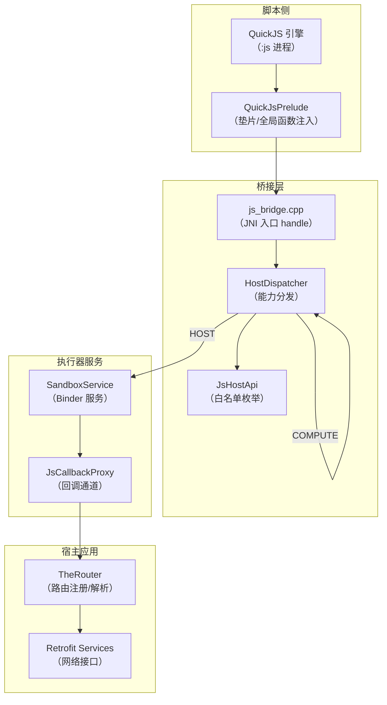
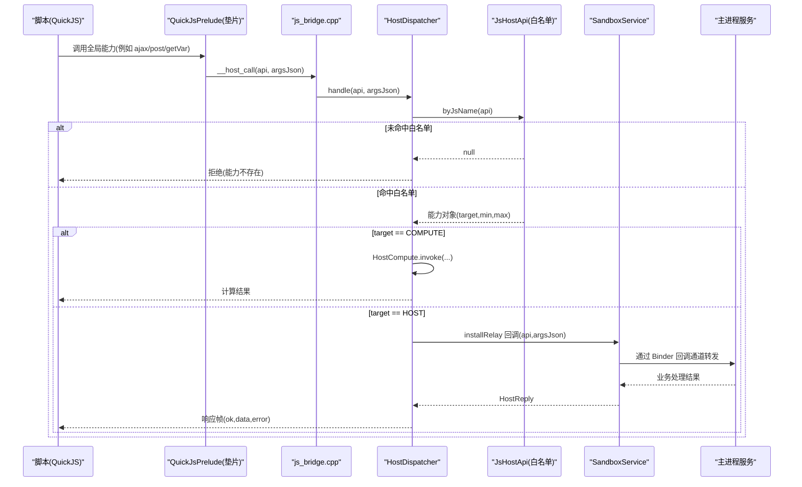
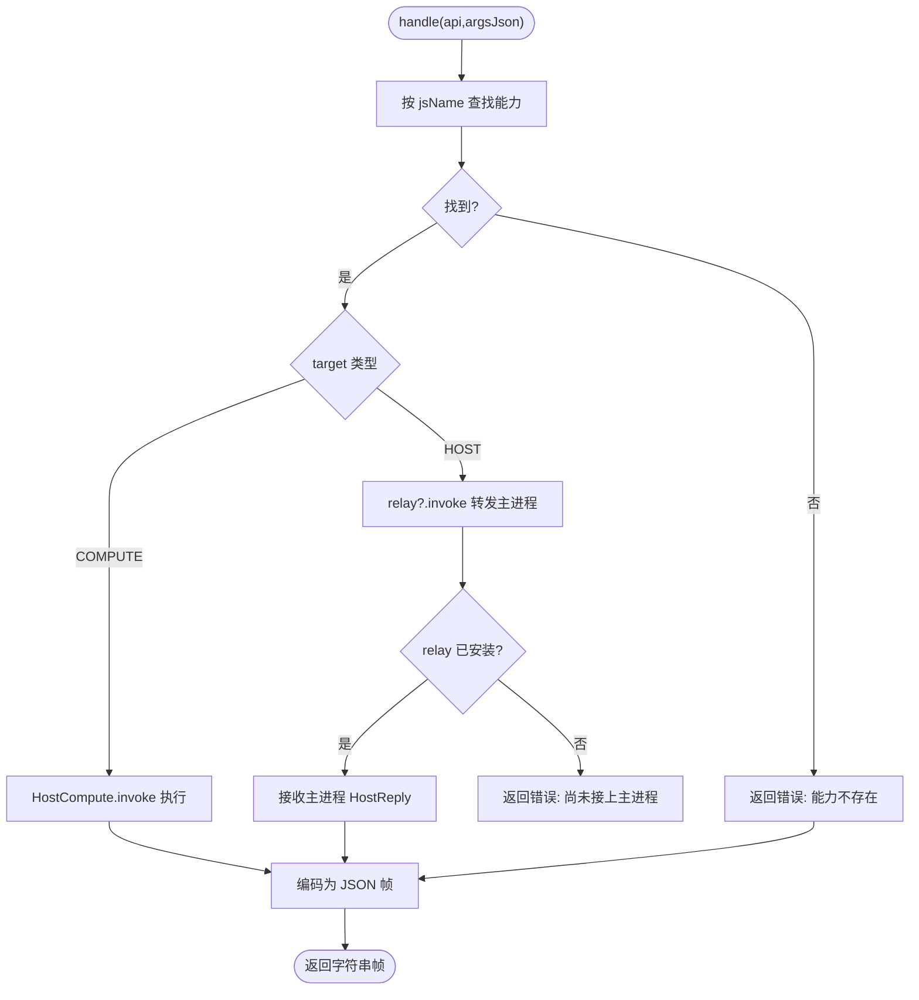
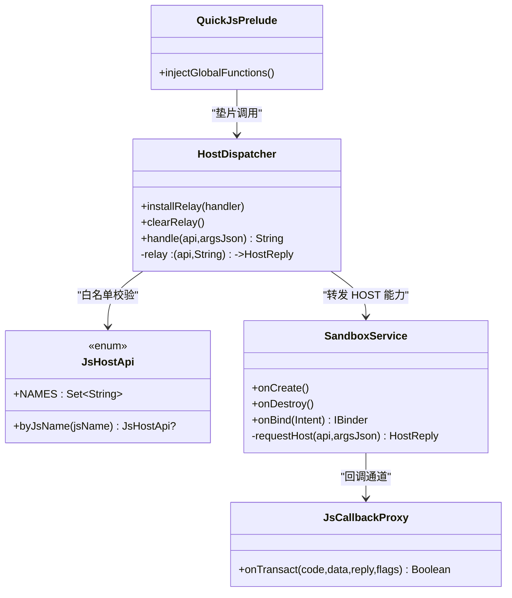

# API 注册机制

<cite>
**本文引用的文件**
- [HostDispatcher.kt](file://lib_book_source/src/main/java/com/ebook/source/sandbox/HostDispatcher.kt)
- [JsHostApi.kt](file://lib_book_source/src/main/java/com/ebook/source/script/JsHostApi.kt)
- [SandboxService.kt](file://lib_book_source/src/main/java/com/ebook/source/sandbox/SandboxService.kt)
- [QuickJsPrelude.kt](file://lib_book_source/src/main/java/com/ebook/source/sandbox/QuickJsPrelude.kt)
- [JsCallbackProxy.kt](file://lib_book_source/src/main/java/com/ebook/source/sandbox/JsCallbackProxy.kt)
- [HostCompute.kt](file://lib_book_source/src/main/java/com/ebook/source/sandbox/HostCompute.kt)
- [js_bridge.cpp](file://lib_book_source/src/main/cpp/bridge/js_bridge.cpp)
- [LoginActivity.kt](file://module_login/src/main/java/com/ebook/login/LoginActivity.kt)
- [routeMap.json（module_login）](file://module_login/src/main/assets/therouter/routeMap.json)
- [routeMap.json（module_find）](file://module_find/src/main/assets/therouter/routeMap.json)
- [routeMap.json（module_main）](file://module_main/src/main/assets/therouter/routeMap.json)
- [routeMap.json（module_me）](file://module_me/src/main/assets/therouter/routeMap.json)
- [routeMap.json（module_book）](file://module_book/src/main/assets/therouter/routeMap.json)
- [RetrofitBuilder.kt](file://lib_ebook_api/src/main/java/com/ebook/api/RetrofitBuilder.kt)
- [CommentService.kt](file://lib_ebook_api/src/main/java/com/ebook/api/service/comment/CommentService.kt)
- [ReleaseService.kt](file://lib_ebook_api/src/main/java/com/ebook/api/service/release/ReleaseService.kt)
- [UserService.kt](file://lib_ebook_api/src/main/java/com/ebook/api/service/user/UserService.kt)
- [BookSourceService.kt](file://lib_ebook_api/src/main/java/com/ebook/api/service/source/BookSourceService.kt)
</cite>

## 目录
1. [简介](#简介)
2. [项目结构](#项目结构)
3. [核心组件](#核心组件)
4. [架构总览](#架构总览)
5. [详细组件分析](#详细组件分析)
6. [依赖关系分析](#依赖关系分析)
7. [性能考量](#性能考量)
8. [故障排查指南](#故障排查指南)
9. [结论](#结论)
10. [附录：新 API 添加流程与规范](#附录新-api-添加流程与规范)

## 简介
本文面向“脚本沙箱能力注册”与“跨模块路由注册”两类 API 注册机制，系统性说明 HostDispatcher 的能力注册、动态扩展、API 发现、版本兼容、白名单管理、权限控制、调用路由、生命周期与热更新，并给出新增 API 的端到端流程与最佳实践。代码级内容以仓库内 lib_book_source 的沙箱执行器链路和 module_* 模块的 TheRouter 路由表为依据。

## 项目结构
本项目采用多模块架构：
- lib_book_source：脚本解析与沙箱执行器（QuickJS + JNI），提供 HostDispatcher 能力分发、白名单 JsHostApi、与主进程通信的 SandboxService。
- module_*：功能模块通过 TheRouter 的 @Route 注解声明页面路由，构建期生成 routeMap.json，运行时由路由框架解析跳转。
- lib_ebook_api：网络层服务定义（Retrofit Service），负责对外接口契约与服务装配。

图表来源
- [js_bridge.cpp](file://lib_book_source/src/main/cpp/bridge/js_bridge.cpp)
- [HostDispatcher.kt](file://lib_book_source/src/main/java/com/ebook/source/sandbox/HostDispatcher.kt)
- [JsHostApi.kt](file://lib_book_source/src/main/java/com/ebook/source/script/JsHostApi.kt)
- [SandboxService.kt](file://lib_book_source/src/main/java/com/ebook/source/sandbox/SandboxService.kt)
- [JsCallbackProxy.kt](file://lib_book_source/src/main/java/com/ebook/source/sandbox/JsCallbackProxy.kt)
- [QuickJsPrelude.kt](file://lib_book_source/src/main/java/com/ebook/source/sandbox/QuickJsPrelude.kt)
- [LoginActivity.kt](file://module_login/src/main/java/com/ebook/login/LoginActivity.kt)

章节来源
- [HostDispatcher.kt:1-74](file://lib_book_source/src/main/java/com/ebook/source/sandbox/HostDispatcher.kt#L1-L74)
- [JsHostApi.kt:1-115](file://lib_book_source/src/main/java/com/ebook/source/script/JsHostApi.kt#L1-L115)
- [SandboxService.kt:1-210](file://lib_book_source/src/main/java/com/ebook/source/sandbox/SandboxService.kt#L1-L210)
- [LoginActivity.kt:1-60](file://module_login/src/main/java/com/ebook/login/LoginActivity.kt#L1-L60)

## 核心组件
- HostDispatcher：脚本能力的唯一入口，负责白名单校验、计算型能力就地执行、宿主型能力转发到主进程。
- JsHostApi：能力白名单枚举，集中声明能力名、目标类型（COMPUTE/HOST）、参数上下限；NAMES/byJsName 作为唯一发现源。
- SandboxService：隔离进程中的 Binder 服务，负责协议版本校验、任务执行、将 host 调用回传到主进程。
- QuickJsPrelude：在脚本侧注入全局能力（垫片），使脚本可通过统一名称访问能力，同时维护别名映射。
- JsCallbackProxy：承载主进程对脚本的回调通道，配合 SandboxService 完成双向通信。
- Retrofit Services：网络层 API 契约定义（如 UserService、CommentService 等）。
- TheRouter + routeMap.json：跨模块页面路由注册与发现，构建期扫描 @Route 生成路由表。

章节来源
- [HostDispatcher.kt:24-74](file://lib_book_source/src/main/java/com/ebook/source/sandbox/HostDispatcher.kt#L24-L74)
- [JsHostApi.kt:17-110](file://lib_book_source/src/main/java/com/ebook/source/script/JsHostApi.kt#L17-L110)
- [SandboxService.kt:27-210](file://lib_book_source/src/main/java/com/ebook/source/sandbox/SandboxService.kt#L27-L210)
- [QuickJsPrelude.kt](file://lib_book_source/src/main/java/com/ebook/source/sandbox/QuickJsPrelude.kt)
- [JsCallbackProxy.kt](file://lib_book_source/src/main/java/com/ebook/source/sandbox/JsCallbackProxy.kt)
- [RetrofitBuilder.kt](file://lib_ebook_api/src/main/java/com/ebook/api/RetrofitBuilder.kt)
- [UserService.kt](file://lib_ebook_api/src/main/java/com/ebook/api/service/user/UserService.kt)
- [CommentService.kt](file://lib_ebook_api/src/main/java/com/ebook/api/service/comment/CommentService.kt)
- [ReleaseService.kt](file://lib_ebook_api/src/main/java/com/ebook/api/service/release/ReleaseService.kt)
- [BookSourceService.kt](file://lib_ebook_api/src/main/java/com/ebook/api/service/source/BookSourceService.kt)

## 架构总览
脚本侧通过 QuickJS 调用被注入的全局函数，这些函数最终通过 JNI 进入 Kotlin 的 HostDispatcher.handle。HostDispatcher 依据 JsHostApi 白名单进行能力发现与权限判定：
- COMPUTE：在沙箱进程内直接计算（哈希、编码、加密、时间等）。
- HOST：通过 SandboxService 经 Binder 把请求转发到主进程，由主进程的服务或业务逻辑处理后再返回结果。

跨模块路由方面，各功能模块使用 @Route 注解声明页面路径，构建期生成 routeMap.json，运行时由 TheRouter 根据路径解析跳转，实现模块解耦与动态发现。

图表来源
- [HostDispatcher.kt:47-73](file://lib_book_source/src/main/java/com/ebook/source/sandbox/HostDispatcher.kt#L47-L73)
- [JsHostApi.kt:103-110](file://lib_book_source/src/main/java/com/ebook/source/script/JsHostApi.kt#L103-L110)
- [SandboxService.kt:125-209](file://lib_book_source/src/main/java/com/ebook/source/sandbox/SandboxService.kt#L125-L209)
- [js_bridge.cpp](file://lib_book_source/src/main/cpp/bridge/js_bridge.cpp)

## 详细组件分析

### HostDispatcher 能力注册与分发
- 动态扩展点：通过 installRelay 在主进程为 HOST 类能力设置回调处理器；clearRelay 在 onDestroy 清理，避免僵尸引用。
- 能力发现：byJsName 仅允许白名单内的 jsName 可见；不在表中的能力在脚本侧不暴露，实现 deny-by-default。
- 版本兼容：能力名与目标类型在枚举中固定；如需废弃旧能力，应保留 jsName 但调整行为或迁移至新命名，并通过垫片别名过渡。
- 错误处理：异常一律就地捕获，区分 JsApiRejectedException（策略拒绝）与通用异常（JSON 非法/内核 OOM 等），返回结构化错误消息给脚本。

图表来源
- [HostDispatcher.kt:47-73](file://lib_book_source/src/main/java/com/ebook/source/sandbox/HostDispatcher.kt#L47-L73)

章节来源
- [HostDispatcher.kt:24-74](file://lib_book_source/src/main/java/com/ebook/source/sandbox/HostDispatcher.kt#L24-L74)

### 白名单管理与权限控制
- 静态注册表：JsHostApi 枚举集中定义所有可用能力，包含 jsName、target、minArgs/maxArgs；NAMES/byJsName 作为唯一发现入口。
- 运行时扩展点：通过 JsHostApi 增加新能力；HOST 类能力需在主进程安装 relay 回调（SandboxService 在 onCreate 时完成）。
- 权限控制策略：
  - 默认拒绝：未在表中的能力不可见。
  - 参数校验：minArgs/maxArgs 由 JS 垫片校验，避免内核侧拿到 undefined 导致的模糊失败。
  - 敏感能力限制：AJAX/POST/LOAD/COOKIE_* 等需经主进程受限代理，确保白名单 host、私网访问控制等安全策略生效。

章节来源
- [JsHostApi.kt:17-110](file://lib_book_source/src/main/java/com/ebook/source/script/JsHostApi.kt#L17-L110)
- [SandboxService.kt:125-135](file://lib_book_source/src/main/java/com/ebook/source/sandbox/SandboxService.kt#L125-L135)

### 动态扩展方式与 API 发现机制
- 动态扩展：新增能力只需在 JsHostApi 中登记；若为主进程能力，则在 SandboxService.onCreate 安装对应 relay；若为计算能力，直接在 HostCompute 中实现。
- API 发现：脚本侧通过 QuickJsPrelude 注入的统一名称访问能力；白名单 NAMES/byJsName 用于分发与一致性测试，保证脚本可发现的能力集合与分发一致。

章节来源
- [QuickJsPrelude.kt](file://lib_book_source/src/main/java/com/ebook/source/sandbox/QuickJsPrelude.kt)
- [JsHostApi.kt:103-110](file://lib_book_source/src/main/java/com/ebook/source/script/JsHostApi.kt#L103-L110)

### 版本兼容性管理
- 协议版本：SandboxService 在 onTransact 入口处校验协议版本，不一致则返回 UNAVAILABLE；避免新旧执行器/宿主混用导致帧解析错误。
- 能力版本：通过保留 jsName 并在实现层做兼容分支；废弃能力可在枚举中标记或逐步替换为新命名，配合垫片别名平滑过渡。

章节来源
- [SandboxService.kt:63-80](file://lib_book_source/src/main/java/com/ebook/source/sandbox/SandboxService.kt#L63-L80)

### API 调用的路由机制（跨模块页面路由）
- 静态注册表：每个模块在 assets/therouter/routeMap.json 中声明路由映射；该文件由 TheRouter 构建期扫描 @Route 生成。
- 运行时扩展：新增页面时添加 @Route(path=...)，重新构建后自动写入 routeMap.json，无需手动维护。
- 路由解析：运行时根据 path 解析到具体 Activity/页面，支持独立模式与集成模式的差异化路由占位（独立模式下缺失路由静默记录日志）。

章节来源
- [LoginActivity.kt:35-60](file://module_login/src/main/java/com/ebook/login/LoginActivity.kt#L35-L60)
- [routeMap.json（module_login）](file://module_login/src/main/assets/therouter/routeMap.json)
- [routeMap.json（module_find）](file://module_find/src/main/assets/therouter/routeMap.json)
- [routeMap.json（module_main）](file://module_main/src/main/assets/therouter/routeMap.json)
- [routeMap.json（module_me）](file://module_me/src/main/assets/therouter/routeMap.json)
- [routeMap.json（module_book）](file://module_book/src/main/assets/therouter/routeMap.json)

### API 的生命周期管理
- 初始化：SandboxService.onCreate 安装 HostDispatcher.relay；RetrofitBuilder 装配网络服务实例。
- 激活：脚本调用触发 HostDispatcher.handle，白名单通过后进入计算或宿主处理。
- 停用：SandboxService.onDestroy 清理 relay、移除 ThreadLocal 回调、关闭桥接层。
- 销毁：进程退出或 Binder 断开时，资源释放；主进程侧服务实例随应用生命周期管理。

章节来源
- [SandboxService.kt:125-135](file://lib_book_source/src/main/java/com/ebook/source/sandbox/SandboxService.kt#L125-L135)
- [RetrofitBuilder.kt](file://lib_ebook_api/src/main/java/com/ebook/api/RetrofitBuilder.kt)

### 配置管理与热更新机制
- 能力配置：JsHostApi 枚举为单一事实源，修改即影响所有脚本可发现的能力集合；无运行时配置文件。
- 路由配置：routeMap.json 由构建期生成，修改路由需重新构建；不支持运行时热插拔路由。
- 热更新建议：对于 HOST 类能力的主进程逻辑，可通过服务端配置或模块内开关实现行为热更；但能力表本身需发版更新。

章节来源
- [JsHostApi.kt:17-110](file://lib_book_source/src/main/java/com/ebook/source/script/JsHostApi.kt#L17-L110)
- [routeMap.json（module_login）](file://module_login/src/main/assets/therouter/routeMap.json)

## 依赖关系分析
- 松耦合设计：HostDispatcher 仅依赖 JsHostApi 白名单与 HostCompute；SandboxService 通过 Binder 与主进程解耦。
- 外部依赖：QuickJS 内核位于 third_party/quickjs；JNI 桥接层位于 cpp/bridge。
- 路由依赖：模块间通过 TheRouter 与 routeMap.json 解耦，避免直接 import 其他模块页面类。

图表来源
- [HostDispatcher.kt:24-74](file://lib_book_source/src/main/java/com/ebook/source/sandbox/HostDispatcher.kt#L24-L74)
- [JsHostApi.kt:17-110](file://lib_book_source/src/main/java/com/ebook/source/script/JsHostApi.kt#L17-L110)
- [SandboxService.kt:27-210](file://lib_book_source/src/main/java/com/ebook/source/sandbox/SandboxService.kt#L27-L210)
- [JsCallbackProxy.kt](file://lib_book_source/src/main/java/com/ebook/source/sandbox/JsCallbackProxy.kt)
- [QuickJsPrelude.kt](file://lib_book_source/src/main/java/com/ebook/source/sandbox/QuickJsPrelude.kt)

章节来源
- [HostDispatcher.kt:24-74](file://lib_book_source/src/main/java/com/ebook/source/sandbox/HostDispatcher.kt#L24-L74)
- [JsHostApi.kt:17-110](file://lib_book_source/src/main/java/com/ebook/source/script/JsHostApi.kt#L17-L110)
- [SandboxService.kt:27-210](file://lib_book_source/src/main/java/com/ebook/source/sandbox/SandboxService.kt#L27-L210)

## 性能考量
- 计算型能力就地执行，避免跨进程开销；HOST 类能力通过 Binder 传输，注意帧大小限制与序列化成本。
- 路由跳转为轻量级字符串匹配，routeMap.json 由构建期生成，运行时无额外开销。
- 避免在主线程调用沙箱；执行器客户端有主线程守卫，防止死锁。

## 故障排查指南
- 能力不存在：检查 JsHostApi 是否登记对应 jsName；确认脚本侧使用的名称与白名单一致。
- 主进程未受理：确认 SandboxService 已安装 relay；检查 onBind 是否在隔离进程运行。
- 协议版本不合：升级执行器或服务端，确保双方 PROTOCOL_VERSION 一致。
- 路由失效：检查 @Route 注解是否正确；重新构建以更新 routeMap.json；独立模式下缺失路由会静默记录日志。

章节来源
- [HostDispatcher.kt:52-73](file://lib_book_source/src/main/java/com/ebook/source/sandbox/HostDispatcher.kt#L52-L73)
- [SandboxService.kt:63-80](file://lib_book_source/src/main/java/com/ebook/source/sandbox/SandboxService.kt#L63-L80)
- [LoginActivity.kt:35-60](file://module_login/src/main/java/com/ebook/login/LoginActivity.kt#L35-L60)

## 结论
HostDispatcher 通过 JsHostApi 白名单实现严格的能力准入，结合 SandboxService 的 Binder 通道将宿主能力安全地委托给主进程。跨模块路由通过 TheRouter 与 routeMap.json 实现声明式注册与运行时解析，达到模块解耦与动态发现。整体设计遵循 deny-by-default、最小权限原则，具备清晰的版本兼容与生命周期管理能力。

## 附录：新 API 添加流程与规范

### 新增能力步骤
1. 接口定义：在 JsHostApi 中新增枚举项，指定 jsName、target、minArgs/maxArgs。
2. 实现开发：
   - COMPUTE：在 HostCompute 中实现计算逻辑。
   - HOST：在 SandboxService.onCreate 安装 relay 回调，主进程处理业务逻辑。
3. 安全审查：评估能力风险，必要时限制 host 白名单、私网访问、数据大小上限。
4. 测试验证：编写单元测试覆盖正常与异常路径；验证参数校验、错误消息、性能表现。
5. 文档更新：更新相关 ADR、规格文档、注释；确保 NAMES/byJsName 与实现一致。

### 新增页面路由步骤
1. 在模块中创建页面 Activity/Composable，添加 @Route(path=...) 注解。
2. 重新构建项目，确认 routeMap.json 已更新。
3. 在调用处使用 TheRouter 跳转；独立模式下补充占位路由以保证调试体验。

### 最佳实践
- 保持能力名稳定：避免频繁变更 jsName；如需废弃，使用垫片别名过渡。
- 严格参数校验：利用 minArgs/maxArgs 与垫片校验，避免内核侧模糊失败。
- 日志与错误：统一使用 Logger，错误消息清晰指向根因（参数错误 vs 内核错误）。
- 生命周期安全：确保 onDestroy 清理 relay、ThreadLocal、桥接资源。
- 路由解耦：优先使用 TheRouter 而非直接 import 其他模块页面类。

章节来源
- [JsHostApi.kt:17-110](file://lib_book_source/src/main/java/com/ebook/source/script/JsHostApi.kt#L17-L110)
- [HostDispatcher.kt:47-73](file://lib_book_source/src/main/java/com/ebook/source/sandbox/HostDispatcher.kt#L47-L73)
- [SandboxService.kt:125-209](file://lib_book_source/src/main/java/com/ebook/source/sandbox/SandboxService.kt#L125-L209)
- [LoginActivity.kt:35-60](file://module_login/src/main/java/com/ebook/login/LoginActivity.kt#L35-L60)