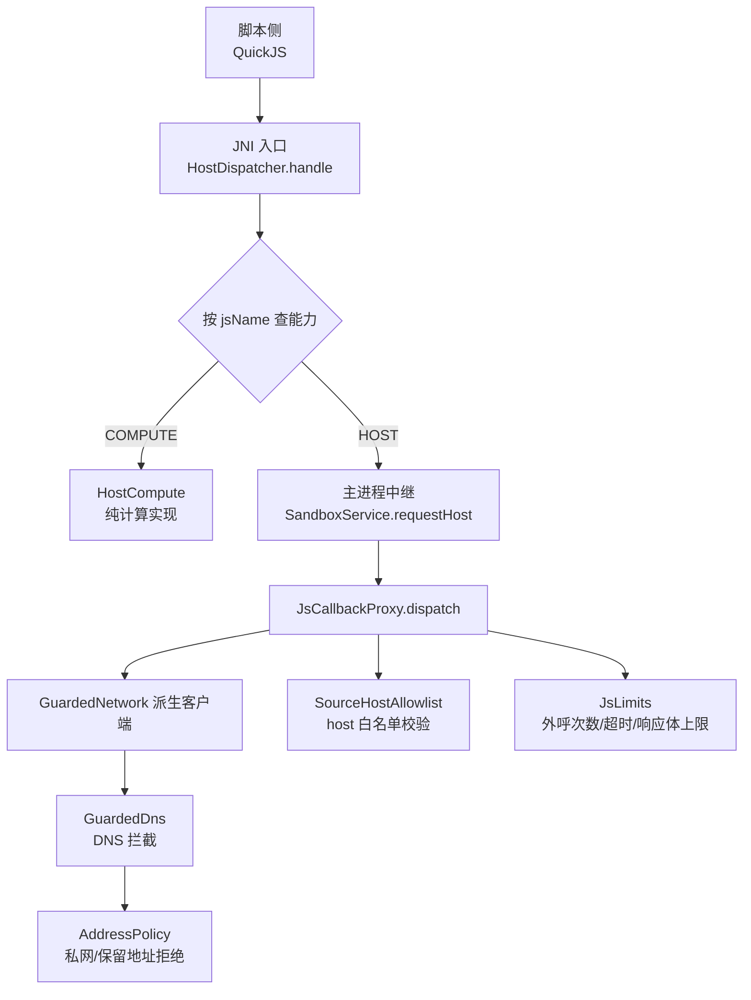
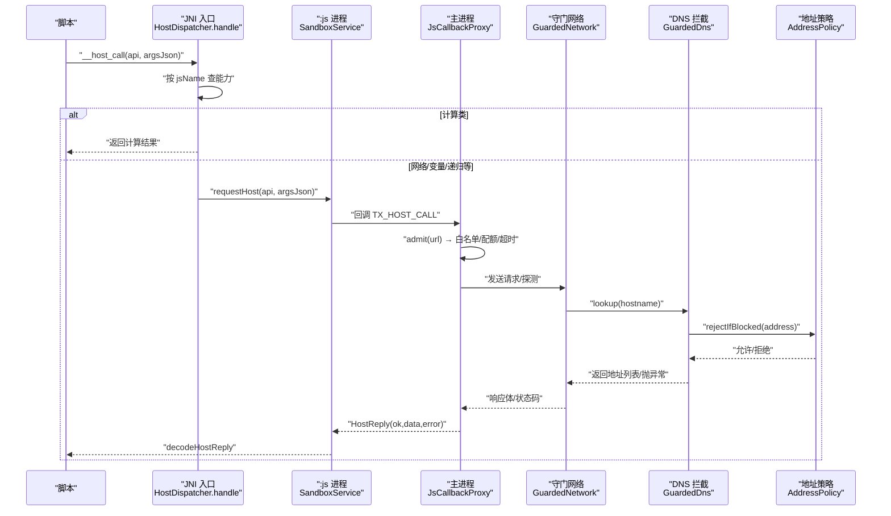
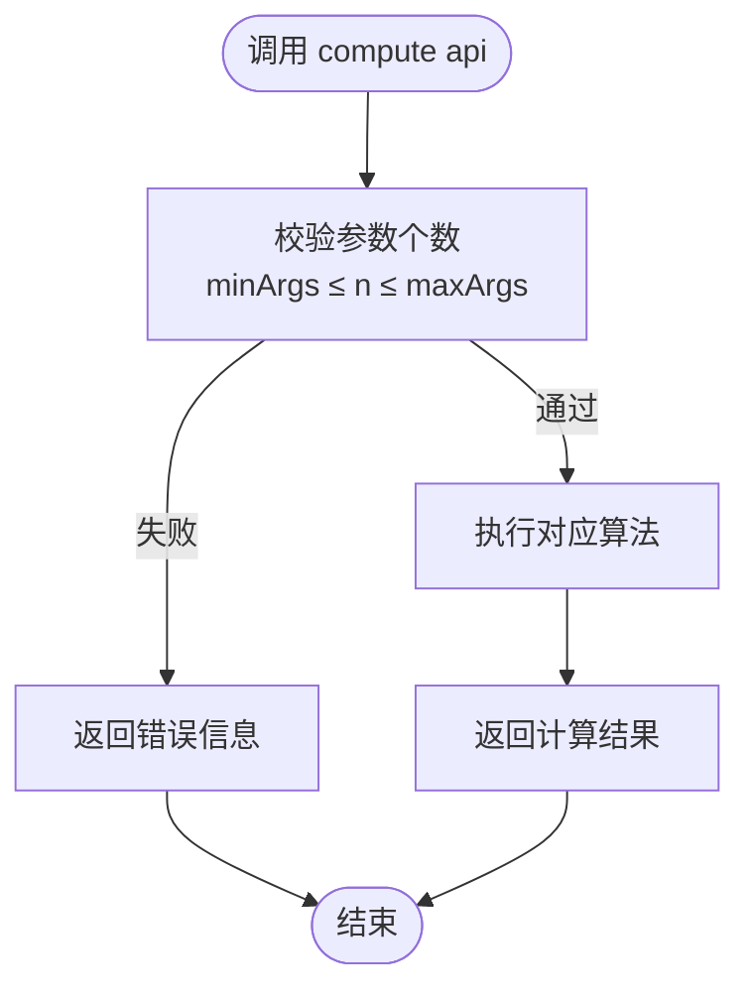
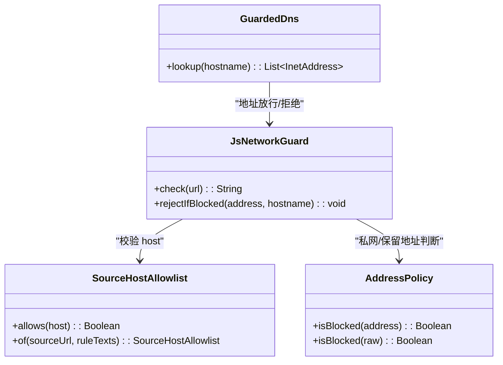
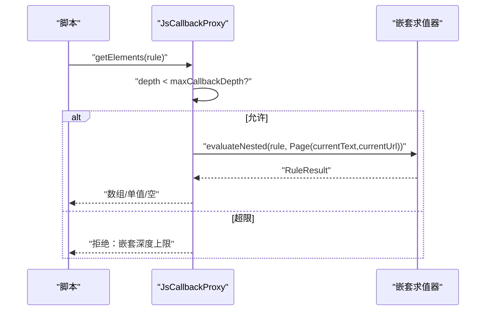
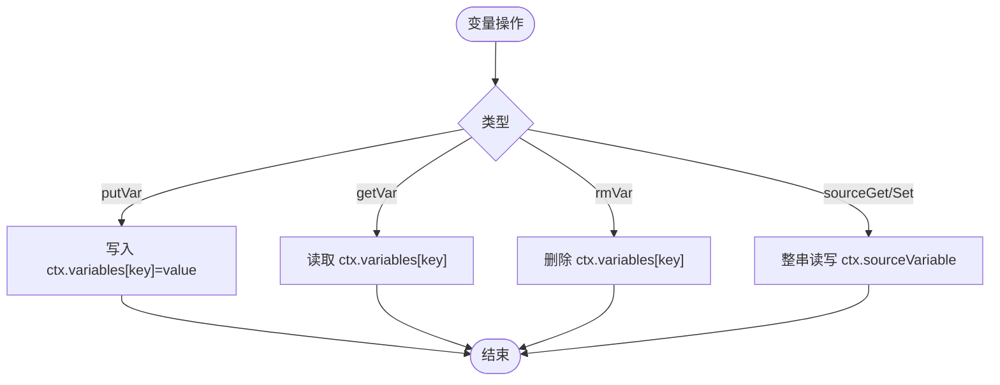
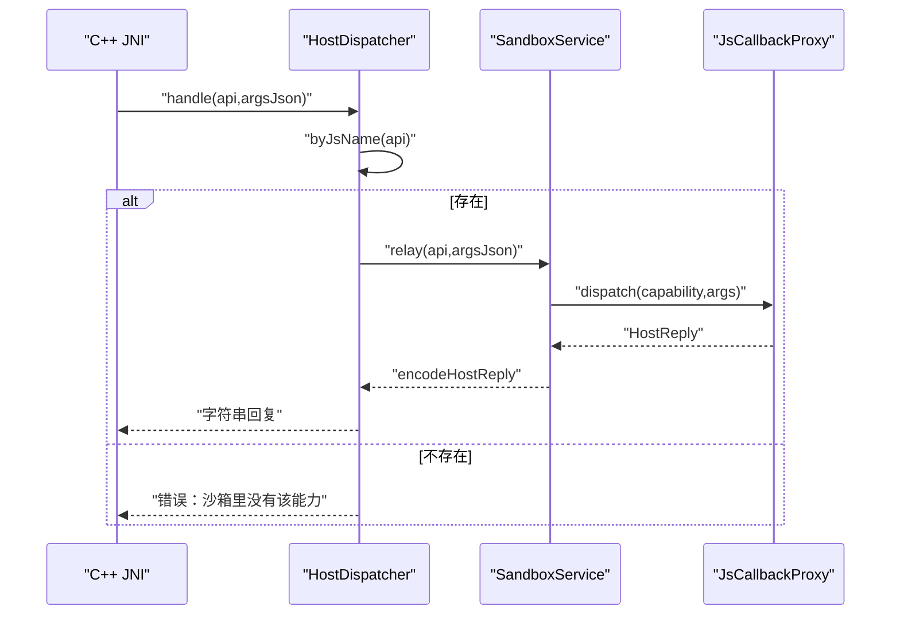
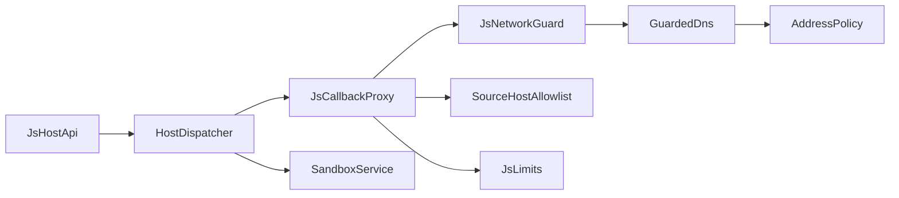

# Host API 白名单

<cite>
**本文引用的文件**
- [HostDispatcher.kt](file://lib_book_source/src/main/java/com/ebook/source/sandbox/HostDispatcher.kt)
- [JsHostApi.kt](file://lib_book_source/src/main/java/com/ebook/source/script/JsHostApi.kt)
- [JsNetworkGuard.kt](file://lib_book_source/src/main/java/com/ebook/source/sandbox/JsNetworkGuard.kt)
- [SourceHostAllowlist.kt](file://lib_book_source/src/main/java/com/ebook/source/sandbox/SourceHostAllowlist.kt)
- [JsCallbackProxy.kt](file://lib_book_source/src/main/java/com/ebook/source/sandbox/JsCallbackProxy.kt)
- [JsSandboxHost.kt](file://lib_book_source/src/main/java/com/ebook/source/sandbox/JsSandboxHost.kt)
- [SandboxService.kt](file://lib_book_source/src/main/java/com/ebook/source/sandbox/SandboxService.kt)
- [JsHostApiTest.kt](file://lib_book_source/src/test/java/com/ebook/source/sandbox/JsHostApiTest.kt)
</cite>

## 目录
1. [简介](#简介)
2. [项目结构](#项目结构)
3. [核心组件](#核心组件)
4. [架构总览](#架构总览)
5. [详细组件分析](#详细组件分析)
6. [依赖关系分析](#依赖关系分析)
7. [性能与限制](#性能与限制)
8. [故障排查](#故障排查)
9. [结论](#结论)
10. [附录：新能力安全审查流程](#附录新能力安全审查流程)

## 简介
本文件围绕“Host API 白名单”展开，系统性说明 deny-by-default（默认拒绝）的安全理念、最小权限原则以及在本仓中的落地方式。重点覆盖：
- 计算类白名单 API 的实现与安全边界（摘要、编码、对称加解密、时间等）。
- 网络类 API 的限制机制：守门客户端、URL 白名单、私网地址拒绝、大小/超时/限流控制。
- 递归求值回调通道的设计：嵌套层限制、JS 上下文关闭与安全边界保证。
- 变量存取回调的安全模型：跨嵌套层变量共享与页面基准快照传递。
- HostDispatcher 的能力注册机制与动态扩展方式。
- 新 API 添加的安全审查流程与风险评估方法。
- 白名单配置的调试与监控手段。

## 项目结构
Host API 白名单相关代码集中在 lib_book_source 模块的沙箱执行器与脚本解析层，关键路径如下：
- 能力表与目标分发：JsHostApi.kt、HostDispatcher.kt
- 网络守卫与 DNS 拦截：JsNetworkGuard.kt、GuardedDns
- 主进程回调代理与配额：JsCallbackProxy.kt
- 沙箱宿主装配面：JsSandboxHost.kt
- 隔离进程服务：SandboxService.kt
- 源级 host 白名单导出：SourceHostAllowlist.kt
- 一致性测试：JsHostApiTest.kt

图表来源
- [HostDispatcher.kt:24-73](file://lib_book_source/src/main/java/com/ebook/source/sandbox/HostDispatcher.kt#L24-L73)
- [JsHostApi.kt:17-110](file://lib_book_source/src/main/java/com/ebook/source/script/JsHostApi.kt#L17-L110)
- [JsNetworkGuard.kt:25-99](file://lib_book_source/src/main/java/com/ebook/source/sandbox/JsNetworkGuard.kt#L25-L99)
- [SourceHostAllowlist.kt:20-73](file://lib_book_source/src/main/java/com/ebook/source/sandbox/SourceHostAllowlist.kt#L20-L73)
- [JsCallbackProxy.kt:152-460](file://lib_book_source/src/main/java/com/ebook/source/sandbox/JsCallbackProxy.kt#L152-L460)
- [SandboxService.kt:125-209](file://lib_book_source/src/main/java/com/ebook/source/sandbox/SandboxService.kt#L125-L209)

章节来源
- [HostDispatcher.kt:24-73](file://lib_book_source/src/main/java/com/ebook/source/sandbox/HostDispatcher.kt#L24-L73)
- [JsHostApi.kt:17-110](file://lib_book_source/src/main/java/com/ebook/source/script/JsHostApi.kt#L17-L110)
- [JsNetworkGuard.kt:25-99](file://lib_book_source/src/main/java/com/ebook/source/sandbox/JsNetworkGuard.kt#L25-L99)
- [SourceHostAllowlist.kt:20-73](file://lib_book_source/src/main/java/com/ebook/source/sandbox/SourceHostAllowlist.kt#L20-L73)
- [JsCallbackProxy.kt:152-460](file://lib_book_source/src/main/java/com/ebook/source/sandbox/JsCallbackProxy.kt#L152-L460)
- [SandboxService.kt:125-209](file://lib_book_source/src/main/java/com/ebook/source/sandbox/SandboxService.kt#L125-L209)

## 核心组件
- JsHostApi：定义 Host API 白名单枚举，明确每个能力的脚本侧名称、目标（COMPUTE/HOST）、参数上下界。COMPUTE 在 :js 进程内完成；HOST 走主进程受限通道。
- HostDispatcher：C++ JNI 唯一入口，负责按脚本名查找能力并路由到 COMPUTE 或 HOST 中继。异常就地兜住，避免崩溃 :js 进程。
- JsCallbackProxy：主进程侧受理 HOST 回调的代理，维护任务级状态（请求计数、嵌套深度、当前页/URL），提供网络外呼、变量存取、cookie、日志、递归求值等能力。
- JsNetworkGuard + GuardedDns + AddressPolicy：URL 字符串层准入检查（协议、长度、host 合法性、白名单）+ DNS 解析时地址判定（拒绝私网/保留/不可路由地址）。
- SourceHostAllowlist：从书源 URL 与规则文本中导出可解析 host 白名单，默认严格、不放行子域。
- JsSandboxHost：主进程侧沙箱装配面，负责构造桥接对象、注入守护客户端与 cookie 罐，确保取体与探测共用同一份带守卫的客户端。
- SandboxService：隔离进程服务，处理执行帧与 host 回调中转，严格协议版本校验与字节上限保护。

章节来源
- [JsHostApi.kt:17-110](file://lib_book_source/src/main/java/com/ebook/source/script/JsHostApi.kt#L17-L110)
- [HostDispatcher.kt:24-73](file://lib_book_source/src/main/java/com/ebook/source/sandbox/HostDispatcher.kt#L24-L73)
- [JsCallbackProxy.kt:105-460](file://lib_book_source/src/main/java/com/ebook/source/sandbox/JsCallbackProxy.kt#L105-L460)
- [JsNetworkGuard.kt:25-167](file://lib_book_source/src/main/java/com/ebook/source/sandbox/JsNetworkGuard.kt#L25-L167)
- [SourceHostAllowlist.kt:20-73](file://lib_book_source/src/main/java/com/ebook/source/sandbox/SourceHostAllowlist.kt#L20-L73)
- [JsSandboxHost.kt:21-59](file://lib_book_source/src/main/java/com/ebook/source/sandbox/JsSandboxHost.kt#L21-L59)
- [SandboxService.kt:27-209](file://lib_book_source/src/main/java/com/ebook/source/sandbox/SandboxService.kt#L27-L209)

## 架构总览
Host API 调用路径分两条：
- 计算类（COMPUTE）：在 :js 进程内直接执行，不经过主进程，减少跨进程开销与攻击面。
- 网络/会话/变量/递归求值（HOST）：经 SandboxService 中继到主进程的 JsCallbackProxy，统一受限于白名单、DNS 拦截、配额与时限。

图表来源
- [HostDispatcher.kt:47-73](file://lib_book_source/src/main/java/com/ebook/source/sandbox/HostDispatcher.kt#L47-L73)
- [SandboxService.kt:165-209](file://lib_book_source/src/main/java/com/ebook/source/sandbox/SandboxService.kt#L165-L209)
- [JsCallbackProxy.kt:152-300](file://lib_book_source/src/main/java/com/ebook/source/sandbox/JsCallbackProxy.kt#L152-L300)
- [JsNetworkGuard.kt:25-99](file://lib_book_source/src/main/java/com/ebook/source/sandbox/JsNetworkGuard.kt#L25-L99)

## 详细组件分析

### 计算类白名单 API（COMPUTE）
- 能力范围：摘要（md5/sha1/sha256）、编码（base64/hex/uri）、对称加解密（aes/des）、通用工具（randomUUID/digestHex/hmacBase64/symmetricCrypto/bytesToStr）、时间（timestamp/formatDate）。
- 安全特性：
  - 全部在 :js 进程内计算，不走主进程，避免泄露上下文与绕过网络守卫。
  - 参数个数由 JsHostApi 的 minArgs/maxArgs 约束，JsCallbackProxy 再次校验，防止越界访问与误用。
  - 所有计算能力通过 QuickJS 预加载暴露给脚本全局，但仅白名单内的名称可见。

图表来源
- [JsHostApi.kt:23-53](file://lib_book_source/src/main/java/com/ebook/source/script/JsHostApi.kt#L23-L53)
- [JsCallbackProxy.kt:449-460](file://lib_book_source/src/main/java/com/ebook/source/sandbox/JsCallbackProxy.kt#L449-L460)

章节来源
- [JsHostApi.kt:23-53](file://lib_book_source/src/main/java/com/ebook/source/script/JsHostApi.kt#L23-L53)
- [JsCallbackProxy.kt:449-460](file://lib_book_source/src/main/java/com/ebook/source/sandbox/JsCallbackProxy.kt#L449-L460)

### 网络类 API 的限制机制
- 白名单 host 导出：从书源自身 URL 与规则文本中提取绝对 URL 的 host，归一化后构成白名单。默认严格，不放行子域。
- URL 准入：强制 http(s)、长度上限、禁止内嵌凭证、host 合法字符集校验。
- DNS 拦截：在 OkHttp 真正解析时检查每个 IP，拒绝私网/保留/不可路由地址。
- 配额与时限：每任务外呼次数上限、单次回调响应体大小上限、整体超时限制。
- HEAD 探测：responseCode 对目标 URL 探一次状态码，复用准入与配额逻辑。

图表来源
- [JsNetworkGuard.kt:25-167](file://lib_book_source/src/main/java/com/ebook/source/sandbox/JsNetworkGuard.kt#L25-L167)
- [SourceHostAllowlist.kt:20-73](file://lib_book_source/src/main/java/com/ebook/source/sandbox/SourceHostAllowlist.kt#L20-L73)

章节来源
- [JsNetworkGuard.kt:25-167](file://lib_book_source/src/main/java/com/ebook/source/sandbox/JsNetworkGuard.kt#L25-L167)
- [SourceHostAllowlist.kt:20-73](file://lib_book_source/src/main/java/com/ebook/source/sandbox/SourceHostAllowlist.kt#L20-L73)
- [JsCallbackProxy.kt:247-300](file://lib_book_source/src/main/java/com/ebook/source/sandbox/JsCallbackProxy.kt#L247-L300)

### 递归求值回调通道设计
- 嵌套深度限制：depth 计数器与 limits.maxCallbackDepth 共同限制嵌套层级，防止无限递归。
- JS 上下文关闭：evaluateNested 必须接收一个已关闭外层 JS 的求值器，避免死锁。
- 页面基准快照：currentText/currentUrl 作为 getElements/getElement/queryString 的输入基线，支持 setContent 显式切换基准。
- 结果形态：根据 accessor 决定返回列表或单值，未命中返回空集合/null，解失败返回错误消息而非静默空结果。

图表来源
- [JsCallbackProxy.kt:413-430](file://lib_book_source/src/main/java/com/ebook/source/sandbox/JsCallbackProxy.kt#L413-L430)
- [JsCallbackProxy.kt:371-375](file://lib_book_source/src/main/java/com/ebook/source/sandbox/JsCallbackProxy.kt#L371-L375)

章节来源
- [JsCallbackProxy.kt:413-430](file://lib_book_source/src/main/java/com/ebook/source/sandbox/JsCallbackProxy.kt#L413-L430)
- [JsCallbackProxy.kt:371-375](file://lib_book_source/src/main/java/com/ebook/source/sandbox/JsCallbackProxy.kt#L371-L375)

### 变量存取回调的安全模型
- 作用域：变量存在于 EvalContext.variables，生命周期为单次解析任务，避免跨任务泄漏。
- 写入/读取：putVar/getVar/rmVar 在 JsCallbackProxy.dispatch 中统一处理，元数校验保障参数正确性。
- 源级变量：sourceGetVariable/sourceSetVariable 整串读写，用于源级会话或配置，与按键变量区分。
- 页面基准：setContent 可更新 currentText/currentUrl，供后续规则求值定位到指定页。

图表来源
- [JsCallbackProxy.kt:206-233](file://lib_book_source/src/main/java/com/ebook/source/sandbox/JsCallbackProxy.kt#L206-L233)
- [JsCallbackProxy.kt:434-437](file://lib_book_source/src/main/java/com/ebook/source/sandbox/JsCallbackProxy.kt#L434-L437)

章节来源
- [JsCallbackProxy.kt:206-233](file://lib_book_source/src/main/java/com/ebook/source/sandbox/JsCallbackProxy.kt#L206-L233)
- [JsCallbackProxy.kt:434-437](file://lib_book_source/src/main/java/com/ebook/source/sandbox/JsCallbackProxy.kt#L434-L437)

### HostDispatcher 能力注册与动态扩展
- 能力表：JsHostApi 枚举集中声明所有可用能力及其元数，是白名单的唯一事实源。
- 分发逻辑：HostDispatcher.handle 按脚本侧 jsName 查能力，未知名直接拒绝。
- 中继安装：SandboxService.onCreate 安装 HostDispatcher.relay，将 HOST 能力转发至主进程。
- 动态扩展：新增能力只需在 JsHostApi 增加条目并确保脚本侧预加载与分发一致，无需改动 C++ 层。

图表来源
- [HostDispatcher.kt:47-73](file://lib_book_source/src/main/java/com/ebook/source/sandbox/HostDispatcher.kt#L47-L73)
- [SandboxService.kt:125-129](file://lib_book_source/src/main/java/com/ebook/source/sandbox/SandboxService.kt#L125-L129)
- [JsCallbackProxy.kt:152-239](file://lib_book_source/src/main/java/com/ebook/source/sandbox/JsCallbackProxy.kt#L152-L239)

章节来源
- [HostDispatcher.kt:47-73](file://lib_book_source/src/main/java/com/ebook/source/sandbox/HostDispatcher.kt#L47-L73)
- [SandboxService.kt:125-129](file://lib_book_source/src/main/java/com/ebook/source/sandbox/SandboxService.kt#L125-L129)
- [JsCallbackProxy.kt:152-239](file://lib_book_source/src/main/java/com/ebook/source/sandbox/JsCallbackProxy.kt#L152-L239)

## 依赖关系分析
- 低耦合：JsHostApi 仅定义能力与元数，不参与执行；HostDispatcher 仅做分发；JsCallbackProxy 专注任务级状态与业务逻辑。
- 强约束：网络路径统一经 GuardedNetwork/GuardedDns/AddressPolicy，避免绕过；白名单由 SourceHostAllowlist 统一导出。
- 测试保障：JsHostApiTest 确保能力表与脚本预加载的一致性，防止静默能力缺失或多余。

图表来源
- [JsHostApi.kt:17-110](file://lib_book_source/src/main/java/com/ebook/source/script/JsHostApi.kt#L17-L110)
- [HostDispatcher.kt:24-73](file://lib_book_source/src/main/java/com/ebook/source/sandbox/HostDispatcher.kt#L24-L73)
- [JsCallbackProxy.kt:105-460](file://lib_book_source/src/main/java/com/ebook/source/sandbox/JsCallbackProxy.kt#L105-L460)
- [JsNetworkGuard.kt:25-167](file://lib_book_source/src/main/java/com/ebook/source/sandbox/JsNetworkGuard.kt#L25-L167)
- [SourceHostAllowlist.kt:20-73](file://lib_book_source/src/main/java/com/ebook/source/sandbox/SourceHostAllowlist.kt#L20-L73)

章节来源
- [JsHostApiTest.kt:125-331](file://lib_book_source/src/test/java/com/ebook/source/sandbox/JsHostApiTest.kt#L125-L331)

## 性能与限制
- 计算类 API：无网络 IO，延迟低，适合高频使用。
- 网络类 API：
  - 每次请求前进行字符串层检查，避免无效请求进入网络栈。
  - DNS 解析时统一拦截，避免多次解析差异导致的重绑攻击。
  - 配额与时限保护：maxRequestsPerTask、maxHostReplyBytes、wallClockMs 防止资源耗尽。
- 递归求值：maxCallbackDepth 限制嵌套层级，避免深递归导致栈溢出或性能退化。

[本节为通用性能讨论，不直接分析具体文件]

## 故障排查
常见错误与处置：
- “沙箱里没有该能力”：脚本侧调用了未在 JsHostApi 登记的能力，需检查能力表与预加载一致性。
- “URL 长度超上限/协议非法/host 非法”：检查 URL 构造逻辑，确保符合 http(s)、长度限制与 host 字符集。
- “host 不在白名单内”：确认源规则是否包含该 host，或是否需要放宽白名单（谨慎评估风险）。
- “拒绝访问内网/保留地址”：确认目标地址是否为公网，避免误配本地调试地址。
- “本轮任务已用满外呼上限”：优化脚本请求频率，合并请求或减少冗余调用。
- “响应体过大”：检查分页逻辑，避免一次性拉取整站内容。
- “嵌套规则求值已到深度上限”：重构规则链，减少深层嵌套，拆分复杂逻辑。

章节来源
- [HostDispatcher.kt:52-73](file://lib_book_source/src/main/java/com/ebook/source/sandbox/HostDispatcher.kt#L52-L73)
- [JsCallbackProxy.kt:247-300](file://lib_book_source/src/main/java/com/ebook/source/sandbox/JsCallbackProxy.kt#L247-L300)
- [JsNetworkGuard.kt:35-70](file://lib_book_source/src/main/java/com/ebook/source/sandbox/JsNetworkGuard.kt#L35-L70)

## 结论
本仓库通过 deny-by-default 的最小权限原则，构建了安全的 Host API 白名单体系。计算类能力在沙箱内执行，网络类能力通过守门客户端与 DNS 拦截严格控制，变量与递归求值具备明确的作用域与深度限制。能力表与脚本预加载的一致性由测试保障，新增能力需遵循安全审查流程。整体设计兼顾安全性、可维护性与可扩展性。

[本节为总结性内容，不直接分析具体文件]

## 附录：新能力安全审查流程
新增 Host API 时的步骤：
1. 在 JsHostApi 中登记能力，明确 jsName、target、minArgs/maxArgs。
2. 在脚本预加载中暴露能力，确保名称与元数一致。
3. 如需网络能力，确保通过 GuardedNetwork 派生客户端，复用白名单与 DNS 拦截。
4. 如涉及变量或递归求值，明确作用域与深度限制，避免跨任务泄漏。
5. 编写单元测试，覆盖正常路径与拒绝路径。
6. 运行 JsHostApiTest 确保能力表与预加载一致。
7. 评估风险：是否引入敏感数据访问、是否可能绕过现有防护、是否影响性能。
8. 提交评审，记录决策依据与回滚方案。

[本节为流程性内容，不直接分析具体文件]