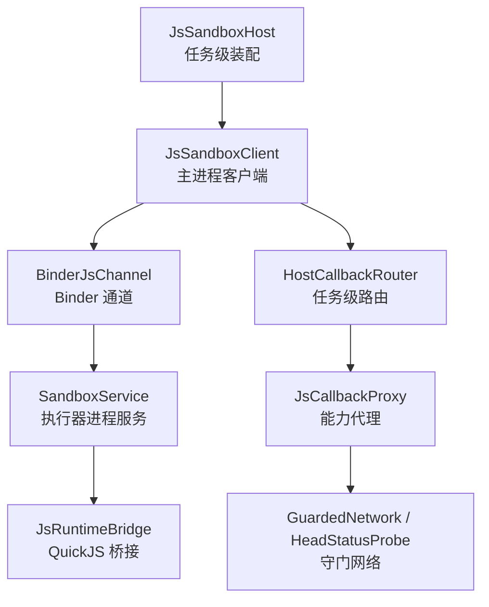
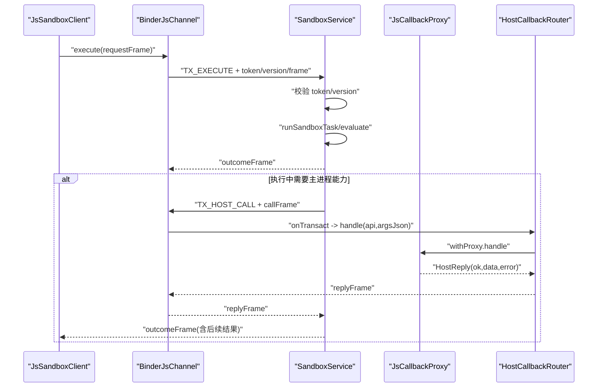
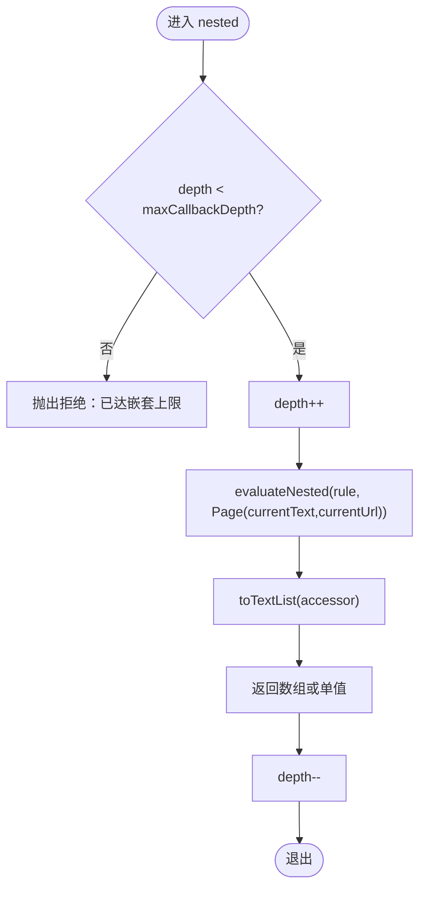
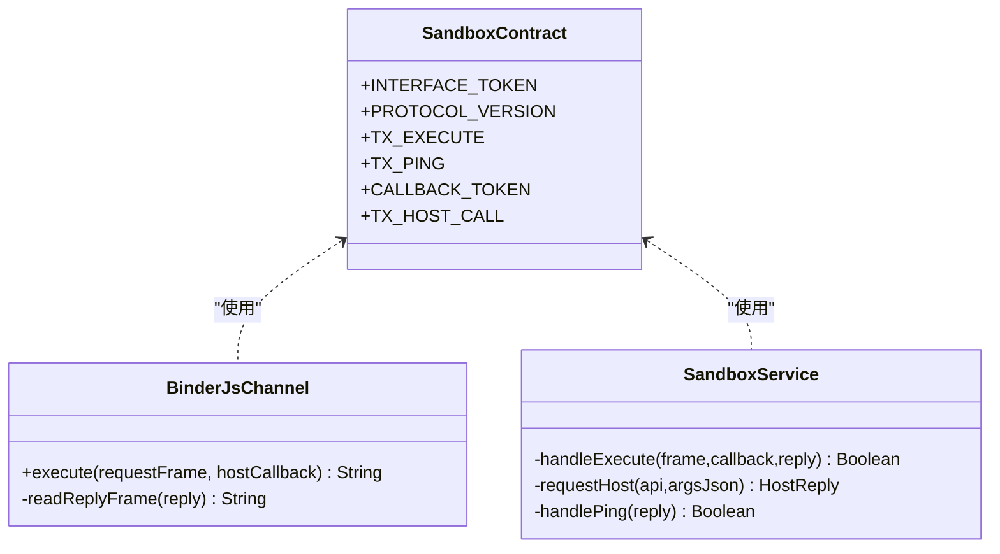
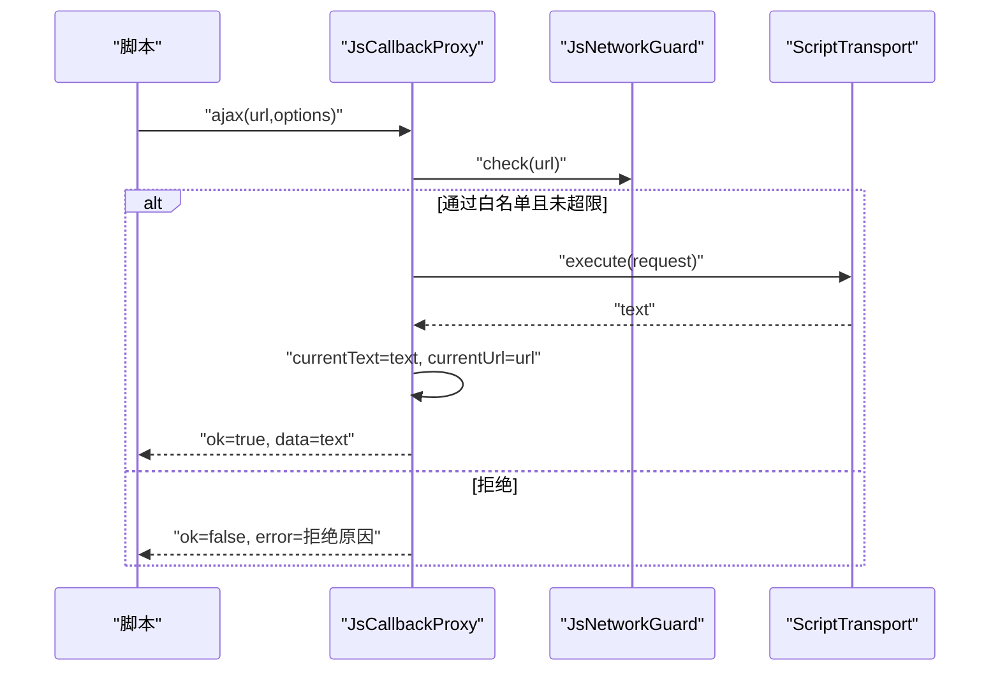
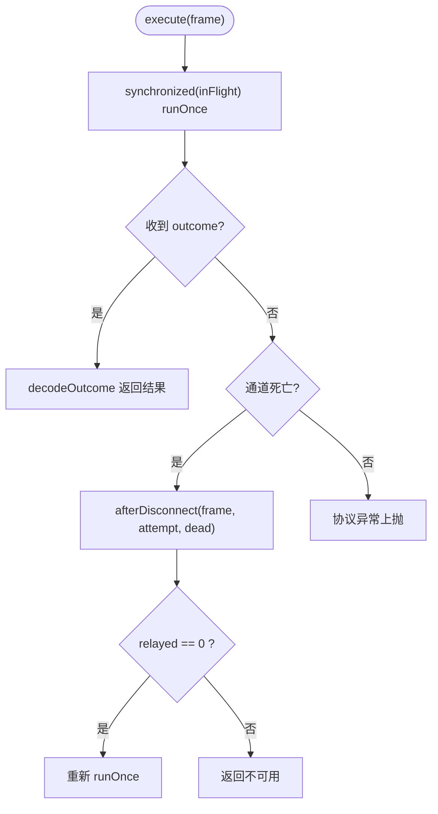
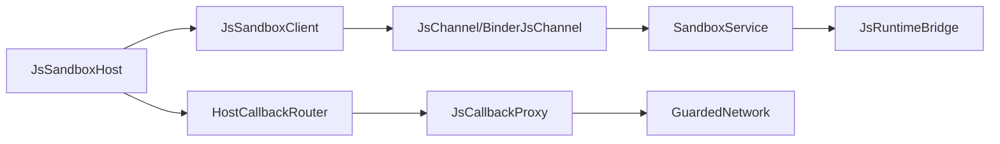

# 回调通道安全

<cite>
**本文引用的文件**
- [JsSandboxClient.kt](file://lib_book_source/src/main/java/com/ebook/source/sandbox/JsSandboxClient.kt)
- [BinderJsChannel.kt](file://lib_book_source/src/main/java/com/ebook/source/sandbox/BinderJsChannel.kt)
- [JsCallbackProxy.kt](file://lib_book_source/src/main/java/com/ebook/source/sandbox/JsCallbackProxy.kt)
- [SandboxContract.kt](file://lib_book_source/src/main/java/com/ebook/source/sandbox/SandboxContract.kt)
- [JsLimits.kt](file://lib_book_source/src/main/java/com/ebook/source/sandbox/JsLimits.kt)
- [JsSandboxHost.kt](file://lib_book_source/src/main/java/com/ebook/source/sandbox/JsSandboxHost.kt)
- [SandboxService.kt](file://lib_book_source/src/main/java/com/ebook/source/sandbox/SandboxService.kt)
- [SandboxProcess.kt](file://lib_book_source/src/main/java/com/ebook/source/sandbox/SandboxProcess.kt)
- [JsChannel.kt](file://lib_book_source/src/main/java/com/ebook/source/sandbox/JsChannel.kt)
</cite>

## 目录
1. [简介](#简介)
2. [项目结构](#项目结构)
3. [核心组件](#核心组件)
4. [架构总览](#架构总览)
5. [详细组件分析](#详细组件分析)
6. [依赖关系分析](#依赖关系分析)
7. [性能考量](#性能考量)
8. [故障排查指南](#故障排查指南)
9. [结论](#结论)
10. [附录](#附录)

## 简介
本文件聚焦“回调通道安全”，围绕跨进程脚本执行的安全边界展开，覆盖以下主题：
- 递归求值回调通道的深度限制、JS 上下文关闭机制与安全边界保证
- 跨进程通信的安全模型：执行器进程与主进程的隔离、binder 线程池使用、异步回调的线程管理
- 变量存取回调的安全控制：跨嵌套层变量共享、页面基准快照传递、状态同步策略
- 回调通道的资源管理：内存泄漏防护、生命周期管理、异常恢复
- 安全边界的实现：进程间通信的数据序列化、类型安全检查、权限控制
- 调试工具与性能监控方法

## 项目结构
与回调通道安全直接相关的代码集中在 lib_book_source 的沙箱子系统，包含客户端（主进程侧）、通道实现（Binder）、协议契约、限制配置、宿主装配与服务端（执行器进程）等。

图表来源
- [JsSandboxHost.kt:21-60](file://lib_book_source/src/main/java/com/ebook/source/sandbox/JsSandboxHost.kt#L21-L60)
- [JsSandboxClient.kt:35-99](file://lib_book_source/src/main/java/com/ebook/source/sandbox/JsSandboxClient.kt#L35-L99)
- [BinderJsChannel.kt:20-85](file://lib_book_source/src/main/java/com/ebook/source/sandbox/BinderJsChannel.kt#L20-L85)
- [SandboxService.kt:27-136](file://lib_book_source/src/main/java/com/ebook/source/sandbox/SandboxService.kt#L27-L136)
- [JsCallbackProxy.kt:105-460](file://lib_book_source/src/main/java/com/ebook/source/sandbox/JsCallbackProxy.kt#L105-L460)

章节来源
- [JsSandboxClient.kt:35-99](file://lib_book_source/src/main/java/com/ebook/source/sandbox/JsSandboxClient.kt#L35-L99)
- [BinderJsChannel.kt:20-85](file://lib_book_source/src/main/java/com/ebook/source/sandbox/BinderJsChannel.kt#L20-L85)
- [SandboxContract.kt:13-47](file://lib_book_source/src/main/java/com/ebook/source/sandbox/SandboxContract.kt#L13-L47)
- [JsLimits.kt:13-58](file://lib_book_source/src/main/java/com/ebook/source/sandbox/JsLimits.kt#L13-L58)
- [JsSandboxHost.kt:21-60](file://lib_book_source/src/main/java/com/ebook/source/sandbox/JsSandboxHost.kt#L21-L60)
- [SandboxService.kt:27-136](file://lib_book_source/src/main/java/com/ebook/source/sandbox/SandboxService.kt#L27-L136)
- [SandboxProcess.kt:23-28](file://lib_book_source/src/main/java/com/ebook/source/sandbox/SandboxProcess.kt#L23-L28)
- [JsChannel.kt:7-37](file://lib_book_source/src/main/java/com/ebook/source/sandbox/JsChannel.kt#L7-L37)

## 核心组件
- JsSandboxClient：主进程侧沙箱客户端，负责串行化 execute、超时计算、host 回调中继、重连重放与自伤防护（主线程守卫、嵌套调用保护）。
- BinderJsChannel：基于 Binder 的通道实现，封装一次事务一帧的请求/响应与反向 host 回调通道。
- HostCallbackRouter：将每次解析任务的回调处理器注入到客户端，确保“同一时刻只有一个任务在飞”。
- JsCallbackProxy：受理脚本对主进程能力的调用（网络、变量、内容基准、日志、cookie），并进行准入、限流、大小限制、递归深度限制。
- SandboxService：执行器进程服务，负责接收 execute、校验协议版本、转发 host 调用回主进程、探活 ping。
- SandboxContract：定义接口标识、协议版本、事务码，是线上形态的唯一事实源。
- JsLimits：集中定义沙箱资源限制（挂钟、堆、栈、请求/响应大小、回调深度、绑定超时、每任务请求数）。
- SandboxProcess：判断当前是否运行在系统隔离进程中，作为安全门控。
- JsSandboxHost：装配面，提供任务级 bridgeFor 与 call，把客户端、传输、守卫、cookie 等组装起来。

章节来源
- [JsSandboxClient.kt:35-99](file://lib_book_source/src/main/java/com/ebook/source/sandbox/JsSandboxClient.kt#L35-L99)
- [BinderJsChannel.kt:20-85](file://lib_book_source/src/main/java/com/ebook/source/sandbox/BinderJsChannel.kt#L20-L85)
- [JsCallbackProxy.kt:105-460](file://lib_book_source/src/main/java/com/ebook/source/sandbox/JsCallbackProxy.kt#L105-L460)
- [SandboxService.kt:27-136](file://lib_book_source/src/main/java/com/ebook/source/sandbox/SandboxService.kt#L27-L136)
- [SandboxContract.kt:13-47](file://lib_book_source/src/main/java/com/ebook/source/sandbox/SandboxContract.kt#L13-L47)
- [JsLimits.kt:13-58](file://lib_book_source/src/main/java/com/ebook/source/sandbox/JsLimits.kt#L13-L58)
- [SandboxProcess.kt:23-28](file://lib_book_source/src/main/java/com/ebook/source/sandbox/SandboxProcess.kt#L23-L28)
- [JsSandboxHost.kt:21-60](file://lib_book_source/src/main/java/com/ebook/source/sandbox/JsSandboxHost.kt#L21-L60)

## 架构总览
下图展示了主进程与执行器进程之间的双向通道、协议校验、回调路由与资源限制点。

图表来源
- [BinderJsChannel.kt:41-65](file://lib_book_source/src/main/java/com/ebook/source/sandbox/BinderJsChannel.kt#L41-L65)
- [BinderJsChannel.kt:93-132](file://lib_book_source/src/main/java/com/ebook/source/sandbox/BinderJsChannel.kt#L93-L132)
- [SandboxService.kt:63-98](file://lib_book_source/src/main/java/com/ebook/source/sandbox/SandboxService.kt#L63-L98)
- [SandboxService.kt:165-209](file://lib_book_source/src/main/java/com/ebook/source/sandbox/SandboxService.kt#L165-L209)
- [JsCallbackProxy.kt:152-177](file://lib_book_source/src/main/java/com/ebook/source/sandbox/JsCallbackProxy.kt#L152-L177)
- [JsSandboxHost.kt:29-31](file://lib_book_source/src/main/java/com/ebook/source/sandbox/JsSandboxHost.kt#L29-L31)

## 详细组件分析

### 递归求值回调通道与嵌套层限制
- 深度限制：JsCallbackProxy 维护 depth，并在 nested 入口进行 depth >= limits.maxCallbackDepth 的拒绝；同时通过 evaluateNested 传入“已关闭 JS”的求值口，避免死锁。
- 嵌套入口：JsSandboxClient 在回调期间用 ThreadLocal<int> 记录 insideHostCall，若再次发起 execute，直接返回不可用，防止双向死锁。
- 上下文关闭：JsCallbackProxy 的作用域是一次解析任务；currentText/currentUrl 仅在该任务内有效；EvalContext.variables/sourceVariable 由任务上下文持有，随任务结束释放。
- 页面基准快照：send/setContent/queryString/getElements 等均基于 currentText/currentUrl 进行定位与求值；setC on tent 可显式设置基准而不推进 URL（相对地址落位依赖 URL）。

图表来源
- [JsCallbackProxy.kt:413-430](file://lib_book_source/src/main/java/com/ebook/source/sandbox/JsCallbackProxy.kt#L413-L430)
- [JsSandboxClient.kt:65-73](file://lib_book_source/src/main/java/com/ebook/source/sandbox/JsSandboxClient.kt#L65-L73)
- [JsLimits.kt:43-44](file://lib_book_source/src/main/java/com/ebook/source/sandbox/JsLimits.kt#L43-L44)

章节来源
- [JsCallbackProxy.kt:105-460](file://lib_book_source/src/main/java/com/ebook/source/sandbox/JsCallbackProxy.kt#L105-L460)
- [JsSandboxClient.kt:65-73](file://lib_book_source/src/main/java/com/ebook/source/sandbox/JsSandboxClient.kt#L65-L73)
- [JsLimits.kt:43-44](file://lib_book_source/src/main/java/com/ebook/source/sandbox/JsLimits.kt#L43-L44)

### 跨进程通信安全模型
- 进程隔离：SandboxService 仅在 isInIsolatedProcess 为真时暴露 binder；否则返回 null，使主进程只能得到连接超时。
- 协议校验：所有入参先 enforceInterface(token) 并检查 PROTOCOL_VERSION；不匹配则拒绝或返回 UNAVAILABLE，绝不猜测字段顺序。
- 事务边界：BinderJsChannel.execute 以 Parcel 读写 token/version/frame；readReplyFrame 严格读次序，协议不合抛 SandboxProtocolException。
- 回调通道：HostCallbackBinder 在 onTransact 中校验 CALLBACK_TOKEN 与版本，再 decodeHostCall 交给主进程处理，任何异常被吞掉并以 ok=false 回复，避免带崩执行器进程。
- 线程模型：SandboxService 注释明确 binder 线程池默认至多 15 条；并发由主进程 JsSandboxClient 的 inFlight 锁串行化，服务端不必额外排队。

图表来源
- [SandboxContract.kt:13-47](file://lib_book_source/src/main/java/com/ebook/source/sandbox/SandboxContract.kt#L13-L47)
- [BinderJsChannel.kt:41-85](file://lib_book_source/src/main/java/com/ebook/source/sandbox/BinderJsChannel.kt#L41-L85)
- [SandboxService.kt:63-98](file://lib_book_source/src/main/java/com/ebook/source/sandbox/SandboxService.kt#L63-L98)
- [SandboxService.kt:165-209](file://lib_book_source/src/main/java/com/ebook/source/sandbox/SandboxService.kt#L165-L209)

章节来源
- [SandboxService.kt:27-136](file://lib_book_source/src/main/java/com/ebook/source/sandbox/SandboxService.kt#L27-L136)
- [BinderJsChannel.kt:20-85](file://lib_book_source/src/main/java/com/ebook/source/sandbox/BinderJsChannel.kt#L20-L85)
- [SandboxContract.kt:13-47](file://lib_book_source/src/main/java/com/ebook/source/sandbox/SandboxContract.kt#L13-L47)
- [SandboxProcess.kt:23-28](file://lib_book_source/src/main/java/com/ebook/source/sandbox/SandboxProcess.kt#L23-L28)

### 变量存取回调的安全控制
- 变量作用域：JsCallbackProxy 实例对应单次解析任务；ctx.variables/sourceVariable 由任务上下文持有，跨回调可见但跨任务隔离。
- 页面基准快照：currentText/currentUrl 由 send/probe/setContent 更新，nested 求值使用 Page(currentText,currentUrl)，确保定位一致性。
- 状态同步策略：post/ajax/load/responseCode 统一经 admit 进行白名单与配额检查，成功后才推进 currentText/currentUrl；setContent 允许回溯到指定页但不烧配额。
- 嵌套变量共享：通过 EvalContext 在同一任务内共享；禁止跨任务泄露，因为代理实例随任务结束而释放。

图表来源
- [JsCallbackProxy.kt:183-277](file://lib_book_source/src/main/java/com/ebook/source/sandbox/JsCallbackProxy.kt#L183-L277)
- [JsCallbackProxy.kt:247-256](file://lib_book_source/src/main/java/com/ebook/source/sandbox/JsCallbackProxy.kt#L247-L256)

章节来源
- [JsCallbackProxy.kt:105-460](file://lib_book_source/src/main/java/com/ebook/source/sandbox/JsCallbackProxy.kt#L105-L460)

### 回调通道的资源管理与异常恢复
- 内存泄漏防护：BinderJsChannel.execute 使用 Parcel.obtain/receive 并在 finally 回收；close() 幂等；dropChannel() 捕获 close 异常避免中断流程。
- 生命周期管理：JsSandboxClient 持有 channel 字段，断连后 dropChannel；HostCallbackRouter.withProxy 确保任务级代理只在 block 期间生效，finally 清理。
- 异常恢复：SandboxService 的 requestHost 吞异常并以 ok=false 回复；BinderJsChannel.readReplyFrame 对协议不符抛 SandboxProtocolException（非断连）；JsSandboxClient.execute 区分协议错误与断连，分别上抛或重连重放。
- 重连重放：afterDisconnect 在无副作用（relayed==0）时尝试重连并重放一次；已有副作用时拒绝重放，避免重复请求导致的状态不一致。

图表来源
- [JsSandboxClient.kt:81-99](file://lib_book_source/src/main/java/com/ebook/source/sandbox/JsSandboxClient.kt#L81-L99)
- [JsSandboxClient.kt:116-143](file://lib_book_source/src/main/java/com/ebook/source/sandbox/JsSandboxClient.kt#L116-L143)
- [BinderJsChannel.kt:74-85](file://lib_book_source/src/main/java/com/ebook/source/sandbox/BinderJsChannel.kt#L74-L85)

章节来源
- [JsSandboxClient.kt:57-185](file://lib_book_source/src/main/java/com/ebook/source/sandbox/JsSandboxClient.kt#L57-L185)
- [BinderJsChannel.kt:67-85](file://lib_book_source/src/main/java/com/ebook/source/sandbox/BinderJsChannel.kt#L67-L85)

### 安全边界的实现
- 数据序列化：SandboxContract 明确 token/version/frame 的写读顺序；BinderJsChannel 与 SandboxService 严格 enforceInterface 与版本比对。
- 类型安全检查：JsCallbackProxy 对 API 名称、参数个数与类型进行校验，非法输入直接拒绝；HeadStatusProbe 仅返回 HTTP 状态码而非解析结果。
- 权限控制：SandboxService 在非隔离进程拒绝 onBind；GuardedNetwork 通过 DNS 与 cookie 装配限制外呼范围；baseClient 必须来自 @Named("source") 纯净客户端，不带用户 token。

章节来源
- [SandboxContract.kt:13-47](file://lib_book_source/src/main/java/com/ebook/source/sandbox/SandboxContract.kt#L13-L47)
- [BinderJsChannel.kt:74-85](file://lib_book_source/src/main/java/com/ebook/source/sandbox/BinderJsChannel.kt#L74-L85)
- [SandboxService.kt:147-153](file://lib_book_source/src/main/java/com/ebook/source/sandbox/SandboxService.kt#L147-L153)
- [JsCallbackProxy.kt:449-460](file://lib_book_source/src/main/java/com/ebook/source/sandbox/JsCallbackProxy.kt#L449-L460)
- [JsSandboxHost.kt:41-59](file://lib_book_source/src/main/java/com/ebook/source/sandbox/JsSandboxHost.kt#L41-L59)

## 依赖关系分析
- JsSandboxHost 组合 JsSandboxClient 与 HostCallbackRouter，并为每次任务构建 JsCallbackProxy 桥接。
- JsSandboxClient 依赖 JsChannel 抽象，真实实现为 BinderJsChannel，屏蔽 Android 细节以便 JVM 测试。
- SandboxService 依赖 JsRuntimeBridge 与 HostDispatcher，后者负责将 compute 类能力留在执行器进程，减少跨进程开销。
- JsLimits 集中约束各组件的行为阈值，便于调优与审计。

图表来源
- [JsSandboxHost.kt:21-60](file://lib_book_source/src/main/java/com/ebook/source/sandbox/JsSandboxHost.kt#L21-L60)
- [JsSandboxClient.kt:35-99](file://lib_book_source/src/main/java/com/ebook/source/sandbox/JsSandboxClient.kt#L35-L99)
- [BinderJsChannel.kt:20-85](file://lib_book_source/src/main/java/com/ebook/source/sandbox/BinderJsChannel.kt#L20-L85)
- [SandboxService.kt:27-136](file://lib_book_source/src/main/java/com/ebook/source/sandbox/SandboxService.kt#L27-L136)
- [JsCallbackProxy.kt:105-460](file://lib_book_source/src/main/java/com/ebook/source/sandbox/JsCallbackProxy.kt#L105-L460)

章节来源
- [JsSandboxHost.kt:21-60](file://lib_book_source/src/main/java/com/ebook/source/sandbox/JsSandboxHost.kt#L21-L60)
- [JsSandboxClient.kt:35-99](file://lib_book_source/src/main/java/com/ebook/source/sandbox/JsSandboxClient.kt#L35-L99)
- [BinderJsChannel.kt:20-85](file://lib_book_source/src/main/java/com/ebook/source/sandbox/BinderJsChannel.kt#L20-L85)
- [SandboxService.kt:27-136](file://lib_book_source/src/main/java/com/ebook/source/sandbox/SandboxService.kt#L27-L136)
- [JsCallbackProxy.kt:105-460](file://lib_book_source/src/main/java/com/ebook/source/sandbox/JsCallbackProxy.kt#L105-L460)

## 性能考量
- 串行化执行：JsSandboxClient.inFlight 锁保证同一时刻只有一帧在执行，避免 binder 缓冲争用与竞争态；队列等待以 wallClockMs 兜底超时，保障可预测性。
- 报文大小限制：maxRequestBytes/maxOutcomeBytes/maxHostReplyBytes 均受 binder 事务缓冲约束，本地提前判大，避免 TransactionTooLargeException 等难以诊断的错误。
- 回调深度与请求次数：maxCallbackDepth 防无限递归；maxRequestsPerTask 防滥用与死循环；wallClockMs 限制单次执行时长。
- 网络超时：await 以 withTimeout 限制 binder 线程占用时间，避免阻塞整条回调链；真正的 IO 超时由传输层控制。
- 资源回收：Parcel 及时回收；通道 close 幂等；dropChannel 包裹异常不影响整体流程。

[本节为通用性能指导，不直接分析具体文件]

## 故障排查指南
- 协议版本不合：检查两端构建是否一致；SandboxService 会返回 UNAVAILABLE；BinderJsChannel.readReplyFrame 会抛出协议异常。
- 通道死亡：常见于执行器进程被杀或 binder 失效；JsSandboxClient.afterDisconnect 会尝试重连重放，若已转发过回调则拒绝重放以避免重复请求。
- 主线程调用：JsSandboxClient.execute 在主线程会直接拒绝，避免 ANR；请在后台线程执行。
- 嵌套调用：insideHostCall > 0 时拒绝二次 execute，防止死锁；如需嵌套规则求值，使用 evaluateNested。
- 过大响应：超过 maxHostReplyBytes 将被拒绝；检查站点响应体积与分页策略。
- 白名单拒绝：jsName 不在白名单或 url 未通过 guard.check；检查 SourceHostAllowlist 与 GuardedNetwork 配置。
- 会话问题：cookie jar 未装配会导致 cookie 族能力拒绝；确认 baseClient 派生时已传入 cookies。

章节来源
- [JsSandboxClient.kt:65-99](file://lib_book_source/src/main/java/com/ebook/source/sandbox/JsSandboxClient.kt#L65-L99)
- [BinderJsChannel.kt:74-85](file://lib_book_source/src/main/java/com/ebook/source/sandbox/BinderJsChannel.kt#L74-L85)
- [SandboxService.kt:63-79](file://lib_book_source/src/main/java/com/ebook/source/sandbox/SandboxService.kt#L63-L79)
- [JsCallbackProxy.kt:152-177](file://lib_book_source/src/main/java/com/ebook/source/sandbox/JsCallbackProxy.kt#L152-L177)
- [JsLimits.kt:13-58](file://lib_book_source/src/main/java/com/ebook/source/sandbox/JsLimits.kt#L13-L58)

## 结论
该回调通道安全方案通过严格的进程隔离、协议校验、资源限制与任务级上下文管理，实现了对外部脚本执行的可靠安全边界。关键点包括：
- 主进程与执行器进程的双向通道在 token/version 双重校验下工作，异常被收敛为可诊断的结果。
- 嵌套求值与回调深度受限，结合 ThreadLocal 标记与串行锁，杜绝死锁与竞态。
- 变量与页面基准在任务级上下文中共享，避免跨任务污染。
- 资源管理贯穿 Parcel、通道、客户端生命周期，异常恢复与重连重放保证鲁棒性。
- 安全边界通过隔离进程门禁、白名单与纯客户端装配，确保第三方站点无法获取用户敏感信息。

[本节总结全文，不直接分析具体文件]

## 附录
- 调试建议
  - 启用 Logger 输出关键路径（如断连、协议不符、过大响应、拒绝原因），便于定位根因。
  - 使用 adb logcat 过滤 tag（如 “JsSandboxClient”、“BinderJsChannel”、“SandboxService”、“JsCallbackProxy”）。
  - 在独立模块测试中替换 JsChannel 为假件，验证重连重放与回调中继逻辑。
- 监控指标
  - 记录 wallClockMs 超时比例、maxRequestsPerTask 命中率、maxCallbackDepth 触发次数、maxHostReplyBytes 超限次数。
  - 关注 binder 事务失败率（RemoteException）与协议不符频率，辅助评估构建一致性与稳定性。

[本节为通用指导，不直接分析具体文件]