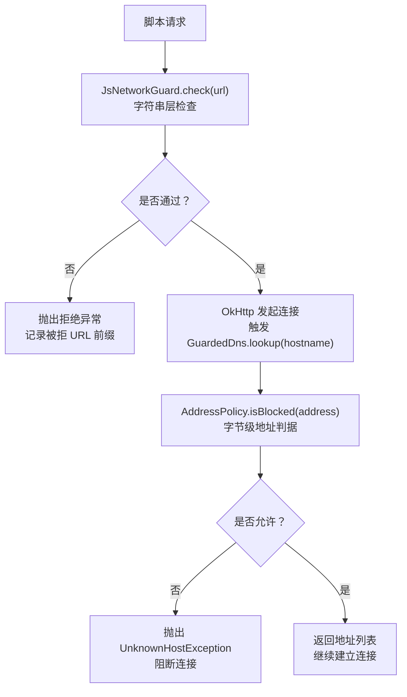
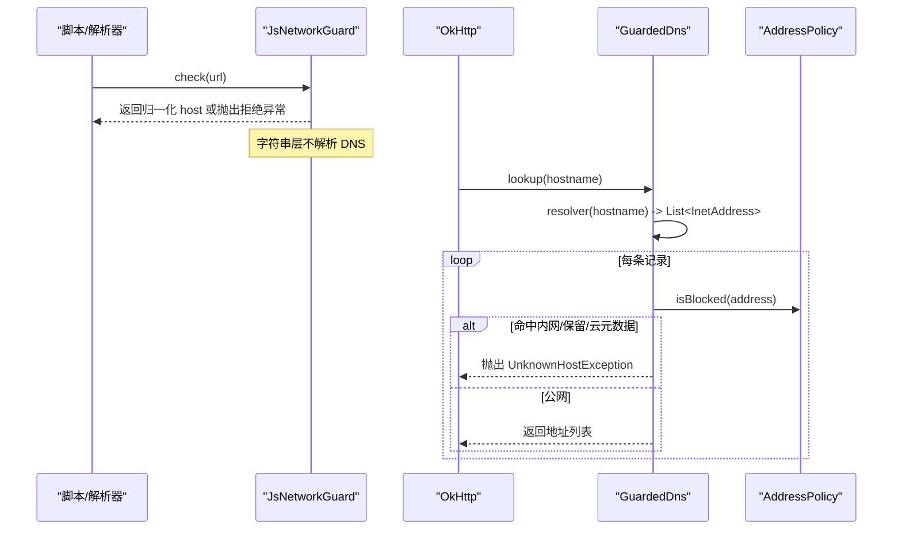
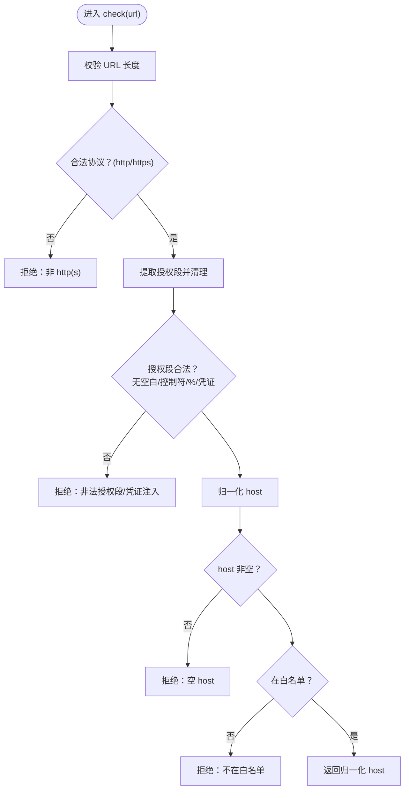
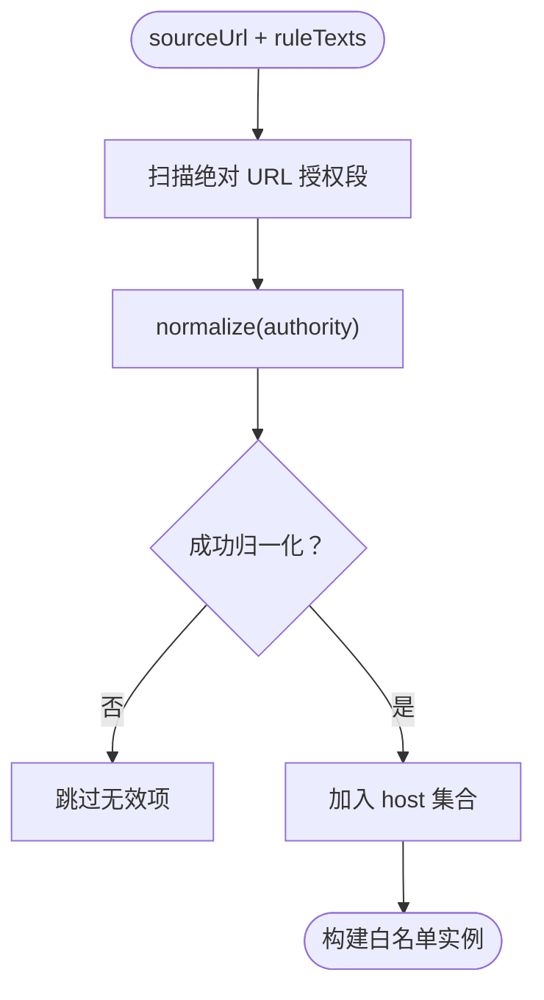
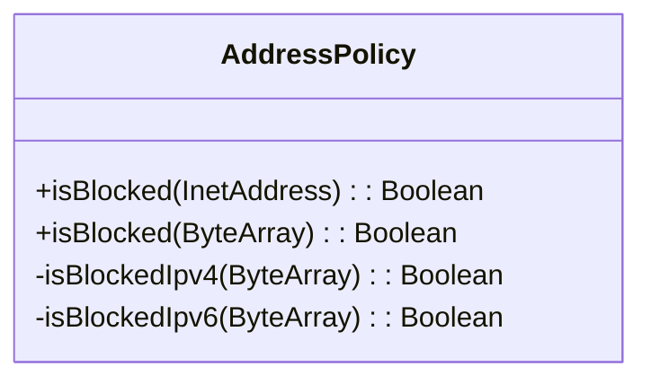
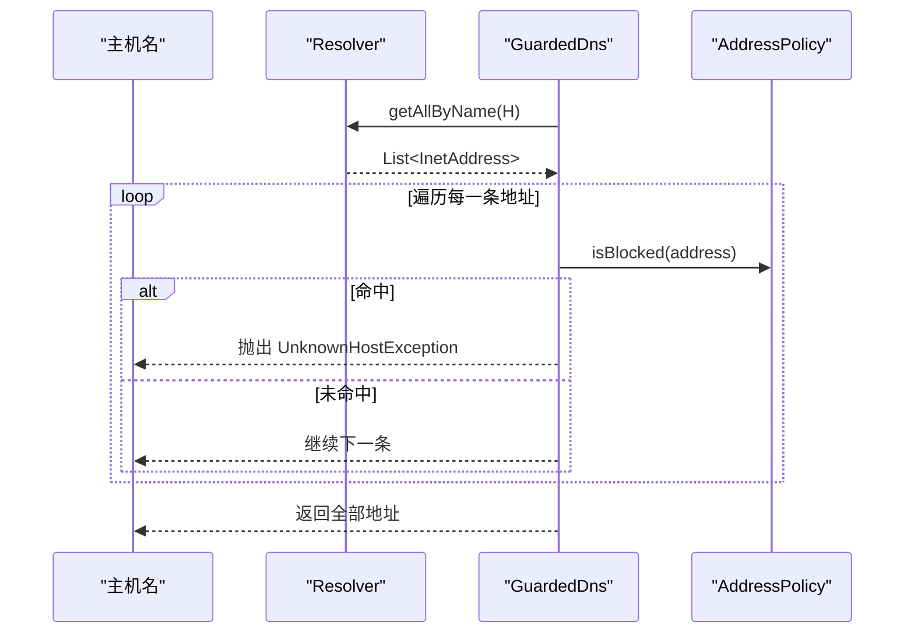
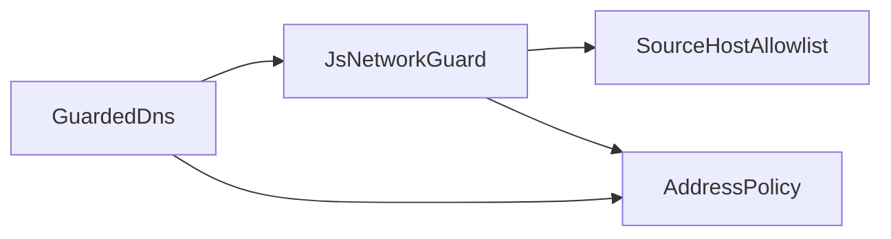

# 网络守卫系统

<cite>
**本文引用的文件**
- [JsNetworkGuard.kt](file://lib_book_source/src/main/java/com/ebook/source/sandbox/JsNetworkGuard.kt)
- [SourceHostAllowlist.kt](file://lib_book_source/src/main/java/com/ebook/source/sandbox/SourceHostAllowlist.kt)
- [JsLimits.kt](file://lib_book_source/src/main/java/com/ebook/source/sandbox/JsLimits.kt)
- [JsNetworkGuardTest.kt](file://lib_book_source/src/test/java/com/ebook/source/sandbox/JsNetworkGuardTest.kt)
- [SourceHostAllowlistTest.kt](file://lib_book_source/src/test/java/com/ebook/source/sandbox/SourceHostAllowlistTest.kt)
- [0028-untrusted-js-sandbox.md](file://docs/adr/0028-untrusted-js-sandbox.md)
</cite>

## 目录
1. [引言](#引言)
2. [项目结构](#项目结构)
3. [核心组件](#核心组件)
4. [架构总览](#架构总览)
5. [详细组件分析](#详细组件分析)
6. [依赖关系分析](#依赖关系分析)
7. [性能与限流](#性能与限流)
8. [故障排查指南](#故障排查指南)
9. [结论](#结论)
10. [附录](#附录)

## 引言
本文件系统性阐述本仓库的“网络守卫”安全边界：在脚本执行环境中，所有外呼必须经过双层防护——字符串层（URL 语法、协议与白名单）与 DNS 层（解析结果地址归属判定），并配合地址策略、URL 校验规则与资源限流，保证零权限沙箱进程不会访问内网、保留段或云元数据服务，同时避免 DNS 重绑等绕过手段。

## 项目结构
网络守卫相关代码集中在 lib_book_source 的沙箱子模块中，围绕三个核心类展开：
- JsNetworkGuard：字符串层准入检查 + 地址拒绝桥接
- SourceHostAllowlist：从书源规则文本导出可解析 host 白名单
- GuardedDns：挂载到 OkHttp 的 DNS 解析器，负责地址级拦截
- AddressPolicy：字节级 IPv4/IPv6 内网/保留/云元数据判据

图表来源
- [JsNetworkGuard.kt:25-60](file://lib_book_source/src/main/java/com/ebook/source/sandbox/JsNetworkGuard.kt#L25-L60)
- [JsNetworkGuard.kt:86-99](file://lib_book_source/src/main/java/com/ebook/source/sandbox/JsNetworkGuard.kt#L86-L99)
- [JsNetworkGuard.kt:115-167](file://lib_book_source/src/main/java/com/ebook/source/sandbox/JsNetworkGuard.kt#L115-L167)

章节来源
- [JsNetworkGuard.kt:25-60](file://lib_book_source/src/main/java/com/ebook/source/sandbox/JsNetworkGuard.kt#L25-L60)
- [JsNetworkGuard.kt:86-99](file://lib_book_source/src/main/java/com/ebook/source/sandbox/JsNetworkGuard.kt#L86-L99)
- [JsNetworkGuard.kt:115-167](file://lib_book_source/src/main/java/com/ebook/source/sandbox/JsNetworkGuard.kt#L115-L167)

## 核心组件
- JsNetworkGuard：无状态守门器，只做“能不能碰”的判断；check() 仅做字符串层检查，不触发 DNS；rejectIfBlocked() 将 InetAddress 交给 AddressPolicy 判断。
- SourceHostAllowlist：从书源自身 URL 与规则文本中提取绝对 URL 授权段，归一化为小写、去端口、去尾点、剥 IPv6 方括号后的 host 集合，作为白名单。
- GuardedDns：实现 OkHttp 的 Dns 接口，lookup() 获取全部 A/AAAA 记录并对每个地址调用 rejectIfBlocked()，拒绝时抛 UnknownHostException。
- AddressPolicy：纯字节级判据，覆盖 IPv4 与 IPv6 的内网、环回、链路本地、ULA、组播、IETF 保留、CGNAT、云元数据等；对 IPv4 映射/兼容形态就地解出嵌入 IPv4 再判。

章节来源
- [JsNetworkGuard.kt:25-60](file://lib_book_source/src/main/java/com/ebook/source/sandbox/JsNetworkGuard.kt#L25-L60)
- [SourceHostAllowlist.kt:20-73](file://lib_book_source/src/main/java/com/ebook/source/sandbox/SourceHostAllowlist.kt#L20-L73)
- [JsNetworkGuard.kt:86-99](file://lib_book_source/src/main/java/com/ebook/source/sandbox/JsNetworkGuard.kt#L86-L99)
- [JsNetworkGuard.kt:115-167](file://lib_book_source/src/main/java/com/ebook/source/sandbox/JsNetworkGuard.kt#L115-L167)

## 架构总览
网络守卫采用“两段式防线”，将“字符串合法性/白名单”和“地址归属”严格分离：
- 字符串层（check）：只读 URL 文本，不做任何网络解析；限制协议为 http(s)、长度上限、禁止凭证注入、非法字符、空 host 与白名单匹配。
- DNS 层（GuardedDns）：仅在 OkHttp 真正解析时使用该次结果进行地址判据，避免“先解析一次用于检查、连接时再解析一次”带来的 DNS 重绑窗口；多 A 记录全量检查，任一内网即整体拒绝。

图表来源
- [JsNetworkGuard.kt:25-60](file://lib_book_source/src/main/java/com/ebook/source/sandbox/JsNetworkGuard.kt#L25-L60)
- [JsNetworkGuard.kt:86-99](file://lib_book_source/src/main/java/com/ebook/source/sandbox/JsNetworkGuard.kt#L86-L99)
- [JsNetworkGuard.kt:115-167](file://lib_book_source/src/main/java/com/ebook/source/sandbox/JsNetworkGuard.kt#L115-L167)

## 详细组件分析

### JsNetworkGuard：双层防护入口
- 字符串层检查要点
  - 协议限制：仅 http/https；其他一律拒绝。
  - 长度上限：默认 4096 字节，防止超长 URL 滥用。
  - 授权段清理：剥离查询串/片段，去除空白与控制字符，拒绝百分号编码 host。
  - 凭证注入防护：禁止 user:pass@host 形式。
  - Host 归一化：委托 SourceHostAllowlist.normalize()，统一大小写、端口、尾点、IPv6 方括号等。
  - 白名单匹配：不在本源导出的 host 集合则拒绝。
- DNS 层拒绝桥接
  - rejectIfBlocked() 将 InetAddress 交给 AddressPolicy；命中则抛 UnknownHostException，保持与真实解析失败一致的异常类型，便于上层按 IO 错误处理。

图表来源
- [JsNetworkGuard.kt:25-60](file://lib_book_source/src/main/java/com/ebook/source/sandbox/JsNetworkGuard.kt#L25-L60)

章节来源
- [JsNetworkGuard.kt:25-60](file://lib_book_source/src/main/java/com/ebook/source/sandbox/JsNetworkGuard.kt#L25-L60)
- [JsNetworkGuardTest.kt:41-98](file://lib_book_source/src/test/java/com/ebook/source/sandbox/JsNetworkGuardTest.kt#L41-L98)

### SourceHostAllowlist：白名单导出机制
- 数据来源：书源自身的 sourceUrl，以及该源的所有 URL 形态规则原文。
- 提取规则：使用正则匹配绝对 URL 的 scheme:// 后紧邻的授权段，排除拼接片段、正则字面量中的 “//” 等伪 URL。
- 归一化：去掉 userinfo、端口、IPv6 方括号与 zone id、尾点、转小写；无法解析出 host 的授权段返回 null。
- 默认严格：不放行子域，例如 example.com 不等于放行 *.example.com，以最小化风险面。

图表来源
- [SourceHostAllowlist.kt:25-73](file://lib_book_source/src/main/java/com/ebook/source/sandbox/SourceHostAllowlist.kt#L25-L73)

章节来源
- [SourceHostAllowlist.kt:20-73](file://lib_book_source/src/main/java/com/ebook/source/sandbox/SourceHostAllowlist.kt#L20-L73)
- [SourceHostAllowlistTest.kt:15-55](file://lib_book_source/src/test/java/com/ebook/source/sandbox/SourceHostAllowlistTest.kt#L15-L55)
- [SourceHostAllowlistTest.kt:57-80](file://lib_book_source/src/test/java/com/ebook/source/sandbox/SourceHostAllowlistTest.kt#L57-L80)

### AddressPolicy：地址策略与安全判据
- 设计原则：按原始字节判定，避免平台 InetAddress API 在不同系统上的差异；未知长度直接拒绝（deny-by-default）。
- IPv4 拒绝集：0.0.0.0/8、RFC1918（10/8、172.16/12、192.168/16）、环回 127/8、链路本地 169.254/16、IETF 保留 192.0.0.0/24、CGNAT 100.64/10、基准测试 198.18/15、组播 224/4、保留段与广播。
- IPv6 拒绝集：::/96（未指定、环回、IPv4 兼容/映射）、fe80::/10（链路本地）、fc00::/7（ULA）、ff00::/8（组播）、2002::/16（6to4 内嵌 IPv4 就地解）。
- 云元数据保护：明确包含 169.254.169.254 及其 IPv6 映射/兼容形态。

图表来源
- [JsNetworkGuard.kt:115-167](file://lib_book_source/src/main/java/com/ebook/source/sandbox/JsNetworkGuard.kt#L115-L167)

章节来源
- [JsNetworkGuard.kt:115-167](file://lib_book_source/src/main/java/com/ebook/source/sandbox/JsNetworkGuard.kt#L115-L167)
- [JsNetworkGuardTest.kt:102-179](file://lib_book_source/src/test/java/com/ebook/source/sandbox/JsNetworkGuardTest.kt#L102-L179)

### GuardedDns：DNS 重绑防护
- 挂载位置：实现 OkHttp 的 Dns 接口，lookup() 是唯一接入点。
- 全量检查：获取全部 A/AAAA 记录，逐条过 AddressPolicy；只要有一条内网/保留/云元数据就整体拒绝。
- TTL=0 攻击防护：不缓存解析结果；每次 lookup 都重新解析并重判，确保“检查与使用同址”。
- 空结果处理：解析结果为空时按 UnknownHostException 上报，行为与真实解析失败一致。

图表来源
- [JsNetworkGuard.kt:86-99](file://lib_book_source/src/main/java/com/ebook/source/sandbox/JsNetworkGuard.kt#L86-L99)

章节来源
- [JsNetworkGuard.kt:86-99](file://lib_book_source/src/main/java/com/ebook/source/sandbox/JsNetworkGuard.kt#L86-L99)
- [JsNetworkGuardTest.kt:183-203](file://lib_book_source/src/test/java/com/ebook/source/sandbox/JsNetworkGuardTest.kt#L183-L203)
- [JsNetworkGuardTest.kt:258-277](file://lib_book_source/src/test/java/com/ebook/source/sandbox/JsNetworkGuardTest.kt#L258-L277)

### URL 格式验证规则
- 协议限制：仅 http/https；其他协议一律拒绝。
- 长度上限：默认 4096 字节；可通过构造参数调整。
- 凭证注入防护：禁止在 URL 中嵌入用户凭证（user:pass@host）。
- 授权段字符限制：不允许空白、控制字符与百分号编码 host。
- 白名单约束：host 必须来自本源导出的白名单集合。

章节来源
- [JsNetworkGuard.kt:25-60](file://lib_book_source/src/main/java/com/ebook/source/sandbox/JsNetworkGuard.kt#L25-L60)
- [JsNetworkGuardTest.kt:41-98](file://lib_book_source/src/test/java/com/ebook/source/sandbox/JsNetworkGuardTest.kt#L41-L98)

### 网络请求限流机制与安全边界
- 限流位置：由持有 JsLimits.maxRequestsPerTask 的任务侧计数器（JsCallbackProxy）控制单次任务的外呼次数；JsNetworkGuard 本身不持计数器，避免跨任务共享状态导致计数错乱。
- 资源上限：JsLimits 集中定义 wall-clock、堆、栈、请求帧、响应帧、host 回调帧、绑定超时等，防止脚本耗尽进程资源。
- 安全边界：字符串层与 DNS 层分工明确，白名单基于规则文本导出，地址判定走字节级判据，双重保障避免 SSRF/内网泄露。

章节来源
- [JsLimits.kt:1-58](file://lib_book_source/src/main/java/com/ebook/source/sandbox/JsLimits.kt#L1-L58)
- [JsNetworkGuard.kt:9-23](file://lib_book_source/src/main/java/com/ebook/source/sandbox/JsNetworkGuard.kt#L9-L23)
- [0028-untrusted-js-sandbox.md:35-37](file://docs/adr/0028-untrusted-js-sandbox.md#L35-L37)

## 依赖关系分析
- JsNetworkGuard 依赖：
  - SourceHostAllowlist：提供白名单与 host 归一化
  - AddressPolicy：提供地址判据
  - OkHttp Dns：通过 GuardedDns 接入
- SourceHostAllowlist 依赖：
  - 正则表达式：URL_AUTHORITY 与 HOST_CHARS
- GuardedDns 依赖：
  - 外部 Resolver：默认 InetAddress.getAllByName，可注入替换
  - AddressPolicy：地址判据

图表来源
- [JsNetworkGuard.kt:25-60](file://lib_book_source/src/main/java/com/ebook/source/sandbox/JsNetworkGuard.kt#L25-L60)
- [JsNetworkGuard.kt:86-99](file://lib_book_source/src/main/java/com/ebook/source/sandbox/JsNetworkGuard.kt#L86-L99)
- [SourceHostAllowlist.kt:25-73](file://lib_book_source/src/main/java/com/ebook/source/sandbox/SourceHostAllowlist.kt#L25-L73)

章节来源
- [JsNetworkGuard.kt:25-60](file://lib_book_source/src/main/java/com/ebook/source/sandbox/JsNetworkGuard.kt#L25-L60)
- [JsNetworkGuard.kt:86-99](file://lib_book_source/src/main/java/com/ebook/source/sandbox/JsNetworkGuard.kt#L86-L99)
- [SourceHostAllowlist.kt:25-73](file://lib_book_source/src/main/java/com/ebook/source/sandbox/SourceHostAllowlist.kt#L25-L73)

## 性能与限流
- 解析成本：字符串层检查为纯文本操作，时间复杂度与 URL 长度线性相关；DNS 层仅在连接时触发，且对每条记录逐一判据，避免缓存导致的重绑漏洞。
- 内存与带宽：请求帧/响应帧/回调帧均受 JsLimits 字节上限约束，防止大体积响应撑爆 binder 事务缓冲。
- CPU 与递归：wall-clock 超时与 JS 栈上限共同限制死循环与深递归；回调重入深度限制防止规则套规则无限嵌套。
- 并发模型：客户端串行执行 execute，避免并发下资源记账失效；binder 线程池上限与单帧串行保证资源可控。

[本节为通用性能讨论，无需具体文件引用]

## 故障排查指南
- 常见拒绝原因
  - 非 http(s) 协议：检查 URL 协议是否为 http/https。
  - 超长 URL：确认 URL 长度未超过 maxUrlLength。
  - 凭证注入：移除 URL 中 user:pass@ 形式。
  - 白名单缺失：确认 host 是否在规则文本中出现或被导入。
  - 内网/保留/云元数据：检查解析结果是否命中 AddressPolicy。
- 调试建议
  - 查看拒绝消息中的 URL 前 80 字符与 host，定位问题源。
  - 通过单元测试用例快速验证各类地址族与混淆写法。
  - 若怀疑 DNS 重绑，确认 GuardedDns 未被缓存解析结果。

章节来源
- [JsNetworkGuardTest.kt:27-31](file://lib_book_source/src/test/java/com/ebook/source/sandbox/JsNetworkGuardTest.kt#L27-L31)
- [JsNetworkGuardTest.kt:183-203](file://lib_book_source/src/test/java/com/ebook/source/sandbox/JsNetworkGuardTest.kt#L183-L203)

## 结论
本网络守卫系统通过“字符串层 + DNS 层”的双层防护，结合白名单导出机制与严格的地址策略，有效防止脚本访问内网、保留段与云元数据服务，抵御 DNS 重绑与多种地址混淆手法。配合资源限流与安全边界约定，形成完整的安全闭环。后续可按真实源失败率微调白名单宽松度，但不应破坏地址判定与双阶段隔离的核心原则。

[本节为总结性内容，无需具体文件引用]

## 附录
- 关键测试覆盖
  - 协议限制、相对地址拒绝、凭证注入防护、URL 长度上限、白名单匹配、IPv4/IPv6 内网拒绝、多 A 记录整体拒绝、DNS 重绑防护、混淆写法收敛等。
- 参考决策
  - ADR-0028 明确了不可信 JS 执行器的安全边界、资源限制与 Host API 白名单策略，网络守卫与其保持一致。

章节来源
- [JsNetworkGuardTest.kt:41-342](file://lib_book_source/src/test/java/com/ebook/source/sandbox/JsNetworkGuardTest.kt#L41-L342)
- [0028-untrusted-js-sandbox.md:35-37](file://docs/adr/0028-untrusted-js-sandbox.md#L35-L37)