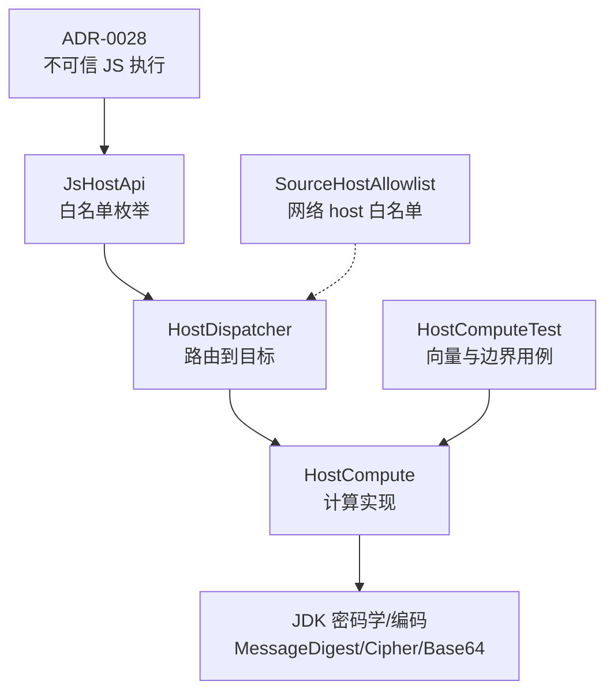
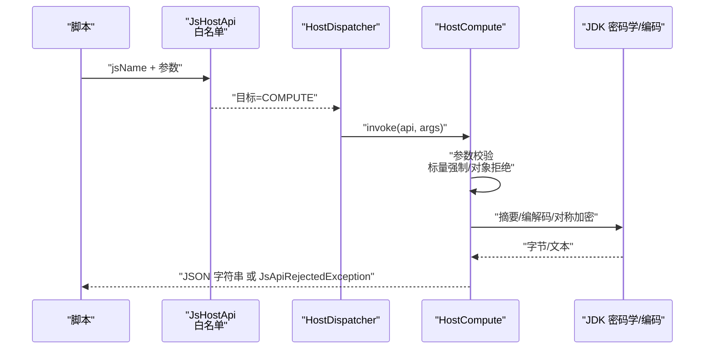
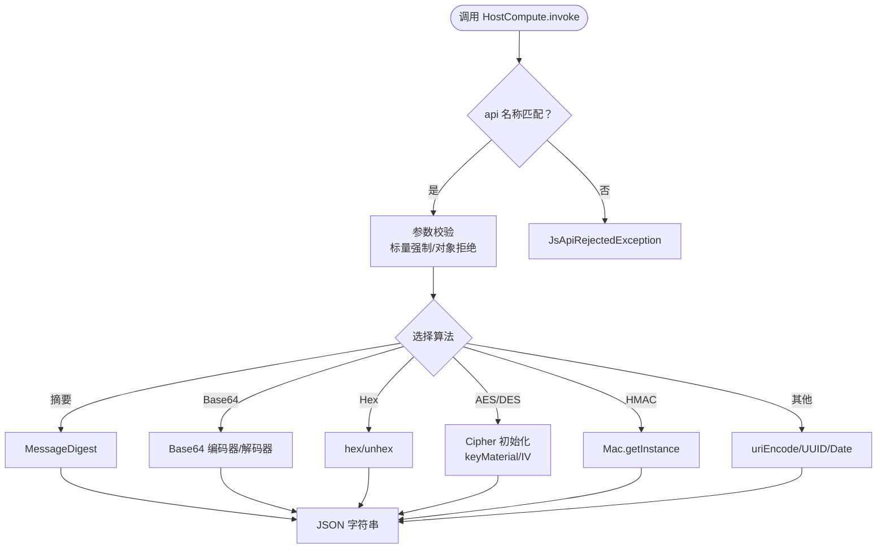
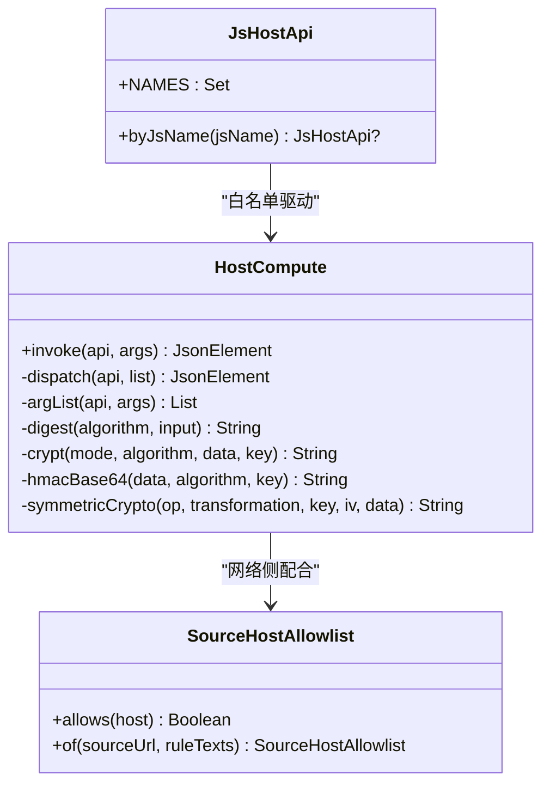

# 计算类 API 白名单

<cite>
**本文引用的文件**
- [HostCompute.kt](file://lib_book_source/src/main/java/com/ebook/source/sandbox/HostCompute.kt)
- [JsHostApi.kt](file://lib_book_source/src/main/java/com/ebook/source/script/JsHostApi.kt)
- [HostComputeTest.kt](file://lib_book_source/src/test/java/com/ebook/source/sandbox/HostComputeTest.kt)
- [0028-untrusted-js-sandbox.md](file://docs/adr/0028-untrusted-js-sandbox.md)
- [SourceHostAllowlist.kt](file://lib_book_source/src/main/java/com/ebook/source/sandbox/SourceHostAllowlist.kt)
</cite>

## 目录
1. [引言](#引言)
2. [项目结构](#项目结构)
3. [核心组件](#核心组件)
4. [架构总览](#架构总览)
5. [详细组件分析](#详细组件分析)
6. [依赖关系分析](#依赖关系分析)
7. [性能与资源限制](#性能与资源限制)
8. [故障排查指南](#故障排查指南)
9. [结论](#结论)
10. [附录：新增算法的安全审查流程](#附录新增算法的安全审查流程)

## 引言
本文件聚焦“计算类 Host API”的白名单与安全设计，面向书源脚本在沙箱执行器内可使用的最小能力集。其安全理念基于 deny-by-default（默认拒绝）和最小权限模型：仅在白名单中显式暴露的能力可用；未列出的能力对脚本不可见。所有计算调用在隔离的执行器进程内完成，零跨进程往返，通过类型化异常统一对外失败语义，避免“静默成功但结果错误”的隐蔽风险。

## 项目结构
围绕计算类能力的代码主要分布在以下位置：
- 白名单声明与分发：JsHostApi
- 计算实现与参数校验：HostCompute
- 测试用例与向量验证：HostComputeTest
- 沙箱整体安全策略：ADR-0028
- 网络侧 host 白名单（辅助）：SourceHostAllowlist

**图表来源**
- [JsHostApi.kt:1-114](file://lib_book_source/src/main/java/com/ebook/source/script/JsHostApi.kt#L1-L114)
- [HostCompute.kt:45-86](file://lib_book_source/src/main/java/com/ebook/source/sandbox/HostCompute.kt#L45-L86)
- [HostComputeTest.kt:1-259](file://lib_book_source/src/test/java/com/ebook/source/sandbox/HostComputeTest.kt#L1-L259)
- [0028-untrusted-js-sandbox.md:15-37](file://docs/adr/0028-untrusted-js-sandbox.md#L15-L37)
- [SourceHostAllowlist.kt:5-73](file://lib_book_source/src/main/java/com/ebook/source/sandbox/SourceHostAllowlist.kt#L5-L73)

**章节来源**
- [JsHostApi.kt:1-114](file://lib_book_source/src/main/java/com/ebook/source/script/JsHostApi.kt#L1-L114)
- [HostCompute.kt:45-86](file://lib_book_source/src/main/java/com/ebook/source/sandbox/HostCompute.kt#L45-L86)
- [0028-untrusted-js-sandbox.md:15-37](file://docs/adr/0028-untrusted-js-sandbox.md#L15-L37)

## 核心组件
- 白名单枚举 JsHostApi：集中定义脚本可见的计算能力名、目标进程、参数数量范围。任何不在表中的名字对脚本不存在。
- 计算调度 HostCompute：接收 api 名与 JSON 参数，按名称分派到具体算法实现，统一参数校验与错误封装。
- 测试 HostComputeTest：以已知向量与边界场景锁住行为一致性（摘要、Base64、Hex、AES/DES、HMAC、URI 编码等）。
- 沙箱策略 ADR-0028：明确 deny-by-default、隔离进程、最小权限与资源限制原则。
- 网络 host 白名单 SourceHostAllowlist：虽属网络侧，但与计算白名单共同构成“能力面最小化”的整体约束。

**章节来源**
- [JsHostApi.kt:17-110](file://lib_book_source/src/main/java/com/ebook/source/script/JsHostApi.kt#L17-L110)
- [HostCompute.kt:45-86](file://lib_book_source/src/main/java/com/ebook/source/sandbox/HostCompute.kt#L45-L86)
- [HostComputeTest.kt:30-258](file://lib_book_source/src/test/java/com/ebook/source/sandbox/HostComputeTest.kt#L30-L258)
- [0028-untrusted-js-sandbox.md:22-37](file://docs/adr/0028-untrusted-js-sandbox.md#L22-L37)

## 架构总览
计算类 API 的调用链如下：
- 脚本侧通过 JsHostApi 暴露的名字发起调用
- HostDispatcher 将请求转发至对应目标（COMPUTE/HOST）
- COMPUTE 分支进入 HostCompute.invoke，进行参数校验与算法分派
- 各算法实现使用 JDK 原生能力（MessageDigest/Cipher/Base64），返回 JSON 字符串
- 失败统一抛出 JsApiRejectedException，保证类型化错误与可诊断性

**图表来源**
- [JsHostApi.kt:17-110](file://lib_book_source/src/main/java/com/ebook/source/script/JsHostApi.kt#L17-L110)
- [HostCompute.kt:53-86](file://lib_book_source/src/main/java/com/ebook/source/sandbox/HostCompute.kt#L53-L86)

**章节来源**
- [HostCompute.kt:53-86](file://lib_book_source/src/main/java/com/ebook/source/sandbox/HostCompute.kt#L53-L86)

## 详细组件分析

### 白名单与最小权限模型
- deny-by-default：JsHostApi 是唯一能力清单，表外名字在脚本全局对象上不存在，无法通过反射或猜测获取。
- 参数元数控制：每条能力指定 minArgs/maxArgs，由 JS 垫片在调用前校验，避免无效参数进入内核路径。
- 目标分离：COMPUTE 分支为纯计算，HOST 分支走主进程受限代理（网络、变量、cookie 等），计算能力不直接访问网络。

**章节来源**
- [JsHostApi.kt:17-110](file://lib_book_source/src/main/java/com/ebook/source/script/JsHostApi.kt#L17-L110)
- [0028-untrusted-js-sandbox.md:22-37](file://docs/adr/0028-untrusted-js-sandbox.md#L22-L37)

### 支持的算法与功能
- 摘要算法：MD5、SHA-1、SHA-256、SHA-224、SHA-384、SHA-512
- Base64 编解码：标准模式与 URL 安全模式（去填充、字符集不同）
- 十六进制编解码：严格偶长度与非十六进制字符检查
- 对称加密：AES（CBC，IV 由密钥前 16 字节派生）、DES（ECB）
- HMAC 签名：多种 HMAC 算法，base64 输出
- 通用工具：uriEncode（表单百分号编码）、randomUUID、时间戳与格式化、bytesToStr（带字符集）
- 扩展对称加解密：symmetricCrypto，支持变换名“算法/模式/填充”，键与 IV 按材料原样使用

**图表来源**
- [HostCompute.kt:63-86](file://lib_book_source/src/main/java/com/ebook/source/sandbox/HostCompute.kt#L63-L86)
- [HostCompute.kt:115-178](file://lib_book_source/src/main/java/com/ebook/source/sandbox/HostCompute.kt#L115-L178)
- [HostCompute.kt:219-239](file://lib_book_source/src/main/java/com/ebook/source/sandbox/HostCompute.kt#L219-L239)
- [HostCompute.kt:250-293](file://lib_book_source/src/main/java/com/ebook/source/sandbox/HostCompute.kt#L250-L293)

**章节来源**
- [HostCompute.kt:63-86](file://lib_book_source/src/main/java/com/ebook/source/sandbox/HostCompute.kt#L63-L86)
- [HostCompute.kt:115-178](file://lib_book_source/src/main/java/com/ebook/source/sandbox/HostCompute.kt#L115-L178)
- [HostCompute.kt:219-239](file://lib_book_source/src/main/java/com/ebook/source/sandbox/HostCompute.kt#L219-L239)
- [HostCompute.kt:250-293](file://lib_book_source/src/main/java/com/ebook/source/sandbox/HostCompute.kt#L250-L293)

### 参数验证机制
- 标量强制：数组元素必须为 JsonPrimitive；对象或数组一律拒绝，防止“看似成功”的假结果。
- 参数个数校验：缺失参数会报告需要第几个参数，便于脚本定位。
- UTF-8 字节边界：摘要与加密输入统一按 UTF-8 字节参与计算；十六进制解码要求偶长度且仅含十六进制字符；Base64 解码非空入参解出 0 字节视为非法，避免“空正文”的假成功。
- 字节材料标记：对于需要字节的场景，统一采用“<编码>:<文本>”形式，仅识别 base64/hex/utf8/latin1 四种前缀，其余按 UTF-8 裸文本处理。

**章节来源**
- [HostCompute.kt:91-113](file://lib_book_source/src/main/java/com/ebook/source/sandbox/HostCompute.kt#L91-L113)
- [HostCompute.kt:123-149](file://lib_book_source/src/main/java/com/ebook/source/sandbox/HostCompute.kt#L123-L149)
- [HostCompute.kt:302-321](file://lib_book_source/src/main/java/com/ebook/source/sandbox/HostCompute.kt#L302-L321)

### 密钥材料派生规则
- AES：
  - 模式：CBC
  - IV：取密钥 UTF-8 字节的前 16 字节（确定性 IV，保证密文可复现，便于作为 URL 参数复用）
  - 密钥标准化：≥32 位取 256 位；≥24 位取 192 位；其余取 128 位，不足补零、超出截断
- DES：
  - 模式：ECB
  - 密钥标准化：固定 8 字节，不足补零、超出截断
- HMAC：
  - 密钥直接使用 UTF-8 字节，不做分组密码的补零/截断（HMAC 对任意长度密钥有定义）
- symmetricCrypto：
  - 键与 IV 由调用方提供（materialToBytes），不附加派生规则；非 ECB 模式缺 IV 直接拒绝

**章节来源**
- [HostCompute.kt:151-189](file://lib_book_source/src/main/java/com/ebook/source/sandbox/HostCompute.kt#L151-L189)
- [HostCompute.kt:241-293](file://lib_book_source/src/main/java/com/ebook/source/sandbox/HostCompute.kt#L241-L293)

### 错误处理模型
- 统一异常：所有失败均抛出 JsApiRejectedException，消息包含 api 名与原因，便于脚本侧定位问题。
- 拒绝优于静默失败：未知 api、参数非标量、非法 base64、非法 hex、不支持算法等，均以类型化拒绝返回，避免“结果为 null”导致的后续逻辑误判。
- 失败分层保护：在关键步骤（如 Cipher 初始化、Base64 解码）捕获异常并转为 JsApiRejectedException，保持上层调用的一致性。

**章节来源**
- [HostCompute.kt:53-61](file://lib_book_source/src/main/java/com/ebook/source/sandbox/HostCompute.kt#L53-L61)
- [HostCompute.kt:115-178](file://lib_book_source/src/main/java/com/ebook/source/sandbox/HostCompute.kt#L115-L178)
- [JsHostApi.kt:113-114](file://lib_book_source/src/main/java/com/ebook/source/script/JsHostApi.kt#L113-L114)

### 调试工具与使用示例
- 单元测试覆盖：HostComputeTest 提供已知向量与边界用例，可用于快速验证新接入算法或修改后的行为一致性。
- 常见调用路径：
  - 摘要：md5/sha1/sha256/digestHex
  - 编解码：base64Encode/base64Decode/base64EncodeUrl/base64DecodeUrl/hexEncode/hexDecode
  - 对称加密：aesEncode/aesDecode/desEncode/desDecode/symmetricCrypto
  - 签名：hmacBase64
  - 工具：uriEncode/randomUUID/timestamp/FormatDate/bytesToStr
- 建议调试步骤：
  - 先以短明文与短密钥运行往返用例，确认加解密链路正常
  - 使用已知向量（OpenSSL）对比摘要与 HMAC 输出
  - 针对非法输入（非 base64、奇数长度 hex、缺参数）验证是否抛出类型化拒绝

**章节来源**
- [HostComputeTest.kt:30-258](file://lib_book_source/src/test/java/com/ebook/source/sandbox/HostComputeTest.kt#L30-L258)

## 依赖关系分析
- 白名单与实现解耦：JsHostApi 仅声明能力名与参数元数；HostCompute 负责实现与校验，二者通过约定协作。
- 运行时依赖：JDK 的 MessageDigest、Cipher、Base64、URLEncoder、SimpleDateFormat；无第三方密码库。
- 沙箱边界：所有计算在隔离进程内执行，零 IPC 开销；网络能力经 HOST 分支与 SourceHostAllowlist 限制。

**图表来源**
- [JsHostApi.kt:17-110](file://lib_book_source/src/main/java/com/ebook/source/script/JsHostApi.kt#L17-L110)
- [HostCompute.kt:45-86](file://lib_book_source/src/main/java/com/ebook/source/sandbox/HostCompute.kt#L45-L86)
- [SourceHostAllowlist.kt:20-73](file://lib_book_source/src/main/java/com/ebook/source/sandbox/SourceHostAllowlist.kt#L20-L73)

**章节来源**
- [JsHostApi.kt:17-110](file://lib_book_source/src/main/java/com/ebook/source/script/JsHostApi.kt#L17-L110)
- [HostCompute.kt:45-86](file://lib_book_source/src/main/java/com/ebook/source/sandbox/HostCompute.kt#L45-L86)
- [SourceHostAllowlist.kt:20-73](file://lib_book_source/src/main/java/com/ebook/source/sandbox/SourceHostAllowlist.kt#L20-L73)

## 性能与资源限制
- 零 IPC：计算类能力在执行器进程内完成，无跨进程开销。
- 资源限制（执行器侧）：wall-clock 超时、堆上限、JS 栈上限、请求/响应大小上限；超限销毁 runtime，必要时重启进程。
- 任务边界：每次 execute 重建 JSContext，避免脚本间状态污染。
- 字节上限：binder 事务缓冲约 1 MB，需在本地判断以避免 TransactionTooLargeException。
- 回调重入深度与次数限制：防止无限递归与过度外呼。

**章节来源**
- [0028-untrusted-js-sandbox.md:31-37](file://docs/adr/0028-untrusted-js-sandbox.md#L31-L37)

## 故障排查指南
- 症状：脚本调用返回“成功但结果为空”或“签名不对”
  - 排查点：参数是否传入对象/数组；base64 解码是否合法；hex 长度是否为偶数；UTF-8 字节边界是否正确
- 症状：未知 api 或参数个数不符
  - 排查点：确认 JsHostApi 中是否已登记该能力；核对 minArgs/maxArgs；检查垫片侧参数传递
- 症状：对称加密失败
  - 排查点：AES 的 IV 是否由密钥前 16 字节派生；DES 是否使用 ECB；symmetricCrypto 的变换名是否符合“算法/模式/填充”格式；非 ECB 是否提供 IV
- 症状：HMAC 签名不一致
  - 排查点：算法名规范化（大小写与连字符不敏感）；密钥是否按 UTF-8 字节直接使用；输出是否为 base64

**章节来源**
- [HostCompute.kt:91-113](file://lib_book_source/src/main/java/com/ebook/source/sandbox/HostCompute.kt#L91-L113)
- [HostCompute.kt:115-178](file://lib_book_source/src/main/java/com/ebook/source/sandbox/HostCompute.kt#L115-L178)
- [HostCompute.kt:219-239](file://lib_book_source/src/main/java/com/ebook/source/sandbox/HostCompute.kt#L219-L239)
- [HostCompute.kt:241-293](file://lib_book_source/src/main/java/com/ebook/source/sandbox/HostCompute.kt#L241-L293)

## 结论
计算类 API 白名单以 deny-by-default 为核心，通过 JsHostApi 显式暴露能力、HostCompute 严格参数校验与类型化错误处理，确保脚本在最小权限下安全执行。算法族涵盖摘要、编解码、对称加密与 HMAC，辅以工具函数满足常见需求。结合 ADR-0028 的沙箱策略，实现了进程级隔离、资源限制与最小攻击面。新增算法需遵循同样的白名单登记、参数校验与错误封装规范，并通过已知向量与边界用例锁定行为。

## 附录：新增算法的安全审查流程
- 需求评估：是否确有必要新增能力；是否能用现有能力组合替代
- 白名单登记：在 JsHostApi 中添加 jsName、target、minArgs/maxArgs
- 实现与校验：在 HostCompute 中实现算法，确保参数标量强制、对象数组拒绝、UTF-8 字节边界一致
- 密钥与 IV：若涉及对称加密，明确密钥标准化策略与 IV 生成规则；如需可变 IV，需评估可复现性与 URL 复用需求
- 错误处理：统一抛出 JsApiRejectedException，消息包含 api 名与原因，避免静默失败
- 测试覆盖：补充已知向量与边界用例，覆盖非法输入与异常路径
- 文档同步：更新本文件与相关注释，说明算法口径、限制与注意事项

**章节来源**
- [JsHostApi.kt:17-110](file://lib_book_source/src/main/java/com/ebook/source/script/JsHostApi.kt#L17-L110)
- [HostCompute.kt:45-86](file://lib_book_source/src/main/java/com/ebook/source/sandbox/HostCompute.kt#L45-L86)
- [HostComputeTest.kt:30-258](file://lib_book_source/src/test/java/com/ebook/source/sandbox/HostComputeTest.kt#L30-L258)
- [0028-untrusted-js-sandbox.md:22-37](file://docs/adr/0028-untrusted-js-sandbox.md#L22-L37)