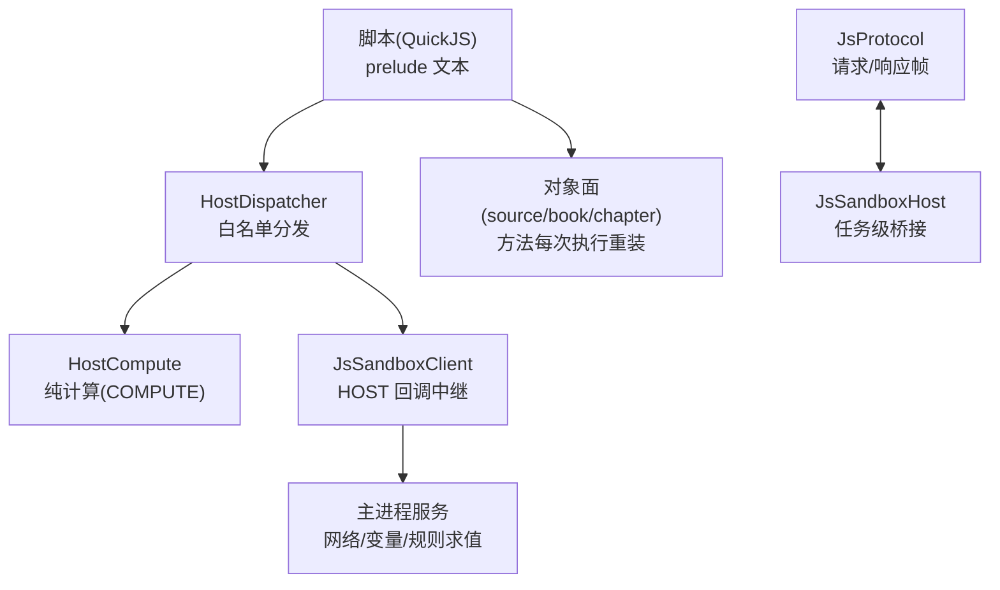
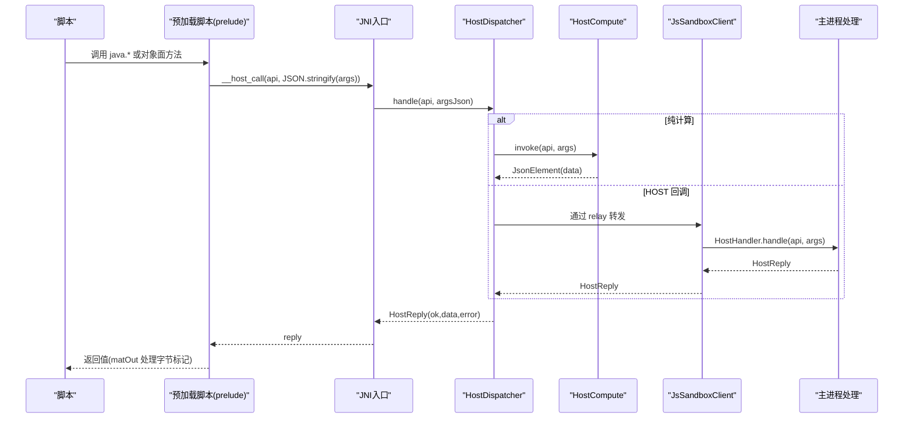
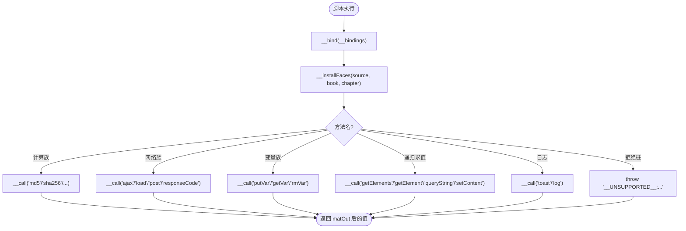
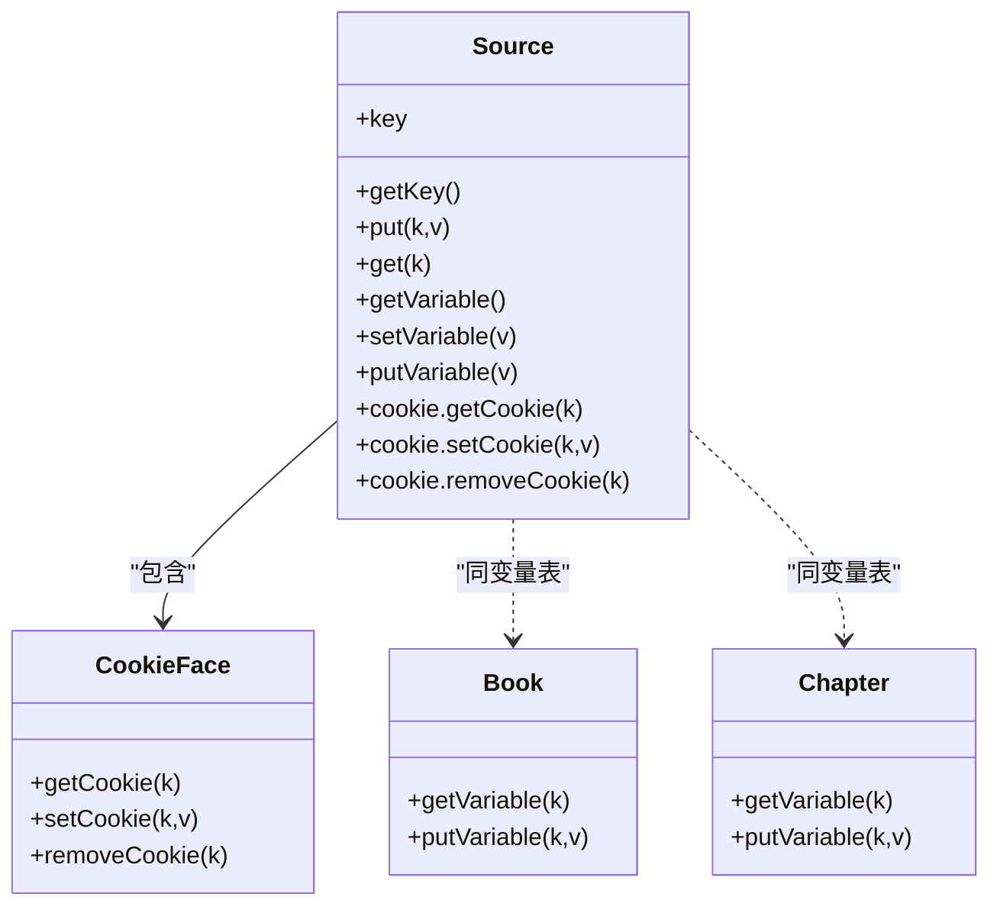
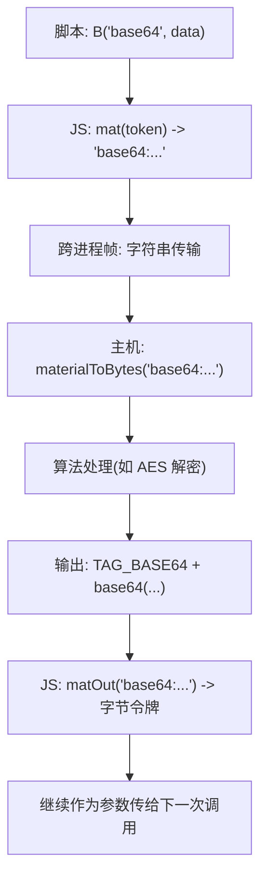
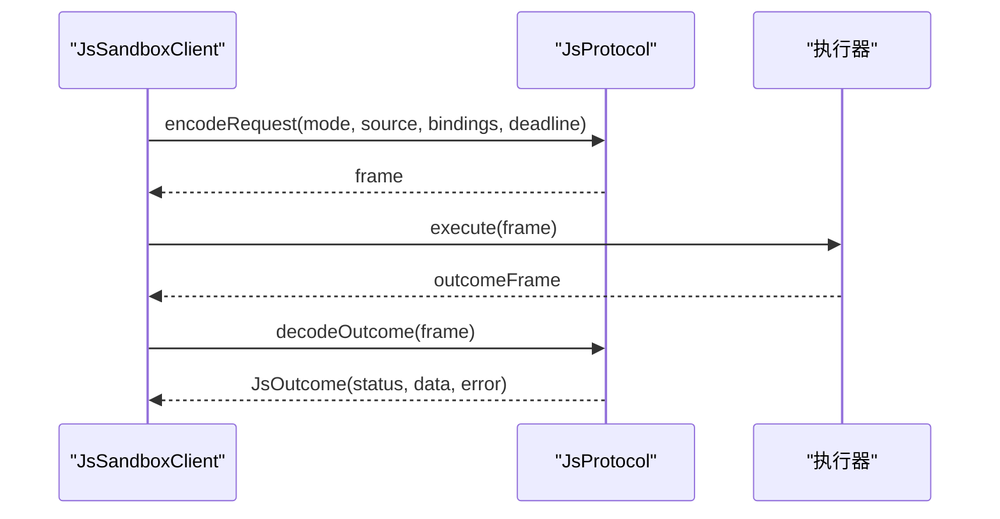
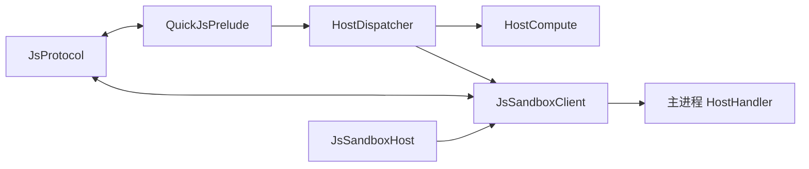

# JS 预加载脚本系统

<cite>
**本文引用的文件**   
- [QuickJsPrelude.kt](file://lib_book_source/src/main/java/com/ebook/source/sandbox/QuickJsPrelude.kt)
- [JsHostApi.kt](file://lib_book_source/src/main/java/com/ebook/source/script/JsHostApi.kt)
- [HostCompute.kt](file://lib_book_source/src/main/java/com/ebook/source/sandbox/HostCompute.kt)
- [JsProtocol.kt](file://lib_book_source/src/main/java/com/ebook/source/sandbox/JsProtocol.kt)
- [HostDispatcher.kt](file://lib_book_source/src/main/java/com/ebook/source/sandbox/HostDispatcher.kt)
- [JsSandboxClient.kt](file://lib_book_source/src/main/java/com/ebook/source/sandbox/JsSandboxClient.kt)
- [JsSandboxHost.kt](file://lib_book_source/src/main/java/com/ebook/source/sandbox/JsSandboxHost.kt)
</cite>

## 目录
1. [简介](#简介)
2. [项目结构](#项目结构)
3. [核心组件](#核心组件)
4. [架构总览](#架构总览)
5. [详细组件分析](#详细组件分析)
6. [依赖关系分析](#依赖关系分析)
7. [性能与限制](#性能与限制)
8. [故障排查指南](#故障排查指南)
9. [结论](#结论)
10. [附录：扩展开发与安全边界](#附录扩展开发与安全边界)

## 简介
本文件系统化说明“JS 预加载脚本系统”的三段式架构、能力清单、对象门面装配、字节数组协议、兼容性别名映射，以及跨进程执行器与主进程的通信协议。该系统在独立的 `:js` 执行器进程中运行 QuickJS 内核，通过严格的白名单与参数校验暴露计算、网络、变量存储与日志等能力；脚本侧仅看到受控的 `java.*`、`source`、`book`、`chapter` 三个对象面与若干顶层函数。所有能力由单一事实源（能力表）控制，确保沙箱安全边界可审计、可扩展、可测试。

## 项目结构
该子系统主要位于 `lib_book_source` 模块的 sandbox 与 script 包中，关键文件职责如下：
- 预加载脚本与对象面装配：`QuickJsPrelude.kt`
- 能力清单与分发：`JsHostApi.kt`、`HostDispatcher.kt`
- 纯计算实现：`HostCompute.kt`
- 跨进程协议与状态归类：`JsProtocol.kt`
- 客户端执行与重放保护：`JsSandboxClient.kt`
- 主机装配与桥接构造：`JsSandboxHost.kt`

**图表来源**
- [QuickJsPrelude.kt:26-255](file://lib_book_source/src/main/java/com/ebook/source/sandbox/QuickJsPrelude.kt#L26-L255)
- [HostDispatcher.kt:24-74](file://lib_book_source/src/main/java/com/ebook/source/sandbox/HostDispatcher.kt#L24-L74)
- [HostCompute.kt:45-86](file://lib_book_source/src/main/java/com/ebook/source/sandbox/HostCompute.kt#L45-L86)
- [JsProtocol.kt:12-28](file://lib_book_source/src/main/java/com/ebook/source/sandbox/JsProtocol.kt#L12-L28)
- [JsSandboxClient.kt:35-99](file://lib_book_source/src/main/java/com/ebook/source/sandbox/JsSandboxClient.kt#L35-L99)
- [JsSandboxHost.kt:21-60](file://lib_book_source/src/main/java/com/ebook/source/sandbox/JsSandboxHost.kt#L21-L60)

**章节来源**
- [QuickJsPrelude.kt:26-255](file://lib_book_source/src/main/java/com/ebook/source/sandbox/QuickJsPrelude.kt#L26-L255)
- [JsHostApi.kt:3-114](file://lib_book_source/src/main/java/com/ebook/source/script/JsHostApi.kt#L3-L114)
- [HostDispatcher.kt:24-74](file://lib_book_source/src/main/java/com/ebook/source/sandbox/HostDispatcher.kt#L24-L74)
- [HostCompute.kt:45-345](file://lib_book_source/src/main/java/com/ebook/source/sandbox/HostCompute.kt#L45-L345)
- [JsProtocol.kt:12-282](file://lib_book_source/src/main/java/com/ebook/source/sandbox/JsProtocol.kt#L12-L282)
- [JsSandboxClient.kt:35-185](file://lib_book_source/src/main/java/com/ebook/source/sandbox/JsSandboxClient.kt#L35-L185)
- [JsSandboxHost.kt:21-60](file://lib_book_source/src/main/java/com/ebook/source/sandbox/JsSandboxHost.kt#L21-L60)

## 核心组件
- 预加载脚本三段式：SOURCE（运行时初始化）、BOOTSTRAP（每次执行前置绑定）、能力拒绝桩（以 `__UNSUPPORTED__:` 前缀标识）。
- 能力清单：`JsHostApi` 枚举集中声明所有可用 API、目标（COMPUTE/HOST）、元数范围。
- 计算引擎：`HostCompute` 提供摘要、编码、对称加解密、时间、URI 编码、HMAC、通用对称加密等。
- 协议层：`JsProtocol` 定义请求/响应帧、host call 帧、状态归类、大小检查。
- 客户端：`JsSandboxClient` 负责串行执行、超时重放、主线程防护、回调重入保护。
- 主机装配：`JsSandboxHost` 构建任务级桥接，注入网络守卫、Cookie 罐、状态探测等。

**章节来源**
- [QuickJsPrelude.kt:21-255](file://lib_book_source/src/main/java/com/ebook/source/sandbox/QuickJsPrelude.kt#L21-L255)
- [JsHostApi.kt:3-114](file://lib_book_source/src/main/java/com/ebook/source/script/JsHostApi.kt#L3-L114)
- [HostCompute.kt:45-345](file://lib_book_source/src/main/java/com/ebook/source/sandbox/HostCompute.kt#L45-L345)
- [JsProtocol.kt:12-282](file://lib_book_source/src/main/java/com/ebook/source/sandbox/JsProtocol.kt#L12-L282)
- [JsSandboxClient.kt:35-185](file://lib_book_source/src/main/java/com/ebook/source/sandbox/JsSandboxClient.kt#L35-L185)
- [JsSandboxHost.kt:21-60](file://lib_book_source/src/main/java/com/ebook/source/sandbox/JsSandboxHost.kt#L21-L60)

## 架构总览
整体调用链从脚本发起 host call 开始，经过 JNI 到 Kotlin 的 HostDispatcher，再按能力目标分发到本地计算或回主进程处理；结果经 JsProtocol 编码返回给 QuickJS，再由 prelude 的 mat/matOut 进行字节标记转换。

**图表来源**
- [QuickJsPrelude.kt:29-35](file://lib_book_source/src/main/java/com/ebook/source/sandbox/QuickJsPrelude.kt#L29-L35)
- [HostDispatcher.kt:47-74](file://lib_book_source/src/main/java/com/ebook/source/sandbox/HostDispatcher.kt#L47-L74)
- [HostCompute.kt:53-86](file://lib_book_source/src/main/java/com/ebook/source/sandbox/HostCompute.kt#L53-L86)
- [JsProtocol.kt:219-229](file://lib_book_source/src/main/java/com/ebook/source/sandbox/JsProtocol.kt#L219-L229)

## 详细组件分析

### 预加载脚本：SOURCE / BOOTSTRAP / 能力拒绝桩
- SOURCE 负责：
  - 建立 `__call` 桥接，统一 JSON 序列化参数并解码 host 回复。
  - 安装 `__bind`，将每次执行的绑定（result、baseUrl、src、key、page、title、bookJson、chapterJson、sourceJson）落为全局量，并在每次执行时新建 source/book/chapter 对象并装配方法。
  - 定义字节标记 `B(enc, text)` 及转换函数 `mat`、`matOut`。
  - 注册计算函数族、上游别名、网络、变量、递归规则求值、日志、拒绝桩。
  - 通过 `defOn` 对 target 动态挂载方法，参数个数由垫片校验。
- BOOTSTRAP 是单行 `__bind(__bindings);`，保证用户脚本完成值不被绑定赋值覆盖。
- 拒绝桩统一抛出带 `__UNSUPPORTED__:` 前缀的错误，便于上层归类为 UNSUPPORTED_API。

**图表来源**
- [QuickJsPrelude.kt:23-255](file://lib_book_source/src/main/java/com/ebook/source/sandbox/QuickJsPrelude.kt#L23-L255)

**章节来源**
- [QuickJsPrelude.kt:23-255](file://lib_book_source/src/main/java/com/ebook/source/sandbox/QuickJsPrelude.kt#L23-L255)

### 内置 API 设计：计算函数族、网络封装、变量存储、日志
- 计算函数族：md5、sha1、sha256、base64Encode/Decode、hexEncode/Decode、aesEncode/Decode、desEncode/Decode、uriEncode、randomUUID、digestHex、hmacBase64、symmetricCrypto、bytesToStr、timestamp、FormatDate。
- 网络封装：ajax、load、post、responseCode，全部经由宿主受限代理，禁止直接访问底层网络对象。
- 变量存储：put/get/rmKey（对应 putVar/getVar/rmVar），用于任务级作用域变量。
- 日志输出：toast/log，统一映射到日志通道，不弹 UI。

**章节来源**
- [JsHostApi.kt:23-100](file://lib_book_source/src/main/java/com/ebook/source/script/JsHostApi.kt#L23-L100)
- [QuickJsPrelude.kt:97-188](file://lib_book_source/src/main/java/com/ebook/source/sandbox/QuickJsPrelude.kt#L97-L188)
- [HostDispatcher.kt:52-74](file://lib_book_source/src/main/java/com/ebook/source/sandbox/HostDispatcher.kt#L52-L74)

### 对象门面模式：source/book/chapter 动态装配与方法代理
- 每次执行新建 source/book/chapter 对象，方法挂在当前实例上，避免旧对象残留。
- `defOn(target, name, minArgs, maxArgs, fn)` 负责参数个数校验与方法包装。
- source 额外提供 key/keyGet 别名指向 bookSourceUrl；变量操作统一转为字符串传递，避免数字形态污染。
- cookie 子对象提供 getCookie/setCookie/removeCookie，同时兼容 java.* 同名入口。
- 拒绝列表针对登录态与刷新/批量能力，明确告知不支持。

**图表来源**
- [QuickJsPrelude.kt:197-254](file://lib_book_source/src/main/java/com/ebook/source/sandbox/QuickJsPrelude.kt#L197-L254)

**章节来源**
- [QuickJsPrelude.kt:197-254](file://lib_book_source/src/main/java/com/ebook/source/sandbox/QuickJsPrelude.kt#L197-L254)

### 字节数组协议：B() 标记语法与 mat/matOut 转换
- JS 侧用 `B(enc, text)` 生成带 `__bytes` 标记的对象，表示“这是一串 base64/hex/utf8 文本”。
- `mat(v)` 将字节令牌序列化为 `"enc:text"` 字符串，以便跨进程帧传输（帧内只允许字符串）。
- `matOut(s)` 解析宿主返回的 `"base64:"` 或 `"hex:"` 前缀文本，重新包装为字节令牌，供后续计算继续使用。
- 主机侧 HostCompute.materialToBytes 识别 base64/hex/utf8/latin1 前缀，未知前缀按 UTF-8 裸文本处理。

**图表来源**
- [QuickJsPrelude.kt:79-95](file://lib_book_source/src/main/java/com/ebook/source/sandbox/QuickJsPrelude.kt#L79-L95)
- [HostCompute.kt:302-323](file://lib_book_source/src/main/java/com/ebook/source/sandbox/HostCompute.kt#L302-L323)

**章节来源**
- [QuickJsPrelude.kt:79-95](file://lib_book_source/src/main/java/com/ebook/source/sandbox/QuickJsPrelude.kt#L79-L95)
- [HostCompute.kt:302-323](file://lib_book_source/src/main/java/com/ebook/source/sandbox/HostCompute.kt#L302-L323)

### 兼容性处理：上游 API 别名映射与缺失字段降级
- 别名映射：md5Encode→md5、hexDecodeToString→hexDecode、HMacBase64→hmacBase64、encodeURI→uriEncode、getString→queryString、longToast→toast、timeFormat→FormatDate（缺省格式 yyyy-MM-dd HH:mm:ss）。
- encodeURI 仅挂到 java 面，保留 ECMA 内建行为。
- 缺失字段降级：__bind 将 undefined/null 显式落为 undefined，使 typeof 判空语义成立；source/book/chapter 缺失时置 undefined，避免空对象误导。
- 拒绝桩对未支持能力给出诊断信息，而非 ReferenceError。

**章节来源**
- [QuickJsPrelude.kt:109-133](file://lib_book_source/src/main/java/com/ebook/source/sandbox/QuickJsPrelude.kt#L109-L133)
- [QuickJsPrelude.kt:37-54](file://lib_book_source/src/main/java/com/ebook/source/sandbox/QuickJsPrelude.kt#L37-L54)
- [QuickJsPrelude.kt:190-195](file://lib_book_source/src/main/java/com/ebook/source/sandbox/QuickJsPrelude.kt#L190-L195)

### 跨进程执行流程与状态归类
- 请求帧：JsMode（SEGMENT/EXPRESSION/URL_OPTION/BODY_JS/INIT）+ 脚本源 + 绑定 + 单调时钟死线。
- 响应帧：status（OK/TIMEOUT/MEMORY/STACK/SYNTAX/RUNTIME/UNSUPPORTED_API/TOO_LARGE/UNAVAILABLE）+ data/error。
- 客户端保护：禁止主线程执行、回调重入保护、断连后重放策略（有副作用则停止重放）。
- 状态归类：优先看中断标志与错误消息关键字，区分超时、内存、堆栈、语法与运行时错误。

**图表来源**
- [JsProtocol.kt:12-28](file://lib_book_source/src/main/java/com/ebook/source/sandbox/JsProtocol.kt#L12-L28)
- [JsProtocol.kt:50-73](file://lib_book_source/src/main/java/com/ebook/source/sandbox/JsProtocol.kt#L50-L73)
- [JsProtocol.kt:127-169](file://lib_book_source/src/main/java/com/ebook/source/sandbox/JsProtocol.kt#L127-L169)
- [JsSandboxClient.kt:65-99](file://lib_book_source/src/main/java/com/ebook/source/sandbox/JsSandboxClient.kt#L65-L99)

**章节来源**
- [JsProtocol.kt:12-282](file://lib_book_source/src/main/java/com/ebook/source/sandbox/JsProtocol.kt#L12-L282)
- [JsSandboxClient.kt:65-185](file://lib_book_source/src/main/java/com/ebook/source/sandbox/JsSandboxClient.kt#L65-L185)

## 依赖关系分析
- 预加载脚本依赖宿主提供的 `__host_call`，并通过能力表与 HostDispatcher 进行二次校验。
- HostDispatcher 依据 JsHostApi 表决定走本地计算或回主进程处理。
- HostCompute 仅处理 COMPUTE 分支，失败抛类型化异常，便于上层归类。
- JsProtocol 是跨进程唯一契约，严格 JSON 编解码与大小检查。
- JsSandboxClient 保障执行顺序、超时、重放与主线程保护。
- JsSandboxHost 组装任务级桥接，注入网络守卫与 Cookie 管理。

**图表来源**
- [QuickJsPrelude.kt:29-35](file://lib_book_source/src/main/java/com/ebook/source/sandbox/QuickJsPrelude.kt#L29-L35)
- [HostDispatcher.kt:52-74](file://lib_book_source/src/main/java/com/ebook/source/sandbox/HostDispatcher.kt#L52-L74)
- [HostCompute.kt:53-86](file://lib_book_source/src/main/java/com/ebook/source/sandbox/HostCompute.kt#L53-L86)
- [JsProtocol.kt:127-169](file://lib_book_source/src/main/java/com/ebook/source/sandbox/JsProtocol.kt#L127-L169)
- [JsSandboxClient.kt:65-99](file://lib_book_source/src/main/java/com/ebook/source/sandbox/JsSandboxClient.kt#L65-L99)
- [JsSandboxHost.kt:21-60](file://lib_book_source/src/main/java/com/ebook/source/sandbox/JsSandboxHost.kt#L21-L60)

**章节来源**
- [JsHostApi.kt:3-114](file://lib_book_source/src/main/java/com/ebook/source/script/JsHostApi.kt#L3-L114)
- [HostDispatcher.kt:24-74](file://lib_book_source/src/main/java/com/ebook/source/sandbox/HostDispatcher.kt#L24-L74)
- [HostCompute.kt:45-345](file://lib_book_source/src/main/java/com/ebook/source/sandbox/HostCompute.kt#L45-L345)
- [JsProtocol.kt:12-282](file://lib_book_source/src/main/java/com/ebook/source/sandbox/JsProtocol.kt#L12-L282)
- [JsSandboxClient.kt:35-185](file://lib_book_source/src/main/java/com/ebook/source/sandbox/JsSandboxClient.kt#L35-L185)
- [JsSandboxHost.kt:21-60](file://lib_book_source/src/main/java/com/ebook/source/sandbox/JsSandboxHost.kt#L21-L60)

## 性能与限制
- 请求/响应/主机回复均受字节上限限制，防止恶意大报文导致内存压力。
- 执行器调用必须非主线程，避免 ANR；单次执行最长阻塞毫秒数由 limits 控制。
- 回调期间禁止嵌套执行，防止双向死锁。
- 计算分支在本地执行，零跨进程往返；HOST 分支通过守门客户端派生网络请求，永远不带用户 token。
- 单调时钟死线跨进程可比，超时判定可靠。

**章节来源**
- [JsSandboxClient.kt:21-33](file://lib_book_source/src/main/java/com/ebook/source/sandbox/JsSandboxClient.kt#L21-L33)
- [JsSandboxClient.kt:65-99](file://lib_book_source/src/main/java/com/ebook/source/sandbox/JsSandboxClient.kt#L65-L99)
- [JsProtocol.kt:159-169](file://lib_book_source/src/main/java/com/ebook/source/sandbox/JsProtocol.kt#L159-L169)
- [JsSandboxHost.kt:21-60](file://lib_book_source/src/main/java/com/ebook/source/sandbox/JsSandboxHost.kt#L21-L60)

## 故障排查指南
- 常见错误分类：
  - 语法错误：SyntaxError → SYNTAX
  - 内存超限：out of memory → MEMORY
  - 堆栈溢出：stack overflow/too deep → STACK
  - 运行时错误：其他异常 → RUNTIME
  - 不支持能力：白名单外调用 → UNSUPPORTED_API
  - 过大响应：超过 maxOutcomeBytes → TOO_LARGE
  - 不可用：断连/未接线/重连失败 → UNAVAILABLE
- 调试建议：
  - 使用 log/toast 输出上下文信息，避免 UI 弹窗干扰。
  - 检查字节标记是否正确（base64/hex/utf8），确认 mat/matOut 配对使用。
  - 核对能力表是否包含所需 API，别名映射是否生效。
  - 关注超时与内存限制，必要时调整 limits 或优化脚本逻辑。

**章节来源**
- [JsProtocol.kt:171-202](file://lib_book_source/src/main/java/com/ebook/source/sandbox/JsProtocol.kt#L171-L202)
- [HostDispatcher.kt:52-74](file://lib_book_source/src/main/java/com/ebook/source/sandbox/HostDispatcher.kt#L52-L74)
- [JsSandboxClient.kt:116-135](file://lib_book_source/src/main/java/com/ebook/source/sandbox/JsSandboxClient.kt#L116-L135)

## 结论
JS 预加载脚本系统通过严格的白名单、三段式预加载、对象门面动态装配、字节数组协议与跨进程协议，实现了安全可控的脚本执行环境。能力清单集中管理，计算方法本地高效执行，网络与变量访问受宿主代理保护。系统在性能、安全与可维护性之间取得平衡，适合扩展新的书源解析能力。

## 附录：扩展开发与安全边界
- 新增能力：
  - 在 JsHostApi 中添加枚举项，指定 jsName、target、minArgs、maxArgs。
  - 若为 COMPUTE，在 HostCompute.dispatch 中实现逻辑；若为 HOST，在主进程 HostHandler 中实现。
  - 如需脚本侧别名，在 QuickJsPrelude 中登记 alias 映射。
- 安全边界：
  - 默认拒绝：不在能力表中的 API 在脚本全局对象上不存在。
  - 参数校验：元数校验在垫片层进行，避免内核级模糊错误。
  - 网络隔离：所有外呼经守门客户端，host 白名单与私网限制生效。
  - 资源限制：请求/响应/主机回复均有字节上限，执行器有超时与内存保护。
- 兼容性：
  - 上游别名映射已覆盖常见差异（longToast→toast、encodeURI→uriEncode 等）。
  - 缺失字段降级为 undefined，避免静默错误。
- 调试工具：
  - 使用 log/toast 输出调试信息。
  - 通过 JsStatus 分类定位问题（SYNTAX/MEMORY/STACK/RUNTIME/UNSUPPORTED_API/TOO_LARGE/UNAVAILABLE）。
  - 检查字节标记与 mat/matOut 使用是否正确。

**章节来源**
- [JsHostApi.kt:3-114](file://lib_book_source/src/main/java/com/ebook/source/script/JsHostApi.kt#L3-L114)
- [HostCompute.kt:53-86](file://lib_book_source/src/main/java/com/ebook/source/sandbox/HostCompute.kt#L53-L86)
- [QuickJsPrelude.kt:109-133](file://lib_book_source/src/main/java/com/ebook/source/sandbox/QuickJsPrelude.kt#L109-L133)
- [JsProtocol.kt:171-202](file://lib_book_source/src/main/java/com/ebook/source/sandbox/JsProtocol.kt#L171-L202)