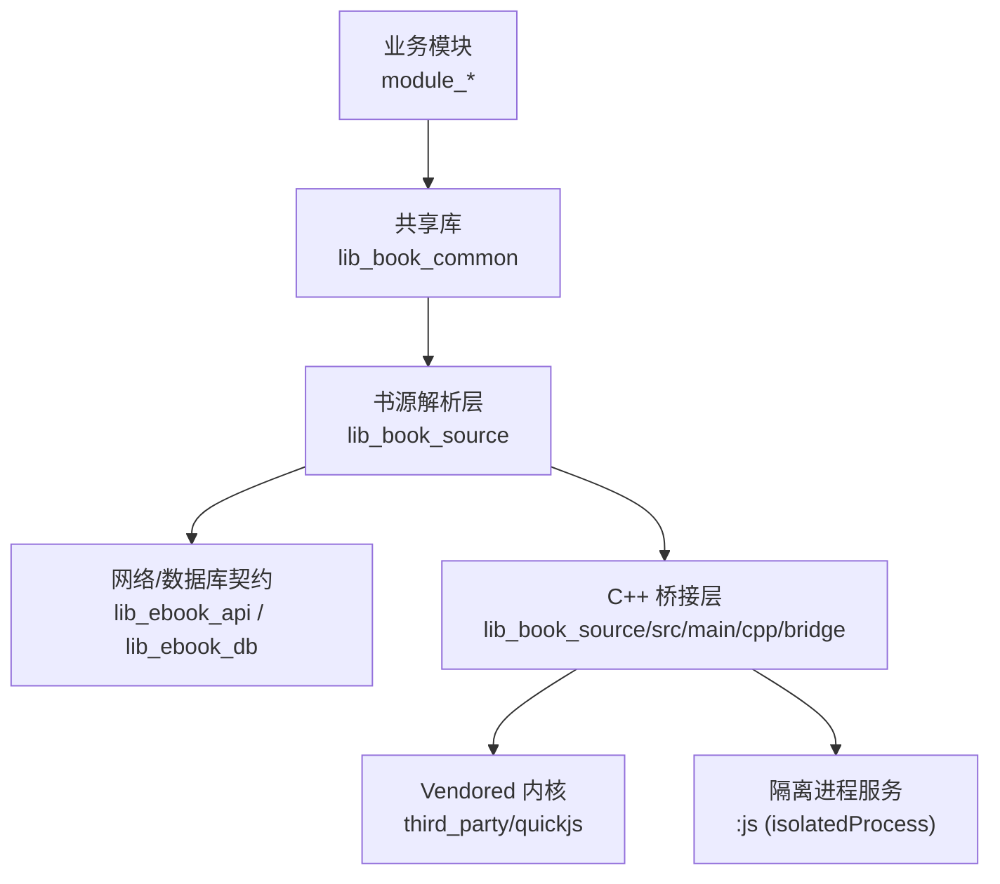
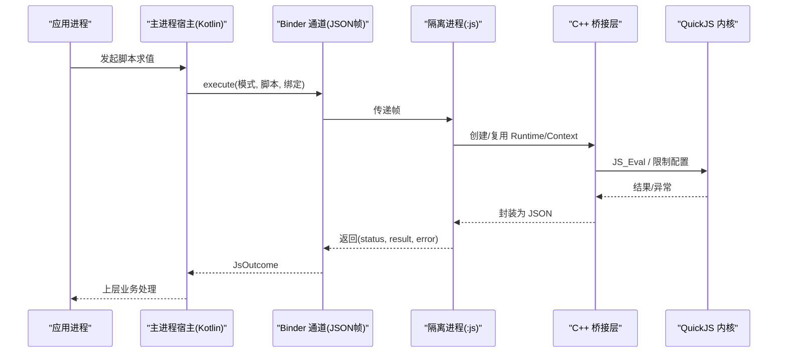
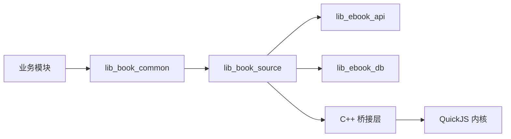

# QuickJS 引擎选择与评估

<cite>
**本文引用的文件**
- [README.MD](file://README.MD)
- [docs/adr/0028-untrusted-js-sandbox.md](file://docs/adr/0028-untrusted-js-sandbox.md)
- [docs/superpowers/plans/2026-09-09-js-sandbox-executor.md](file://docs/superpowers/plans/2026-09-09-js-sandbox-executor.md)
- [lib_book_source/build.gradle.kts](file://lib_book_source/build.gradle.kts)
- [scripts/build-desktop-js.sh](file://scripts/build-desktop-js.sh)
- [third_party/quickjs/PIN.sha256](file://third_party/quickjs/PIN.sha256)
- [third_party/quickjs/VERSION](file://third_party/quickjs/VERSION)
- [lib_book_source/src/androidTest/java/com/ebook/source/sandbox/QuickJsBridgeTest.kt](file://lib_book_source/src/androidTest/java/com/ebook/source/sandbox/QuickJsBridgeTest.kt)
- [lib_book_source/src/androidTest/java/com/ebook/source/sandbox/SandboxConnectionTest.kt](file://lib_book_source/src/androidTest/java/com/ebook/source/sandbox/SandboxConnectionTest.kt)
</cite>

## 目录
1. [引言](#引言)
2. [项目结构与集成位置](#项目结构与集成位置)
3. [核心组件](#核心组件)
4. [架构总览](#架构总览)
5. [详细组件分析](#详细组件分析)
6. [依赖关系分析](#依赖关系分析)
7. [性能考量](#性能考量)
8. [故障排查指南](#故障排查指南)
9. [结论](#结论)
10. [附录](#附录)

## 引言
本技术决策文档聚焦于“为何在多个 JavaScript 引擎候选中最终选择 QuickJS”，并基于仓库内事实源（ADR、计划文档、构建脚本、vendored 源码与测试）梳理评估过程与落地方案。内容覆盖体积与启动开销、C 接口简洁性、许可证兼容性、Android NDK 支持度、安全隔离策略、vendored 集成原则，以及横向对比与迁移风险评估。

## 项目结构与集成位置
本项目将脚本书源解析与执行作为独立能力层，位于 lib_book_source 模块；引擎内核以 vendored 方式置于 third_party/quickjs，并通过 C++ 桥接层在本仓首个原生模块中集成，运行于 Android isolatedProcess 沙箱进程，由 Kotlin 侧的 Binder + JSON 协议控制。

图表来源
- [lib_book_source/build.gradle.kts:1-31](file://lib_book_source/build.gradle.kts#L1-L31)
- [docs/superpowers/plans/2026-09-09-js-sandbox-executor.md:1-10](file://docs/superpowers/plans/2026-09-09-js-sandbox-executor.md#L1-L10)

章节来源
- [README.MD:86-118](file://README.MD#L86-L118)
- [lib_book_source/build.gradle.kts:1-31](file://lib_book_source/build.gradle.kts#L1-L31)

## 核心组件
- Vendored QuickJS 内核：冻结版本 2026-06-04，SHA256 校验通过，仅包含必要子集（不含 libc/大数等），通过 PIN.sha256 锁定。
- C++ 桥接层：负责 runtime/context 生命周期、四项限值开关、泛型 host call 出口；对上层隐藏 Binder/白名单细节。
- 隔离进程服务（:js）：声明 android:isolatedProcess="true"，零权限、deny-by-default，通过 Binder + JSON 帧通信。
- Kotlin 协议与能力：帧编解码、Host API 白名单表、主进程受限网络代理、递归规则求值回调、toast→日志映射。
- 构建工具链：NDK r28 + CMake 3.22.1；release 仅 arm64-v8a，debug 放宽 x86_64；桌面开发库由 scripts/build-desktop-js.sh 生成。

章节来源
- [third_party/quickjs/PIN.sha256:1-18](file://third_party/quickjs/PIN.sha256#L1-L18)
- [third_party/quickjs/VERSION:1-1](file://third_party/quickjs/VERSION#L1-L1)
- [docs/superpowers/plans/2026-09-09-js-sandbox-executor.md:7-10](file://docs/superpowers/plans/2026-09-09-js-sandbox-executor.md#L7-L10)
- [scripts/build-desktop-js.sh:1-16](file://scripts/build-desktop-js.sh#L1-L16)

## 架构总览
整体采用“内核 → 桥 → 协议与能力”三层分离，执行器进程与主进程通过 Binder 进行受控交互。主进程永不加载引擎，所有不可信代码仅在隔离进程执行。

图表来源
- [docs/superpowers/plans/2026-09-09-js-sandbox-executor.md:15-21](file://docs/superpowers/plans/2026-09-09-js-sandbox-executor.md#L15-L21)
- [docs/adr/0028-untrusted-js-sandbox.md:14-37](file://docs/adr/0028-untrusted-js-sandbox.md#L14-L37)

## 详细组件分析

### 引擎选型评估与决策
- 候选与取舍
  - V8：性能强但体积与攻击面大、集成重，不适合移动端轻量嵌入与严格的安全边界。
  - SpiderMonkey/Rhino：生态或行为档案不满足目标需求（Rhino 主流生态已弃用其行为档案）。
  - WebView：能力过剩且自带浏览器攻击面，不适合作为受限执行环境。
  - QuickJS：体积小、启动开销低、C 集成简单、MIT 许可兼容，内核久经考验，易于自集成与审计。
- 关键指标依据
  - 体积与启动：QuickJS 内核精简、无 libc，启动代价可控；相较 V8 数 MB 体量更适配移动端。
  - C 接口：提供清晰的最小 API 集合（Runtime/Context/Eval/JSON/栈/中断），便于封装与限流。
  - 许可证：MIT 与项目 Apache-2.0 兼容，无额外约束。
  - Android NDK：通过 NDK/CMake 直接编译，release 仅保留 arm64-v8a，降低包体与可研究面。
  - 安全：isolatedProcess + deny-by-default + 白名单 Host API + 资源四件套（超时/堆/栈/报文）。

章节来源
- [docs/adr/0028-untrusted-js-sandbox.md:14-56](file://docs/adr/0028-untrusted-js-sandbox.md#L14-L56)
- [docs/superpowers/plans/2026-09-09-js-sandbox-executor.md:31-48](file://docs/superpowers/plans/2026-09-09-js-sandbox-executor.md#L31-L48)

### 安全与隔离设计
- 进程级隔离：android:isolatedProcess="true"，内核强制零权限（无网络/文件/App 数据）。
- 运行时自检：onBind 验证是否真正隔离，非隔离则拒绝绑定，避免误判导致边界失效。
- 能力模型：deny-by-default，仅暴露 ECMAScript 标准能力与显式注册的 Host API（纯计算类走同进程 JNI，网络类经主进程受限代理）。
- 资源限制：wall-clock 超时、堆上限、JS 栈上限、请求/响应大小上限；超限销毁 runtime，必要时杀进程并重连。
- 主进程不加载引擎：System.loadLibrary 仅存在于执行器桥接层初始化路径，主进程无任何加载点。

章节来源
- [docs/adr/0028-untrusted-js-sandbox.md:14-39](file://docs/adr/0028-untrusted-js-sandbox.md#L14-L39)

### Vendored 源码集成与组织原则
- 冻结版本与校验：third_party/quickjs/VERSION 固定为 2026-06-04；PIN.sha256 锁定各源文件哈希，确保可复现与安全基线。
- 最小化内核：不包含 quickjs-libc.c（POSIX/os.*）、大数库等，避免引入不必要能力面。
- 构建口径：NDK r28 + CMake 3.22.1；release 仅 arm64-v8a；debug 放宽 x86_64 用于模拟器；ABI 集合属安全语义而非构建细节。
- 桌面开发支持：scripts/build-desktop-js.sh 生成桌面动态库供 DesktopJsHostTest 使用，Windows 需 MinGW-w64。

章节来源
- [third_party/quickjs/VERSION:1-1](file://third_party/quickjs/VERSION#L1-L1)
- [third_party/quickjs/PIN.sha256:1-18](file://third_party/quickjs/PIN.sha256#L1-L18)
- [docs/superpowers/plans/2026-09-09-js-sandbox-executor.md:31-48](file://docs/superpowers/plans/2026-09-09-js-sandbox-executor.md#L31-L48)
- [scripts/build-desktop-js.sh:1-16](file://scripts/build-desktop-js.sh#L1-L16)

### 构建与 ABI 管理
- 约定插件：xrn1997.android.native 统一 NDK/CMake 配置，error(...) 硬失败防止静默空转。
- ABI 策略：release 仅 arm64-v8a；debug 在模块内显式放宽 x86_64，使“多带一份内核”可见。
- 混淆与保留：HostDispatcher 通过类名+方法名字符串查找，需在 consumer-rules.pro 显式 keep，避免 R8 改名导致崩溃。

章节来源
- [lib_book_source/build.gradle.kts:1-31](file://lib_book_source/build.gradle.kts#L1-L31)
- [docs/adr/0028-untrusted-js-sandbox.md:39-44](file://docs/adr/0028-untrusted-js-sandbox.md#L39-L44)

### 测试与验证
- 集成测试：QuickJsBridgeTest、SandboxConnectionTest 覆盖桥接与连接流程。
- 桌面真内核用例：DesktopJsHostTest 通过 buildDesktopJsLib 任务生成动态库并加载，缺席时跳过。
- 协议与限制：JsProtocolTest 校验状态映射与字节上限；SandboxTaskRunnerTest 覆盖多种失败状态分支。

章节来源
- [lib_book_source/build.gradle.kts:71-111](file://lib_book_source/build.gradle.kts#L71-L111)
- [lib_book_source/src/androidTest/java/com/ebook/source/sandbox/QuickJsBridgeTest.kt](file://lib_book_source/src/androidTest/java/com/ebook/source/sandbox/QuickJsBridgeTest.kt)
- [lib_book_source/src/androidTest/java/com/ebook/source/sandbox/SandboxConnectionTest.kt](file://lib_book_source/src/androidTest/java/com/ebook/source/sandbox/SandboxConnectionTest.kt)

## 依赖关系分析
- 模块依赖方向：业务模块 → lib_book_common → lib_book_source → lib_ebook_api / lib_ebook_db。
- 引擎依赖：lib_book_source 引入 C++ 桥接层与 vendored QuickJS；依赖 NDK/CMake 约定插件；桌面测试依赖 buildDesktopJsLib 产物。
- 外部依赖：仅 JDK 加密/编码能力（MessageDigest/Cipher/Base64/HexFormat）用于 Host API；OkHttp 由契约层提供。

图表来源
- [README.MD:86-118](file://README.MD#L86-L118)
- [lib_book_source/build.gradle.kts:33-50](file://lib_book_source/build.gradle.kts#L33-L50)

章节来源
- [README.MD:86-118](file://README.MD#L86-L118)
- [lib_book_source/build.gradle.kts:33-50](file://lib_book_source/build.gradle.kts#L33-L50)

## 性能考量
- 启动与体积：QuickJS 内核精简、无 libc，较 V8 数 MB 体量更小，启动开销更低，适合移动端频繁调用场景。
- 执行模型：单帧串行执行（binder 线程池至多 15 条线程），避免多并发下内存记账失控；瓶颈在网络 IO，CPU 并行收益有限。
- 资源限制：墙钟超时、堆/栈/报文上限保障稳定；每次 execute 重建 Context（全局量重置），跨段污染不可达。
- 基准与回归：通过语料录制与回放、Golden Test 与单元测试覆盖常见解析路径；性能回归可通过新增基准用例与覆盖率检查。

章节来源
- [docs/adr/0028-untrusted-js-sandbox.md:45-56](file://docs/adr/0028-untrusted-js-sandbox.md#L45-L56)
- [docs/superpowers/plans/2026-09-09-js-sandbox-executor.md:15-21](file://docs/superpowers/plans/2026-09-09-js-sandbox-executor.md#L15-L21)

## 故障排查指南
- 沙箱不可用：若 isolatedProcess 未生效或自检失败，bindService 返回 null，客户端抛出“不可用”异常；检查清单属性与 onBind 判据。
- 连接超时：区分 bindTimeoutMs（2 秒）与规则挂钟预算；连接失败尽快回退，避免冷启动阻塞整条规则。
- 内存/栈超限：分配被拒后的小额分配可能无法产出完整异常信息；按分配器侧拒绝对应“内存超限”；必要时重启进程。
- 主机 API 错误：Host API 白名单未注册或实现缺失会抛类型化异常；确认 JsHostApi 表与 JNI 映射一致。
- 构建问题：NDK/CMake 版本漂移会导致 .so 不可复现；遵循版本目录与约定插件；桌面库需 MinGW-w64 或 Linux gcc。

章节来源
- [docs/adr/0028-untrusted-js-sandbox.md:17-39](file://docs/adr/0028-untrusted-js-sandbox.md#L17-L39)
- [docs/superpowers/plans/2026-09-09-js-sandbox-executor.md:71-111](file://docs/superpowers/plans/2026-09-09-js-sandbox-executor.md#L71-L111)

## 结论
本项目基于安全、体积、启动开销、集成复杂度与许可兼容性等多维权衡，选择 QuickJS 作为脚本书源的执行内核，并以 vendored + 自研桥接层的方式深度集成到 Android 隔离进程中。该方案在保证“执行陌生人代码”的安全边界前提下，提供了可控的资源限制与稳定的执行模型；后续可根据真实负载调整并发度与白名单宽松度，并在性能不足时再评估替换为更强性能的引擎。

## 附录

### 横向对比表（基于仓库事实源）
- 体积与启动：QuickJS 体积小、启动开销低；V8 体量较大、集成重。
- C 接口：QuickJS 提供最小 API 集合，便于封装与限流。
- 许可证：QuickJS MIT，与 Apache-2.0 兼容。
- Android NDK：QuickJS 可直接 NDK 编译，release 仅 arm64-v8a。
- 安全隔离：QuickJS 配合 isolatedProcess + deny-by-default + 白名单 Host API + 资源四件套，形成多层防御。

章节来源
- [docs/adr/0028-untrusted-js-sandbox.md:14-56](file://docs/adr/0028-untrusted-js-sandbox.md#L14-L56)

### 迁移可行性与风险评估
- 迁移到其他引擎的可行性
  - 风险：需要重新实现桥接层与协议、重写资源限制与白名单逻辑；可能破坏现有安全边界。
  - 成本：NDA/许可兼容性、NDK 集成复杂度、包体增长、启动延迟上升。
  - 收益：仅在性能成为明确瓶颈时考虑（例如大量并发脚本执行场景）。
- 建议
  - 维持当前 QuickJS 方案为主；如需提升性能，优先优化并发度、白名单与网络代理效率。
  - 若必须迁移，先在小范围灰度验证，保持协议稳定，逐步替换桥接层与内核。

章节来源
- [docs/adr/0028-untrusted-js-sandbox.md:45-56](file://docs/adr/0028-untrusted-js-sandbox.md#L45-L56)