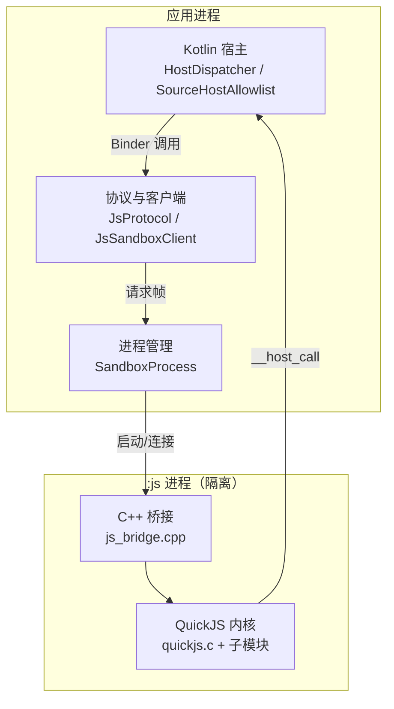
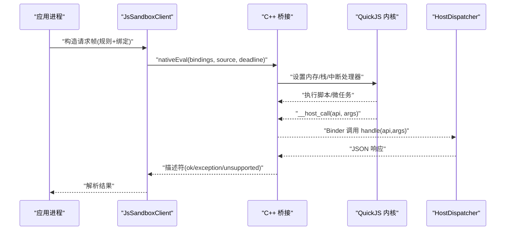
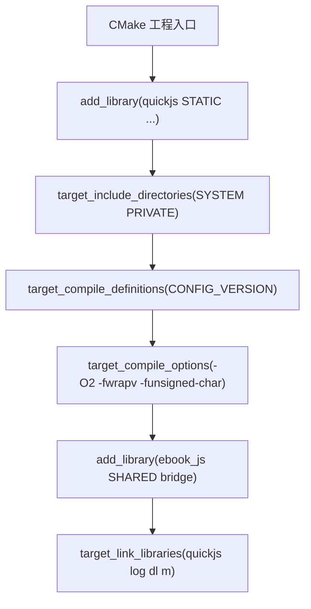
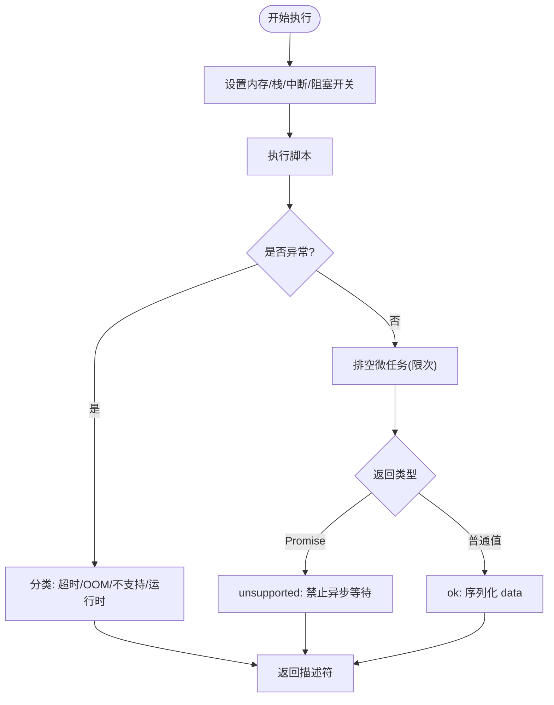
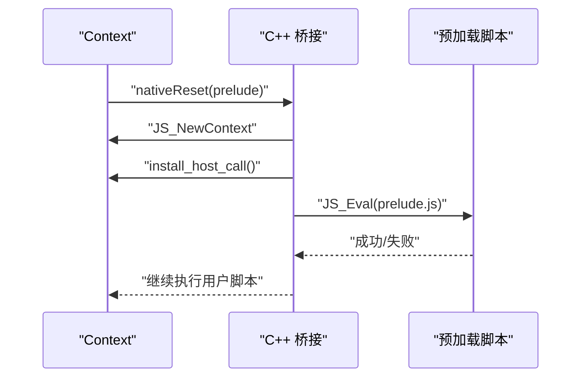
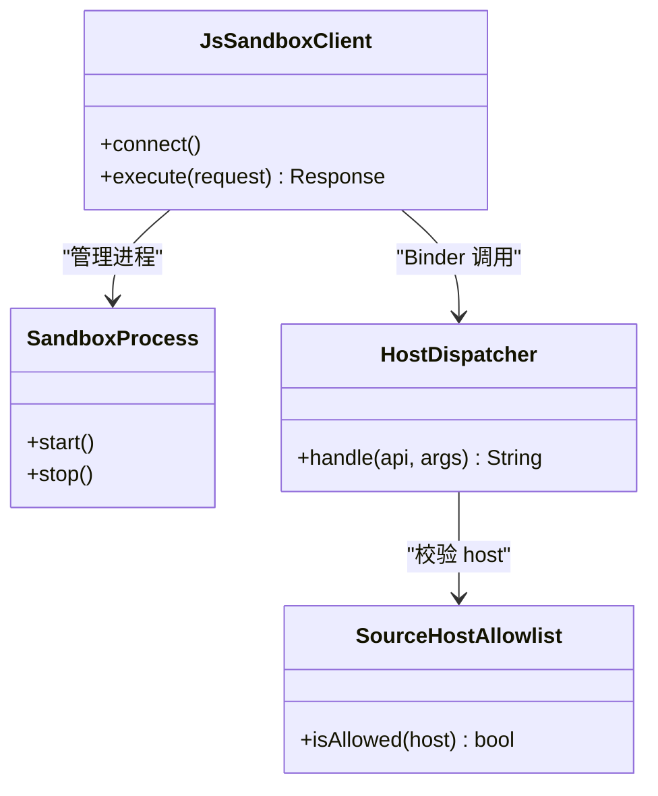
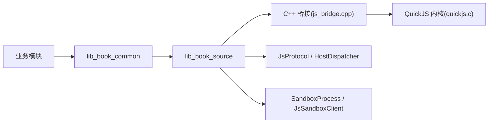

# QuickJS 引擎集成

<cite>
**本文引用的文件**
- [README.MD](file://README.MD)
- [third_party/quickjs/README.md](file://third_party/quickjs/README.md)
- [lib_book_source/src/main/cpp/CMakeLists.txt](file://lib_book_source/src/main/cpp/CMakeLists.txt)
- [lib_book_source/src/main/cpp/bridge/js_bridge.cpp](file://lib_book_source/src/main/cpp/bridge/js_bridge.cpp)
- [lib_book_source/src/main/java/com/ebook/source/sandbox/QuickJsNative.kt](file://lib_book_source/src/main/java/com/ebook/source/sandbox/QuickJsNative.kt)
- [lib_book_source/src/main/java/com/ebook/source/sandbox/QuickJsPrelude.kt](file://lib_book_source/src/main/java/com/ebook/source/sandbox/QuickJsPrelude.kt)
- [lib_book_source/src/main/java/com/ebook/source/sandbox/HostDispatcher.kt](file://lib_book_source/src/main/java/com/ebook/source/sandbox/HostDispatcher.kt)
- [lib_book_source/src/main/java/com/ebook/source/sandbox/SourceHostAllowlist.kt](file://lib_book_source/src/main/java/com/ebook/source/sandbox/SourceHostAllowlist.kt)
- [lib_book_source/src/main/java/com/ebook/source/sandbox/JsProtocol.kt](file://lib_book_source/src/main/java/com/ebook/source/sandbox/JsProtocol.kt)
- [lib_book_source/src/main/java/com/ebook/source/sandbox/JsRuntimeBridge.kt](file://lib_book_source/src/main/java/com/ebook/source/sandbox/JsRuntimeBridge.kt)
- [lib_book_source/src/main/java/com/ebook/source/sandbox/SandboxProcess.kt](file://lib_book_source/src/main/java/com/ebook/source/sandbox/SandboxProcess.kt)
- [lib_book_source/src/main/java/com/ebook/source/sandbox/JsSandboxClient.kt](file://lib_book_source/src/main/java/com/ebook/source/sandbox/JsSandboxClient.kt)
- [lib_book_source/src/androidTest/java/com/ebook/source/sandbox/QuickJsBridgeTest.kt](file://lib_book_source/src/androidTest/java/com/ebook/source/sandbox/QuickJsBridgeTest.kt)
</cite>

## 目录
1. [简介](#简介)
2. [项目结构](#项目结构)
3. [核心组件](#核心组件)
4. [架构总览](#架构总览)
5. [详细组件分析](#详细组件分析)
6. [依赖关系分析](#依赖关系分析)
7. [性能考量](#性能考量)
8. [故障排查指南](#故障排查指南)
9. [结论](#结论)
10. [附录](#附录)

## 简介
本技术文档聚焦于本项目中集成的 QuickJS 执行引擎，围绕“为何选择 QuickJS”“vendored 源码与构建”“安全加固”“JS 预加载脚本边界”“JNI 桥接层实现细节”“多平台构建与 ABI 支持”“调试方法”等维度展开。该方案在 lib_book_source 模块中以独立进程（:js）形式提供零权限沙箱执行环境，使不受信任的脚本书源能在严格资源限制下运行，同时通过 JNI 与主进程通信完成网络访问、日志、时间等受限能力调用。

**Section sources**
- [README.MD:86-118](file://README.MD#L86-L118)
- [third_party/quickjs/README.md:1-42](file://third_party/quickjs/README.md#L1-L42)

## 项目结构
QuickJS 相关代码由三部分构成：
- vendored 内核：third_party/quickjs/ 下的 C 源与头文件，保持上游原文不变，用于可审计与离线构建。
- 原生桥接层：lib_book_source/src/main/cpp/ 下的 C++ 桥接与 CMake 配置，负责运行时创建、内存/栈保护、超时中断、全局绑定与结果序列化。
- Kotlin 侧宿主与客户端：lib_book_source/src/main/java/com/ebook/source/sandbox/ 下的类，负责进程隔离、Binder 通道、协议编解码、白名单校验与回调分发。

**Diagram sources**
- [lib_book_source/src/main/cpp/bridge/js_bridge.cpp:49-57](file://lib_book_source/src/main/cpp/bridge/js_bridge.cpp#L49-L57)
- [lib_book_source/src/main/java/com/ebook/source/sandbox/HostDispatcher.kt](file://lib_book_source/src/main/java/com/ebook/source/sandbox/HostDispatcher.kt)
- [lib_book_source/src/main/java/com/ebook/source/sandbox/JsProtocol.kt](file://lib_book_source/src/main/java/com/ebook/source/sandbox/JsProtocol.kt)
- [lib_book_source/src/main/java/com/ebook/source/sandbox/JsSandboxClient.kt](file://lib_book_source/src/main/java/com/ebook/source/sandbox/JsSandboxClient.kt)
- [lib_book_source/src/main/java/com/ebook/source/sandbox/SandboxProcess.kt](file://lib_book_source/src/main/java/com/ebook/source/sandbox/SandboxProcess.kt)

**Section sources**
- [README.MD:96-118](file://README.MD#L96-L118)
- [third_party/quickjs/README.md:14-42](file://third_party/quickjs/README.md#L14-L42)
- [lib_book_source/src/main/cpp/CMakeLists.txt:1-38](file://lib_book_source/src/main/cpp/CMakeLists.txt#L1-L38)

## 核心组件
- vendored QuickJS 内核：保持上游原样，参与编译的单元为 quickjs.c、libregexp.c、libunicode.c、cutils.c、dtoa.c 及其头文件；明确排除 POSIX/worker/os.* 等系统能力，满足“零能力面”。
- C++ 桥接层：封装 runtime/context 生命周期、内存分配器接管、栈预算计算、超时中断、微任务队列控制、异常分类与描述符序列化、全局 __host_call 注入。
- Kotlin 宿主与客户端：进程隔离与连接、Binder 通道、请求/响应协议、白名单校验、回调路由、网络守护。

**Section sources**
- [lib_book_source/src/main/cpp/CMakeLists.txt:8-24](file://lib_book_source/src/main/cpp/CMakeLists.txt#L8-L24)
- [lib_book_source/src/main/cpp/bridge/js_bridge.cpp:91-107](file://lib_book_source/src/main/cpp/bridge/js_bridge.cpp#L91-L107)
- [lib_book_source/src/main/java/com/ebook/source/sandbox/HostDispatcher.kt](file://lib_book_source/src/main/java/com/ebook/source/sandbox/HostDispatcher.kt)
- [lib_book_source/src/main/java/com/ebook/source/sandbox/JsSandboxClient.kt](file://lib_book_source/src/main/java/com/ebook/source/sandbox/JsSandboxClient.kt)

## 架构总览
QuickJS 执行发生在独立的 :js 进程中，主进程通过 Binder 发起请求并等待结果。桥接层将 QuickJS 的运行状态、资源限额与异常统一为 JSON 描述符返回给 Kotlin 侧；脚本无法直接访问系统 API，所有外部能力通过 __host_call 经白名单放行后回主进程处理。

**Diagram sources**
- [lib_book_source/src/main/java/com/ebook/source/sandbox/JsSandboxClient.kt](file://lib_book_source/src/main/java/com/ebook/source/sandbox/JsSandboxClient.kt)
- [lib_book_source/src/main/cpp/bridge/js_bridge.cpp:696-820](file://lib_book_source/src/main/cpp/bridge/js_bridge.cpp#L696-L820)
- [lib_book_source/src/main/java/com/ebook/source/sandbox/HostDispatcher.kt](file://lib_book_source/src/main/java/com/ebook/source/sandbox/HostDispatcher.kt)

## 详细组件分析

### 为什么选择 QuickJS
- 体积小、启动开销低，适合频繁创建上下文与短生命周期脚本执行。
- C 集成简单，API 直观，便于以最小成本实现内存/栈/超时等安全策略。
- MIT 许可证，可 vendored 入仓，便于离线构建与审计。
- 与 Android 原生构建（NDK/AGP）兼容良好，可通过 CMake 静态库集成。

**Section sources**
- [third_party/quickjs/README.md:1-12](file://third_party/quickjs/README.md#L1-L12)
- [README.MD:96-118](file://README.MD#L96-L118)

### Vendored 源码与 CMake 构建
- 内核来源与版本锁定：third_party/quickjs/ 内保留 LICENSE、VERSION 与 PIN.sha256，保证可复现与可审计。
- 编译单元：仅包含必要的五个 C 源与对应头；明确排除 posix/worker/os.* 等系统能力，避免暴露底层资源。
- CMake 配置要点：
  - 定义 CONFIG_VERSION，供内核内部使用（如 DumpMemoryUsage）。
  - 通过 SYSTEM PRIVATE 引入第三方头，避免 Windows 大小写敏感冲突（VERSION 遮蔽 <version>）。
  - 不链接 pthread，bionic 自 API 23 起已将 pthread 放入 libc；atm 符号由 AGP 链接行追加。
  - 仅 arm64-v8a 作为 release 最小 ABI；x86_64 在 debug 按需放宽以满足模拟器。

**Diagram sources**
- [lib_book_source/src/main/cpp/CMakeLists.txt:1-38](file://lib_book_source/src/main/cpp/CMakeLists.txt#L1-L38)

**Section sources**
- [lib_book_source/src/main/cpp/CMakeLists.txt:4-38](file://lib_book_source/src/main/cpp/CMakeLists.txt#L4-L38)
- [third_party/quickjs/README.md:14-42](file://third_party/quickjs/README.md#L14-L42)

### 安全加固措施
- 禁用阻塞原语：通过 JS_SetCanBlock(rt, 0) 阻止 Atomics.wait 等可能阻塞线程的原语，避免执行器线程被挂起。
- 内存分配器接管：自定义 malloc/free/realloc/malloc_usable_size，按上限拒绝分配并记录“本次执行是否被拒过”，用于精准识别 OOM。
- 栈溢出保护：每次执行前按当前线程剩余栈计算预算（考虑页大小与 JNI/ART 开销），并通过 JS_SetMaxStackSize 限制内核栈深度，防止 SIGSEGV。
- 超时中断：基于单调时钟（含休眠口径）设定截止时间，配合中断回调强制终止长耗时执行。
- 微任务上限：对 pending job 轮询次数设置上限，防止 Promise 自驱动循环导致死循环。
- 异常分类与兜底：区分超时、OOM、不支持（如异步 Promise）、运行时错误；在 OOM 或 stringify 失败时仍返回稳定的描述符常量，避免空指针。

**Diagram sources**
- [lib_book_source/src/main/cpp/bridge/js_bridge.cpp:141-212](file://lib_book_source/src/main/cpp/bridge/js_bridge.cpp#L141-L212)
- [lib_book_source/src/main/cpp/bridge/js_bridge.cpp:214-281](file://lib_book_source/src/main/cpp/bridge/js_bridge.cpp#L214-L281)
- [lib_book_source/src/main/cpp/bridge/js_bridge.cpp:466-539](file://lib_book_source/src/main/cpp/bridge/js_bridge.cpp#L466-L539)
- [lib_book_source/src/main/cpp/bridge/js_bridge.cpp:696-820](file://lib_book_source/src/main/cpp/bridge/js_bridge.cpp#L696-L820)

**Section sources**
- [lib_book_source/src/main/cpp/bridge/js_bridge.cpp:91-107](file://lib_book_source/src/main/cpp/bridge/js_bridge.cpp#L91-L107)
- [lib_book_source/src/main/cpp/bridge/js_bridge.cpp:141-212](file://lib_book_source/src/main/cpp/bridge/js_bridge.cpp#L141-L212)
- [lib_book_source/src/main/cpp/bridge/js_bridge.cpp:214-281](file://lib_book_source/src/main/cpp/bridge/js_bridge.cpp#L214-L281)
- [lib_book_source/src/main/cpp/bridge/js_bridge.cpp:466-539](file://lib_book_source/src/main/cpp/bridge/js_bridge.cpp#L466-L539)
- [lib_book_source/src/main/cpp/bridge/js_bridge.cpp:696-717](file://lib_book_source/src/main/cpp/bridge/js_bridge.cpp#L696-L717)

### JS 预加载脚本与安全边界
- 预加载脚本作用：在每个 context 重建后执行，安装宿主函数（如 __host_call）与全局垫片，确保每轮执行具备一致的能力面。
- 安全边界：
  - 预加载脚本随包冻结、永不来自书源，其失败视为本仓缺陷并记录日志，不会静默失效。
  - 脚本可见的全局对象仅暴露受控能力；任何未显式装配的能力均不可用。
  - 脚本不允许返回 Promise（非同步），否则标记为 unsupported，避免跨进程等待与资源泄漏。
- 上下文初始化流程：
  - 新建 context → 安装 __host_call → 执行预加载脚本 → 绑定传入的 bindings → 执行规则脚本 → 收集结果/异常。

**Diagram sources**
- [lib_book_source/src/main/cpp/bridge/js_bridge.cpp:720-751](file://lib_book_source/src/main/cpp/bridge/js_bridge.cpp#L720-L751)
- [lib_book_source/src/main/cpp/bridge/js_bridge.cpp:639-651](file://lib_book_source/src/main/cpp/bridge/js_bridge.cpp#L639-L651)

**Section sources**
- [lib_book_source/src/main/cpp/bridge/js_bridge.cpp:720-751](file://lib_book_source/src/main/cpp/bridge/js_bridge.cpp#L720-L751)
- [lib_book_source/src/main/java/com/ebook/source/sandbox/QuickJsPrelude.kt](file://lib_book_source/src/main/java/com/ebook/source/sandbox/QuickJsPrelude.kt)

### JNI 桥接层实现细节
- 类型转换：
  - jstring → UTF-8 字节：通过 String.getBytes("UTF-8") 获取标准 UTF-8，避免修改版 UTF-8 导致的 emoji 乱码。
  - JSValue → JSON 字符串：使用内核 stringify，并对代理对采用 cesu8=1 输出，确保过 NewStringUTF 安全。
  - 绑定传递：bindings 以 JSON 形式传入，解析后挂到全局 __bindings，脚本读取字段而非拼接文本，避免引号/转义问题。
- 异常处理：
  - take_exception_descriptor 综合判断超时、OOM、裸 null/undefined、字符串化失败等分支，产出稳定描述符。
  - deliver 在 OOM 时使用全局缓存兜底串，避免连续 NewStringUTF 失败导致 NPE。
- 性能优化：
  - 局部引用管理：每条出口显式 DeleteLocalRef，避免 ART local reference table overflow。
  - 微任务轮询上限：防止 Promise 自驱动循环拖垮执行器。
  - 栈预算按线程实时计算：避免在不同 binder 线程上出现 SIGSEGV。
- 回调机制：
  - __host_call 仅做参数编码与调度，具体逻辑在主进程 HostDispatcher 处理，并遵守白名单策略。

**Section sources**
- [lib_book_source/src/main/cpp/bridge/js_bridge.cpp:333-383](file://lib_book_source/src/main/cpp/bridge/js_bridge.cpp#L333-L383)
- [lib_book_source/src/main/cpp/bridge/js_bridge.cpp:553-637](file://lib_book_source/src/main/cpp/bridge/js_bridge.cpp#L553-L637)
- [lib_book_source/src/main/cpp/bridge/js_bridge.cpp:764-820](file://lib_book_source/src/main/cpp/bridge/js_bridge.cpp#L764-L820)

### 进程隔离与通信
- 进程模型：:js 进程作为隔离执行环境，主进程通过 Binder 与之通信，脚本无法直接访问系统资源。
- 协议与数据帧：JsProtocol 定义请求/响应结构；JsSandboxClient 负责连接与重试；SandboxProcess 管理进程生命周期。
- 白名单与网络守护：SourceHostAllowlist 从源规则导出 host 白名单；GuardedNetwork 限制外呼范围。

**Diagram sources**
- [lib_book_source/src/main/java/com/ebook/source/sandbox/JsSandboxClient.kt](file://lib_book_source/src/main/java/com/ebook/source/sandbox/JsSandboxClient.kt)
- [lib_book_source/src/main/java/com/ebook/source/sandbox/SandboxProcess.kt](file://lib_book_source/src/main/java/com/ebook/source/sandbox/SandboxProcess.kt)
- [lib_book_source/src/main/java/com/ebook/source/sandbox/HostDispatcher.kt](file://lib_book_source/src/main/java/com/ebook/source/sandbox/HostDispatcher.kt)
- [lib_book_source/src/main/java/com/ebook/source/sandbox/SourceHostAllowlist.kt](file://lib_book_source/src/main/java/com/ebook/source/sandbox/SourceHostAllowlist.kt)

**Section sources**
- [lib_book_source/src/main/java/com/ebook/source/sandbox/JsSandboxClient.kt](file://lib_book_source/src/main/java/com/ebook/source/sandbox/JsSandboxClient.kt)
- [lib_book_source/src/main/java/com/ebook/source/sandbox/SandboxProcess.kt](file://lib_book_source/src/main/java/com/ebook/source/sandbox/SandboxProcess.kt)
- [lib_book_source/src/main/java/com/ebook/source/sandbox/HostDispatcher.kt](file://lib_book_source/src/main/java/com/ebook/source/sandbox/HostDispatcher.kt)
- [lib_book_source/src/main/java/com/ebook/source/sandbox/SourceHostAllowlist.kt](file://lib_book_source/src/main/java/com/ebook/source/sandbox/SourceHostAllowlist.kt)

### 构建配置要求与 ABI 支持
- 工具链：Android Studio 2025.1.3+、JDK 17、Gradle 9.4.1、AGP 9.2.1。
- 目标设备：compileSdk/targetSdk 37，minSdk 26。
- 原生构建：
  - CMake 最低版本 3.22.1。
  - 静态库 quickjs 不参与 PUBLIC 暴露头路径，避免 Windows 下 <version> 冲突。
  - release 最小 ABI 为 arm64-v8a；debug 可放宽至 x86_64 以支持模拟器。
  - 不链接 pthread；-latomic 由 AGP 链接行追加。

**Section sources**
- [README.MD:51-58](file://README.MD#L51-L58)
- [lib_book_source/src/main/cpp/CMakeLists.txt:1-38](file://lib_book_source/src/main/cpp/CMakeLists.txt#L1-L38)

## 依赖关系分析
- 模块依赖方向：业务模块 → lib_book_common → lib_book_source（含 QuickJS 沙箱）。
- 内部依赖：
  - js_bridge.cpp 依赖 quickjs.c 及子模块；不依赖 OS 层能力。
  - Kotlin 宿主/客户端依赖协议与进程管理，通过 Binder 与 :js 进程交互。
- 外部依赖：Android Log、dl、m；NDK bionic 提供基础符号。

**Diagram sources**
- [README.MD:86-118](file://README.MD#L86-L118)
- [lib_book_source/src/main/cpp/CMakeLists.txt:8-38](file://lib_book_source/src/main/cpp/CMakeLists.txt#L8-L38)

**Section sources**
- [README.MD:86-118](file://README.MD#L86-L118)
- [lib_book_source/src/main/cpp/CMakeLists.txt:8-38](file://lib_book_source/src/main/cpp/CMakeLists.txt#L8-L38)

## 性能考量
- 上下文复用：runtime 常驻，context 每个任务重建，降低重复初始化开销。
- 内存与栈保护：精确记账分配用量，结合线程栈预算，避免 SIGSEGV 与误杀正常脚本。
- 超时与微任务限流：防止长耗时与自驱动循环影响整体吞吐。
- 本地引用管理：避免 ART 局部引用表溢出导致的进程崩溃。
- ABI 最小化：release 仅 arm64-v8a，减少包体与攻击面。

[本节为通用指导，不直接分析具体文件]

## 故障排查指南
- 常见问题定位：
  - 超时：检查 deadline 设置与 on_interrupt 触发条件，确认单调时钟口径。
  - 内存超限：关注 oom_refused 标志与分配器拒绝路径；确认堆限额合理。
  - 栈溢出：核对 stack_budget 计算与线程栈大小；必要时调整 ceiling。
  - 异步限制：若脚本返回 Promise，将被标记 unsupported；需改为同步模式。
  - 主机回调失败：检查 HostDispatcher 是否就绪、白名单是否放行、Binder 通信是否正常。
- 验证用例：
  - 沙箱用例覆盖限值、中断、异常档案三类场景，建议升级内核后重跑。

**Section sources**
- [lib_book_source/src/androidTest/java/com/ebook/source/sandbox/QuickJsBridgeTest.kt](file://lib_book_source/src/androidTest/java/com/ebook/source/sandbox/QuickJsBridgeTest.kt)
- [lib_book_source/src/main/cpp/bridge/js_bridge.cpp:466-539](file://lib_book_source/src/main/cpp/bridge/js_bridge.cpp#L466-L539)
- [lib_book_source/src/main/cpp/bridge/js_bridge.cpp:696-820](file://lib_book_source/src/main/cpp/bridge/js_bridge.cpp#L696-L820)

## 结论
本项目通过 vendored QuickJS 与精心设计的 C++ 桥接层，在 Android 上实现了轻量、可审计、可配置的 JS 沙箱执行环境。借助内存/栈/超时/微任务等多维安全加固，以及严格的进程隔离与白名单机制，能够在零权限条件下安全地执行不受信任的脚本书源。Kotlin 侧的进程管理与协议设计保证了主进程与 :js 进程之间的高效、可靠通信。建议在升级内核或调整限额时，结合测试用例与日志进行回归验证。

[本节为总结性内容，不直接分析具体文件]

## 附录
- 关键文件清单与职责：
  - third_party/quickjs/：上游内核源码与元数据，保持原样。
  - lib_book_source/src/main/cpp/CMakeLists.txt：构建脚本，定义静态库与共享库目标。
  - lib_book_source/src/main/cpp/bridge/js_bridge.cpp：JNI 桥接、资源限制、异常分类与结果序列化。
  - lib_book_source/src/main/java/com/ebook/source/sandbox/*：进程管理、协议、宿主分发、客户端、白名单等。
- 调试建议：
  - 启用日志：关注桥接层 LOGE 与 Kotlin 侧日志，定位 Binder 调用与协议编解码问题。
  - 单测回归：运行 lib_book_source 的沙箱测试，确保限额、中断、异常行为符合预期。
  - 逐步缩小范围：先验证 nativeCreate/nativeReset/nativeEval 的基本链路，再扩展至 __host_call 与白名单。

**Section sources**
- [lib_book_source/src/main/cpp/CMakeLists.txt:1-38](file://lib_book_source/src/main/cpp/CMakeLists.txt#L1-L38)
- [lib_book_source/src/main/cpp/bridge/js_bridge.cpp:45-47](file://lib_book_source/src/main/cpp/bridge/js_bridge.cpp#L45-L47)
- [lib_book_source/src/androidTest/java/com/ebook/source/sandbox/QuickJsBridgeTest.kt](file://lib_book_source/src/androidTest/java/com/ebook/source/sandbox/QuickJsBridgeTest.kt)