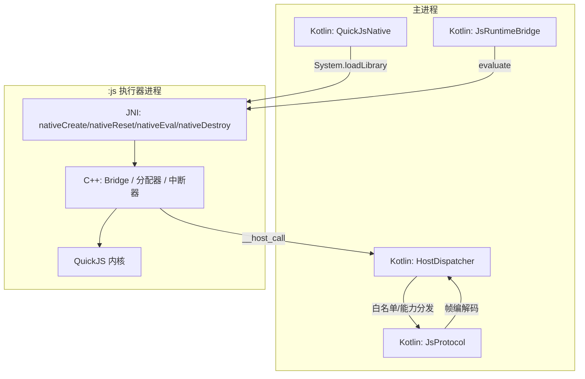
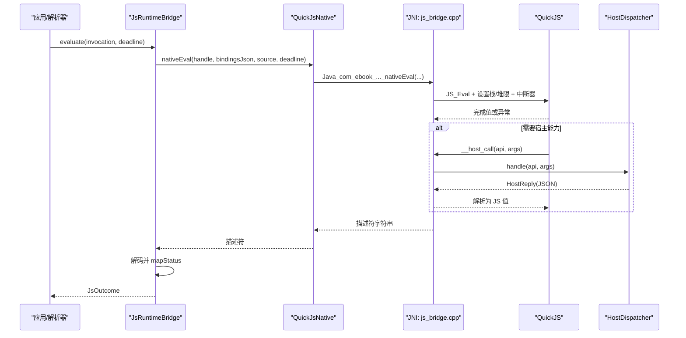
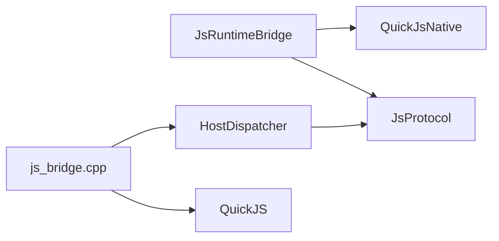
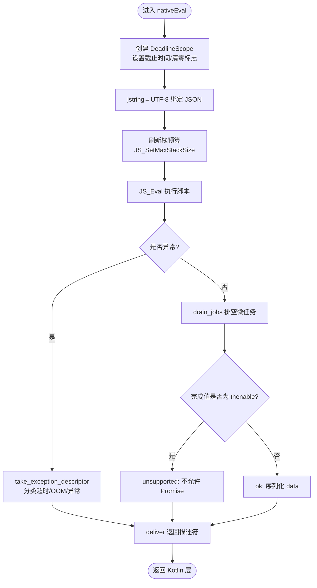

# 原生桥接层实现

<cite>
**本文引用的文件**
- [lib_book_source/src/main/java/com/ebook/source/sandbox/QuickJsNative.kt](file://lib_book_source/src/main/java/com/ebook/source/sandbox/QuickJsNative.kt)
- [lib_book_source/src/main/cpp/bridge/js_bridge.cpp](file://lib_book_source/src/main/cpp/bridge/js_bridge.cpp)
- [lib_book_source/src/main/java/com/ebook/source/sandbox/JsRuntimeBridge.kt](file://lib_book_source/src/main/java/com/ebook/source/sandbox/JsRuntimeBridge.kt)
- [lib_book_source/src/main/java/com/ebook/source/sandbox/HostDispatcher.kt](file://lib_book_source/src/main/java/com/ebook/source/sandbox/HostDispatcher.kt)
- [lib_book_source/src/main/java/com/ebook/source/sandbox/JsProtocol.kt](file://lib_book_source/src/main/java/com/ebook/source/sandbox/JsProtocol.kt)
</cite>

## 目录
1. [简介](#简介)
2. [项目结构](#项目结构)
3. [核心组件](#核心组件)
4. [架构总览](#架构总览)
5. [详细组件分析](#详细组件分析)
6. [依赖关系分析](#依赖关系分析)
7. [性能考量](#性能考量)
8. [故障排查指南](#故障排查指南)
9. [结论](#结论)
10. [附录](#附录)

## 简介
本文件面向“脚本书源解析”中的原生桥接层，系统阐述 Kotlin 侧 QuickJsNative 与 C++ 侧 js_bridge.cpp 的设计与实现。重点覆盖：
- Kotlin external 函数声明、JNI 绑定、加载失败处理与生命周期管理
- C++ Bridge 结构体、JNI_OnLoad 初始化、runtime/context 管理机制
- 类型转换策略（UTF-8 编码、JSON 序列化、异常传递）
- 内存管理（ValueGuard RAII、分配器拦截、局部引用清理）
- 跨进程通信协议（描述符格式、错误分类、超时控制）
- JNI 调用栈优化、性能监控与调试技巧
- 常见问题诊断方法

## 项目结构
原生桥接层位于 lib_book_source 模块中，Kotlin 侧提供外部函数声明与运行时封装，C++ 侧实现 QuickJS 内核的包装、资源限制与宿主回调转发。

图表来源
- [lib_book_source/src/main/java/com/ebook/source/sandbox/QuickJsNative.kt:1-59](file://lib_book_source/src/main/java/com/ebook/source/sandbox/QuickJsNative.kt#L1-L59)
- [lib_book_source/src/main/java/com/ebook/source/sandbox/JsRuntimeBridge.kt:21-113](file://lib_book_source/src/main/java/com/ebook/source/sandbox/JsRuntimeBridge.kt#L21-L113)
- [lib_book_source/src/main/java/com/ebook/source/sandbox/HostDispatcher.kt:24-74](file://lib_book_source/src/main/java/com/ebook/source/sandbox/HostDispatcher.kt#L24-L74)
- [lib_book_source/src/main/java/com/ebook/source/sandbox/JsProtocol.kt:123-255](file://lib_book_source/src/main/java/com/ebook/source/sandbox/JsProtocol.kt#L123-L255)
- [lib_book_source/src/main/cpp/bridge/js_bridge.cpp:691-820](file://lib_book_source/src/main/cpp/bridge/js_bridge.cpp#L691-L820)

章节来源
- [lib_book_source/src/main/java/com/ebook/source/sandbox/QuickJsNative.kt:1-59](file://lib_book_source/src/main/java/com/ebook/source/sandbox/QuickJsNative.kt#L1-L59)
- [lib_book_source/src/main/cpp/bridge/js_bridge.cpp:691-820](file://lib_book_source/src/main/cpp/bridge/js_bridge.cpp#L691-L820)

## 核心组件
- Kotlin 侧
  - QuickJsNative：声明四个 external 函数，负责 .so 加载、创建/重置/销毁 runtime、执行脚本；集中记录加载结果与错误原因，供上层判定可用性。
  - JsRuntimeBridge：封装句柄生命周期、描述符解码、失败后的上下文重建；把绑定以 JSON 值传入并交由垫片落为全局量。
  - HostDispatcher：在 :js 进程内暴露 handle(api, argsJson)，做第二次白名单校验并分派到 compute/host 能力或回主进程中继。
  - JsProtocol：定义跨进程请求/响应帧、状态映射与 host call 帧，严格 JSON 形态约束。
- C++ 侧
  - Bridge 结构体：持有 JSRuntime/JSContext、死线、中断标志、堆 OOM 证据、栈上限等。
  - 分配器拦截：替换默认 malloc/free/realloc/usable_size，记录每次分配被拒，用于精准归类内存超限。
  - 中断器与超时：基于 CLOCK_BOOTTIME 的绝对截止时间，解释器轮询点返回非 0 即中止求值。
  - ValueGuard/Utf8Slice：RAII 释放 JSValue 与确保 UTF-8 结尾，避免越界与泄漏。
  - host_call：将 __host_call 挂入 globalThis，通过 JNI 调用 HostDispatcher.handle，并以 JSON 串往返。

章节来源
- [lib_book_source/src/main/java/com/ebook/source/sandbox/QuickJsNative.kt:1-59](file://lib_book_source/src/main/java/com/ebook/source/sandbox/QuickJsNative.kt#L1-L59)
- [lib_book_source/src/main/java/com/ebook/source/sandbox/JsRuntimeBridge.kt:21-113](file://lib_book_source/src/main/java/com/ebook/source/sandbox/JsRuntimeBridge.kt#L21-L113)
- [lib_book_source/src/main/java/com/ebook/source/sandbox/HostDispatcher.kt:24-74](file://lib_book_source/src/main/java/com/ebook/source/sandbox/HostDispatcher.kt#L24-L74)
- [lib_book_source/src/main/java/com/ebook/source/sandbox/JsProtocol.kt:123-255](file://lib_book_source/src/main/java/com/ebook/source/sandbox/JsProtocol.kt#L123-L255)
- [lib_book_source/src/main/cpp/bridge/js_bridge.cpp:85-107](file://lib_book_source/src/main/cpp/bridge/js_bridge.cpp#L85-L107)
- [lib_book_source/src/main/cpp/bridge/js_bridge.cpp:124-212](file://lib_book_source/src/main/cpp/bridge/js_bridge.cpp#L124-L212)
- [lib_book_source/src/main/cpp/bridge/js_bridge.cpp:272-296](file://lib_book_source/src/main/cpp/bridge/js_bridge.cpp#L272-L296)
- [lib_book_source/src/main/cpp/bridge/js_bridge.cpp:298-331](file://lib_book_source/src/main/cpp/bridge/js_bridge.cpp#L298-L331)
- [lib_book_source/src/main/cpp/bridge/js_bridge.cpp:586-637](file://lib_book_source/src/main/cpp/bridge/js_bridge.cpp#L586-L637)

## 架构总览
Kotlin 侧通过 QuickJsNative 加载 .so 并调用 nativeCreate 构建 runtime；每次任务前调用 nativeReset 重建 context 并预载垫片；nativeEval 传入绑定 JSON、完整脚本与截止时间；C++ 侧执行后返回统一描述符，JsRuntimeBridge 解码并映射为 JsStatus。若发生超时/内存/栈超限则自动 reset。脚本通过 __host_call 进入 HostDispatcher 进行能力分发，必要时再经 binder 回到主进程执行网络等受限操作。

图表来源
- [lib_book_source/src/main/java/com/ebook/source/sandbox/JsRuntimeBridge.kt:41-67](file://lib_book_source/src/main/java/com/ebook/source/sandbox/JsRuntimeBridge.kt#L41-L67)
- [lib_book_source/src/main/java/com/ebook/source/sandbox/QuickJsNative.kt:38-58](file://lib_book_source/src/main/java/com/ebook/source/sandbox/QuickJsNative.kt#L38-L58)
- [lib_book_source/src/main/cpp/bridge/js_bridge.cpp:764-820](file://lib_book_source/src/main/cpp/bridge/js_bridge.cpp#L764-L820)
- [lib_book_source/src/main/cpp/bridge/js_bridge.cpp:586-637](file://lib_book_source/src/main/cpp/bridge/js_bridge.cpp#L586-L637)
- [lib_book_source/src/main/java/com/ebook/source/sandbox/HostDispatcher.kt:47-73](file://lib_book_source/src/main/java/com/ebook/source/sandbox/HostDispatcher.kt#L47-L73)

## 详细组件分析

### Kotlin 侧 QuickJsNative：external 绑定与生命周期
- 设计要点
  - 使用 object 实例上的 external 函数，使 JNI 第二参数为 jobject，便于后续扩展。
  - System.loadLibrary 只执行一次，记录 loaded 与 loadError，避免重复加载与不可观测失败。
  - 暴露 nativeCreate/nativeReset/nativeEval/nativeDestroy，分别对应 runtime 创建、context 重建与脚本执行、销毁。
- 加载失败处理
  - 未加载时 JsRuntimeBridge 直接返回 UNAVAILABLE，不发起任何 native 调用，降低崩溃风险。
- 生命周期管理
  - ensureRuntime 仅在首次调用时创建并复位；reset 在失败路径上重建 context，失败则销毁整个 runtime 并置句柄为 0，下次重新建立。

章节来源
- [lib_book_source/src/main/java/com/ebook/source/sandbox/QuickJsNative.kt:17-58](file://lib_book_source/src/main/java/com/ebook/source/sandbox/QuickJsNative.kt#L17-L58)
- [lib_book_source/src/main/java/com/ebook/source/sandbox/JsRuntimeBridge.kt:93-113](file://lib_book_source/src/main/java/com/ebook/source/sandbox/JsRuntimeBridge.kt#L93-L113)

### C++ 侧 Bridge 与初始化流程
- JNI_OnLoad
  - 保存 JavaVM 引用，返回 JNI_VERSION_1_6。
- nativeCreate
  - 使用 JS_NewRuntime2 注入自定义分配器，设置堆上限、禁止阻塞原语、注册中断器与 opaque。
  - 栈上限暂存为 ceiling，不在创建时固定，避免线程无关导致的误判。
- nativeReset
  - 丢弃旧 context，新建 context，安装 __host_call，并执行预载垫片；失败则返回 false 触发上层重建。
- nativeEval
  - 设置每执行的 DeadlineScope，刷新栈预算，绑定 JSON 到全局 __bindings，执行脚本，排空微任务，读取 result 或完成值，返回描述符。
- nativeDestroy
  - 按 context → runtime → Bridge 顺序释放，防止中断器回调访问已释放对象。

章节来源
- [lib_book_source/src/main/cpp/bridge/js_bridge.cpp:691-718](file://lib_book_source/src/main/cpp/bridge/js_bridge.cpp#L691-L718)
- [lib_book_source/src/main/cpp/bridge/js_bridge.cpp:720-751](file://lib_book_source/src/main/cpp/bridge/js_bridge.cpp#L720-L751)
- [lib_book_source/src/main/cpp/bridge/js_bridge.cpp:764-820](file://lib_book_source/src/main/cpp/bridge/js_bridge.cpp#L764-L820)
- [lib_book_source/src/main/cpp/bridge/js_bridge.cpp:753-762](file://lib_book_source/src/main/cpp/bridge/js_bridge.cpp#L753-L762)

### 类型转换与异常传递
- UTF-8 处理
  - jstring_to_utf8 通过 String.getBytes("UTF-8") 获取字节数组，追加 '\0' 满足内核要求；避免 GetStringUTFChars 的修改版 UTF-8 导致代理对乱码。
  - to_json 使用 cesu8=1 过 JNI（NewStringUTF 接受），read_string_prop 使用标准 UTF-8 取回内核字符串，方向不同但均保证正确转义。
- JSON 序列化
  - 绑定以 JSON 对象形式传入，由垫片 __bind 落成全局量；完成值序列化为 JSON 文本作为描述符 data。
- 异常传递
  - take_exception_descriptor 优先判断超时与 OOM 证据（本次执行是否有分配被拒且异常无法描述），再区分 unsupported 与 exception；兜底常量避免 OOM 下再次分配失败。

章节来源
- [lib_book_source/src/main/cpp/bridge/js_bridge.cpp:325-357](file://lib_book_source/src/main/cpp/bridge/js_bridge.cpp#L325-L357)
- [lib_book_source/src/main/cpp/bridge/js_bridge.cpp:359-383](file://lib_book_source/src/main/cpp/bridge/js_bridge.cpp#L359-L383)
- [lib_book_source/src/main/cpp/bridge/js_bridge.cpp:466-520](file://lib_book_source/src/main/cpp/bridge/js_bridge.cpp#L466-L520)

### 内存管理与 RAII
- 分配器拦截
  - bridge_malloc/bridge_realloc/bridge_free 精确统计 malloc_size，超过 limit 即拒绝并标记 oom_refused，确保“内存超限”可被准确分类。
- ValueGuard RAII
  - 包装 JSValue，析构时自动 JS_FreeValue，避免多出口遗漏释放导致的内存泄漏。
- 局部引用清理
  - host_call 等 JNI 入口显式 DeleteLocalRef 每个局部引用，防止 ART 局部引用表溢出导致进程 abort。

章节来源
- [lib_book_source/src/main/cpp/bridge/js_bridge.cpp:124-212](file://lib_book_source/src/main/cpp/bridge/js_bridge.cpp#L124-L212)
- [lib_book_source/src/main/cpp/bridge/js_bridge.cpp:298-313](file://lib_book_source/src/main/cpp/bridge/js_bridge.cpp#L298-L313)
- [lib_book_source/src/main/cpp/bridge/js_bridge.cpp:586-637](file://lib_book_source/src/main/cpp/bridge/js_bridge.cpp#L586-L637)

### 跨进程通信协议
- 描述符格式
  - 成功：{kind:"ok", data:...}；异常：{kind:"exception", timedOut:false, errorName, errorMessage}；不支持：{kind:"unsupported", errorMessage}。
- 错误分类机制
  - JsProtocol.mapStatus 依据 kind/errorName/timedOut 映射为 JsStatus（OK/TIMEOUT/MEMORY/STACK/SYNTAX/RUNTIME/UNSUPPORTED_API）。
- 超时控制
  - 截止时间以 CLOCK_BOOTTIME 毫秒绝对值传入，中断器在每个解释器轮询点比较当前时间与截止时间，到达即中断；微任务队列有最大轮数上限，防止自驱动 Promise 循环。

章节来源
- [lib_book_source/src/main/java/com/ebook/source/sandbox/JsProtocol.kt:186-202](file://lib_book_source/src/main/java/com/ebook/source/sandbox/JsProtocol.kt#L186-L202)
- [lib_book_source/src/main/cpp/bridge/js_bridge.cpp:272-296](file://lib_book_source/src/main/cpp/bridge/js_bridge.cpp#L272-L296)
- [lib_book_source/src/main/cpp/bridge/js_bridge.cpp:522-539](file://lib_book_source/src/main/cpp/bridge/js_bridge.cpp#L522-L539)

### 宿主能力与白名单
- 两次校验
  - C++ 侧仅转发 __host_call；Kotlin 侧 HostDispatcher 再次按能力表校验，避免绕过垫片直接调用。
- 能力分派
  - 计算类能力走 HostCompute；需回主进程的走 relay 回调（由 SandboxService 装配），否则返回不可用提示。
- 协议边界
  - HostDispatcher.handle 必须保持签名稳定（名称与注解），R8 不可见此引用，需保留规则保护。

章节来源
- [lib_book_source/src/main/java/com/ebook/source/sandbox/HostDispatcher.kt:8-23](file://lib_book_source/src/main/java/com/ebook/source/sandbox/HostDispatcher.kt#L8-L23)
- [lib_book_source/src/main/java/com/ebook/source/sandbox/HostDispatcher.kt:47-73](file://lib_book_source/src/main/java/com/ebook/source/sandbox/HostDispatcher.kt#L47-L73)
- [lib_book_source/src/main/cpp/bridge/js_bridge.cpp:51-53](file://lib_book_source/src/main/cpp/bridge/js_bridge.cpp#L51-L53)
- [lib_book_source/src/main/cpp/bridge/js_bridge.cpp:653-687](file://lib_book_source/src/main/cpp/bridge/js_bridge.cpp#L653-L687)

## 依赖关系分析
- Kotlin 依赖
  - JsRuntimeBridge 依赖 QuickJsNative（external 绑定）、JsProtocol（帧/状态映射）、JsLimits（配额）。
  - HostDispatcher 依赖 JsHostApi（能力表）与 JsProtocol（host call 帧）。
- C++ 依赖
  - js_bridge.cpp 依赖 QuickJS 内核头与 Android NDK 工具；通过 JNI 调用 HostDispatcher.handle。
- 耦合度
  - 桥接层与业务解析器解耦：仅通过描述符与 JsOutcome 交换数据；协议集中在 JsProtocol，变更影响面可控。
- 潜在环与风险
  - HostDispatcher 与 JsProtocol 单向依赖；C++ 不感知业务语义，降低耦合。
  - 注意 R8 对静态方法名与签名的混淆防护，需保持 consumer-rules.pro 中相应 keep 规则。

图表来源
- [lib_book_source/src/main/java/com/ebook/source/sandbox/JsRuntimeBridge.kt:21-113](file://lib_book_source/src/main/java/com/ebook/source/sandbox/JsRuntimeBridge.kt#L21-L113)
- [lib_book_source/src/main/java/com/ebook/source/sandbox/HostDispatcher.kt:24-74](file://lib_book_source/src/main/java/com/ebook/source/sandbox/HostDispatcher.kt#L24-L74)
- [lib_book_source/src/main/java/com/ebook/source/sandbox/JsProtocol.kt:123-255](file://lib_book_source/src/main/java/com/ebook/source/sandbox/JsProtocol.kt#L123-L255)
- [lib_book_source/src/main/cpp/bridge/js_bridge.cpp:691-820](file://lib_book_source/src/main/cpp/bridge/js_bridge.cpp#L691-L820)

## 性能考量
- 栈预算动态计算
  - 每次执行前按当前线程剩余栈与配置天花板取较小值，避免 binder 线程栈大小变化导致 SIGSEGV。
- 微任务上限
  - MAX_PENDING_JOBS 限制 Promise 链式微任务数量，防止无限循环拖垮执行器。
- 零拷贝/少分配
  - utf8Length 直接遍历字符点计数，避免中间数组；deliver 在 OOM 时使用全局引用兜底，减少二次分配失败概率。
- JNI 开销
  - 宿主能力调用尽量批量化；避免在主线程阻塞等待，所有异步回主进程逻辑应在协程/线程池执行。
- 日志与监控
  - 原生侧仅记录“接线坏了”的关键错误；上层统一走 Logger，避免频繁 IO 影响性能。

[本节为通用指导，不直接分析具体文件]

## 故障排查指南
- 加载失败
  - 现象：isReady=false 或 loadError 不为空
  - 排查：确认 ABI 是否打包、.so 是否与 Kotlin 同步；检查 System.loadLibrary 异常信息
  - 参考路径
    - [lib_book_source/src/main/java/com/ebook/source/sandbox/QuickJsNative.kt:17-30](file://lib_book_source/src/main/java/com/ebook/source/sandbox/QuickJsNative.kt#L17-L30)
- 垫片装载失败
  - 现象：ensureRuntime 抛 SandboxProtocolException
  - 排查：QuickJsPrelude 与 js_bridge 版本不匹配；检查 prelude 源是否可读
  - 参考路径
    - [lib_book_source/src/main/java/com/ebook/source/sandbox/JsRuntimeBridge.kt:97-102](file://lib_book_source/src/main/java/com/ebook/source/sandbox/JsRuntimeBridge.kt#L97-L102)
    - [lib_book_source/src/main/cpp/bridge/js_bridge.cpp:733-750](file://lib_book_source/src/main/cpp/bridge/js_bridge.cpp#L733-L750)
- 超时
  - 现象：JsStatus.TIMEOUT
  - 排查：检查 deadlineMonoMs 是否正确传入；确认中断器是否在解释器轮询点生效
  - 参考路径
    - [lib_book_source/src/main/cpp/bridge/js_bridge.cpp:272-281](file://lib_book_source/src/main/cpp/bridge/js_bridge.cpp#L272-L281)
    - [lib_book_source/src/main/java/com/ebook/source/sandbox/JsProtocol.kt:186-190](file://lib_book_source/src/main/java/com/ebook/source/sandbox/JsProtocol.kt#L186-L190)
- 内存/栈超限
  - 现象：MEMORY/STACK
  - 排查：检查堆/栈上限配置；观察 oom_refused 标记；查看脚本是否存在大对象分配或深递归
  - 参考路径
    - [lib_book_source/src/main/cpp/bridge/js_bridge.cpp:124-212](file://lib_book_source/src/main/cpp/bridge/js_bridge.cpp#L124-L212)
    - [lib_book_source/src/main/cpp/bridge/js_bridge.cpp:259-270](file://lib_book_source/src/main/cpp/bridge/js_bridge.cpp#L259-L270)
    - [lib_book_source/src/main/java/com/ebook/source/sandbox/JsProtocol.kt:192-198](file://lib_book_source/src/main/java/com/ebook/source/sandbox/JsProtocol.kt#L192-L198)
- 宿主能力不可用
  - 现象：UNSUPPORTED_API 或执行器尚未连接
  - 排查：确认 HostDispatcher 能力表与垫片一致；检查 relay 是否已安装
  - 参考路径
    - [lib_book_source/src/main/java/com/ebook/source/sandbox/HostDispatcher.kt:52-73](file://lib_book_source/src/main/java/com/ebook/source/sandbox/HostDispatcher.kt#L52-L73)
    - [lib_book_source/src/main/cpp/bridge/js_bridge.cpp:653-687](file://lib_book_source/src/main/cpp/bridge/js_bridge.cpp#L653-L687)
- 响应过大
  - 现象：TOO_LARGE
  - 排查：检查 maxOutcomeBytes 阈值与脚本产出体积；考虑分页或流式处理
  - 参考路径
    - [lib_book_source/src/main/java/com/ebook/source/sandbox/JsProtocol.kt:159-168](file://lib_book_source/src/main/java/com/ebook/source/sandbox/JsProtocol.kt#L159-L168)

章节来源
- [lib_book_source/src/main/java/com/ebook/source/sandbox/QuickJsNative.kt:17-30](file://lib_book_source/src/main/java/com/ebook/source/sandbox/QuickJsNative.kt#L17-L30)
- [lib_book_source/src/main/java/com/ebook/source/sandbox/JsRuntimeBridge.kt:97-102](file://lib_book_source/src/main/java/com/ebook/source/sandbox/JsRuntimeBridge.kt#L97-L102)
- [lib_book_source/src/main/cpp/bridge/js_bridge.cpp:733-750](file://lib_book_source/src/main/cpp/bridge/js_bridge.cpp#L733-L750)
- [lib_book_source/src/main/cpp/bridge/js_bridge.cpp:272-281](file://lib_book_source/src/main/cpp/bridge/js_bridge.cpp#L272-L281)
- [lib_book_source/src/main/java/com/ebook/source/sandbox/JsProtocol.kt:186-198](file://lib_book_source/src/main/java/com/ebook/source/sandbox/JsProtocol.kt#L186-L198)
- [lib_book_source/src/main/cpp/bridge/js_bridge.cpp:124-212](file://lib_book_source/src/main/cpp/bridge/js_bridge.cpp#L124-L212)
- [lib_book_source/src/main/cpp/bridge/js_bridge.cpp:259-270](file://lib_book_source/src/main/cpp/bridge/js_bridge.cpp#L259-L270)
- [lib_book_source/src/main/java/com/ebook/source/sandbox/HostDispatcher.kt:52-73](file://lib_book_source/src/main/java/com/ebook/source/sandbox/HostDispatcher.kt#L52-L73)
- [lib_book_source/src/main/java/com/ebook/source/sandbox/JsProtocol.kt:159-168](file://lib_book_source/src/main/java/com/ebook/source/sandbox/JsProtocol.kt#L159-L168)

## 结论
本桥接层以“描述符+严格协议”为核心，将 Kotlin 与 C++ 的职责清晰划分：Kotlin 负责高层生命周期与协议映射，C++ 专注内核安全执行与资源限制。通过分配器拦截、栈预算动态计算、微任务上限与超时中断，实现对未知脚本的稳定隔离。HostDispatcher 的双次白名单校验与能力分派，确保了脚本能力的受控暴露。整体架构具备高可观测性、强容错性与可扩展性，适合大规模书源解析场景。

[本节为总结，不直接分析具体文件]

## 附录

### 关键流程图：nativeEval 执行路径

图表来源
- [lib_book_source/src/main/cpp/bridge/js_bridge.cpp:764-820](file://lib_book_source/src/main/cpp/bridge/js_bridge.cpp#L764-L820)
- [lib_book_source/src/main/cpp/bridge/js_bridge.cpp:522-539](file://lib_book_source/src/main/cpp/bridge/js_bridge.cpp#L522-L539)
- [lib_book_source/src/main/cpp/bridge/js_bridge.cpp:466-520](file://lib_book_source/src/main/cpp/bridge/js_bridge.cpp#L466-L520)