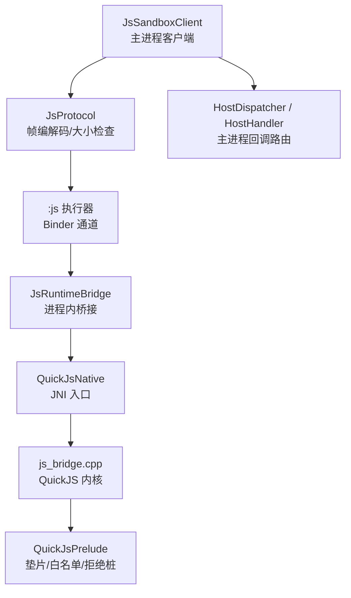
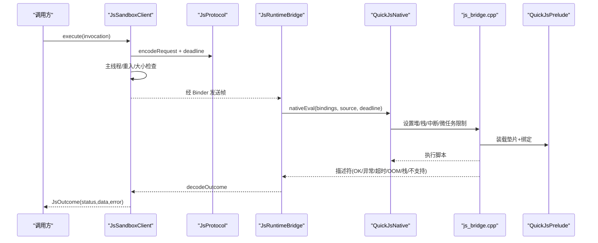
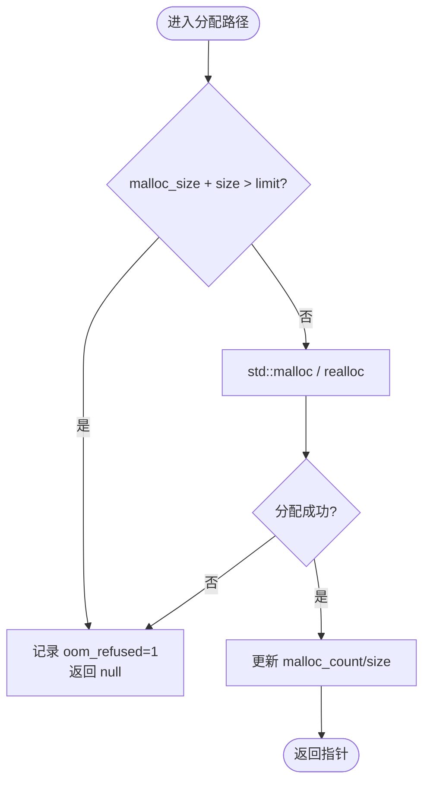
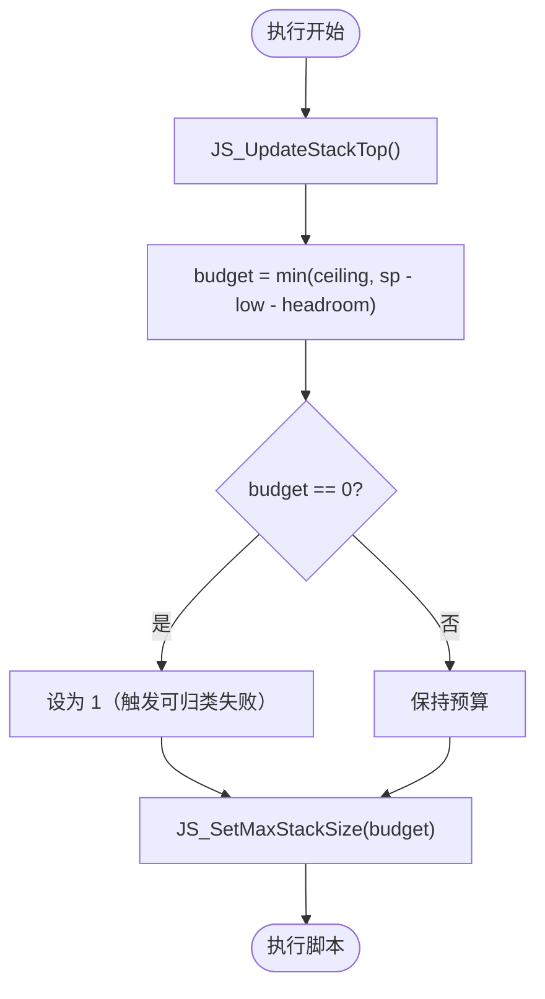
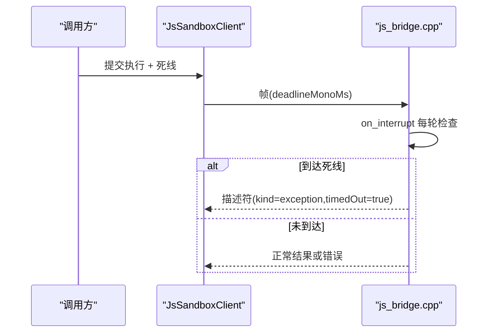
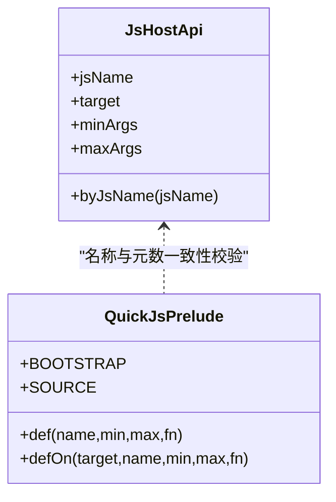
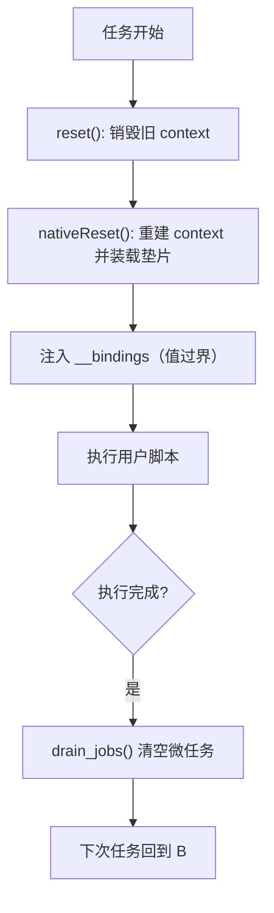
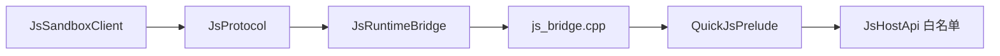

# 安全加固措施

<cite>
**本文引用的文件**   
- [JsLimits.kt](file://lib_book_source/src/main/java/com/ebook/source/sandbox/JsLimits.kt)
- [JsSandboxClient.kt](file://lib_book_source/src/main/java/com/ebook/source/sandbox/JsSandboxClient.kt)
- [JsProtocol.kt](file://lib_book_source/src/main/java/com/ebook/source/sandbox/JsProtocol.kt)
- [QuickJsPrelude.kt](file://lib_book_source/src/main/java/com/ebook/source/sandbox/QuickJsPrelude.kt)
- [JsRuntimeBridge.kt](file://lib_book_source/src/main/java/com/ebook/source/sandbox/JsRuntimeBridge.kt)
- [js_bridge.cpp](file://lib_book_source/src/main/cpp/bridge/js_bridge.cpp)
- [JsHostApi.kt](file://lib_book_source/src/main/java/com/ebook/source/script/JsHostApi.kt)
</cite>

## 目录
1. [简介](#简介)
2. [项目结构](#项目结构)
3. [核心组件](#核心组件)
4. [架构总览](#架构总览)
5. [详细组件分析](#详细组件分析)
6. [依赖关系分析](#依赖关系分析)
7. [性能考量](#性能考量)
8. [故障排查指南](#故障排查指南)
9. [结论](#结论)
10. [附录：安全威胁模型与测试建议](#附录安全威胁模型与测试建议)

## 简介
本文件聚焦于本项目中 QuickJS 沙箱的安全加固机制，围绕内存保护、栈溢出防护、执行时间控制、能力白名单、隔离边界五个维度，结合仓库内实现进行系统化说明。目标是让读者在不深入代码的前提下理解“如何限制不可信脚本对进程资源与宿主能力的访问”，并给出配置调优与监控告警建议。

## 项目结构
安全相关代码主要分布在 lib_book_source 模块的 sandbox 与 script 包中，以及 C++ 桥接层：
- Kotlin 侧负责跨进程协议、资源限额、请求/响应大小校验、主进程回调路由与重放策略。
- C++ 侧负责 QuickJS runtime/context 生命周期、分配器接管、堆/栈/中断/微任务控制、异常分类与结果序列化。
- 垫片（prelude）定义脚本可见能力、拒绝桩函数、参数元数校验与字节标记约定。

图示来源
- [JsSandboxClient.kt:35-185](file://lib_book_source/src/main/java/com/ebook/source/sandbox/JsSandboxClient.kt#L35-L185)
- [JsProtocol.kt:123-256](file://lib_book_source/src/main/java/com/ebook/source/sandbox/JsProtocol.kt#L123-L256)
- [JsRuntimeBridge.kt:21-113](file://lib_book_source/src/main/java/com/ebook/source/sandbox/JsRuntimeBridge.kt#L21-L113)
- [js_bridge.cpp:691-820](file://lib_book_source/src/main/cpp/bridge/js_bridge.cpp#L691-L820)
- [QuickJsPrelude.kt:21-256](file://lib_book_source/src/main/java/com/ebook/source/sandbox/QuickJsPrelude.kt#L21-L256)

章节来源
- [JsSandboxClient.kt:35-185](file://lib_book_source/src/main/java/com/ebook/source/sandbox/JsSandboxClient.kt#L35-L185)
- [JsProtocol.kt:123-256](file://lib_book_source/src/main/java/com/ebook/source/sandbox/JsProtocol.kt#L123-L256)
- [JsRuntimeBridge.kt:21-113](file://lib_book_source/src/main/java/com/ebook/source/sandbox/JsRuntimeBridge.kt#L21-L113)
- [js_bridge.cpp:691-820](file://lib_book_source/src/main/cpp/bridge/js_bridge.cpp#L691-L820)
- [QuickJsPrelude.kt:21-256](file://lib_book_source/src/main/java/com/ebook/source/sandbox/QuickJsPrelude.kt#L21-L256)

## 核心组件
- JsLimits：集中定义沙箱四项资源上限与通信帧上限，是“调校有地方调”的唯一来源。
- JsSandboxClient：主进程执行入口，负责死线计算、主线程守卫、回调重入保护、通道串行化与断连重放。
- JsProtocol：跨进程帧格式与失败归类，统一 UTF-8 长度计算与报文大小拦截。
- JsRuntimeBridge：进程内执行桥接，负责 runtime/context 创建、重置与绑定注入。
- js_bridge.cpp：QuickJS 内核定制——自定义分配器、堆/栈限制、中断器、微任务队列限制、异常分类。
- QuickJsPrelude：脚本能力装配点，包含白名单、拒绝桩、参数元数校验、字节标记约定。
- JsHostApi：白名单能力表，作为能力清单的事实源，供单测与装配一致性校验。

章节来源
- [JsLimits.kt:1-58](file://lib_book_source/src/main/java/com/ebook/source/sandbox/JsLimits.kt#L1-L58)
- [JsSandboxClient.kt:35-185](file://lib_book_source/src/main/java/com/ebook/source/sandbox/JsSandboxClient.kt#L35-L185)
- [JsProtocol.kt:123-256](file://lib_book_source/src/main/java/com/ebook/source/sandbox/JsProtocol.kt#L123-L256)
- [JsRuntimeBridge.kt:21-113](file://lib_book_source/src/main/java/com/ebook/source/sandbox/JsRuntimeBridge.kt#L21-L113)
- [js_bridge.cpp:91-107](file://lib_book_source/src/main/cpp/bridge/js_bridge.cpp#L91-L107)
- [QuickJsPrelude.kt:21-256](file://lib_book_source/src/main/java/com/ebook/source/sandbox/QuickJsPrelude.kt#L21-L256)
- [JsHostApi.kt:1-115](file://lib_book_source/src/main/java/com/ebook/source/script/JsHostApi.kt#L1-L115)

## 架构总览
下图展示一次脚本执行的端到端流程，涵盖主进程限流、跨进程传输、执行器内限时与资源限制、回调路由与结果回传。

图示来源
- [JsSandboxClient.kt:65-143](file://lib_book_source/src/main/java/com/ebook/source/sandbox/JsSandboxClient.kt#L65-L143)
- [JsProtocol.kt:127-169](file://lib_book_source/src/main/java/com/ebook/source/sandbox/JsProtocol.kt#L127-L169)
- [JsRuntimeBridge.kt:41-67](file://lib_book_source/src/main/java/com/ebook/source/sandbox/JsRuntimeBridge.kt#L41-L67)
- [js_bridge.cpp:764-820](file://lib_book_source/src/main/cpp/bridge/js_bridge.cpp#L764-L820)
- [QuickJsPrelude.kt:23-54](file://lib_book_source/src/main/java/com/ebook/source/sandbox/QuickJsPrelude.kt#L23-L54)

## 详细组件分析

### 内存保护机制：自定义分配器与 OOM 识别
- 自定义分配器：通过 bridge_malloc/free/realloc/malloc_usable_size 替换内核默认分配器，逐条记账 malloc_size 并在超过 malloc_limit 时拒绝分配，记录 oom_refused 标志。
- 堆限制检测：nativeCreate 时设置 JS_SetMemoryLimit(heapBytes)，配合分配器在超限处拒分配；Kotlin 侧再按 maxOutcomeBytes/maxRequestBytes 等做报文级拦截。
- OOM 识别与分类：take_exception_descriptor 综合判断——若本次执行存在分配被拒且异常无法提供有效信息（裸 null/undefined、无 message 或仅类名），则降级为 MEMORY；否则按 message 关键字区分 stack overflow/too deep 为 STACK。
- 关键要点：
  - 分配器口径必须与内核一致（usable size + 固定 overhead），避免限值漂移。
  - 即使堆到限，仍可尝试构造最小兜底描述符，确保返回值非空。

图示来源
- [js_bridge.cpp:141-205](file://lib_book_source/src/main/cpp/bridge/js_bridge.cpp#L141-L205)
- [js_bridge.cpp:466-519](file://lib_book_source/src/main/cpp/bridge/js_bridge.cpp#L466-L519)
- [JsProtocol.kt:186-202](file://lib_book_source/src/main/java/com/ebook/source/sandbox/JsProtocol.kt#L186-L202)

章节来源
- [js_bridge.cpp:141-205](file://lib_book_source/src/main/cpp/bridge/js_bridge.cpp#L141-L205)
- [js_bridge.cpp:466-519](file://lib_book_source/src/main/cpp/bridge/js_bridge.cpp#L466-L519)
- [JsProtocol.kt:186-202](file://lib_book_source/src/main/java/com/ebook/source/sandbox/JsProtocol.kt#L186-L202)
- [JsLimits.kt:13-42](file://lib_book_source/src/main/java/com/ebook/source/sandbox/JsLimits.kt#L13-L42)

### 栈溢出防护：预算计算与 SIGSEGV 预防
- 栈预算：每次执行前调用 JS_UpdateStackTop 刷新栈基线，并按当前线程剩余栈计算 budget = min(配置天花板, 剩余栈 - 头部预留)。
- 防 SIGSEGV：当剩余栈不足以支撑 native/JNI/Kotlin 栈开销时，budget 至少为 1，使下一次函数调用以可归类的 “stack overflow” 失败，而不是直接 SIGSEGV 崩溃整个 :js 进程。
- 线程差异：不同线程（应用新建线程、binder 线程、主线程）栈大小不同，因此预算必须在执行前按当前线程现算。

图示来源
- [js_bridge.cpp:259-270](file://lib_book_source/src/main/cpp/bridge/js_bridge.cpp#L259-L270)
- [js_bridge.cpp:779-784](file://lib_book_source/src/main/cpp/bridge/js_bridge.cpp#L779-L784)

章节来源
- [js_bridge.cpp:259-270](file://lib_book_source/src/main/cpp/bridge/js_bridge.cpp#L259-L270)
- [js_bridge.cpp:779-784](file://lib_book_source/src/main/cpp/bridge/js_bridge.cpp#L779-L784)

### 执行时间控制：死线与中断器
- 死线：主进程使用 SystemClock.elapsedRealtime() 计算绝对截止时间，随请求帧传入 :js 执行器；C++ 侧使用同口径时钟比较，避免各进程单调钟起点不一致。
- 中断处理器：on_interrupt 在每个解释器轮询点检查是否到达死线，返回非 0 让当前求值以 InternalError("interrupted") 结束。
- 微任务队列限制：drain_jobs 最多循环 MAX_PENDING_JOBS 次，防止自驱动 Promise 循环绕过 wall-clock 时限。
- 注意：中断器仅在解释器轮询点生效，阻塞中的 host call 由主进程侧超时与断连重放兜底。

图示来源
- [JsSandboxClient.kt:20-33](file://lib_book_source/src/main/java/com/ebook/source/sandbox/JsSandboxClient.kt#L20-L33)
- [js_bridge.cpp:272-281](file://lib_book_source/src/main/cpp/bridge/js_bridge.cpp#L272-L281)
- [js_bridge.cpp:522-539](file://lib_book_source/src/main/cpp/bridge/js_bridge.cpp#L522-L539)

章节来源
- [JsSandboxClient.kt:20-33](file://lib_book_source/src/main/java/com/ebook/source/sandbox/JsSandboxClient.kt#L20-L33)
- [js_bridge.cpp:272-281](file://lib_book_source/src/main/cpp/bridge/js_bridge.cpp#L272-L281)
- [js_bridge.cpp:522-539](file://lib_book_source/src/main/cpp/bridge/js_bridge.cpp#L522-L539)

### 能力白名单与拒绝桩
- 白名单事实源：JsHostApi 枚举是唯一能力清单，所有脚本可见方法必须在此表中登记。
- 装配与校验：QuickJsPrelude 的 def/defOn 将能力挂到 java 与对象面，并在 JS 侧做元数校验（minArgs/maxArgs）。
- 拒绝桩：__UNSUPPORTED__ 前缀约定用于明确拒绝的能力（登录/浏览器/持久层/批量外呼等），脚本调用即抛出带诊断信息的错误，而非 ReferenceError。
- 变量与 cookie：变量读写与 cookie 操作均走 Host API，受取页配额与白名单约束。

图示来源
- [JsHostApi.kt:17-111](file://lib_book_source/src/main/java/com/ebook/source/script/JsHostApi.kt#L17-L111)
- [QuickJsPrelude.kt:56-77](file://lib_book_source/src/main/java/com/ebook/source/sandbox/QuickJsPrelude.kt#L56-L77)
- [QuickJsPrelude.kt:190-195](file://lib_book_source/src/main/java/com/ebook/source/sandbox/QuickJsPrelude.kt#L190-L195)

章节来源
- [JsHostApi.kt:17-111](file://lib_book_source/src/main/java/com/ebook/source/script/JsHostApi.kt#L17-L111)
- [QuickJsPrelude.kt:56-77](file://lib_book_source/src/main/java/com/ebook/source/sandbox/QuickJsPrelude.kt#L56-L77)
- [QuickJsPrelude.kt:190-195](file://lib_book_source/src/main/java/com/ebook/source/sandbox/QuickJsPrelude.kt#L190-L195)

### 隔离边界：context 重建、全局污染防护与宿主回调权限
- context 重建策略：每次任务结束后 reset()，销毁并重建 context，清理由脚本产生的全局量、闭包与待办微任务，避免上下文污染影响下一条规则。
- 全局对象污染防护：垫片每次执行前置装载 __bindings，只暴露必要字段；方法挂在每次新建的对象上，避免旧对象残留。
- 宿主回调权限控制：所有宿主能力（网络、变量、cookie、递归规则求值等）必须经 Host API 白名单，主进程侧再次校验；回调期间打深度标记防止重入导致双向死锁。

图示来源
- [JsRuntimeBridge.kt:77-102](file://lib_book_source/src/main/java/com/ebook/source/sandbox/JsRuntimeBridge.kt#L77-L102)
- [QuickJsPrelude.kt:23-54](file://lib_book_source/src/main/java/com/ebook/source/sandbox/QuickJsPrelude.kt#L23-L54)
- [js_bridge.cpp:720-751](file://lib_book_source/src/main/cpp/bridge/js_bridge.cpp#L720-L751)
- [js_bridge.cpp:800-819](file://lib_book_source/src/main/cpp/bridge/js_bridge.cpp#L800-L819)

章节来源
- [JsRuntimeBridge.kt:77-102](file://lib_book_source/src/main/java/com/ebook/source/sandbox/JsRuntimeBridge.kt#L77-L102)
- [QuickJsPrelude.kt:23-54](file://lib_book_source/src/main/java/com/ebook/source/sandbox/QuickJsPrelude.kt#L23-L54)
- [js_bridge.cpp:720-751](file://lib_book_source/src/main/cpp/bridge/js_bridge.cpp#L720-L751)
- [js_bridge.cpp:800-819](file://lib_book_source/src/main/cpp/bridge/js_bridge.cpp#L800-L819)

## 依赖关系分析
- 主进程与执行器通过 JsProtocol 的 JSON 帧通信，帧大小在两端均做 UTF-8 字节数检查，避免解析阶段放大内存。
- 执行器内部依赖 js_bridge.cpp 提供的内存/栈/中断/微任务控制；Kotlin 侧不感知内核细节，只处理状态码与错误消息映射。
- 能力白名单在 Kotlin 与 JS 两侧保持一致：JsHostApi 是事实源，QuickJsPrelude 装配，并由单测锁定。

图示来源
- [JsProtocol.kt:123-256](file://lib_book_source/src/main/java/com/ebook/source/sandbox/JsProtocol.kt#L123-L256)
- [JsRuntimeBridge.kt:21-113](file://lib_book_source/src/main/java/com/ebook/source/sandbox/JsRuntimeBridge.kt#L21-L113)
- [js_bridge.cpp:691-820](file://lib_book_source/src/main/cpp/bridge/js_bridge.cpp#L691-L820)
- [QuickJsPrelude.kt:21-256](file://lib_book_source/src/main/java/com/ebook/source/sandbox/QuickJsPrelude.kt#L21-L256)
- [JsHostApi.kt:17-111](file://lib_book_source/src/main/java/com/ebook/source/script/JsHostApi.kt#L17-L111)

章节来源
- [JsProtocol.kt:123-256](file://lib_book_source/src/main/java/com/ebook/source/sandbox/JsProtocol.kt#L123-L256)
- [JsRuntimeBridge.kt:21-113](file://lib_book_source/src/main/java/com/ebook/source/sandbox/JsRuntimeBridge.kt#L21-L113)
- [js_bridge.cpp:691-820](file://lib_book_source/src/main/cpp/bridge/js_bridge.cpp#L691-L820)
- [QuickJsPrelude.kt:21-256](file://lib_book_source/src/main/java/com/ebook/source/sandbox/QuickJsPrelude.kt#L21-L256)
- [JsHostApi.kt:17-111](file://lib_book_source/src/main/java/com/ebook/source/script/JsHostApi.kt#L17-L111)

## 性能考量
- 单次执行串行化：JsSandboxClient 用 inFlight 锁保证同一时刻仅一帧在执行，避免多源并发争抢单一 runtime，代价由截止日期兜住排队超时。
- 报文大小限制：请求/响应/host 回复均按 UTF-8 字节数限制，避免 binder 事务缓冲溢出与解析放大。
- 微任务上限：MAX_PENDING_JOBS 防止 Promise 自驱动循环无限消耗 CPU。
- 栈预算动态调整：按当前线程剩余栈现算，避免深递归导致 SIGSEGV。
- 分配器记账：malloc_size 精确统计，减少误杀或越限风险。

[本节为通用性能讨论，不直接分析具体文件]

## 故障排查指南
- 超时：关注 JsStatus.TIMEOUT，检查 wallClockMs 与排队等待时间；确认主进程与执行器时钟同源（elapsedRealtime/CLOCK_BOOTTIME）。
- 内存超限：JsStatus.MEMORY，查看分配器 oom_refused 与 heapBytes；检查脚本是否存在大对象/正则回溯。
- 栈溢出：JsStatus.STACK，检查 stack_bytes 与当前线程栈大小；必要时降低 ceiling。
- 不支持能力：JsStatus.UNSUPPORTED_API，核对脚本调用是否在 JsHostApi 白名单内，或被 __UNSUPPORTED__ 前缀拒绝。
- 通道异常：UNAVAILABLE/TOO_LARGE，检查 binder 连接、重连重放与帧大小限制。

章节来源
- [JsProtocol.kt:186-202](file://lib_book_source/src/main/java/com/ebook/source/sandbox/JsProtocol.kt#L186-L202)
- [JsSandboxClient.kt:82-99](file://lib_book_source/src/main/java/com/ebook/source/sandbox/JsSandboxClient.kt#L82-L99)
- [js_bridge.cpp:466-519](file://lib_book_source/src/main/cpp/bridge/js_bridge.cpp#L466-L519)

## 结论
本项目通过“主进程限额 + 执行器内核限制 + 能力白名单 + 严格协议”的多层防御，构建了可审计、可观测、可恢复的 QuickJS 沙箱环境。内存、栈、时间与能力四个维度的限制相互配合，既保证了不可信脚本的资源边界，又提供了明确的失败分类与可操作的调优入口。建议在上线后持续收集 TIMEOUT/MEMORY/STACK/UNSUPPORTED_API 分布，结合真实源的失败率滚动调整 JsLimits，并完善监控告警。

[本节为总结性内容，不直接分析具体文件]

## 附录：安全威胁模型与测试建议

### 威胁模型与攻击面
- 资源耗尽：通过指数分配、深递归、Promise 自驱动循环耗尽 CPU/内存/栈。
- 能力逃逸：尝试调用未授权 API（Java 类、持久化、批量外呼等）。
- 协议绕过：利用帧过大、编码不当、时序问题绕过限制。
- 上下文污染：复用 context 导致全局量泄露、闭包残留。

### 安全测试用例建议
- 内存：
  - 构造超大字符串/数组，验证分配器拒分配与 MEMORY 分类。
  - 连续 realloc 逼近 malloc_limit，验证 oom_refused 标志与兜底描述符。
- 栈：
  - 深度递归测试，验证 stack overflow/too deep 分类与 SIGSEGV 未发生。
  - 在不同栈大小的线程上执行，验证 budget 动态调整。
- 时间：
  - 短 wallClockMs 下执行长循环，验证 TIMEOUT 分类与中断器生效。
  - 大量 .then 链与 await，验证 MAX_PENDING_JOBS 限制。
- 能力：
  - 调用白名单外 API，验证 UNSUPPORTED_API 与拒绝桩错误信息。
  - 参数个数不符，验证元数校验与友好错误提示。
- 协议：
  - 发送超大请求/响应帧，验证 TOO_LARGE 与 UTF-8 长度计算正确性。
  - 伪造帧形态，验证严格解码与 SandboxProtocolException 传播。

[本节为概念性建议，不直接分析具体文件]