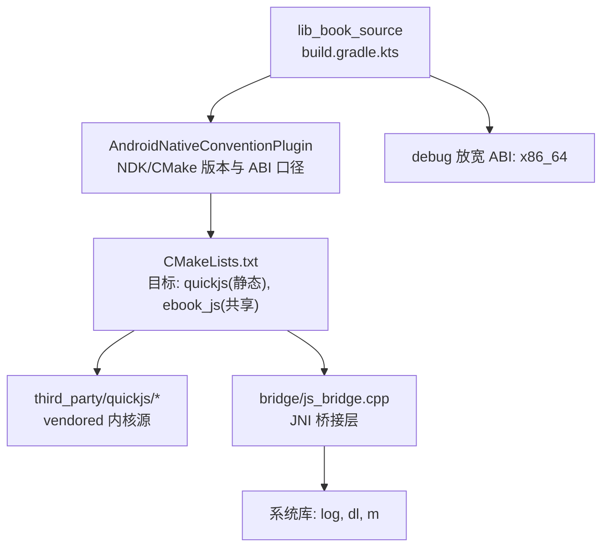
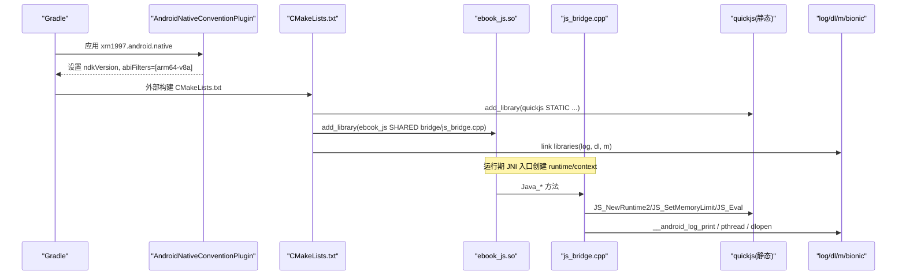
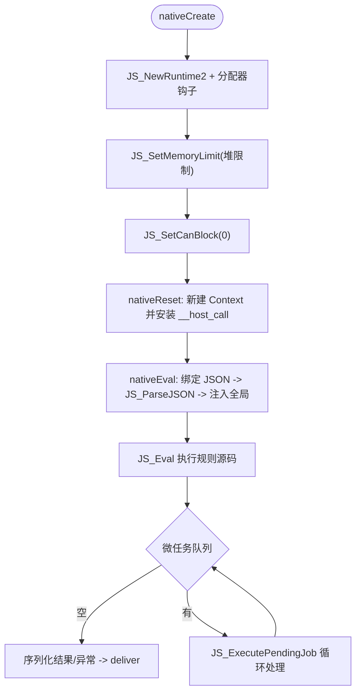
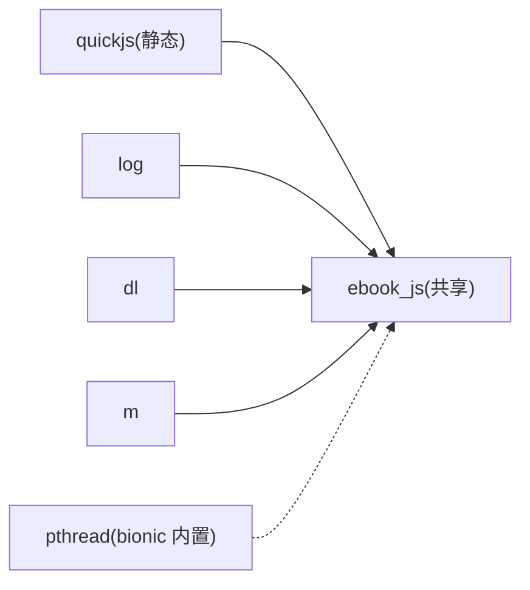

# 构建配置与ABI支持

<cite>
**本文引用的文件**
- [CMakeLists.txt](file://lib_book_source/src/main/cpp/CMakeLists.txt)
- [js_bridge.cpp](file://lib_book_source/src/main/cpp/bridge/js_bridge.cpp)
- [AndroidNativeConventionPlugin.kt](file://build-logic/convention/src/main/kotlin/AndroidNativeConventionPlugin.kt)
- [build.gradle.kts（lib_book_source）](file://lib_book_source/build.gradle.kts)
- [libs.versions.toml](file://gradle/libs.versions.toml)
- [build-desktop-js.sh](file://scripts/build-desktop-js.sh)
</cite>

## 目录
1. [简介](#简介)
2. [项目结构](#项目结构)
3. [核心组件](#核心组件)
4. [架构总览](#架构总览)
5. [详细组件分析](#详细组件分析)
6. [依赖关系分析](#依赖关系分析)
7. [性能考虑](#性能考虑)
8. [故障排查指南](#故障排查指南)
9. [结论](#结论)

## 简介
本文聚焦 QuickJS 在本仓库中的构建配置与 ABI 策略，覆盖以下主题：
- CMake 模块组织：vendored 源码集成、静态库 quickjs 构建、共享库 ebook_js 链接
- 编译选项：优化级别、警告控制、符号可见性、平台宏定义
- ABI 策略：release 最小集 arm64-v8a、x86_64 模拟器支持、多架构兼容
- 依赖管理：log 库、dl/m 系统库、pthread 符号解析与 bionic 集成
- 跨平台构建：Windows MinGW、Android NDK、桌面 gcc/g++ 差异
- 构建性能：增量编译与缓存建议
- 常见问题排查

## 项目结构
QuickJS 相关代码位于 lib_book_source 的 cpp 层，使用 CMake 进行原生构建；vendored 内核在 third_party/quickjs/；桥接层在 bridge/。Gradle 通过约定插件统一 NDK/CMake 配置，并在 debug 中放宽 x86_64 以支持模拟器调试。

图表来源
- [AndroidNativeConventionPlugin.kt:22-48](file://build-logic/convention/src/main/kotlin/AndroidNativeConventionPlugin.kt#L22-L48)
- [CMakeLists.txt:1-38](file://lib_book_source/src/main/cpp/CMakeLists.txt#L1-L38)
- [build.gradle.kts（lib_book_source）:13-17](file://lib_book_source/build.gradle.kts#L13-L17)

章节来源
- [CMakeLists.txt:1-38](file://lib_book_source/src/main/cpp/CMakeLists.txt#L1-L38)
- [AndroidNativeConventionPlugin.kt:22-48](file://build-logic/convention/src/main/kotlin/AndroidNativeConventionPlugin.kt#L22-L48)
- [build.gradle.kts（lib_book_source）:13-17](file://lib_book_source/build.gradle.kts#L13-L17)

## 核心组件
- vendored QuickJS 内核：以静态库 target quickjs 构建，包含 quickjs.c、libregexp.c、libunicode.c、cutils.c、dtoa.c
- JNI 桥接层：ebook_js 共享库，封装 runtime/context 生命周期、内存/栈限流、超时中断、JSON 编解码、宿主回调
- 构建配置：NDK/CMake 版本锁定、ABI 集合、头文件搜索路径、编译选项与宏定义

章节来源
- [CMakeLists.txt:8-38](file://lib_book_source/src/main/cpp/CMakeLists.txt#L8-L38)
- [js_bridge.cpp:91-107](file://lib_book_source/src/main/cpp/bridge/js_bridge.cpp#L91-L107)

## 架构总览
下图展示从 Gradle 到 CMake 再到运行时调用链的关键环节。

图表来源
- [AndroidNativeConventionPlugin.kt:34-41](file://build-logic/convention/src/main/kotlin/AndroidNativeConventionPlugin.kt#L34-L41)
- [CMakeLists.txt:8-38](file://lib_book_source/src/main/cpp/CMakeLists.txt#L8-L38)
- [js_bridge.cpp:691-718](file://lib_book_source/src/main/cpp/bridge/js_bridge.cpp#L691-L718)

## 详细组件分析

### CMakeLists.txt 模块组织与构建产物
- vendored 源码集成：通过相对路径定位 third_party/quickjs，并将核心源文件加入静态库 quickjs
- 头文件搜索路径：将 third_party 作为 SYSTEM PRIVATE 引入，避免上游 VERSION 文件在 Windows 大小写不敏感下遮蔽标准库头
- 静态库 quickjs：添加 -O2、-fwrapv、-funsigned-char、-Wall 及若干抑制警告项；定义 _GNU_SOURCE 与 CONFIG_VERSION
- 共享库 ebook_js：仅包含桥接层 js_bridge.cpp，并链接 quickjs、log、dl、m
- 可见性与警告：对 ebook_js 开启 -fvisibility=hidden，减少导出符号体积；保留 -Wall -Wextra 保证质量

章节来源
- [CMakeLists.txt:4-38](file://lib_book_source/src/main/cpp/CMakeLists.txt#L4-L38)

### 编译选项与平台宏
- 优化级别：-O2（内核与桥接层一致），兼顾速度与体积
- 警告控制：-Wall 用于内核；-Wall -Wextra 用于桥接层；部分无关告警被抑制以避免噪音
- 可见性：-fvisibility=hidden 降低 SO 导出面，减小体积并提升加载效率
- 平台宏：_GNU_SOURCE 启用 GNU 扩展；CONFIG_VERSION 为必需宏，供内核内存统计等逻辑拼接字符串
- 其他行为开关：-fwrapv/-funsigned-char 对齐内核期望的整数语义；bionic 集成下不显式链接 pthread

章节来源
- [CMakeLists.txt:18-33](file://lib_book_source/src/main/cpp/CMakeLists.txt#L18-L33)

### ABI 支持与多架构兼容
- release 最小集：由约定插件强制只输出 arm64-v8a，降低产物体积与可逆向风险
- 模拟器支持：在模块 debug 构建中额外放宽 x86_64，便于本地模拟器调试
- 桌面开发：提供脚本 build-desktop-js.sh 生成桌面动态库，Windows 要求 MinGW-w64，Linux 使用 gcc/g++

章节来源
- [AndroidNativeConventionPlugin.kt:34-48](file://build-logic/convention/src/main/kotlin/AndroidNativeConventionPlugin.kt#L34-L48)
- [build.gradle.kts（lib_book_source）:13-17](file://lib_book_source/build.gradle.kts#L13-L17)
- [build-desktop-js.sh:1-93](file://scripts/build-desktop-js.sh#L1-L93)

### 依赖管理与系统库链接
- 日志：find_library(log-lib log) 并在 ebook_js 链接阶段引入，桥接层通过 __android_log_print 记录错误
- 系统库：链接 dl、m；pthread 未显式链接，因为自 API 23 起 bionic 已将 pthread 实现内置于 libc，NDK sysroot 不含 libpthread.so
- Atomics：ATOMIC_WAIT 类阻塞原语在运行时被禁用（JS_SetCanBlock(0)），避免执行器线程阻塞
- 头文件隔离：通过 SYSTEM PRIVATE 限定第三方头搜索范围，规避 Windows 大小写冲突问题

章节来源
- [CMakeLists.txt:27-38](file://lib_book_source/src/main/cpp/CMakeLists.txt#L27-L38)
- [js_bridge.cpp:109-122](file://lib_book_source/src/main/cpp/bridge/js_bridge.cpp#L109-L122)
- [js_bridge.cpp:691-718](file://lib_book_source/src/main/cpp/bridge/js_bridge.cpp#L691-L718)

### 跨平台构建说明
- Android NDK：NDK 与 CMake 版本通过版本目录锁定，确保可复现构建；ABI 由约定插件统一约束
- Windows MinGW：桌面脚本要求 MinGW-w64，MSVC/clang-cl 无法编译上游内核；生成 ebook_js.dll 并静态链接必要运行时
- Linux/gcc：生成 libebook_js.so，链接 -ldl -lpthread -lm
- 工具链发现：Windows 上优先查找 Git Bash 以避免误用 WSL bash；非 Windows 直接调用系统 bash

章节来源
- [libs.versions.toml:6-8,36](file://gradle/libs.versions.toml#L6-L8)
- [libs.versions.toml:36-36](file://gradle/libs.versions.toml#L36-L36)
- [build-desktop-js.sh:55-93](file://scripts/build-desktop-js.sh#L55-L93)
- [build.gradle.kts（lib_book_source）:77-99](file://lib_book_source/build.gradle.kts#L77-L99)

### 运行时关键流程（JNI 桥接）

图表来源
- [js_bridge.cpp:691-718](file://lib_book_source/src/main/cpp/bridge/js_bridge.cpp#L691-L718)
- [js_bridge.cpp:720-751](file://lib_book_source/src/main/cpp/bridge/js_bridge.cpp#L720-L751)
- [js_bridge.cpp:764-820](file://lib_book_source/src/main/cpp/bridge/js_bridge.cpp#L764-L820)

## 依赖关系分析
- 模块内依赖：ebook_js 依赖 quickjs（静态）、log、dl、m
- 构建时依赖：NDK、CMake、JDK（桌面构建需 jni.h）
- 运行时依赖：bionic libc（含 pthread）、Android log 接口、dl（动态加载）
- 跨平台差异：Windows 需要 MinGW-w64 和特定 Win32 API 垫片；Linux 使用系统 gcc/g++

图表来源
- [CMakeLists.txt:8-38](file://lib_book_source/src/main/cpp/CMakeLists.txt#L8-L38)
- [js_bridge.cpp:109-122](file://lib_book_source/src/main/cpp/bridge/js_bridge.cpp#L109-L122)

章节来源
- [CMakeLists.txt:8-38](file://lib_book_source/src/main/cpp/CMakeLists.txt#L8-L38)
- [js_bridge.cpp:109-122](file://lib_book_source/src/main/cpp/bridge/js_bridge.cpp#L109-L122)

## 性能考虑
- 优化级别：统一 -O2，平衡速度与体积；发布仅 arm64-v8a 进一步缩小产物
- 增量编译：保持第三方 vendored 源码稳定（哈希固定），配合 Gradle/CMake 增量机制可显著缩短二次构建
- 缓存策略：
  - Gradle Build Cache：默认启用，避免重复任务执行
  - NDK/CMake 缓存：利用 .cxx 缓存目录，避免重复下载与工具链初始化
  - 桌面构建：将 obj/shim 输出至固定目录，复用中间对象可加速迭代
- 运行时性能：
  - 内存限制：通过自定义分配器精确计量，避免 OOM 导致的不可预测行为
  - 栈预算：每次执行按当前线程剩余栈计算上限，防止 SIGSEGV
  - 超时中断：单调时钟 + 中断处理器，避免长时间阻塞

章节来源
- [AndroidNativeConventionPlugin.kt:34-48](file://build-logic/convention/src/main/kotlin/AndroidNativeConventionPlugin.kt#L34-L48)
- [CMakeLists.txt:18-33](file://lib_book_source/src/main/cpp/CMakeLists.txt#L18-L33)
- [js_bridge.cpp:124-205](file://lib_book_source/src/main/cpp/bridge/js_bridge.cpp#L124-L205)
- [js_bridge.cpp:236-270](file://lib_book_source/src/main/cpp/bridge/js_bridge.cpp#L236-L270)
- [js_bridge.cpp:272-281](file://lib_book_source/src/main/cpp/bridge/js_bridge.cpp#L272-L281)

## 故障排查指南
- 链接找不到 pthread：在 Android NDK 下不要显式链接 -lpthread，bionic 已内置；若出现 unable to find library，检查是否误加 -lpthread
- Windows 构建失败：确认使用 MinGW-w64；MSVC/clang-cl 无法编译上游内核；确保 JAVA_HOME 正确且 jni.h 可达
- 头文件冲突：避免将 third_party/quickjs 直接放入搜索路径（Windows 大小写不敏感会命中 VERSION 文件），应通过 SYSTEM PRIVATE 指向父目录
- 运行时崩溃或无响应：
  - 检查堆/栈限制是否合理（JS_SetMemoryLimit、stack_budget）
  - 确认微任务队列未无限循环（drain_jobs 上限保护）
  - 查看日志输出（__android_log_print）与描述符返回（ok/exception/unsupported）
- 构建产物不一致：确保 NDK/CMake 版本来自版本目录，避免 AGP 默认值漂移导致不可复现

章节来源
- [CMakeLists.txt:27-38](file://lib_book_source/src/main/cpp/CMakeLists.txt#L27-L38)
- [build-desktop-js.sh:55-93](file://scripts/build-desktop-js.sh#L55-L93)
- [js_bridge.cpp:522-539](file://lib_book_source/src/main/cpp/bridge/js_bridge.cpp#L522-L539)
- [js_bridge.cpp:691-718](file://lib_book_source/src/main/cpp/bridge/js_bridge.cpp#L691-L718)

## 结论
本仓库通过约定插件与 CMake 将 vendored QuickJS 安全地集成进 Android 工程，采用严格的 ABI 策略与统一的编译选项，在保证性能与安全的同时，提供了良好的跨平台构建体验。桥接层实现了健壮的内存/栈/超时保护与清晰的错误分类，结合日志与描述符机制，便于定位问题。遵循本文的配置与排查建议，可稳定地在 Android 与桌面环境构建与调试书源沙箱功能。