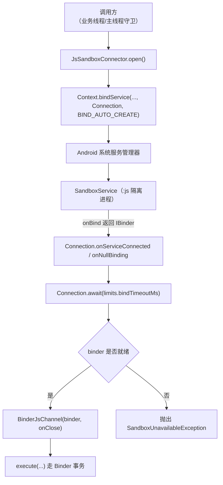
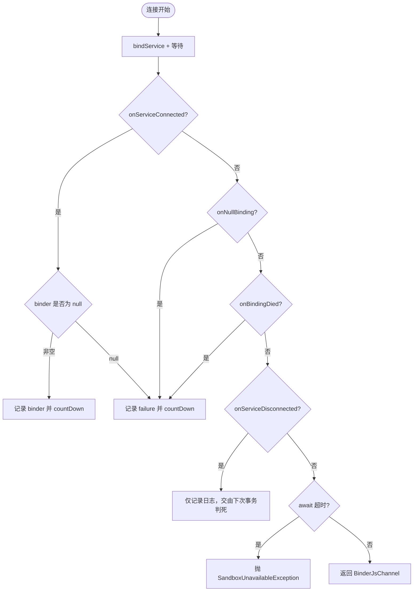
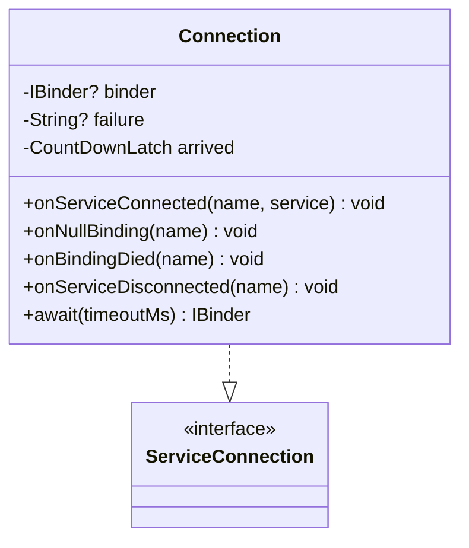
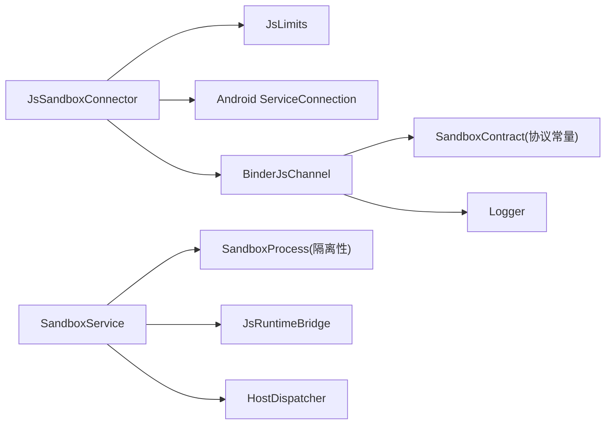

# ServiceConnection 生命周期管理

<cite>
**本文引用的文件**
- [JsSandboxConnector.kt](file://lib_book_source/src/main/java/com/ebook/source/sandbox/JsSandboxConnector.kt)
- [BinderJsChannel.kt](file://lib_book_source/src/main/java/com/ebook/source/sandbox/BinderJsChannel.kt)
- [SandboxService.kt](file://lib_book_source/src/main/java/com/ebook/source/sandbox/SandboxService.kt)
- [ScriptRuleExceptions.kt](file://lib_book_source/src/main/java/com/ebook/source/script/ScriptRuleExceptions.kt)
- [JsLimits.kt](file://lib_book_source/src/main/java/com/ebook/source/sandbox/JsLimits.kt)
- [SandboxConnectionTest.kt](file://lib_book_source/src/androidTest/java/com/ebook/source/sandbox/SandboxConnectionTest.kt)
- [0028-untrusted-js-sandbox.md](file://docs/adr/0028-untrusted-js-sandbox.md)
</cite>

## 目录
1. [简介](#简介)
2. [项目结构](#项目结构)
3. [核心组件](#核心组件)
4. [架构总览](#架构总览)
5. [详细组件分析](#详细组件分析)
6. [依赖关系分析](#依赖关系分析)
7. [性能与连接池建议](#性能与连接池建议)
8. [故障排查指南](#故障排查指南)
9. [结论](#结论)

## 简介
本文围绕 JsSandboxConnector.open() 的跨进程绑定流程，系统阐述 Android ServiceConnection 的生命周期管理。重点包括：
- bindService + BIND_AUTO_CREATE 的连接建立机制
- ServiceConnection 四个回调的处理逻辑与状态流转
- Connection 内部类的闩锁机制（CountDownLatch、volatile 可见性、超时等待）
- 连接失败场景的错误消息统一化
- 为什么不在 Connector 中保存 Connection 引用以避免旧 binder 误删新连接
- 连接池优化建议与可观测指标

## 项目结构
与本次主题相关的代码集中在 lib_book_source 模块的沙箱执行器客户端与服务端之间，通过 Binder 通信完成脚本执行。



图示来源
- [JsSandboxConnector.kt:37-60](file://lib_book_source/src/main/java/com/ebook/source/sandbox/JsSandboxConnector.kt#L37-L60)
- [SandboxService.kt:147-153](file://lib_book_source/src/main/java/com/ebook/source/sandbox/SandboxService.kt#L147-L153)
- [BinderJsChannel.kt:20-65](file://lib_book_source/src/main/java/com/ebook/source/sandbox/BinderJsChannel.kt#L20-L65)

章节来源
- [JsSandboxConnector.kt:13-65](file://lib_book_source/src/main/java/com/ebook/source/sandbox/JsSandboxConnector.kt#L13-L65)
- [SandboxService.kt:125-153](file://lib_book_source/src/main/java/com/ebook/source/sandbox/SandboxService.kt#L125-L153)
- [BinderJsChannel.kt:10-65](file://lib_book_source/src/main/java/com/ebook/source/sandbox/BinderJsChannel.kt#L10-L65)

## 核心组件
- JsSandboxConnector：负责拉起 :js 执行器进程、等待 binder 就绪、封装通道关闭时的解绑逻辑，并将异常统一为 SandboxUnavailableException。
- Connection（内部类）：实现 ServiceConnection，集中处理连接成功、空绑定、绑定死亡、断开等回调，并通过 CountDownLatch 协调 await 超时。
- BinderJsChannel：基于 IBinder 的事务通道，将 execute 请求序列化后发送至执行器，并在 close 时触发解绑。
- SandboxService：在隔离进程中提供 Binder，校验进程隔离性与协议版本，处理 execute/ping/host 回调。
- ScriptRuleExceptions：定义类型化的沙箱相关异常，用于上层统一处理。
- JsLimits：集中配置连接超时、任务挂钟、堆/栈/报文大小等限制。

章节来源
- [JsSandboxConnector.kt:24-65](file://lib_book_source/src/main/java/com/ebook/source/sandbox/JsSandboxConnector.kt#L24-L65)
- [BinderJsChannel.kt:20-85](file://lib_book_source/src/main/java/com/ebook/source/sandbox/BinderJsChannel.kt#L20-L85)
- [SandboxService.kt:27-153](file://lib_book_source/src/main/java/com/ebook/source/sandbox/SandboxService.kt#L27-L153)
- [ScriptRuleExceptions.kt:65-85](file://lib_book_source/src/main/java/com/ebook/source/script/ScriptRuleExceptions.kt#L65-L85)
- [JsLimits.kt:13-58](file://lib_book_source/src/main/java/com/ebook/source/sandbox/JsLimits.kt#L13-L58)

## 架构总览
从 open() 到可用的完整时序如下：

```mermaid
sequenceDiagram
    participant Caller as "调用方"
    participant Conn as "JsSandboxConnector"
    participant Sys as "Android 系统"
    participant Svc as "SandboxService(:js)"
    participant Ch as "BinderJsChannel"

    Caller->>Conn: open()
    Conn->>Sys: bindService(Intent(SandboxService), Connection, BIND_AUTO_CREATE)
    Note over Sys,Svc: 若服务不存在/禁用则不回调任何连接事件
    Sys-->>Conn: started = false?
    alt 系统拒绝绑定
        Conn-->>Caller: 抛 SandboxUnavailableException("系统拒绝绑定...")
    else 启动成功
        Sys->>Svc: onCreate()/onBind()
        alt onBind 返回 null（非隔离/拒绝）
            Sys-->>Conn: onNullBinding()
            Conn->>Conn: failure="执行器拒绝提供通道..."
            Conn-->>Caller: 抛 SandboxUnavailableException(...)
        else onBind 返回 IBinder
            Sys-->>Conn: onServiceConnected(name, binder)
            Conn->>Conn: binder=service; arrived.countDown()
            Conn-->>Caller: 返回 BinderJsChannel(binder, onClose=unbind)
            Caller->>Ch: execute(...)
            Ch->>Svc: transact(TX_EXECUTE, requestFrame, callback)
            Svc-->>Ch: reply(协议帧)
            Ch-->>Caller: outcome
        end
    end
```

图示来源
- [JsSandboxConnector.kt:37-60](file://lib_book_source/src/main/java/com/ebook/source/sandbox/JsSandboxConnector.kt#L37-L60)
- [SandboxService.kt:147-153](file://lib_book_source/src/main/java/com/ebook/source/sandbox/SandboxService.kt#L147-L153)
- [BinderJsChannel.kt:41-65](file://lib_book_source/src/main/java/com/ebook/source/sandbox/BinderJsChannel.kt#L41-L65)

## 详细组件分析

### JsSandboxConnector.open() 连接建立机制
- 使用 Context.bindService 并传入自定义 ServiceConnection（Connection），标志位为 BIND_AUTO_CREATE，以拉起隔离进程中的 SandboxService。
- 如果 bindService 返回 false，说明服务不存在或被禁用，系统不会回调任何连接事件，因此需要在此处直接抛出 SandboxUnavailableException，避免无谓等待。
- 如果返回 true，则进入 await(limits.bindTimeoutMs) 等待连接结果；await 由 Connection 内部的 CountDownLatch 控制，最多等待 bindTimeoutMs 毫秒。
- 一旦获得 binder，构造 BinderJsChannel，并将 unbind(connection) 作为 onClose 回调传递给 Channel，确保在 close() 时释放绑定。
- 所有捕获到的绑定异常都会被包装为 SandboxUnavailableException，保证上层统一的“不可用”语义，避免被当作可重放的通道死错误重复重试。

章节来源
- [JsSandboxConnector.kt:37-60](file://lib_book_source/src/main/java/com/ebook/source/sandbox/JsSandboxConnector.kt#L37-L60)
- [JsLimits.kt:45-50](file://lib_book_source/src/main/java/com/ebook/source/sandbox/JsLimits.kt#L45-L50)
- [ScriptRuleExceptions.kt:65-85](file://lib_book_source/src/main/java/com/ebook/source/script/ScriptRuleExceptions.kt#L65-L85)

### ServiceConnection 四个回调的处理逻辑与状态流转
- onServiceConnected(name, service)：当服务成功绑定且 onBind 返回非空 binder 时触发。此时将 binder 写入 volatile 字段，并 countDown 通知 await。
- onNullBinding(name)：API 28+ 的独立回调路径；在 API 26/27 上 onBind 返回 null 会走到 onServiceConnected 且 service 为 null。两条路径统一归因于“执行器拒绝提供通道”，并设置 failure 消息后 countDown。
- onBindingDied(name)：当服务的绑定已死（例如进程被系统回收）时触发，设置 failure 消息并 countDown。
- onServiceDisconnected(name)：进程退出但连接仍保留时触发。此处不清理 binder，因为该 binder 已是 dead object，后续事务会抛 DeadObjectException，由上层按通道死亡处理。此设计避免在日志中出现互相矛盾的“谁杀了进程”判断。



图示来源
- [JsSandboxConnector.kt:75-141](file://lib_book_source/src/main/java/com/ebook/source/sandbox/JsSandboxConnector.kt#L75-L141)
- [SandboxService.kt:147-153](file://lib_book_source/src/main/java/com/ebook/source/sandbox/SandboxService.kt#L147-L153)

章节来源
- [JsSandboxConnector.kt:75-141](file://lib_book_source/src/main/java/com/ebook/source/sandbox/JsSandboxConnector.kt#L75-L141)

### Connection 内部类的闩锁机制与并发可见性
- CountDownLatch：用于一次性同步，await 阻塞直到任意一个回调（onServiceConnected/onNullBinding/onBindingDied）countDown 或超时。
- volatile 字段：binder 与 failure 各写一次，await 在闩之后读取，保证可见性；超时路径没有闩的可见性保证，故标注 @Volatile 以确保读到最新值。
- 中断处理：await 捕获 InterruptedException 后恢复中断标志，避免上层线程池误以为“无人要求停止”。
- 超时策略：await 最多等待 bindTimeoutMs 毫秒；未收到信号则抛 SandboxUnavailableException，failure 为空时使用“等待超时”的统一话术。



图示来源
- [JsSandboxConnector.kt:75-141](file://lib_book_source/src/main/java/com/ebook/source/sandbox/JsSandboxConnector.kt#L75-L141)

章节来源
- [JsSandboxConnector.kt:75-141](file://lib_book_source/src/main/java/com/ebook/source/sandbox/JsSandboxConnector.kt#L75-L141)

### 连接失败场景与错误消息统一化
- 服务不存在/被禁用：bindService 返回 false，直接抛 SandboxUnavailableException，提示“系统拒绝绑定”。
- 服务存在但 onBind 返回 null：走 onNullBinding 或 onServiceConnected(service==null)，统一失败原因“执行器拒绝提供通道（多半是当前进程未被隔离）”。
- Binder 返回 null：同上，归一化为“执行器拒绝提供通道”。
- 绑定已死：onBindingDied 设置 failure 并 countDown，最终抛 SandboxUnavailableException 并带上“执行器的绑定已死（服务被系统回收）”。
- 超时：await 未在限定时间内收到信号，抛 SandboxUnavailableException 并附带超时信息。
- 以上统一使用 SandboxUnavailableException，避免上层将其误判为“通道死亡”而进行不必要的重连重放。

章节来源
- [JsSandboxConnector.kt:37-60](file://lib_book_source/src/main/java/com/ebook/source/sandbox/JsSandboxConnector.kt#L37-L60)
- [JsSandboxConnector.kt:86-141](file://lib_book_source/src/main/java/com/ebook/source/sandbox/JsSandboxConnector.kt#L86-L141)
- [ScriptRuleExceptions.kt:65-85](file://lib_book_source/src/main/java/com/ebook/source/script/ScriptRuleExceptions.kt#L65-L85)

### 为什么不在 Connector 中保存 Connection 引用
- 每次 open() 是一次独立的绑定，解绑挂在返回通道的 close() 上。
- 如果在 Connector 中保存 Connection 引用，客户端重连时会创建新的 Connection，旧的 Connection 仍然持有引用。此时若旧通道先 close()，可能误删新连接的 binder，导致新连接失效。
- 因此，Connection 仅作为局部变量传递至 BinderJsChannel 的 onClose 回调，确保旧连接与新连接完全解耦，避免竞态和误删。

章节来源
- [JsSandboxConnector.kt:13-22](file://lib_book_source/src/main/java/com/ebook/source/sandbox/JsSandboxConnector.kt#L13-L22)
- [JsSandboxConnector.kt:37-60](file://lib_book_source/src/main/java/com/ebook/source/sandbox/JsSandboxConnector.kt#L37-L60)

### 与执行器服务端的交互契约
- SandboxService 在 onBind 中检查是否运行在隔离进程，非隔离则返回 null，使主进程侧统一走“执行器拒绝提供通道”的路径。
- 协议层面包含接口标识与版本校验，不匹配会返回 UNAVAILABLE 或协议不合异常。
- execute 事务通过 Binder 传输请求帧与回调 binder，服务端在主进程侧中继 host 回调，并按字节上限与协议版本校验响应。

章节来源
- [SandboxService.kt:63-80](file://lib_book_source/src/main/java/com/ebook/source/sandbox/SandboxService.kt#L63-L80)
- [SandboxService.kt:83-98](file://lib_book_source/src/main/java/com/ebook/source/sandbox/SandboxService.kt#L83-L98)
- [SandboxService.kt:147-153](file://lib_book_source/src/main/java/com/ebook/source/sandbox/SandboxService.kt#L147-L153)
- [BinderJsChannel.kt:73-84](file://lib_book_source/src/main/java/com/ebook/source/sandbox/BinderJsChannel.kt#L73-L84)

## 依赖关系分析
- JsSandboxConnector 依赖 Android 系统 ServiceConnection 与 Intent 机制，依赖 JsLimits 提供超时与资源限制。
- BinderJsChannel 依赖 SandboxContract 定义的协议常量（接口标识、版本、事务码），依赖 Logger 输出诊断信息。
- SandboxService 依赖 SandboxProcess 的隔离性判据与 JsRuntimeBridge 执行内核，HostDispatcher 安装主进程回调中继。
- 异常体系集中于 ScriptRuleExceptions，确保上层对“不可用”“协议不合”“执行失败”的分类清晰。



图示来源
- [JsSandboxConnector.kt:24-65](file://lib_book_source/src/main/java/com/ebook/source/sandbox/JsSandboxConnector.kt#L24-L65)
- [BinderJsChannel.kt:20-85](file://lib_book_source/src/main/java/com/ebook/source/sandbox/BinderJsChannel.kt#L20-L85)
- [SandboxService.kt:27-153](file://lib_book_source/src/main/java/com/ebook/source/sandbox/SandboxService.kt#L27-L153)

章节来源
- [JsSandboxConnector.kt:24-65](file://lib_book_source/src/main/java/com/ebook/source/sandbox/JsSandboxConnector.kt#L24-L65)
- [BinderJsChannel.kt:20-85](file://lib_book_source/src/main/java/com/ebook/source/sandbox/BinderJsChannel.kt#L20-L85)
- [SandboxService.kt:27-153](file://lib_book_source/src/main/java/com/ebook/source/sandbox/SandboxService.kt#L27-L153)

## 性能与连接池建议
- 当前设计每次 open() 进行一次独立绑定，close() 时解绑，避免复用连接带来的竞态风险。适合低频、严格隔离的场景。
- 高频调用可考虑连接池：
  - 维护固定数量的空闲 BinderJsChannel，按 LRU 或 FIFO 分配，降低冷启动成本。
  - 池内通道需具备健康检查（如 ping）与自动重建机制，失效即替换。
  - 池容量应受限于设备内存与 binder 事务缓冲（单进程约 1MB，共享给所有在飞事务），避免同时过多大帧造成 TransactionTooLargeException。
- 监控指标建议：
  - 连接成功率、平均连接耗时（await 耗时）、超时率
  - 绑定失败原因分布（服务不存在/被禁用、onNullBinding、onBindingDied）
  - 通道存活时长、重连次数、事务失败率（RemoteException 分类）
  - 协议版本不合次数、报文超限次数
  - 主线程占用时长（避免长时间阻塞主线程）

[本节为通用指导，不直接分析具体文件]

## 故障排查指南
- 症状：open() 立即失败，提示“系统拒绝绑定”
  - 可能原因：服务不存在或被禁用
  - 排查：确认 manifest 中服务声明正确，应用权限允许绑定
  - 参考路径：[JsSandboxConnector.kt:49-52](file://lib_book_source/src/main/java/com/ebook/source/sandbox/JsSandboxConnector.kt#L49-L52)

- 症状：连接成功但无法执行，提示“执行器拒绝提供通道”
  - 可能原因：onBind 返回 null（非隔离进程）
  - 排查：确认隔离进程属性生效，SandboxService.onBind 检查通过
  - 参考路径：[SandboxService.kt:147-153](file://lib_book_source/src/main/java/com/ebook/source/sandbox/SandboxService.kt#L147-L153)

- 症状：执行中途失败，提示“执行器不可达”
  - 可能原因：执行器进程被杀或 binder 断连
  - 排查：查看日志中 RemoteException 详情，必要时重启服务
  - 参考路径：[BinderJsChannel.kt:54-61](file://lib_book_source/src/main/java/com/ebook/source/sandbox/BinderJsChannel.kt#L54-L61)

- 症状：协议不合或回帧解析失败
  - 可能原因：两端版本不一致或帧格式错误
  - 排查：核对 SandboxContract.PROTOCOL_VERSION 与接口标识
  - 参考路径：[BinderJsChannel.kt:73-84](file://lib_book_source/src/main/java/com/ebook/source/sandbox/BinderJsChannel.kt#L73-L84)

- 症状：长时间无响应
  - 可能原因：await 超时（bindTimeoutMs）
  - 排查：调整 limits.bindTimeoutMs，检查主线程是否长时间阻塞
  - 参考路径：[JsLimits.kt:45-50](file://lib_book_source/src/main/java/com/ebook/source/sandbox/JsLimits.kt#L45-L50)

章节来源
- [JsSandboxConnector.kt:49-60](file://lib_book_source/src/main/java/com/ebook/source/sandbox/JsSandboxConnector.kt#L49-L60)
- [SandboxService.kt:147-153](file://lib_book_source/src/main/java/com/ebook/source/sandbox/SandboxService.kt#L147-L153)
- [BinderJsChannel.kt:54-84](file://lib_book_source/src/main/java/com/ebook/source/sandbox/BinderJsChannel.kt#L54-L84)
- [JsLimits.kt:45-50](file://lib_book_source/src/main/java/com/ebook/source/sandbox/JsLimits.kt#L45-L50)

## 结论
JsSandboxConnector 通过 ServiceConnection 与 CountDownLatch 实现了可靠的跨进程连接管理，统一了多种失败场景的错误消息，避免了主线程长时间阻塞与误判。Connection 内部类的闩锁机制确保了可见性与超时等待的正确性。为避免旧 binder 误删新连接，连接器不在自身字段中保存 Connection 引用，而是将解绑逻辑委托给通道的 onClose。对于高频场景，可引入连接池与健康检查以提升性能，同时补充完善的监控指标以便持续优化。