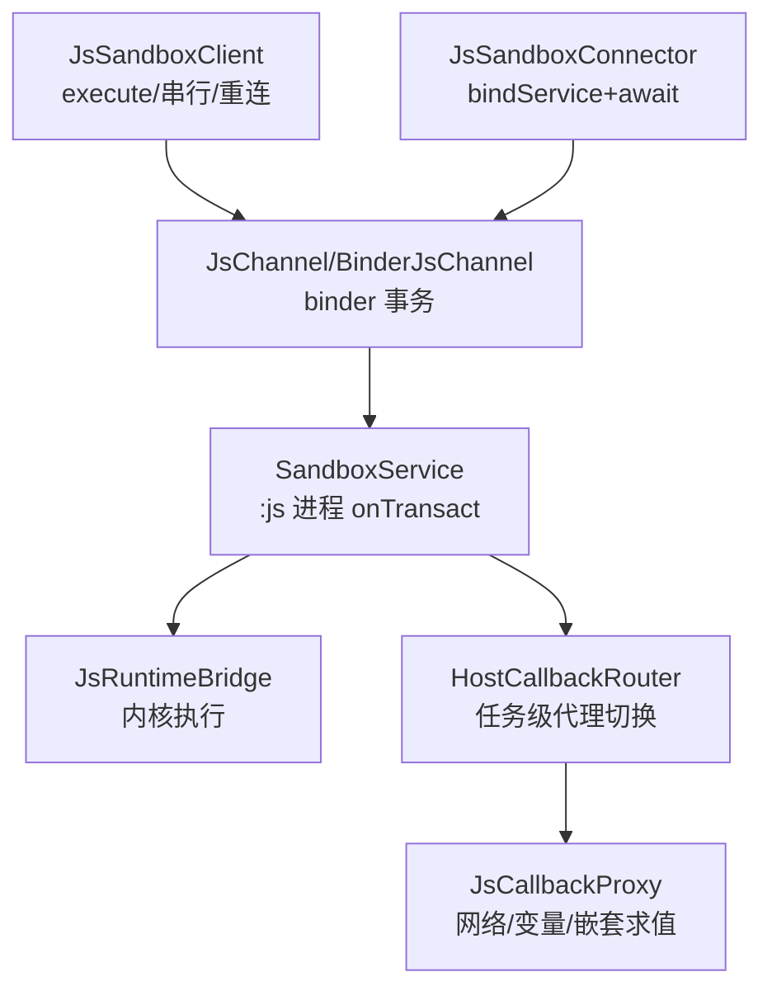
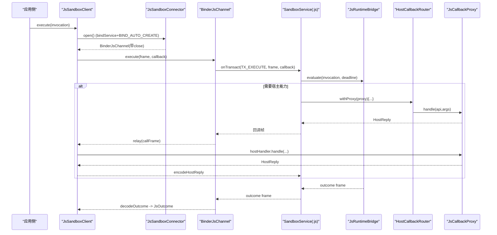
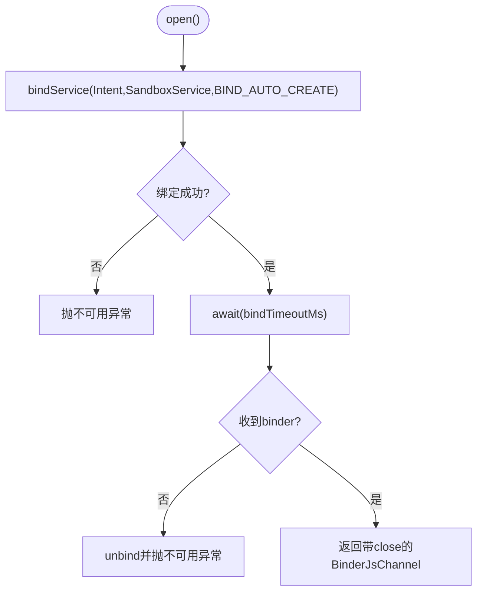
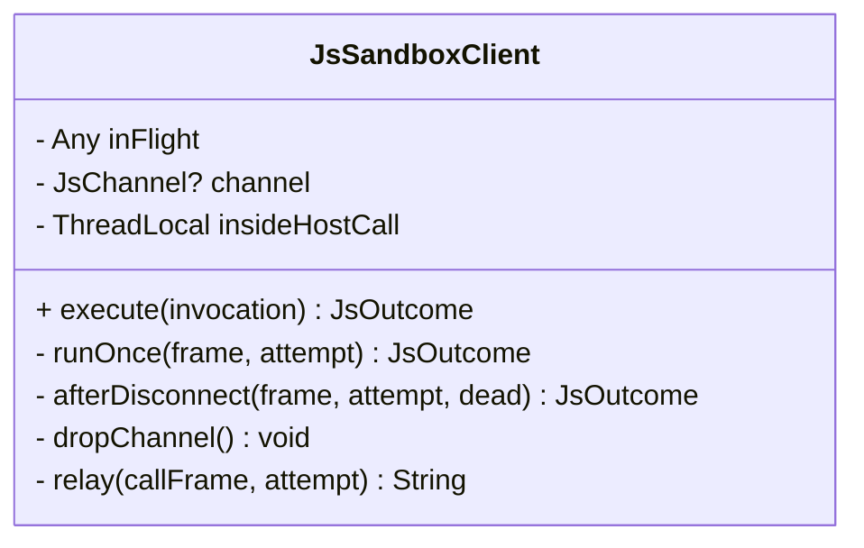
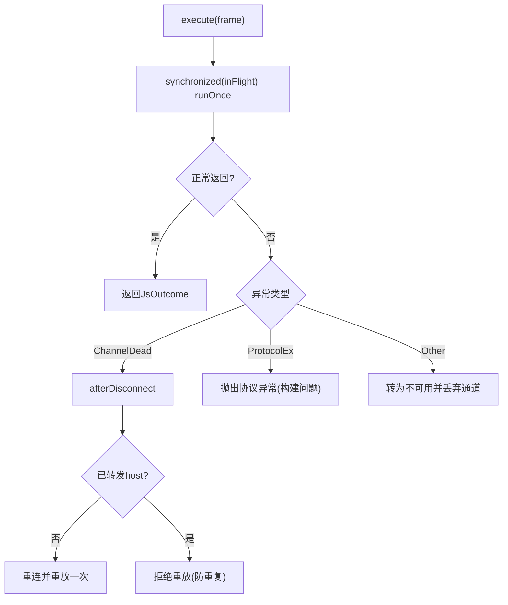
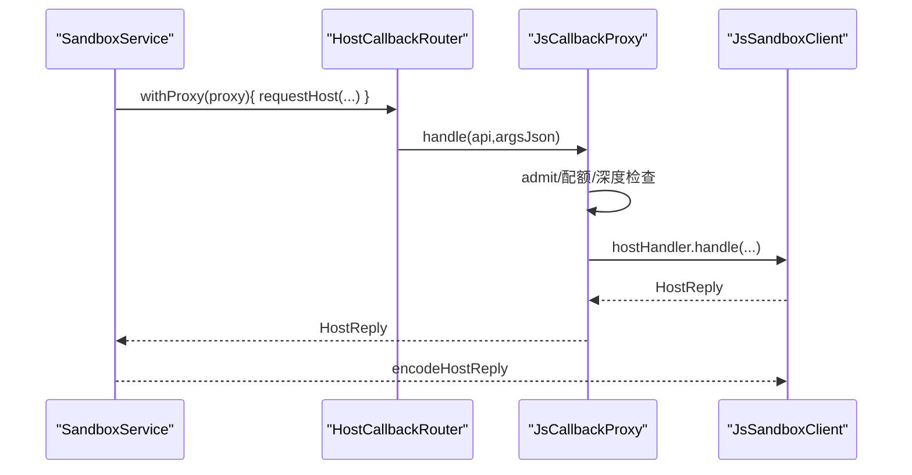
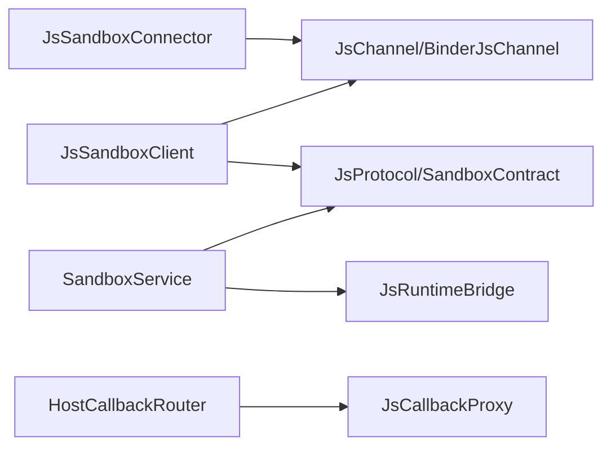

# 主执行器进程通信模型

<cite>
**本文引用的文件**   
- [JsSandboxConnector.kt](file://lib_book_source/src/main/java/com/ebook/source/sandbox/JsSandboxConnector.kt)
- [JsSandboxClient.kt](file://lib_book_source/src/main/java/com/ebook/source/sandbox/JsSandboxClient.kt)
- [JsCallbackProxy.kt](file://lib_book_source/src/main/java/com/ebook/source/sandbox/JsCallbackProxy.kt)
- [JsLimits.kt](file://lib_book_source/src/main/java/com/ebook/source/sandbox/JsLimits.kt)
- [SandboxService.kt](file://lib_book_source/src/main/java/com/ebook/source/sandbox/SandboxService.kt)
- [JsSandboxHost.kt](file://lib_book_source/src/main/java/com/ebook/source/sandbox/JsSandboxHost.kt)
- [JsProtocol.kt](file://lib_book_source/src/main/java/com/ebook/source/sandbox/JsProtocol.kt)
- [SandboxContract.kt](file://lib_book_source/src/main/java/com/ebook/source/sandbox/SandboxContract.kt)
- [BinderJsChannel.kt](file://lib_book_source/src/main/java/com/ebook/source/sandbox/BinderJsChannel.kt)
- [JsChannel.kt](file://lib_book_source/src/main/java/com/ebook/source/sandbox/JsChannel.kt)
</cite>

## 目录
1. [简介](#简介)
2. [项目结构](#项目结构)
3. [核心组件](#核心组件)
4. [架构总览](#架构总览)
5. [详细组件分析](#详细组件分析)
6. [依赖关系分析](#依赖关系分析)
7. [性能考量](#性能考量)
8. [故障诊断与排错指南](#故障诊断与排错指南)
9. [结论](#结论)

## 简介
本文件面向“主执行器进程通信模型”，围绕 Android Binder 通道、服务绑定、任务调度、错误恢复、连接期限与回调代理等主题，系统化说明脚本沙箱在宿主进程与隔离进程之间的通信机制。重点包括：
- bindService + BIND_AUTO_CREATE 的连接建立与服务生命周期管理
- 单帧串行执行、inFlight 锁与并发控制
- 断线检测、自动重连、请求重放与状态同步
- 连接超时策略（bindTimeoutMs）与失败处理
- HostCallbackProxy/HostCallbackRouter 的线程模型、回调路由与异常传播
- 连接池优化、性能监控与故障诊断方法

## 项目结构
该通信模型主要位于 lib_book_source 模块的沙箱子包中，涉及“连接器—客户端—服务—协议—回调”五层协作：
- 连接器 JsSandboxConnector：负责 bindService、等待 IBinder、返回可关闭通道
- 客户端 JsSandboxClient：封装 execute 入口、串行化、重连重放、host 回调中继
- 服务 SandboxService：运行于 :js 隔离进程，解析协议帧、执行内核、转发 host 调用
- 协议 JsProtocol/SandboxContract：定义事务码、版本、帧格式
- 回调 JsCallbackProxy/HostCallbackRouter：将脚本对宿主能力的调用路由到具体实现，并维护任务级上下文

图表来源
- [JsSandboxConnector.kt:37-60](file://lib_book_source/src/main/java/com/ebook/source/sandbox/JsSandboxConnector.kt#L37-L60)
- [JsSandboxClient.kt:65-99](file://lib_book_source/src/main/java/com/ebook/source/sandbox/JsSandboxClient.kt#L65-L99)
- [SandboxService.kt:50-98](file://lib_book_source/src/main/java/com/ebook/source/sandbox/SandboxService.kt#L50-L98)
- [JsCallbackProxy.kt:57-76](file://lib_book_source/src/main/java/com/ebook/source/sandbox/JsCallbackProxy.kt#L57-L76)

章节来源
- [JsSandboxConnector.kt:13-65](file://lib_book_source/src/main/java/com/ebook/source/sandbox/JsSandboxConnector.kt#L13-L65)
- [JsSandboxClient.kt:8-34](file://lib_book_source/src/main/java/com/ebook/source/sandbox/JsSandboxClient.kt#L8-L34)
- [SandboxService.kt:11-26](file://lib_book_source/src/main/java/com/ebook/source/sandbox/SandboxService.kt#L11-L26)

## 核心组件
- JsSandboxConnector：以 open() 发起一次独立绑定，使用 CountDownLatch 等待 onServiceConnected/onNullBinding/onBindingDied；绑定成功即返回带 close 的 BinderJsChannel；失败统一抛出不可用异常，避免误触发重放。
- JsSandboxClient：唯一执行入口 execute(invocation)，包含主线程守卫、入参大小限制、inFlight 串行锁、断链后重试一次、host 回调中继与上限保护。
- SandboxService：隔离进程端入口，校验接口 token 与协议版本，分发 TX_EXECUTE/TX_PING；通过 ThreadLocal 保存当前回调通道；requestHost 将脚本回调桥回主进程。
- JsCallbackProxy/HostCallbackRouter：任务级回调代理，withProxy 保证同一时刻仅一个代理生效；JsCallbackProxy 实现 ajax/load/post/responseCode/setContent/cookie/变量/嵌套求值等能力，含配额、深度、响应体大小限制。
- JsLimits：集中声明各项资源上限（wallClockMs、maxRequestBytes、maxOutcomeBytes、maxHostReplyBytes、maxCallbackDepth、bindTimeoutMs、maxRequestsPerTask）。
- JsProtocol/SandboxContract：协议帧编码解码、事务码与版本号，确保两侧契约一致。

章节来源
- [JsSandboxConnector.kt:24-65](file://lib_book_source/src/main/java/com/ebook/source/sandbox/JsSandboxConnector.kt#L24-L65)
- [JsSandboxClient.kt:35-99](file://lib_book_source/src/main/java/com/ebook/source/sandbox/JsSandboxClient.kt#L35-L99)
- [SandboxService.kt:27-98](file://lib_book_source/src/main/java/com/ebook/source/sandbox/SandboxService.kt#L27-L98)
- [JsCallbackProxy.kt:57-76](file://lib_book_source/src/main/java/com/ebook/source/sandbox/JsCallbackProxy.kt#L57-L76)
- [JsLimits.kt:13-58](file://lib_book_source/src/main/java/com/ebook/source/sandbox/JsLimits.kt#L13-L58)
- [JsProtocol.kt:1-200](file://lib_book_source/src/main/java/com/ebook/source/sandbox/JsProtocol.kt#L1-L200)
- [SandboxContract.kt:1-200](file://lib_book_source/src/main/java/com/ebook/source/sandbox/SandboxContract.kt#L1-L200)

## 架构总览
下图展示从主进程发起执行到隔离进程执行并可能回调宿主的完整流程。

图表来源
- [JsSandboxConnector.kt:37-60](file://lib_book_source/src/main/java/com/ebook/source/sandbox/JsSandboxConnector.kt#L37-L60)
- [JsSandboxClient.kt:65-184](file://lib_book_source/src/main/java/com/ebook/source/sandbox/JsSandboxClient.kt#L65-L184)
- [SandboxService.kt:50-98](file://lib_book_source/src/main/java/com/ebook/source/sandbox/SandboxService.kt#L50-L98)
- [JsCallbackProxy.kt:152-239](file://lib_book_source/src/main/java/com/ebook/source/sandbox/JsCallbackProxy.kt#L152-L239)

## 详细组件分析

### 连接建立：bindService + BIND_AUTO_CREATE
- 每次 open() 创建独立的 Connection，不缓存 Connection 字段，避免旧 binder 解绑影响新绑定。
- 使用 CountDownLatch.await(bindTimeoutMs) 等待 onServiceConnected/onNullBinding/onBindingDied 任一结果。
- 若系统拒绝绑定或超时未收到 binder，抛出不可用异常，避免误触“已存在副作用”的重放逻辑。
- 返回的通道携带 close，用于解绑服务。

图表来源
- [JsSandboxConnector.kt:37-65](file://lib_book_source/src/main/java/com/ebook/source/sandbox/JsSandboxConnector.kt#L37-L65)
- [JsSandboxConnector.kt:75-141](file://lib_book_source/src/main/java/com/ebook/source/sandbox/JsSandboxConnector.kt#L75-L141)

章节来源
- [JsSandboxConnector.kt:13-65](file://lib_book_source/src/main/java/com/ebook/source/sandbox/JsSandboxConnector.kt#L13-L65)
- [JsSandboxConnector.kt:67-141](file://lib_book_source/src/main/java/com/ebook/source/sandbox/JsSandboxConnector.kt#L67-L141)

### 任务调度：单帧串行、inFlight 锁与并发控制
- execute 入口处检查主线程，禁止阻塞主线程。
- inFlight 为非重入锁，保证同一时刻仅一帧在执行，防止多源争抢单一 runtime 导致状态污染与超限。
- 入参按 wallClock 计算截止时间，超过 maxRequestBytes 直接拒绝。
- 内部 Attempt 记录本次是否已转发过 host 回调，决定断连后是否允许重放。

图表来源
- [JsSandboxClient.kt:57-99](file://lib_book_source/src/main/java/com/ebook/source/sandbox/JsSandboxClient.kt#L57-L99)
- [JsSandboxClient.kt:116-184](file://lib_book_source/src/main/java/com/ebook/source/sandbox/JsSandboxClient.kt#L116-L184)

章节来源
- [JsSandboxClient.kt:8-34](file://lib_book_source/src/main/java/com/ebook/source/sandbox/JsSandboxClient.kt#L8-L34)
- [JsSandboxClient.kt:65-184](file://lib_book_source/src/main/java/com/ebook/source/sandbox/JsSandboxClient.kt#L65-L184)

### 错误恢复：断线检测、自动重连、请求重放与状态同步
- 捕获 ChannelDeadException 时，dropChannel 并进入 afterDisconnect。
- 若本次尚未转发任何 host 回调（attempt.relayed == 0），则允许重连并重放一次。
- 若已有副作用（relay > 0），拒绝重放以避免重复请求。
- 协议不一致（SandboxProtocolException）直接抛出，交由上层排查构建问题。
- 通用异常被兜底为不可用，保持“无未类型化异常”的契约。

图表来源
- [JsSandboxClient.kt:84-135](file://lib_book_source/src/main/java/com/ebook/source/sandbox/JsSandboxClient.kt#L84-L135)

章节来源
- [JsSandboxClient.kt:84-135](file://lib_book_source/src/main/java/com/ebook/source/sandbox/JsSandboxClient.kt#L84-L135)

### 连接期限管理：bindTimeoutMs 与超时策略
- bindTimeoutMs 用于等待 onServiceConnected/onNullBinding/onBindingDied 的结果，避免冷启动卡死。
- 超时或失败均抛出不可用异常，便于上层快速降级（而非静默等待）。
- 与 wallClock 不同：连接超时关注“尽快报不可用”，而执行超时关注“单次执行挂钟”。

章节来源
- [JsLimits.kt:46-50](file://lib_book_source/src/main/java/com/ebook/source/sandbox/JsLimits.kt#L46-L50)
- [JsSandboxConnector.kt:53-65](file://lib_book_source/src/main/java/com/ebook/source/sandbox/JsSandboxConnector.kt#L53-L65)
- [JsSandboxConnector.kt:126-141](file://lib_book_source/src/main/java/com/ebook/source/sandbox/JsSandboxConnector.kt#L126-L141)

### 回调代理：HostCallbackProxy 线程模型、回调路由与异常传播
- HostCallbackRouter：持有 current 代理，withProxy 确保任务级独占；回调期间 current 非空，结束后置空。
- JsCallbackProxy：实现宿主能力路由（ajax/load/post/responseCode/setContent/cookie/变量/嵌套求值），所有能力调用统一走 admit 准入与配额计数。
- 线程模型：handle 在 binder 线程池线程执行，内部 suspend 调用通过 runBlocking 桥接；IO 在 Dispatchers.IO；主线程守卫由客户端保障。
- 异常传播：任何异常转换为 ok=false 的 HostReply，避免 .so 栈崩溃。

图表来源
- [JsCallbackProxy.kt:57-76](file://lib_book_source/src/main/java/com/ebook/source/sandbox/JsCallbackProxy.kt#L57-L76)
- [JsCallbackProxy.kt:152-239](file://lib_book_source/src/main/java/com/ebook/source/sandbox/JsCallbackProxy.kt#L152-L239)
- [JsSandboxClient.kt:161-184](file://lib_book_source/src/main/java/com/ebook/source/sandbox/JsSandboxClient.kt#L161-L184)
- [SandboxService.kt:165-209](file://lib_book_source/src/main/java/com/ebook/source/sandbox/SandboxService.kt#L165-L209)

章节来源
- [JsCallbackProxy.kt:78-104](file://lib_book_source/src/main/java/com/ebook/source/sandbox/JsCallbackProxy.kt#L78-L104)
- [JsCallbackProxy.kt:152-239](file://lib_book_source/src/main/java/com/ebook/source/sandbox/JsCallbackProxy.kt#L152-L239)
- [JsSandboxClient.kt:152-184](file://lib_book_source/src/main/java/com/ebook/source/sandbox/JsSandboxClient.kt#L152-L184)
- [SandboxService.kt:165-209](file://lib_book_source/src/main/java/com/ebook/source/sandbox/SandboxService.kt#L165-L209)

### HostCallbackRouter 状态管理与可见性
- current 代理为 @Volatile，写于 withProxy 块内，读于 binder 回调线程，保证跨线程可见。
- withProxy 检查 current 为空，确保任务级独占；finally 确保清理。
- 配合客户端 inFlight 锁，保证“同一时刻只有一帧在飞”，避免两个源的脚本互相看到对方状态。

章节来源
- [JsCallbackProxy.kt:57-76](file://lib_book_source/src/main/java/com/ebook/source/sandbox/JsCallbackProxy.kt#L57-L76)
- [JsSandboxClient.kt:57-73](file://lib_book_source/src/main/java/com/ebook/source/sandbox/JsSandboxClient.kt#L57-L73)

## 依赖关系分析
- 连接器依赖 ServiceConnection 与 CountDownLatch，产出通道；客户端依赖通道与协议；服务依赖协议与运行时桥；回调路由依赖宿主能力实现。
- 关键耦合点：协议版本与帧格式（JsProtocol/SandboxContract）、回调通道（BinderJsChannel/JsChannel）、任务级代理切换（HostCallbackRouter）。

图表来源
- [JsSandboxConnector.kt:37-60](file://lib_book_source/src/main/java/com/ebook/source/sandbox/JsSandboxConnector.kt#L37-L60)
- [JsSandboxClient.kt:65-99](file://lib_book_source/src/main/java/com/ebook/source/sandbox/JsSandboxClient.kt#L65-L99)
- [SandboxService.kt:50-98](file://lib_book_source/src/main/java/com/ebook/source/sandbox/SandboxService.kt#L50-L98)
- [JsCallbackProxy.kt:57-76](file://lib_book_source/src/main/java/com/ebook/source/sandbox/JsCallbackProxy.kt#L57-L76)

章节来源
- [JsSandboxConnector.kt:37-65](file://lib_book_source/src/main/java/com/ebook/source/sandbox/JsSandboxConnector.kt#L37-L65)
- [JsSandboxClient.kt:65-184](file://lib_book_source/src/main/java/com/ebook/source/sandbox/JsSandboxClient.kt#L65-L184)
- [SandboxService.kt:50-98](file://lib_book_source/src/main/java/com/ebook/source/sandbox/SandboxService.kt#L50-L98)
- [JsCallbackProxy.kt:57-76](file://lib_book_source/src/main/java/com/ebook/source/sandbox/JsCallbackProxy.kt#L57-L76)

## 性能考量
- 单帧串行：inFlight 锁避免多源争抢，减少状态竞争与内存压力；代价是排队等待，但通过 wallClock 截止日期提供明确超时语义。
- 字节上限：maxRequestBytes/maxOutcomeBytes/maxHostReplyBytes 受 binder 事务缓冲限制，本地判大避免 TransactionTooLargeException。
- 网络限流：maxRequestsPerTask 防止脚本滥用外呼；admit 在真正外呼前计数，避免无效消耗。
- 回调深度：maxCallbackDepth 防止递归爆炸；嵌套求值需显式传入“关掉 JS”的求值口。
- 连接超时：bindTimeoutMs 短于执行超时，快速反馈不可用，避免冷启动长等待。

[本节为通用指导，无需特定文件引用]

## 故障诊断与排错指南
- 连接阶段
  - 现象：bindService 返回 false 或 await 超时
  - 定位：检查服务是否在隔离进程、清单属性是否正确；查看日志中的“系统拒绝绑定/连接超时”
  - 参考：[JsSandboxConnector.kt:45-65](file://lib_book_source/src/main/java/com/ebook/source/sandbox/JsSandboxConnector.kt#L45-L65)、[JsSandboxConnector.kt:126-141](file://lib_book_source/src/main/java/com/ebook/source/sandbox/JsSandboxConnector.kt#L126-L141)
- 协议不一致
  - 现象：SandboxProtocolException
  - 定位：两侧 .so 与 Kotlin 非同构建产物；检查构建配置与 ABI 对齐
  - 参考：[JsSandboxClient.kt:84-89](file://lib_book_source/src/main/java/com/ebook/source/sandbox/JsSandboxClient.kt#L84-L89)
- 断连与重放
  - 现象：ChannelDeadException 后仍失败
  - 定位：检查是否有 host 回调副作用（attempt.relayed > 0）；若有则不应重放
  - 参考：[JsSandboxClient.kt:116-135](file://lib_book_source/src/main/java/com/ebook/source/sandbox/JsSandboxClient.kt#L116-L135)
- 回调失败
  - 现象：HostReply.ok=false
  - 定位：检查 HostCallbackProxy 的 admit/配额/深度/响应体大小限制；查看对应错误消息
  - 参考：[JsCallbackProxy.kt:247-277](file://lib_book_service/src/main/java/com/ebook/source/sandbox/JsCallbackProxy.kt#L247-L277)、[JsCallbackProxy.kt:413-429](file://lib_book_source/src/main/java/com/ebook/source/sandbox/JsCallbackProxy.kt#L413-L429)
- 服务侧健康
  - 现象：ping 失败或协议版本不合
  - 定位：检查 isReady、协议版本常量；确认隔离进程安全门
  - 参考：[SandboxService.kt:107-115](file://lib_book_source/src/main/java/com/ebook/source/sandbox/SandboxService.kt#L107-L115)、[SandboxService.kt:63-80](file://lib_book_source/src/main/java/com/ebook/source/sandbox/SandboxService.kt#L63-L80)

章节来源
- [JsSandboxConnector.kt:45-65](file://lib_book_source/src/main/java/com/ebook/source/sandbox/JsSandboxConnector.kt#L45-L65)
- [JsSandboxConnector.kt:126-141](file://lib_book_source/src/main/java/com/ebook/source/sandbox/JsSandboxConnector.kt#L126-L141)
- [JsSandboxClient.kt:84-135](file://lib_book_source/src/main/java/com/ebook/source/sandbox/JsSandboxClient.kt#L84-L135)
- [JsCallbackProxy.kt:247-277](file://lib_book_source/src/main/java/com/ebook/source/sandbox/JsCallbackProxy.kt#L247-L277)
- [JsCallbackProxy.kt:413-429](file://lib_book_source/src/main/java/com/ebook/source/sandbox/JsCallbackProxy.kt#L413-L429)
- [SandboxService.kt:63-80](file://lib_book_source/src/main/java/com/ebook/source/sandbox/SandboxService.kt#L63-L80)
- [SandboxService.kt:107-115](file://lib_book_source/src/main/java/com/ebook/source/sandbox/SandboxService.kt#L107-L115)

## 结论
本通信模型通过“连接器—客户端—服务—协议—回调”的分层设计，实现了脚本沙箱在宿主进程与隔离进程之间的高可靠交互：
- 使用 bindService + BIND_AUTO_CREATE 与一次性 Connection 管理，避免旧连接干扰与新连接抢占
- 通过 inFlight 锁与 wallClock 截止日期保证单帧串行与可预期超时
- 基于 Attempt 的断连重放策略，既恢复幂等操作又避免副作用重复
- 集中化的 JsLimits 约束资源，保护 binder 缓冲与执行环境
- 任务级 HostCallbackRouter 与 JsCallbackProxy 提供清晰的路由与异常边界
- 提供完善的诊断路径与日志线索，便于快速定位连接、协议、回调与超时问题

[本节为总结性内容，无需特定文件引用]