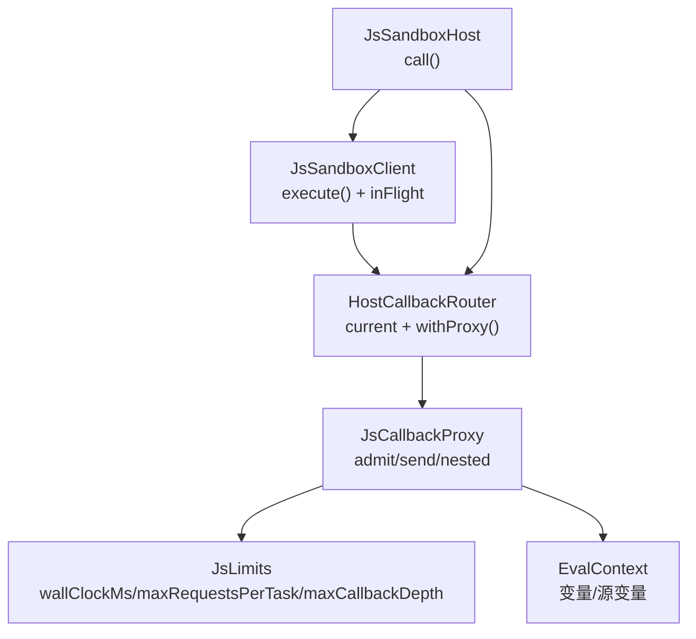
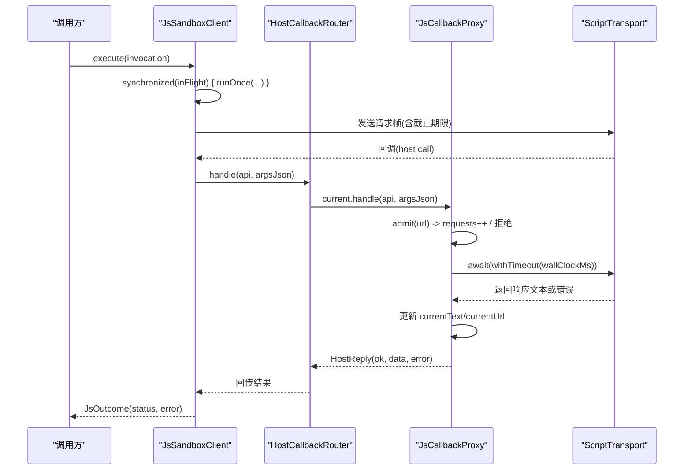
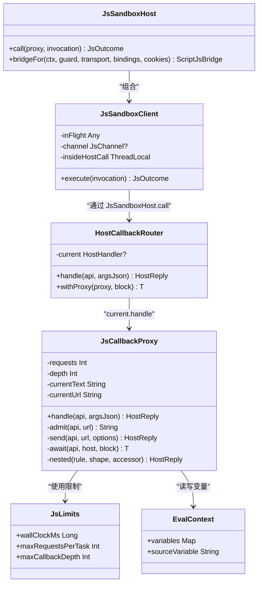

# 任务调度与并发控制

<cite>
**本文引用的文件**
- [JsSandboxClient.kt](file://lib_book_source/src/main/java/com/ebook/source/sandbox/JsSandboxClient.kt)
- [JsCallbackProxy.kt](file://lib_book_source/src/main/java/com/ebook/source/sandbox/JsCallbackProxy.kt)
- [JsLimits.kt](file://lib_book_source/src/main/java/com/ebook/source/sandbox/JsLimits.kt)
- [JsSandboxHost.kt](file://lib_book_source/src/main/java/com/ebook/source/sandbox/JsSandboxHost.kt)
- [EvalContext.kt](file://lib_book_source/src/main/java/com/ebook/source/script/EvalContext.kt)
</cite>

## 目录
1. [引言](#引言)
2. [项目结构](#项目结构)
3. [核心组件](#核心组件)
4. [架构总览](#架构总览)
5. [详细组件分析](#详细组件分析)
6. [依赖关系分析](#依赖关系分析)
7. [性能考量](#性能考量)
8. [故障排查指南](#故障排查指南)
9. [结论](#结论)

## 引言
本文件聚焦脚本沙箱的任务调度与并发控制，围绕以下目标展开：
- 解释“单帧串行执行模型”：通过 inFlight 锁确保同一时刻仅有一个脚本任务在执行。
- 说明 HostCallbackRouter 的任务级代理切换机制：current 字段的 volatile 可见性与 withProxy 的线程安全保证。
- 阐述回调深度限制 maxCallbackDepth 的设计原理：防止嵌套求值导致的死锁。
- 解释请求计数限制 maxRequestsPerTask 的作用：防止恶意脚本耗尽资源。
- 说明外呼超时 wallClockMs 的实现：withTimeout 的使用与超时异常处理。
- 提供并发调试技巧与性能分析建议。

## 项目结构
与任务调度与并发控制直接相关的代码集中在 lib_book_source 模块的沙箱层：
- JsSandboxClient：客户端侧的执行入口，持有 inFlight 锁、负责跨进程调用与重放策略。
- JsCallbackProxy：主进程侧 host 回调代理，承载任务级状态（请求计数、回调深度、当前页面）。
- HostCallbackRouter：路由器，维护 current 字段并在 withProxy 期间切换代理。
- JsSandboxHost：装配面，桥接客户端与路由器，把每次解析任务绑定到 withProxy 块。
- JsLimits：集中定义各类资源限制参数（包括 wallClockMs、maxRequestsPerTask、maxCallbackDepth 等）。
- EvalContext：规则求值上下文，承载变量与源级变量，受“同帧串行”前提保护。

**图表来源**
- [JsSandboxClient.kt:57-83](file://lib_book_source/src/main/java/com/ebook/source/sandbox/JsSandboxClient.kt#L57-L83)
- [JsCallbackProxy.kt:57-75](file://lib_book_source/src/main/java/com/ebook/source/sandbox/JsCallbackProxy.kt#L57-L75)
- [JsLimits.kt:13-58](file://lib_book_source/src/main/java/com/ebook/source/sandbox/JsLimits.kt#L13-L58)
- [JsSandboxHost.kt:21-31](file://lib_book_source/src/main/java/com/ebook/source/sandbox/JsSandboxHost.kt#L21-L31)
- [EvalContext.kt:37](file://lib_book_source/src/main/java/com/ebook/source/script/EvalContext.kt#L37)

**章节来源**
- [JsSandboxClient.kt:57-83](file://lib_book_source/src/main/java/com/ebook/source/sandbox/JsSandboxClient.kt#L57-L83)
- [JsCallbackProxy.kt:57-75](file://lib_book_source/src/main/java/com/ebook/source/sandbox/JsCallbackProxy.kt#L57-L75)
- [JsLimits.kt:13-58](file://lib_book_source/src/main/java/com/ebook/source/sandbox/JsLimits.kt#L13-L58)
- [JsSandboxHost.kt:21-31](file://lib_book_source/src/main/java/com/ebook/source/sandbox/JsSandboxHost.kt#L21-L31)
- [EvalContext.kt:37](file://lib_book_source/src/main/java/com/ebook/source/script/EvalContext.kt#L37)

## 核心组件
- 单帧串行执行：由 JsSandboxClient.inFlight 锁保证 execute 串行化，任何一次跨进程执行在同一时间只有一帧在运行，从而避免多源并发抢占导致的数据竞争。
- 任务级代理切换：HostCallbackRouter.current 保存当前任务的 HostHandler；withProxy 在 block 执行前设置 current，finally 中清理，保证任务生命周期内回调路由正确。
- 回调深度限制：JsCallbackProxy.depth 配合 limits.maxCallbackDepth，阻止嵌套求值再进入 JS，避免双向死锁。
- 请求次数限制：JsCallbackProxy.requests 配合 limits.maxRequestsPerTask，对每轮任务的外呼进行计数并拒绝超限请求。
- 外呼超时控制：JsCallbackProxy.await 使用 withTimeout(limits.wallClockMs) 包裹 transport.execute，超时抛出类型化异常，统一按失败处置。

**章节来源**
- [JsSandboxClient.kt:57-83](file://lib_book_source/src/main/java/com/ebook/source/sandbox/JsSandboxClient.kt#L57-L83)
- [JsCallbackProxy.kt:57-75](file://lib_book_source/src/main/java/com/ebook/source/sandbox/JsCallbackProxy.kt#L57-L75)
- [JsCallbackProxy.kt:247-255](file://lib_book_source/src/main/java/com/ebook/source/sandbox/JsCallbackProxy.kt#L247-L255)
- [JsCallbackProxy.kt:292-299](file://lib_book_source/src/main/java/com/ebook/source/sandbox/JsCallbackProxy.kt#L292-L299)
- [JsLimits.kt:13-58](file://lib_book_source/src/main/java/com/ebook/source/sandbox/JsLimits.kt#L13-L58)

## 架构总览
下图展示从发起执行到回调处理的完整序列，包含 inFlight 串行、withProxy 切换、限流与超时控制。

**图表来源**
- [JsSandboxClient.kt:65-98](file://lib_book_source/src/main/java/com/ebook/source/sandbox/JsSandboxClient.kt#L65-L98)
- [JsCallbackProxy.kt:152-177](file://lib_book_source/src/main/java/com/ebook/source/sandbox/JsCallbackProxy.kt#L152-L177)
- [JsCallbackProxy.kt:247-276](file://lib_book_source/src/main/java/com/ebook/source/sandbox/JsCallbackProxy.kt#L247-L276)
- [JsCallbackProxy.kt:292-299](file://lib_book_source/src/main/java/com/ebook/source/sandbox/JsCallbackProxy.kt#L292-L299)

## 详细组件分析

### 单帧串行执行模型（inFlight）
- 目的：确保同一时刻只有一个脚本任务在执行，避免多源并发时共享状态被破坏。
- 实现要点：
  - 在 JsSandboxClient 中用 inFlight 锁将 execute 串行化，所有 runOnce 必须在锁内执行。
  - 该锁同时保护 channel 字段的读写，避免通道句柄竞态。
  - Attempt.relayed 使用 @Volatile，因为 relay 在 binder 线程上修改，afterDisconnect 在调用线程读取，两者无共同锁。
  - insideHostCall 使用 ThreadLocal 记录是否处于 host 回调中，用于拒绝回调里再次执行，避免双向死锁。
- 复杂度与影响：串行化带来排队成本，但由截止日期（wallClockMs）兜底，排队的请求若等待过久会报 TIMEOUT，比静默延长更清晰。

**章节来源**
- [JsSandboxClient.kt:57-109](file://lib_book_source/src/main/java/com/ebook/source/sandbox/JsSandboxClient.kt#L57-L109)
- [JsSandboxClient.kt:116-135](file://lib_book_source/src/main/java/com/ebook/source/sandbox/JsSandboxClient.kt#L116-L135)

### 任务级代理切换（HostCallbackRouter）
- 目的：在每次解析任务期间，将 host 回调路由到对应任务的 JsCallbackProxy。
- 关键设计：
  - current 为 @Volatile，允许 binder 线程池上的回调线程与调用线程之间可见性一致。
  - withProxy(proxy, block) 在进入 block 前设置 current，finally 中清理，确保即使异常也能复位。
  - check(current == null) 防止上一次任务未收尾又嵌套执行，避免多任务共享 state。
- 线程安全：由于“同一时刻只有一帧在飞”，不需要 CAS；只需 volatile 可见性与 finally 清理。

**章节来源**
- [JsCallbackProxy.kt:57-75](file://lib_book_source/src/main/java/com/ebook/source/sandbox/JsCallbackProxy.kt#L57-L75)

### 回调深度限制（maxCallbackDepth）
- 目的：阻止嵌套求值再进入 JS，避免双向死锁（外层 execute 持 runtime，内层又要 JS）。
- 实现要点：
  - JsCallbackProxy.depth 记录当前嵌套层级，超过 limits.maxCallbackDepth 即拒绝。
  - evaluateNested 必须使用关闭 JS 的求值器，只在规则层面求值，不触发新的跨进程调用。
  - 正常场景下 maxCallbackDepth 应恒为 1，避免深层嵌套引发性能问题。
- 异常处理：抛出类型化异常，统一按失败处置，不吞掉错误信息。

**章节来源**
- [JsCallbackProxy.kt:89-92](file://lib_book_source/src/main/java/com/ebook/source/sandbox/JsCallbackProxy.kt#L89-L92)
- [JsCallbackProxy.kt:413-429](file://lib_book_source/src/main/java/com/ebook/source/sandbox/JsCallbackProxy.kt#L413-L429)
- [JsLimits.kt:43-44](file://lib_book_source/src/main/java/com/ebook/source/sandbox/JsLimits.kt#L43-L44)

### 请求计数限制（maxRequestsPerTask）
- 目的：防止恶意脚本通过循环 ajax/load/post 耗尽资源。
- 实现要点：
  - JsCallbackProxy.requests 计数，每次 send/probe 前先 admit(url)。
  - 超出上限时抛出 JsApiRejectedException，明确告知“本轮任务已用满外呼上限”。
  - 准入检查在真正外呼之前，避免写坏规则白烧配额。
- 复杂度：O(1) 计数判断，不影响整体性能。

**章节来源**
- [JsCallbackProxy.kt:247-255](file://lib_book_source/src/main/java/com/ebook/source/sandbox/JsCallbackProxy.kt#L247-L255)
- [JsLimits.kt:52-57](file://lib_book_source/src/main/java/com/ebook/source/sandbox/JsLimits.kt#L52-L57)

### 外呼超时控制（wallClockMs）
- 目的：防止 binder 线程被无限占用，确保后续回调能继续推进。
- 实现要点：
  - JsCallbackProxy.await 使用 withTimeout(limits.wallClockMs) 包裹 transport.execute。
  - 超时捕获 TimeoutCancellationException 并转换为类型化异常，统一按失败处置。
  - 注意：阻塞中的 OkHttp 调用不会被这里打断，真正的上限是客户端 connect/read 超时；await 保障的是受理回调的 binder 线程不被无限期占住。
- 与客户端期限的关系：客户端 encodeRequest 时传入 clock() + limits.wallClockMs，作为执行器侧的整体截止时间，便于跨进程可比。

**章节来源**
- [JsCallbackProxy.kt:286-299](file://lib_book_source/src/main/java/com/ebook/source/sandbox/JsCallbackProxy.kt#L286-L299)
- [JsSandboxClient.kt:21-28](file://lib_book_source/src/main/java/com/ebook/source/sandbox/JsSandboxClient.kt#L21-L28)
- [JsSandboxClient.kt:74-74](file://lib_book_source/src/main/java/com/ebook/source/sandbox/JsSandboxClient.kt#L74-L74)

### 任务装配与路由（JsSandboxHost）
- 作用：装配面，将客户端与路由器组合，确保每次解析任务都能正确挂载代理。
- 关键点：
  - call(proxy, invocation) 使用 router.withProxy(proxy) 包裹 client.execute，保证任务期间 current 指向正确代理。
  - bridgeFor 构造 ScriptJsBridge，注入 guard、transport、cookies、limits 等，供规则层调用。

**章节来源**
- [JsSandboxHost.kt:21-31](file://lib_book_source/src/main/java/com/ebook/source/sandbox/JsSandboxHost.kt#L21-L31)
- [JsSandboxHost.kt:41-59](file://lib_book_source/src/main/java/com/ebook/source/sandbox/JsSandboxHost.kt#L41-L59)

### 上下文可见性（EvalContext）
- 约束：跨线程读写的前提是“客户端 inFlight 锁”保证一次只有一帧在飞，因此 EvalContext 的变量表无需额外同步。
- 作用：JsCallbackProxy 持有同一个 EvalContext 实例，使 put/get/sourceVariable 在任务内可见。

**章节来源**
- [EvalContext.kt:37](file://lib_book_source/src/main/java/com/ebook/source/script/EvalContext.kt#L37)

## 依赖关系分析
- JsSandboxClient 依赖 JsLimits（墙钟、字节上限）和宿主处理器 HostHandler。
- HostCallbackRouter 持有 current（volatile），为任务级代理切换提供转子。
- JsCallbackProxy 依赖 JsLimits（请求数、回调深度、超时）、ScriptTransport、EvalContext、网络守卫与 CookieJar。
- JsSandboxHost 组合以上组件，对外暴露 call 与 bridgeFor。

**图表来源**
- [JsSandboxClient.kt:35-98](file://lib_book_source/src/main/java/com/ebook/source/sandbox/JsSandboxClient.kt#L35-L98)
- [JsCallbackProxy.kt:57-75](file://lib_book_source/src/main/java/com/ebook/source/sandbox/JsCallbackProxy.kt#L57-L75)
- [JsCallbackProxy.kt:105-177](file://lib_book_source/src/main/java/com/ebook/source/sandbox/JsCallbackProxy.kt#L105-L177)
- [JsLimits.kt:13-58](file://lib_book_source/src/main/java/com/ebook/source/sandbox/JsLimits.kt#L13-L58)
- [JsSandboxHost.kt:21-31](file://lib_book_source/src/main/java/com/ebook/source/sandbox/JsSandboxHost.kt#L21-L31)
- [EvalContext.kt:37](file://lib_book_source/src/main/java/com/ebook/source/script/EvalContext.kt#L37)

**章节来源**
- [JsSandboxClient.kt:35-98](file://lib_book_source/src/main/java/com/ebook/source/sandbox/JsSandboxClient.kt#L35-L98)
- [JsCallbackProxy.kt:57-75](file://lib_book_source/src/main/java/com/ebook/source/sandbox/JsCallbackProxy.kt#L57-L75)
- [JsLimits.kt:13-58](file://lib_book_source/src/main/java/com/ebook/source/sandbox/JsLimits.kt#L13-L58)
- [JsSandboxHost.kt:21-31](file://lib_book_source/src/main/java/com/ebook/source/sandbox/JsSandboxHost.kt#L21-L31)
- [EvalContext.kt:37](file://lib_book_source/src/main/java/com/ebook/source/script/EvalContext.kt#L37)

## 性能考量
- 串行化代价：inFlight 锁导致并发请求排队，但通过 wallClockMs 截止日期兜底，避免长时间等待。
- 回调深度限制：maxCallbackDepth 较小（默认 8），可有效抑制深层嵌套带来的栈与性能压力。
- 请求次数限制：maxRequestsPerTask 默认 40，覆盖正文解析常见场景，超量即拒，避免滥用。
- 超时控制：withTimeout 仅保证 binder 线程不被无限占用；真实网络超时由客户端 connect/read/call 超时决定。
- 内存与报文：maxRequestBytes/maxOutcomeBytes/maxHostReplyBytes 均受 binder 缓冲限制，需在本地判大，避免现场抛未类型化异常。

[本节为通用指导，不直接分析具体文件]

## 故障排查指南
- “主进程没有正在进行的脚本任务”：通常因 withProxy 未正确包裹或 current 未清理；确认 JsSandboxHost.call 使用 router.withProxy 包裹执行。
- “不支持嵌套执行”：insideHostCall > 0 时拒绝；检查是否在 host 回调中再次发起 execute。
- “嵌套规则求值已到深度上限”：maxCallbackDepth 已达；检查规则链是否过多嵌套，必要时拆分逻辑。
- “本轮任务已用满外呼上限”：maxRequestsPerTask 达上限；检查是否存在循环 ajax/load 或无效重试。
- “超时按请求失败处置”：withTimeout 触发；检查 transport 是否挂起或网络异常，调整 wallClockMs 或客户端超时。
- “断连且本次已转发 X 次主进程回调，本次不重放”：afterDisconnect 检测到副作用，停止重放；需检查网络稳定性与回调幂等性。

**章节来源**
- [JsCallbackProxy.kt:62-64](file://lib_book_source/src/main/java/com/ebook/source/sandbox/JsCallbackProxy.kt#L62-L64)
- [JsSandboxClient.kt:71-73](file://lib_book_source/src/main/java/com/ebook/source/sandbox/JsSandboxClient.kt#L71-L73)
- [JsCallbackProxy.kt:413-417](file://lib_book_source/src/main/java/com/ebook/source/sandbox/JsCallbackProxy.kt#L413-L417)
- [JsCallbackProxy.kt:249-252](file://lib_book_source/src/main/java/com/ebook/source/sandbox/JsCallbackProxy.kt#L249-L252)
- [JsCallbackProxy.kt:294-298](file://lib_book_source/src/main/java/com/ebook/source/sandbox/JsCallbackProxy.kt#L294-L298)
- [JsSandboxClient.kt:117-120](file://lib_book_source/src/main/java/com/ebook/source/sandbox/JsSandboxClient.kt#L117-L120)

## 结论
本方案通过“单帧串行执行 + 任务级代理切换 + 多层资源限制”实现了安全的脚本沙箱调度：
- inFlight 锁确保串行，避免并发冲突。
- HostCallbackRouter 的 current/volatile 与 withProxy 提供任务级路由与自动清理。
- maxCallbackDepth 与 maxRequestsPerTask 有效抑制递归与资源滥用。
- wallClockMs 与 withTimeout 保障 binder 线程不被长期占用，结合客户端超时形成双重保护。
在实际使用中，应优先调整 JsLimits 参数以适配不同源的负载特征，并结合日志与监控定位瓶颈。

[本节为总结，不直接分析具体文件]