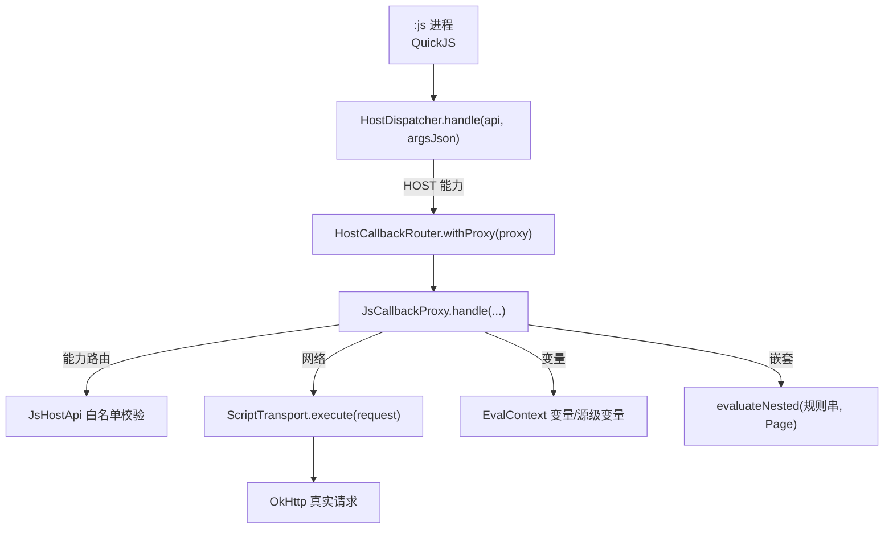
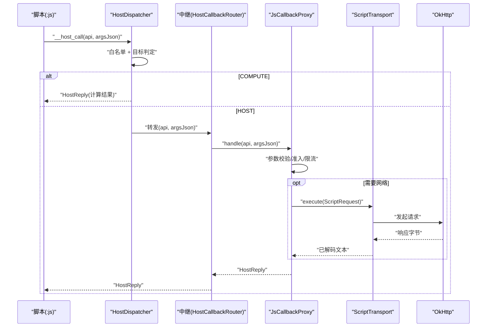
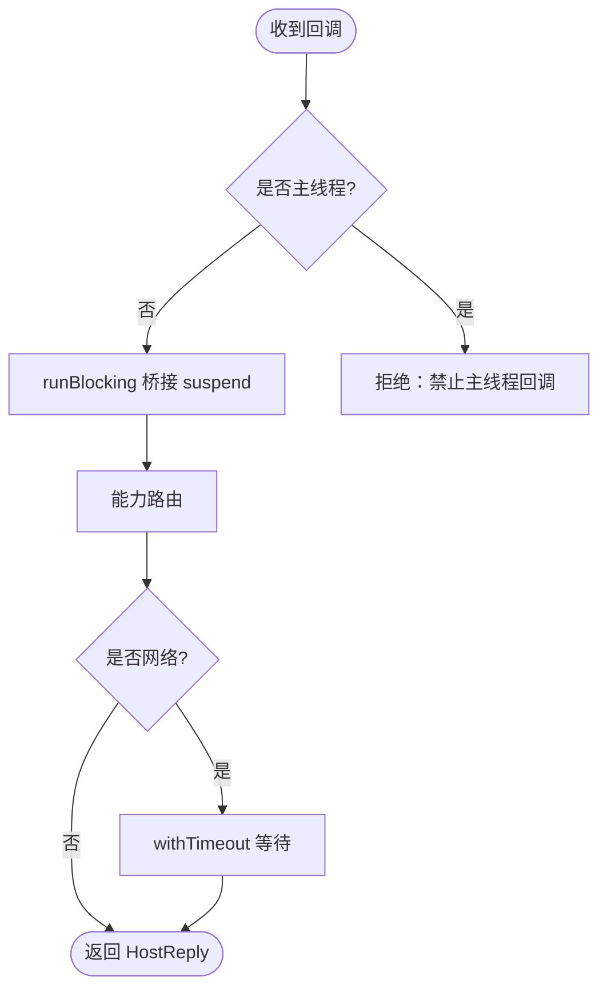
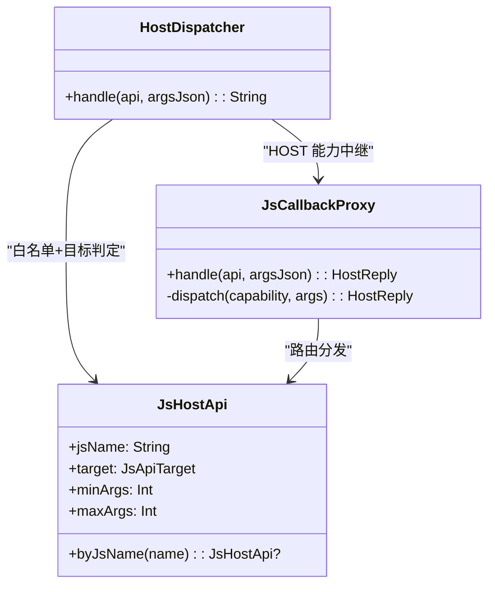
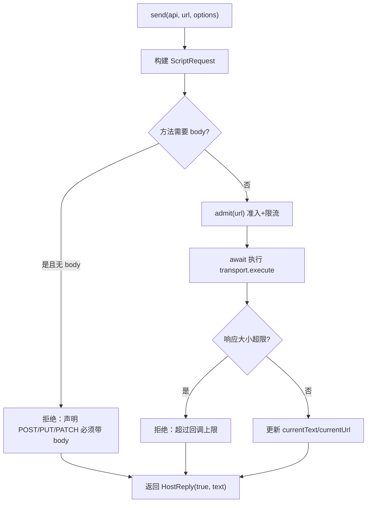
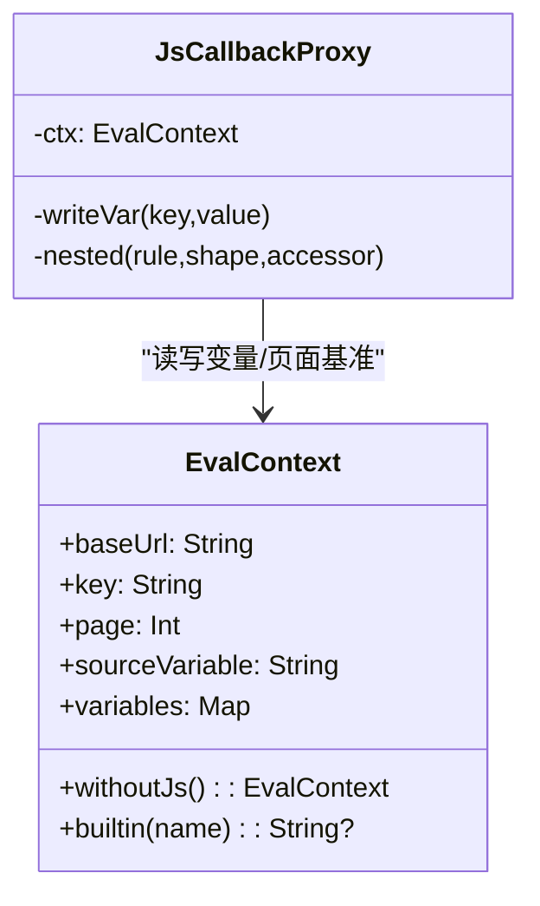
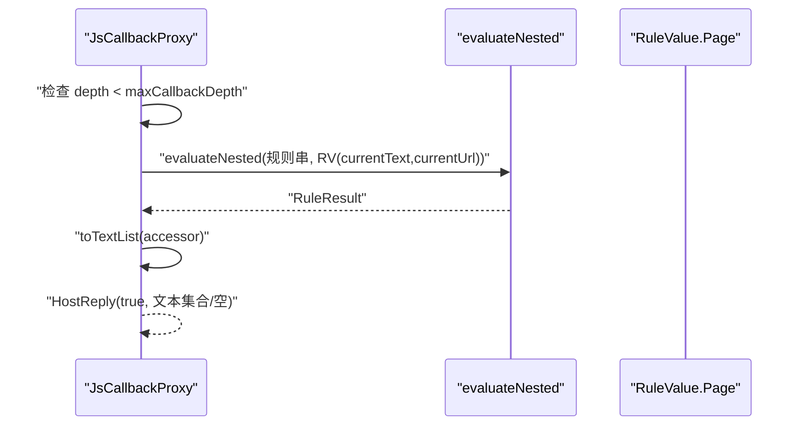
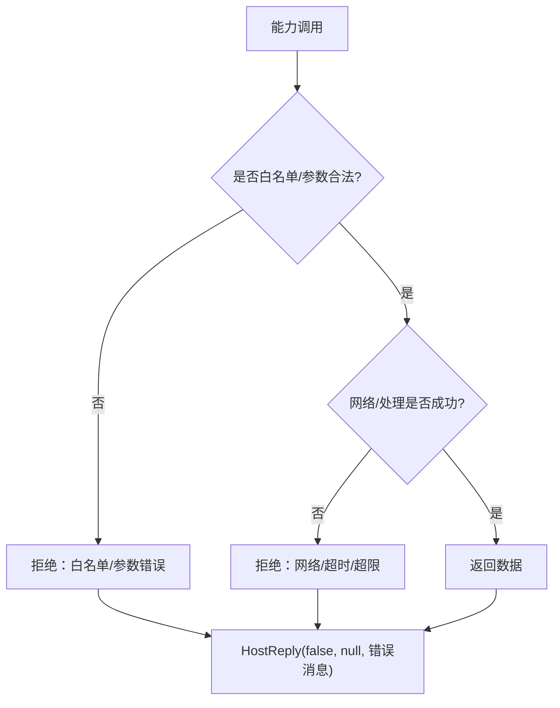
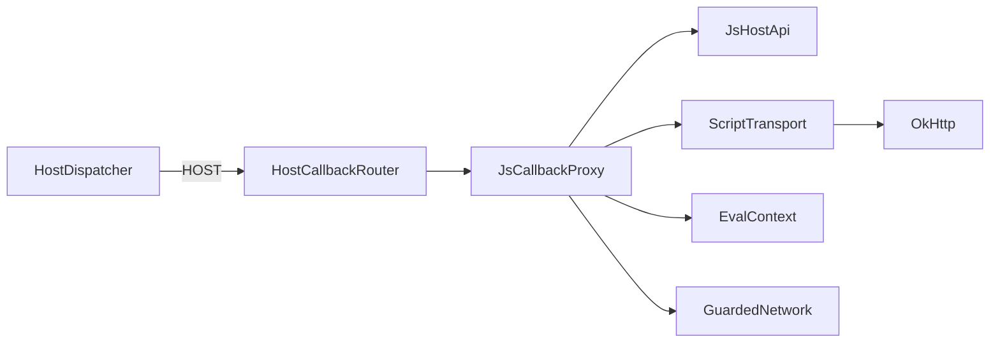

# 回调代理工作流程

<cite>
**本文引用的文件**
- [JsCallbackProxy.kt](file://lib_book_source/src/main/java/com/ebook/source/sandbox/JsCallbackProxy.kt)
- [HostDispatcher.kt](file://lib_book_source/src/main/java/com/ebook/source/sandbox/HostDispatcher.kt)
- [JsSandboxHost.kt](file://lib_book_source/src/main/java/com/ebook/source/sandbox/JsSandboxHost.kt)
- [JsHostApi.kt](file://lib_book_source/src/main/java/com/ebook/source/script/JsHostApi.kt)
- [EvalContext.kt](file://lib_book_source/src/main/java/com/ebook/source/script/EvalContext.kt)
- [ScriptHttp.kt](file://lib_book_source/src/main/java/com/ebook/source/script/ScriptHttp.kt)
</cite>

## 目录
1. [引言](#引言)
2. [项目结构](#项目结构)
3. [核心组件](#核心组件)
4. [架构总览](#架构总览)
5. [详细组件分析](#详细组件分析)
6. [依赖关系分析](#依赖关系分析)
7. [性能考量](#性能考量)
8. [故障排查指南](#故障排查指南)
9. [结论](#结论)

## 引言
本文件聚焦“回调代理”的工作流程，围绕 HostCallbackProxy 的线程模型、能力路由、网络请求处理、变量管理、嵌套求值与错误处理展开，目标是让读者在不深入源码的前提下也能理解脚本在沙箱中通过 host 回调调用主进程能力的完整链路。

## 项目结构
与回调代理直接相关的代码集中在 lib_book_source 模块的沙箱与脚本层：
- 沙箱侧入口：HostDispatcher（:js 进程内 JNI 入口）
- 主进程侧装配：JsSandboxHost（桥接客户端与任务级代理）
- 回调代理：JsCallbackProxy（统一受理 host 回调，负责白名单校验、参数校验、限流、网络、变量与嵌套求值）
- 能力表：JsHostApi（白名单枚举，区分 COMPUTE/HOST）
- 上下文：EvalContext（任务级变量与作用域）
- 传输层：ScriptHttp（ScriptTransport 接口与 OkHttp 实现）

**图表来源**
- [HostDispatcher.kt:47-73](file://lib_book_source/src/main/java/com/ebook/source/sandbox/HostDispatcher.kt#L47-L73)
- [JsSandboxHost.kt:29-59](file://lib_book_source/src/main/java/com/ebook/source/sandbox/JsSandboxHost.kt#L29-L59)
- [JsCallbackProxy.kt:152-239](file://lib_book_source/src/main/java/com/ebook/source/sandbox/JsCallbackProxy.kt#L152-L239)
- [JsHostApi.kt:17-110](file://lib_book_source/src/main/java/com/ebook/source/script/JsHostApi.kt#L17-L110)
- [ScriptHttp.kt:12-31](file://lib_book_source/src/main/java/com/ebook/source/script/ScriptHttp.kt#L12-L31)

**章节来源**
- [HostDispatcher.kt:47-73](file://lib_book_source/src/main/java/com/ebook/source/sandbox/HostDispatcher.kt#L47-L73)
- [JsCallbackProxy.kt:152-239](file://lib_book_source/src/main/java/com/ebook/source/sandbox/JsCallbackProxy.kt#L152-L239)
- [JsHostApi.kt:17-110](file://lib_book_source/src/main/java/com/ebook/source/script/JsHostApi.kt#L17-L110)
- [ScriptHttp.kt:12-31](file://lib_book_source/src/main/java/com/ebook/source/script/ScriptHttp.kt#L12-L31)

## 核心组件
- HostDispatcher：JNI 入口，二次白名单校验，COMPUTE 走本地计算，HOST 走中继到主进程。
- JsSandboxHost：装配面，持有客户端与每任务的回调代理转子（HostCallbackRouter），构造任务级 ScriptJsBridge。
- JsCallbackProxy：主进程回调代理，统一受理 host 回调，包含能力路由、准入/限流、网络外呼、变量读写、嵌套求值与日志。
- JsHostApi：能力白名单，区分 COMPUTE（纯计算）与 HOST（需主进程）。
- EvalContext：任务级上下文，维护 baseUrl/key/page 与变量表、源级变量，提供 withoutJs() 视图供嵌套求值使用。
- ScriptTransport：取文抽象，OkHttp 实现按 charset 解码并支持重试。

**章节来源**
- [HostDispatcher.kt:24-73](file://lib_book_source/src/main/java/com/ebook/source/sandbox/HostDispatcher.kt#L24-L73)
- [JsSandboxHost.kt:21-59](file://lib_book_source/src/main/java/com/ebook/source/sandbox/JsSandboxHost.kt#L21-L59)
- [JsCallbackProxy.kt:105-239](file://lib_book_source/src/main/java/com/ebook/source/sandbox/JsCallbackProxy.kt#L105-L239)
- [JsHostApi.kt:17-110](file://lib_book_source/src/main/java/com/ebook/source/script/JsHostApi.kt#L17-L110)
- [EvalContext.kt:25-83](file://lib_book_source/src/main/java/com/ebook/source/script/EvalContext.kt#L25-L83)
- [ScriptHttp.kt:12-31](file://lib_book_source/src/main/java/com/ebook/source/script/ScriptHttp.kt#L12-L31)

## 架构总览
回调代理的总体调用链如下：
1) :js 进程通过 JNI 调用 HostDispatcher.handle；
2) HostDispatcher 根据 JsHostApi 判定是 COMPUTE 还是 HOST；
3) HOST 类能力经中继转给主进程的 JsCallbackProxy.handle；
4) JsCallbackProxy 完成能力路由、参数校验、准入与限流、网络/变量/嵌套等逻辑；
5) 结果以 HostReply 返回 :js 进程。

**图表来源**
- [HostDispatcher.kt:47-73](file://lib_book_source/src/main/java/com/ebook/source/sandbox/HostDispatcher.kt#L47-L73)
- [JsCallbackProxy.kt:152-239](file://lib_book_source/src/main/java/com/ebook/source/sandbox/JsCallbackProxy.kt#L152-L239)
- [ScriptHttp.kt:43-88](file://lib_book_source/src/main/java/com/ebook/source/script/ScriptHttp.kt#L43-L88)

## 详细组件分析

### 线程模型与桥接机制
- 主线程守卫：执行器不得在主线程调用沙箱；回调代理在 handle 中用 runBlocking 桥接同步契约与 suspend 传输层，阻塞的是 binder 线程而非主线程。
- Binder 线程池调度：handle 由 JNI 在 binder 线程上触发，多次回调可能落在不同线程；代理内部可变状态使用 @Volatile 保证可见性。
- 协程桥接：dispatch 为 suspend，外层用 runBlocking 桥接到同步契约；网络等待使用 withTimeout 保护 binder 线程不被长时间占用。
- 任务级作用域：HostCallbackRouter 在同一时刻只允许一个代理存在，避免多任务并发时变量泄漏。

**图表来源**
- [JsCallbackProxy.kt:152-177](file://lib_book_source/src/main/java/com/ebook/source/sandbox/JsCallbackProxy.kt#L152-L177)
- [JsCallbackProxy.kt:292-300](file://lib_book_source/src/main/java/com/ebook/source/sandbox/JsCallbackProxy.kt#L292-L300)
- [JsCallbackProxy.kt:57-75](file://lib_book_source/src/main/java/com/ebook/source/sandbox/JsCallbackProxy.kt#L57-L75)

**章节来源**
- [JsCallbackProxy.kt:57-75](file://lib_book_source/src/main/java/com/ebook/source/sandbox/JsCallbackProxy.kt#L57-L75)
- [JsCallbackProxy.kt:152-177](file://lib_book_source/src/main/java/com/ebook/source/sandbox/JsCallbackProxy.kt#L152-L177)
- [JsCallbackProxy.kt:292-300](file://lib_book_source/src/main/java/com/ebook/source/sandbox/JsCallbackProxy.kt#L292-L300)

### 能力路由机制
- 白名单验证：通过 JsHostApi.byJsName 查找能力，不存在则拒绝；COMPUTE 能力直接在沙箱侧计算，不经过主进程。
- 参数校验：将 JSON 字符串解析为数组，检查元数（minArgs/maxArgs），不符合即抛出类型化异常，转为 ok=false 回传。
- 分发策略：AJAX/LOAD/POST/RESPONSE_CODE/SET_CONTENT/VAR/COOKIE/GET_ELEMENTS/TOAST/LOG 等各自分支处理。

**图表来源**
- [JsHostApi.kt:17-110](file://lib_book_source/src/main/java/com/ebook/source/script/JsHostApi.kt#L17-L110)
- [HostDispatcher.kt:47-73](file://lib_book_source/src/main/java/com/ebook/source/sandbox/HostDispatcher.kt#L47-L73)
- [JsCallbackProxy.kt:152-239](file://lib_book_source/src/main/java/com/ebook/source/sandbox/JsCallbackProxy.kt#L152-L239)

**章节来源**
- [JsHostApi.kt:17-110](file://lib_book_source/src/main/java/com/ebook/source/script/JsHostApi.kt#L17-L110)
- [JsCallbackProxy.kt:152-239](file://lib_book_source/src/main/java/com/ebook/source/sandbox/JsCallbackProxy.kt#L152-L239)

### 网络请求处理流程
- 准入检查：GuardedNetwork 基于源白名单进行 DNS/地址校验，拒绝私网与黑名单；未通过的请求不会发出也不消耗配额。
- 限流控制：每轮任务限制最大请求次数，超限即拒绝；探测 responseCode 同样计入配额。
- 请求构建：optionsOf/postOptions 统一解析选项，post 自动设置表单 Content-Type，可被脚本覆盖；headerMap 支持对象或 JSON 字符串。
- 响应处理：按 charset 解码文本，超出单次回调上限则拒绝；成功后更新当前页基准（currentText/currentUrl）供后续定位。

**图表来源**
- [JsCallbackProxy.kt:241-309](file://lib_book_source/src/main/java/com/ebook/source/sandbox/JsCallbackProxy.kt#L241-L309)
- [ScriptHttp.kt:43-88](file://lib_book_source/src/main/java/com/ebook/source/script/ScriptHttp.kt#L43-L88)

**章节来源**
- [JsCallbackProxy.kt:241-309](file://lib_book_source/src/main/java/com/ebook/source/sandbox/JsCallbackProxy.kt#L241-L309)
- [ScriptHttp.kt:43-88](file://lib_book_source/src/main/java/com/ebook/source/script/ScriptHttp.kt#L43-L88)

### 变量管理机制
- EvalContext.variables：按键存取的任务级变量，写后即读（嵌套求值共享同一实例）。
- sourceVariable：源级整串变量，跨调用存活于本次任务，用于脚本整段 JSON 读写。
- 作用域控制：baseUrl 随翻页推进，key/page 仅搜索/发现场景有意义；withoutJs() 提供快照视图供嵌套求值。
- 访问方式：putVar/getVar/rmVar 与 sourceGetVariable/sourceSetVariable 分别对应两类变量面。

**图表来源**
- [EvalContext.kt:25-83](file://lib_book_source/src/main/java/com/ebook/source/script/EvalContext.kt#L25-L83)
- [JsCallbackProxy.kt:206-230](file://lib_book_source/src/main/java/com/ebook/source/sandbox/JsCallbackProxy.kt#L206-L230)

**章节来源**
- [EvalContext.kt:25-83](file://lib_book_source/src/main/java/com/ebook/source/script/EvalContext.kt#L25-L83)
- [JsCallbackProxy.kt:206-230](file://lib_book_source/src/main/java/com/ebook/source/sandbox/JsCallbackProxy.kt#L206-L230)

### 嵌套求值的实现
- evaluateNested：将规则串与当前页面（RuleValue.Page）交给解释器求值，形状由 shape/accessor 决定（列表/单值/文本）。
- 递归深度保护：depth 计数器限制最大嵌套层数，防止死循环与双向死锁（外层 execute 持有 JS runtime）。
- 基准传递：每次 ajax/load 成功会推进 currentText/currentUrl，嵌套求值基于最新页面进行定位。

**图表来源**
- [JsCallbackProxy.kt:413-430](file://lib_book_source/src/main/java/com/ebook/source/sandbox/JsCallbackProxy.kt#L413-L430)

**章节来源**
- [JsCallbackProxy.kt:413-430](file://lib_book_source/src/main/java/com/ebook/source/sandbox/JsCallbackProxy.kt#L413-L430)

### 错误处理策略
- 类型化异常：JsApiRejectedException 表示能力拒绝（如参数不符、白名单拒绝、超时、响应过大），消息明确到 api 与原因。
- 用户友好消息：所有失败统一封装为 HostReply(ok=false, data=null, error=消息)，避免把技术细节暴露给脚本。
- 调试信息收集：toast/log 映射到日志出口，便于定位问题；网络失败原样透传并由代理转换为 ok=false。

**图表来源**
- [JsCallbackProxy.kt:152-177](file://lib_book_source/src/main/java/com/ebook/source/sandbox/JsCallbackProxy.kt#L152-L177)
- [JsCallbackProxy.kt:247-277](file://lib_book_source/src/main/java/com/ebook/source/sandbox/JsCallbackProxy.kt#L247-L277)
- [JsCallbackProxy.kt:292-300](file://lib_book_source/src/main/java/com/ebook/source/sandbox/JsCallbackProxy.kt#L292-L300)

**章节来源**
- [JsCallbackProxy.kt:152-177](file://lib_book_source/src/main/java/com/ebook/source/sandbox/JsCallbackProxy.kt#L152-L177)
- [JsCallbackProxy.kt:247-277](file://lib_book_source/src/main/java/com/ebook/source/sandbox/JsCallbackProxy.kt#L247-L277)
- [JsCallbackProxy.kt:292-300](file://lib_book_source/src/main/java/com/ebook/source/sandbox/JsCallbackProxy.kt#L292-L300)

## 依赖关系分析
- HostDispatcher 依赖 JsHostApi 与中继，不直接感知主进程实现。
- JsSandboxHost 组装 HostCallbackRouter 与任务级代理，提供 bridgeFor 构造 ScriptJsBridge。
- JsCallbackProxy 依赖 JsHostApi（白名单）、ScriptTransport（网络）、EvalContext（变量）、GuardedNetwork（安全 DNS/会话）。
- ScriptHttp 提供 OkHttp 实现，显式解码与重试。

**图表来源**
- [HostDispatcher.kt:47-73](file://lib_book_source/src/main/java/com/ebook/source/sandbox/HostDispatcher.kt#L47-L73)
- [JsSandboxHost.kt:29-59](file://lib_book_source/src/main/java/com/ebook/source/sandbox/JsSandboxHost.kt#L29-L59)
- [JsCallbackProxy.kt:105-239](file://lib_book_source/src/main/java/com/ebook/source/sandbox/JsCallbackProxy.kt#L105-L239)
- [ScriptHttp.kt:43-88](file://lib_book_source/src/main/java/com/ebook/source/script/ScriptHttp.kt#L43-L88)

**章节来源**
- [JsSandboxHost.kt:29-59](file://lib_book_source/src/main/java/com/ebook/source/sandbox/JsSandboxHost.kt#L29-L59)
- [JsCallbackProxy.kt:105-239](file://lib_book_source/src/main/java/com/ebook/source/sandbox/JsCallbackProxy.kt#L105-L239)

## 性能考量
- 白名单前置：准入检查在真正外呼前完成，避免无效请求消耗配额与时间。
- 限流与超时：per-task 请求上限与 wall-clock 超时保护 binder 线程与整体吞吐。
- 连接复用：OkHttp 客户端共享连接池，按需派生带超时的客户端减少开销。
- 响应体大小限制：单次回调上限防止大响应拖垮执行链。
- 嵌套深度限制：防止递归过深导致 CPU/内存压力。

[本节为通用指导，无需具体文件引用]

## 故障排查指南
- 白名单拒绝：检查源规则导出的主机白名单，确认 URL 域名是否在允许范围。
- 参数错误：核对 api 名与实参个数/类型，确保第二参为对象或字符集字符串（ajax/load）。
- 网络失败：查看日志输出（toast/log），确认超时、重试、charset 配置是否正确。
- 变量未生效：确认 EvalContext 的作用域与变量写入位置，嵌套求值共享同一 variables 实例。
- 嵌套卡死：检查 evaluateNested 的深度与规则串是否产生无限递归；必要时拆分规则或引入缓存。

**章节来源**
- [JsCallbackProxy.kt:152-177](file://lib_book_source/src/main/java/com/ebook/source/sandbox/JsCallbackProxy.kt#L152-L177)
- [JsCallbackProxy.kt:247-309](file://lib_book_source/src/main/java/com/ebook/source/sandbox/JsCallbackProxy.kt#L247-L309)
- [EvalContext.kt:25-83](file://lib_book_source/src/main/java/com/ebook/source/script/EvalContext.kt#L25-L83)

## 结论
回调代理通过严格的白名单、参数校验、准入与限流、安全的网络通道与任务级变量作用域，构建了脚本到主进程的稳定桥梁。线程模型保障主线程不受阻塞，嵌套求值提供灵活规则组合，错误处理兼顾用户体验与调试效率。遵循上述设计与规范，可在扩展新能力或调整行为时保持系统稳定与可观测性。