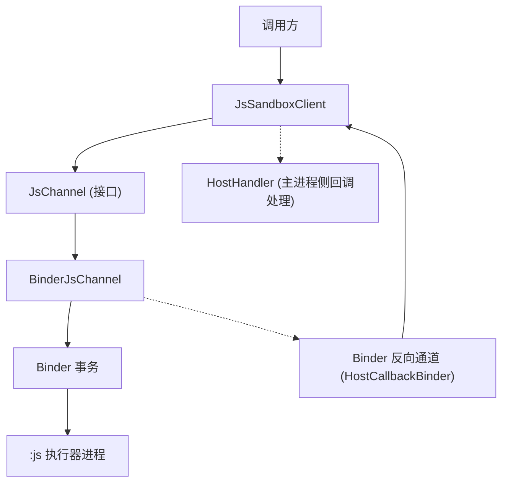
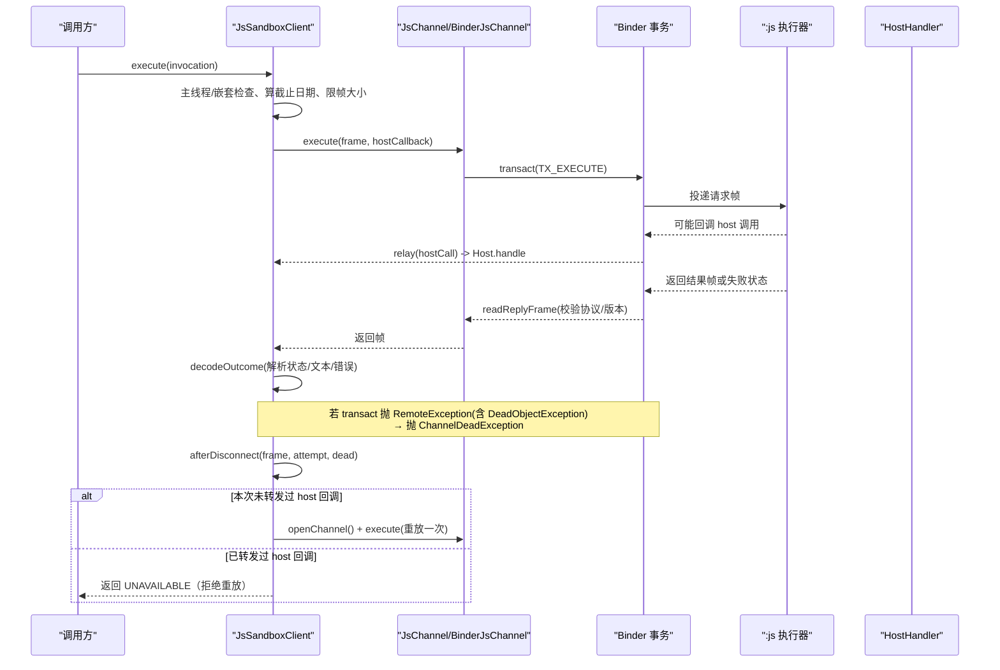
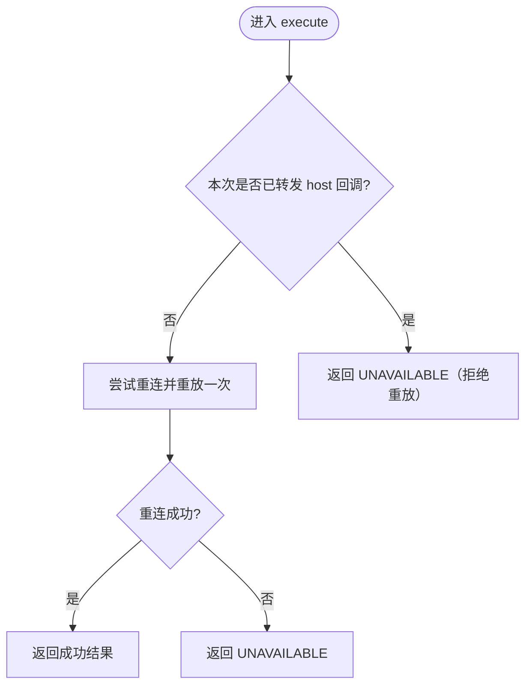
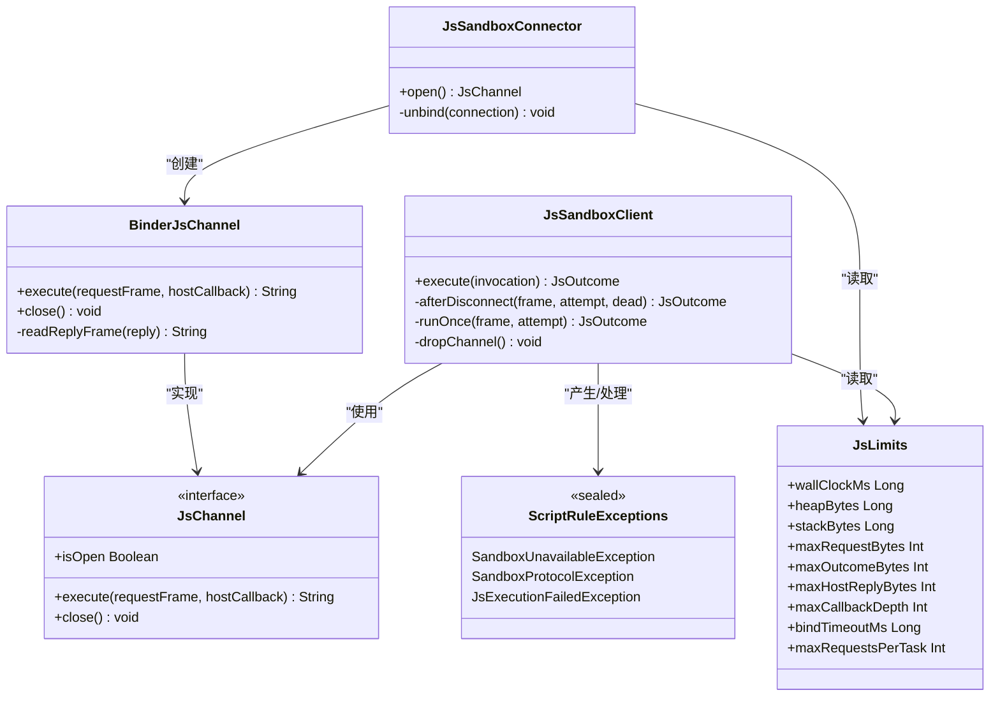

# 错误恢复与重连机制

<cite>
**本文引用的文件**   
- [JsSandboxConnector.kt](file://lib_book_source/src/main/java/com/ebook/source/sandbox/JsSandboxConnector.kt)
- [JsSandboxClient.kt](file://lib_book_source/src/main/java/com/ebook/source/sandbox/JsSandboxClient.kt)
- [BinderJsChannel.kt](file://lib_book_source/src/main/java/com/ebook/source/sandbox/BinderJsChannel.kt)
- [JsChannel.kt](file://lib_book_source/src/main/java/com/ebook/source/sandbox/JsChannel.kt)
- [JsLimits.kt](file://lib_book_source/src/main/java/com/ebook/source/sandbox/JsLimits.kt)
- [ScriptRuleExceptions.kt](file://lib_book_source/src/main/java/com/ebook/source/script/ScriptRuleExceptions.kt)
- [JsSandboxClientTest.kt](file://lib_book_source/src/test/java/com/ebook/source/sandbox/JsSandboxClientTest.kt)
- [SandboxTaskRunnerTest.kt](file://lib_book_source/src/test/java/com/ebook/source/sandbox/SandboxTaskRunnerTest.kt)
</cite>

## 目录
1. [简介](#简介)
2. [项目结构](#项目结构)
3. [核心组件](#核心组件)
4. [架构总览](#架构总览)
5. [详细组件分析](#详细组件分析)
6. [依赖关系分析](#依赖关系分析)
7. [性能考量](#性能考量)
8. [故障诊断指南](#故障诊断指南)
9. [结论](#结论)

## 简介
本文聚焦“脚本沙箱执行器”的跨进程连接、错误恢复与重连机制。内容覆盖：
- 断线检测：onBindingDied 回调处理、DeadObjectException 捕获策略
- 自动重连：连接失败分类（SandboxUnavailableException vs ChannelDeadException）、重试策略
- 请求重放：连接恢复后对未完成任务的重试逻辑
- 状态同步：连接重建后的上下文恢复与一致性保证
- 超时处理：bindTimeoutMs 配置与影响
- 最佳实践：日志记录、监控告警、用户提示
- 故障诊断与常见问题解决方案

## 项目结构
该能力集中在 lib_book_source 模块的沙箱通道层，围绕以下关键文件协作：
- JsSandboxConnector：负责 bindService 拉起 :js 进程、等待 IBinder、绑定生命周期管理
- BinderJsChannel：基于 Binder 的一次事务一帧通道实现，封装协议校验与异常分类
- JsSandboxClient：主进程侧统一客户端，串行化执行、断连重连、重放控制、host 回调中继
- JsChannel 与异常定义：抽象通道接口与“通道死亡”等异常类型
- JsLimits：集中配置超时与资源上限（含 bindTimeoutMs）
- ScriptRuleExceptions：类型化异常体系（不可用、协议不合、执行失败等）

图表来源
- [JsSandboxClient.kt:35-99](file://lib_book_source/src/main/java/com/ebook/source/sandbox/JsSandboxClient.kt#L35-L99)
- [BinderJsChannel.kt:20-65](file://lib_book_source/src/main/java/com/ebook/source/sandbox/BinderJsChannel.kt#L20-L65)
- [JsChannel.kt:7-24](file://lib_book_source/src/main/java/com/ebook/source/sandbox/JsChannel.kt#L7-L24)

章节来源
- [JsSandboxConnector.kt:13-65](file://lib_book_source/src/main/java/com/ebook/source/sandbox/JsSandboxConnector.kt#L13-L65)
- [JsSandboxClient.kt:8-34](file://lib_book_source/src/main/java/com/ebook/source/sandbox/JsSandboxClient.kt#L8-L34)
- [BinderJsChannel.kt:10-18](file://lib_book_source/src/main/java/com/ebook/source/sandbox/BinderJsChannel.kt#L10-L18)
- [JsChannel.kt:3-24](file://lib_book_source/src/main/java/com/ebook/source/sandbox/JsChannel.kt#L3-L24)
- [JsLimits.kt:13-58](file://lib_book_source/src/main/java/com/ebook/source/sandbox/JsLimits.kt#L13-L58)

## 核心组件
- JsSandboxConnector：完成与服务端的绑定、等待 IBinder、在 onBindingDied/onNullBinding 等回调中统一上报失败；绑定阶段抛出 SandboxUnavailableException，避免误触发重放
- BinderJsChannel：将传输层失败归类为 ChannelDeadException（可重连），协议不匹配归类为 SandboxProtocolException（不可重连，直接上抛）
- JsSandboxClient：唯一执行入口，负责：
  - 主线程保护与嵌套调用保护
  - 请求帧大小限制与截止日期计算
  - 断连后根据“是否已转发 host 回调”决定重放与否
  - 通道复用与失效清理
  - 结果解码与异常分类
- JsLimits：集中配置 wallClockMs、maxRequestBytes、maxOutcomeBytes、bindTimeoutMs 等，是超时与容量控制的单一事实源
- ScriptRuleExceptions：提供 SandboxUnavailableException、SandboxProtocolException、JsExecutionFailedException 等类型化异常，便于上层差异化处置

章节来源
- [JsSandboxConnector.kt:32-65](file://lib_book_source/src/main/java/com/ebook/source/sandbox/JsSandboxConnector.kt#L32-L65)
- [BinderJsChannel.kt:41-65](file://lib_book_source/src/main/java/com/ebook/source/sandbox/BinderJsChannel.kt#L41-L65)
- [JsSandboxClient.kt:65-99](file://lib_book_source/src/main/java/com/ebook/source/sandbox/JsSandboxClient.kt#L65-L99)
- [JsLimits.kt:13-58](file://lib_book_source/src/main/java/com/ebook/source/sandbox/JsLimits.kt#L13-L58)
- [ScriptRuleExceptions.kt:19-85](file://lib_book_source/src/main/java/com/ebook/source/script/ScriptRuleExceptions.kt#L19-L85)

## 架构总览
下图展示了从发起执行到可能的断连重连与重放的整体流程，以及异常分类如何驱动不同路径。

图表来源
- [JsSandboxClient.kt:65-135](file://lib_book_source/src/main/java/com/ebook/source/sandbox/JsSandboxClient.kt#L65-L135)
- [BinderJsChannel.kt:41-65](file://lib_book_source/src/main/java/com/ebook/source/sandbox/BinderJsChannel.kt#L41-L65)
- [JsChannel.kt:7-24](file://lib_book_source/src/main/java/com/ebook/source/sandbox/JsChannel.kt#L7-L24)

## 详细组件分析

### 断线检测与 onBindingDied 处理
- 连接建立阶段（open）：
  - bindService 失败或系统拒绝绑定 → 抛出 SandboxUnavailableException（不会触发重放）
  - onServiceConnected/onNullBinding/onBindingDied 三种路径统一通过闩等待并设置 failure/binder；超时则抛出 SandboxUnavailableException
- 运行阶段（execute）：
  - Binder 事务抛 RemoteException（包含 DeadObjectException）→ 转换为 ChannelDeadException，交由客户端重连重放策略处理
  - onServiceDisconnected 仅记录日志，不立即关闭 binder，留给下一次事务判死

设计要点：
- 将“连接失败”和“运行时断连”区分开：前者抛 SandboxUnavailableException，后者抛 ChannelDeadException
- onBindingDied 在连接建立阶段用于快速失败，避免长时间阻塞；在运行阶段由事务异常驱动

章节来源
- [JsSandboxConnector.kt:37-65](file://lib_book_source/src/main/java/com/ebook/source/sandbox/JsSandboxConnector.kt#L37-L65)
- [JsSandboxConnector.kt:86-116](file://lib_book_source/src/main/java/com/ebook/source/sandbox/JsSandboxConnector.kt#L86-L116)
- [BinderJsChannel.kt:54-65](file://lib_book_source/src/main/java/com/ebook/source/sandbox/BinderJsChannel.kt#L54-L65)

### 自动重连与重试策略
- 重连触发：当 execute 过程中抛出 ChannelDeadException
- 重放条件：仅当本次调用尚未转发任何 host 回调（attempt.relayed == 0）时，才允许重连并重放一次
- 重放次数：最多一次；若重连仍失败，直接返回 UNAVAILABLE，不再继续重试
- 通道管理：旧通道 close 并丢弃；新通道复用策略由客户端维护 isOpen 判断

分类与语义：
- ChannelDeadException：表示传输层断开（可重连、可重放）
- SandboxProtocolException：表示两侧协议不一致（不可重连，直接上抛）
- SandboxUnavailableException：表示连接阶段不可用（不重放）

章节来源
- [JsSandboxClient.kt:89-135](file://lib_book_source/src/main/java/com/ebook/source/sandbox/JsSandboxClient.kt#L89-L135)
- [JsSandboxClientTest.kt:123-147](file://lib_book_source/src/test/java/com/ebook/source/sandbox/JsSandboxClientTest.kt#L123-L147)
- [JsChannel.kt:23-24](file://lib_book_source/src/main/java/com/ebook/source/sandbox/JsChannel.kt#L23-L24)

### 请求重放机制
- 重放边界：以本次 execute 的 Attempt 为准，一旦 relay 被调用（即有副作用发生），重放窗口关闭
- 重放内容：同一请求帧（frame），保持截止日期一致，确保执行器端可比对期限
- 重放目的：在无副作用的前提下，尽量透明地恢复因瞬时断连导致的失败

图示：重放决策流程

图表来源
- [JsSandboxClient.kt:116-135](file://lib_book_source/src/main/java/com/ebook/source/sandbox/JsSandboxClient.kt#L116-L135)
- [JsSandboxClientTest.kt:150-160](file://lib_book_source/src/test/java/com/ebook/source/sandbox/JsSandboxClientTest.kt#L150-L160)

### 状态同步与一致性保障
- 单实例 runtime：客户端持有单个 channel，并发通过 inFlight 锁串行化，保证同一时刻只有一帧在飞
- 截止日期一致：使用 SystemClock.elapsedRealtime() 计算 deadlineMonoMs，主进程与执行器共享单调时钟，避免时间漂移导致超时判定不一致
- 上下文恢复：重放时沿用原 frame，保持执行上下文一致；host 回调深度标记 insideHostCall 防止嵌套调用引发死锁
- 数据一致性：重放仅在无副作用时进行，避免重复网络请求或重复页面加载

章节来源
- [JsSandboxClient.kt:21-33](file://lib_book_source/src/main/java/com/ebook/source/sandbox/JsSandboxClient.kt#L21-L33)
- [JsSandboxClient.kt:57-63](file://lib_book_source/src/main/java/com/ebook/source/sandbox/JsSandboxClient.kt#L57-L63)
- [JsSandboxClient.kt:152-181](file://lib_book_source/src/main/java/com/ebook/source/sandbox/JsSandboxClient.kt#L152-L181)

### 超时处理与 bindTimeoutMs
- bindTimeoutMs：控制等待 :js 进程绑定的最大时长；冷启动或进程创建不应消耗规则执行的 wallClockMs 预算
- wallClockMs：单次执行挂钟上限，由执行器线程逐轮比对，防止死循环
- 请求/响应帧大小限制：maxRequestBytes、maxOutcomeBytes、maxHostReplyBytes 受 binder 事务缓冲约束，超限直接返回 TOO_LARGE
- 其他限制：heapBytes、stackBytes、maxCallbackDepth、maxRequestsPerTask 共同保障稳定性

章节来源
- [JsLimits.kt:13-58](file://lib_book_source/src/main/java/com/ebook/source/sandbox/JsLimits.kt#L13-L58)
- [JsSandboxConnector.kt:19-23](file://lib_book_source/src/main/java/com/ebook/source/sandbox/JsSandboxConnector.kt#L19-L23)
- [SandboxTaskRunnerTest.kt:42-48](file://lib_book_source/src/test/java/com/ebook/source/sandbox/SandboxTaskRunnerTest.kt#L42-L48)

### 异常分类与处置建议
- SandboxUnavailableException：连接阶段不可用（服务不存在、绑定失败、超时）→ 提示“当前不可用”，不重放
- ChannelDeadException：运行期断连（DeadObjectException、事务失败）→ 重连并重放一次（若无副作用）
- SandboxProtocolException：协议不符（接口标识/版本不匹配）→ 不重连，直接上抛，提示“接线缺陷/版本不一致”
- JsExecutionFailedException：执行期失败（超时、内存/栈越限、不支持 API、语法错误）→ 按状态码分类处理

章节来源
- [ScriptRuleExceptions.kt:19-85](file://lib_book_source/src/main/java/com/ebook/source/script/ScriptRuleExceptions.kt#L19-L85)
- [BinderJsChannel.kt:54-84](file://lib_book_source/src/main/java/com/ebook/source/sandbox/BinderJsChannel.kt#L54-L84)
- [JsSandboxClientTest.kt:162-170](file://lib_book_source/src/test/java/com/ebook/source/sandbox/JsSandboxClientTest.kt#L162-L170)

## 依赖关系分析
- JsSandboxConnector 依赖 Android ServiceConnection 与 Intent，负责进程间绑定
- BinderJsChannel 依赖 android.os.Binder/Parcel，负责传输与协议校验
- JsSandboxClient 依赖 JsChannel 抽象与 HostHandler，屏蔽具体传输细节
- 所有超时与容量限制集中于 JsLimits，避免散落配置
- 异常类型集中在 ScriptRuleExceptions，便于上层统一分类处理

图表来源
- [JsSandboxConnector.kt:24-65](file://lib_book_source/src/main/java/com/ebook/source/sandbox/JsSandboxConnector.kt#L24-L65)
- [JsSandboxClient.kt:35-99](file://lib_book_source/src/main/java/com/ebook/source/sandbox/JsSandboxClient.kt#L35-L99)
- [BinderJsChannel.kt:20-84](file://lib_book_source/src/main/java/com/ebook/source/sandbox/BinderJsChannel.kt#L20-L84)
- [JsChannel.kt:7-24](file://lib_book_source/src/main/java/com/ebook/source/sandbox/JsChannel.kt#L7-L24)
- [JsLimits.kt:13-58](file://lib_book_source/src/main/java/com/ebook/source/sandbox/JsLimits.kt#L13-L58)
- [ScriptRuleExceptions.kt:19-85](file://lib_book_source/src/main/java/com/ebook/source/script/ScriptRuleExceptions.kt#L19-L85)

章节来源
- [JsSandboxClientTest.kt:19-57](file://lib_book_source/src/test/java/com/ebook/source/sandbox/JsSandboxClientTest.kt#L19-L57)

## 性能考量
- 通道复用：活着的通道会复用，避免频繁 binder 建连与执行器 runtime 冷启动开销
- 串行化执行：inFlight 锁保证单帧并发，避免 binder 缓冲争抢与内存峰值过高
- 大小限制前置：请求帧超限直接拒绝，避免无谓跨进程调用
- 超时合理拆分：bindTimeoutMs 专用于连接阶段，wallClockMs 专用于执行阶段，互不干扰
- 回调深度限制：maxCallbackDepth 防止递归嵌套导致栈溢出或死锁

章节来源
- [JsSandboxClientTest.kt:78-86](file://lib_book_source/src/test/java/com/ebook/source/sandbox/JsSandboxClientTest.kt#L78-L86)
- [JsSandboxClientTest.kt:89-105](file://lib_book_source/src/test/java/com/ebook/source/sandbox/JsSandboxClientTest.kt#L89-L105)
- [JsSandboxClientTest.kt:108-120](file://lib_book_source/src/test/java/com/ebook/source/sandbox/JsSandboxClientTest.kt#L108-L120)
- [JsLimits.kt:27-50](file://lib_book_source/src/main/java/com/ebook/source/sandbox/JsLimits.kt#L27-L50)

## 故障诊断指南
- 症状：解析缓慢或卡住
  - 检查是否在主线程调用（会被守卫拦截），确认 wallClockMs 是否过小
  - 查看是否有大量嵌套 host 回调导致深度超限
- 症状：频繁报“不可用”
  - 若发生在连接阶段，检查 bindTimeoutMs 与服务可用性
  - 若发生在执行阶段，检查是否出现 ChannelDeadException（进程崩溃、事务过大）
- 症状：协议错误
  - SandboxProtocolException 表示两侧代码不同步，需对齐构建产物与协议版本
- 日志与监控
  - 连接器与通道层均记录关键失败点（绑定失败、事务失败、断连、协议不符）
  - 建议在应用层收集“不可用率”“重放成功率”“超时率”等指标
- 常见问题与解决
  - 服务不存在或被禁用：确认 :js 服务已启用且进程隔离正确
  - 事务过大：减少请求帧大小（整页 HTML 过大），调整 maxRequestBytes
  - 协议版本不符：重新构建并部署一致的 .so 与 Kotlin 产物

章节来源
- [JsSandboxConnector.kt:45-57](file://lib_book_source/src/main/java/com/ebook/source/sandbox/JsSandboxConnector.kt#L45-L57)
- [BinderJsChannel.kt:54-84](file://lib_book_source/src/main/java/com/ebook/source/sandbox/BinderJsChannel.kt#L54-L84)
- [JsSandboxClientTest.kt:253-259](file://lib_book_source/src/test/java/com/ebook/source/sandbox/JsSandboxClientTest.kt#L253-L259)

## 结论
本方案通过清晰的异常分类、严格的超时与容量限制、以及“无副作用才重放”的策略，实现了稳健的错误恢复与重连机制。关键点包括：
- 连接阶段失败与运行期断连严格区分，避免误重放
- 重放仅在安全窗口内执行，保证一致性
- 超时与资源限制集中管理，便于调优与监控
- 类型化异常使上层能精准处置，提升用户体验与可维护性