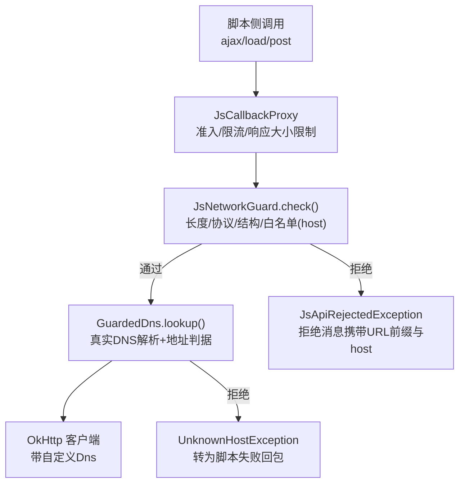
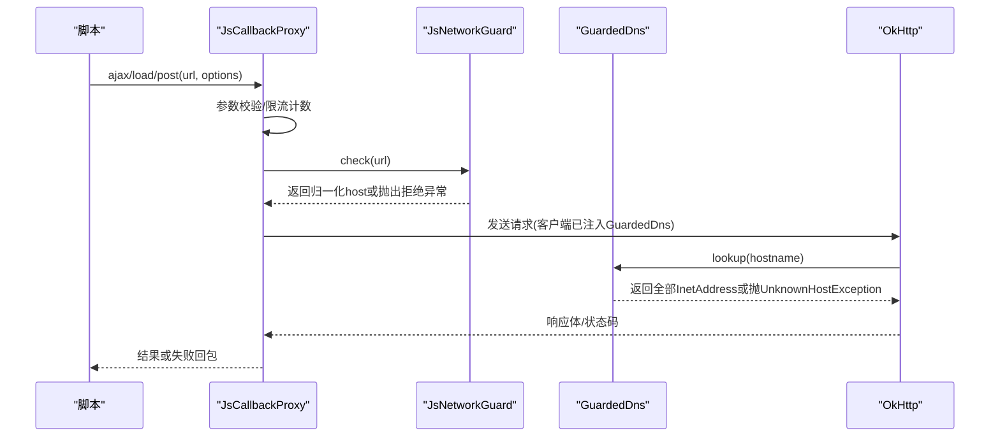
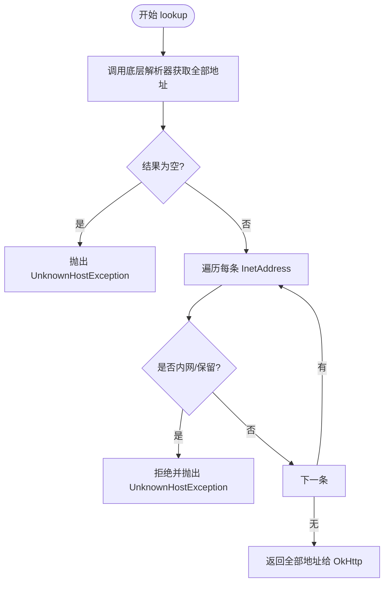
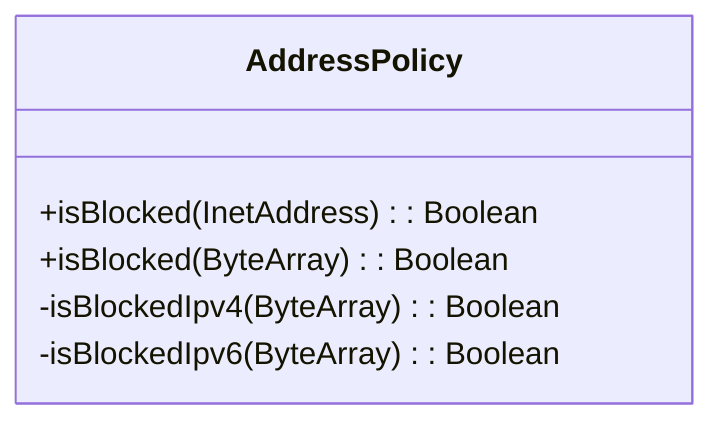
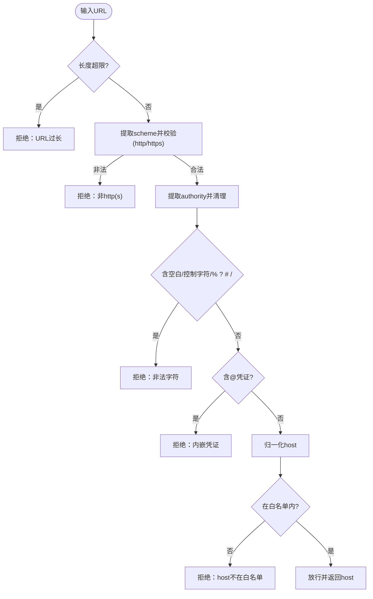
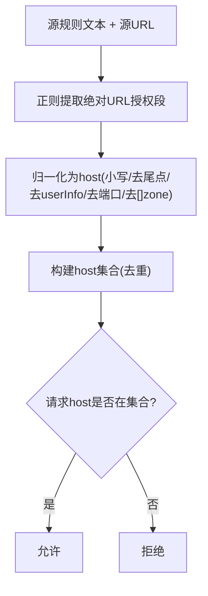
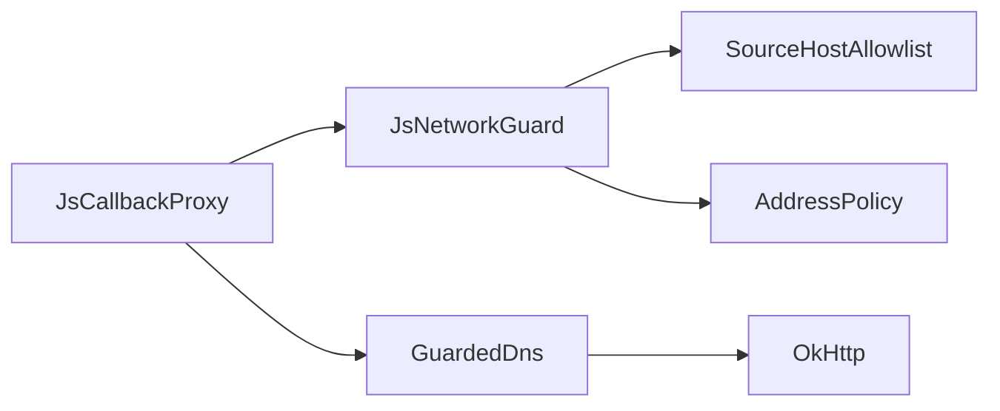

# URL 白名单绕过攻击

<cite>
**本文引用的文件**
- [JsNetworkGuard.kt](file://lib_book_source/src/main/java/com/ebook/source/sandbox/JsNetworkGuard.kt)
- [SourceHostAllowlist.kt](file://lib_book_source/src/main/java/com/ebook/source/sandbox/SourceHostAllowlist.kt)
- [JsCallbackProxy.kt](file://lib_book_source/src/main/java/com/ebook/source/sandbox/JsCallbackProxy.kt)
- [JsNetworkGuardTest.kt](file://lib_book_source/src/test/java/com/ebook/source/sandbox/JsNetworkGuardTest.kt)
- [SourceHostAllowlistTest.kt](file://lib_book_source/src/test/java/com/ebook/source/sandbox/SourceHostAllowlistTest.kt)
- [AGENTS.md](file://AGENTS.md)
</cite>

## 目录
1. [引言](#引言)
2. [项目结构与安全边界定位](#项目结构与安全边界定位)
3. [核心组件](#核心组件)
4. [架构总览](#架构总览)
5. [详细组件分析](#详细组件分析)
6. [依赖关系分析](#依赖关系分析)
7. [性能与行为特征](#性能与行为特征)
8. [白名单绕过测试方法](#白名单绕过测试方法)
9. [故障排查与告警建议](#故障排查与告警建议)
10. [结论](#结论)

## 引言
本文件聚焦“URL 白名单绕过攻击”的防护设计，围绕以下目标展开：DNS 重绑防护（解析时机、TTL 处理、多次解析验证）、私网地址访问防护（AddressPolicy 字节级判据、IPv4/IPv6 分类与内网段屏蔽）、协议混淆防御（URL 规范化、协议校验、特殊字符过滤）、Host 白名单绕过检测（域名变体、子域匹配、通配符安全），并给出白名单绕过测试方法与动态调整及监控告警建议。内容严格基于代码仓库中的沙箱网络守卫实现与测试用例。

## 项目结构与安全边界定位
- 安全边界位于脚本执行器的网络出入口：脚本通过宿主回调发起外呼，所有请求必须经过 JsCallbackProxy → JsNetworkGuard → GuardedDns → OkHttp 的真实 DNS 解析与连接。
- 白名单并非静态配置，而是从“源自身 URL + 规则文本中出现的绝对 URL”导出，避免作者未声明的目标被放行；默认不放行子域，降低近似域风险。
- 地址判定在 OkHttp 真正解析时进行，保证“检查与使用同址”，消除 DNS 重绑窗口。

图表来源
- [JsCallbackProxy.kt:183-300](file://lib_book_source/src/main/java/com/ebook/source/sandbox/JsCallbackProxy.kt#L183-L300)
- [JsNetworkGuard.kt:25-100](file://lib_book_source/src/main/java/com/ebook/source/sandbox/JsNetworkGuard.kt#L25-L100)

章节来源
- [JsCallbackProxy.kt:183-300](file://lib_book_source/src/main/java/com/ebook/source/sandbox/JsCallbackProxy.kt#L183-L300)
- [JsNetworkGuard.kt:25-100](file://lib_book_source/src/main/java/com/ebook/source/sandbox/JsNetworkGuard.kt#L25-L100)

## 核心组件
- SourceHostAllowlist：从源定义和规则文本导出可解析 host 集合；提供 host 归一化与精确匹配。
- JsNetworkGuard：对 URL 做字符串层准入（长度、协议、结构、凭证、非法字符）并在 Host 白名单上判拒；将地址判定交给 GuardedDns。
- GuardedDns：OkHttp Dns 实现，每次 lookup 都重新解析并逐一校验地址，拒绝内网/保留/不可路由地址。
- AddressPolicy：按原始字节判定的 IPv4/IPv6 内网与保留段屏蔽策略。
- JsCallbackProxy：脚本宿主回调代理，统一准入、限流、响应大小限制，并通过 GuardedNetwork 构造带 GuardedDns 的客户端。

章节来源
- [SourceHostAllowlist.kt:20-73](file://lib_book_source/src/main/java/com/ebook/source/sandbox/SourceHostAllowlist.kt#L20-L73)
- [JsNetworkGuard.kt:25-167](file://lib_book_source/src/main/java/com/ebook/source/sandbox/JsNetworkGuard.kt#L25-L167)
- [JsCallbackProxy.kt:496-506](file://lib_book_source/src/main/java/com/ebook/source/sandbox/JsCallbackProxy.kt#L496-L506)

## 架构总览
- 入口：脚本通过宿主 API 发起网络请求。
- 第一道门：JsCallbackProxy 做能力路由、参数校验、准入与限流。
- 第二道门：JsNetworkGuard.check() 对 URL 做严格字符串层校验并核对 host 白名单。
- 第三道门：GuardedDns 在 OkHttp 实际解析时再次校验地址，确保检查与使用同址，抵御 DNS 重绑。
- 出口：合法地址交由 OkHttp 完成连接；任何拒绝以脚本可见的失败形式返回。

图表来源
- [JsCallbackProxy.kt:183-300](file://lib_book_source/src/main/java/com/ebook/source/sandbox/JsCallbackProxy.kt#L183-L300)
- [JsNetworkGuard.kt:25-100](file://lib_book_source/src/main/java/com/ebook/source/sandbox/JsNetworkGuard.kt#L25-L100)

## 详细组件分析

### DNS 重绑防护：解析时机、TTL 与多次解析验证
- 解析时机唯一性：地址判定仅挂在 OkHttp 真正的 DNS 解析点，check() 不触发解析，避免“先解析一次、连接时再解析一次”的重绑窗口。
- TTL 处理：GuardedDns 每次 lookup 都会重新解析并逐条校验，即使 TTL=0 导致两次解析结果不同，也会再次拒绝内网地址。
- 多 A 记录策略：任一记录为内网/保留即整体拒绝，因为连接哪条由 OkHttp 决定，无法由上层挑选。

图表来源
- [JsNetworkGuard.kt:86-99](file://lib_book_source/src/main/java/com/ebook/source/sandbox/JsNetworkGuard.kt#L86-L99)
- [JsNetworkGuardTest.kt:258-297](file://lib_book_source/src/test/java/com/ebook/source/sandbox/JsNetworkGuardTest.kt#L258-L297)

章节来源
- [JsNetworkGuard.kt:86-99](file://lib_book_source/src/main/java/com/ebook/source/sandbox/JsNetworkGuard.kt#L86-L99)
- [JsNetworkGuardTest.kt:258-297](file://lib_book_source/src/test/java/com/ebook/source/sandbox/JsNetworkGuardTest.kt#L258-L297)

### 私网地址访问防护：AddressPolicy 字节级判据与 IPv4/IPv6 分类
- 字节级判据：直接对 InetAddress 原始字节进行判断，规避平台对 IPv4 映射 IPv6 的处理差异，统一收敛到同一套规则。
- IPv4 屏蔽段：涵盖 0.0.0.0/8、RFC1918（10/8、172.16/12、192.168/16）、环回 127/8、链路本地 169.254/16、CGNAT 100.64/10、IETF 保留 192.0.0.0/24、基准测试 198.18/15、组播 224/4、广播/保留段等。
- IPv6 屏蔽段：包含 ::/96（未指定/环回/兼容与映射）、fe80::/10（链路本地）、fc00::/7（ULA）、ff00::/8（组播），以及 2002::/16 内嵌 IPv4 的递归判断。
- 误放与误拒平衡：全球单播地址放行；未知长度一律拒绝（deny-by-default）。

图表来源
- [JsNetworkGuard.kt:101-167](file://lib_book_source/src/main/java/com/ebook/source/sandbox/JsNetworkGuard.kt#L101-L167)

章节来源
- [JsNetworkGuard.kt:101-167](file://lib_book_source/src/main/java/com/ebook/source/sandbox/JsNetworkGuard.kt#L101-L167)
- [JsNetworkGuardTest.kt:102-179](file://lib_book_source/src/test/java/com/ebook/source/sandbox/JsNetworkGuardTest.kt#L102-L179)

### 协议混淆攻击防御：URL 规范化、协议校验与特殊字符过滤
- 协议白名单：仅允许 http/https，其他协议（如 file、data、ftp、javascript 等）一律拒绝。
- 授权段净化：去除 userinfo、端口、IPv6 方括号与 zone id、尾点并转小写；禁止百分号编码与空白/控制字符。
- 凭证保护：禁止 URL 内嵌用户名/密码，防止凭据泄露。
- 长度限制：超长 URL 直接拒绝，防 DoS。

图表来源
- [JsNetworkGuard.kt:35-60](file://lib_book_source/src/main/java/com/ebook/source/sandbox/JsNetworkGuard.kt#L35-L60)
- [SourceHostAllowlist.kt:45-73](file://lib_book_source/src/main/java/com/ebook/source/sandbox/SourceHostAllowlist.kt#L45-L73)

章节来源
- [JsNetworkGuard.kt:35-60](file://lib_book_source/src/main/java/com/ebook/source/sandbox/JsNetworkGuard.kt#L35-L60)
- [SourceHostAllowlist.kt:45-73](file://lib_book_source/src/main/java/com/ebook/source/sandbox/SourceHostAllowlist.kt#L45-L73)

### Host 白名单绕过检测：域名变体、子域匹配与通配符安全
- 导出口径：白名单来自“源自身 URL + 规则文本中出现过的绝对 URL”，避免作者未声明的目标被放行。
- 归一化比对：大小写、端口、userinfo、根点、IPv6 方括号等均归一化后再比对，防止变体绕过。
- 子域严格：默认不放行子域（例如 example.com 不等于 cdn.example.com），降低 attacker.example.com 等近似域风险。
- IP 字面量原样入表：IP 字面量（十进制/八进制/十六进制）作为 host 进入白名单，地址归属在 DNS 挂载点判定，避免字符串层猜测带来的漏判/误判。

图表来源
- [SourceHostAllowlist.kt:27-53](file://lib_book_source/src/main/java/com/ebook/source/sandbox/SourceHostAllowlist.kt#L27-L53)
- [SourceHostAllowlistTest.kt:15-31](file://lib_book_source/src/test/java/com/ebook/source/sandbox/SourceHostAllowlistTest.kt#L15-L31)

章节来源
- [SourceHostAllowlist.kt:27-53](file://lib_book_source/src/main/java/com/ebook/source/sandbox/SourceHostAllowlist.kt#L27-L53)
- [SourceHostAllowlistTest.kt:15-31](file://lib_book_source/src/test/java/com/ebook/source/sandbox/SourceHostAllowlistTest.kt#L15-L31)
- [SourceHostAllowlistTest.kt:49-55](file://lib_book_source/src/test/java/com/ebook/source/sandbox/SourceHostAllowlistTest.kt#L49-L55)
- [SourceHostAllowlistTest.kt:90-106](file://lib_book_source/src/test/java/com/ebook/source/sandbox/SourceHostAllowlistTest.kt#L90-L106)

## 依赖关系分析
- JsCallbackProxy 依赖 JsNetworkGuard 进行 URL 准入与限流，并通过 GuardedNetwork 注入 GuardedDns 到 OkHttp。
- JsNetworkGuard 依赖 SourceHostAllowlist 进行 host 白名单校验，并依赖 AddressPolicy 进行地址屏蔽。
- GuardedDns 依赖底层解析器，但不缓存结果，每次 lookup 均重新解析并逐条校验。

图表来源
- [JsCallbackProxy.kt:496-506](file://lib_book_source/src/main/java/com/ebook/source/sandbox/JsCallbackProxy.kt#L496-L506)
- [JsNetworkGuard.kt:25-100](file://lib_book_source/src/main/java/com/ebook/source/sandbox/JsNetworkGuard.kt#L25-L100)

章节来源
- [JsCallbackProxy.kt:496-506](file://lib_book_source/src/main/java/com/ebook/source/sandbox/JsCallbackProxy.kt#L496-L506)
- [JsNetworkGuard.kt:25-100](file://lib_book_source/src/main/java/com/ebook/source/sandbox/JsNetworkGuard.kt#L25-L100)

## 性能与行为特征
- 无状态守门：JsNetworkGuard 无状态，可在任务间复用；限流计数由调用方（JsCallbackProxy）管理。
- 解析成本：GuardedDns 每次 lookup 都解析并逐条校验，避免缓存带来的重绑漏洞；多 A 记录会全部遍历。
- 错误表现：拒绝时以脚本可见的失败形式返回（UnknownHostException 或 JsApiRejectedException），保持脚本可捕获与可诊断。
- 资源保护：URL 长度上限与响应体大小上限防止滥用；仅 http/https 协议减少攻击面。

章节来源
- [JsNetworkGuard.kt:25-30](file://lib_book_source/src/main/java/com/ebook/source/sandbox/JsNetworkGuard.kt#L25-L30)
- [JsCallbackProxy.kt:247-276](file://lib_book_source/src/main/java/com/ebook/source/sandbox/JsCallbackProxy.kt#L247-L276)
- [JsNetworkGuardTest.kt:280-297](file://lib_book_source/src/test/java/com/ebook/source/sandbox/JsNetworkGuardTest.kt#L280-L297)

## 白名单绕过测试方法
- 模糊测试（Fuzzing）
  - 针对 URL 授权段的非法字符、空白、控制字符、百分号编码等进行变异，验证 JsNetworkGuard.check() 的拒绝路径。
  - 参考用例覆盖：相对地址、缺协议、内嵌凭证、空 host、含非法字符授权段、URL 长度超限。
  - 参考路径：[JsNetworkGuardTest.kt:41-84](file://lib_book_source/src/test/java/com/ebook/source/sandbox/JsNetworkGuardTest.kt#L41-L84)

- 边界用例
  - 域名变体：大小写、尾点、端口、IPv6 方括号与 zone id、userinfo 剥离后的归一化匹配。
  - 子域与近似域：example.com 不应自动放行 cdn.example.com 或 evil-example.com。
  - IP 字面量：十进制/八进制/十六进制/缩写形态，字符串层放行但 DNS 挂载点按地址归属拒绝。
  - 参考路径：[SourceHostAllowlistTest.kt:33-55](file://lib_book_source/src/test/java/com/ebook/source/sandbox/SourceHostAllowlistTest.kt#L33-L55)、[SourceHostAllowlistTest.kt:90-106](file://lib_book_source/src/test/java/com/ebook/source/sandbox/SourceHostAllowlistTest.kt#L90-L106)

- 安全扫描与回归
  - 多 A 记录混入内网：任意一条内网即整体拒绝。
  - DNS 重绑：TTL=0 场景下第二次解析出内网同样被拒，且不缓存上次结果。
  - 参考路径：[JsNetworkGuardTest.kt:183-197](file://lib_book_source/src/test/java/com/ebook/source/sandbox/JsNetworkGuardTest.kt#L183-L197)、[JsNetworkGuardTest.kt:258-297](file://lib_book_source/src/test/java/com/ebook/source/sandbox/JsNetworkGuardTest.kt#L258-L297)

章节来源
- [JsNetworkGuardTest.kt:41-84](file://lib_book_source/src/test/java/com/ebook/source/sandbox/JsNetworkGuardTest.kt#L41-L84)
- [SourceHostAllowlistTest.kt:33-55](file://lib_book_source/src/test/java/com/ebook/source/sandbox/SourceHostAllowlistTest.kt#L33-L55)
- [SourceHostAllowlistTest.kt:90-106](file://lib_book_source/src/test/java/com/ebook/source/sandbox/SourceHostAllowlistTest.kt#L90-L106)
- [JsNetworkGuardTest.kt:183-197](file://lib_book_source/src/test/java/com/ebook/source/sandbox/JsNetworkGuardTest.kt#L183-L197)
- [JsNetworkGuardTest.kt:258-297](file://lib_book_source/src/test/java/com/ebook/source/sandbox/JsNetworkGuardTest.kt#L258-L297)

## 故障排查与告警建议
- 常见拒绝原因
  - 协议非 http/https：检查 URL scheme。
  - URL 过长：缩短 URL 或拆分逻辑。
  - 授权段非法字符：移除空白/控制字符与百分号编码。
  - 内嵌凭证：不要将用户/密码放入 URL。
  - host 不在白名单：确认该 host 是否出现在源规则文本或源 URL 中。
  - 地址属内网/保留：确认 DNS 解析结果是否命中内网段。
- 日志与调校
  - 拒绝消息携带 URL 前 80 字符与 host，便于定位问题与后续白名单宽松度调校。
  - 参考实现位置：[JsNetworkGuard.kt:35-58](file://lib_book_source/src/main/java/com/ebook/source/sandbox/JsNetworkGuard.kt#L35-L58)
- 动态调整建议
  - 白名单宽松度按真实源失败率逐步调优，优先基于拒绝日志分析；不建议放宽子域通配，除非确有业务必要且风险评估通过。
  - 监控指标：拒绝次数、被拒 host 分布、DNS 解析失败次数、响应体超限次数。
  - 告警阈值：当某 host 频繁拒绝或出现大量新 host 拒绝时触发告警，必要时临时收紧策略并人工复核。

章节来源
- [JsNetworkGuard.kt:35-58](file://lib_book_source/src/main/java/com/ebook/source/sandbox/JsNetworkGuard.kt#L35-L58)
- [AGENTS.md:217](file://AGENTS.md#L217)

## 结论
本项目通过“字符串层严格校验 + 白名单 host 精确匹配 + DNS 挂载点地址判定”的三层防线，有效防御了 URL 白名单绕过、DNS 重绑与私网地址访问等安全风险。其关键特性包括：
- 解析时机唯一：仅在 OkHttp 真实解析时进行地址判定，避免 TTL 利用。
- 字节级判据：统一 IPv4/IPv6 内网与保留段屏蔽，兼顾平台差异与混淆写法。
- 白名单保守：默认不放行子域，降低近似域风险；从规则导出 host，减少未声明目标暴露。
- 可观测与可调：拒绝消息携带上下文信息，支撑持续调优与监控告警。