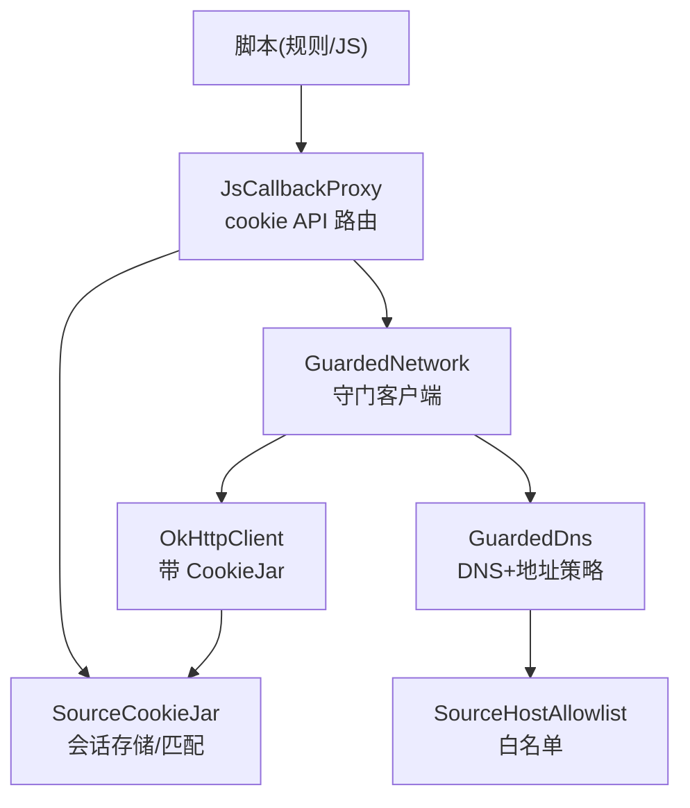
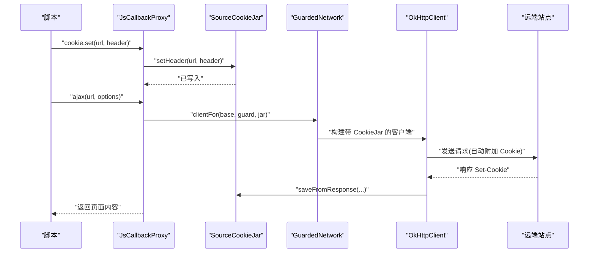
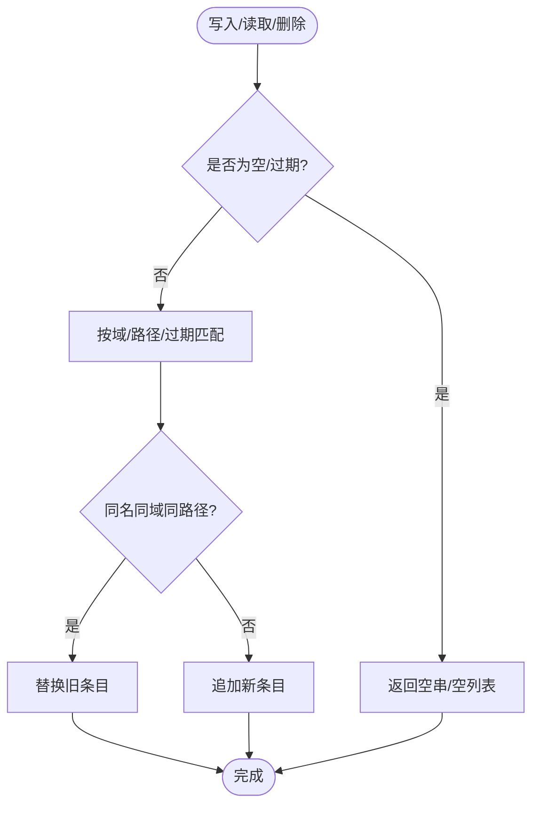
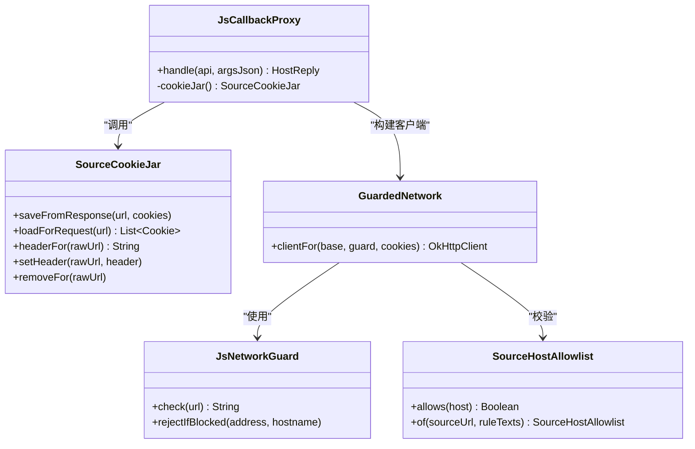

# 会话罐安全模型

<cite>
**本文引用的文件**
- [SourceCookieJar.kt](file://lib_book_source/src/main/java/com/ebook/source/sandbox/SourceCookieJar.kt)
- [SourceCookieJarTest.kt](file://lib_book_source/src/test/java/com/ebook/source/sandbox/SourceCookieJarTest.kt)
- [JsCallbackProxy.kt](file://lib_book_source/src/main/java/com/ebook/source/sandbox/JsCallbackProxy.kt)
- [JsSandboxHost.kt](file://lib_book_source/src/main/java/com/ebook/source/sandbox/JsSandboxHost.kt)
- [JsNetworkGuard.kt](file://lib_book_source/src/main/java/com/ebook/source/sandbox/JsNetworkGuard.kt)
- [SourceHostAllowlist.kt](file://lib_book_source/src/main/java/com/ebook/source/sandbox/SourceHostAllowlist.kt)
- [0028-untrusted-js-sandbox.md](file://docs/adr/0028-untrusted-js-sandbox.md)
</cite>

## 目录
1. [简介](#简介)
2. [项目结构](#项目结构)
3. [核心组件](#核心组件)
4. [架构总览](#架构总览)
5. [详细组件分析](#详细组件分析)
6. [依赖关系分析](#依赖关系分析)
7. [性能考量](#性能考量)
8. [故障排查指南](#故障排查指南)
9. [结论](#结论)
10. [附录](#附录)

## 简介
本文件系统化阐述“会话罐安全模型”，聚焦 SourceCookieJar 的内存驻留机制、作用域隔离原理、生命周期管理、凭证泄露防护与测试方法，并给出性能优化与最佳实践。该模型服务于书源解析链路中的脚本沙箱：脚本通过 cookie API 读写会话，同时网络外呼由守门客户端自动携带 Cookie；两者必须共享同一份源级 Cookie 实例，确保“先登录再读签”等常见用法可稳定工作。

## 项目结构
围绕会话罐的关键代码位于 lib_book_source 的沙箱子模块中，主要涉及以下文件：
- SourceCookieJar：实现 OkHttp CookieJar 接口，提供脚本侧 cookie.get/set/remove 能力
- JsCallbackProxy：将脚本 cookie API 路由到 SourceCookieJar，并与网络层协同
- JsSandboxHost：为每次解析任务装配桥接对象，传入守门客户端与会话罐
- JsNetworkGuard/SourceHostAllowlist：负责 URL 准入与白名单检查，防止跨源与私网访问
- ADR-0028：不可信 JS 执行的整体安全决策（含会话罐设计要点）

**图表来源**
- [JsCallbackProxy.kt:128-204](file://lib_book_source/src/main/java/com/ebook/source/sandbox/JsCallbackProxy.kt#L128-L204)
- [JsCallbackProxy.kt:496-505](file://lib_book_source/src/main/java/com/ebook/source/sandbox/JsCallbackProxy.kt#L496-L505)
- [SourceCookieJar.kt:34-127](file://lib_book_source/src/main/java/com/ebook/source/sandbox/SourceCookieJar.kt#L34-L127)
- [JsNetworkGuard.kt:25-100](file://lib_book_source/src/main/java/com/ebook/source/sandbox/JsNetworkGuard.kt#L25-L100)
- [SourceHostAllowlist.kt:20-74](file://lib_book_source/src/main/java/com/ebook/source/sandbox/SourceHostAllowlist.kt#L20-L74)

**章节来源**
- [SourceCookieJar.kt:8-33](file://lib_book_source/src/main/java/com/ebook/source/sandbox/SourceCookieJar.kt#L8-L33)
- [JsCallbackProxy.kt:105-135](file://lib_book_source/src/main/java/com/ebook/source/sandbox/JsCallbackProxy.kt#L105-L135)
- [JsSandboxHost.kt:21-60](file://lib_book_source/src/main/java/com/ebook/source/sandbox/JsSandboxHost.kt#L21-L60)
- [JsNetworkGuard.kt:9-24](file://lib_book_source/src/main/java/com/ebook/source/sandbox/JsNetworkGuard.kt#L9-L24)
- [SourceHostAllowlist.kt:5-19](file://lib_book_source/src/main/java/com/ebook/source/sandbox/SourceHostAllowlist.kt#L5-L19)
- [0028-untrusted-js-sandbox.md:63](file://docs/adr/0028-untrusted-js-sandbox.md#L63)

## 核心组件
- SourceCookieJar：内存中的源级 Cookie 容器，既是 OkHttp CookieJar，又是脚本 cookie API 落点
- JsCallbackProxy：脚本侧 cookie.get/set/remove 的路由与校验，保证与网络外呼共用同一会话罐
- GuardedNetwork：基于 base OkHttpClient 派生带守门能力的客户端（DNS + CookieJar）
- SourceHostAllowlist：从源规则文本导出可解析 host 白名单，默认严格不放行子域
- JsNetworkGuard：URL 准入判定与 DNS 重绑防护（字符串层 + DNS 层）
- JsSandboxHost：为一次解析任务装配桥接，传入守门客户端与源级会话罐

**章节来源**
- [SourceCookieJar.kt:34-127](file://lib_book_source/src/main/java/com/ebook/source/sandbox/SourceCookieJar.kt#L34-L127)
- [JsCallbackProxy.kt:128-204](file://lib_book_source/src/main/java/com/ebook/source/sandbox/JsCallbackProxy.kt#L128-L204)
- [JsCallbackProxy.kt:496-505](file://lib_book_source/src/main/java/com/ebook/source/sandbox/JsCallbackProxy.kt#L496-L505)
- [SourceHostAllowlist.kt:20-74](file://lib_book_source/src/main/java/com/ebook/source/sandbox/SourceHostAllowlist.kt#L20-L74)
- [JsNetworkGuard.kt:25-100](file://lib_book_source/src/main/java/com/ebook/source/sandbox/JsNetworkGuard.kt#L25-L100)
- [JsSandboxHost.kt:21-60](file://lib_book_source/src/main/java/com/ebook/source/sandbox/JsSandboxHost.kt#L21-L60)

## 架构总览
会话罐的安全模型由“作用域隔离 + 统一入口 + 最小权限”构成：
- 作用域隔离：每个源实例拥有独立 SourceCookieJar，随源 LRU 逐出而销毁，避免进程级共享导致的跨源会话泄漏
- 统一入口：脚本通过 JsCallbackProxy 访问 cookie API；网络请求由 GuardedNetwork 派生的客户端自动携带 CookieJar
- 最小权限：仅允许 http(s)，拒绝私网/保留地址，按源规则导出 host 白名单限制可达目标

**图表来源**
- [JsCallbackProxy.kt:183-204](file://lib_book_source/src/main/java/com/ebook/source/sandbox/JsCallbackProxy.kt#L183-L204)
- [JsCallbackProxy.kt:496-505](file://lib_book_source/src/main/java/com/ebook/source/sandbox/JsCallbackProxy.kt#L496-L505)
- [SourceCookieJar.kt:44-63](file://lib_book_source/src/main/java/com/ebook/source/sandbox/SourceCookieJar.kt#L44-L63)

## 详细组件分析

### SourceCookieJar：内存驻留与作用域隔离
- 存储结构：内部使用可变列表保存 Cookie 条目，线程安全通过同步块保护复合操作（如“同名同域同路径”的覆盖写）
- 内存分配策略：不持久化，所有会话驻留在进程内存；会话型 Cookie 过期时间设为极大值以模拟会话期有效
- 垃圾回收影响：随源解析器实例进入 LRU，被逐出时整份丢弃，应用重启或源切换后会话丢失（设计取舍）
- 域名匹配：复用 OkHttp Cookie.matches 进行精确匹配（域/路径/过期），删除时使用更宽泛的“域归属判断”以跨路径清理
- 线程模型：回调可能落在 binder 线程池的不同线程，读取与写入均在锁内完成，避免并发下出现重复条目

**图表来源**
- [SourceCookieJar.kt:44-63](file://lib_book_source/src/main/java/com/ebook/source/sandbox/SourceCookieJar.kt#L44-L63)
- [SourceCookieJar.kt:77-103](file://lib_book_source/src/main/java/com/ebook/source/sandbox/SourceCookieJar.kt#L77-L103)

**章节来源**
- [SourceCookieJar.kt:8-33](file://lib_book_source/src/main/java/com/ebook/source/sandbox/SourceCookieJar.kt#L8-L33)
- [SourceCookieJar.kt:34-127](file://lib_book_source/src/main/java/com/ebook/source/sandbox/SourceCookieJar.kt#L34-L127)

### 作用域隔离原理
- 源级实例隔离：每个源拥有独立的 SourceCookieJar 实例，避免不同源的会话互相污染
- 域名匹配规则：读请求通过 OkHttp Cookie.matches 精确匹配；删除时使用“域归属判断”跨路径清理，确保会话重置彻底
- 跨源数据隔离：禁止进程级共享 CookieJar；源切换即丢弃会话，不会残留跨站凭据

**章节来源**
- [SourceCookieJar.kt:16-28](file://lib_book_source/src/main/java/com/ebook/source/sandbox/SourceCookieJar.kt#L16-L28)
- [SourceCookieJar.kt:97-114](file://lib_book_source/src/main/java/com/ebook/source/sandbox/SourceCookieJar.kt#L97-L114)

### 生命周期管理
- LRU 淘汰：源解析器由 BookSourceManagerImpl 管理，LRU 逐出时连带销毁其 SourceCookieJar
- 会话过期处理：过滤 expiresAt <= now 的条目；会话型 Cookie 设置极大过期时间以保持活跃
- 资源释放：移除整个域的条目时采用“宽匹配”（inScopeOf），避免遗漏导致会话残留

**章节来源**
- [SourceCookieJar.kt:36-63](file://lib_book_source/src/main/java/com/ebook/source/sandbox/SourceCookieJar.kt#L36-L63)
- [SourceCookieJar.kt:97-114](file://lib_book_source/src/main/java/com/ebook/source/sandbox/SourceCookieJar.kt#L97-L114)

### 凭证泄露防护
- Token 隔离：源级会话罐不与进程级共享，避免 A 站会话误带到 B 站
- 第三方站点访问限制：通过 SourceHostAllowlist 与 JsNetworkGuard 限制可达 host，拒绝私网/保留地址
- 数据脱敏处理：日志与错误信息截断敏感片段，避免在异常中暴露完整 URL 或凭据

**章节来源**
- [SourceCookieJar.kt:16-28](file://lib_book_source/src/main/java/com/ebook/source/sandbox/SourceCookieJar.kt#L16-L28)
- [SourceHostAllowlist.kt:5-19](file://lib_book_source/src/main/java/com/ebook/source/sandbox/SourceHostAllowlist.kt#L5-L19)
- [JsNetworkGuard.kt:25-70](file://lib_book_source/src/main/java/com/ebook/source/sandbox/JsNetworkGuard.kt#L25-L70)
- [JsNetworkGuard.kt:101-167](file://lib_book_source/src/main/java/com/ebook/source/sandbox/JsNetworkGuard.kt#L101-L167)

### 会话安全性测试
- 跨源攻击检测：验证 set/get/remove 仅在同源生效，其他域不受影响
- Cookie 注入测试：整串 Set-Cookie 形态需拆分为独立条目，避免属性被误解析
- 安全审计方法：通过真实 OkHttp 客户端验证自动存回与回放行为；注入守卫客户端确认 cookieJar 一致

**章节来源**
- [SourceCookieJarTest.kt:36-114](file://lib_book_source/src/test/java/com/ebook/source/sandbox/SourceCookieJarTest.kt#L36-L114)
- [SourceCookieJarTest.kt:116-154](file://lib_book_source/src/test/java/com/ebook/source/sandbox/SourceCookieJarTest.kt#L116-L154)

## 依赖关系分析
- SourceCookieJar 依赖 OkHttp Cookie/CookieJar 接口
- JsCallbackProxy 依赖 SourceCookieJar 与 GuardedNetwork
- GuardedNetwork 依赖 OkHttpClient、SourceHostAllowlist、JsNetworkGuard
- JsNetworkGuard 依赖 SourceHostAllowlist 与 AddressPolicy（内网/保留地址拦截）

**图表来源**
- [SourceCookieJar.kt:34-127](file://lib_book_source/src/main/java/com/ebook/source/sandbox/SourceCookieJar.kt#L34-L127)
- [JsCallbackProxy.kt:128-204](file://lib_book_source/src/main/java/com/ebook/source/sandbox/JsCallbackProxy.kt#L128-L204)
- [JsCallbackProxy.kt:496-505](file://lib_book_source/src/main/java/com/ebook/source/sandbox/JsCallbackProxy.kt#L496-L505)
- [JsNetworkGuard.kt:25-100](file://lib_book_source/src/main/java/com/ebook/source/sandbox/JsNetworkGuard.kt#L25-L100)
- [SourceHostAllowlist.kt:20-74](file://lib_book_source/src/main/java/com/ebook/source/sandbox/SourceHostAllowlist.kt#L20-L74)

**章节来源**
- [JsCallbackProxy.kt:105-135](file://lib_book_source/src/main/java/com/ebook/source/sandbox/JsCallbackProxy.kt#L105-L135)
- [JsSandboxHost.kt:21-60](file://lib_book_source/src/main/java/com/ebook/source/sandbox/JsSandboxHost.kt#L21-L60)

## 性能考量
- 内存占用：SessionCookieJar 仅持有少量 Cookie 对象，随源 LRU 淘汰，避免长期驻留
- 匹配开销：读请求过滤与匹配在锁内进行，但数据量小，影响有限
- 线程竞争：写入时需先淘汰旧条目再追加，确保原子性，减少重复键带来的请求头膨胀
- 网络往返：通过 HeadStatusProbe 探测状态码，避免不必要的全量取体

**章节来源**
- [SourceCookieJar.kt:44-63](file://lib_book_source/src/main/java/com/ebook/source/sandbox/SourceCookieJar.kt#L44-L63)
- [JsCallbackProxy.kt:279-283](file://lib_book_source/src/main/java/com/ebook/source/sandbox/JsCallbackProxy.kt#L279-L283)

## 故障排查指南
- 症状：脚本无法读到会话
  - 检查是否装配了 SourceCookieJar（未装配会抛类型化异常）
  - 确认 set/get/remove 使用相同的 URL 归一化形式
- 症状：请求头中出现重复 Cookie
  - 检查写入逻辑是否正确先淘汰旧条目
- 症状：跨源会话泄漏
  - 确认未使用进程级共享 CookieJar
- 症状：私网访问被拒
  - 检查 SourceHostAllowlist 是否包含目标 host
  - 查看 AddressPolicy 是否拦截内网/保留地址

**章节来源**
- [JsCallbackProxy.kt:128-135](file://lib_book_source/src/main/java/com/ebook/source/sandbox/JsCallbackProxy.kt#L128-L135)
- [SourceCookieJar.kt:44-63](file://lib_book_source/src/main/java/com/ebook/source/sandbox/SourceCookieJar.kt#L44-L63)
- [JsNetworkGuard.kt:25-70](file://lib_book_source/src/main/java/com/ebook/source/sandbox/JsNetworkGuard.kt#L25-L70)
- [JsNetworkGuard.kt:101-167](file://lib_book_source/src/main/java/com/ebook/source/sandbox/JsNetworkGuard.kt#L101-L167)

## 结论
SourceCookieJar 通过“源级隔离 + 统一入口 + 最小权限”实现了安全的会话管理：
- 内存驻留避免持久化风险，配合 LRU 淘汰控制资源占用
- 作用域隔离杜绝跨源会话泄漏
- 生命周期管理确保会话及时失效与资源释放
- 凭证泄露防护通过白名单与地址策略限制可达范围
- 测试覆盖关键路径，保障行为可审计

建议在生产环境中持续监控会话命中率与失败率，结合 ADR-0028 的遗留项逐步完善白名单宽松度与落盘策略评估。

## 附录
- 相关 ADR：[0028-untrusted-js-sandbox.md](file://docs/adr/0028-untrusted-js-sandbox.md)
- 测试用例：[SourceCookieJarTest.kt](file://lib_book_source/src/test/java/com/ebook/source/sandbox/SourceCookieJarTest.kt)