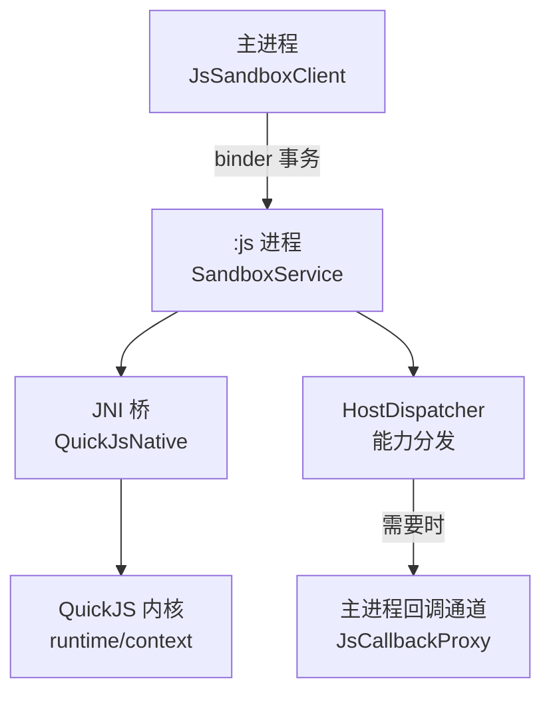
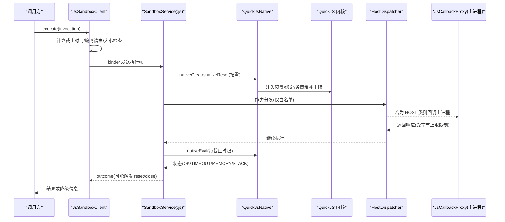
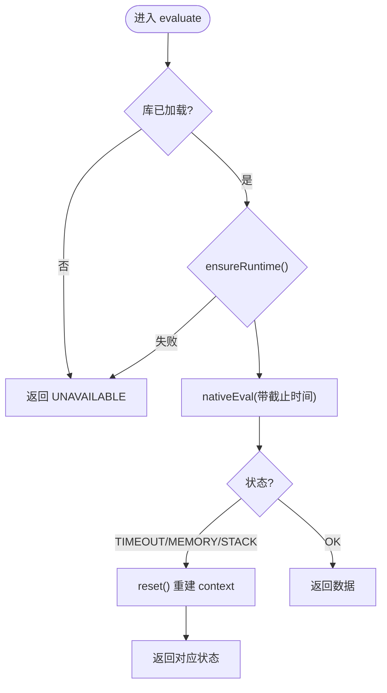
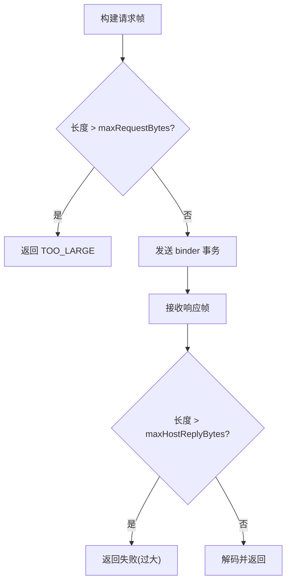
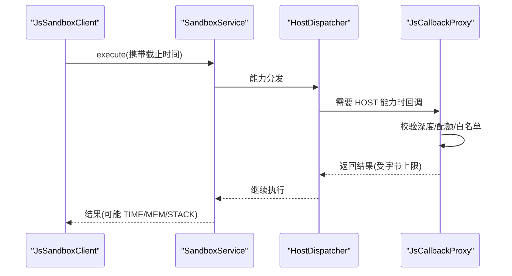
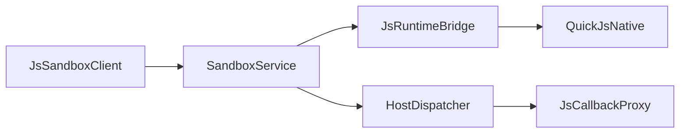

# 内存安全攻击面

<cite>
**本文引用的文件**
- [JsLimits.kt](file://lib_book_source/src/main/java/com/ebook/source/sandbox/JsLimits.kt)
- [JsRuntimeBridge.kt](file://lib_book_source/src/main/java/com/ebook/source/sandbox/JsRuntimeBridge.kt)
- [QuickJsNative.kt](file://lib_book_source/src/main/java/com/ebook/source/sandbox/QuickJsNative.kt)
- [SandboxService.kt](file://lib_book_source/src/main/java/com/ebook/source/sandbox/SandboxService.kt)
- [JsSandboxClient.kt](file://lib_book_source/src/main/java/com/ebook/source/sandbox/JsSandboxClient.kt)
- [JsCallbackProxy.kt](file://lib_book_source/src/main/java/com/ebook/source/sandbox/JsCallbackProxy.kt)
- [HostDispatcher.kt](file://lib_book_source/src/main/java/com/ebook/source/sandbox/HostDispatcher.kt)
</cite>

## 目录
1. [简介](#简介)
2. [项目结构（与安全相关）](#项目结构与安全相关)
3. [核心组件](#核心组件)
4. [架构总览](#架构总览)
5. [详细组件分析](#详细组件分析)
6. [依赖关系分析](#依赖关系分析)
7. [性能与资源特征](#性能与资源特征)
8. [故障排查指南](#故障排查指南)
9. [结论](#结论)
10. [附录：测试与加固建议](#附录测试与加固建议)

## 简介
本文聚焦本仓库中“脚本源解析”的安全边界，围绕 QuickJS 内核执行、跨进程沙箱以及主/子进程通信展开，系统梳理内存安全攻击面及防护措施。重点覆盖：
- 堆溢出、栈溢出、Use-After-Free 的防护策略与处置流程
- 内存泄漏防护机制（运行时生命周期、全局对象清理、内存池回收）
- Native 层与 Java 层的内存边界保护（JNI 调用中的拷贝与指针校验）
- 内存限制策略（堆上限、分配失败处理、进程级隔离）
- 内存安全测试方法（模糊测试、泄漏检测、漏洞扫描）
- 内存攻击事件监控与应急响应

## 项目结构（与安全相关）
与本主题直接相关的代码集中在 lib_book_source 模块的沙箱子系统，采用“主进程客户端 + :js 隔离进程服务 + JNI 桥接 QuickJS”的分层架构：
- 主进程侧负责连接、串行化、重放、回调路由与资源限流
- :js 进程侧负责接收请求、运行 QuickJS、管理 runtime/context、回传结果
- JNI 层提供创建/重置/销毁 runtime 以及执行入口
- 网络访问走白名单与守门器，避免不受控外呼导致的资源滥用

图示来源
- [JsSandboxClient.kt:137-143](file://lib_book_source/src/main/java/com/ebook/source/sandbox/JsSandboxClient.kt#L137-L143)
- [SandboxService.kt:63-98](file://lib_book_source/src/main/java/com/ebook/source/sandbox/SandboxService.kt#L63-L98)
- [QuickJsNative.kt:32-58](file://lib_book_source/src/main/java/com/ebook/source/sandbox/QuickJsNative.kt#L32-L58)
- [HostDispatcher.kt:24-73](file://lib_book_source/src/main/java/com/ebook/source/sandbox/HostDispatcher.kt#L24-L73)

章节来源
- [JsSandboxClient.kt:137-143](file://lib_book_source/src/main/java/com/ebook/source/sandbox/JsSandboxClient.kt#L137-L143)
- [SandboxService.kt:63-98](file://lib_book_source/src/main/java/com/ebook/source/sandbox/SandboxService.kt#L63-L98)

## 核心组件
- JsLimits：集中定义并约束四项资源上限（挂钟时间、堆、栈、报文），是调优的唯一入口
- JsRuntimeBridge：进程内运行时管理（创建、重置、销毁）、失败后的上下文复位
- QuickJsNative：Kotlin 侧对 native 方法的声明，封装 .so 加载、create/reset/eval/destroy
- SandboxService：:js 进程服务，处理 binder 事务、转发 host 回调、统一错误回帧
- JsSandboxClient：主进程客户端，串行执行、超时、断连重放、回调中继
- HostDispatcher：:js 进程的能力白名单与分发，禁止越权能力
- JsCallbackProxy：主进程侧宿主回调代理，含网络守门、配额计数、嵌套深度控制

章节来源
- [JsLimits.kt:13-58](file://lib_book_source/src/main/java/com/ebook/source/sandbox/JsLimits.kt#L13-L58)
- [JsRuntimeBridge.kt:21-113](file://lib_book_source/src/main/java/com/ebook/source/sandbox/JsRuntimeBridge.kt#L21-L113)
- [QuickJsNative.kt:15-58](file://lib_book_source/src/main/java/com/ebook/source/sandbox/QuickJsNative.kt#L15-L58)
- [SandboxService.kt:27-209](file://lib_book_source/src/main/java/com/ebook/source/sandbox/SandboxService.kt#L27-L209)
- [JsSandboxClient.kt:35-185](file://lib_book_source/src/main/java/com/ebook/source/sandbox/JsSandboxClient.kt#L35-L185)
- [HostDispatcher.kt:24-73](file://lib_book_source/src/main/java/com/ebook/source/sandbox/HostDispatcher.kt#L24-L73)
- [JsCallbackProxy.kt:105-506](file://lib_book_source/src/main/java/com/ebook/source/sandbox/JsCallbackProxy.kt#L105-L506)

## 架构总览
下图展示一次脚本执行的端到端路径，标注了内存与资源限制的落点：

图示来源
- [JsSandboxClient.kt:65-99](file://lib_book_source/src/main/java/com/ebook/source/sandbox/JsSandboxClient.kt#L65-L99)
- [SandboxService.kt:83-98](file://lib_book_source/src/main/java/com/ebook/source/sandbox/SandboxService.kt#L83-L98)
- [QuickJsNative.kt:32-58](file://lib_book_source/src/main/java/com/ebook/source/sandbox/QuickJsNative.kt#L32-L58)
- [HostDispatcher.kt:47-73](file://lib_book_source/src/main/java/com/ebook/source/sandbox/HostDispatcher.kt#L47-L73)
- [JsCallbackProxy.kt:152-177](file://lib_book_source/src/main/java/com/ebook/source/sandbox/JsCallbackProxy.kt#L152-L177)

## 详细组件分析

### 运行时与内存生命周期（堆/栈/上下文）
- 堆上限：由 limits.heapBytes 传入 nativeCreate，限制 QuickJS 堆使用；分配耗尽会返回 MEMORY 状态
- 栈上限：limits.stackBytes 用于限制 JS 栈；过深递归将触发 STACK 状态，防止栈溢出导致 SIGSEGV
- 上下文重置：在 TIMEOUT/MEMORY/STACK 后强制 reset，重建 context，避免残留状态被复用
- 关闭释放：服务 onDestroy 或异常路径中 close，确保句柄被销毁，避免泄露

图示来源
- [JsRuntimeBridge.kt:41-67](file://lib_book_source/src/main/java/com/ebook/source/sandbox/JsRuntimeBridge.kt#L41-L67)
- [JsRuntimeBridge.kt:77-102](file://lib_book_source/src/main/java/com/ebook/source/sandbox/JsRuntimeBridge.kt#L77-L102)

章节来源
- [JsLimits.kt:13-58](file://lib_book_source/src/main/java/com/ebook/source/sandbox/JsLimits.kt#L13-L58)
- [JsRuntimeBridge.kt:41-113](file://lib_book_source/src/main/java/com/ebook/source/sandbox/JsRuntimeBridge.kt#L41-L113)
- [QuickJsNative.kt:32-58](file://lib_book_source/src/main/java/com/ebook/source/sandbox/QuickJsNative.kt#L32-L58)

### 跨进程边界与消息大小限制（防 OOM/ANR）
- 请求帧上限：主进程侧在 encode 后立即检查 maxRequestBytes，超限直接拒绝
- 响应帧上限：:js 进程收到主进程回复后再次检查 maxHostReplyBytes，超限按失败回写
- Binder 缓冲保护：通过限制帧大小，避免 TransactionTooLargeException 等未类型化失败
- 超时控制：wallClockMs 作为绝对截止时间，跨进程单调时钟可比，保证整体执行不阻塞

图示来源
- [JsSandboxClient.kt:74-80](file://lib_book_source/src/main/java/com/ebook/source/sandbox/JsSandboxClient.kt#L74-L80)
- [SandboxService.kt:165-209](file://lib_book_source/src/main/java/com/ebook/source/sandbox/SandboxService.kt#L165-L209)

章节来源
- [JsSandboxClient.kt:65-99](file://lib_book_source/src/main/java/com/ebook/source/sandbox/JsSandboxClient.kt#L65-L99)
- [SandboxService.kt:165-209](file://lib_book_source/src/main/java/com/ebook/source/sandbox/SandboxService.kt#L165-L209)

### 主机回调与嵌套求值（防死锁/资源耗尽）
- 回调深度限制：maxCallbackDepth 防止规则套规则无限递归
- 主线程守卫：禁止在主线程执行，避免 ANR
- 并发串行化：inFlight 锁保证同一时刻只有一帧在飞，避免多源互相污染
- 回调期间重入保护：ThreadLocal 计数器防止 host 回调里再发起新的 execute 造成双向死锁

图示来源
- [JsSandboxClient.kt:65-99](file://lib_book_source/src/main/java/com/ebook/source/sandbox/JsSandboxClient.kt#L65-L99)
- [HostDispatcher.kt:47-73](file://lib_book_source/src/main/java/com/ebook/source/sandbox/HostDispatcher.kt#L47-L73)
- [JsCallbackProxy.kt:152-177](file://lib_book_source/src/main/java/com/ebook/source/sandbox/JsCallbackProxy.kt#L152-L177)
- [JsCallbackProxy.kt:247-277](file://lib_book_source/src/main/java/com/ebook/source/sandbox/JsCallbackProxy.kt#L247-L277)

章节来源
- [JsSandboxClient.kt:65-99](file://lib_book_source/src/main/java/com/ebook/source/sandbox/JsSandboxClient.kt#L65-L99)
- [JsCallbackProxy.kt:247-277](file://lib_book_source/src/main/java/com/ebook/source/sandbox/JsCallbackProxy.kt#L247-L277)
- [HostDispatcher.kt:47-73](file://lib_book_source/src/main/java/com/ebook/source/sandbox/HostDispatcher.kt#L47-L73)

### 内存泄漏防护机制
- 运行时生命周期：
  - ensureRuntime 仅在首次创建；失败立即销毁句柄
  - 任务边界 reset：TIMEOUT/MEMORY/STACK 后重建 context，避免脏状态复用
  - onDestroy/close：释放 native 句柄，避免常驻泄露
- 全局对象清理：
  - 通过 reset 重放 prelude，确保全局量从干净基线开始
- 内存池回收：
  - 每次执行前进行 deadline 驱动的中断；超出则停止并回收
  - 响应体严格判大，防止整页 HTML 长期驻留

章节来源
- [JsRuntimeBridge.kt:41-113](file://lib_book_source/src/main/java/com/ebook/source/sandbox/JsRuntimeBridge.kt#L41-L113)
- [SandboxService.kt:125-135](file://lib_book_source/src/main/java/com/ebook/source/sandbox/SandboxService.kt#L125-L135)

### Native 与 Java 层内存边界保护
- JNI 入口契约：
  - external 函数签名固定，避免 UnsatisfiedLinkError 延迟暴露
  - nativeEval 仅接受 JSON 绑定的字符串，避免直接传递原生指针
- 参数校验：
  - 协议 token 与版本先验，避免读取垃圾帧
  - 回调帧长度二次校验，避免超大帧破坏解析
- 异常就地兜住：
  - 所有 JNI 可抛路径用 runCatching/try-catch 包裹，异常转换为 ok=false 的 HostReply，防止崩溃到 :js 进程

章节来源
- [QuickJsNative.kt:15-58](file://lib_book_source/src/main/java/com/ebook/source/sandbox/QuickJsNative.kt#L15-L58)
- [SandboxService.kt:63-98](file://lib_book_source/src/main/java/com/ebook/source/sandbox/SandboxService.kt#L63-L98)
- [HostDispatcher.kt:47-73](file://lib_book_source/src/main/java/com/ebook/source/sandbox/HostDispatcher.kt#L47-L73)

### 内存限制策略（堆上限、分配失败、进程隔离）
- 堆上限：limits.heapBytes 限制 QuickJS 堆；分配失败以 MEMORY 状态返回
- 栈上限：limits.stackBytes 限制递归深度；STACK 状态触发 reset
- 分配失败处理：
  - 立即 reset 上下文，避免后续执行借残局
  - 上层根据状态降级为不可用或重试（视业务而定）
- 进程级隔离：
  - :js 进程无权限、无私有目录访问；非隔离进程拒绝 onBind，避免静默失效

章节来源
- [JsLimits.kt:13-58](file://lib_book_source/src/main/java/com/ebook/source/sandbox/JsLimits.kt#L13-L58)
- [JsRuntimeBridge.kt:77-102](file://lib_book_source/src/main/java/com/ebook/source/sandbox/JsRuntimeBridge.kt#L77-L102)
- [SandboxService.kt:147-153](file://lib_book_source/src/main/java/com/ebook/source/sandbox/SandboxService.kt#L147-L153)

## 依赖关系分析
- JsSandboxClient 依赖 SandboxService 提供的执行通道与回调
- SandboxService 依赖 JsRuntimeBridge 管理 QuickJS 生命周期
- JsRuntimeBridge 依赖 QuickJsNative 调用 native 方法
- HostDispatcher 依赖 JsCallbackProxy 完成 HOST 类能力的落地
- 所有跨进程数据均经过大小限制与协议校验

图示来源
- [JsSandboxClient.kt:65-99](file://lib_book_source/src/main/java/com/ebook/source/sandbox/JsSandboxClient.kt#L65-L99)
- [SandboxService.kt:83-98](file://lib_book_source/src/main/java/com/ebook/source/sandbox/SandboxService.kt#L83-L98)
- [HostDispatcher.kt:47-73](file://lib_book_source/src/main/java/com/ebook/source/sandbox/HostDispatcher.kt#L47-L73)

章节来源
- [JsSandboxClient.kt:65-99](file://lib_book_source/src/main/java/com/ebook/source/sandbox/JsSandboxClient.kt#L65-L99)
- [SandboxService.kt:83-98](file://lib_book_source/src/main/java/com/ebook/source/sandbox/SandboxService.kt#L83-L98)
- [HostDispatcher.kt:47-73](file://lib_book_source/src/main/java/com/ebook/source/sandbox/HostDispatcher.kt#L47-L73)

## 性能与资源特征
- 挂钟时间：单次执行最长 wallClockMs 毫秒，防止长时间占用 binder 线程
- 队列串行：inFlight 锁串行化执行，避免多源争抢导致的不确定行为
- 报文限制：请求/响应/host 回复均受字节上限限制，降低解析压力
- 超时中断：nativeEval 接受截止时间，配合上层调度实现公平等待

章节来源
- [JsLimits.kt:13-58](file://lib_book_source/src/main/java/com/ebook/source/sandbox/JsLimits.kt#L13-L58)
- [JsSandboxClient.kt:65-99](file://lib_book_source/src/main/java/com/ebook/source/sandbox/JsSandboxClient.kt#L65-L99)
- [SandboxService.kt:21-26](file://lib_book_source/src/main/java/com/ebook/source/sandbox/SandboxService.kt#L21-L26)

## 故障排查指南
- 常见问题定位
  - 无法加载 .so：检查 loaded 与 loadError，确认 ABI 匹配与同步
  - 协议版本不合：查看日志中协议版本不一致的警告
  - 断连重放：关注 afterDisconnect 的重放逻辑，避免重复请求
  - 回调失败：HostDispatcher 与 JsCallbackProxy 的错误信息应包含 API 名与根因片段
- 日志与诊断
  - 使用 Logger 输出关键路径（如断连、协议不符、过大帧）
  - 结合 adb logcat 与沙箱进程的 binder 事务记录定位问题

章节来源
- [QuickJsNative.kt:17-30](file://lib_book_source/src/main/java/com/ebook/source/sandbox/QuickJsNative.kt#L17-L30)
- [SandboxService.kt:63-75](file://lib_book_source/src/main/java/com/ebook/source/sandbox/SandboxService.kt#L63-L75)
- [JsSandboxClient.kt:117-135](file://lib_book_source/src/main/java/com/ebook/source/sandbox/JsSandboxClient.kt#L117-L135)
- [HostDispatcher.kt:52-73](file://lib_book_source/src/main/java/com/ebook/source/sandbox/HostDispatcher.kt#L52-L73)

## 结论
本项目通过“集中式限额 + 进程隔离 + 协议校验 + 上下文重置”的组合拳，有效降低了 QuickJS 内核执行带来的内存安全风险。针对堆溢出、栈溢出与 Use-After-Free，系统在分配阶段即设上限，在失败时强制重置上下文，并在跨进程边界严控报文大小，从而减少崩溃与资源滥用。同时，严格的回调深度与并发串行化避免了死锁与状态污染。

## 附录：测试与加固建议
- 模糊测试
  - 构造超长请求帧与响应帧，验证上限拦截
  - 构造深度嵌套的规则链，验证 maxCallbackDepth 生效
  - 构造随机 JSON 绑定与非法字段，验证协议健壮性
- 内存泄漏检测
  - 使用 Android Studio Profiler/LeakCanary 观察 JsRuntimeBridge 句柄生命周期
  - 验证 onDestroy/close 是否总是释放 native 句柄
- 漏洞扫描
  - 静态分析关注 JNI 外部接口与异常兜住路径
  - 动态分析关注超时、断连、协议版本不合等分支
- 监控与应急
  - 统计 MEMORY/STACK/TIMEOUT 比例，阈值告警
  - 当连续失败达到阈值，临时禁用该源或降级为不可用

[本节为通用建议，不直接引用具体文件]