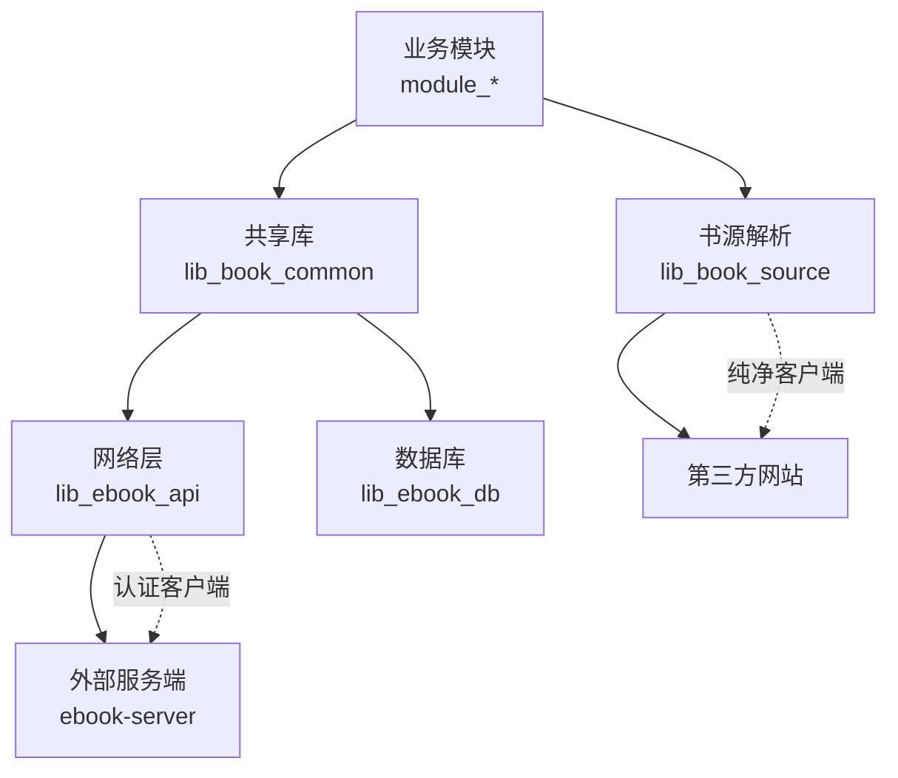
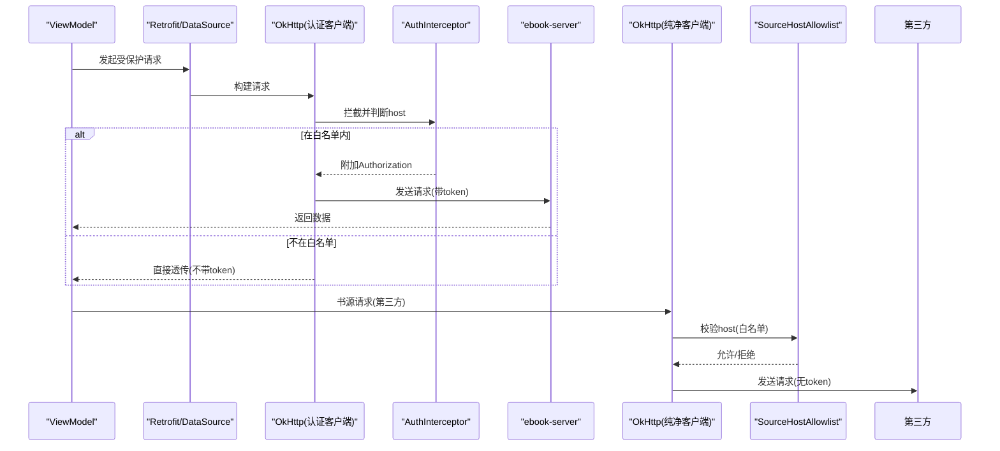
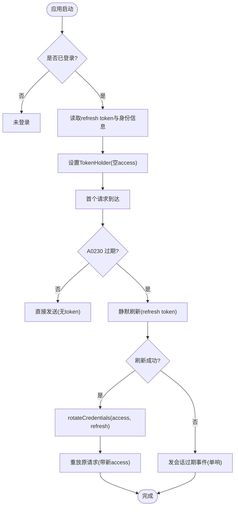
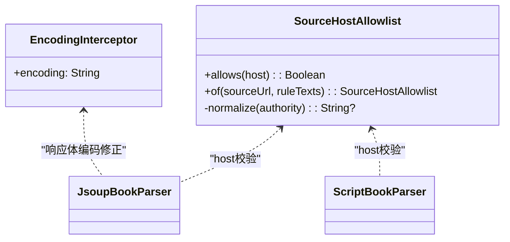
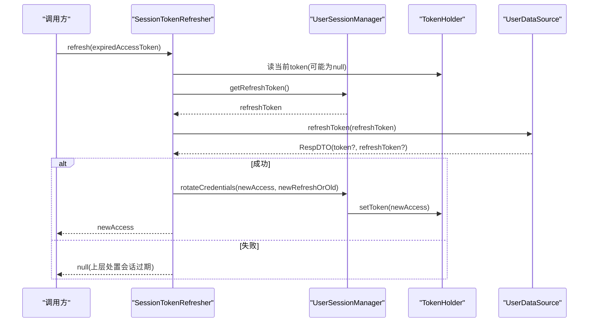
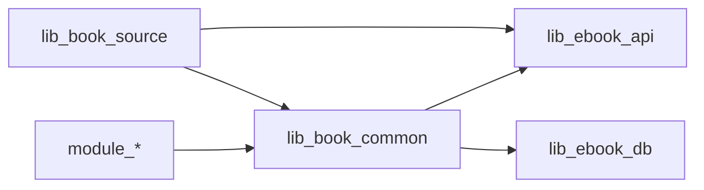

# 凭证泄露防护

<cite>
**本文引用的文件**
- [SessionTokenRefresher.kt](file://lib_book_common/src/main/java/com/ebook/common/domain/SessionTokenRefresher.kt)
- [AndroidUserSessionManager.kt](file://lib_book_common/src/main/java/com/ebook/common/domain/AndroidUserSessionManager.kt)
- [NetworkModule.kt](file://lib_ebook_api/src/main/java/com/ebook/api/utils/NetworkModule.kt)
- [EncodingInterceptor.kt](file://lib_ebook_api/src/main/java/com/ebook/api/intercepter/EncodingInterceptor.kt)
- [SourceHostAllowlist.kt](file://lib_book_source/src/main/java/com/ebook/source/sandbox/SourceHostAllowlist.kt)
- [0011-token-identity-decoupling-token-only-refresh.md](file://docs/adr/0011-token-identity-decoupling-token-only-refresh.md)
- [AGENTS.md](file://AGENTS.md)
- [SessionTokenRefresherTest.kt](file://lib_book_common/src/test/java/com/ebook/common/domain/SessionTokenRefresherTest.kt)
</cite>

## 目录
1. [引言](#引言)
2. [项目结构与安全边界](#项目结构与安全边界)
3. [核心安全组件](#核心安全组件)
4. [架构总览](#架构总览)
5. [关键流程详解](#关键流程详解)
6. [依赖关系分析](#依赖关系分析)
7. [性能与可用性](#性能与可用性)
8. [故障排查与应急响应](#故障排查与应急响应)
9. [结论](#结论)

## 引言
本文件围绕“凭证泄露防护”目标，系统性说明本项目在 token 隔离、请求头附加控制、第三方站点访问限制、数据脱敏、会话安全与会话同步、凭证泄露检测与审计、以及事件响应与修复等方面的设计与实现。重点覆盖以下方面：
- 双 token 机制与静默刷新（access 只驻内存、refresh 持久化）
- 认证客户端与纯净客户端的隔离（白名单 host、不向第三方泄漏 token）
- 书源沙箱与 host 白名单（按规则导出允许域名，默认严格）
- 网络层日志脱敏、错误信息净化与统一上报
- 会话生命周期管理、过期事件单响与多镜像一致性清理
- 凭证泄露检测方法（请求监控、异常检测、审计报告）与应急流程

## 项目结构与安全边界
本项目采用多模块分层架构，安全相关能力分布在如下位置：
- 会话与凭证：lib_book_common 中的 UserSessionManager/AndroidUserSessionManager、SessionTokenRefresher
- 网络与拦截器：lib_ebook_api 中的 NetworkModule、OkHttpClient 提供、编码拦截器
- 书源解析与沙箱：lib_book_source 中的 SourceHostAllowlist、Jsoup/Script 解析链路
- 架构决策与约定：docs/adr/0011、AGENTS.md 等文档对行为约束进行固化

**章节来源**
- [AGENTS.md](file://AGENTS.md)

## 核心安全组件
- 会话与凭证管理器：AndroidUserSessionManager
  - 负责登录态、用户身份、token 持久化与内存状态同步
  - access token 仅驻内存（TokenHolder），refresh token 落盘
  - 提供 rotateCredentials 用于静默刷新后的凭证轮换
- 静默刷新器：SessionTokenRefresher
  - 基于互斥锁串行化刷新，避免并发重复调用与旧 refresh 被硬删导致的失败
  - 刷新成功仅更新凭证，不重建身份；缺失 refresh_token 时保留旧值
- 网络客户端与拦截器：NetworkModule、EncodingInterceptor
  - 认证客户端：带 AuthInterceptor、白名单 host、debug 脱敏日志
  - 纯净客户端：@Named("source") 与 @Named("release")，不携带任何 token
- 书源 host 白名单：SourceHostAllowlist
  - 从规则文本与源 URL 提取 host，默认严格放行精确 host，不放行子域
  - 归一化处理 IPv6、端口、userinfo 等，保证比较正确性

**章节来源**
- [AndroidUserSessionManager.kt:29-162](file://lib_book_common/src/main/java/com/ebook/common/domain/AndroidUserSessionManager.kt#L29-L162)
- [SessionTokenRefresher.kt:41-96](file://lib_book_common/src/main/java/com/ebook/common/domain/SessionTokenRefresher.kt#L41-L96)
- [NetworkModule.kt:19-72](file://lib_ebook_api/src/main/java/com/ebook/api/utils/NetworkModule.kt#L19-L72)
- [EncodingInterceptor.kt:20-51](file://lib_ebook_api/src/main/java/com/ebook/api/intercepter/EncodingInterceptor.kt#L20-L51)
- [SourceHostAllowlist.kt:5-73](file://lib_book_source/src/main/java/com/ebook/source/sandbox/SourceHostAllowlist.kt#L5-L73)

## 架构总览
下图展示认证与净化的整体交互：业务发起请求经认证客户端（仅白名单 host 附加 token），第三方站点的书源请求走纯净客户端（无 token），脚本执行通过沙箱与 host 白名单限制外呼。

**图示来源**
- [NetworkModule.kt:39-71](file://lib_ebook_api/src/main/java/com/ebook/api/utils/NetworkModule.kt#L39-L71)
- [SourceHostAllowlist.kt:45-73](file://lib_book_source/src/main/java/com/ebook/source/sandbox/SourceHostAllowlist.kt#L45-L73)
- [AGENTS.md](file://AGENTS.md)

**章节来源**
- [NetworkModule.kt:39-71](file://lib_ebook_api/src/main/java/com/ebook/api/utils/NetworkModule.kt#L39-L71)
- [SourceHostAllowlist.kt:5-73](file://lib_book_source/src/main/java/com/ebook/source/sandbox/SourceHostAllowlist.kt#L5-L73)
- [AGENTS.md](file://AGENTS.md)

## 关键流程详解

### Token 隔离与内存驻留策略
- access token 只驻内存（TokenHolder），不落盘；冷启动为空，首个请求触发 A0230 由 refresh token 静默轮换
- refresh token 持久化到 SP（user_session 文件），并在旋转时优先使用新值；若响应缺失 refresh_token，则保留旧值以避免唯一可恢复凭据丢失
- 登录/注册时保存身份与 refresh token，刷新不再回填 user，避免语义过载导致身份字段被误清空

**图示来源**
- [SessionTokenRefresher.kt:41-96](file://lib_book_common/src/main/java/com/ebook/common/domain/SessionTokenRefresher.kt#L41-L96)
- [AndroidUserSessionManager.kt:61-98](file://lib_book_common/src/main/java/com/ebook/common/domain/AndroidUserSessionManager.kt#L61-L98)
- [0011-token-identity-decoupling-token-only-refresh.md](file://docs/adr/0011-token-identity-decoupling-token-only-refresh.md)

**章节来源**
- [SessionTokenRefresher.kt:41-96](file://lib_book_common/src/main/java/com/ebook/common/domain/SessionTokenRefresher.kt#L41-L96)
- [AndroidUserSessionManager.kt:61-98](file://lib_book_common/src/main/java/com/ebook/common/domain/AndroidUserSessionManager.kt#L61-L98)
- [0011-token-identity-decoupling-token-only-refresh.md](file://docs/adr/0011-token-identity-decoupling-token-only-refresh.md)

### 请求头附加控制与跨域访问限制
- 认证客户端仅对白名单 host 附加 Authorization 头；非白名单的请求不会携带 token
- 书源请求走纯净客户端（@Named("source")），不附带 token，防止第三方站点获取用户凭证
- 发布检查走另一纯净客户端（@Named("release")），保持与书源不同的超时与拦截器演进方向

**章节来源**
- [NetworkModule.kt:39-71](file://lib_ebook_api/src/main/java/com/ebook/api/utils/NetworkModule.kt#L39-L71)
- [AGENTS.md](file://AGENTS.md)

### 第三方站点访问限制（纯净客户端与代理机制）
- 书源解析通过 Jsoup/Script 解析器，所有脚本外呼需经 GuardedNetwork/Host 白名单
- 白名单从源规则文本与源 URL 导出，默认严格，不放行子域；违规请求将被拒绝并记录 host
- 取文层对字符集进行强制修正（EncodingInterceptor），避免第三方站点错误声明 charset 导致乱码

**图示来源**
- [SourceHostAllowlist.kt:45-73](file://lib_book_source/src/main/java/com/ebook/source/sandbox/SourceHostAllowlist.kt#L45-L73)
- [EncodingInterceptor.kt:20-51](file://lib_ebook_api/src/main/java/com/ebook/api/intercepter/EncodingInterceptor.kt#L20-L51)

**章节来源**
- [SourceHostAllowlist.kt:5-73](file://lib_book_source/src/main/java/com/ebook/source/sandbox/SourceHostAllowlist.kt#L5-L73)
- [EncodingInterceptor.kt:20-51](file://lib_ebook_api/src/main/java/com/ebook/api/intercepter/EncodingInterceptor.kt#L20-L51)

### 数据脱敏处理（敏感信息过滤、日志脱敏、错误信息净化）
- 认证客户端 debug 日志开启脱敏，避免打印 token 等敏感头或载荷
- 错误信息统一经失败上报收口，会话过期标记由网络层识别，调用方一律走 reportFailure，避免重复提示与信息泄露
- 书源响应编码强制修正，避免下游因错误解码产生乱码与潜在信息污染

**章节来源**
- [NetworkModule.kt:35-42](file://lib_ebook_api/src/main/java/com/ebook/api/utils/NetworkModule.kt#L35-L42)
- [EncodingInterceptor.kt:20-51](file://lib_ebook_api/src/main/java/com/ebook/api/intercepter/EncodingInterceptor.kt#L20-L51)
- [AGENTS.md](file://AGENTS.md)

### 会话安全管理（双 token、刷新令牌保护、会话同步）
- 双 token 机制：access 短命且仅内存驻留；refresh 持久化用于静默续期
- 刷新令牌保护：互斥锁串行化刷新，避免并发用同一 refresh 导致旧值被服务端硬删而失败
- 会话同步：清会话时同时清理三处镜像（内存 StateFlow、SP 文件、ProfileRepository 进程内流），确保一致性与不可越权

**图示来源**
- [SessionTokenRefresher.kt:41-96](file://lib_book_common/src/main/java/com/ebook/common/domain/SessionTokenRefresher.kt#L41-L96)
- [AndroidUserSessionManager.kt:87-133](file://lib_book_common/src/main/java/com/ebook/common/domain/AndroidUserSessionManager.kt#L87-L133)

**章节来源**
- [SessionTokenRefresher.kt:41-96](file://lib_book_common/src/main/java/com/ebook/common/domain/SessionTokenRefresher.kt#L41-L96)
- [AndroidUserSessionManager.kt:87-133](file://lib_book_common/src/main/java/com/ebook/common/domain/AndroidUserSessionManager.kt#L87-L133)

### 凭证泄露检测方法（请求监控、异常检测、审计报告）
- 请求监控：认证客户端仅在白名单 host 附加 token；纯净客户端不携带 token，天然阻断第三方站点获取凭证
- 异常检测：静默刷新失败时返回 null，上层依据会话过期标记统一处置；并发场景通过互斥锁避免重复刷新
- 审计报告：结合调试日志（脱敏）、书源 host 白名单拒绝日志、刷新失败日志，形成可追溯的事件链

**章节来源**
- [NetworkModule.kt:39-71](file://lib_ebook_api/src/main/java/com/ebook/api/utils/NetworkModule.kt#L39-L71)
- [SessionTokenRefresherTest.kt:46-236](file://lib_book_common/src/test/java/com/ebook/common/domain/SessionTokenRefresherTest.kt#L46-L236)
- [SourceHostAllowlist.kt:5-73](file://lib_book_source/src/main/java/com/ebook/source/sandbox/SourceHostAllowlist.kt#L5-L73)

### 凭证泄露事件的应急响应与修复流程
- 立即措施：确认是否发生 token 外泄（查看认证客户端日志、纯净客户端请求、书源 host 白名单拒绝日志）
- 短期修复：禁用可疑源或调整 host 白名单；必要时强制清会话并重新登录
- 长期加固：完善白名单策略（如放宽特定子域但加审计）、强化日志脱敏与上报、增加刷新失败告警
- 回归验证：通过 SessionTokenRefresherTest 的并发与缺 refresh_token 用例验证刷新路径健壮性

[本节为通用应急流程建议，不直接引用具体代码]

## 依赖关系分析
- lib_book_common 依赖 lib_ebook_api 的 DataSource 接口以调用刷新端点
- lib_book_source 的沙箱与解析器依赖 host 白名单限制外呼
- NetworkModule 提供两套 OkHttpClient：认证客户端（白名单 host + 脱敏日志）与纯净客户端（无 token）

**图示来源**
- [AGENTS.md](file://AGENTS.md)
- [NetworkModule.kt:39-71](file://lib_ebook_api/src/main/java/com/ebook/api/utils/NetworkModule.kt#L39-L71)

**章节来源**
- [AGENTS.md](file://AGENTS.md)
- [NetworkModule.kt:39-71](file://lib_ebook_api/src/main/java/com/ebook/api/utils/NetworkModule.kt#L39-L71)

## 性能与可用性
- 静默刷新互斥：Mutex 串行化刷新，避免并发竞争与服务端旧 refresh 被硬删导致的失败
- 首请求静默轮换：冷启动无 access token 时，首个请求触发刷新并重放，用户体验无感知
- 资源开销：纯净客户端短超时（10s）快速失败，降低第三方站点慢响应影响
- 编码修正：EncodingInterceptor 以流式方式改写 Content-Type，避免全量缓冲，提升大正文响应处理效率

**章节来源**
- [SessionTokenRefresher.kt:41-96](file://lib_book_common/src/main/java/com/ebook/common/domain/SessionTokenRefresher.kt#L41-L96)
- [NetworkModule.kt:48-56](file://lib_ebook_api/src/main/java/com/ebook/api/utils/NetworkModule.kt#L48-L56)
- [EncodingInterceptor.kt:20-51](file://lib_ebook_api/src/main/java/com/ebook/api/intercepter/EncodingInterceptor.kt#L20-L51)

## 故障排查与应急响应
- 症状：页面加载不出数据、频繁提示登录、第三方站点内容解析失败
- 排查步骤：
  - 检查认证客户端是否误向第三方站点附加 token（确认 host 白名单）
  - 检查书源 host 白名单是否过严导致合法 host 被拒（查看拒绝日志）
  - 检查刷新失败日志与 refresh_token 是否被误写为空串（参考测试断言）
  - 检查清会话是否完整清理三处镜像（避免残留身份显示）
- 应急动作：
  - 临时放宽 host 白名单并加强审计
  - 强制清会话后重新登录
  - 升级刷新逻辑至最新实现，确保缺 refresh_token 时保留旧值

**章节来源**
- [SessionTokenRefresherTest.kt:109-142](file://lib_book_common/src/test/java/com/ebook/common/domain/SessionTokenRefresherTest.kt#L109-L142)
- [AndroidUserSessionManager.kt:111-133](file://lib_book_common/src/main/java/com/ebook/common/domain/AndroidUserSessionManager.kt#L111-L133)
- [SourceHostAllowlist.kt:5-73](file://lib_book_source/src/main/java/com/ebook/source/sandbox/SourceHostAllowlist.kt#L5-L73)

## 结论
本项目通过严格的 token 隔离（access 仅内存驻留、refresh 持久化）、请求头附加控制（白名单 host）、第三方站点访问限制（纯净客户端与 host 白名单）、数据脱敏与编码修正、以及健壮的会话管理与刷新机制，构建了完善的凭证泄露防护体系。配合完善的测试用例与审计日志，可在实际运行中及时发现并处置异常，保障用户数据安全与系统可用性。