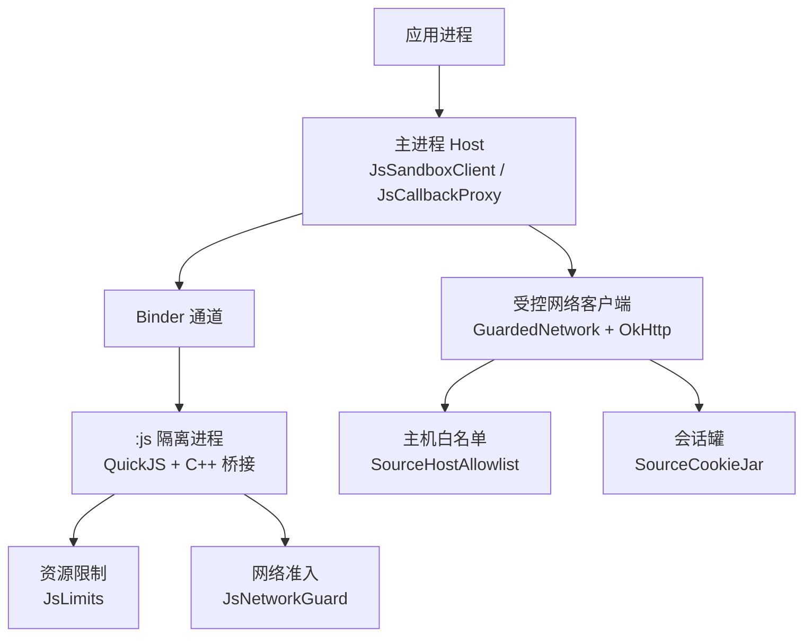
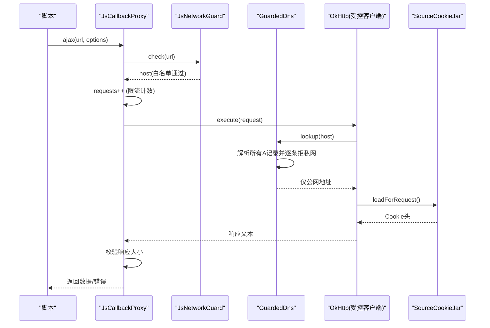
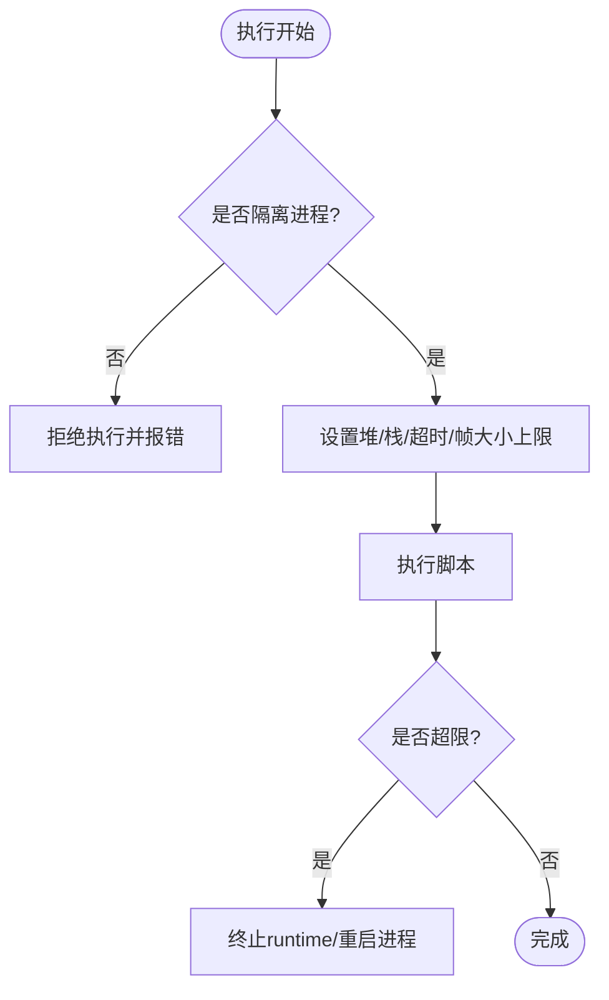
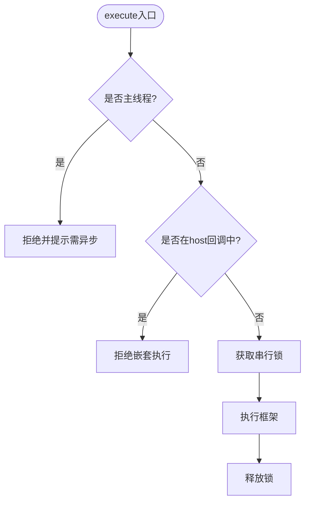
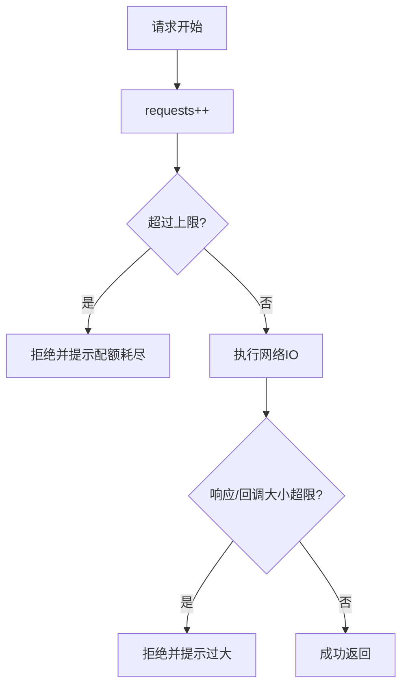
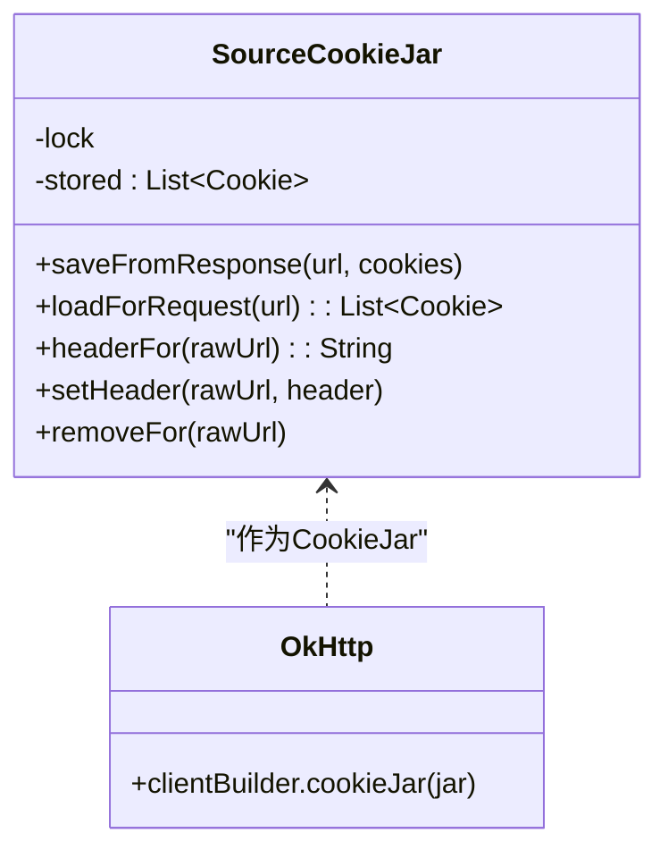
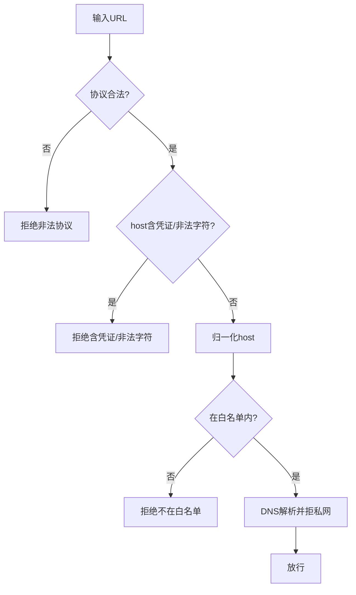
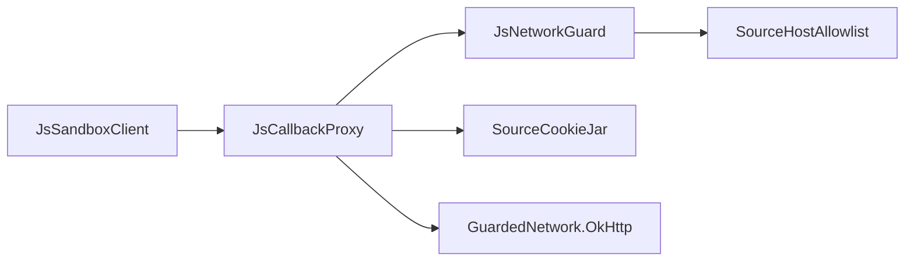

# 安全攻击面分析

<cite>
**本文引用的文件**
- [lib_book_source/src/main/java/com/ebook/source/sandbox/SourceCookieJar.kt](file://lib_book_source/src/main/java/com/ebook/source/sandbox/SourceCookieJar.kt)
- [lib_book_source/src/main/java/com/ebook/source/sandbox/JsNetworkGuard.kt](file://lib_book_source/src/main/java/com/ebook/source/sandbox/JsNetworkGuard.kt)
- [lib_book_source/src/main/java/com/ebook/source/sandbox/JsLimits.kt](file://lib_book_source/src/main/java/com/ebook/source/sandbox/JsLimits.kt)
- [lib_book_source/src/main/java/com/ebook/source/sandbox/SourceHostAllowlist.kt](file://lib_book_source/src/main/java/com/ebook/source/sandbox/SourceHostAllowlist.kt)
- [lib_book_source/src/main/java/com/ebook/source/sandbox/JsSandboxClient.kt](file://lib_book_source/src/main/java/com/ebook/source/sandbox/JsSandboxClient.kt)
- [lib_book_source/src/main/java/com/ebook/source/sandbox/JsCallbackProxy.kt](file://lib_book_source/src/main/java/com/ebook/source/sandbox/JsCallbackProxy.kt)
- [lib_book_source/src/main/java/com/ebook/source/sandbox/HostCompute.kt](file://lib_book_source/src/main/java/com/ebook/source/sandbox/HostCompute.kt)
- [docs/adr/0028-untrusted-js-sandbox.md](file://docs/adr/0028-untrusted-js-sandbox.md)
- [third_party/quickjs/quickjs.h](file://third_party/quickjs/quickjs.h)
</cite>

## 目录
1. [简介](#简介)
2. [项目结构](#项目结构)
3. [核心组件](#核心组件)
4. [架构总览](#架构总览)
5. [详细组件分析](#详细组件分析)
6. [依赖关系分析](#依赖关系分析)
7. [性能与安全权衡](#性能与安全权衡)
8. [故障排查指南](#故障排查指南)
9. [结论](#结论)
10. [附录](#附录)

## 简介
本文件面向“不可信脚本执行”的安全攻击面，围绕 QuickJS 内核、沙箱进程、网络访问控制、资源限制与重入保护等关键边界，系统梳理内存安全、权限越界、资源耗尽、凭证泄露与 URL 绕过等风险点，并给出防护策略与测试建议。文档基于仓库内现有实现与 ADR 决策进行说明，避免臆测未落地能力。

## 项目结构
本项目采用多模块分层：业务模块通过共享库调用书源解析层（lib_book_source），后者提供原生解析器与脚本书源解释器；脚本在独立隔离进程（:js）中由 vendored QuickJS 内核执行，并通过 Binder 协议与主进程通信。安全相关代码集中在 lib_book_source 的沙箱子模块与 host 回调路由中。

图表来源
- [JsSandboxClient.kt:35-99](file://lib_book_source/src/main/java/com/ebook/source/sandbox/JsSandboxClient.kt#L35-L99)
- [JsCallbackProxy.kt:496-506](file://lib_book_source/src/main/java/com/ebook/source/sandbox/JsCallbackProxy.kt#L496-L506)
- [JsNetworkGuard.kt:25-99](file://lib_book_source/src/main/java/com/ebook/source/sandbox/JsNetworkGuard.kt#L25-L99)
- [SourceHostAllowlist.kt:20-74](file://lib_book_source/src/main/java/com/ebook/source/sandbox/SourceHostAllowlist.kt#L20-L74)
- [SourceCookieJar.kt:34-127](file://lib_book_source/src/main/java/com/ebook/source/sandbox/SourceCookieJar.kt#L34-L127)

章节来源
- [docs/adr/0028-untrusted-js-sandbox.md:14-66](file://docs/adr/0028-untrusted-js-sandbox.md#L14-L66)
- [JsSandboxClient.kt:35-99](file://lib_book_source/src/main/java/com/ebook/source/sandbox/JsSandboxClient.kt#L35-L99)

## 核心组件
- 沙箱客户端：负责跨进程执行、超时、重放与重入保护、帧大小校验与串行化。
- 宿主回调代理：统一受理脚本的 host 调用（计算、网络、变量、cookie、嵌套求值）。
- 网络守门器：URL 结构校验、协议白名单、主机白名单、DNS 重绑防护、私网地址拒绝。
- 资源限制：挂钟时间、堆/栈上限、请求/响应/回调字节上限、任务级请求次数上限、回调深度上限。
- 会话罐：按源实例驻留内存的 cookie 管理，与 OkHttp 客户端和脚本 cookie API 共用同一实例。
- 计算能力：执行器进程内的纯计算 API（摘要、编码、对称加密、日期格式化等），零 IPC。

章节来源
- [JsSandboxClient.kt:35-185](file://lib_book_source/src/main/java/com/ebook/source/sandbox/JsSandboxClient.kt#L35-L185)
- [JsCallbackProxy.kt:105-461](file://lib_book_source/src/main/java/com/ebook/source/sandbox/JsCallbackProxy.kt#L105-L461)
- [JsNetworkGuard.kt:25-167](file://lib_book_source/src/main/java/com/ebook/source/sandbox/JsNetworkGuard.kt#L25-L167)
- [JsLimits.kt:13-58](file://lib_book_source/src/main/java/com/ebook/source/sandbox/JsLimits.kt#L13-L58)
- [SourceCookieJar.kt:34-127](file://lib_book_source/src/main/java/com/ebook/source/sandbox/SourceCookieJar.kt#L34-L127)
- [HostCompute.kt:23-86](file://lib_book_source/src/main/java/com/ebook/source/sandbox/HostCompute.kt#L23-L86)

## 架构总览
以下序列图展示一次脚本网络外呼从发起、准入、限流到响应返回的完整流程，覆盖 URL 白名单、DNS 重绑防护、会话罐与会话隔离。

图表来源
- [JsCallbackProxy.kt:241-277](file://lib_book_source/src/main/java/com/ebook/source/sandbox/JsCallbackProxy.kt#L241-L277)
- [JsNetworkGuard.kt:35-99](file://lib_book_source/src/main/java/com/ebook/source/sandbox/JsNetworkGuard.kt#L35-L99)
- [SourceCookieJar.kt:44-67](file://lib_book_source/src/main/java/com/ebook/source/sandbox/SourceCookieJar.kt#L44-L67)

章节来源
- [JsCallbackProxy.kt:241-277](file://lib_book_source/src/main/java/com/ebook/source/sandbox/JsCallbackProxy.kt#L241-L277)
- [JsNetworkGuard.kt:35-99](file://lib_book_source/src/main/java/com/ebook/source/sandbox/JsNetworkGuard.kt#L35-L99)
- [SourceCookieJar.kt:44-67](file://lib_book_source/src/main/java/com/ebook/source/sandbox/SourceCookieJar.kt#L44-L67)

## 详细组件分析

### 内存安全攻击面与 QuickJS 内核防护
- 隔离进程：脚本在 isolatedProcess 下运行，无网络/文件/私有目录能力，内核强制 deny-by-default。
- 引擎自集成：vendored QuickJS 源码直接集成，桥接层自有可审计；禁用阻塞原语（如 Atomics.wait）。
- 资源限制四件套：wall-clock 超时、堆上限、JS 栈上限、请求/响应/回调字节上限；超限销毁 runtime，必要时重启进程。
- 栈/堆语义：JS 栈上限为天花板，实际线程栈不同；堆限配合分配器拦截识别“内存超限”。
- 主进程不加载引擎：避免将引擎暴露给业务进程，崩溃隔离。

图表来源
- [docs/adr/0028-untrusted-js-sandbox.md:14-39](file://docs/adr/0028-untrusted-js-sandbox.md#L14-L39)
- [JsLimits.kt:13-58](file://lib_book_source/src/main/java/com/ebook/source/sandbox/JsLimits.kt#L13-L58)

章节来源
- [docs/adr/0028-untrusted-js-sandbox.md:14-39](file://docs/adr/0028-untrusted-js-sandbox.md#L14-L39)
- [JsLimits.kt:13-58](file://lib_book_source/src/main/java/com/ebook/source/sandbox/JsLimits.kt#L13-L58)
- [third_party/quickjs/quickjs.h:1-200](file://third_party/quickjs/quickjs.h#L1-L200)

### 重入保护机制
- 主线程守卫：禁止在主线程执行沙箱，避免 ANR 而非失败。
- 回调重入检测：使用 ThreadLocal 深度计数器，阻止 host 回调中再次触发沙箱调用（防双向死锁）。
- 嵌套执行限制：嵌套规则求值关闭 JS 上下文，仅允许有限深度的非 JS 嵌套；超深即失败。
- 串行执行：客户端 inFlight 锁保证单帧串行，避免并发导致资源记账失效。

图表来源
- [JsSandboxClient.kt:45-73](file://lib_book_source/src/main/java/com/ebook/source/sandbox/JsSandboxClient.kt#L45-L73)
- [JsSandboxClient.kt:152-181](file://lib_book_source/src/main/java/com/ebook/source/sandbox/JsSandboxClient.kt#L152-L181)
- [JsCallbackProxy.kt:413-429](file://lib_book_source/src/main/java/com/ebook/source/sandbox/JsCallbackProxy.kt#L413-L429)

章节来源
- [JsSandboxClient.kt:45-73](file://lib_book_source/src/main/java/com/ebook/source/sandbox/JsSandboxClient.kt#L45-L73)
- [JsSandboxClient.kt:152-181](file://lib_book_source/src/main/java/com/ebook/source/sandbox/JsSandboxClient.kt#L152-L181)
- [JsCallbackProxy.kt:413-429](file://lib_book_source/src/main/java/com/ebook/source/sandbox/JsCallbackProxy.kt#L413-L429)

### 资源耗尽防护策略
- CPU 滥用防护：wall-clock 超时，执行器侧中断器打断；binder 线程端 await 防止长期占用。
- 内存消耗控制：堆/栈/帧大小上限，超限销毁 runtime；响应体在进入主进程前判掉，避免 binder 溢出。
- 网络请求滥用限制：每任务请求次数上限（40），超出即拒绝后续请求；探测也计入配额。

图表来源
- [JsCallbackProxy.kt:241-256](file://lib_book_source/src/main/java/com/ebook/source/sandbox/JsCallbackProxy.kt#L241-L256)
- [JsCallbackProxy.kt:258-277](file://lib_book_source/src/main/java/com/ebook/source/sandbox/JsCallbackProxy.kt#L258-L277)
- [JsLimits.kt:13-58](file://lib_book_source/src/main/java/com/ebook/source/sandbox/JsLimits.kt#L13-L58)

章节来源
- [JsCallbackProxy.kt:241-277](file://lib_book_source/src/main/java/com/ebook/source/sandbox/JsCallbackProxy.kt#L241-L277)
- [JsLimits.kt:13-58](file://lib_book_source/src/main/java/com/ebook/source/sandbox/JsLimits.kt#L13-L58)

### 会话罐安全模型（SourceCookieJar）
- 内存驻留：会话 cookie 以列表形式驻留在 SourceCookieJar，线程安全读写。
- 作用域隔离：按源实例持有，随源 parser LRU 被逐出而丢失；不落盘。
- 生命周期管理：与 OkHttp 客户端及脚本 cookie API 共用同一实例，确保外呼与显式读写一致。
- 安全细节：同名同域同路径去重、过期清理、宽范围删除（整域跨路径）、域名归属判断。

图表来源
- [SourceCookieJar.kt:34-127](file://lib_book_source/src/main/java/com/ebook/source/sandbox/SourceCookieJar.kt#L34-L127)
- [JsCallbackProxy.kt:496-506](file://lib_book_source/src/main/java/com/ebook/source/sandbox/JsCallbackProxy.kt#L496-L506)

章节来源
- [SourceCookieJar.kt:34-127](file://lib_book_source/src/main/java/com/ebook/source/sandbox/SourceCookieJar.kt#L34-L127)
- [JsCallbackProxy.kt:496-506](file://lib_book_source/src/main/java/com/ebook/source/sandbox/JsCallbackProxy.kt#L496-L506)

### URL 白名单绕过攻击与防御
- DNS 重绑防护：在 OkHttp 解析阶段进行地址判定，全部记录逐一检查，不留窗口。
- 私网地址访问：AddressPolicy 对 IPv4/IPv6 的多类保留地址、环回、链路本地、云元数据段等进行严格拒绝。
- 协议混淆：仅允许 http(s)，拒绝其他协议；URL host 段不允许凭证嵌入与控制字符。
- 白名单导出：从源规则原文提取绝对 URL 授权段，归一化为小写、无端口、无尾点的 host，默认严格不放行子域。

图表来源
- [JsNetworkGuard.kt:35-99](file://lib_book_source/src/main/java/com/ebook/source/sandbox/JsNetworkGuard.kt#L35-L99)
- [JsNetworkGuard.kt:101-167](file://lib_book_source/src/main/java/com/ebook/source/sandbox/JsNetworkGuard.kt#L101-L167)
- [SourceHostAllowlist.kt:20-74](file://lib_book_source/src/main/java/com/ebook/source/sandbox/SourceHostAllowlist.kt#L20-L74)

章节来源
- [JsNetworkGuard.kt:35-99](file://lib_book_source/src/main/java/com/ebook/source/sandbox/JsNetworkGuard.kt#L35-L99)
- [JsNetworkGuard.kt:101-167](file://lib_book_source/src/main/java/com/ebook/source/sandbox/JsNetworkGuard.kt#L101-L167)
- [SourceHostAllowlist.kt:20-74](file://lib_book_source/src/main/java/com/ebook/source/sandbox/SourceHostAllowlist.kt#L20-L74)

### 凭证泄露防护
- Token 隔离：第三方站点请求走纯净客户端，不附加用户 token；token 仅用于受信任服务。
- 第三方站点访问限制：通过白名单与私网拒绝控制可达目标，避免凭证流向不受信任域。
- 数据脱敏处理：错误信息截断（前 80 字符），日志输出遵循级别控制，避免敏感信息泄露。
- 会话隔离：源级 cookie 罐只服务于该源，不会跨源泄漏；删除操作宽泛匹配域，减少残留风险。

章节来源
- [JsNetworkGuard.kt:35-59](file://lib_book_source/src/main/java/com/ebook/source/sandbox/JsNetworkGuard.kt#L35-L59)
- [SourceCookieJar.kt:65-103](file://lib_book_source/src/main/java/com/ebook/source/sandbox/SourceCookieJar.kt#L65-L103)
- [JsCallbackProxy.kt:496-506](file://lib_book_source/src/main/java/com/ebook/source/sandbox/JsCallbackProxy.kt#L496-L506)

### 安全测试方法与渗透测试建议
- 单元测试覆盖：对 URL 白名单、DNS 重绑、私网拒绝、请求限额、回调深度、会话罐等行为进行断言。
- 集成测试验证：在真机/模拟器上验证 binder 事务大小、断连重放、超时行为与异常分支。
- 渗透测试建议：
  - 构造超长 URL、非法协议、含凭证 URL，验证拒绝路径。
  - 利用 DNS TTL=0 的重绑场景，验证连接时地址一致性。
  - 触发资源耗尽（死循环、指数分配、无限递归），验证超时与堆栈限制。
  - 尝试跨源 cookie 注入与读取，验证作用域隔离。
  - 模拟断连与协议不一致，验证重连重放与降级行为。

章节来源
- [JsSandboxClient.kt:82-99](file://lib_book_source/src/main/java/com/ebook/source/sandbox/JsSandboxClient.kt#L82-L99)
- [JsNetworkGuard.kt:62-99](file://lib_book_source/src/main/java/com/ebook/source/sandbox/JsNetworkGuard.kt#L62-L99)
- [JsLimits.kt:13-58](file://lib_book_source/src/main/java/com/ebook/source/sandbox/JsLimits.kt#L13-L58)

### 安全事件监控与应急响应
- 监控指标：拒绝日志（URL 前 80 字符）、白名单调校数据、超时与大小超限统计、断连次数。
- 应急措施：发现违规 host 或异常模式时，快速收紧白名单；针对频繁超时/超限场景调整 JsLimits。
- 降级策略：沙箱不可用时回退为失败处置，不影响主进程稳定性；断连自动重连并重放一次（无副作用时）。

章节来源
- [JsSandboxClient.kt:116-135](file://lib_book_source/src/main/java/com/ebook/source/sandbox/JsSandboxClient.kt#L116-L135)
- [JsNetworkGuard.kt:35-59](file://lib_book_source/src/main/java/com/ebook/source/sandbox/JsNetworkGuard.kt#L35-L59)
- [docs/adr/0028-untrusted-js-sandbox.md:58-66](file://docs/adr/0028-untrusted-js-sandbox.md#L58-L66)

## 依赖关系分析
以下依赖图展示沙箱客户端、宿主回调、网络守门器、白名单与会话罐之间的耦合关系。

图表来源
- [JsSandboxClient.kt:35-99](file://lib_book_source/src/main/java/com/ebook/source/sandbox/JsSandboxClient.kt#L35-L99)
- [JsCallbackProxy.kt:105-135](file://lib_book_source/src/main/java/com/ebook/source/sandbox/JsCallbackProxy.kt#L105-L135)
- [JsNetworkGuard.kt:25-99](file://lib_book_source/src/main/java/com/ebook/source/sandbox/JsNetworkGuard.kt#L25-L99)
- [SourceHostAllowlist.kt:20-74](file://lib_book_source/src/main/java/com/ebook/source/sandbox/SourceHostAllowlist.kt#L20-L74)
- [SourceCookieJar.kt:34-127](file://lib_book_source/src/main/java/com/ebook/source/sandbox/SourceCookieJar.kt#L34-L127)

章节来源
- [JsSandboxClient.kt:35-99](file://lib_book_source/src/main/java/com/ebook/source/sandbox/JsSandboxClient.kt#L35-L99)
- [JsCallbackProxy.kt:105-135](file://lib_book_source/src/main/java/com/ebook/source/sandbox/JsCallbackProxy.kt#L105-L135)
- [JsNetworkGuard.kt:25-99](file://lib_book_source/src/main/java/com/ebook/source/sandbox/JsNetworkGuard.kt#L25-L99)
- [SourceHostAllowlist.kt:20-74](file://lib_book_source/src/main/java/com/ebook/source/sandbox/SourceHostAllowlist.kt#L20-L74)
- [SourceCookieJar.kt:34-127](file://lib_book_source/src/main/java/com/ebook/source/sandbox/SourceCookieJar.kt#L34-L127)

## 性能与安全权衡
- 串行执行提升安全性但可能成为瓶颈：当前单帧串行保障资源记账正确，未来可按需评估并发度调整。
- 字节上限基于 binder 缓冲：保守设置避免 TransactionTooLargeException，确保人话错误提示。
- 白名单严格性：默认不放行子域，降低误放行风险，后续按真实失败率调优。
- 计算能力零 IPC：纯计算 API 在执行器进程内完成，减少开销与攻击面。

章节来源
- [JsLimits.kt:13-58](file://lib_book_source/src/main/java/com/ebook/source/sandbox/JsLimits.kt#L13-L58)
- [docs/adr/0028-untrusted-js-sandbox.md:45-66](file://docs/adr/0028-untrusted-js-sandbox.md#L45-L66)

## 故障排查指南
- 常见问题定位：
  - 白名单拒绝：查看拒绝日志中的 host 前 80 字符，确认是否需要放宽白名单。
  - 资源超限：检查 wall-clock 超时、堆/栈/帧大小配置，评估脚本复杂度。
  - 断连重放：观察重连日志，确认是否已转发过回调以避免重复请求。
  - 会话缺失：确认 SourceCookieJar 装配是否正确，避免静默空值导致的登录循环。
- 调试技巧：
  - 使用单测注入替换 DNS/传输层，离线验证地址判定与请求构建。
  - 在真机验证 binder 事务大小与超时行为，确保与预期一致。

章节来源
- [JsNetworkGuard.kt:35-59](file://lib_book_source/src/main/java/com/ebook/source/sandbox/JsNetworkGuard.kt#L35-L59)
- [JsSandboxClient.kt:116-135](file://lib_book_source/src/main/java/com/ebook/source/sandbox/JsSandboxClient.kt#L116-L135)
- [SourceCookieJar.kt:65-103](file://lib_book_source/src/main/java/com/ebook/source/sandbox/SourceCookieJar.kt#L65-L103)

## 结论
本项目通过隔离进程、自集成引擎、严格白名单、资源限制与重入保护等多层防御，有效缓解不可信脚本带来的内存安全、权限越界、资源耗尽与凭证泄露风险。后续可基于真实失败率调优白名单宽松度，并评估并发度以提升性能。

## 附录
- 相关 ADR 与规格参考：
  - [不可信 JS 执行：零权限隔离进程 + 自集成 QuickJS](file://docs/adr/0028-untrusted-js-sandbox.md)
  - 资源限制与回调深度、任务级请求次数等决策均在 JsLimits 与 JsCallbackProxy 中体现。