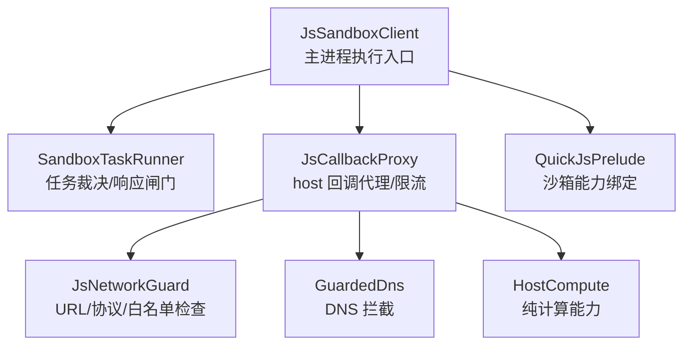
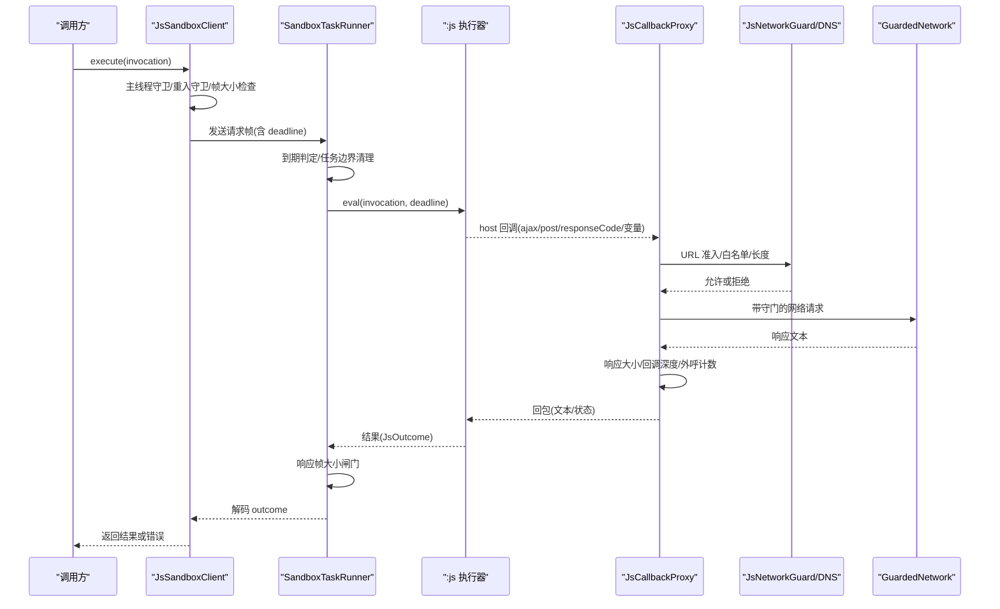
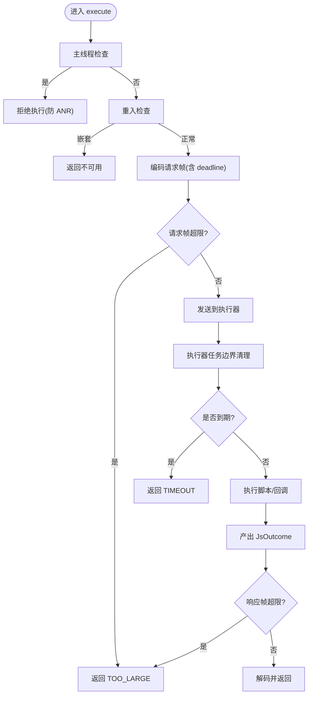
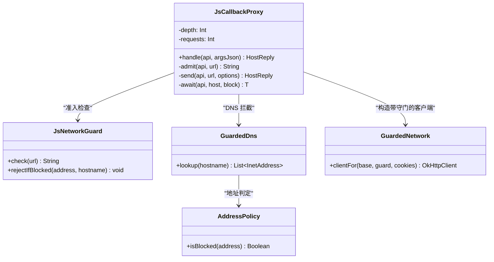
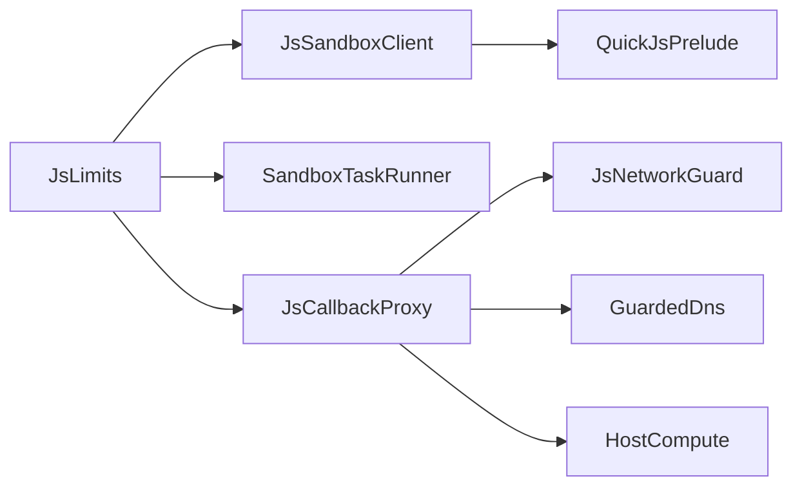

# 资源耗尽防护

<cite>
**本文引用的文件**
- [JsLimits.kt](file://lib_book_source/src/main/java/com/ebook/source/sandbox/JsLimits.kt)
- [JsSandboxClient.kt](file://lib_book_source/src/main/java/com/ebook/source/sandbox/JsSandboxClient.kt)
- [JsNetworkGuard.kt](file://lib_book_source/src/main/java/com/ebook/source/sandbox/JsNetworkGuard.kt)
- [JsCallbackProxy.kt](file://lib_book_source/src/main/java/com/ebook/source/sandbox/JsCallbackProxy.kt)
- [HostCompute.kt](file://lib_book_source/src/main/java/com/ebook/source/sandbox/HostCompute.kt)
- [SandboxTaskRunner.kt](file://lib_book_source/src/main/java/com/ebook/source/sandbox/SandboxTaskRunner.kt)
- [QuickJsPrelude.kt](file://lib_book_source/src/main/java/com/ebook/source/sandbox/QuickJsPrelude.kt)
- [JsSandboxClientTest.kt](file://lib_book_source/src/test/java/com/ebook/source/sandbox/JsSandboxClientTest.kt)
- [HostComputeTest.kt](file://lib_book_source/src/test/java/com/ebook/source/sandbox/HostComputeTest.kt)
</cite>

## 目录
1. [引言](#引言)
2. [项目结构](#项目结构)
3. [核心组件](#核心组件)
4. [架构总览](#架构总览)
5. [详细组件分析](#详细组件分析)
6. [依赖关系分析](#依赖关系分析)
7. [性能考量](#性能考量)
8. [故障排查指南](#故障排查指南)
9. [结论](#结论)
10. [附录](#附录)

## 引言
本文件聚焦“资源耗尽防护”的落地方案，覆盖 CPU 滥用防护、内存消耗控制、网络请求限制与存储资源保护，并给出可观测指标与检测恢复策略。内容基于沙箱执行链路（主进程与 :js 执行器）中的限流、超时、配额与白名单机制，以及 OkHttp 守门与 DNS 拦截等实现细节。目标是让任意书源脚本在不可信环境下也能被安全、稳定地解析，避免对宿主应用造成崩溃或资源枯竭。

## 项目结构
资源耗尽防护的关键代码集中在 lib_book_source 的沙箱子模块中，围绕“请求—执行—回调—响应”的边界进行层层限控：
- 限制常量集中定义：JsLimits
- 主进程侧执行客户端：JsSandboxClient
- 任务裁决与响应闸门：SandboxTaskRunner
- 主进程回调代理与限流：JsCallbackProxy
- 网络准入与地址拦截：JsNetworkGuard + GuardedDns + AddressPolicy
- 纯计算能力（不跨进程）：HostCompute
- 沙箱垫片与能力清单：QuickJsPrelude

图表来源
- [JsSandboxClient.kt:1-185](file://lib_book_source/src/main/java/com/ebook/source/sandbox/JsSandboxClient.kt#L1-L185)
- [SandboxTaskRunner.kt:1-69](file://lib_book_source/src/main/java/com/ebook/source/sandbox/SandboxTaskRunner.kt#L1-L69)
- [JsCallbackProxy.kt:1-506](file://lib_book_source/src/main/java/com/ebook/source/sandbox/JsCallbackProxy.kt#L1-L506)
- [JsNetworkGuard.kt:1-167](file://lib_book_source/src/main/java/com/ebook/source/sandbox/JsNetworkGuard.kt#L1-L167)
- [HostCompute.kt:1-345](file://lib_book_source/src/main/java/com/ebook/source/sandbox/HostCompute.kt#L1-L345)
- [QuickJsPrelude.kt:1-256](file://lib_book_source/src/main/java/com/ebook/source/sandbox/QuickJsPrelude.kt#L1-L256)

章节来源
- [JsLimits.kt:1-58](file://lib_book_source/src/main/java/com/ebook/source/sandbox/JsLimits.kt#L1-L58)
- [JsSandboxClient.kt:1-185](file://lib_book_source/src/main/java/com/ebook/source/sandbox/JsSandboxClient.kt#L1-L185)
- [SandboxTaskRunner.kt:1-69](file://lib_book_source/src/main/java/com/ebook/source/sandbox/SandboxTaskRunner.kt#L1-L69)
- [JsCallbackProxy.kt:1-506](file://lib_book_source/src/main/java/com/ebook/source/sandbox/JsCallbackProxy.kt#L1-L506)
- [JsNetworkGuard.kt:1-167](file://lib_book_source/src/main/java/com/ebook/source/sandbox/JsNetworkGuard.kt#L1-L167)
- [HostCompute.kt:1-345](file://lib_book_source/src/main/java/com/ebook/source/sandbox/HostCompute.kt#L1-L345)
- [QuickJsPrelude.kt:1-256](file://lib_book_source/src/main/java/com/ebook/source/sandbox/QuickJsPrelude.kt#L1-L256)

## 核心组件
- JsLimits：沙箱四象限资源限制的单一事实源，统一管控 wall-clock 超时、堆/栈上限、请求/响应帧大小、回调深度与单任务外呼次数。
- JsSandboxClient：主进程侧唯一执行入口，负责串行化 execute、计算截止日期、防主线程调用、重入保护、断连重放与帧大小前置校验。
- SandboxTaskRunner：执行器侧事务裁决，按截止日期拒绝排队过期的任务，并对响应帧做大小闸门。
- JsCallbackProxy：主进程 host 回调代理，承担 URL 准入、外呼次数限额、回调深度限制、基准页管理、变量与会话管理，并将网络访问委托给 GuardedNetwork。
- JsNetworkGuard + GuardedDns + AddressPolicy：URL 字符串层白名单检查 + OkHttp 接入点的 DNS 拦截，阻断内网/保留/云元数据等地址。
- HostCompute：纯计算 API（摘要、编码、对称加密、时间戳、UUID 等），全部在 :js 进程内执行，零跨进程往返。
- QuickJsPrelude：沙箱垫片与能力装配，明确暴露的能力清单与不支持能力，所有网络与变量访问均经主进程受限代理。

章节来源
- [JsLimits.kt:1-58](file://lib_book_source/src/main/java/com/ebook/source/sandbox/JsLimits.kt#L1-L58)
- [JsSandboxClient.kt:1-185](file://lib_book_source/src/main/java/com/ebook/source/sandbox/JsSandboxClient.kt#L1-L185)
- [SandboxTaskRunner.kt:1-69](file://lib_book_source/src/main/java/com/ebook/source/sandbox/SandboxTaskRunner.kt#L1-L69)
- [JsCallbackProxy.kt:1-506](file://lib_book_source/src/main/java/com/ebook/source/sandbox/JsCallbackProxy.kt#L1-L506)
- [JsNetworkGuard.kt:1-167](file://lib_book_source/src/main/java/com/ebook/source/sandbox/JsNetworkGuard.kt#L1-L167)
- [HostCompute.kt:1-345](file://lib_book_source/src/main/java/com/ebook/source/sandbox/HostCompute.kt#L1-L345)
- [QuickJsPrelude.kt:1-256](file://lib_book_source/src/main/java/com/ebook/source/sandbox/QuickJsPrelude.kt#L1-L256)

## 架构总览
下图展示了从主进程发起执行到执行器返回响应的完整流程，包含 CPU 超时、内存/栈限制、网络准入与限流、响应帧闸门等关键防护点。

图表来源
- [JsSandboxClient.kt:1-185](file://lib_book_source/src/main/java/com/ebook/source/sandbox/JsSandboxClient.kt#L1-L185)
- [SandboxTaskRunner.kt:1-69](file://lib_book_source/src/main/java/com/ebook/source/sandbox/SandboxTaskRunner.kt#L1-L69)
- [JsCallbackProxy.kt:1-506](file://lib_book_source/src/main/java/com/ebook/source/sandbox/JsCallbackProxy.kt#L1-L506)
- [JsNetworkGuard.kt:1-167](file://lib_book_source/src/main/java/com/ebook/source/sandbox/JsNetworkGuard.kt#L1-L167)

## 详细组件分析

### CPU 滥用防护
- Wall-clock 超时机制
  - 主进程使用单调时钟计算截止时间，随请求帧下发至执行器；执行器侧在任务开始与响应前都进行到期判定，过期即报 TIMEOUT，避免阻塞。
  - 客户端在主线程调用时直接拒绝，防止 ANR；同时通过非重入锁保证同一时刻只有一帧在飞，队列中的请求也受统一截止期限约束。
- JS 中断与计算复杂度限制
  - QuickJS 内核堆与栈由 JsLimits 的 heapBytes 与 stackBytes 约束；桥接层在执行前结合线程剩余栈进一步收紧，防止深递归触发 SIGSEGV。
  - 回调重入深度由 maxCallbackDepth 限制，防止规则嵌套导致的无限求值。
  - 执行器侧 runSandboxTask 在每次执行前执行任务边界清理，确保上一任务的副作用不会污染本次执行。
- 自动恢复
  - 通道异常或断连时，若本次尚未转发 host 回调，则重连并重放一次；若已产生副作用则停止重放，避免重复请求。

图表来源
- [JsSandboxClient.kt:65-99](file://lib_book_source/src/main/java/com/ebook/source/sandbox/JsSandboxClient.kt#L65-L99)
- [SandboxTaskRunner.kt:13-49](file://lib_book_source/src/main/java/com/ebook/source/sandbox/SandboxTaskRunner.kt#L13-L49)
- [JsLimits.kt:13-58](file://lib_book_source/src/main/java/com/ebook/source/sandbox/JsLimits.kt#L13-L58)

章节来源
- [JsSandboxClient.kt:1-185](file://lib_book_source/src/main/java/com/ebook/source/sandbox/JsSandboxClient.kt#L1-L185)
- [SandboxTaskRunner.kt:1-69](file://lib_book_source/src/main/java/com/ebook/source/sandbox/SandboxTaskRunner.kt#L1-L69)
- [JsLimits.kt:1-58](file://lib_book_source/src/main/java/com/ebook/source/sandbox/JsLimits.kt#L1-L58)

### 内存消耗控制
- 堆上限设置
  - JsLimits.heapBytes 为 QuickJS 堆上限（默认 8 MB），用于防止指数级分配与正则回溯导致的堆溢出。
- 栈深度限制
  - JsLimits.stackBytes 为 JS 栈上限（默认 1 MB），桥接层在执行前还会根据当前线程剩余栈动态收紧，避免 native 栈击穿。
- 分配失败处理
  - 执行器侧将运行异常转换为类型化的 UNAVAILABLE/MEMORY/STACK 等状态，主进程原样透传，便于上层分类处置。
  - 响应帧在进入主进程前进行大小闸门，防止大对象穿透 binder 缓冲导致主进程 OOM。

章节来源
- [JsLimits.kt:13-58](file://lib_book_source/src/main/java/com/ebook/source/sandbox/JsLimits.kt#L13-L58)
- [JsSandboxClient.kt:137-143](file://lib_book_source/src/main/java/com/ebook/source/sandbox/JsSandboxClient.kt#L137-L143)
- [SandboxTaskRunner.kt:51-69](file://lib_book_source/src/main/java/com/ebook/source/sandbox/SandboxTaskRunner.kt#L51-L69)

### 网络请求滥用限制
- 请求次数上限
  - JsLimits.maxRequestsPerTask 限制单任务外呼次数（默认 40），由 JsCallbackProxy 维护计数器并在真正发请求前扣减，未通过的请求不计入配额。
- 响应大小限制
  - JsLimits.maxHostReplyBytes 限制单次 host 回调返回体大小（默认 900 KB），超限则拒绝并返回错误，防止整页 HTML 撑爆 binder。
- 连接池与 DNS 防护
  - GuardedNetwork 复用 OkHttpClient 的连接池与线程池，仅替换 DNS 与 CookieJar；GuardedDns 在 OkHttp 真正解析处拦截地址，拒绝内网/保留/云元数据等地址，杜绝 DNS 重绑攻击。
- URL 准入
  - JsNetworkGuard.check 强制绝对 http/https URL、禁止 host 非法字符与凭证嵌入、严格白名单匹配，并在字符串层完成初步过滤。

图表来源
- [JsCallbackProxy.kt:241-300](file://lib_book_source/src/main/java/com/ebook/source/sandbox/JsCallbackProxy.kt#L241-L300)
- [JsNetworkGuard.kt:25-117](file://lib_book_source/src/main/java/com/ebook/source/sandbox/JsNetworkGuard.kt#L25-L117)
- [JsNetworkGuard.kt:86-99](file://lib_book_source/src/main/java/com/ebook/source/sandbox/JsNetworkGuard.kt#L86-L99)
- [JsNetworkGuard.kt:115-167](file://lib_book_source/src/main/java/com/ebook/source/sandbox/JsNetworkGuard.kt#L115-L167)
- [JsCallbackProxy.kt:496-506](file://lib_book_source/src/main/java/com/ebook/source/sandbox/JsCallbackProxy.kt#L496-L506)

章节来源
- [JsCallbackProxy.kt:1-506](file://lib_book_source/src/main/java/com/ebook/source/sandbox/JsCallbackProxy.kt#L1-L506)
- [JsNetworkGuard.kt:1-167](file://lib_book_source/src/main/java/com/ebook/source/sandbox/JsNetworkGuard.kt#L1-L167)

### 存储资源保护
- 文件访问限制
  - 沙箱垫片明确屏蔽 files/assets/bookSource/cookieManager 等能力，避免脚本直接读写文件系统或会话管理器，降低持久化滥用风险。
- 磁盘空间监控
  - 本项目未在本仓库中发现统一的磁盘监控逻辑；建议在上层仓储层（如下载服务、缓存管理）引入容量阈值与告警，配合临时文件清理策略。
- 临时文件清理
  - 建议在解析失败或超时路径中，主动清理本次任务产生的临时缓存，避免残留占用；可在 JsCallbackProxy.send 失败分支或客户端 afterDisconnect 中触发清理。

章节来源
- [QuickJsPrelude.kt:190-234](file://lib_book_source/src/main/java/com/ebook/source/sandbox/QuickJsPrelude.kt#L190-L234)
- [JsSandboxClient.kt:116-135](file://lib_book_source/src/main/java/com/ebook/source/sandbox/JsSandboxClient.kt#L116-L135)

### 资源监控指标
- CPU 使用率
  - 可通过系统 API 采集线程 CPU 耗时，或在执行前后记录 SystemClock.elapsedRealtime() 估算挂钟开销；结合 TIMEOUT/UNAVAILABLE 比率评估过载。
- 内存占用
  - 统计 JsOutcome.MEMORY/STACK 比例、响应帧 TOO_LARGE 次数；监控堆/栈接近上限的频率，必要时下调 JsLimits 阈值。
- 网络流量
  - 统计 per-task requests 分布、白名单拒绝率、DNS 拦截率；记录 HeadStatusProbe 探测失败率以发现站点异常。
- 指标聚合建议
  - 在 JsCallbackProxy 中汇总 requests、depth、rejectedUrl、dnsBlocked 等计数，定期上报；在客户端 withProxy 生命周期内重置。

[本节为通用指导，不直接分析具体文件]

### 资源耗尽攻击检测与自动恢复
- 检测
  - 高频超时/内存/栈错误：说明存在死循环或深层递归，应降级该源并提示用户。
  - 高频 URL 拒绝/DNS 拦截：说明脚本尝试访问私网或黑名单，应记录日志并告警。
  - 频繁断连重放：说明执行器不稳定，应限制重试次数并切换备用源。
- 自动恢复
  - 断连且未回调：重连并重放一次；已回调：放弃重放，返回不可用。
  - 队列超时：排在后面的请求因统一 deadline 自然超时，避免拖垮系统。
  - 回调深度超限：拒绝嵌套求值，提示规则链过长。

章节来源
- [JsSandboxClient.kt:116-135](file://lib_book_source/src/main/java/com/ebook/source/sandbox/JsSandboxClient.kt#L116-L135)
- [JsCallbackProxy.kt:413-430](file://lib_book_source/src/main/java/com/ebook/source/sandbox/JsCallbackProxy.kt#L413-L430)
- [SandboxTaskRunner.kt:13-49](file://lib_book_source/src/main/java/com/ebook/source/sandbox/SandboxTaskRunner.kt#L13-L49)

## 依赖关系分析
- 低耦合高内聚
  - JsLimits 作为单一事实源，解耦了各组件对阈值的硬编码。
  - JsSandboxClient 仅关注传输与调度，不关心业务逻辑；JsCallbackProxy 专注回调路由与限流；JsNetworkGuard 专注准入；HostCompute 专注纯计算。
- 外部依赖
  - OkHttp 用于网络请求，通过 GuardedDns 注入地址拦截。
  - QuickJS 提供 JS 运行时，堆/栈限制由 C++ 层与 Kotlin 层共同保障。
- 潜在环路与风险
  - 主线程不得调用沙箱，否则阻塞等待自身，形成死锁；已由客户端主线程守卫与回调深度限制双重保护。
  - 并发执行通过 inFlight 锁串行化，避免多源竞争 runtime 与 binder 事务。

图表来源
- [JsLimits.kt:1-58](file://lib_book_source/src/main/java/com/ebook/source/sandbox/JsLimits.kt#L1-L58)
- [JsSandboxClient.kt:1-185](file://lib_book_source/src/main/java/com/ebook/source/sandbox/JsSandboxClient.kt#L1-L185)
- [JsCallbackProxy.kt:1-506](file://lib_book_source/src/main/java/com/ebook/source/sandbox/JsCallbackProxy.kt#L1-L506)

章节来源
- [JsLimits.kt:1-58](file://lib_book_source/src/main/java/com/ebook/source/sandbox/JsLimits.kt#L1-L58)
- [JsSandboxClient.kt:1-185](file://lib_book_source/src/main/java/com/ebook/source/sandbox/JsSandboxClient.kt#L1-L185)
- [JsCallbackProxy.kt:1-506](file://lib_book_source/src/main/java/com/ebook/source/sandbox/JsCallbackProxy.kt#L1-L506)

## 性能考量
- 串行执行代价
  - 多源并发解析时，沙箱成为串行点，但通过统一 deadline 保证排队请求不会无界等待，超时即报，避免整体退化。
- Binder 缓冲限制
  - 请求/响应帧上限（900 KB）贴合 Android binder 事务缓冲（约 1 MB），防止现场抛 TransactionTooLargeException。
- 网络超时
  - await 包裹的 withTimeout 仅保护 binder 线程不被长时间占用；真正的连接/读取超时由客户端配置决定。
- 内存碎片
  - 响应帧过大时会先 stringify 再丢弃，增加一次额外开销，但换来“超限原文不进主进程”的安全收益。

[本节为通用指导，不直接分析具体文件]

## 故障排查指南
- 常见错误码与含义
  - TIMEOUT：排队到期限之后才开始执行或执行超时，检查 wallClockMs 与上游响应速度。
  - MEMORY/STACK：内存或栈超限，检查脚本是否存在指数增长或深递归。
  - TOO_LARGE：请求/响应帧超出上限，检查整页 HTML 或过大正文。
  - UNAVAILABLE：执行器不可用或通道异常，检查 :js 进程状态与断连重放逻辑。
  - UNSUPPORTED_API：调用了沙箱不支持的能力，检查 QuickJsPrelude 能力清单。
- 定位步骤
  - 查看 JsSandboxClient 日志，确认是否主线程调用、是否重入、是否断连重放。
  - 检查 JsCallbackProxy 的外呼计数与回调深度，确认是否达到上限。
  - 核查 JsNetworkGuard 的 URL 白名单与 DNS 拦截日志，确认是否误拒。
- 恢复策略
  - 对频繁失败的源进行降级或禁用，避免影响整体解析。
  - 调整 JsLimits 阈值，平衡稳定性与可用性。
  - 在网络层增加重试与退避，避免瞬时抖动。

章节来源
- [JsSandboxClientTest.kt:107-170](file://lib_book_source/src/test/java/com/ebook/source/sandbox/JsSandboxClientTest.kt#L107-L170)
- [JsSandboxClientTest.kt:210-259](file://lib_book_source/src/test/java/com/ebook/source/sandbox/JsSandboxClientTest.kt#L210-L259)

## 结论
本仓库通过 JsLimits 统一收敛资源阈值，结合主进程执行客户端、执行器任务裁决、回调代理与网络守门，构建了完整的资源耗尽防护体系。CPU 方面通过 wall-clock 超时与栈/堆限制阻断死循环与深递归；内存方面通过帧大小闸门与堆栈上限防止 OOM；网络方面通过白名单、DNS 拦截与请求次数限制抵御滥用；存储方面通过能力屏蔽与上层清理策略降低风险。配合可观测指标与自动恢复机制，可在不可信书源环境下保持应用稳定与安全。

[本节为总结性内容，不直接分析具体文件]

## 附录
- 关键阈值参考（来自 JsLimits）
  - wallClockMs：单次执行挂钟上限（默认 5000 ms）
  - heapBytes：QuickJS 堆上限（默认 8 MB）
  - stackBytes：JS 栈上限（默认 1 MB）
  - maxRequestBytes/maxOutcomeBytes/maxHostReplyBytes：请求/响应/回调帧上限（默认 900 KB）
  - maxCallbackDepth：回调重入深度上限（默认 8）
  - bindTimeoutMs：绑定超时（默认 2000 ms）
  - maxRequestsPerTask：单任务外呼次数上限（默认 40）

章节来源
- [JsLimits.kt:13-58](file://lib_book_source/src/main/java/com/ebook/source/sandbox/JsLimits.kt#L13-L58)