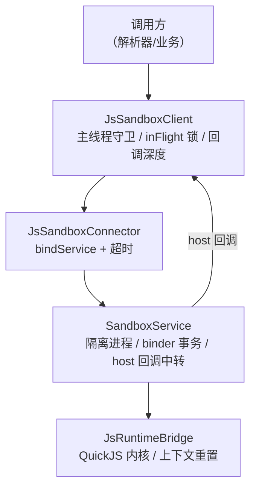
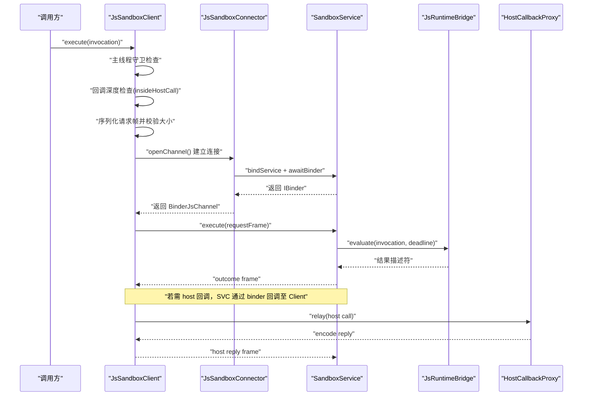
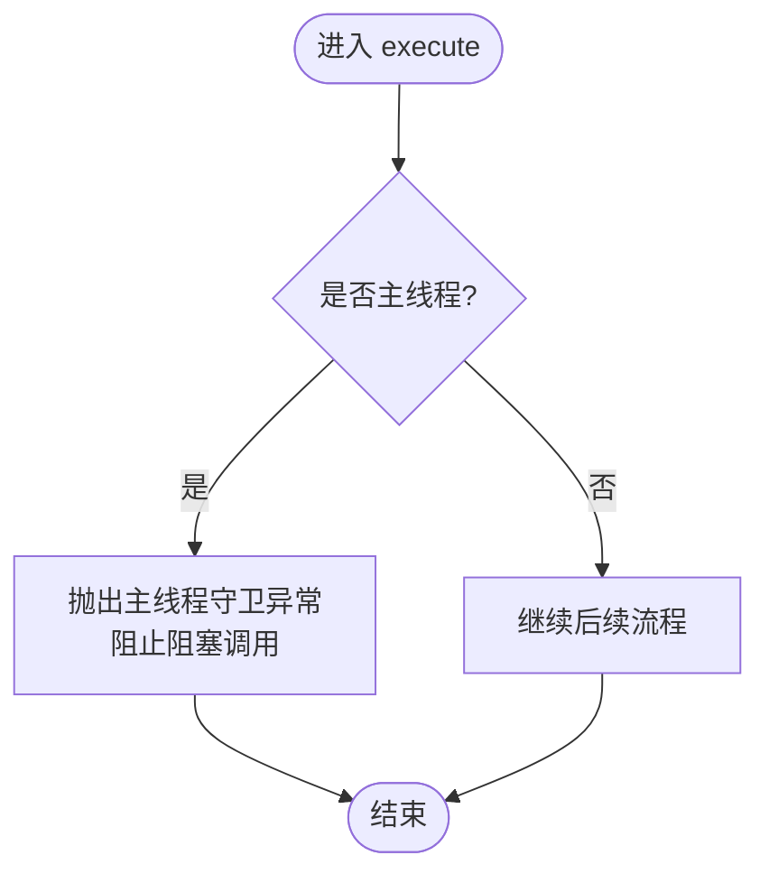
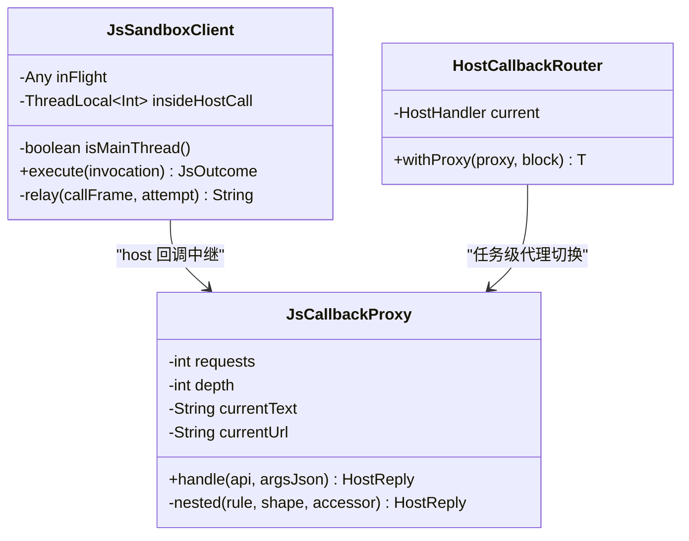
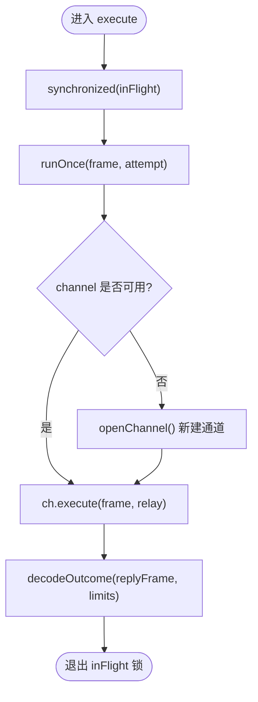
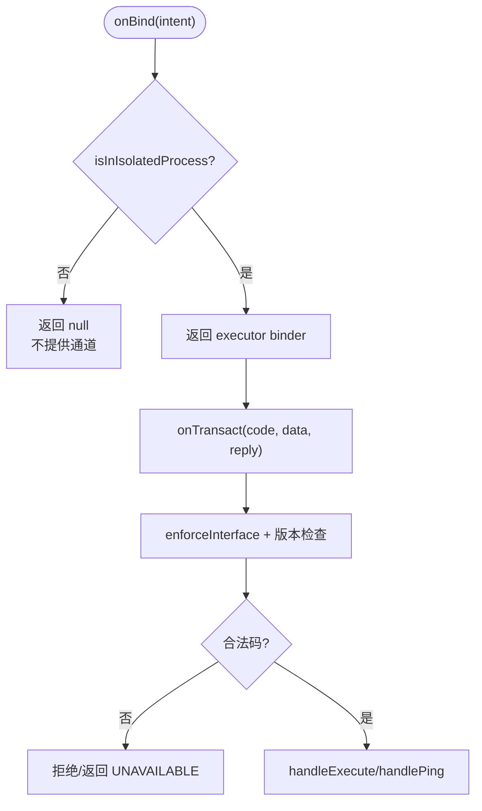
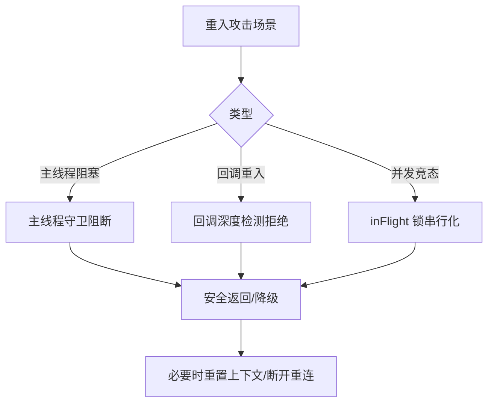
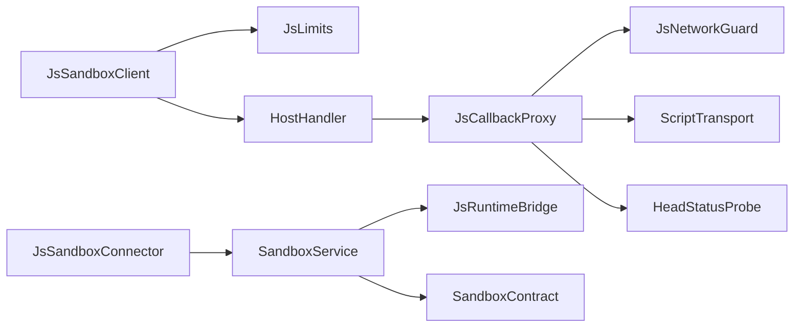

# 重入保护机制

<cite>
**本文引用的文件**
- [JsSandboxClient.kt](file://lib_book_source/src/main/java/com/ebook/source/sandbox/JsSandboxClient.kt)
- [JsCallbackProxy.kt](file://lib_book_source/src/main/java/com/ebook/source/sandbox/JsCallbackProxy.kt)
- [SandboxService.kt](file://lib_book_source/src/main/java/com/ebook/source/sandbox/SandboxService.kt)
- [SandboxProcess.kt](file://lib_book_source/src/main/java/com/ebook/source/sandbox/SandboxProcess.kt)
- [JsLimits.kt](file://lib_book_source/src/main/java/com/ebook/source/sandbox/JsLimits.kt)
- [JsSandboxConnector.kt](file://lib_book_source/src/main/java/com/ebook/source/sandbox/JsSandboxConnector.kt)
- [JsRuntimeBridge.kt](file://lib_book_source/src/main/java/com/ebook/source/sandbox/JsRuntimeBridge.kt)
</cite>

## 目录
1. [简介](#简介)
2. [项目结构](#项目结构)
3. [核心组件](#核心组件)
4. [架构总览](#架构总览)
5. [详细组件分析](#详细组件分析)
6. [依赖关系分析](#依赖关系分析)
7. [性能考量](#性能考量)
8. [故障排查指南](#故障排查指南)
9. [结论](#结论)

## 简介
本文件聚焦于脚本沙箱执行链路中的“重入保护”体系：从主线程守卫、回调重入检测、任务级串行化控制，到隔离进程侧的权限与通信限制，再到对重入攻击的防御策略与性能影响分析。目标是让读者在不深入源码的前提下，理解系统在跨进程、多线程、回调嵌套等复杂场景下如何避免死锁、资源竞争和状态不一致，并在性能上保持可接受开销。

## 项目结构
与重入保护直接相关的代码集中在 lib_book_source 模块的沙箱子系统中，围绕一个“主进程客户端 + 隔离进程服务”的双端模型组织：
- 主进程侧负责：主线程守卫、请求帧构造与大小校验、任务串行化（inFlight）、回调重入深度计数、断连重放、host 回调中继。
- 隔离进程侧负责：协议版本检查、binder 事务处理、宿主回调回传、资源重置（超时/堆/栈耗尽后重建上下文）。

图表来源
- [JsSandboxClient.kt:35-99](file://lib_book_source/src/main/java/com/ebook/source/sandbox/JsSandboxClient.kt#L35-L99)
- [JsSandboxConnector.kt:24-60](file://lib_book_source/src/main/java/com/ebook/source/sandbox/JsSandboxConnector.kt#L24-L60)
- [SandboxService.kt:27-153](file://lib_book_source/src/main/java/com/ebook/source/sandbox/SandboxService.kt#L27-L153)
- [JsRuntimeBridge.kt:21-113](file://lib_book_source/src/main/java/com/ebook/source/sandbox/JsRuntimeBridge.kt#L21-L113)

章节来源
- [JsSandboxClient.kt:35-185](file://lib_book_source/src/main/java/com/ebook/source/sandbox/JsSandboxClient.kt#L35-L185)
- [JsSandboxConnector.kt:24-142](file://lib_book_source/src/main/java/com/ebook/source/sandbox/JsSandboxConnector.kt#L24-L142)
- [SandboxService.kt:27-210](file://lib_book_source/src/main/java/com/ebook/source/sandbox/SandboxService.kt#L27-L210)
- [JsRuntimeBridge.kt:21-113](file://lib_book_source/src/main/java/com/ebook/source/sandbox/JsRuntimeBridge.kt#L21-L113)

## 核心组件
- JsSandboxClient：主进程侧唯一入口，承担主线程守卫、任务串行化（inFlight）、回调重入检测、断连重放与 host 回调中继。
- HostCallbackRouter 与 JsCallbackProxy：主进程侧 host 回调路由与能力代理，管理单次任务的可变状态、外呼限流、嵌套求值深度与变量作用域。
- SandboxService：隔离进程侧 binder 服务，负责协议校验、执行调度与 host 回调回传。
- SandboxProcess：隔离进程识别门控，确保仅在隔离进程中暴露 binder。
- JsLimits：集中化的资源与行为上限（挂钟、堆/栈、报文大小、回调深度、连接超时、请求次数）。
- JsSandboxConnector：绑定 :js 服务并等待 binder，带超时与失败语义。
- JsRuntimeBridge：进程内 QuickJS 桥接，负责 runtime 生命周期、描述符解码与上下文重置。

章节来源
- [JsSandboxClient.kt:35-185](file://lib_book_source/src/main/java/com/ebook/source/sandbox/JsSandboxClient.kt#L35-L185)
- [JsCallbackProxy.kt:57-460](file://lib_book_source/src/main/java/com/ebook/source/sandbox/JsCallbackProxy.kt#L57-L460)
- [SandboxService.kt:27-210](file://lib_book_source/src/main/java/com/ebook/source/sandbox/SandboxService.kt#L27-L210)
- [SandboxProcess.kt:23-28](file://lib_book_source/src/main/java/com/ebook/source/sandbox/SandboxProcess.kt#L23-L28)
- [JsLimits.kt:13-58](file://lib_book_source/src/main/java/com/ebook/source/sandbox/JsLimits.kt#L13-L58)
- [JsSandboxConnector.kt:24-142](file://lib_book_source/src/main/java/com/ebook/source/sandbox/JsSandboxConnector.kt#L24-L142)
- [JsRuntimeBridge.kt:21-113](file://lib_book_source/src/main/java/com/ebook/source/sandbox/JsRuntimeBridge.kt#L21-L113)

## 架构总览
重入保护贯穿“主进程—隔离进程”双向交互，关键约束如下：
- 永不在主线程阻塞调用沙箱，避免 ANR 与自身等待导致的死锁。
- 通过 inFlight 非重入锁串行化 execute，保证同一时刻只有一帧在飞，从而为报文大小上限提供前提。
- 使用 ThreadLocal 维护回调重入深度，防止 host 回调中再次发起 JS 执行造成双向死锁。
- 隔离进程仅在被系统标记为 isolatedProcess 时暴露 binder，阻断未授权进程获取脚本执行能力。
- 所有跨进程传输受限于统一的 JsLimits，防止 binder 缓冲溢出与 JSON 解析内存膨胀。

图表来源
- [JsSandboxClient.kt:65-143](file://lib_book_source/src/main/java/com/ebook/source/sandbox/JsSandboxClient.kt#L65-L143)
- [JsSandboxConnector.kt:37-60](file://lib_book_source/src/main/java/com/ebook/source/sandbox/JsSandboxConnector.kt#L37-L60)
- [SandboxService.kt:83-98](file://lib_book_source/src/main/java/com/ebook/source/sandbox/SandboxService.kt#L83-L98)
- [JsRuntimeBridge.kt:41-67](file://lib_book_source/src/main/java/com/ebook/source/sandbox/JsRuntimeBridge.kt#L41-L67)
- [JsCallbackProxy.kt:152-239](file://lib_book_source/src/main/java/com/ebook/source/sandbox/JsCallbackProxy.kt#L152-L239)

## 详细组件分析

### 主线程守卫实现
- 主线程检测：通过比较 Looper 实例判定当前是否为主线程，避免误判后台线程为主线程导致解析全部禁用。
- 阻塞调用拦截：在 execute 入口处禁止主线程进入，明确告知“一次执行最长阻塞若干毫秒”，避免把解析失败伪装成 ANR。
- 异常处理：除协议不匹配导致的未类型化异常外，其余失败统一转化为命名状态，便于调用方分类处置。

图表来源
- [JsSandboxClient.kt:49-68](file://lib_book_source/src/main/java/com/ebook/source/sandbox/JsSandboxClient.kt#L49-L68)

章节来源
- [JsSandboxClient.kt:49-68](file://lib_book_source/src/main/java/com/ebook/source/sandbox/JsSandboxClient.kt#L49-L68)

### 回调重入检测逻辑
- 嵌套执行识别：使用 ThreadLocal 计数器 insideHostCall，在 relay 时自增并在 finally 中恢复，确保不同 binder 线程上的回调深度独立统计。
- 递归深度限制：在 JsCallbackProxy 中通过 depth 字段与 limits.maxCallbackDepth 限制嵌套规则求值深度，防止深递归耗尽资源。
- 执行上下文隔离：JsCallbackProxy 持有任务级可变状态（currentText/currentUrl/requests/depth），并通过 HostCallbackRouter 保证同一时刻只有一个任务的代理生效，避免多源互相干扰。

图表来源
- [JsSandboxClient.kt:57-63](file://lib_book_source/src/main/java/com/ebook/source/sandbox/JsSandboxClient.kt#L57-L63)
- [JsCallbackProxy.kt:105-177](file://lib_book_source/src/main/java/com/ebook/source/sandbox/JsCallbackProxy.kt#L105-L177)
- [JsCallbackProxy.kt:413-430](file://lib_book_source/src/main/java/com/ebook/source/sandbox/JsCallbackProxy.kt#L413-L430)
- [JsCallbackProxy.kt:57-76](file://lib_book_source/src/main/java/com/ebook/source/sandbox/JsCallbackProxy.kt#L57-L76)

章节来源
- [JsSandboxClient.kt:61-73](file://lib_book_source/src/main/java/com/ebook/source/sandbox/JsSandboxClient.kt#L61-L73)
- [JsCallbackProxy.kt:137-177](file://lib_book_source/src/main/java/com/ebook/source/sandbox/JsCallbackProxy.kt#L137-L177)
- [JsCallbackProxy.kt:413-430](file://lib_book_source/src/main/java/com/ebook/source/sandbox/JsCallbackProxy.kt#L413-L430)
- [JsCallbackProxy.kt:57-76](file://lib_book_source/src/main/java/com/ebook/source/sandbox/JsCallbackProxy.kt#L57-L76)

### 任务级串行化控制
- inFlight 锁机制：execute 进入 synchronized(inFlight) 临界区，保证同一时刻只有一帧在飞；该锁同时保护 channel 字段的读写，无需第二把锁。
- Binder 线程池管理：隔离进程的 binder 线程池由系统提供（默认最多 15 条），并发度限制来自主进程的 inFlight 锁而非服务端队列。
- 并发度限制：通过单例 runtime 与 inFlight 锁，使多个书源并发解析排队执行，避免互抢导致的资源争用与报文超限风险。

图表来源
- [JsSandboxClient.kt:57-59](file://lib_book_source/src/main/java/com/ebook/source/sandbox/JsSandboxClient.kt#L57-L59)
- [JsSandboxClient.kt:81-99](file://lib_book_source/src/main/java/com/ebook/source/sandbox/JsSandboxClient.kt#L81-L99)
- [JsSandboxClient.kt:137-143](file://lib_book_source/src/main/java/com/ebook/source/sandbox/JsSandboxClient.kt#L137-L143)

章节来源
- [JsSandboxClient.kt:57-99](file://lib_book_source/src/main/java/com/ebook/source/sandbox/JsSandboxClient.kt#L57-L99)
- [SandboxService.kt:21-26](file://lib_book_source/src/main/java/com/ebook/source/sandbox/SandboxService.kt#L21-L26)

### 执行器进程的重入防护
- isolatedProcess 模式下的权限控制：SandboxService.onBind 仅在 SandboxProcess.isInIsolatedProcess 为真时返回 binder，否则拒绝提供通道，防止在非隔离进程运行脚本。
- 跨进程通信限制：所有跨进程数据均受 JsLimits 约束（请求帧、响应帧、host 回调回复大小），且服务端再判一次字节上限，避免对端越界。
- 协议与版本校验：onTransact 先 enforceInterface 与协议版本检查，不合则直接返回不可用，防止错位导致的未知行为。

图表来源
- [SandboxService.kt:147-153](file://lib_book_source/src/main/java/com/ebook/source/sandbox/SandboxService.kt#L147-L153)
- [SandboxProcess.kt:23-28](file://lib_book_source/src/main/java/com/ebook/source/sandbox/SandboxProcess.kt#L23-L28)
- [SandboxService.kt:63-80](file://lib_book_source/src/main/java/com/ebook/source/sandbox/SandboxService.kt#L63-L80)

章节来源
- [SandboxService.kt:147-153](file://lib_book_source/src/main/java/com/ebook/source/sandbox/SandboxService.kt#L147-L153)
- [SandboxProcess.kt:23-28](file://lib_book_source/src/main/java/com/ebook/source/sandbox/SandboxProcess.kt#L23-L28)
- [SandboxService.kt:63-80](file://lib_book_source/src/main/java/com/ebook/source/sandbox/SandboxService.kt#L63-L80)

### 重入攻击的防御策略
- 死锁预防：主线程守卫 + 回调深度检测 + inFlight 锁，三者共同避免“主线程阻塞”“回调中再次执行 JS”“多帧并发”引发的双向死锁。
- 资源竞争避免：inFlight 锁将并发降为串行，配合 JsLimits 的单次报文上限与请求次数上限，防止 binder 缓冲与解析内存被滥用。
- 状态一致性保证：HostCallbackRouter 的 withProxy 保证同一时刻只有一个任务的代理生效；JsCallbackProxy 的任务级状态（currentText/currentUrl/requests/depth）不会在多源间串扰；JsRuntimeBridge 在超时/堆/栈耗尽后 reset 上下文，避免残留状态污染下一条规则。

图表来源
- [JsSandboxClient.kt:65-73](file://lib_book_source/src/main/java/com/ebook/source/sandbox/JsSandboxClient.kt#L65-L73)
- [JsCallbackProxy.kt:152-177](file://lib_book_source/src/main/java/com/ebook/source/sandbox/JsCallbackProxy.kt#L152-L177)
- [JsRuntimeBridge.kt:70-84](file://lib_book_source/src/main/java/com/ebook/source/sandbox/JsRuntimeBridge.kt#L70-L84)

章节来源
- [JsSandboxClient.kt:65-73](file://lib_book_source/src/main/java/com/ebook/source/sandbox/JsSandboxClient.kt#L65-L73)
- [JsCallbackProxy.kt:152-177](file://lib_book_source/src/main/java/com/ebook/source/sandbox/JsCallbackProxy.kt#L152-L177)
- [JsRuntimeBridge.kt:70-84](file://lib_book_source/src/main/java/com/ebook/source/sandbox/JsRuntimeBridge.kt#L70-L84)

## 依赖关系分析
重入保护的关键依赖关系如下：
- JsSandboxClient 依赖 JsLimits 决定超时与大小限制，依赖 HostHandler 完成 host 回调转发。
- JsCallbackProxy 依赖 JsNetworkGuard 进行白名单准入，依赖 ScriptTransport 与 HeadStatusProbe 完成网络与探测。
- SandboxService 依赖 JsRuntimeBridge 执行内核求值，依赖 SandboxContract 协议进行通信。
- JsSandboxConnector 依赖 Android ServiceConnection 与 CountDownLatch 完成异步绑定等待。

图表来源
- [JsSandboxClient.kt:35-43](file://lib_book_source/src/main/java/com/ebook/source/sandbox/JsSandboxClient.kt#L35-L43)
- [JsCallbackProxy.kt:105-135](file://lib_book_source/src/main/java/com/ebook/source/sandbox/JsCallbackProxy.kt#L105-L135)
- [SandboxService.kt:27-32](file://lib_book_source/src/main/java/com/ebook/source/sandbox/SandboxService.kt#L27-L32)
- [JsSandboxConnector.kt:24-27](file://lib_book_source/src/main/java/com/ebook/source/sandbox/JsSandboxConnector.kt#L24-L27)

章节来源
- [JsSandboxClient.kt:35-43](file://lib_book_source/src/main/java/com/ebook/source/sandbox/JsSandboxClient.kt#L35-L43)
- [JsCallbackProxy.kt:105-135](file://lib_book_source/src/main/java/com/ebook/source/sandbox/JsCallbackProxy.kt#L105-L135)
- [SandboxService.kt:27-32](file://lib_book_source/src/main/java/com/ebook/source/sandbox/SandboxService.kt#L27-L32)
- [JsSandboxConnector.kt:24-27](file://lib_book_source/src/main/java/com/ebook/source/sandbox/JsSandboxConnector.kt#L24-L27)

## 性能考量
- 主线程守卫避免 ANR：在主线程直接拒绝阻塞调用，代价是快速失败，但能避免整应用卡顿。
- inFlight 串行化带来的排队：虽然降低吞吐，但避免了资源争用与报文超限，整体更稳定；排队超时以 wallClockMs 兜底，显式 TIMEOUT 比静默延时要友好。
- 回调深度与请求次数限制：防止恶意或错误脚本无限循环与过多外呼；合理的默认值（如 maxRequestsPerTask=40、maxCallbackDepth=8）平衡了正常解析与安全性。
- 断连重放成本：仅当本次无副作用时重放，避免重复请求；有副作用时直接失败，防止页面重复拉取。
- 上下文重置开销：在超时/堆/栈耗尽后重建 context，摊薄到单次正文请求不构成瓶颈，但会引入一次分配成本。

优化建议
- 根据真实源失败率调整 JsLimits 数值（报文上限、请求次数、回调深度），优先观察正文页 HTML 体积与外呼频率。
- 若未来放开 inFlight 并发，必须同步收紧 maxRequestBytes/maxOutcomeBytes 并增加按调用身份分发的表，避免多源互相看到变量与页面。
- 对频繁触发的 host 回调（如大量 CDN 图片）考虑批量探测与缓存，减少多次 binder 往返。

[本节为通用性能讨论，不直接分析具体文件]

## 故障排查指南
常见问题与定位要点：
- 主线程调用导致 ANR：检查调用方是否在 UI 线程触发 execute；日志会提示“脚本沙箱不能在主线程执行”。
- 回调重入导致死锁：确认 HostCallbackProxy 的 withProxy 是否正确包裹执行；日志可能提示“上一次任务的代理还没收尾”。
- 断连重放失败：查看 Attempt.relayed 计数；若已转发过回调则不再重放，避免重复请求。
- 隔离进程未启动：检查 manifest 是否声明 isolatedProcess；SandboxService.onBind 会拒绝非隔离进程。
- 协议版本不合：SandboxService 会记录版本不符并返回 UNAVAILABLE，需重新构建对齐。

章节来源
- [JsSandboxClient.kt:65-99](file://lib_book_source/src/main/java/com/ebook/source/sandbox/JsSandboxClient.kt#L65-L99)
- [JsCallbackProxy.kt:57-76](file://lib_book_source/src/main/java/com/ebook/source/sandbox/JsCallbackProxy.kt#L57-L76)
- [SandboxService.kt:63-80](file://lib_book_source/src/main/java/com/ebook/source/sandbox/SandboxService.kt#L63-L80)
- [SandboxService.kt:147-153](file://lib_book_source/src/main/java/com/ebook/source/sandbox/SandboxService.kt#L147-L153)

## 结论
该重入保护机制通过“主线程守卫 + 回调深度检测 + 任务串行化 + 隔离进程权限门控 + 统一资源限制”的多层防线，有效避免了死锁、资源竞争与状态不一致问题。其设计在保证安全性的前提下，兼顾了可诊断性与可维护性：失败路径清晰、限幅可控、上下文可重置。实际部署中应根据真实源的负载特征调优 JsLimits，并严格遵循“不在主线程阻塞”“任务级状态隔离”“协议版本一致”等约定，以获得稳定高效的脚本解析体验。