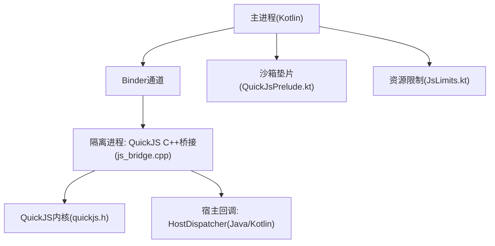
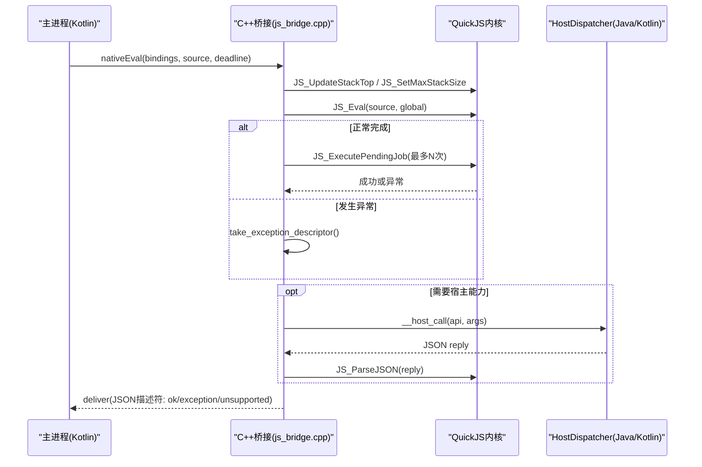
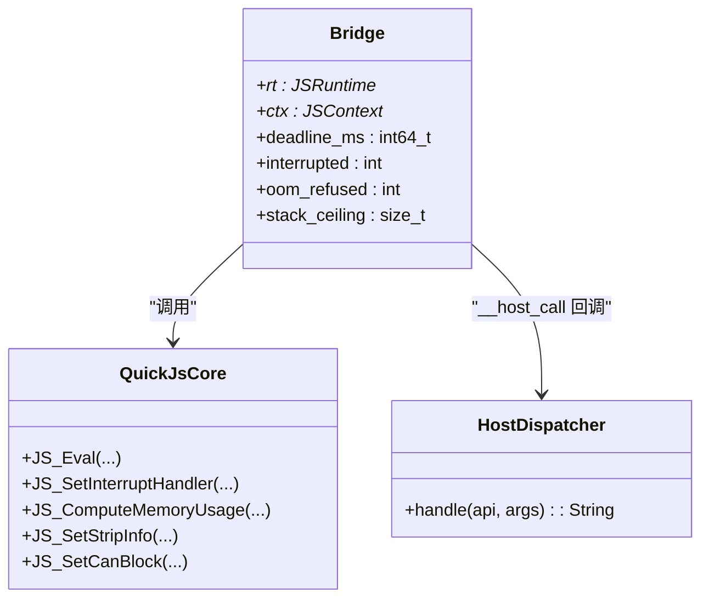

# QuickJS引擎调试

<cite>
**本文引用的文件**
- [js_bridge.cpp](file://lib_book_source/src/main/cpp/bridge/js_bridge.cpp)
- [quickjs.h](file://third_party/quickjs/quickjs.h)
- [QuickJsPrelude.kt](file://lib_book_source/src/main/java/com/ebook/source/sandbox/QuickJsPrelude.kt)
- [JsLimits.kt](file://lib_book_source/src/main/java/com/ebook/source/sandbox/JsLimits.kt)
- [0028-untrusted-js-sandbox.md](file://docs/adr/0028-untrusted-js-sandbox.md)
</cite>

## 目录
1. [简介](#简介)
2. [项目结构](#项目结构)
3. [核心组件](#核心组件)
4. [架构总览](#架构总览)
5. [详细组件分析](#详细组件分析)
6. [依赖关系分析](#依赖关系分析)
7. [性能与调试要点](#性能与调试要点)
8. [故障排查指南](#故障排查指南)
9. [结论](#结论)
10. [附录：常用调试脚本与工具清单](#附录常用调试脚本与工具清单)

## 简介
本文件面向在工程中使用 QuickJS 执行不可信 JS 的开发者，聚焦“可观测、可控制、可恢复”的调试体系。内容覆盖：
- JavaScript 断点与调试：JS_Eval 的执行上下文、错误堆栈、异常分类与调试信息剥离。
- 内存视图：JSMemoryUsage 统计、分配器拦截、对象引用与 GC 监控。
- 执行跟踪：JS_SetInterruptHandler 中断处理器、上下文切换、调用栈分析与性能热点定位。
- 引擎配置优化：JS_SetRuntimeInfo、JS_SetStripInfo、JS_SetCanBlock、模块加载器调试。
- 宿主交互调试：HostDispatcher 回调追踪、安全边界检查与资源访问监控。
- 实用工具：自定义调试器、日志分析器、性能分析器的使用方法与落地位置。
- 常见问题：内存泄漏、死循环、权限违规等问题的诊断与解决方案。

## 项目结构
本项目将 QuickJS 内核 vendored 到 third_party/quickjs，并通过 C++ 桥接层 lib_book_source/src/main/cpp/bridge/js_bridge.cpp 暴露 JNI；Kotlin 侧提供沙箱垫片、能力白名单与限制参数。ADR-0028 明确了隔离进程、deny-by-default 与安全边界策略。

图示来源
- [js_bridge.cpp:691-820](file://lib_book_source/src/main/cpp/bridge/js_bridge.cpp#L691-L820)
- [quickjs.h:325-448](file://third_party/quickjs/quickjs.h#L325-L448)

章节来源
- [0028-untrusted-js-sandbox.md:14-44](file://docs/adr/0028-untrusted-js-sandbox.md#L14-L44)
- [js_bridge.cpp:691-820](file://lib_book_source/src/main/cpp/bridge/js_bridge.cpp#L691-L820)
- [quickjs.h:325-448](file://third_party/quickjs/quickjs.h#L325-L448)

## 核心组件
- 原生桥接层（js_bridge.cpp）
  - 生命周期：nativeCreate/nativeReset/nativeDestroy/nativeEval
  - 资源控制：自定义分配器（记录分配被拒）、栈预算、中断处理器、微任务队列限流
  - 异常与结果：统一封装为 JSON 描述符（ok/exception/unsupported），并区分超时、OOM 与不支持能力
- QuickJS 内核（quickjs.h）
  - 运行时与上下文管理、内存统计、中断、GC、模块加载、值转换与字符串处理
- Kotlin 沙箱垫片（QuickJsPrelude.kt）
  - 每次执行前置注入绑定，暴露受限 java.* 与 source/book/chapter 对象面
  - 明确不支持的能力以前缀抛出，便于上层归类
- 资源限制（JsLimits.kt）
  - wall-clock、heap、stack、请求/响应大小、回调深度、单次 host 次数等上限

章节来源
- [js_bridge.cpp:91-107](file://lib_book_source/src/main/cpp/bridge/js_bridge.cpp#L91-L107)
- [js_bridge.cpp:141-212](file://lib_book_source/src/main/cpp/bridge/js_bridge.cpp#L141-L212)
- [js_bridge.cpp:272-313](file://lib_book_source/src/main/cpp/bridge/js_bridge.cpp#L272-L313)
- [js_bridge.cpp:366-439](file://lib_book_source/src/main/cpp/bridge/js_bridge.cpp#L366-L439)
- [js_bridge.cpp:466-539](file://lib_book_source/src/main/cpp/bridge/js_bridge.cpp#L466-L539)
- [js_bridge.cpp:586-651](file://lib_book_source/src/main/cpp/bridge/js_bridge.cpp#L586-L651)
- [js_bridge.cpp:691-820](file://lib_book_source/src/main/cpp/bridge/js_bridge.cpp#L691-L820)
- [quickjs.h:325-448](file://third_party/quickjs/quickjs.h#L325-L448)
- [QuickJsPrelude.kt:21-256](file://lib_book_source/src/main/java/com/ebook/source/sandbox/QuickJsPrelude.kt#L21-L256)
- [JsLimits.kt:13-58](file://lib_book_source/src/main/java/com/ebook/source/sandbox/JsLimits.kt#L13-L58)

## 架构总览
下图展示一次 nativeEval 的完整时序，包括中断器、分配器、微任务排空、宿主回调与结果投递。

图示来源
- [js_bridge.cpp:764-820](file://lib_book_source/src/main/cpp/bridge/js_bridge.cpp#L764-L820)
- [js_bridge.cpp:522-539](file://lib_book_source/src/main/cpp/bridge/js_bridge.cpp#L522-L539)
- [js_bridge.cpp:586-637](file://lib_book_source/src/main/cpp/bridge/js_bridge.cpp#L586-L637)
- [quickjs.h:325-348](file://third_party/quickjs/quickjs.h#L325-L348)

章节来源
- [js_bridge.cpp:764-820](file://lib_book_source/src/main/cpp/bridge/js_bridge.cpp#L764-L820)

## 详细组件分析

### 1) JavaScript 断点调试与异常处理
- JS_Eval 执行选项
  - 全局代码/模块/Direct/Indirect 类型，严格模式、仅编译、异步 top-level await、回溯屏障等标志位。
  - 本仓使用全局代码类型，返回完成值后由宿主判定是否为 thenable。
- 错误堆栈与调试信息
  - 可通过设置回溯屏障减少无关帧，避免污染错误栈。
  - 调试信息剥离：通过 JS_SetStripInfo 移除源码与调试信息，生产环境建议启用以减少体积与泄露风险。
- 异常分类与提取
  - 统一通过 take_exception_descriptor 将异常转为 JSON 描述符，区分超时、OOM、不支持能力与一般运行时错误。
  - 裸 null/undefined 且存在分配被拒时直接归类为 OOM；否则读取 name/message，支持不支持前缀的分类。
- 调试建议
  - 开发阶段关闭 JS_STRIP_SOURCE/JS_STRIP_DEBUG，保留源信息与行号以便定位。
  - 对频繁失败的规则，先打印 bindings 与 result 字段，再逐步缩小范围。

章节来源
- [quickjs.h:331-348](file://third_party/quickjs/quickjs.h#L331-L348)
- [quickjs.h:929-933](file://third_party/quickjs/quickjs.h#L929-L933)
- [js_bridge.cpp:466-539](file://lib_book_source/src/main/cpp/bridge/js_bridge.cpp#L466-L539)
- [js_bridge.cpp:764-820](file://lib_book_source/src/main/cpp/bridge/js_bridge.cpp#L764-L820)

### 2) 内存视图查看与垃圾回收监控
- JSMemoryUsage 结构体
  - 包含 malloc_size/count、memory_used_size/count、atom/str/obj/prop/shape 等计数与字节数，可用于冷启动/关键路径前后对比。
- 分配器拦截
  - 桥接层用自定义分配器包装 quickjs 默认分配，记录分配被拒（oom_refused），从而精准识别 OOM。
- 对象引用与 GC
  - 使用 JS_IsLiveObject 与 JS_RunGC 配合进行“存活对象”探测与强制 GC，辅助定位持有链。
- 实践步骤
  - 在执行前后调用 JS_ComputeMemoryUsage 并输出差异，关注 obj_count/obj_size、prop_count/prop_size 增长。
  - 结合 ValueGuard 确保 JSValue 正确释放，避免隐式泄漏。
  - 对于疑似循环引用，优先从最近新增的全局属性入手，必要时引入弱引用或显式清理。

章节来源
- [quickjs.h:431-448](file://third_party/quickjs/quickjs.h#L431-L448)
- [js_bridge.cpp:141-212](file://lib_book_source/src/main/cpp/bridge/js_bridge.cpp#L141-L212)
- [js_bridge.cpp:298-313](file://lib_book_source/src/main/cpp/bridge/js_bridge.cpp#L298-L313)

### 3) 执行跟踪与性能热点识别
- 中断处理器（JS_SetInterruptHandler）
  - on_interrupt 按单调时钟比对 deadline，超过则标记 interrupted 并返回非零，使解释器以 InternalError("interrupted") 结束。
  - 注意：中断只在解释器轮询点触发，阻塞中的宿主调用需由主进程侧兜底。
- 上下文切换与调用栈
  - 每次执行前 JS_UpdateStackTop + JS_SetMaxStackSize 按当前线程剩余栈计算预算，避免深递归导致 SIGSEGV。
  - 通过 ValueGuard 统一管理 JSValue 生命周期，保证异常路径不泄漏。
- 性能热点识别
  - 关注 JS_ExecutePendingJob 的轮转次数与失败分支，自驱动 Promise 循环会被拒绝（MAX_PENDING_JOBS）。
  - 通过 to_json 序列化结果时的耗时与异常路径，判断是否存在复杂对象或循环引用。

章节来源
- [js_bridge.cpp:109-122](file://lib_book_source/src/main/cpp/bridge/js_bridge.cpp#L109-L122)
- [js_bridge.cpp:214-281](file://lib_book_source/src/main/cpp/bridge/js_bridge.cpp#L214-L281)
- [js_bridge.cpp:522-539](file://lib_book_source/src/main/cpp/bridge/js_bridge.cpp#L522-L539)
- [js_bridge.cpp:764-820](file://lib_book_source/src/main/cpp/bridge/js_bridge.cpp#L764-L820)

### 4) 引擎配置优化
- JS_SetRuntimeInfo
  - 可为 runtime 附加版本/标识信息，便于日志关联与问题复现。
- JS_SetStripInfo
  - 生产构建建议开启 JS_STRIP_SOURCE/JS_STRIP_DEBUG，减小体积与降低调试信息泄露风险。
- JS_SetCanBlock
  - 禁用 Atomics.wait 等阻塞原语，避免执行器线程被意外阻塞。
- 模块加载器
  - 若使用模块机制，可通过 JS_SetModuleLoaderFunc/2 注入自定义加载器，用于调试 import 路径与资源解析。

章节来源
- [quickjs.h:369-385](file://third_party/quickjs/quickjs.h#L369-L385)
- [quickjs.h:929-933](file://third_party/quickjs/quickjs.h#L929-L933)
- [quickjs.h:924-928](file://third_party/quickjs/quickjs.h#L924-L928)
- [quickjs.h:954-967](file://third_party/quickjs/quickjs.h#L954-L967)
- [js_bridge.cpp:691-718](file://lib_book_source/src/main/cpp/bridge/js_bridge.cpp#L691-L718)

### 5) 与宿主进程的交互调试
- HostDispatcher 回调追踪
  - 桥接层通过 __host_call 将 API 名与参数序列化后调用 HostDispatcher.handle，返回 JSON 应答再反序列化为 JS 值。
  - 所有网络与变量操作经此通道，便于统一审计与限流。
- 安全边界检查
  - 白名单校验在 Kotlin 侧 JsHostApi 表与 QuickJsPrelude 共同约束；不支持能力以固定前缀抛出，便于上层分类。
- 资源访问监控
  - 请求/响应/单次 host 回复均受 JsLimits 字节上限保护，防止 binder 事务溢出。
  - 单任务外呼次数上限在主进程侧计数，避免恶意脚本无限 ajax。

章节来源
- [js_bridge.cpp:586-651](file://lib_book_source/src/main/cpp/bridge/js_bridge.cpp#L586-L651)
- [QuickJsPrelude.kt:26-256](file://lib_book_source/src/main/java/com/ebook/source/sandbox/QuickJsPrelude.kt#L26-L256)
- [JsLimits.kt:13-58](file://lib_book_source/src/main/java/com/ebook/source/sandbox/JsLimits.kt#L13-L58)
- [0028-untrusted-js-sandbox.md:22-37](file://docs/adr/0028-untrusted-js-sandbox.md#L22-L37)

## 依赖关系分析
- 模块内依赖
  - js_bridge.cpp 依赖 quickjs.h 提供的运行时、上下文、内存统计与中断接口。
  - QuickJsPrelude.kt 定义脚本可见能力，与 JsLimits.kt 的数值约定一致，作为执行前注入。
- 跨进程依赖
  - 主进程通过 Binder 与隔离进程通信，HostDispatcher 负责安全路由与业务实现。
- 潜在环路与耦合
  - 桥接层与 Kotlin 垫片职责清晰：桥接层只负责资源与执行，能力白名单在垫片声明，降低耦合。
  - 资源限制集中在 JsLimits，修改时需同步更新宿主与桥接层行为说明。

图示来源
- [js_bridge.cpp:91-107](file://lib_book_source/src/main/cpp/bridge/js_bridge.cpp#L91-L107)
- [js_bridge.cpp:586-651](file://lib_book_source/src/main/cpp/bridge/js_bridge.cpp#L586-L651)
- [quickjs.h:325-448](file://third_party/quickjs/quickjs.h#L325-L448)

章节来源
- [js_bridge.cpp:91-107](file://lib_book_source/src/main/cpp/bridge/js_bridge.cpp#L91-L107)
- [quickjs.h:325-448](file://third_party/quickjs/quickjs.h#L325-L448)

## 性能与调试要点
- 中断与超时
  - 使用绝对期限（单调时钟毫秒）传入 nativeEval，避免各侧猜测时长；中断器在解释器轮询点生效。
- 栈与堆
  - 每次执行前刷新栈预算，避免 SIGSEGV；堆上限配合分配器拦截，精准识别 OOM。
- 微任务与 Promise
  - 限制最大待处理 job 数量，发现自驱动 Promise 循环时直接拒绝。
- 序列化开销
  - to_json 可能失败或昂贵，遇到复杂对象应先行简化或采样。
- 日志与可观测性
  - 开启运行时信息（JS_SetRuntimeInfo），配合描述符中的 kind/errorName/errorMessage 快速定位问题。

章节来源
- [js_bridge.cpp:109-122](file://lib_book_source/src/main/cpp/bridge/js_bridge.cpp#L109-L122)
- [js_bridge.cpp:214-281](file://lib_book_source/src/main/cpp/bridge/js_bridge.cpp#L214-L281)
- [js_bridge.cpp:522-539](file://lib_book_source/src/main/cpp/bridge/js_bridge.cpp#L522-L539)
- [js_bridge.cpp:366-439](file://lib_book_source/src/main/cpp/bridge/js_bridge.cpp#L366-L439)

## 故障排查指南
- 内存泄漏
  - 现象：内存持续增长、GC 未回收。
  - 排查：执行前后对比 JSMemoryUsage；检查 ValueGuard 是否正确释放；查找全局属性泄漏。
  - 解决：减少全局持有，使用弱引用或显式清理；缩短对象生命周期。
- 死循环
  - 现象：长时间无响应、wall-clock 超时。
  - 排查：观察中断器是否触发；检查 while(true)/自驱动 Promise 循环；确认 MAX_PENDING_JOBS 是否命中。
  - 解决：重构逻辑，增加步进条件；利用中断器打断。
- 权限违规
  - 现象：脚本调用不支持 API 抛出错误。
  - 排查：检查 QuickJsPrelude 中不支持能力列表；确认 HostDispatcher 白名单。
  - 解决：使用白名单内能力；如需新能力，先在垫片注册并在宿主实现安全校验。
- 超时与卡顿
  - 现象：nativeEval 长期挂起。
  - 排查：确认 deadline 合理；检查宿主回调是否阻塞；验证 binder 线程模型。
  - 解决：拆分长任务；限制 host 回调耗时；避免主线程阻塞。

章节来源
- [js_bridge.cpp:466-539](file://lib_book_source/src/main/cpp/bridge/js_bridge.cpp#L466-L539)
- [js_bridge.cpp:522-539](file://lib_book_source/src/main/cpp/bridge/js_bridge.cpp#L522-L539)
- [QuickJsPrelude.kt:190-195](file://lib_book_source/src/main/java/com/ebook/source/sandbox/QuickJsPrelude.kt#L190-L195)
- [JsLimits.kt:13-58](file://lib_book_source/src/main/java/com/ebook/source/sandbox/JsLimits.kt#L13-L58)

## 结论
通过自定义分配器、中断处理器、严格的资源限制与安全边界，本实现对 QuickJS 的可观测性与可控性进行了系统化增强。结合 JSMemoryUsage、描述符分类与宿主回调审计，可在复杂场景下快速定位问题并保障稳定性。生产环境建议开启调试信息剥离、限制回调深度与外呼次数，并持续收集运行指标优化阈值。

## 附录：常用调试脚本与工具清单
- 自定义调试器
  - 在 nativeEval 前后注入调试钩子，打印 bindings/result 摘要与异常描述符。
  - 参考：[js_bridge.cpp:764-820](file://lib_book_source/src/main/cpp/bridge/js_bridge.cpp#L764-L820)
- 日志分析器
  - 基于描述符的 kind/errorName/errorMessage 字段进行聚合统计，识别高频失败与异常类型。
  - 参考：[js_bridge.cpp:409-439](file://lib_book_source/src/main/cpp/bridge/js_bridge.cpp#L409-L439)
- 性能分析器
  - 采集执行前后 JSMemoryUsage 差值，定位内存增长热点；记录中断触发次数与微任务轮转次数。
  - 参考：[quickjs.h:431-448](file://third_party/quickjs/quickjs.h#L431-L448)
- 常见用例
  - 内存泄漏：比较 obj_count/obj_size，查找未释放 JSValue。
  - 死循环：观察 interrupted 标志与超时描述符。
  - 权限违规：检查 unsupported 描述符与前缀。
  - 参考：[js_bridge.cpp:466-539](file://lib_book_source/src/main/cpp/bridge/js_bridge.cpp#L466-L539)