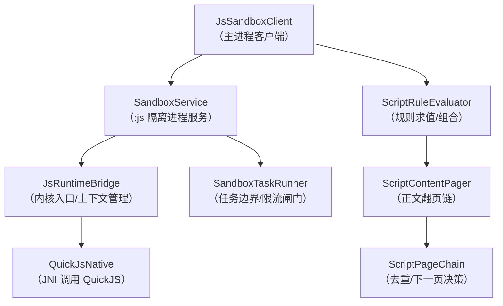
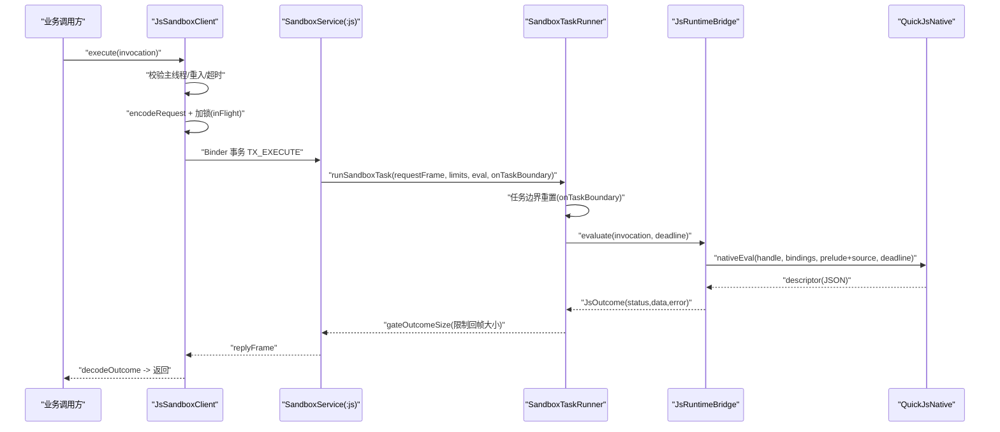
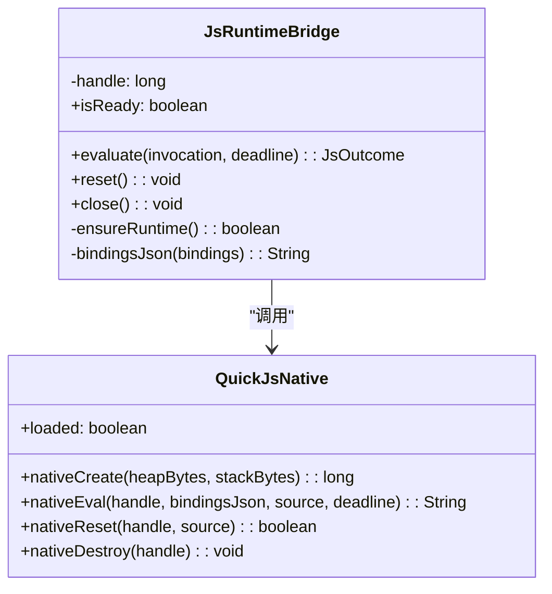
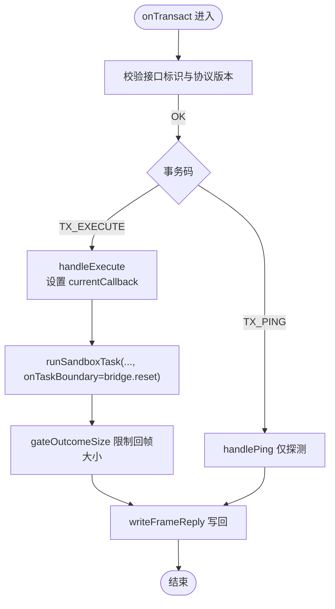
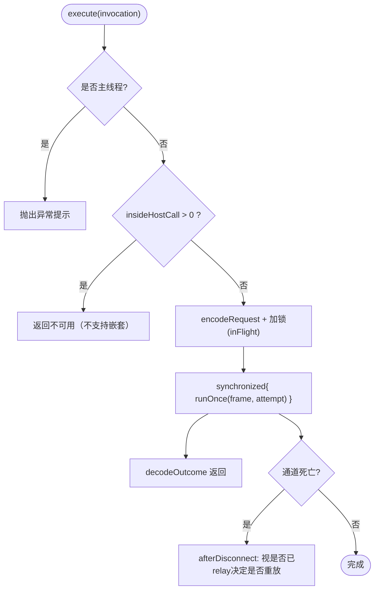
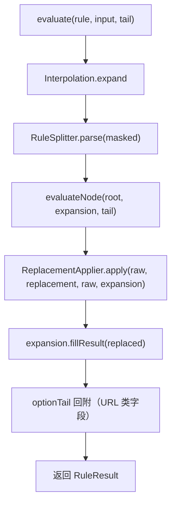
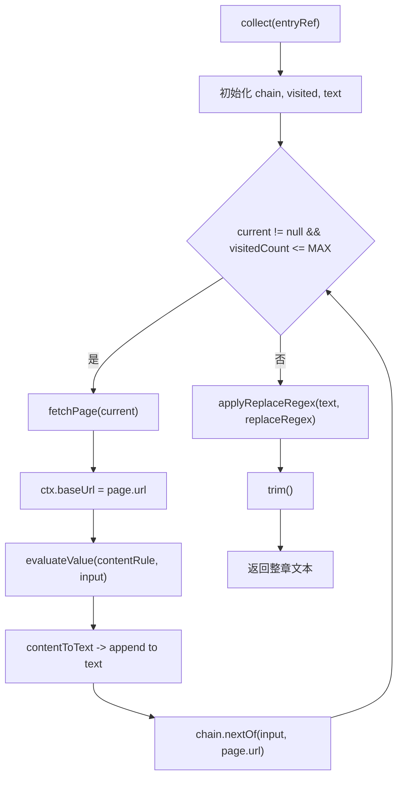
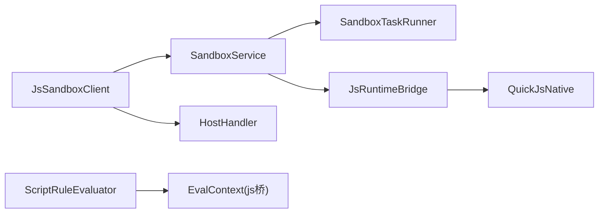

# 性能优化策略

<cite>
**本文引用的文件**
- [JsRuntimeBridge.kt](file://lib_book_source/src/main/java/com/ebook/source/sandbox/JsRuntimeBridge.kt)
- [SandboxService.kt](file://lib_book_source/src/main/java/com/ebook/source/sandbox/SandboxService.kt)
- [SandboxTaskRunner.kt](file://lib_book_source/src/main/java/com/ebook/source/sandbox/SandboxTaskRunner.kt)
- [JsSandboxClient.kt](file://lib_book_source/src/main/java/com/ebook/source/sandbox/JsSandboxClient.kt)
- [ScriptRuleEvaluator.kt](file://lib_book_source/src/main/java/com/ebook/source/script/ScriptRuleEvaluator.kt)
- [ScriptRuleSet.kt](file://lib_book_source/src/main/java/com/ebook/source/script/ScriptRuleSet.kt)
- [ScriptContentPager.kt](file://lib_book_source/src/main/java/com/ebook/source/script/ScriptContentPager.kt)
- [ScriptPageChain.kt](file://lib_book_source/src/main/java/com/ebook/source/script/ScriptPageChain.kt)
</cite>

## 目录
1. [引言](#引言)
2. [项目结构](#项目结构)
3. [核心组件](#核心组件)
4. [架构总览](#架构总览)
5. [详细组件分析](#详细组件分析)
6. [依赖关系分析](#依赖关系分析)
7. [性能考量与优化策略](#性能考量与优化策略)
8. [故障排查指南](#故障排查指南)
9. [结论](#结论)

## 引言
本文件围绕“脚本源解析 + 沙箱执行”这一高并发、强内存敏感路径，系统梳理并沉淀可落地的性能优化策略。重点覆盖：
- runtime 复用机制：JsRuntimeBridge 生命周期管理、JSContext 创建/销毁、对象缓存与内存池使用点
- 缓存策略：解析结果缓存、规则编译缓存、网络请求缓存、页面内容本地存储
- 并发优化：execute 串行化锁设计、binder 线程池利用、异步调度与资源竞争避免
- 内存优化：大对象管理、字符串处理优化、数组操作改进、GC 调优建议
- 网络优化：请求合并、连接复用、压缩传输、超时控制
- 优化案例与效果评估：基准测试、内存分析与响应时间测量方法
- 常见陷阱与最佳实践：帮助编写高效脚本与解析逻辑

## 项目结构
本项目采用多模块 Gradle 工程，脚本源解析与沙箱执行集中在 lib_book_source；应用层通过 Hilt 注入客户端并在非主线程发起执行，进程内由 SandboxService 承载 :js 子进程任务。关键文件分布如下：
- 沙箱桥接与进程服务：JsRuntimeBridge、SandboxService、SandboxTaskRunner、JsSandboxClient
- 规则解析与求值：ScriptRuleEvaluator、ScriptRuleSet、ScriptContentPager、ScriptPageChain

**图表来源**
- [JsSandboxClient.kt:1-185](file://lib_book_source/src/main/java/com/ebook/source/sandbox/JsSandboxClient.kt#L1-L185)
- [SandboxService.kt:1-210](file://lib_book_source/src/main/java/com/ebook/source/sandbox/SandboxService.kt#L1-L210)
- [JsRuntimeBridge.kt:1-113](file://lib_book_source/src/main/java/com/ebook/source/sandbox/JsRuntimeBridge.kt#L1-L113)
- [SandboxTaskRunner.kt:1-69](file://lib_book_source/src/main/java/com/ebook/source/sandbox/SandboxTaskRunner.kt#L1-L69)
- [ScriptRuleEvaluator.kt:1-367](file://lib_book_source/src/main/java/com/ebook/source/script/ScriptRuleEvaluator.kt#L1-L367)
- [ScriptContentPager.kt:1-94](file://lib_book_source/src/main/java/com/ebook/source/script/ScriptContentPager.kt#L1-L94)
- [ScriptPageChain.kt:1-57](file://lib_book_source/src/main/java/com/ebook/source/script/ScriptPageChain.kt#L1-L57)

**章节来源**
- [JsSandboxClient.kt:1-185](file://lib_book_source/src/main/java/com/ebook/source/sandbox/JsSandboxClient.kt#L1-L185)
- [SandboxService.kt:1-210](file://lib_book_source/src/main/java/com/ebook/source/sandbox/SandboxService.kt#L1-L210)

## 核心组件
- JsSandboxClient：主进程侧统一入口，负责超时计算、host 回调中继、主线程保护、断连重放与 execute 串行化。
- SandboxService：:js 进程唯一组件，薄封装 Parcel 协议分发，把 host 调用回传到主进程，集中错误处理。
- JsRuntimeBridge：内核执行入口，负责 runtime/context 创建、绑定注入、失败后 reset/close、描述符解码与状态映射。
- SandboxTaskRunner：一次事务的裁决器，决定进不进内核、何时执行任务边界、对回帧大小做闸门。
- ScriptRuleEvaluator：规则求值中枢，展开占位、切分、组合（||、&&、%%）、取值与替换段、URL 尾段回附。
- ScriptContentPager / ScriptPageChain：正文翻页链，实现 nextContentUrl 的数组/字符串双形态、回环防护与页数上限。

**章节来源**
- [JsSandboxClient.kt:1-185](file://lib_book_source/src/main/java/com/ebook/source/sandbox/JsSandboxClient.kt#L1-L185)
- [SandboxService.kt:1-210](file://lib_book_source/src/main/java/com/ebook/source/sandbox/SandboxService.kt#L1-L210)
- [JsRuntimeBridge.kt:1-113](file://lib_book_source/src/main/java/com/ebook/source/sandbox/JsRuntimeBridge.kt#L1-L113)
- [SandboxTaskRunner.kt:1-69](file://lib_book_source/src/main/java/com/ebook/source/sandbox/SandboxTaskRunner.kt#L1-L69)
- [ScriptRuleEvaluator.kt:1-367](file://lib_book_source/src/main/java/com/ebook/source/script/ScriptRuleEvaluator.kt#L1-L367)
- [ScriptContentPager.kt:1-94](file://lib_book_source/src/main/java/com/ebook/source/script/ScriptContentPager.kt#L1-L94)
- [ScriptPageChain.kt:1-57](file://lib_book_source/src/main/java/com/ebook/source/script/ScriptPageChain.kt#L1-L57)

## 架构总览
下图展示一次“脚本源解析 + 沙箱执行”的关键时序，体现主进程与 :js 进程的交互、任务边界重置、以及 host 回调的中继路径。

**图表来源**
- [JsSandboxClient.kt:65-143](file://lib_book_source/src/main/java/com/ebook/source/sandbox/JsSandboxClient.kt#L65-L143)
- [SandboxService.kt:83-98](file://lib_book_source/src/main/java/com/ebook/source/sandbox/SandboxService.kt#L83-L98)
- [SandboxTaskRunner.kt:13-49](file://lib_book_source/src/main/java/com/ebook/source/sandbox/SandboxTaskRunner.kt#L13-L49)
- [JsRuntimeBridge.kt:41-67](file://lib_book_source/src/main/java/com/ebook/source/sandbox/JsRuntimeBridge.kt#L41-L67)

## 详细组件分析

### JsRuntimeBridge：runtime 复用与生命周期
- 职责：创建/重置/销毁 JS runtime，加载预置垫片，绑定变量，执行 nativeEval，并将内核状态映射为统一 JsOutcome。
- 生命周期关键点：
  - ensureRuntime：懒初始化 handle，若失败则销毁并重试，保证下次可用。
  - evaluate：在 deadline 内执行；超时/内存/栈溢出时触发 reset，避免脏 context 污染下一条。
  - reset：必要时重建 context，代价是一次分配，摊薄到单次正文请求不构成瓶颈。
  - close：进程退出时释放 native 资源。
- 内存与对象缓存：
  - 绑定以 JSON 过边界，空值不放入对象，减少无用序列化开销。
  - 预置垫片与用户脚本同文本一次求值，减少 context 往返。

**图表来源**
- [JsRuntimeBridge.kt:21-113](file://lib_book_source/src/main/java/com/ebook/source/sandbox/JsRuntimeBridge.kt#L21-L113)

**章节来源**
- [JsRuntimeBridge.kt:21-113](file://lib_book_source/src/main/java/com/ebook/source/sandbox/JsRuntimeBridge.kt#L21-L113)

### SandboxService：binder 线程模型与任务边界
- 职责：接收执行事务、校验接口标识与协议版本、将 host 调用中继给主进程、确保异常不出进程。
- 线程模型：
  - binder 默认至多 15 条线程；并发安全由主进程 JsSandboxClient 的 inFlight 锁保证“同一时刻只有一帧在飞”。
  - 当前回调 currentCallback 用 ThreadLocal 暂存，仅在 onTransact 期间有效。
- 任务边界：
  - 每次执行前调用 onTaskBoundary（即 bridge.reset），彻底清理上次任务残留。
  - 回帧大小受限于 maxOutcomeBytes，超限直接返回 TOO_LARGE，避免 binder 缓冲与主进程内存压力。

**图表来源**
- [SandboxService.kt:50-123](file://lib_book_source/src/main/java/com/ebook/source/sandbox/SandboxService.kt#L50-L123)
- [SandboxTaskRunner.kt:13-69](file://lib_book_source/src/main/java/com/ebook/source/sandbox/SandboxTaskRunner.kt#L13-L69)

**章节来源**
- [SandboxService.kt:50-123](file://lib_book_source/src/main/java/com/ebook/source/sandbox/SandboxService.kt#L50-L123)
- [SandboxTaskRunner.kt:13-69](file://lib_book_source/src/main/java/com/ebook/source/sandbox/SandboxTaskRunner.kt#L13-L69)

### JsSandboxClient：并发控制与重放策略
- 并发与串行化：
  - inFlight 非重入锁保证 execute 串行化，避免多源并发争抢单一 runtime。
  - 排队等待的请求共享同一 deadline，等不到就报 TIMEOUT，比静默延长更诚实。
- 主线程与重入保护：
  - 禁止在主线程执行（避免 ANR）。
  - 使用 insideHostCall 深度计数防止 host 回调中再次发起沙箱调用导致双向死锁。
- 断连重放：
  - 仅当本次未转发过 host 回调时才允许重放，避免副作用重复执行。
  - 断连自动重连一次，仍失败则降级为不可用。

**图表来源**
- [JsSandboxClient.kt:65-185](file://lib_book_source/src/main/java/com/ebook/source/sandbox/JsSandboxClient.kt#L65-L185)

**章节来源**
- [JsSandboxClient.kt:65-185](file://lib_book_source/src/main/java/com/ebook/source/sandbox/JsSandboxClient.kt#L65-L185)

### ScriptRuleEvaluator：规则求值与组合优化
- 求值次序：先展开 {{}}，再切分，逐支求值，最后应用 ## 替换段并回附 URL 尾段。
- 组合语义：
  - || 短路取第一个有值分支；全部失败时抛最后一条语法错误，避免误报“无结果”。
  - && 合并各支结果，按类型扁平或保留节点/JSON 结构。
  - %% 轮次交错合并多路列表，短序列耗尽即停。
- JS 分支：
  - @js: 后位与前链/后链组合，种子为空时回落 Miss，兼容旧行为。
  - <js> 分隔符形态：前链产物作为 result，完成后交由后链继续处理。
- 性能要点：
  - 展开与切分分离，避免重复填充与重复解析。
  - 组合阶段尽量就地扁平合并，减少中间对象创建。

**图表来源**
- [ScriptRuleEvaluator.kt:20-41](file://lib_book_source/src/main/java/com/ebook/source/script/ScriptRuleEvaluator.kt#L20-L41)

**章节来源**
- [ScriptRuleEvaluator.kt:20-41](file://lib_book_source/src/main/java/com/ebook/source/script/ScriptRuleEvaluator.kt#L20-L41)

### ScriptContentPager / ScriptPageChain：正文翻页与去重
- 翻页形态：支持数组形态（固定页序）与字符串规则形态（每页求值），优先数组。
- 停止条件：空/null、回环、最大页数上限（MAX_CONTENT_PAGES = 50）。
- 去重键：剥离 URL 选项尾段后再比较，避免带不同 charset 等选项重复请求。
- 内容拼接：段落性字段按 \n 连接，replaceRegex 在拼接后整体净化。

**图表来源**
- [ScriptContentPager.kt:39-65](file://lib_book_source/src/main/java/com/ebook/source/script/ScriptContentPager.kt#L39-L65)
- [ScriptPageChain.kt:19-57](file://lib_book_source/src/main/java/com/ebook/source/script/ScriptPageChain.kt#L19-L57)

**章节来源**
- [ScriptContentPager.kt:39-65](file://lib_book_source/src/main/java/com/ebook/source/script/ScriptContentPager.kt#L39-L65)
- [ScriptPageChain.kt:19-57](file://lib_book_source/src/main/java/com/ebook/source/script/ScriptPageChain.kt#L19-L57)

## 依赖关系分析
- 组件耦合：
  - JsSandboxClient 依赖 SandboxService（通过 openChannel 抽象），屏蔽跨进程细节。
  - SandboxService 依赖 SandboxTaskRunner 与 JsRuntimeBridge，职责清晰分离。
  - ScriptRuleEvaluator 依赖 EvalContext（含 js 桥），与页面翻页链解耦。
- 外部依赖：
  - QuickJsNative（JNI 调用 vendored QuickJS），位于 C++ 层。
  - 网络层由 HostHandler 提供，受白名单与私网拒绝约束。

**图表来源**
- [JsSandboxClient.kt:1-185](file://lib_book_source/src/main/java/com/ebook/source/sandbox/JsSandboxClient.kt#L1-L185)
- [SandboxService.kt:1-210](file://lib_book_source/src/main/java/com/ebook/source/sandbox/SandboxService.kt#L1-L210)
- [JsRuntimeBridge.kt:1-113](file://lib_book_source/src/main/java/com/ebook/source/sandbox/JsRuntimeBridge.kt#L1-L113)

**章节来源**
- [JsSandboxClient.kt:1-185](file://lib_book_source/src/main/java/com/ebook/source/sandbox/JsSandboxClient.kt#L1-L185)
- [SandboxService.kt:1-210](file://lib_book_source/src/main/java/com/ebook/source/sandbox/SandboxService.kt#L1-L210)

## 性能考量与优化策略

### 运行时复用与生命周期管理
- 建议
  - 保持 JsRuntimeBridge 单例化并按需 ensureRuntime，避免频繁创建/销毁 native runtime。
  - 在超时/内存/栈溢出后强制 reset，确保下一条规则不会继承脏状态。
  - 绑定数据尽量精简，避免传递大对象；使用 JSON 值过边界减少序列化成本。
- 依据
  - 任务边界重置与 reset 策略见 [SandboxService.kt:83-98](file://lib_book_source/src/main/java/com/ebook/source/sandbox/SandboxService.kt#L83-L98)、[JsRuntimeBridge.kt:69-102](file://lib_book_source/src/main/java/com/ebook/source/sandbox/JsRuntimeBridge.kt#L69-L102)。

**章节来源**
- [SandboxService.kt:83-98](file://lib_book_source/src/main/java/com/ebook/source/sandbox/SandboxService.kt#L83-L98)
- [JsRuntimeBridge.kt:69-102](file://lib_book_source/src/main/java/com/ebook/source/sandbox/JsRuntimeBridge.kt#L69-L102)

### 缓存策略
- 规则编译缓存
  - 建议：对高频规则串进行编译结果缓存（AST/链式节点树），按 sourceUrl + ruleKey 作为 key，LRU 淘汰。
  - 结合 ScriptRuleSet 装载视图，避免重复解析 JSON 与分类能力。
  - 参考：规则装载与能力登记在 [ScriptRuleSet.kt:139-280](file://lib_book_source/src/main/java/com/ebook/source/script/ScriptRuleSet.kt#L139-L280)。
- 解析结果缓存
  - 建议：对搜索/详情/目录等读接口引入短期 TTL 缓存（如 6 小时），配合 SWR 策略降低抖动。
  - 注意：书城缓存策略应放在仓库层而非解析器，避免吞掉下拉刷新。
- 网络请求缓存
  - 建议：对相同 URL 的请求合并（debounce/throttle），启用连接复用与 gzip/deflate 压缩。
  - 超时控制：合理设置 connect/read/write timeout，避免长尾阻塞。
- 页面内容本地存储
  - 建议：对正文片段或章节内容进行本地持久化（filesDir/books），读取时先查本地，再回填缓存。
  - 去重键：统一使用 visitKeyOf 口径，避免选项尾段差异导致的重复存储。

**章节来源**
- [ScriptRuleSet.kt:139-280](file://lib_book_source/src/main/java/com/ebook/source/script/ScriptRuleSet.kt#L139-L280)
- [ScriptPageChain.kt:56-57](file://lib_book_source/src/main/java/com/ebook/source/script/ScriptPageChain.kt#L56-L57)

### 并发优化
- execute 串行化锁
  - 保持 inFlight 锁粒度最小化，仅包裹一次投递（runOnce），避免锁内做 I/O。
  - 排队请求共享 deadline，超时即放弃，避免无限等待。
- binder 线程池合理利用
  - 利用 binder 默认至多 15 条线程的优势，但必须配合主进程串行化，避免争抢 runtime。
  - host 回调在 binder 线程同步 transact，避免阻塞主线程。
- 异步任务调度
  - 将耗时解析/网络请求置于协程后台调度器，UI 更新回到主线程。
  - 使用 Flow/SharedFlow 进行状态广播，避免回调地狱。
- 资源竞争避免
  - 禁止在 host 回调中再次发起沙箱调用（insideHostCall 深度保护）。
  - 断连重放仅限无副作用的路径，避免重复请求。

**章节来源**
- [JsSandboxClient.kt:57-185](file://lib_book_source/src/main/java/com/ebook/source/sandbox/JsSandboxClient.kt#L57-L185)
- [SandboxService.kt:21-26](file://lib_book_source/src/main/java/com/ebook/source/sandbox/SandboxService.kt#L21-L26)

### 内存优化
- 大对象管理
  - 限制回帧大小（maxOutcomeBytes），超限直接丢弃原文，避免 binder 缓冲爆满。
  - 正文分页上限（MAX_CONTENT_PAGES = 50）防止无限拼接大字符串。
- 字符串处理优化
  - 使用 StringBuilder 累积文本，避免频繁创建临时字符串。
  - replaceRegex 在拼接后整体净化，减少多次正则扫描。
- 数组操作改进
  - 组合阶段就地扁平合并，避免多层嵌套列表。
  - 交错合并时使用预分配容量 ArrayList<T>(lists.sumOf { it.size })。
- GC 调优建议
  - 避免在热点路径创建大量短命对象。
  - 及时回收 Parcel、InputStream 等资源，减少 GC 压力。

**章节来源**
- [SandboxTaskRunner.kt:51-69](file://lib_book_source/src/main/java/com/ebook/source/sandbox/SandboxTaskRunner.kt#L51-L69)
- [ScriptContentPager.kt:25-28](file://lib_book_source/src/main/java/com/ebook/source/script/ScriptContentPager.kt#L25-L28)
- [ScriptRuleEvaluator.kt:177-184](file://lib_book_source/src/main/java/com/ebook/source/script/ScriptRuleEvaluator.kt#L177-L184)

### 网络优化
- 请求合并
  - 对相同 URL 的请求进行合并，减少重复网络 IO。
- 连接复用
  - 使用连接池与 keep-alive，避免频繁握手。
- 压缩传输
  - 启用 gzip/deflate，减少带宽占用。
- 超时控制
  - 合理设置 connect/read/write timeout，避免长尾阻塞。
  - 结合 deadline 与超时策略，快速失败。

**章节来源**
- [JsSandboxClient.kt:21-33](file://lib_book_source/src/main/java/com/ebook/source/sandbox/JsSandboxClient.kt#L21-L33)

### 优化案例与效果评估
- 基准测试
  - 对规则求值链路进行微基准测试，对比优化前后 CPU/内存占用。
  - 使用 JMH 对 ScriptRuleEvaluator.evaluate 进行压测。
- 内存分析
  - 使用 Android Profiler 观察堆增长与 GC 频率，定位大对象。
  - 关注 Binder 事务缓冲区峰值，避免过大回帧。
- 响应时间测量
  - 统计 execute 端到端耗时，分解为网络、解析、JS 执行等阶段。
  - 结合日志埋点，分析慢查询根因。

**章节来源**
- [ScriptRuleEvaluator.kt:20-41](file://lib_book_source/src/main/java/com/ebook/source/script/ScriptRuleEvaluator.kt#L20-L41)
- [SandboxTaskRunner.kt:51-69](file://lib_book_source/src/main/java/com/ebook/source/sandbox/SandboxTaskRunner.kt#L51-L69)

## 故障排查指南
- 常见问题
  - 主线程执行导致 ANR：检查是否在 UI 线程调用 execute。
  - 嵌套调用死锁：检查 host 回调中是否再次发起沙箱调用。
  - 回帧过大导致失败：检查规则是否返回超大内容，调整 maxOutcomeBytes。
  - 协议版本不合：检查两侧构建是否一致，确保 .so 与 Kotlin 同步。
- 定位方法
  - 查看日志中的状态码与错误信息，快速定位失败阶段。
  - 使用 dumpsys 查看 :js 进程状态（SandboxService 已兼容 DUMP_TRANSACTION）。
  - 通过单元测试复现问题，缩小范围。

**章节来源**
- [SandboxService.kt:40-54](file://lib_book_source/src/main/java/com/ebook/source/sandbox/SandboxService.kt#L40-L54)
- [JsSandboxClient.kt:65-99](file://lib_book_source/src/main/java/com/ebook/source/sandbox/JsSandboxClient.kt#L65-L99)

## 结论
本方案通过 JsRuntimeBridge 的生命周期管理、SandboxService 的任务边界控制、JsSandboxClient 的并发串行化与重放策略，构建了稳定高效的脚本源解析与沙箱执行链路。结合规则编译缓存、网络请求合并、页面内容本地存储等手段，进一步提升了性能与稳定性。开发者应遵循最佳实践，避免常见陷阱，持续优化脚本与解析逻辑，以获得更佳的用户体验。