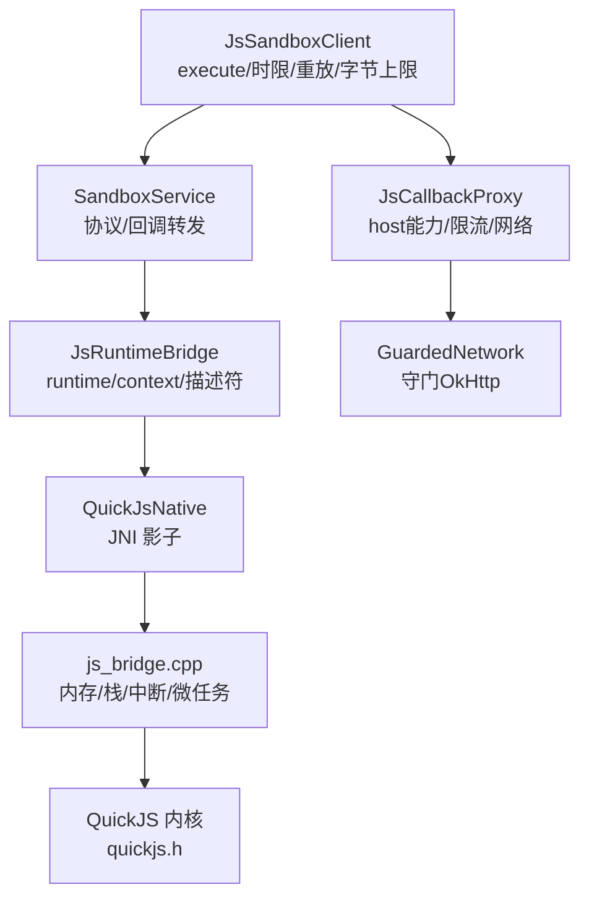
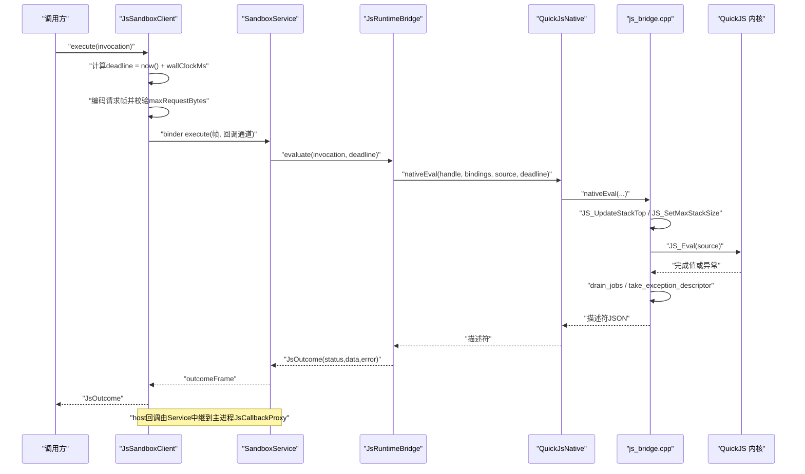
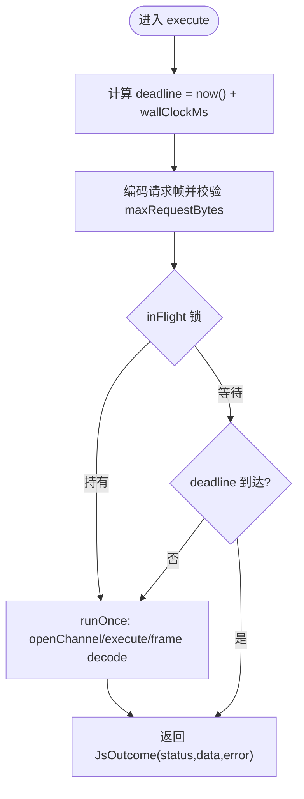
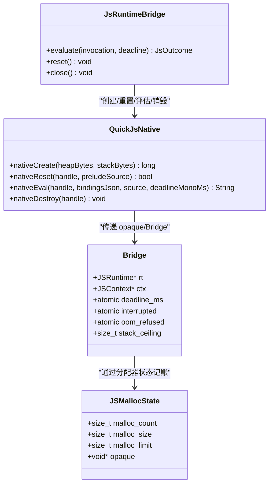
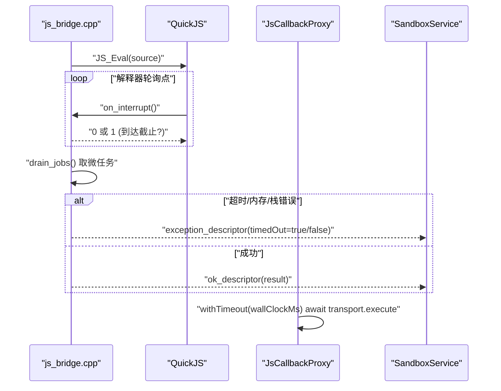
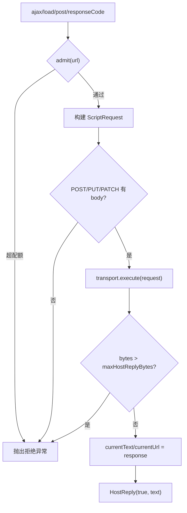
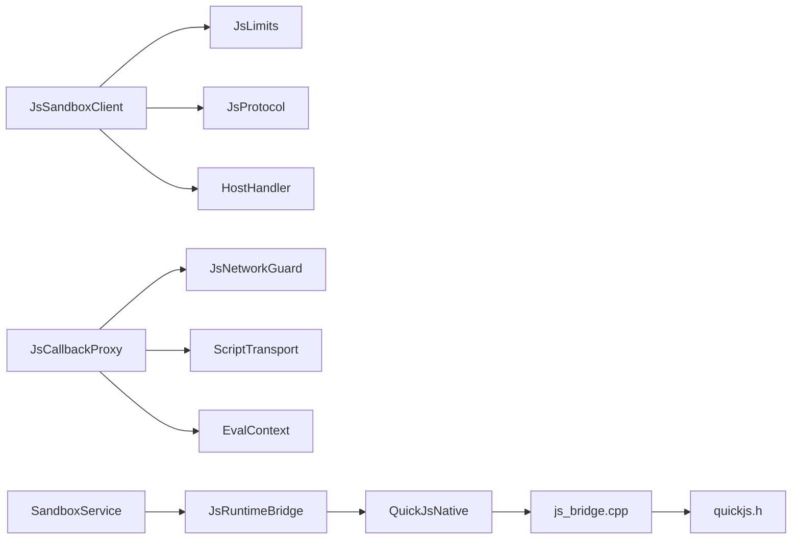

# 性能指标收集

<cite>
**本文引用的文件**   
- [JsSandboxClient.kt](file://lib_book_source/src/main/java/com/ebook/source/sandbox/JsSandboxClient.kt)
- [JsLimits.kt](file://lib_book_source/src/main/java/com/ebook/source/sandbox/JsLimits.kt)
- [JsCallbackProxy.kt](file://lib_book_source/src/main/java/com/ebook/source/sandbox/JsCallbackProxy.kt)
- [QuickJsNative.kt](file://lib_book_source/src/main/java/com/ebook/source/sandbox/QuickJsNative.kt)
- [js_bridge.cpp](file://lib_book_source/src/main/cpp/bridge/js_bridge.cpp)
- [SandboxService.kt](file://lib_book_source/src/main/java/com/ebook/source/sandbox/SandboxService.kt)
- [JsRuntimeBridge.kt](file://lib_book_source/src/main/java/com/ebook/source/sandbox/JsRuntimeBridge.kt)
- [quickjs.h](file://third_party/quickjs/quickjs.h)
</cite>

## 目录
1. [简介](#简介)
2. [项目结构](#项目结构)
3. [核心组件](#核心组件)
4. [架构总览](#架构总览)
5. [详细组件分析](#详细组件分析)
6. [依赖关系分析](#依赖关系分析)
7. [性能考量](#性能考量)
8. [故障排查指南](#故障排查指南)
9. [结论](#结论)
10. [附录：集成与基准测试建议](#附录集成与基准测试建议)

## 简介
本文聚焦于脚本沙箱执行过程中的性能指标收集与保障机制，覆盖以下方面：
- 执行时长统计与超时控制：主进程使用 SystemClock.elapsedRealtime() 计算单调截止时间，跨进程与执行器共享同一时钟口径；execute 方法负责串行化、重放保护与超时边界。
- 内存使用监控：基于 QuickJS 的自定义分配器拦截 JSMallocState，实现 JS_SetMemoryLimit 堆限制；栈限制通过 JS_UpdateStackTop + JS_SetMaxStackSize 在每次执行前按线程剩余栈动态收敛；GC 阈值接口 JS_SetGCThreshold 暴露以便后续扩展。
- CPU 占用分析与中断：通过 JS_SetInterruptHandler 挂接中断器，结合 CLOCK_BOOTTIME 毫秒级单调时钟进行轮询点打断；配合微任务队列上限与 host call 超时防止长时间占用。
- 网络请求计数与大小限制：主进程侧 JsCallbackProxy 对 ajax/load/post/responseCode 等能力统一计数、白名单校验、响应体上限与超时控制；SandboxService 对 host 回调帧再次做双向字节上限校验。
- 集成示例与告警：给出日志记录与告警触发思路（以 Logger 与类型化异常/状态返回为主）。
- 基准测试策略：单元测试模拟环境与真实设备测试策略说明。

## 项目结构
围绕脚本沙箱的性能与安全边界，代码分布在 Kotlin 客户端层、Kotlin 服务层、C++ 桥接层与 vendored QuickJS 头文件：
- Kotlin 客户端层：JsSandboxClient 负责 execute 入口、单调时钟、请求/响应字节上限与断连重放；JsLimits 集中资源限额；JsCallbackProxy 承载主进程侧 host 能力路由、限流与网络代理。
- Kotlin 服务层：SandboxService 作为 :js 隔离进程的唯一入口，转发 host 调用并保证协议版本与帧安全；JsRuntimeBridge 管理 runtime/context 生命周期与描述符解码。
- C++ 桥接层：js_bridge.cpp 实现内存分配拦截、栈预算、中断器、微任务耗尽、host_call 往返以及结果描述符分类。
- QuickJS 头文件：quickjs.h 提供内存限制、GC 阈值、栈顶更新、中断处理器等 API。

**图表来源**
- [JsSandboxClient.kt:1-185](file://lib_book_source/src/main/java/com/ebook/source/sandbox/JsSandboxClient.kt#L1-L185)
- [SandboxService.kt:1-210](file://lib_book_source/src/main/java/com/ebook/source/sandbox/SandboxService.kt#L1-L210)
- [JsRuntimeBridge.kt:1-113](file://lib_book_source/src/main/java/com/ebook/source/sandbox/JsRuntimeBridge.kt#L1-L113)
- [QuickJsNative.kt:1-59](file://lib_book_source/src/main/java/com/ebook/source/sandbox/QuickJsNative.kt#L1-L59)
- [js_bridge.cpp:1-820](file://lib_book_source/src/main/cpp/bridge/js_bridge.cpp#L1-L820)
- [quickjs.h:353-448](file://third_party/quickjs/quickjs.h#L353-L448)

**章节来源**
- [JsSandboxClient.kt:1-185](file://lib_book_source/src/main/java/com/ebook/source/sandbox/JsSandboxClient.kt#L1-L185)
- [JsLimits.kt:1-58](file://lib_book_source/src/main/java/com/ebook/source/sandbox/JsLimits.kt#L1-L58)
- [JsCallbackProxy.kt:1-507](file://lib_book_source/src/main/java/com/ebook/source/sandbox/JsCallbackProxy.kt#L1-L507)
- [QuickJsNative.kt:1-59](file://lib_book_source/src/main/java/com/ebook/source/sandbox/QuickJsNative.kt#L1-L59)
- [js_bridge.cpp:1-820](file://lib_book_source/src/main/cpp/bridge/js_bridge.cpp#L1-L820)
- [SandboxService.kt:1-210](file://lib_book_source/src/main/java/com/ebook/source/sandbox/SandboxService.kt#L1-L210)
- [JsRuntimeBridge.kt:1-113](file://lib_book_source/src/main/java/com/ebook/source/sandbox/JsRuntimeBridge.kt#L1-L113)
- [quickjs.h:353-448](file://third_party/quickjs/quickjs.h#L353-L448)

## 核心组件
- 执行入口与超时控制：JsSandboxClient.execute 使用 SystemClock.elapsedRealtime() 计算绝对截止时间，经 JsProtocol.encodeRequest 传入执行器；在 inFlight 锁内串行执行，避免并发导致 binder 事务缓冲超限。
- 资源限额：JsLimits 集中 wallClockMs、heapBytes、stackBytes、maxRequestBytes、maxHostReplyBytes、maxRequestsPerTask 等关键参数，是跨进程、跨层的单一事实源。
- 主进程 host 代理：JsCallbackProxy.handle 路由 ajax/load/post/responseCode/变量与嵌套求值，统一准入、限流、超时与响应体上限；HeadStatusProbe 提供 HEAD 探测；GuardedNetwork 派生带 DNS 守门与 cookie 罐的 OkHttp 客户端。
- 原生桥接：QuickJsNative 声明 nativeCreate/nativeReset/nativeEval/nativeDestroy；js_bridge.cpp 实现分配器拦截、栈预算、中断器、微任务耗尽、描述符分类与 deliver。
- 服务与运行时：SandboxService 处理 onTransact、协议版本检查、host 回调中继；JsRuntimeBridge 管理 runtime/context 生命周期，并在超时/内存/栈错误后 reset。

**章节来源**
- [JsSandboxClient.kt:65-99](file://lib_book_source/src/main/java/com/ebook/source/sandbox/JsSandboxClient.kt#L65-L99)
- [JsLimits.kt:13-58](file://lib_book_source/src/main/java/com/ebook/source/sandbox/JsLimits.kt#L13-L58)
- [JsCallbackProxy.kt:152-300](file://lib_book_source/src/main/java/com/ebook/source/sandbox/JsCallbackProxy.kt#L152-L300)
- [QuickJsNative.kt:17-59](file://lib_book_source/src/main/java/com/ebook/source/sandbox/QuickJsNative.kt#L17-L59)
- [js_bridge.cpp:141-212](file://lib_book_source/src/main/cpp/bridge/js_bridge.cpp#L141-L212)
- [js_bridge.cpp:259-281](file://lib_book_source/src/main/cpp/bridge/js_bridge.cpp#L259-L281)
- [js_bridge.cpp:691-820](file://lib_book_source/src/main/cpp/bridge/js_bridge.cpp#L691-L820)
- [SandboxService.kt:63-98](file://lib_book_source/src/main/java/com/ebook/source/sandbox/SandboxService.kt#L63-L98)
- [JsRuntimeBridge.kt:41-67](file://lib_book_source/src/main/java/com/ebook/source/sandbox/JsRuntimeBridge.kt#L41-L67)

## 架构总览
下图展示一次脚本执行的端到端流程，包括主进程计时、跨进程传输、执行器侧内存/栈/中断控制与 host 回调往返：

**图表来源**
- [JsSandboxClient.kt:65-99](file://lib_book_source/src/main/java/com/ebook/source/sandbox/JsSandboxClient.kt#L65-L99)
- [SandboxService.kt:83-98](file://lib_book_source/src/main/java/com/ebook/source/sandbox/SandboxService.kt#L83-L98)
- [JsRuntimeBridge.kt:41-67](file://lib_book_source/src/main/java/com/ebook/source/sandbox/JsRuntimeBridge.kt#L41-L67)
- [QuickJsNative.kt:51-56](file://lib_book_source/src/main/java/com/ebook/source/sandbox/QuickJsNative.kt#L51-L56)
- [js_bridge.cpp:764-820](file://lib_book_source/src/main/cpp/bridge/js_bridge.cpp#L764-L820)

## 详细组件分析

### 执行时长统计与超时控制
- 单调时钟：主进程使用 SystemClock.elapsedRealtime() 获取机器级单调时间（含休眠），执行器侧使用 CLOCK_BOOTTIME（Windows 用 GetTickCount64）保持同口径；deadline 为绝对毫秒值，跨进程可比较。
- 执行入口：JsSandboxClient.execute 计算 deadline，编码请求帧并限制 maxRequestBytes；在 inFlight 锁内 runOnce 投递，确保单帧并发安全。
- 执行器侧：js_bridge.cpp 的 on_interrupt 在解释器轮询点比对当前时间与 deadline，返回非零则中断；nativeEval 设置 DeadlineScope 并在结束时恢复默认死线。
- 超时分类：take_exception_descriptor 将 interrupted 或 deadline 到达归类为超时；JsRuntimeBridge 收到 TIMEOUT/MEMORY/STACK 时 reset context。

**图表来源**
- [JsSandboxClient.kt:65-99](file://lib_book_source/src/main/java/com/ebook/source/sandbox/JsSandboxClient.kt#L65-L99)
- [js_bridge.cpp:109-122](file://lib_book_source/src/main/cpp/bridge/js_bridge.cpp#L109-L122)
- [js_bridge.cpp:272-281](file://lib_book_source/src/main/cpp/bridge/js_bridge.cpp#L272-L281)
- [js_bridge.cpp:764-820](file://lib_book_source/src/main/cpp/bridge/js_bridge.cpp#L764-L820)
- [JsRuntimeBridge.kt:41-67](file://lib_book_source/src/main/java/com/ebook/source/sandbox/JsRuntimeBridge.kt#L41-L67)

**章节来源**
- [JsSandboxClient.kt:20-33](file://lib_book_source/src/main/java/com/ebook/source/sandbox/JsSandboxClient.kt#L20-L33)
- [JsSandboxClient.kt:65-99](file://lib_book_source/src/main/java/com/ebook/source/sandbox/JsSandboxClient.kt#L65-L99)
- [js_bridge.cpp:109-122](file://lib_book_source/src/main/cpp/bridge/js_bridge.cpp#L109-L122)
- [js_bridge.cpp:272-281](file://lib_book_source/src/main/cpp/bridge/js_bridge.cpp#L272-L281)
- [js_bridge.cpp:764-820](file://lib_book_source/src/main/cpp/bridge/js_bridge.cpp#L764-L820)
- [JsRuntimeBridge.kt:41-67](file://lib_book_source/src/main/java/com/ebook/source/sandbox/JsRuntimeBridge.kt#L41-L67)

### 内存使用监控与泄漏检测
- 自定义分配器：js_bridge.cpp 中 bridge_malloc/bridge_free/bridge_realloc 逐条复刻 quickjs.c 默认分配器，在每条拒绝路径上标记 oom_refused；malloc_size 记账包含 malloc_usable_size 与 MALLOC_OVERHEAD_BYTES，确保限值口径一致。
- 堆限制：nativeCreate 使用 JS_NewRuntime2 注入分配器函数表，并调用 JS_SetMemoryLimit(rt, heapBytes)；当分配被拒且异常无法描述时，take_exception_descriptor 判定为 OOM 并返回固定描述符。
- 栈限制：每次执行前 JS_UpdateStackTop 刷新栈顶，JS_SetMaxStackSize 设置为 stack_budget(stack_ceiling)，考虑线程剩余栈与头部预留，避免 SIGSEGV。
- GC 阈值：quickjs.h 暴露 JS_SetGCThreshold，当前未直接使用；可在后续扩展中以 runtime 为单位配置 GC 触发阈值，辅助内存压力缓解。
- 泄漏检测：借助 JS_ComputeMemoryUsage/JSMemoryUsage 可采集运行时对象/字符串/函数等计数与大小；当前实现未直接导出，可在调试模式注入探针采样。

**图表来源**
- [quickjs.h:353-378](file://third_party/quickjs/quickjs.h#L353-L378)
- [quickjs.h:431-448](file://third_party/quickjs/quickjs.h#L431-L448)
- [js_bridge.cpp:141-212](file://lib_book_source/src/main/cpp/bridge/js_bridge.cpp#L141-L212)
- [js_bridge.cpp:259-281](file://lib_book_source/src/main/cpp/bridge/js_bridge.cpp#L259-L281)
- [js_bridge.cpp:691-718](file://lib_book_source/src/main/cpp/bridge/js_bridge.cpp#L691-L718)
- [QuickJsNative.kt:17-59](file://lib_book_source/src/main/java/com/ebook/source/sandbox/QuickJsNative.kt#L17-L59)
- [JsRuntimeBridge.kt:41-113](file://lib_book_source/src/main/java/com/ebook/source/sandbox/JsRuntimeBridge.kt#L41-L113)

**章节来源**
- [js_bridge.cpp:141-212](file://lib_book_source/src/main/cpp/bridge/js_bridge.cpp#L141-L212)
- [js_bridge.cpp:259-281](file://lib_book_source/src/main/cpp/bridge/js_bridge.cpp#L259-L281)
- [js_bridge.cpp:691-718](file://lib_book_source/src/main/cpp/bridge/js_bridge.cpp#L691-L718)
- [quickjs.h:353-378](file://third_party/quickjs/quickjs.h#L353-L378)
- [quickjs.h:431-448](file://third_party/quickjs/quickjs.h#L431-L448)
- [JsRuntimeBridge.kt:41-113](file://lib_book_source/src/main/java/com/ebook/source/sandbox/JsRuntimeBridge.kt#L41-L113)

### CPU 占用分析与中断处理器
- 中断器：on_interrupt 在解释器轮询点比对 boot_time_ms() 与 deadline_ms，若到达则置 interrupted=1 并返回非零，使当前求值以 InternalError("interrupted") 结束。
- 微任务队列：drain_jobs 循环执行 JS_ExecutePendingJob 直至队列为空或失败；超过 MAX_PENDING_JOBS 时返回 unsupported 描述符，防止 Promise 自驱动循环占满 CPU。
- host call 超时：JsCallbackProxy.await 使用 withTimeout(limits.wallClockMs) 保护 binder 线程不被阻塞，避免整帧调度卡顿。
- 栈顶更新：nativeEval 在每次执行前调用 JS_UpdateStackTop 和 JS_SetMaxStackSize，按本线程剩余栈收敛预算，防止深递归造成 SIGSEGV。

**图表来源**
- [js_bridge.cpp:272-281](file://lib_book_source/src/main/cpp/bridge/js_bridge.cpp#L272-L281)
- [js_bridge.cpp:522-539](file://lib_book_source/src/main/cpp/bridge/js_bridge.cpp#L522-L539)
- [js_bridge.cpp:779-784](file://lib_book_source/src/main/cpp/bridge/js_bridge.cpp#L779-L784)
- [JsCallbackProxy.kt:285-299](file://lib_book_source/src/main/java/com/ebook/source/sandbox/JsCallbackProxy.kt#L285-L299)

**章节来源**
- [js_bridge.cpp:272-281](file://lib_book_source/src/main/cpp/bridge/js_bridge.cpp#L272-L281)
- [js_bridge.cpp:522-539](file://lib_book_source/src/main/cpp/bridge/js_bridge.cpp#L522-L539)
- [js_bridge.cpp:779-784](file://lib_book_source/src/main/cpp/bridge/js_bridge.cpp#L779-L784)
- [JsCallbackProxy.kt:285-299](file://lib_book_source/src/main/java/com/ebook/source/sandbox/JsCallbackProxy.kt#L285-L299)

### 网络请求计数与大小限制
- 请求计数：JsCallbackProxy.requests 累加每次外呼（admit），达到 limits.maxRequestsPerTask 即抛出拒绝异常，防止恶意脚本无限循环拉取。
- 白名单与守门：admit 先调用 guard.check(url) 进行主机名校验；GuardedNetwork 通过自定义 DNS 解析器阻断私网与黑名单地址。
- 请求体与响应体：send 中对 POST/PUT/PATCH 无 body 的情况拒绝；响应体字节数超过 maxHostReplyBytes 即拒绝并推进基准回退。
- 主进程与执行器双向校验：SandboxService.requestHost 对 host 调用帧与主进程回复帧均进行 utf8Length 校验，避免 Binder 事务缓冲超限。

**图表来源**
- [JsCallbackProxy.kt:247-277](file://lib_book_source/src/main/java/com/ebook/source/sandbox/JsCallbackProxy.kt#L247-L277)
- [JsCallbackProxy.kt:292-299](file://lib_book_source/src/main/java/com/ebook/source/sandbox/JsCallbackProxy.kt#L292-L299)
- [SandboxService.kt:165-209](file://lib_book_source/src/main/java/com/ebook/source/sandbox/SandboxService.kt#L165-L209)

**章节来源**
- [JsCallbackProxy.kt:247-277](file://lib_book_source/src/main/java/com/ebook/source/sandbox/JsCallbackProxy.kt#L247-L277)
- [JsCallbackProxy.kt:292-299](file://lib_book_source/src/main/java/com/ebook/source/sandbox/JsCallbackProxy.kt#L292-L299)
- [SandboxService.kt:165-209](file://lib_book_source/src/main/java/com/ebook/source/sandbox/SandboxService.kt#L165-L209)

### 日志记录与告警触发
- 日志出口：JsCallbackProxy.logSink 根据 channel 区分 toast/log 级别，统一走 Logger；SandboxService 与 JsSandboxClient 在断连、协议不匹配、通道异常时记录警告/错误日志。
- 告警触发：类型化异常（如 JsApiRejectedException）携带人话消息；JsOutcome.status 分类（TIMEOUT/MEMORY/STACK/UNAVAILABLE/TOKEN）便于上层聚合告警；SandboxService 对协议版本不合、host 回调失败等场景记录结构化日志。
- 集成建议：在调用方处捕获 JsOutcome，针对 TIMEOUT/MEMORY/STACK 触发告警事件；对频繁 UNAVAILABLE 或 TOO_LARGE 进行速率限制与用户提示。

**章节来源**
- [JsCallbackProxy.kt:121-125](file://lib_book_source/src/main/java/com/ebook/source/sandbox/JsCallbackProxy.kt#L121-L125)
- [JsSandboxClient.kt:84-98](file://lib_book_source/src/main/java/com/ebook/source/sandbox/JsSandboxClient.kt#L84-L98)
- [SandboxService.kt:63-98](file://lib_book_source/src/main/java/com/ebook/source/sandbox/SandboxService.kt#L63-L98)
- [SandboxService.kt:165-209](file://lib_book_source/src/main/java/com/ebook/source/sandbox/SandboxService.kt#L165-L209)

## 依赖关系分析
- 模块耦合：JsSandboxClient 依赖 JsLimits、JsProtocol、HostHandler；JsCallbackProxy 依赖 JsNetworkGuard、ScriptTransport、EvalContext；SandboxService 依赖 JsRuntimeBridge 与 HostDispatcher；JsRuntimeBridge 依赖 QuickJsNative。
- 外部依赖：OkHttp 用于网络代理；QuickJS 内核通过 JNI 接入；Android Binder 用于进程间通信。
- 潜在环路与风险：所有 host 回调必须经过 JsCallbackProxy 与 GuardedNetwork，避免绕过白名单；执行器侧不持配额计数器，仅主进程计数，降低跨进程同步复杂度。

**图表来源**
- [JsSandboxClient.kt:35-53](file://lib_book_source/src/main/java/com/ebook/source/sandbox/JsSandboxClient.kt#L35-L53)
- [JsCallbackProxy.kt:105-135](file://lib_book_source/src/main/java/com/ebook/source/sandbox/JsCallbackProxy.kt#L105-L135)
- [SandboxService.kt:27-35](file://lib_book_source/src/main/java/com/ebook/source/sandbox/SandboxService.kt#L27-L35)
- [JsRuntimeBridge.kt:21-39](file://lib_book_source/src/main/java/com/ebook/source/sandbox/JsRuntimeBridge.kt#L21-L39)
- [QuickJsNative.kt:15-59](file://lib_book_source/src/main/java/com/ebook/source/sandbox/QuickJsNative.kt#L15-L59)
- [js_bridge.cpp:691-820](file://lib_book_source/src/main/cpp/bridge/js_bridge.cpp#L691-L820)
- [quickjs.h:353-448](file://third_party/quickjs/quickjs.h#L353-L448)

**章节来源**
- [JsSandboxClient.kt:35-53](file://lib_book_source/src/main/java/com/ebook/source/sandbox/JsSandboxClient.kt#L35-L53)
- [JsCallbackProxy.kt:105-135](file://lib_book_source/src/main/java/com/ebook/source/sandbox/JsCallbackProxy.kt#L105-L135)
- [SandboxService.kt:27-35](file://lib_book_source/src/main/java/com/ebook/source/sandbox/SandboxService.kt#L27-L35)
- [JsRuntimeBridge.kt:21-39](file://lib_book_source/src/main/java/com/ebook/source/sandbox/JsRuntimeBridge.kt#L21-L39)
- [QuickJsNative.kt:15-59](file://lib_book_source/src/main/java/com/ebook/source/sandbox/QuickJsNative.kt#L15-L59)
- [js_bridge.cpp:691-820](file://lib_book_source/src/main/cpp/bridge/js_bridge.cpp#L691-L820)
- [quickjs.h:353-448](file://third_party/quickjs/quickjs.h#L353-L448)

## 性能考量
- 执行时长：wallClockMs 默认 5s，适用于正文解析；对于搜索/发现等长任务可按场景调整；注意主线程守卫避免 ANR。
- 内存与栈：heapBytes 8MB 留足正则回溯余量；stackBytes 1MB 作为天花板，实际预算受线程剩余栈限制；必要时可通过 JS_SetGCThreshold 调优 GC 频率。
- 网络：maxRequestsPerTask 40 次合理覆盖正文+图片+翻页；对 CDN 站点可适当放宽但需防滥用；响应体上限 900KB 与 Binder 缓冲匹配。
- CPU：微任务上限 10000 防止 Promise 循环；host call 超时保护 binder 线程不被长期占用；中断器在解释器轮询点生效，不影响阻塞中的原生调用。

[本节为通用指导，不直接分析具体文件]

## 故障排查指南
- 超时：观察 JsOutcome.timedOut 与 errorMessage；检查 wallClockMs 与 host call 超时是否过短；核对服务端响应延迟。
- 内存超限：关注 OOM 描述符与 oom_refused 标志；确认 heapBytes 与页面大小匹配；必要时启用 GC 阈值调优。
- 栈溢出：检查 stackBudget 与线程栈大小；对深递归规则重构；避免在窄栈线程执行复杂逻辑。
- 网络失败：查看 HostReply.error 与 statusProbe 返回值；确认白名单与 DNS 守门；核对 Content-Type 与 body。
- 协议不匹配：SandboxService 记录版本不合；重新构建对齐 Kotlin 与 .so；检查 ABI 打包。

**章节来源**
- [JsRuntimeBridge.kt:41-67](file://lib_book_source/src/main/java/com/ebook/source/sandbox/JsRuntimeBridge.kt#L41-L67)
- [js_bridge.cpp:467-520](file://lib_book_source/src/main/cpp/bridge/js_bridge.cpp#L467-L520)
- [SandboxService.kt:63-98](file://lib_book_source/src/main/java/com/ebook/source/sandbox/SandboxService.kt#L63-L98)
- [JsCallbackProxy.kt:247-277](file://lib_book_source/src/main/java/com/ebook/source/sandbox/JsCallbackProxy.kt#L247-L277)

## 结论
该实现通过主进程单调时钟与执行器侧中断器形成端到端超时控制；通过自定义分配器与栈预算实现对内存与栈的双重保护；通过主进程 host 代理与执行器双向字节校验确保网络与传输安全；结合微任务上限与 host call 超时有效抑制 CPU 占用。整体设计以类型化结果与结构化日志为核心，便于观测、定位与告警。

[本节为总结性内容，不直接分析具体文件]

## 附录：集成与基准测试建议
- 集成要点
  - 在主进程初始化时装配 HostCallbackRouter 与 JsSandboxHost，确保回调路由正确绑定。
  - 在业务调用处捕获 JsOutcome，对 TIMEOUT/MEMORY/STACK 触发告警；对 UNAVAILABLE/TOO_LARGE 提示用户并重试或降级。
  - 使用 Logger 输出关键节点日志：execute 开始/结束、host call 请求/响应、断连重放、协议版本不合等。
- 基准测试
  - 单元测试：利用 JsSandboxClient 的可插拔 openChannel 与 clock，构造假通道与伪时钟，验证超时、重放、字节上限与 host 回调拒绝路径。
  - 真实设备测试：部署完整 APK，覆盖不同 ABI 与线程栈大小场景；使用 HeadStatusProbe 探测目标站连通性；对比不同 wallClockMs/heapBytes/stackBytes 下的成功率与耗时分布。
  - 压测策略：模拟大量并发请求，观察 inFlight 锁排队与 binder 事务缓冲使用情况；统计超时率、OOM 率与栈溢出率，调整限额参数。

[本节为通用指导，不直接分析具体文件]