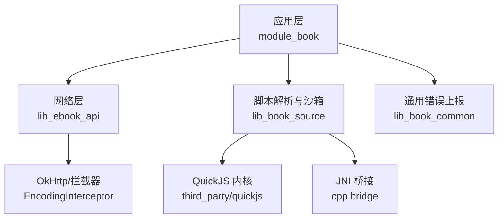
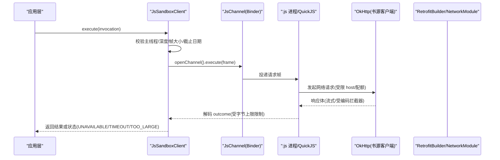
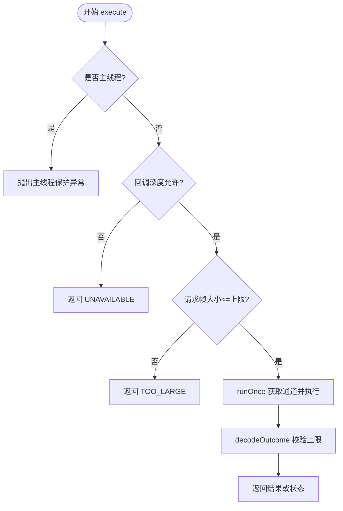
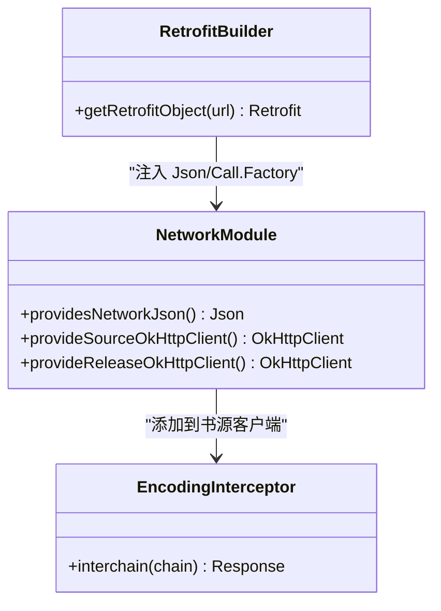
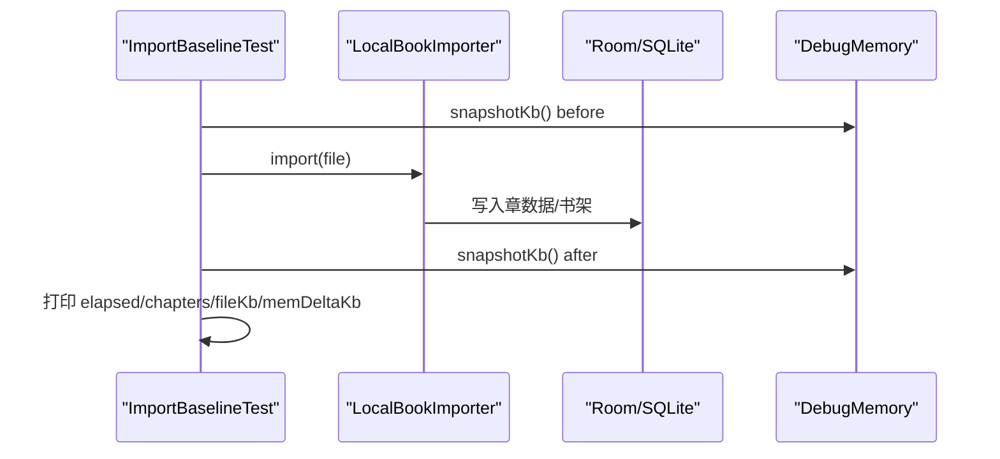
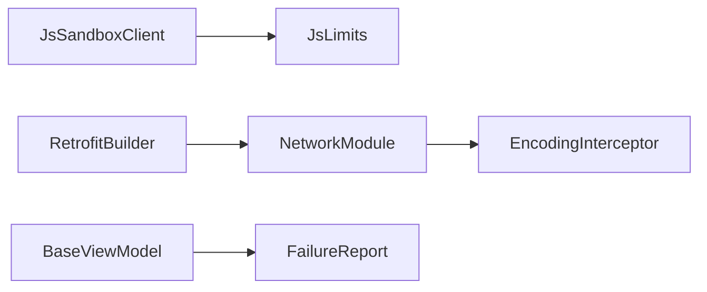

# 性能监控与调试

<cite>
**本文引用的文件列表**
- [DebugMemory.kt](file://module_book/src/androidTest/java/com/ebook/book/DebugMemory.kt)
- [ImportBaselineTest.kt](file://module_book/src/androidTest/java/com/ebook/book/ImportBaselineTest.kt)
- [JsSandboxClient.kt](file://lib_book_source/src/main/java/com/ebook/source/sandbox/JsSandboxClient.kt)
- [JsLimits.kt](file://lib_book_source/src/main/java/com/ebook/source/sandbox/JsLimits.kt)
- [RetrofitBuilder.kt](file://lib_ebook_api/src/main/java/com/ebook/api/RetrofitBuilder.kt)
- [NetworkModule.kt](file://lib_ebook_api/src/main/java/com/ebook/api/utils/NetworkModule.kt)
- [EncodingInterceptor.kt](file://lib_ebook_api/src/main/java/com/ebook/api/intercepter/EncodingInterceptor.kt)
- [FailureReport.kt](file://lib_book_common/src/main/java/com/ebook/common/util/FailureReport.kt)
</cite>

## 目录
1. [引言](#引言)
2. [项目结构](#项目结构)
3. [核心组件](#核心组件)
4. [架构总览](#架构总览)
5. [详细组件分析](#详细组件分析)
6. [依赖关系分析](#依赖关系分析)
7. [性能考量](#性能考量)
8. [故障排查指南](#故障排查指南)
9. [结论](#结论)
10. [附录](#附录)

## 引言
本文件面向“性能监控与调试”，覆盖以下目标：
- 指标采集：执行时长、内存使用（含 native heap）、CPU 占用分析思路、网络请求计数与超时统计。
- 调试工具链：日志记录策略、崩溃转储分析要点、内存泄漏检测、性能瓶颈定位方法。
- 隔离进程调试：adb 连接技巧、进程间通信调试、native 层调试要点。
- QuickJS 沙箱调试：断点调试、内存视图、执行跟踪。
- 优化策略：runtime 复用、缓存策略、并发优化。
- 监控告警：阈值设置、异常检测、自动恢复。
- 基准测试与效果评估：端到端导入基线、解析链路耗时对比。
- 常见问题诊断与解决方案。

## 项目结构
本项目为多模块 Android 工程，关键与性能/调试相关的代码分布如下：
- lib_book_source：脚本书源解析与 :js 沙箱执行器（QuickJS + JNI），包含跨进程客户端、资源限制与通道处理。
- lib_ebook_api：网络层（Retrofit + OkHttp），统一构建器、拦截器与客户端配置。
- module_book：阅读与下载等 UI 与业务逻辑，包含性能基线测试与内存快照工具。
- lib_book_common：通用错误上报与失败处理入口。

图表来源
- [JsSandboxClient.kt:1-185](file://lib_book_source/src/main/java/com/ebook/source/sandbox/JsSandboxClient.kt#L1-L185)
- [RetrofitBuilder.kt:13-45](file://lib_ebook_api/src/main/java/com/ebook/api/RetrofitBuilder.kt#L13-L45)
- [EncodingInterceptor.kt:10-51](file://lib_ebook_api/src/main/java/com/ebook/api/intercepter/EncodingInterceptor.kt#L10-L51)

章节来源
- [JsSandboxClient.kt:1-185](file://lib_book_source/src/main/java/com/ebook/source/sandbox/JsSandboxClient.kt#L1-L185)
- [RetrofitBuilder.kt:13-45](file://lib_ebook_api/src/main/java/com/ebook/api/RetrofitBuilder.kt#L13-L45)
- [EncodingInterceptor.kt:10-51](file://lib_ebook_api/src/main/java/com/ebook/api/intercepter/EncodingInterceptor.kt#L10-L51)

## 核心组件
- 沙箱客户端 JsSandboxClient：负责主进程到 :js 进程的调用编排、超时控制、重放、回调中继、主线程保护与串行化。
- 沙箱资源限制 JsLimits：集中管理 wall-clock、heap、stack、binder 报文上限、任务网络次数等。
- 网络构建 RetrofitBuilder：统一注入共享 Call.Factory、JSON 转换器与 Scalars 支持。
- 网络模块 NetworkModule：提供不同用途的 OkHttpClient（source/release）与 JSON 配置。
- 编码拦截器 EncodingInterceptor：强制响应体类型与字符集，避免第三方站点 charset 误报导致的乱码。
- 失败上报 FailureReport：统一用户可见文案出口与会话过期静默处理。
- 性能基线与内存快照：ImportBaselineTest 与 DebugMemory 提供端到端导入耗时与 native heap 增量测量。

章节来源
- [JsSandboxClient.kt:1-185](file://lib_book_source/src/main/java/com/ebook/source/sandbox/JsSandboxClient.kt#L1-L185)
- [JsLimits.kt:1-58](file://lib_book_source/src/main/java/com/ebook/source/sandbox/JsLimits.kt#L1-L58)
- [RetrofitBuilder.kt:13-45](file://lib_ebook_api/src/main/java/com/ebook/api/RetrofitBuilder.kt#L13-L45)
- [NetworkModule.kt:19-72](file://lib_ebook_api/src/main/java/com/ebook/api/utils/NetworkModule.kt#L19-L72)
- [EncodingInterceptor.kt:10-51](file://lib_ebook_api/src/main/java/com/ebook/api/intercepter/EncodingInterceptor.kt#L10-L51)
- [FailureReport.kt:1-53](file://lib_book_common/src/main/java/com/ebook/common/util/FailureReport.kt#L1-L53)
- [DebugMemory.kt:1-16](file://module_book/src/androidTest/java/com/ebook/book/DebugMemory.kt#L1-L16)
- [ImportBaselineTest.kt:20-119](file://module_book/src/androidTest/java/com/ebook/book/ImportBaselineTest.kt#L20-L119)

## 架构总览
下图展示一次脚本解析请求从发起、跨进程到 QuickJS 执行、再到结果返回的关键路径，以及网络层在解析过程中的参与方式。

图表来源
- [JsSandboxClient.kt:65-143](file://lib_book_source/src/main/java/com/ebook/source/sandbox/JsSandboxClient.kt#L65-L143)
- [JsLimits.kt:13-58](file://lib_book_source/src/main/java/com/ebook/source/sandbox/JsLimits.kt#L13-L58)
- [NetworkModule.kt:44-71](file://lib_ebook_api/src/main/java/com/ebook/api/utils/NetworkModule.kt#L44-L71)
- [EncodingInterceptor.kt:20-51](file://lib_ebook_api/src/main/java/com/ebook/api/intercepter/EncodingInterceptor.kt#L20-L51)
- [RetrofitBuilder.kt:24-45](file://lib_ebook_api/src/main/java/com/ebook/api/RetrofitBuilder.kt#L24-L45)

## 详细组件分析

### 组件一：沙箱客户端与资源限制（JsSandboxClient / JsLimits）
职责与关键点：
- 执行入口单一，禁止在主线程阻塞；通过单调时钟计算截止日期，保证跨进程可比。
- 对请求帧与 host 回复进行字节上限检查，避免 binder 事务过大导致未类型化异常。
- 以 inFlight 锁串行化执行，确保同一 runtime 的并发安全与资源上限前提成立。
- 断连后按是否已有副作用决定是否重放，避免重复请求。
- 将 host 回调异常收敛为 ok=false 的回执，防止 .so 栈异常导致 :js 进程崩溃。
- 限制项集中在 JsLimits：wall-clock 防死循环、heap/stack 防指数分配与无限递归、binder 帧上限防内存/缓冲溢出、maxRequestsPerTask 防滥用。

图表来源
- [JsSandboxClient.kt:65-143](file://lib_book_source/src/main/java/com/ebook/source/sandbox/JsSandboxClient.kt#L65-L143)
- [JsLimits.kt:13-58](file://lib_book_source/src/main/java/com/ebook/source/sandbox/JsLimits.kt#L13-L58)

章节来源
- [JsSandboxClient.kt:1-185](file://lib_book_source/src/main/java/com/ebook/source/sandbox/JsSandboxClient.kt#L1-L185)
- [JsLimits.kt:1-58](file://lib_book_source/src/main/java/com/ebook/source/sandbox/JsLimits.kt#L1-L58)

### 组件二：网络层（RetrofitBuilder / NetworkModule / EncodingInterceptor）
职责与关键点：
- RetrofitBuilder 复用注入的 Json 与共享 Call.Factory，避免自建 OkHttpClient，确保 debug 脱敏日志与认证白名单生效。
- NetworkModule 提供 source/release 两个纯净客户端，不带 token，超时配置清晰，便于独立监控与限流。
- EncodingInterceptor 强制响应体类型为 application/rss+xml;charset=<encoding>，解决第三方站点 charset 缺失或错误导致的中文乱码问题，且采用公开 API 包装避免反射风险。

图表来源
- [RetrofitBuilder.kt:13-45](file://lib_ebook_api/src/main/java/com/ebook/api/RetrofitBuilder.kt#L13-L45)
- [NetworkModule.kt:19-72](file://lib_ebook_api/src/main/java/com/ebook/api/utils/NetworkModule.kt#L19-L72)
- [EncodingInterceptor.kt:10-51](file://lib_ebook_api/src/main/java/com/ebook/api/intercepter/EncodingInterceptor.kt#L10-L51)

章节来源
- [RetrofitBuilder.kt:13-45](file://lib_ebook_api/src/main/java/com/ebook/api/RetrofitBuilder.kt#L13-L45)
- [NetworkModule.kt:19-72](file://lib_ebook_api/src/main/java/com/ebook/api/utils/NetworkModule.kt#L19-L72)
- [EncodingInterceptor.kt:10-51](file://lib_ebook_api/src/main/java/com/ebook/api/intercepter/EncodingInterceptor.kt#L10-L51)

### 组件三：失败上报与用户体验（FailureReport）
职责与关键点：
- 统一 userMessage 文案口径，会话过期走全局处置，此处仅记日志不重复提示。
- BaseViewModel.reportFailure 作为唯一上报出口，减少分支复制与维护成本。

章节来源
- [FailureReport.kt:1-53](file://lib_book_common/src/main/java/com/ebook/common/util/FailureReport.kt#L1-L53)

### 组件四：性能基线与内存快照（ImportBaselineTest / DebugMemory）
职责与关键点：
- ImportBaselineTest 以真实导入链路（Room 写库、文件写入）测量端到端耗时与 native heap 增量，输出 BASELINE 四元组（耗时、章节数、文件大小、堆增量）。
- DebugMemory 使用 Debug.getNativeHeapAllocatedSize 获取 native heap 已分配字节（KB），用于精确衡量 Room SQLite 页缓存与语句分配的内存增量。

图表来源
- [ImportBaselineTest.kt:20-119](file://module_book/src/androidTest/java/com/ebook/book/ImportBaselineTest.kt#L20-L119)
- [DebugMemory.kt:1-16](file://module_book/src/androidTest/java/com/ebook/book/DebugMemory.kt#L1-L16)

章节来源
- [ImportBaselineTest.kt:20-119](file://module_book/src/androidTest/java/com/ebook/book/ImportBaselineTest.kt#L20-L119)
- [DebugMemory.kt:1-16](file://module_book/src/androidTest/java/com/ebook/book/DebugMemory.kt#L1-L16)

## 依赖关系分析
- 沙箱客户端依赖 JsLimits 提供的统一限制；与 JsChannel 解耦以便 JVM 测试替换通道实现。
- 网络层通过 Hilt 注入共享 Json 与 Call.Factory，避免重复配置；书源客户端与发布客户端分离，降低耦合。
- 编码拦截器作为 OkHttp 链一环，影响所有书源请求的响应体解码。
- 失败上报与 ViewModel 结合，减少各模块的错误处理重复。

图表来源
- [JsSandboxClient.kt:35-143](file://lib_book_source/src/main/java/com/ebook/source/sandbox/JsSandboxClient.kt#L35-L143)
- [JsLimits.kt:13-58](file://lib_book_source/src/main/java/com/ebook/source/sandbox/JsLimits.kt#L13-L58)
- [RetrofitBuilder.kt:24-45](file://lib_ebook_api/src/main/java/com/ebook/api/RetrofitBuilder.kt#L24-L45)
- [NetworkModule.kt:19-72](file://lib_ebook_api/src/main/java/com/ebook/api/utils/NetworkModule.kt#L19-L72)
- [EncodingInterceptor.kt:20-51](file://lib_ebook_api/src/main/java/com/ebook/api/intercepter/EncodingInterceptor.kt#L20-L51)
- [FailureReport.kt:40-53](file://lib_book_common/src/main/java/com/ebook/common/util/FailureReport.kt#L40-L53)

章节来源
- [JsSandboxClient.kt:35-143](file://lib_book_source/src/main/java/com/ebook/source/sandbox/JsSandboxClient.kt#L35-L143)
- [JsLimits.kt:13-58](file://lib_book_source/src/main/java/com/ebook/source/sandbox/JsLimits.kt#L13-L58)
- [RetrofitBuilder.kt:24-45](file://lib_ebook_api/src/main/java/com/ebook/api/RetrofitBuilder.kt#L24-L45)
- [NetworkModule.kt:19-72](file://lib_ebook_api/src/main/java/com/ebook/api/utils/NetworkModule.kt#L19-L72)
- [EncodingInterceptor.kt:20-51](file://lib_ebook_api/src/main/java/com/ebook/api/intercepter/EncodingInterceptor.kt#L20-L51)
- [FailureReport.kt:40-53](file://lib_book_common/src/main/java/com/ebook/common/util/FailureReport.kt#L40-L53)

## 性能考量
- 执行时长统计
  - 端到端导入：ImportBaselineTest 使用 System.nanoTime() 包裹导入流程，输出毫秒级耗时。
  - 沙箱执行：JsSandboxClient 基于 SystemClock.elapsedRealtime() 计算截止日期，避免跨进程时间漂移导致超时失效。
- 内存使用监控
  - native heap：DebugMemory.snapshotKb() 读取 native heap 已分配字节，适配 Room 3 的 BundledSQLiteDriver 页缓存与语句分配场景。
  - 沙箱内存：JsLimits 设定 heapBytes/stackBytes，防止指数分配与无限递归导致 OOM/崩溃。
- CPU 占用分析
  - 建议配合系统工具（如 systrace/perfetto）观察主线程阻塞、渲染卡顿与解析热点；在沙箱侧关注 wall-clock 限制是否频繁触发 TIMEOUT。
- 网络请求计数与超时
  - JsLimits.maxRequestsPerTask 限制单任务请求次数，避免 while(true) 式滥用。
  - NetworkModule 中 source/release 客户端分别设置 connect/read/write 超时，便于快速失败与统计。
- 并发优化
  - JsSandboxClient 用 inFlight 串行化执行，避免多个源争抢单一 runtime 造成不稳定；队列等待由截止日期兜底，超时即报。
- 缓存策略
  - 书城库缓存（LibraryDiskCache）TTL 6 小时，进页 SWR，下拉强刷由调用方策略控制，解析器不碰缓存，避免干扰刷新语义。

章节来源
- [ImportBaselineTest.kt:70-96](file://module_book/src/androidTest/java/com/ebook/book/ImportBaselineTest.kt#L70-L96)
- [JsSandboxClient.kt:20-33](file://lib_book_source/src/main/java/com/ebook/source/sandbox/JsSandboxClient.kt#L20-L33)
- [DebugMemory.kt:5-16](file://module_book/src/androidTest/java/com/ebook/book/DebugMemory.kt#L5-L16)
- [JsLimits.kt:13-58](file://lib_book_source/src/main/java/com/ebook/source/sandbox/JsLimits.kt#L13-L58)
- [NetworkModule.kt:44-71](file://lib_ebook_api/src/main/java/com/ebook/api/utils/NetworkModule.kt#L44-L71)

## 故障排查指南
- 日志记录策略
  - 统一使用 com.xrn1997.common.util.Logger，debug/release 自动裁剪；基线测试输出使用 System.out 以避免被级别裁剪影响度量产出。
- 崩溃转储分析
  - :js 进程崩溃常由未类型化异常或 native 栈溢出引起；关注 JsSandboxClient 的重入保护与栈上限，避免 SIGSEGV。
- 内存泄漏检测
  - 关注 Room 的 native heap 增长（DebugMemory）；导入/解析链路结束后确认句柄关闭与通道释放（dropChannel）。
- 性能瓶颈定位
  - 高频 TIMEOUT：检查 wall-clock 限制与网络超时；确认是否主线程误调用导致 ANR。
  - TOO_LARGE：检查绑定整页大小是否超过 maxRequestBytes/maxOutcomeBytes；考虑分页或压缩策略。
  - 会话过期：reportFailure 会静默处理，若出现重复提示需检查全局订阅是否生效。
- 隔离进程调试
  - adb reverse 本地后端，避免 targetSdk 37 本地网络权限限制；:js 进程可通过 binder 连接日志定位断连与重放。
- 常见错误与修复
  - 乱码：确认 EncodingInterceptor 生效；第三方站点 charset 缺失时强制 UTF-8。
  - 无数据加载：检查 Mock 资产与 DTO 契约一致性；序列化异常会被 CoroutineAdapter 吞掉，需对齐类型。

章节来源
- [FailureReport.kt:27-53](file://lib_book_common/src/main/java/com/ebook/common/util/FailureReport.kt#L27-L53)
- [JsSandboxClient.kt:65-143](file://lib_book_source/src/main/java/com/ebook/source/sandbox/JsSandboxClient.kt#L65-L143)
- [EncodingInterceptor.kt:10-51](file://lib_ebook_api/src/main/java/com/ebook/api/intercepter/EncodingInterceptor.kt#L10-L51)
- [ImportBaselineTest.kt:80-96](file://module_book/src/androidTest/java/com/ebook/book/ImportBaselineTest.kt#L80-L96)

## 结论
- 沙箱执行器通过集中限制与严格边界（帧大小、墙钟、堆栈、回调深度）保障稳定性与可观测性。
- 网络层通过统一的 Retrofit 构建与细粒度客户端配置，提升可维护性与调试能力。
- 性能基线与 native heap 快照提供了可靠的端到端度量手段，有助于回归与优化评估。
- 建议在生产环境引入更丰富的指标埋点（请求耗时分布、错误分类、资源使用趋势），并结合系统工具进行持续优化。

## 附录
- 监控告警机制建议
  - 阈值设置：基于 JsLimits 与 NetworkModule 的超时常量，结合线上失败率动态调整。
  - 异常检测：对 TIMEOUT、TOO_LARGE、UNAVAILABLE 三类状态进行分类统计与告警。
  - 自动恢复：断连重放与重试策略需在“无副作用”前提下启用，避免重复请求。
- 基准测试方法
  - 使用 ImportBaselineTest 的 BASELINE 四元组对比前后版本导入性能；固定夹具内容与测量边界。
- 优化效果评估
  - 比较 memDeltaKb 与 elapsedMs 变化；结合解析成功率与超时率综合评估。