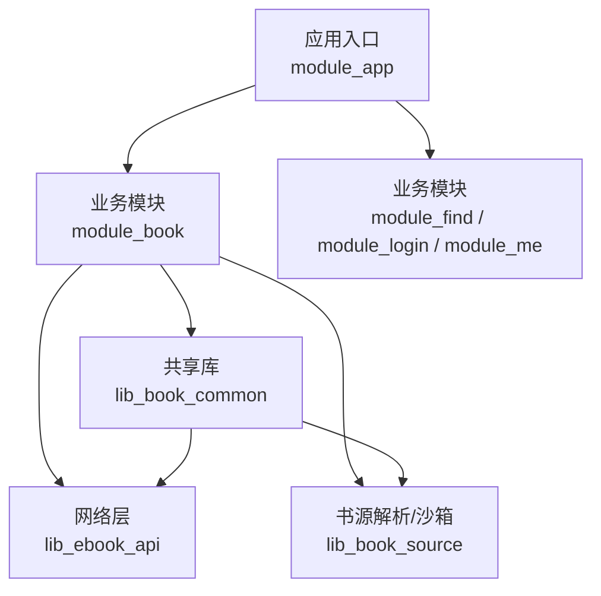
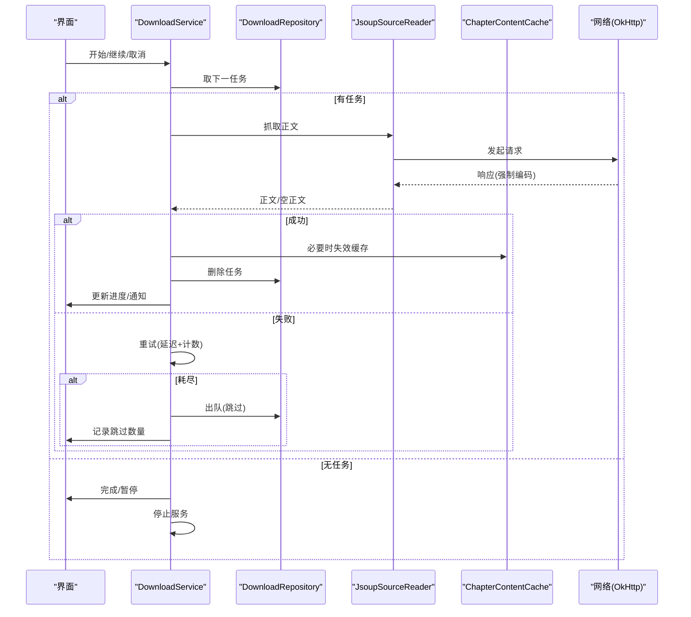
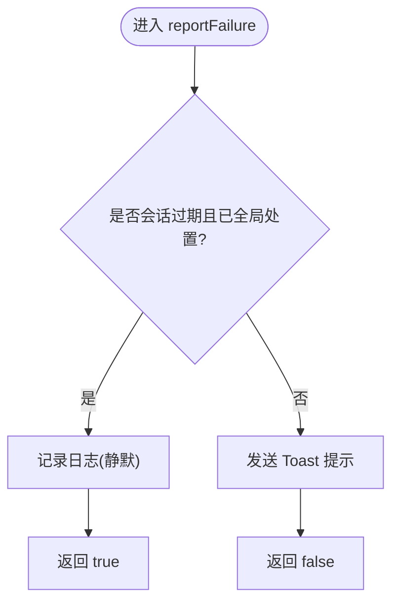
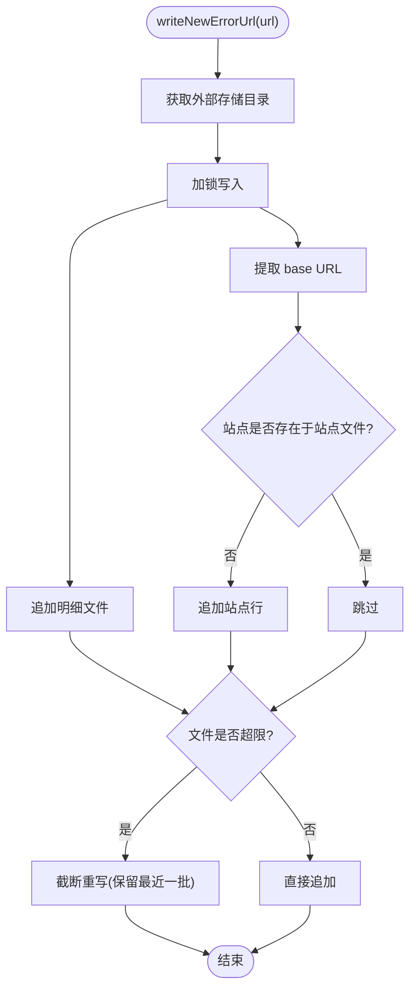
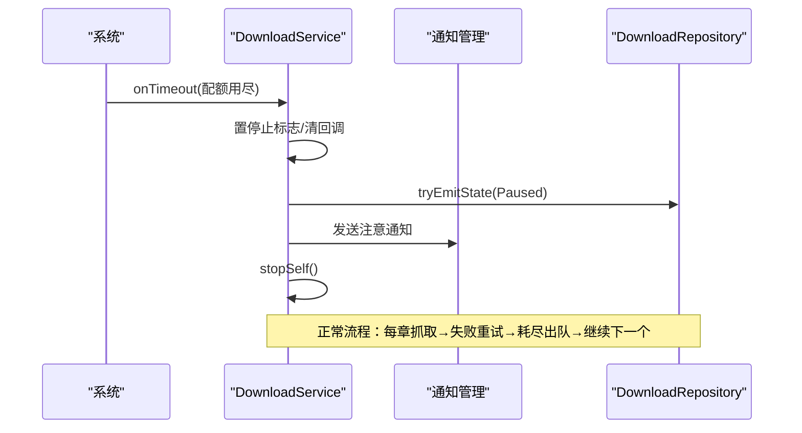
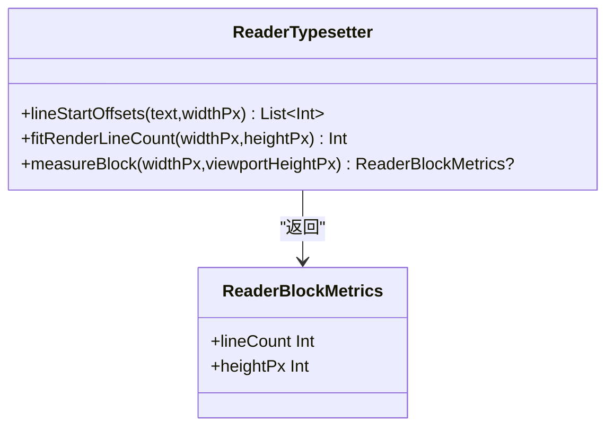
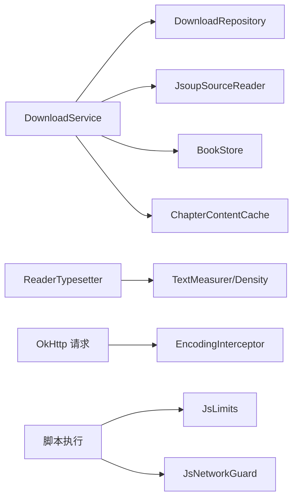

# 监控告警系统

<cite>
**本文引用的文件**
- [FailureReport.kt](file://lib_book_common/src/main/java/com/ebook/common/util/FailureReport.kt)
- [ErrorAnalyzeContentManager.kt](file://lib_book_common/src/main/java/com/ebook/common/manager/ErrorAnalyzeContentManager.kt)
- [DownloadService.kt](file://module_book/src/main/java/com/ebook/book/service/DownloadService.kt)
- [ReaderTypesetter.kt](file://module_book/src/main/java/com/ebook/book/reader/ReaderTypesetter.kt)
- [EncodingInterceptor.kt](file://lib_ebook_api/src/main/java/com/ebook/api/intercepter/EncodingInterceptor.kt)
- [JsLimits.kt](file://lib_book_source/src/main/java/com/ebook/source/sandbox/JsLimits.kt)
- [JsNetworkGuard.kt](file://lib_book_source/src/main/java/com/ebook/source/sandbox/JsNetworkGuard.kt)
- [ReaderBlockMetricsTest.kt](file://module_book/src/test/java/com/ebook/book/reader/ReaderBlockMetricsTest.kt)
</cite>

## 目录
1. [引言](#引言)
2. [项目结构](#项目结构)
3. [核心组件](#核心组件)
4. [架构总览](#架构总览)
5. [详细组件分析](#详细组件分析)
6. [依赖关系分析](#依赖关系分析)
7. [性能与阈值配置](#性能与阈值配置)
8. [异常检测与告警级别](#异常检测与告警级别)
9. [自动恢复机制](#自动恢复机制)
10. [监控数据采集](#监控数据采集)
11. [告警通知方式](#告警通知方式)
12. [监控面板与报表](#监控面板与报表)
13. [故障排查指南](#故障排查指南)
14. [结论](#结论)

## 引言
本章节面向运维与研发人员，系统化梳理本项目中“监控、告警、异常处理与自动恢复”的实现现状与实践要点。代码库内未提供独立的外部监控系统（如 Prometheus/Grafana），但已在下载服务、排版引擎、网络层、沙箱执行器与失败上报链路中内置了丰富的运行时指标采集、阈值控制、异常分类与自愈能力，可作为内部监控告警体系的基石。

## 项目结构
围绕监控告警的相关实现主要分布在以下模块：
- lib_book_common：统一的失败上报、错误URL落盘与分析辅助
- module_book：前台下载服务（任务重试、配额超时、通知）、阅读器排版与块度量
- lib_ebook_api：网络编码拦截器（统一响应解码）
- lib_book_source：脚本沙箱执行器的资源限制与网络白名单守卫

**图表来源**
- [DownloadService.kt:40-120](file://module_book/src/main/java/com/ebook/book/service/DownloadService.kt#L40-L120)
- [ReaderTypesetter.kt:18-40](file://module_book/src/main/java/com/ebook/book/reader/ReaderTypesetter.kt#L18-L40)
- [EncodingInterceptor.kt:10-34](file://lib_ebook_api/src/main/java/com/ebook/api/intercepter/EncodingInterceptor.kt#L10-L34)
- [JsLimits.kt:1-50](file://lib_book_source/src/main/java/com/ebook/source/sandbox/JsLimits.kt#L1-L50)
- [JsNetworkGuard.kt:1-50](file://lib_book_source/src/main/java/com/ebook/source/sandbox/JsNetworkGuard.kt#L1-L50)

**章节来源**
- [DownloadService.kt:40-120](file://module_book/src/main/java/com/ebook/book/service/DownloadService.kt#L40-L120)
- [ReaderTypesetter.kt:18-40](file://module_book/src/main/java/com/ebook/book/reader/ReaderTypesetter.kt#L18-L40)
- [EncodingInterceptor.kt:10-34](file://lib_ebook_api/src/main/java/com/ebook/api/intercepter/EncodingInterceptor.kt#L10-L34)
- [JsLimits.kt:1-50](file://lib_book_source/src/main/java/com/ebook/source/sandbox/JsLimits.kt#L1-L50)
- [JsNetworkGuard.kt:1-50](file://lib_book_source/src/main/java/com/ebook/source/sandbox/JsNetworkGuard.kt#L1-L50)

## 核心组件
- 失败上报与用户提示归口：统一将异常转化为用户可见文案，会话过期静默并仅记录日志，避免重复提示。
- 解析失败URL落盘：按站点去重、体积上限轮转，便于人工排查规则失配或站点改版。
- 下载服务自愈：前台服务配额超时、后台启动受限等场景的降级与续跑；章节抓取重试、失败出队、通知更新。
- 排版与渲染一致性：通过唯一排版事实源保障分页与渲染一致，附带块度量用于滚屏模式稳定布局。
- 网络解码一致性：统一强制响应编码，避免因站点声明错误导致乱码。
- 沙箱资源限制与网络守卫：对脚本执行设置内存/CPU/时间等限制，对外呼进行白名单校验。

**章节来源**
- [FailureReport.kt:17-53](file://lib_book_common/src/main/java/com/ebook/common/util/FailureReport.kt#L17-L53)
- [ErrorAnalyzeContentManager.kt:17-75](file://lib_book_common/src/main/java/com/ebook/common/manager/ErrorAnalyzeContentManager.kt#L17-L75)
- [DownloadService.kt:96-124](file://module_book/src/main/java/com/ebook/book/service/DownloadService.kt#L96-L124)
- [ReaderTypesetter.kt:18-85](file://module_book/src/main/java/com/ebook/book/reader/ReaderTypesetter.kt#L18-L85)
- [EncodingInterceptor.kt:10-34](file://lib_ebook_api/src/main/java/com/ebook/api/intercepter/EncodingInterceptor.kt#L10-L34)
- [JsLimits.kt:1-50](file://lib_book_source/src/main/java/com/ebook/source/sandbox/JsLimits.kt#L1-L50)
- [JsNetworkGuard.kt:1-50](file://lib_book_source/src/main/java/com/ebook/source/sandbox/JsNetworkGuard.kt#L1-L50)

## 架构总览
整体以“采集—判断—处置—通知”为主线：
- 采集：下载过程指标（进度、剩余任务数、失败次数）、排版度量（块高/行数）、网络响应编码、脚本执行限制。
- 判断：基于固定阈值（重试次数、间隔、文件大小上限、配额时间）与状态机（进行中/暂停/完成/失败）。
- 处置：重试、出队、失效缓存、降级停止、续跑、通知更新。
- 通知：常驻通知、完成通知、超时提醒通知，以及UI侧Toast提示。

**图表来源**
- [DownloadService.kt:274-378](file://module_book/src/main/java/com/ebook/book/service/DownloadService.kt#L274-L378)
- [EncodingInterceptor.kt:20-51](file://lib_ebook_api/src/main/java/com/ebook/api/intercepter/EncodingInterceptor.kt#L20-L51)

## 详细组件分析

### 失败上报与用户提示归口
- 目标：将异常统一转为可读文案，避免会话过期重复提示。
- 关键点：
  - 会话过期已由全局处置时，仅记录日志，不弹Toast。
  - 其他失败通过命令通道弹出提示。
  - 返回布尔值供调用方分流收尾逻辑。

**图表来源**
- [FailureReport.kt:17-53](file://lib_book_common/src/main/java/com/ebook/common/util/FailureReport.kt#L17-L53)

**章节来源**
- [FailureReport.kt:17-53](file://lib_book_common/src/main/java/com/ebook/common/util/FailureReport.kt#L17-L53)

### 解析失败URL落盘与站点去重
- 目标：持久化解析失败的URL明细与站点级统计，支持调试与复盘。
- 关键点：
  - 并发写串行化（Mutex）。
  - 单文件大小上限，超过则轮转重写。
  - 站点标识按 scheme+host 提取，避免路径差异导致的误判。

**图表来源**
- [ErrorAnalyzeContentManager.kt:53-134](file://lib_book_common/src/main/java/com/ebook/common/manager/ErrorAnalyzeContentManager.kt#L53-L134)

**章节来源**
- [ErrorAnalyzeContentManager.kt:17-134](file://lib_book_common/src/main/java/com/ebook/common/manager/ErrorAnalyzeContentManager.kt#L17-L134)

### 下载服务自愈与通知
- 目标：保证长时间下载的稳定性与可观测性，应对配额超时、后台启动受限等系统策略。
- 关键点：
  - 前台服务类型 dataSync，配额用尽时 onTimeout 快速收尾并提示。
  - 启动被拒时降级为不再自动续跑，保留任务以便用户前台重试。
  - 每章抓取失败最多重试N次，耗尽后出队并计入跳过数。
  - 通知分常驻与完成两类，关键状态同步更新，避免异步竞态。

**图表来源**
- [DownloadService.kt:96-124](file://module_book/src/main/java/com/ebook/book/service/DownloadService.kt#L96-L124)
- [DownloadService.kt:274-378](file://module_book/src/main/java/com/ebook/book/service/DownloadService.kt#L274-L378)
- [DownloadService.kt:466-600](file://module_book/src/main/java/com/ebook/book/service/DownloadService.kt#L466-L600)

**章节来源**
- [DownloadService.kt:96-124](file://module_book/src/main/java/com/ebook/book/service/DownloadService.kt#L96-L124)
- [DownloadService.kt:274-378](file://module_book/src/main/java/com/ebook/book/service/DownloadService.kt#L274-L378)
- [DownloadService.kt:466-600](file://module_book/src/main/java/com/ebook/book/service/DownloadService.kt#L466-L600)

### 排版引擎与块度量
- 目标：确保分页与渲染使用同一套测量结果，避免“页边空白/内容丢失”。
- 关键点：
  - 唯一排版事实源（ReaderTypesetter），组合期装配 TextMeasurer/Density。
  - 提供 fitRenderLineCount、measureBlock 等方法计算可视行数与块高。
  - 测试覆盖边界情况（视口放不下、整行高度精确计算）。

**图表来源**
- [ReaderTypesetter.kt:29-85](file://module_book/src/main/java/com/ebook/book/reader/ReaderTypesetter.kt#L29-L85)
- [ReaderTypesetter.kt:148-175](file://module_book/src/main/java/com/ebook/book/reader/ReaderTypesetter.kt#L148-L175)

**章节来源**
- [ReaderTypesetter.kt:18-175](file://module_book/src/main/java/com/ebook/book/reader/ReaderTypesetter.kt#L18-L175)
- [ReaderBlockMetricsTest.kt:7-37](file://module_book/src/test/java/com/ebook/book/reader/ReaderBlockMetricsTest.kt#L7-L37)

### 网络编码拦截
- 目标：统一响应体编码，防止第三方站点错误声明导致中文乱码。
- 关键点：
  - 拦截响应，强制改写 Content-Type 的 charset。
  - 流式透传，避免全量缓冲。

**章节来源**
- [EncodingInterceptor.kt:10-51](file://lib_ebook_api/src/main/java/com/ebook/api/intercepter/EncodingInterceptor.kt#L10-L51)

### 脚本沙箱限制与网络守卫
- 目标：限制脚本执行资源消耗，隔离不可信网络访问。
- 关键点：
  - JsLimits：定义CPU/内存/时间等限制参数（具体数值见该文件）。
  - JsNetworkGuard：基于白名单校验外呼域名，防止私网访问。

**章节来源**
- [JsLimits.kt:1-50](file://lib_book_source/src/main/java/com/ebook/source/sandbox/JsLimits.kt#L1-L50)
- [JsNetworkGuard.kt:1-50](file://lib_book_source/src/main/java/com/ebook/source/sandbox/JsNetworkGuard.kt#L1-L50)

## 依赖关系分析
- DownloadService 依赖 Repository（任务队列/状态）、JsoupSourceReader（正文抓取）、BookStore/ChapterContentCache（本地存储与缓存失效）。
- ReaderTypesetter 依赖 Compose TextMeasurer/Density，作为唯一排版事实源。
- Network 层通过 EncodingInterceptor 改造响应编码，影响所有书源请求。
- 沙箱执行器通过 JsLimits/JsNetworkGuard 约束脚本行为，降低风险。

**图表来源**
- [DownloadService.kt:57-66](file://module_book/src/main/java/com/ebook/book/service/DownloadService.kt#L57-L66)
- [ReaderTypesetter.kt:117-124](file://module_book/src/main/java/com/ebook/book/reader/ReaderTypesetter.kt#L117-L124)
- [EncodingInterceptor.kt:20-51](file://lib_ebook_api/src/main/java/com/ebook/api/intercepter/EncodingInterceptor.kt#L20-L51)
- [JsLimits.kt:1-50](file://lib_book_source/src/main/java/com/ebook/source/sandbox/JsLimits.kt#L1-L50)
- [JsNetworkGuard.kt:1-50](file://lib_book_source/src/main/java/com/ebook/source/sandbox/JsNetworkGuard.kt#L1-L50)

**章节来源**
- [DownloadService.kt:57-66](file://module_book/src/main/java/com/ebook/book/service/DownloadService.kt#L57-L66)
- [ReaderTypesetter.kt:117-124](file://module_book/src/main/java/com/ebook/book/reader/ReaderTypesetter.kt#L117-L124)
- [EncodingInterceptor.kt:20-51](file://lib_ebook_api/src/main/java/com/ebook/api/intercepter/EncodingInterceptor.kt#L20-L51)
- [JsLimits.kt:1-50](file://lib_book_source/src/main/java/com/ebook/source/sandbox/JsLimits.kt#L1-L50)
- [JsNetworkGuard.kt:1-50](file://lib_book_source/src/main/java/com/ebook/source/sandbox/JsNetworkGuard.kt#L1-L50)

## 性能与阈值配置
- 执行时长阈值：
  - 前台服务 dataSync 类型在任意24小时内累计运行6小时，到点触发 onTimeout 快速收尾并提示。
- 内存使用上限：
  - 下载服务避免大对象跨进程传递，改用 Intent 信号+数据库任务队列；章节内容缓存按书键失效，避免长期驻留。
  - 沙箱执行器通过 JsLimits 限制脚本内存/CPU/时间，防止失控。
- CPU占用限制：
  - 章节间间隔（默认800ms）降低瞬时CPU与网络压力；排版测量避免过度频繁重排，建议按章节粒度缓存偏移。
- 网络请求频率限制：
  - 章节间间隔与重试前等待（默认1s）规避瞬时限流；失败重试次数固定（默认3次）。
- 阈值位置参考：
  - 下载服务常量：RETRY_TIMES、RETRY_DELAY_MS、CHAPTER_INTERVAL_MS。
  - 错误文件轮转上限：MAX_FILE_BYTES（512KB）。

**章节来源**
- [DownloadService.kt:96-124](file://module_book/src/main/java/com/ebook/book/service/DownloadService.kt#L96-L124)
- [DownloadService.kt:668-718](file://module_book/src/main/java/com/ebook/book/service/DownloadService.kt#L668-L718)
- [ErrorAnalyzeContentManager.kt:39-41](file://lib_book_common/src/main/java/com/ebook/common/manager/ErrorAnalyzeContentManager.kt#L39-L41)
- [ReaderTypesetter.kt:35-41](file://module_book/src/main/java/com/ebook/book/reader/ReaderTypesetter.kt#L35-L41)
- [JsLimits.kt:1-50](file://lib_book_source/src/main/java/com/ebook/source/sandbox/JsLimits.kt#L1-L50)

## 异常检测与告警级别
- 错误模式识别：
  - 正文抓取为空或选择器失配时视为失败，进入重试与出队流程。
  - 解析失败URL落盘，按站点去重，便于集中排查。
- 异常行为分类：
  - 临时性错误（网络抖动/限流）：通过重试与退避恢复。
  - 结构性错误（站点改版/规则失配）：通过落盘文件与日志定位根因。
  - 系统策略限制（前台服务配额/后台启动受限）：降级停止并提示用户前台重试。
- 误报过滤：
  - 会话过期由全局处置，此处只记日志，避免重复提示。
  - 通知不可用时跳过通知更新，不影响下载流程。
- 告警级别确定：
  - 常规进度：常驻通知（LOW重要性）。
  - 完成/失败汇总：完成通知（DEFAULT重要性，允许横幅一次）。
  - 配额超时/启动受限：注意通知（需用户回到应用）。

**章节来源**
- [DownloadService.kt:274-378](file://module_book/src/main/java/com/ebook/book/service/DownloadService.kt#L274-L378)
- [DownloadService.kt:466-600](file://module_book/src/main/java/com/ebook/book/service/DownloadService.kt#L466-L600)
- [ErrorAnalyzeContentManager.kt:53-134](file://lib_book_common/src/main/java/com/ebook/common/manager/ErrorAnalyzeContentManager.kt#L53-L134)
- [FailureReport.kt:17-53](file://lib_book_common/src/main/java/com/ebook/common/util/FailureReport.kt#L17-L53)

## 自动恢复机制
- 服务重启策略：
  - START_STICKY：系统回收后按任务续跑；前台态不可用时不再自动续跑，避免空转。
- 连接重连逻辑：
  - 章节抓取失败重试N次，每次重试前短暂等待，避开瞬时抖动。
- 数据同步恢复：
  - 强制刷新重抓成功后失效对应书的缓存，避免旧正文继续供给。
- 故障转移方案：
  - 脚本执行失败区分“未装配执行器”和“执行失败”，分别抛出类型化异常，交由上层按语义处理。
  - 网络层通过编码拦截器兜底，避免站点编码错误导致的读取失败。

**章节来源**
- [DownloadService.kt:126-206](file://module_book/src/main/java/com/ebook/book/service/DownloadService.kt#L126-L206)
- [DownloadService.kt:274-378](file://module_book/src/main/java/com/ebook/book/service/DownloadService.kt#L274-L378)
- [EncodingInterceptor.kt:20-51](file://lib_ebook_api/src/main/java/com/ebook/api/intercepter/EncodingInterceptor.kt#L20-L51)
- [JsLimits.kt:1-50](file://lib_book_source/src/main/java/com/ebook/source/sandbox/JsLimits.kt#L1-L50)

## 监控数据采集
- 性能指标实时收集：
  - 下载进度、剩余任务数、跳过章数、重试次数、章节间隔等。
  - 排版块度量（行数、块高）用于滚屏模式稳定性评估。
- 日志聚合分析：
  - 统一使用 Logger 记录各阶段事件（警告/错误/调试）。
  - 解析失败URL明细与站点统计文件，便于离线分析。
- 用户行为追踪：
  - 下载管理页与控制按钮驱动的状态变化（开始/暂停/取消）均可通过通知与状态回传感知。
- 健康状态检查：
  - 前台服务初始化失败标记 fgUnavailable，阻止无效续跑。
  - 通知可用性与权限检查，避免阻塞主流程。

**章节来源**
- [DownloadService.kt:96-124](file://module_book/src/main/java/com/ebook/book/service/DownloadService.kt#L96-L124)
- [DownloadService.kt:466-600](file://module_book/src/main/java/com/ebook/book/service/DownloadService.kt#L466-L600)
- [ErrorAnalyzeContentManager.kt:53-134](file://lib_book_common/src/main/java/com/ebook/common/manager/ErrorAnalyzeContentManager.kt#L53-L134)
- [ReaderTypesetter.kt:59-85](file://module_book/src/main/java/com/ebook/book/reader/ReaderTypesetter.kt#L59-L85)

## 告警通知方式
- 即时通知：
  - 常驻通知（LOW重要性）：显示进行中/暂停状态，带操作按钮（继续/暂停/取消）。
  - 完成通知（DEFAULT重要性）：展示最终结果，允许横幅一次。
- 邮件提醒：
  - 当前代码库未包含邮件通知实现；可在上层接入后端服务，通过日志/文件落盘导出后由服务端发送邮件。
- 短信通知：
  - 当前代码库未包含短信通知实现；同上，可通过后端集成短信网关。
- 移动端推送：
  - 当前基于系统通知；如需远程推送，可结合后端推送服务（FCM等）与本地通知联动。

**章节来源**
- [DownloadService.kt:466-600](file://module_book/src/main/java/com/ebook/book/service/DownloadService.kt#L466-L600)

## 监控面板与报表
- 关键指标可视化：
  - 下载进度、剩余任务、跳过章数、重试次数等可通过 UI 页面呈现。
  - 排版块度量可用于评估滚屏模式的稳定性。
- 趋势分析与性能对比：
  - 通过错误URL落盘文件与日志，可统计站点失败率、改版影响范围。
  - 不同设备/系统版本的前台服务配额超时事件可对比分析。
- 报表输出：
  - 可将 ErrorAnalyzeUrls.txt 与 ErrorAnalyzeUrlsDetail.txt 导出进行离线分析。
  - 结合后端服务，可将关键指标上报至监控平台（如Prometheus/Grafana）以实现可视化看板。

**章节来源**
- [ErrorAnalyzeContentManager.kt:53-134](file://lib_book_common/src/main/java/com/ebook/common/manager/ErrorAnalyzeContentManager.kt#L53-L134)
- [DownloadService.kt:466-600](file://module_book/src/main/java/com/ebook/book/service/DownloadService.kt#L466-L600)

## 故障排查指南
- 常见问题与定位：
  - 下载一直进行但不推进：检查是否处于“仅剩暂停书任务”的分支，此时会暂停并停服。
  - 前台服务配额用尽：查看 onTimeout 日志，确认是否快速收尾并提示。
  - 正文内容为空：确认是否命中“空正文判失败”分支，进入重试与出队。
  - 站点解析失败：查看 ErrorAnalyzeUrls*.txt 中的站点去重记录与明细。
- 处理步骤：
  - 重新发起下载或切换到前台重试。
  - 调整书源规则或等待站点修复。
  - 检查通知权限与系统限制，确保前台服务可正常运行。

**章节来源**
- [DownloadService.kt:222-243](file://module_book/src/main/java/com/ebook/book/service/DownloadService.kt#L222-L243)
- [DownloadService.kt:96-124](file://module_book/src/main/java/com/ebook/book/service/DownloadService.kt#L96-L124)
- [DownloadService.kt:274-378](file://module_book/src/main/java/com/ebook/book/service/DownloadService.kt#L274-L378)
- [ErrorAnalyzeContentManager.kt:53-134](file://lib_book_common/src/main/java/com/ebook/common/manager/ErrorAnalyzeContentManager.kt#L53-L134)

## 结论
本项目在“监控告警”方面已形成较为完善的内部体系：通过下载服务的自愈与通知、排版引擎的一致性度量、网络层的编码兜底、沙箱的资源限制与网络守卫、以及统一的失败上报与错误落盘，实现了从采集、判断、处置到通知的闭环。未来可在此基础上接入外部监控平台，构建更强大的可视化看板与自动化告警能力。