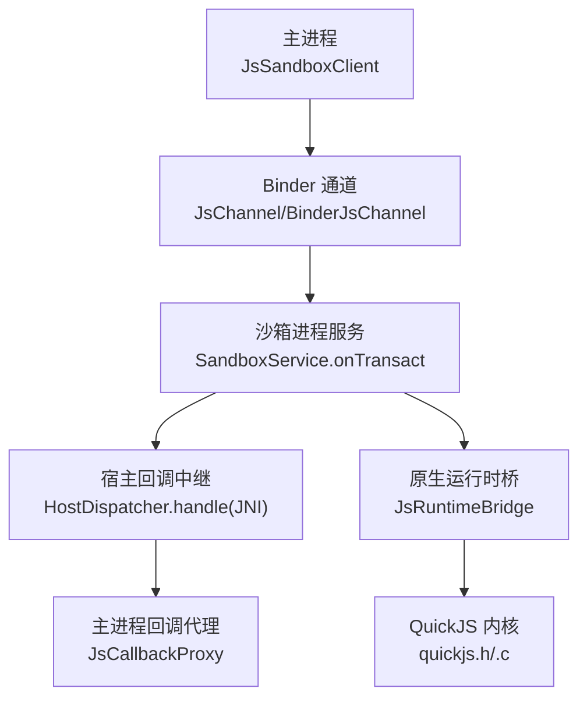
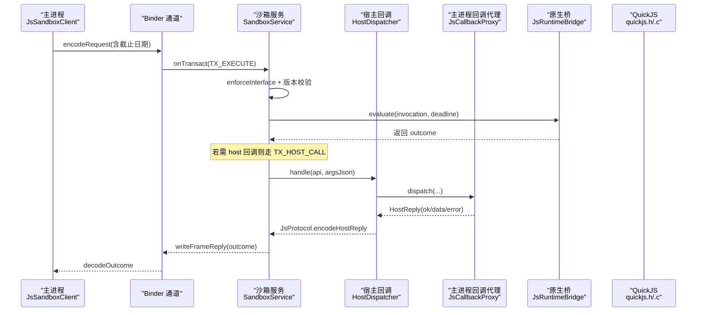
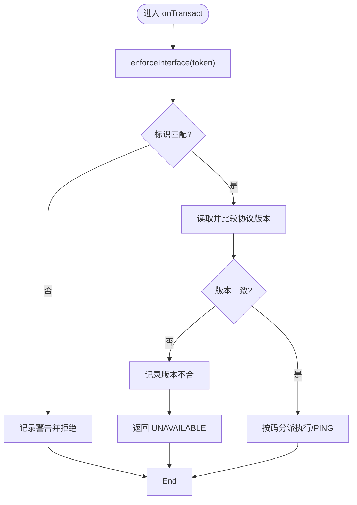
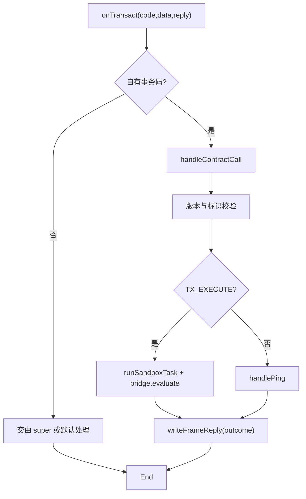
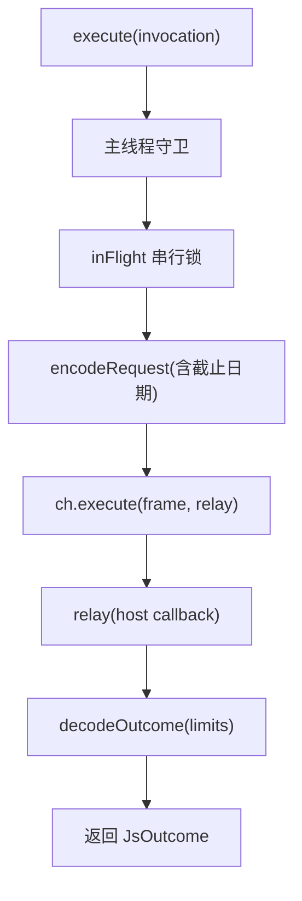
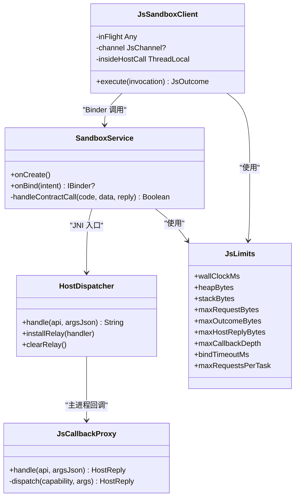

# 调试工具链

<cite>
**本文引用的文件**
- [SandboxService.kt](file://lib_book_source/src/main/java/com/ebook/source/sandbox/SandboxService.kt)
- [JsSandboxClient.kt](file://lib_book_source/src/main/java/com/ebook/source/sandbox/JsSandboxClient.kt)
- [HostDispatcher.kt](file://lib_book_source/src/main/java/com/ebook/source/sandbox/HostDispatcher.kt)
- [JsCallbackProxy.kt](file://lib_book_source/src/main/java/com/ebook/source/sandbox/JsCallbackProxy.kt)
- [JsLimits.kt](file://lib_book_source/src/main/java/com/ebook/source/sandbox/JsLimits.kt)
- [SandboxProcess.kt](file://lib_book_source/src/main/java/com/ebook/source/sandbox/SandboxProcess.kt)
- [js_bridge.cpp](file://lib_book_source/src/main/cpp/bridge/js_bridge.cpp)
- [CMakeLists.txt](file://lib_book_source/src/main/cpp/CMakeLists.txt)
- [quickjs.h](file://third_party/quickjs/quickjs.h)
- [quickjs.c](file://third_party/quickjs/quickjs.c)
- [AGENTS.md](file://AGENTS.md)
- [README.MD](file://README.MD)
</cite>

## 目录
1. [简介](#简介)
2. [项目结构（与调试相关）](#项目结构与调试相关)
3. [核心组件](#核心组件)
4. [架构总览](#架构总览)
5. [详细组件分析](#详细组件分析)
6. [依赖关系分析](#依赖关系分析)
7. [性能考虑](#性能考虑)
8. [故障排查指南](#故障排查指南)
9. [结论](#结论)
10. [附录：adb 调试技巧](#附录adb-调试技巧)

## 简介
本文件聚焦“调试工具链”，围绕日志记录策略、崩溃转储分析、内存泄漏检测、性能瓶颈定位以及 adb 连接技巧，给出基于代码的实操指南。项目采用 MVVM + 多模块架构，书源解析通过零权限隔离进程（:js 沙箱）执行脚本，主进程与沙箱之间通过 Binder 协议通信，原生层由 QuickJS 内核与 JNI 桥组成。调试的关键在于理解：
- 日志统一入口与跨进程日志链路
- Binder 事务异常与 onTransact 的异常处理边界
- 原生层崩溃的隔离保护与主进程容错
- JSValue 引用计数与内存使用观测
- execute 串行化锁、host 回调耗时、binder 通信延迟、线程池使用
- 隔离进程的 adb 调试方法与工具链

## 项目结构（与调试相关）
与调试强相关的代码集中在 lib_book_source 的沙箱与桥接层，以及 third_party/quickjs 与 C++ 桥：
- 主进程侧：JsSandboxClient、HostDispatcher、JsCallbackProxy、JsLimits、SandboxProcess
- 沙箱进程侧：SandboxService（onTransact 入口）、HostDispatcher（JNI 静态入口）
- 原生层：js_bridge.cpp 调用 QuickJS 内核（quickjs.h/.c）
- 构建：CMakeLists.txt 管理 native 编译

**图示来源**
- [SandboxService.kt:50-81](file://lib_book_source/src/main/java/com/ebook/source/sandbox/SandboxService.kt#L50-L81)
- [HostDispatcher.kt:47-73](file://lib_book_source/src/main/java/com/ebook/source/sandbox/HostDispatcher.kt#L47-L73)
- [JsCallbackProxy.kt:152-239](file://lib_book_source/src/main/java/com/ebook/source/sandbox/JsCallbackProxy.kt#L152-L239)
- [JsSandboxClient.kt:65-99](file://lib_book_source/src/main/java/com/ebook/source/sandbox/JsSandboxClient.kt#L65-L99)

**章节来源**
- [README.MD:86-119](file://README.MD#L86-L119)
- [AGENTS.md:全书（多处）](file://AGENTS.md)

## 核心组件
- 日志统一：全仓统一通过 com.xrn1997.common.util.Logger，禁止直接 android.util.Log。日志在 debug/release 自动裁剪，便于生产环境降噪。
- 沙箱进程：SandboxService 是 :js 隔离进程中唯一对外暴露的 Service，负责协议校验、版本检查、任务分发与 host 回调中继。
- 主进程客户端：JsSandboxClient 提供 execute 单一入口，承担超时截止、重放策略、host 回调中继与并发控制。
- 宿主回调：HostDispatcher 在沙箱进程内将脚本能力路由到计算类或主进程回调；JsCallbackProxy 在主进程实现网络、变量、页面上下文等能力。
- 限制与预算：JsLimits 集中管理 wall-clock、堆、栈、报文大小、请求次数上限等，避免跨进程与解析 JSON 带来的资源风险。
- 进程门：SandboxProcess.isInIsolatedProcess 确保仅在隔离进程中提供 Binder 通道，防止不安全的降级运行。

**章节来源**
- [SandboxService.kt:11-26, 50-81, 125-153](file://lib_book_source/src/main/java/com/ebook/source/sandbox/SandboxService.kt#L11-L26)
- [JsSandboxClient.kt:8-34, 65-99](file://lib_book_source/src/main/java/com/ebook/source/sandbox/JsSandboxClient.kt#L8-L34)
- [HostDispatcher.kt:8-23, 47-73](file://lib_book_source/src/main/java/com/ebook/source/sandbox/HostDispatcher.kt#L8-L23)
- [JsCallbackProxy.kt:78-104, 152-239](file://lib_book_source/src/main/java/com/ebook/source/sandbox/JsCallbackProxy.kt#L78-L104)
- [JsLimits.kt:3-58](file://lib_book_source/src/main/java/com/ebook/source/sandbox/JsLimits.kt#L3-L58)
- [SandboxProcess.kt:6-28](file://lib_book_source/src/main/java/com/ebook/source/sandbox/SandboxProcess.kt#L6-L28)

## 架构总览
下图展示一次 execute 从主进程到沙箱、再到原生内核与 host 回调的完整时序，突出关键调试点（协议版本、超时、限流、重试）。

**图示来源**
- [JsSandboxClient.kt:65-99](file://lib_book_source/src/main/java/com/ebook/source/sandbox/JsSandboxClient.kt#L65-L99)
- [SandboxService.kt:63-98](file://lib_book_source/src/main/java/com/ebook/source/sandbox/SandboxService.kt#L63-L98)
- [HostDispatcher.kt:47-73](file://lib_book_source/src/main/java/com/ebook/source/sandbox/HostDispatcher.kt#L47-L73)
- [JsCallbackProxy.kt:152-239](file://lib_book_source/src/main/java/com/ebook/source/sandbox/JsCallbackProxy.kt#L152-L239)

## 详细组件分析

### 日志记录策略
- 统一 Logger：全仓统一通过 com.xrn1997.common.util.Logger，debug/release 自动裁剪，避免生产噪音。
- 跨进程日志：主进程与沙箱各自记日志；沙箱侧对异常一律就地兜住，避免异常穿透至 JNI 带走整个 :js 进程。
- 协议版本不合日志：SandboxService 在 onTransact 入口处先校验接口标识与协议版本，不匹配时写回 UNAVAILABLE 并记录警告日志，便于快速定位两侧不同步问题。
- 异常堆栈跟踪：JsSandboxClient 对未预期异常记录 ERROR 并降级为不可用；HostDispatcher 与 JsCallbackProxy 对拒绝与失败返回明确错误信息，避免模糊提示。

**图示来源**
- [SandboxService.kt:63-81](file://lib_book_source/src/main/java/com/ebook/source/sandbox/SandboxService.kt#L63-L81)

**章节来源**
- [AGENTS.md:全书（日志约定）](file://AGENTS.md)
- [SandboxService.kt:63-81](file://lib_book_source/src/main/java/com/ebook/source/sandbox/SandboxService.kt#L63-L81)
- [JsSandboxClient.kt:84-99](file://lib_book_source/src/main/java/com/ebook/source/sandbox/JsSandboxClient.kt#L84-L99)
- [HostDispatcher.kt:52-73](file://lib_book_source/src/main/java/com/ebook/source/sandbox/HostDispatcher.kt#L52-L73)
- [JsCallbackProxy.kt:152-177](file://lib_book_source/src/main/java/com/ebook/source/sandbox/JsCallbackProxy.kt#L152-L177)

### 崩溃转储分析
- Binder 事务异常捕获：SandboxService 的 onTransact 仅处理自有事务码，其他码（如 PING、DUMP、INTERFACE）显式放行或默认处理，避免吞掉系统能力；对协议不符与版本不合直接返回，不抛异常出去。
- onTransact 异常处理：所有异常被包裹为帧结果或友好错误，避免 JNI 栈异常导致 :js 进程崩溃。
- 原生层崩溃隔离：HostDispatcher.handle 是 JNI 入口，异常就地兜住；异常不会冒到 .so 调用栈，从而保护 :js 进程稳定性。
- 主进程容错：JsSandboxClient.execute 对通道死掉与协议异常进行重连重放与降级；对未类型化异常统一转换为可诊断的不可用状态。

**图示来源**
- [SandboxService.kt:50-123](file://lib_book_source/src/main/java/com/ebook/source/sandbox/SandboxService.kt#L50-L123)
- [HostDispatcher.kt:47-73](file://lib_book_source/src/main/java/com/ebook/source/sandbox/HostDispatcher.kt#L47-L73)
- [JsSandboxClient.kt:84-99](file://lib_book_source/src/main/java/com/ebook/source/sandbox/JsSandboxClient.kt#L84-L99)

**章节来源**
- [SandboxService.kt:50-123](file://lib_book_source/src/main/java/com/ebook/source/sandbox/SandboxService.kt#L50-L123)
- [HostDispatcher.kt:47-73](file://lib_book_source/src/main/java/com/ebook/source/sandbox/HostDispatcher.kt#L47-L73)
- [JsSandboxClient.kt:84-99](file://lib_book_source/src/main/java/com/ebook/source/sandbox/JsSandboxClient.kt#L84-L99)

### 内存泄漏检测方法
- JSValue 引用计数：QuickJS 通过引用计数管理对象生命周期；桥接层与上层需遵循正确的释放路径，避免悬垂引用。
- JS_FreeValue 的正确使用：在桥接层或上层持有临时值时必须保证成对释放，避免内存增长。
- 对象生命周期监控：通过 JsLimits 中的堆/栈/报文上限约束请求体与响应体规模，减少大对象驻留；嵌套求值深度限制避免深层递归导致的栈溢出。
- 内存使用情况报告：可通过 quickjs 提供的统计接口（如 compute memory usage）结合上层日志上报，形成内存趋势报告；在调试中配合 adb 与 native 工具观察内存峰值。

说明：本节为通用方法论指导，具体实现细节以 quickjs.h/.c 与桥接代码为准。

**章节来源**
- [quickjs.h](file://third_party/quickjs/quickjs.h)
- [quickjs.c](file://third_party/quickjs/quickjs.c)
- [JsLimits.kt:13-58](file://lib_book_source/src/main/java/com/ebook/source/sandbox/JsLimits.kt#L13-L58)

### 性能瓶颈定位方法
- execute 串行化锁：JsSandboxClient 使用 inFlight 锁串行化 execute，避免多源并发抢占同一个 runtime；排队请求携带同一截止时间，超时即报 TIMEOUT，避免隐性阻塞。
- host 回调性能监控：JsCallbackProxy 对每个能力调用进行准入与限流，超时报错并记录；对网络请求设置超时与配额，避免单条规则拖垮整体。
- binder 通信延迟测量：SandboxService 与 JsSandboxClient 在关键路径上记录耗时（如执行起止、回调往返），配合日志与系统工具（systrace/perfetto）定位瓶颈。
- 线程池使用分析：Binder 自带线程池（默认至多 15 条），注意不要在主线程调沙箱；JsSandboxClient 有主线程守卫，违反将立即失败，避免 ANR。

**图示来源**
- [JsSandboxClient.kt:65-99](file://lib_book_source/src/main/java/com/ebook/source/sandbox/JsSandboxClient.kt#L65-L99)
- [JsCallbackProxy.kt:152-239](file://lib_book_source/src/main/java/com/ebook/source/sandbox/JsCallbackProxy.kt#L152-L239)
- [JsLimits.kt:13-58](file://lib_book_source/src/main/java/com/ebook/source/sandbox/JsLimits.kt#L13-L58)

**章节来源**
- [JsSandboxClient.kt:65-99](file://lib_book_source/src/main/java/com/ebook/source/sandbox/JsSandboxClient.kt#L65-L99)
- [JsCallbackProxy.kt:152-239](file://lib_book_source/src/main/java/com/ebook/source/sandbox/JsCallbackProxy.kt#L152-L239)
- [JsLimits.kt:13-58](file://lib_book_source/src/main/java/com/ebook/source/sandbox/JsLimits.kt#L13-L58)

## 依赖关系分析
- 主进程与沙箱通过 Binder 通信，协议由 SandboxContract 定义（token、版本、事务码）。
- HostDispatcher 在沙箱进程内通过 JNI 静态方法 handle 接收脚本能力调用，再路由到计算或主进程回调。
- JsCallbackProxy 在主进程实现 host 回调的具体逻辑（网络、变量、页面上下文等），并通过 GuardedNetwork 与 SourceCookieJar 保障安全与会话一致性。
- JsLimits 作为统一配置点，影响两端行为（请求/响应大小、超时、回调深度、请求次数）。

**图示来源**
- [JsSandboxClient.kt:35-99](file://lib_book_source/src/main/java/com/ebook/source/sandbox/JsSandboxClient.kt#L35-L99)
- [SandboxService.kt:27-153](file://lib_book_source/src/main/java/com/ebook/source/sandbox/SandboxService.kt#L27-L153)
- [HostDispatcher.kt:24-73](file://lib_book_source/src/main/java/com/ebook/source/sandbox/HostDispatcher.kt#L24-L73)
- [JsCallbackProxy.kt:105-239](file://lib_book_source/src/main/java/com/ebook/source/sandbox/JsCallbackProxy.kt#L105-L239)
- [JsLimits.kt:13-58](file://lib_book_source/src/main/java/com/ebook/source/sandbox/JsLimits.kt#L13-L58)

**章节来源**
- [JsSandboxClient.kt:35-99](file://lib_book_source/src/main/java/com/ebook/source/sandbox/JsSandboxClient.kt#L35-L99)
- [SandboxService.kt:27-153](file://lib_book_source/src/main/java/com/ebook/source/sandbox/SandboxService.kt#L27-L153)
- [HostDispatcher.kt:24-73](file://lib_book_source/src/main/java/com/ebook/source/sandbox/HostDispatcher.kt#L24-L73)
- [JsCallbackProxy.kt:105-239](file://lib_book_source/src/main/java/com/ebook/source/sandbox/JsCallbackProxy.kt#L105-L239)
- [JsLimits.kt:13-58](file://lib_book_source/src/main/java/com/ebook/source/sandbox/JsLimits.kt#L13-L58)

## 性能考虑
- 避免主线程调用沙箱：JsSandboxClient 有主线程守卫，违反会立即失败，避免 ANR。
- 合理设置超时与配额：JsLimits 的 wallClockMs、maxRequestBytes、maxHostReplyBytes、maxRequestsPerTask 需根据实际源行为调优。
- 减少跨进程数据量：正文一页文本通常远小于 900 KB，但整页 HTML 可能接近上限，应优先在规则层面裁剪内容。
- 利用串行化锁：inFlight 锁保证同一时刻只有一帧在飞，避免互抢导致的不稳定；排队请求带相同截止时间，超时即报，避免隐性阻塞。
- 线程模型：Binder 线程池有限，回调中不要发起新的 execute，避免双向死锁。

[本节提供一般性指导，无需特定文件来源]

## 故障排查指南
- 协议版本不合：查看 SandboxService 的版本校验与日志输出；确认两侧构建产物同步。
- 断连与重放：JsSandboxClient 在断连后尝试重连并重放一次；若已转发过 host 回调则不再重放，避免重复请求。
- 原生崩溃：HostDispatcher 异常就地兜住，检查日志与上层错误信息；必要时结合 adb 抓取 :js 进程日志与崩溃 dump。
- 内存问题：检查 JsLimits 配置与日志中的大小超限提示；结合 native 工具观察内存峰值与泄漏迹象。
- 性能问题：关注 execute 耗时、host 回调耗时、binder 往返时间；使用 systrace/perfetto 分析线程占用与阻塞点。

**章节来源**
- [SandboxService.kt:63-81](file://lib_book_source/src/main/java/com/ebook/source/sandbox/SandboxService.kt#L63-L81)
- [JsSandboxClient.kt:116-135](file://lib_book_source/src/main/java/com/ebook/source/sandbox/JsSandboxClient.kt#L116-L135)
- [HostDispatcher.kt:52-73](file://lib_book_source/src/main/java/com/ebook/source/sandbox/HostDispatcher.kt#L52-L73)
- [JsLimits.kt:13-58](file://lib_book_source/src/main/java/com/ebook/source/sandbox/JsLimits.kt#L13-L58)

## 结论
本项目通过严格的日志统一、协议版本校验、异常就地兜住与资源限制，构建了健壮的脚本沙箱执行体系。调试时应重点关注：
- 日志与错误信息的可读性与准确性
- Binder 事务与 onTransact 的异常边界
- 原生层崩溃的隔离保护
- JSValue 生命周期与内存使用
- 执行串行化、回调耗时与线程模型
- adb 调试与工具链的结合使用

[本节总结，无需特定文件来源]

## 附录：adb 调试技巧
- 隔离进程调试：通过包名或进程名筛选日志（如 :js 进程），抓取 logcat 并过滤关键标签（SandboxService、HostDispatcher、JsSandboxClient）。
- 进程间通信调试：观察 binder 事务日志与超时错误；使用 systrace/perfetto 分析 binder 调用链与线程占用。
- native 层调试：结合 gdb/lldb 附加到 :js 进程（需 root 或模拟器环境），在 JNI 入口处设断点，观察 QuickJS 内核状态。
- 性能分析：使用 perfetto 采集 execute、host 回调、网络请求的时间线，识别热点与阻塞点。

[本节提供通用操作建议，无需特定文件来源]