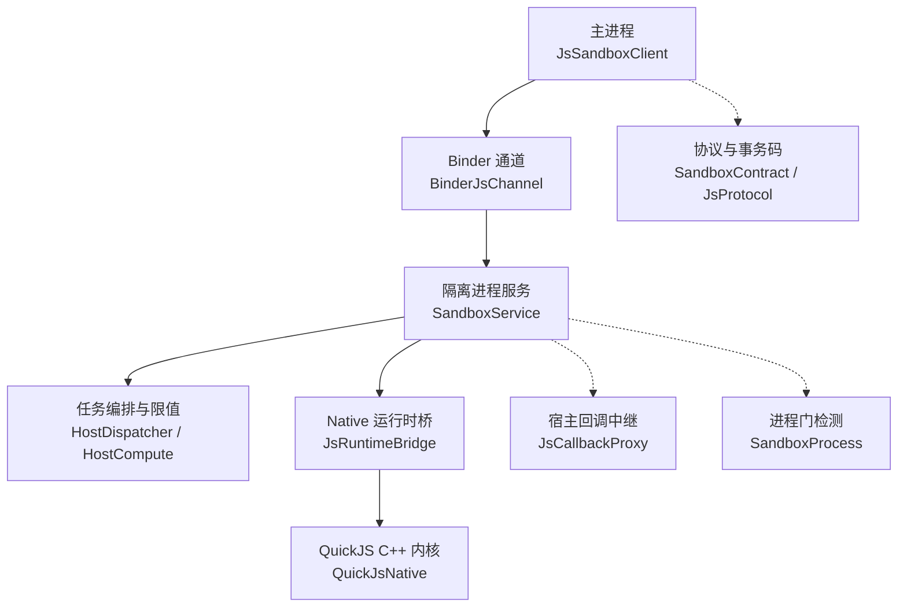
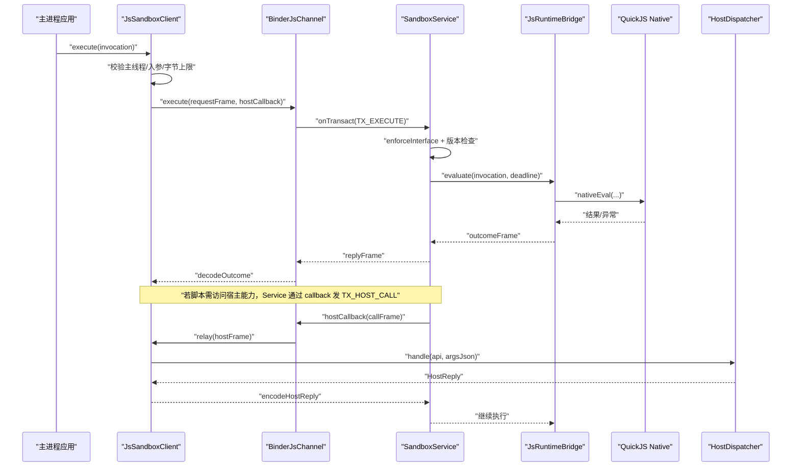
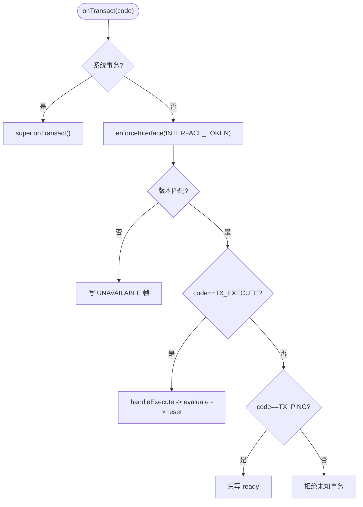
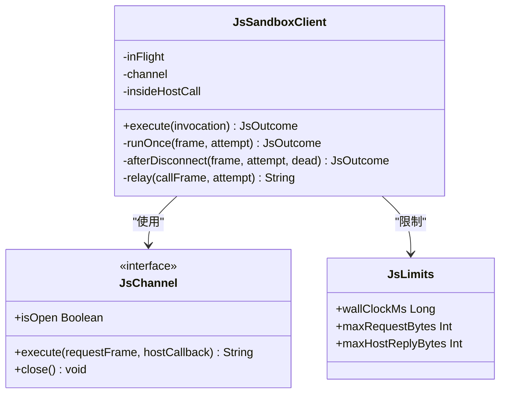
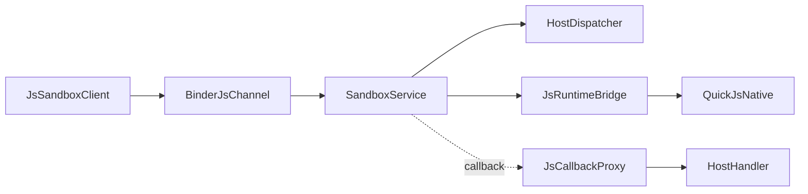

# 隔离进程调试

<cite>
**本文引用的文件**
- [SandboxContract.kt](file://lib_book_source/src/main/java/com/ebook/source/sandbox/SandboxContract.kt)
- [SandboxService.kt](file://lib_book_source/src/main/java/com/ebook/source/sandbox/SandboxService.kt)
- [JsSandboxClient.kt](file://lib_book_source/src/main/java/com/ebook/source/sandbox/JsSandboxClient.kt)
- [JsChannel.kt](file://lib_book_source/src/main/java/com/ebook/source/sandbox/JsChannel.kt)
- [BinderJsChannel.kt](file://lib_book_source/src/main/java/com/ebook/source/sandbox/BinderJsChannel.kt)
- [HostCompute.kt](file://lib_book_source/src/main/java/com/ebook/source/sandbox/HostCompute.kt)
- [HostDispatcher.kt](file://lib_book_source/src/main/java/com/ebook/source/sandbox/HostDispatcher.kt)
- [JsCallbackProxy.kt](file://lib_book_source/src/main/java/com/ebook/source/sandbox/JsCallbackProxy.kt)
- [JsLimits.kt](file://lib_book_source/src/main/java/com/ebook/source/sandbox/JsLimits.kt)
- [JsProtocol.kt](file://lib_book_source/src/main/java/com/ebook/source/sandbox/JsProtocol.kt)
- [JsRuntimeBridge.kt](file://lib_book_source/src/main/java/com/ebook/source/sandbox/JsRuntimeBridge.kt)
- [QuickJsNative.kt](file://lib_book_source/src/main/java/com/ebook/source/sandbox/QuickJsNative.kt)
- [CMakeLists.txt](file://lib_book_source/src/main/cpp/CMakeLists.txt)
- [JsSandboxConnector.kt](file://lib_book_source/src/main/java/com/ebook/source/sandbox/JsSandboxConnector.kt)
- [JsSandboxHost.kt](file://lib_book_source/src/main/java/com/ebook/source/sandbox/JsSandboxHost.kt)
- [SandboxProcess.kt](file://lib_book_source/src/main/java/com/ebook/source/sandbox/SandboxProcess.kt)
- [QuickJsBridgeTest.kt](file://lib_book_source/src/androidTest/java/com/ebook/source/sandbox/QuickJsBridgeTest.kt)
- [SandboxConnectionTest.kt](file://lib_book_source/src/androidTest/java/com/ebook/source/sandbox/SandboxConnectionTest.kt)
</cite>

## 目录
1. [简介](#简介)
2. [项目结构](#项目结构)
3. [核心组件](#核心组件)
4. [架构总览](#架构总览)
5. [详细组件分析](#详细组件分析)
6. [依赖关系分析](#依赖关系分析)
7. [性能与资源特性](#性能与资源特性)
8. [调试环境搭建](#调试环境搭建)
9. [常见问题诊断](#常见问题诊断)
10. [结论](#结论)
11. [附录：调试命令与脚本示例](#附录调试命令与脚本示例)

## 简介
本文件面向“隔离进程调试”，聚焦于本仓库中基于 Android 隔离进程的 JS 沙箱执行器（:js 进程）的端到端调试方法。内容覆盖：
- adb 连接技巧：隔离进程识别、连接、状态监控、Binder 通信调试与日志收集
- 进程间通信调试：协议版本检查、事务码分发、Parcel 数据序列化/反序列化
- native 层调试：QuickJS C++ 桥接层、JNI 调用跟踪、内存管理与错误处理
- 调试环境搭建：NDK 工具链、GDB/LLDB、符号文件生成与加载
- 常见故障排查：启动失败、Binder 超时、协议不匹配、内存不足等
- 实战案例与可执行命令，帮助快速定位与解决问题

## 项目结构
与隔离进程调试直接相关的代码集中在 lib_book_source 模块的沙箱子包与 cpp 桥接层：
- 进程契约与事务码定义：SandboxContract
- 服务与 Binder 端点：SandboxService
- 主进程客户端与通道抽象：JsSandboxClient、JsChannel、BinderJsChannel
- 宿主回调路由与代理：HostDispatcher、HostCompute、JsCallbackProxy
- 协议编解码与限值：JsProtocol、JsLimits
- Native 运行时桥：JsRuntimeBridge、QuickJsNative、CMakeLists
- 连接器与装配：JsSandboxConnector、JsSandboxHost
- 进程门检测：SandboxProcess

图表来源
- [JsSandboxClient.kt:35-185](file://lib_book_source/src/main/java/com/ebook/source/sandbox/JsSandboxClient.kt#L35-L185)
- [BinderJsChannel.kt](file://lib_book_source/src/main/java/com/ebook/source/sandbox/BinderJsChannel.kt)
- [SandboxService.kt:27-210](file://lib_book_source/src/main/java/com/ebook/source/sandbox/SandboxService.kt#L27-L210)
- [HostDispatcher.kt](file://lib_book_source/src/main/java/com/ebook/source/sandbox/HostDispatcher.kt)
- [HostCompute.kt](file://lib_book_source/src/main/java/com/ebook/source/sandbox/HostCompute.kt)
- [JsRuntimeBridge.kt](file://lib_book_source/src/main/java/com/ebook/source/sandbox/JsRuntimeBridge.kt)
- [QuickJsNative.kt](file://lib_book_source/src/main/java/com/ebook/source/sandbox/QuickJsNative.kt)
- [SandboxContract.kt:13-47](file://lib_book_source/src/main/java/com/ebook/source/sandbox/SandboxContract.kt#L13-L47)
- [SandboxProcess.kt:23-28](file://lib_book_source/src/main/java/com/ebook/source/sandbox/SandboxProcess.kt#L23-L28)

章节来源
- [SandboxContract.kt:13-47](file://lib_book_source/src/main/java/com/ebook/source/sandbox/SandboxContract.kt#L13-L47)
- [SandboxService.kt:27-210](file://lib_book_source/src/main/java/com/ebook/source/sandbox/SandboxService.kt#L27-L210)
- [JsSandboxClient.kt:35-185](file://lib_book_source/src/main/java/com/ebook/source/sandbox/JsSandboxClient.kt#L35-L185)

## 核心组件
- SandboxContract：定义接口 token、协议版本、事务码（TX_EXECUTE/TX_PING/TX_HOST_CALL）及回向接口标识，是两侧唯一事实源。
- SandboxService：隔离进程内唯一 Service，负责 onTransact 分诊、协议校验、execute/ping 处理、host 回调中继，以及 onBind 时的隔离进程门限校验。
- JsSandboxClient：主进程侧统一入口，串行化执行、主线程保护、重连与重放、字节上限控制、host 回调中继。
- JsChannel/BinderJsChannel：通道抽象与 Binder 实现；execute 同步投递请求帧，hostCallback 用于回传 host 调用帧。
- HostDispatcher/HostCompute：在隔离进程内将 host 调用委派给具体能力（本地计算或网络转发）。
- JsProtocol/JsLimits：请求/响应帧的 JSON 编解码与大小限制。
- JsRuntimeBridge/QuickJsNative：封装 QuickJS 引擎的 JNI 桥，提供 evaluate/close/isReady 等方法。
- JsSandboxConnector/JsSandboxHost：连接建立与装配面，为解析器提供桥对象与执行上下文。

章节来源
- [SandboxContract.kt:13-47](file://lib_book_source/src/main/java/com/ebook/source/sandbox/SandboxContract.kt#L13-L47)
- [SandboxService.kt:27-210](file://lib_book_source/src/main/java/com/ebook/source/sandbox/SandboxService.kt#L27-L210)
- [JsSandboxClient.kt:35-185](file://lib_book_source/src/main/java/com/ebook/source/sandbox/JsSandboxClient.kt#L35-L185)
- [JsChannel.kt:7-37](file://lib_book_source/src/main/java/com/ebook/source/sandbox/JsChannel.kt#L7-L37)
- [JsSandboxHost.kt:21-60](file://lib_book_source/src/main/java/com/ebook/source/sandbox/JsSandboxHost.kt#L21-L60)

## 架构总览
下图展示了从主进程发起一次脚本执行到隔离进程执行并回调主进程的完整序列。

图表来源
- [JsSandboxClient.kt:65-185](file://lib_book_source/src/main/java/com/ebook/source/sandbox/JsSandboxClient.kt#L65-L185)
- [BinderJsChannel.kt](file://lib_book_source/src/main/java/com/ebook/source/sandbox/BinderJsChannel.kt)
- [SandboxService.kt:50-123](file://lib_book_source/src/main/java/com/ebook/source/sandbox/SandboxService.kt#L50-L123)
- [JsRuntimeBridge.kt](file://lib_book_source/src/main/java/com/ebook/source/sandbox/JsRuntimeBridge.kt)
- [HostDispatcher.kt](file://lib_book_source/src/main/java/com/ebook/source/sandbox/HostDispatcher.kt)

## 详细组件分析

### 协议与事务码（SandboxContract）
- 定义 INTERFACE_TOKEN 与 CALLBACK_TOKEN 区分两端 Binder 接口，避免错绑导致误读帧。
- PROTOCOL_VERSION 作为强制对齐项，任一不一致即返回不可用，禁止“猜字段顺序”。
- 事务码：
  - TX_EXECUTE：execute 请求/响应帧（token、version、requestFrame/outcomeFrame）
  - TX_PING：探活，仅返回 ready 位，不建 runtime，避免内核调用开销
  - TX_HOST_CALL：执行器→主进程的 host 调用帧（token、version、callFrame/replyFrame）

章节来源
- [SandboxContract.kt:13-47](file://lib_book_source/src/main/java/com/ebook/source/sandbox/SandboxContract.kt#L13-L47)

### 服务与 Binder 端点（SandboxService）
- onTransact 优先放行 PING/DUMP/INTERFACE 等系统事务，再按自有事务码分诊。
- enforceInterface 与版本检查先于任何 payload 读取，保证对端非本服务或版本不合时不消费垃圾帧。
- handleExecute 设置 currentCallback ThreadLocal，委托 runSandboxTask（策略在 JVM 可测），并调用 JsRuntimeBridge.evaluate。
- handlePing 仅写入 token/version/ready，避免额外开销。
- requestHost 将 host 调用经 callback binder 转回主进程，严格校验 CALLBACK_TOKEN、版本、字节上限，并解出 HostReply。

图表来源
- [SandboxService.kt:50-123](file://lib_book_source/src/main/java/com/ebook/source/sandbox/SandboxService.kt#L50-L123)

章节来源
- [SandboxService.kt:27-210](file://lib_book_source/src/main/java/com/ebook/source/sandbox/SandboxService.kt#L27-L210)

### 主进程客户端（JsSandboxClient）
- 单例锁 inFlight 串行化 execute，避免多并发争用单一 runtime。
- 主线程保护：在主线程调用直接失败，防止 ANR。
- 深度守卫 insideHostCall：防止 host 回调里再次进入沙箱造成死锁。
- 断连重放：仅在本次尚未转发过 host 回调时允许重连重放一次，避免重复副作用。
- 字节上限：请求/回复均受 JsLimits 限制，超限直接失败。
- 统一失败语义：所有异常转换为类型化的 JsOutcome，便于上层分类处置。

图表来源
- [JsSandboxClient.kt:35-185](file://lib_book_source/src/main/java/com/ebook/source/sandbox/JsSandboxClient.kt#L35-L185)
- [JsChannel.kt:7-37](file://lib_book_source/src/main/java/com/ebook/source/sandbox/JsChannel.kt#L7-L37)
- [JsLimits.kt](file://lib_book_source/src/main/java/com/ebook/source/sandbox/JsLimits.kt)

章节来源
- [JsSandboxClient.kt:35-185](file://lib_book_source/src/main/java/com/ebook/source/sandbox/JsSandboxClient.kt#L35-L185)

### 通道与 Binder 实现（JsChannel / BinderJsChannel）
- JsChannel 屏蔽 Android 类型，使重连/重放/回调逻辑可在 JVM 测试。
- BinderJsChannel 将 execute 映射到 onTransact(TX_EXECUTE)，并将 hostCallback 作为强 binder 传递至隔离进程。

章节来源
- [JsChannel.kt:7-37](file://lib_book_source/src/main/java/com/ebook/source/sandbox/JsChannel.kt#L7-L37)
- [BinderJsChannel.kt](file://lib_book_source/src/main/java/com/ebook/source/sandbox/BinderJsChannel.kt)

### 宿主回调路由（HostDispatcher / HostCompute / JsCallbackProxy）
- HostDispatcher 安装 relay，将 host 调用交由具体能力（如本地计算、网络转发）。
- HostCompute 提供本地计算能力。
- JsCallbackProxy 作为主进程侧回调代理，确保异常不穿透到隔离进程 JNI 栈。

章节来源
- [HostDispatcher.kt](file://lib_book_source/src/main/java/com/ebook/source/sandbox/HostDispatcher.kt)
- [HostCompute.kt](file://lib_book_source/src/main/java/com/ebook/source/sandbox/HostCompute.kt)
- [JsCallbackProxy.kt](file://lib_book_source/src/main/java/com/ebook/source/sandbox/JsCallbackProxy.kt)

### 协议编解码与限值（JsProtocol / JsLimits）
- JsProtocol 负责 encode/decode requestFrame、outcomeFrame、host call/reply，保持两侧一致。
- JsLimits 集中管理 wall clock 超时与字节上限，避免过大请求/回复导致 OOM 或卡顿。

章节来源
- [JsProtocol.kt](file://lib_book_source/src/main/java/com/ebook/source/sandbox/JsProtocol.kt)
- [JsLimits.kt](file://lib_book_source/src/main/java/com/ebook/source/sandbox/JsLimits.kt)

### Native 运行时桥（JsRuntimeBridge / QuickJsNative）
- JsRuntimeBridge 封装 evaluate、reset、close、isReady，负责与 QuickJS 内核交互。
- QuickJsNative 暴露 JNI 函数供 Java/Kotlin 调用，承载实际 JS 执行与内存管理。

章节来源
- [JsRuntimeBridge.kt](file://lib_book_source/src/main/java/com/ebook/source/sandbox/JsRuntimeBridge.kt)
- [QuickJsNative.kt](file://lib_book_source/src/main/java/com/ebook/source/sandbox/QuickJsNative.kt)

### 连接器与装配（JsSandboxConnector / JsSandboxHost）
- JsSandboxConnector 负责建立与 :js 进程的 Binder 连接。
- JsSandboxHost 提供装配面，为解析器构造桥对象与执行上下文，持有 baseClient、limits、router。

章节来源
- [JsSandboxConnector.kt](file://lib_book_source/src/main/java/com/ebook/source/sandbox/JsSandboxConnector.kt)
- [JsSandboxHost.kt:21-60](file://lib_book_source/src/main/java/com/ebook/source/sandbox/JsSandboxHost.kt#L21-L60)

### 进程门（SandboxProcess）
- 仅当进程被系统标记为 isolatedProcess 时才认为处于隔离进程，避免在非隔离进程中运行脚本导致的权限泄漏。

章节来源
- [SandboxProcess.kt:23-28](file://lib_book_source/src/main/java/com/ebook/source/sandbox/SandboxProcess.kt#L23-L28)

## 依赖关系分析
- 主进程依赖：JsSandboxClient → JsChannel(BinderJsChannel) → SandboxService（隔离进程）
- 隔离进程依赖：SandboxService → HostDispatcher/HostCompute → JsRuntimeBridge → QuickJsNative
- 协议边界：SandboxContract + JsProtocol 贯穿两侧，版本与 token 校验位于最外层
- 回调路径：SandboxService → callback binder → JsCallbackProxy → HostHandler → JsSandboxClient

图表来源
- [JsSandboxClient.kt:35-185](file://lib_book_source/src/main/java/com/ebook/source/sandbox/JsSandboxClient.kt#L35-L185)
- [BinderJsChannel.kt](file://lib_book_source/src/main/java/com/ebook/source/sandbox/BinderJsChannel.kt)
- [SandboxService.kt:27-210](file://lib_book_source/src/main/java/com/ebook/source/sandbox/SandboxService.kt#L27-L210)
- [HostDispatcher.kt](file://lib_book_source/src/main/java/com/ebook/source/sandbox/HostDispatcher.kt)
- [JsRuntimeBridge.kt](file://lib_book_source/src/main/java/com/ebook/source/sandbox/JsRuntimeBridge.kt)
- [QuickJsNative.kt](file://lib_book_source/src/main/java/com/ebook/source/sandbox/QuickJsNative.kt)
- [JsCallbackProxy.kt](file://lib_book_source/src/main/java/com/ebook/source/sandbox/JsCallbackProxy.kt)

章节来源
- [JsSandboxClient.kt:35-185](file://lib_book_source/src/main/java/com/ebook/source/sandbox/JsSandboxClient.kt#L35-L185)
- [SandboxService.kt:27-210](file://lib_book_source/src/main/java/com/ebook/source/sandbox/SandboxService.kt#L27-L210)

## 性能与资源特性
- 串行执行：inFlight 锁保证同一时间只有一个 execute 在飞，避免多源并发争抢 runtime。
- 超时控制：wallClockMs 使用单调时钟跨进程可比，超时返回 TIMEOUT，避免长尾阻塞。
- 字节限制：maxRequestBytes/maxHostReplyBytes 防止大请求/回复导致 OOM。
- 轻量探活：TX_PING 仅返回 ready，避免每次探测都创建 runtime。
- 回调节流：insideHostCall 深度计数防止嵌套调用造成死锁。

章节来源
- [JsSandboxClient.kt:65-185](file://lib_book_source/src/main/java/com/ebook/source/sandbox/JsSandboxClient.kt#L65-L185)
- [SandboxService.kt:100-123](file://lib_book_source/src/main/java/com/ebook/source/sandbox/SandboxService.kt#L100-L123)

## 调试环境搭建
- NDK 工具链配置
  - 使用仓库内置构建约定插件编译 native 模块，ABI 默认 release 最小集 arm64-v8a，debug 可按需放宽 x86_64。
  - 构建产物包含 .so 与调试符号，确保 debug build 保留符号以便 LLDB/GDB 附加。
- 符号文件生成与加载
  - 确认模块开启 debuggable，符号随 APK 安装；设备端可使用 lldb-server 或通过 Android Studio 附加调试器。
  - 若需离线符号，可从 build output 中提取 .so 对应符号文件并配置调试器。
- LLDB/GDB 使用
  - 通过 Android Studio 的 Attach to Process 选择 :js 进程进行附加；或在命令行启动 lldb-server 后 attach。
  - 建议在 JsRuntimeBridge::evaluate 与 QuickJS 关键入口设置断点，观察参数与返回值。

章节来源
- [CMakeLists.txt](file://lib_book_source/src/main/cpp/CMakeLists.txt)

## 常见问题诊断

### 进程启动失败
- 现象：无法绑定 :js 服务，主进程报连接超时。
- 可能原因：
  - 未启用 android:isolatedProcess="true"，SandboxService.onBind 主动返回 null。
  - 进程名或进程隔离属性不符合预期。
- 排查步骤：
  - 使用 ps 或 dumpsys 确认 :js 进程是否以隔离方式启动。
  - 在 SandboxService.onBind 处加日志确认是否命中隔离进程门。
  - 验证 Manifest 配置与进程名。

章节来源
- [SandboxService.kt:147-153](file://lib_book_source/src/main/java/com/ebook/source/sandbox/SandboxService.kt#L147-L153)
- [SandboxProcess.kt:23-28](file://lib_book_source/src/main/java/com/ebook/source/sandbox/SandboxProcess.kt#L23-L28)

### Binder 连接超时
- 现象：主进程执行卡住或报断连。
- 可能原因：
  - :js 进程崩溃或未启动。
  - 通道关闭但未清理，客户端重复尝试。
- 排查步骤：
  - 使用 jdb/LLDB 在 JsSandboxClient.execute 附近断点，观察 inFlight 与 channel 状态。
  - 检查 afterDisconnect 是否触发重连与重放。
  - 使用 dumpsys binder 查看两端 binder 句柄状态。

章节来源
- [JsSandboxClient.kt:116-135](file://lib_book_source/src/main/java/com/ebook/source/sandbox/JsSandboxClient.kt#L116-L135)
- [JsSandboxClient.kt:137-150](file://lib_book_source/src/main/java/com/ebook/source/sandbox/JsSandboxClient.kt#L137-L150)

### 协议版本不匹配
- 现象：execute 立即返回 UNAVAILABLE，提示版本不合。
- 可能原因：主进程与隔离进程构建不同步，PROTOCOL_VERSION 不一致。
- 排查步骤：
  - 确认两侧使用同一次构建产物。
  - 在 SandboxService.handleContractCall 处断点，检查 version 字段。
  - 通过 TX_PING 快速判定服务可达性与桥就绪。

章节来源
- [SandboxService.kt:63-75](file://lib_book_source/src/main/java/com/ebook/source/sandbox/SandboxService.kt#L63-L75)
- [SandboxContract.kt:13-47](file://lib_book_source/src/main/java/com/ebook/source/sandbox/SandboxContract.kt#L13-L47)

### 内存不足（OOM/过大请求）
- 现象：请求/回复被拒，或执行过程中崩溃。
- 可能原因：
  - 请求帧超过 maxRequestBytes。
  - 主机回复超过 maxHostReplyBytes。
- 排查步骤：
  - 在 JsSandboxClient.relay 与 SandboxService.requestHost 处断点，记录帧长度。
  - 调整规则减少响应体或分页获取。
  - 使用堆转储与 native 内存分析定位泄漏。

章节来源
- [JsSandboxClient.kt:74-80](file://lib_book_source/src/main/java/com/ebook/source/sandbox/JsSandboxClient.kt#L74-L80)
- [SandboxService.kt:165-205](file://lib_book_source/src/main/java/com/ebook/source/sandbox/SandboxService.kt#L165-L205)

### 回调死锁/嵌套执行
- 现象：host 回调期间再次进入沙箱导致无响应。
- 可能原因：insideHostCall 深度不为 0 时又发起 execute。
- 排查步骤：
  - 在 JsSandboxClient.execute 入口处断点，检查 isMainThread 与 insideHostCall。
  - 调整业务逻辑，避免在回调中再次执行脚本。

章节来源
- [JsSandboxClient.kt:65-73](file://lib_book_source/src/main/java/com/ebook/source/sandbox/JsSandboxClient.kt#L65-L73)

### Native 层错误（QuickJS 崩溃）
- 现象：:js 进程崩溃，主进程报断连。
- 可能原因：
  - JS 脚本异常、内存越界、引擎初始化失败。
- 排查步骤：
  - 在 JsRuntimeBridge.evaluate 与 QuickJS 入口设置断点。
  - 捕获并打印 native 栈信息，结合 logcat 中的 fatal 日志。
  - 逐步缩小问题范围，定位到具体规则或输入。

章节来源
- [JsRuntimeBridge.kt](file://lib_book_source/src/main/java/com/ebook/source/sandbox/JsRuntimeBridge.kt)
- [QuickJsNative.kt](file://lib_book_source/src/main/java/com/ebook/source/sandbox/QuickJsNative.kt)

## 结论
本仓库的隔离进程沙箱通过严格的协议版本检查、Binder 事务码分离、字节与超时限制，以及进程门保障，实现了安全可靠的脚本执行环境。调试时应优先从协议与事务入手，再深入到通道与 native 层。借助 LLDB/GDB、dumpsys binder、logcat 与单元测试用例，可以快速定位并解决大多数问题。

## 附录：调试命令与脚本示例
以下为常用调试命令与思路（请根据实际环境与权限调整）：
- 进程与状态
  - 查看进程列表并过滤 :js：ps | grep js
  - 查询 binder 服务与句柄：dumpsys binder --services | grep -i sandbox
  - 探测服务可用性：adb shell am startservice --user 0 <service-name>（若支持）
- 日志收集
  - 抓取 logcat 并按 tag 过滤：adb logcat -s SandboxService:* JsSandboxClient:*
  - 持续抓日志并重定向到文件：adb logcat > log.txt
- Binder 调试
  - 查看 binder 统计：dumpsys binder --stats
  - 检查特定服务的 onTransact 调用（需 root 或合适权限）
- 内存分析
  - 抓取 heap：adb shell dumpsys meminfo <package>
  - 抓取 native 堆快照（需 root）：adb shell procrank 或 pmap
- 性能剖析
  - 使用 Perfetto/Android Studio Profiler 采集 CPU/内存/IO
  - 针对 native 层使用 perf 或 sampler 采集热点
- 单元测试参考
  - 连接与桥接用例：见 SandboxConnectionTest、QuickJsBridgeTest

章节来源
- [SandboxConnectionTest.kt](file://lib_book_source/src/androidTest/java/com/ebook/source/sandbox/SandboxConnectionTest.kt)
- [QuickJsBridgeTest.kt](file://lib_book_source/src/androidTest/java/com/ebook/source/sandbox/QuickJsBridgeTest.kt)