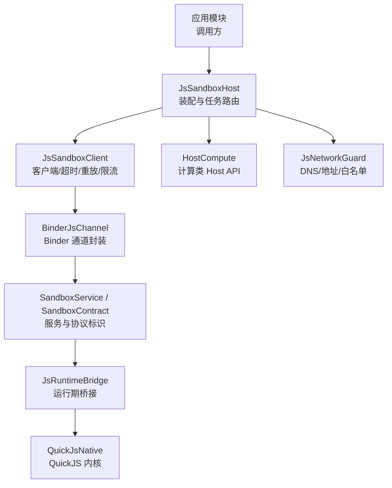
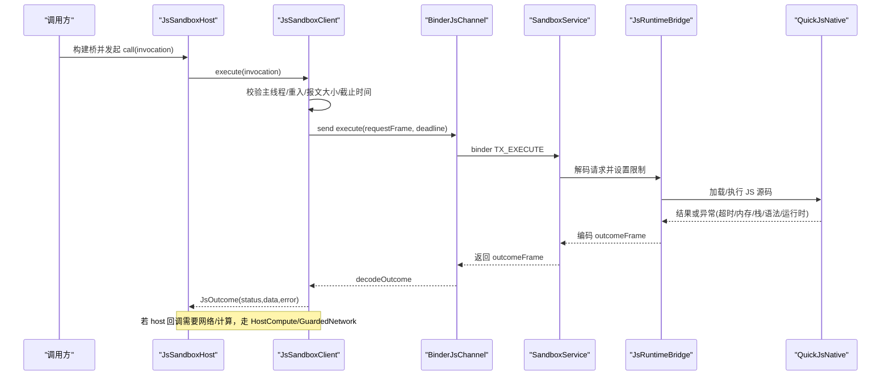
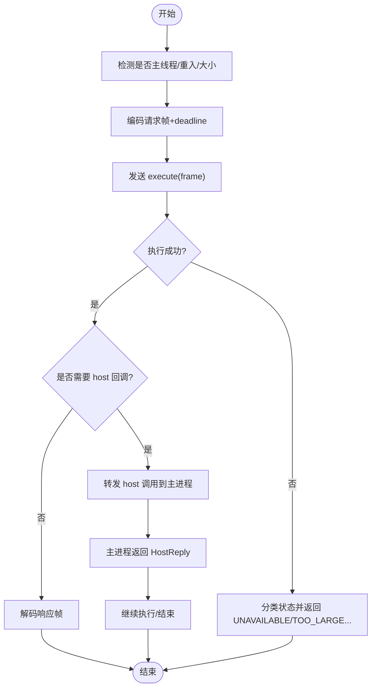
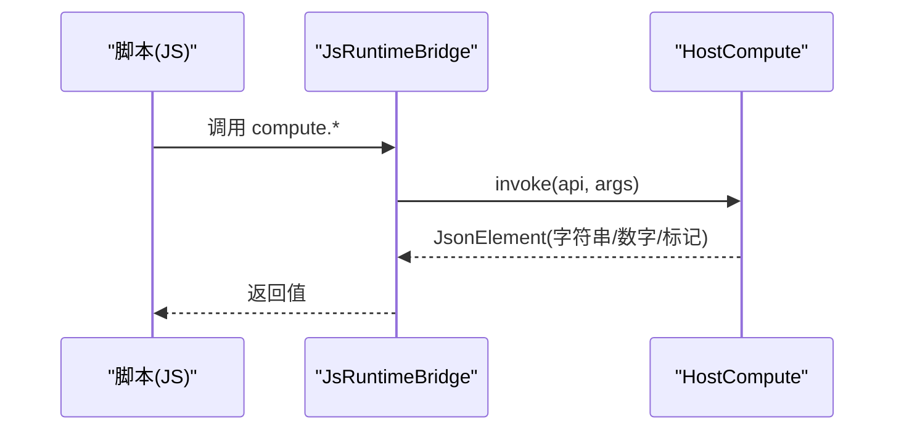
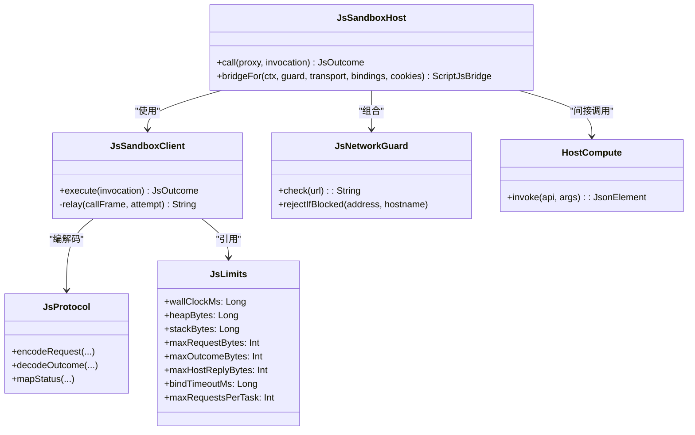
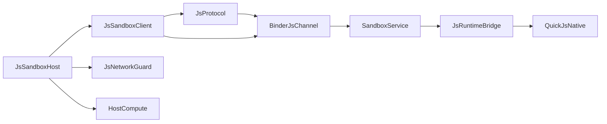

# 沙箱执行器架构

<cite>
**本文引用的文件**
- [SandboxContract.kt](file://lib_book_source/src/main/java/com/ebook/source/sandbox/SandboxContract.kt)
- [JsSandboxClient.kt](file://lib_book_source/src/main/java/com/ebook/source/sandbox/JsSandboxClient.kt)
- [JsLimits.kt](file://lib_book_source/src/main/java/com/ebook/source/sandbox/JsLimits.kt)
- [JsProtocol.kt](file://lib_book_source/src/main/java/com/ebook/source/sandbox/JsProtocol.kt)
- [SandboxProcess.kt](file://lib_book_source/src/main/java/com/ebook/source/sandbox/SandboxProcess.kt)
- [JsSandboxHost.kt](file://lib_book_source/src/main/java/com/ebook/source/sandbox/JsSandboxHost.kt)
- [JsNetworkGuard.kt](file://lib_book_source/src/main/java/com/ebook/source/sandbox/JsNetworkGuard.kt)
- [HostCompute.kt](file://lib_book_source/src/main/java/com/ebook/source/sandbox/HostCompute.kt)
- [QuickJsNative.kt](file://lib_book_source/src/main/java/com/ebook/source/sandbox/QuickJsNative.kt)
- [BinderJsChannel.kt](file://lib_book_source/src/main/java/com/ebook/source/sandbox/BinderJsChannel.kt)
- [JsCallbackProxy.kt](file://lib_book_source/src/main/java/com/ebook/source/sandbox/JsCallbackProxy.kt)
- [JsRuntimeBridge.kt](file://lib_book_source/src/main/java/com/ebook/source/sandbox/JsRuntimeBridge.kt)
- [SourceHostAllowlist.kt](file://lib_book_source/src/main/java/com/ebook/source/sandbox/SourceHostAllowlist.kt)
- [SandboxService.kt](file://lib_book_source/src/main/java/com/ebook/source/sandbox/SandboxService.kt)
- [0028-untrusted-js-sandbox.adr.md](file://docs/adr/0028-untrusted-js-sandbox.adr.md)
</cite>

## 目录
1. [引言](#引言)
2. [项目结构](#项目结构)
3. [核心组件](#核心组件)
4. [架构总览](#架构总览)
5. [详细组件分析](#详细组件分析)
6. [依赖关系分析](#依赖关系分析)
7. [性能与安全考量](#性能与安全考量)
8. [故障排查指南](#故障排查指南)
9. [结论](#结论)

## 引言
本文件系统化阐述“不可信 JavaScript 代码的安全执行机制”。围绕 isolatedProcess 零权限进程、自集成 QuickJS 引擎、Binder 双向协议、资源限制四件套、Host API 白名单、主进程与执行器进程的通信模型、安全攻击面与防护、以及性能监控与调试，给出可操作的架构说明与实践建议。该能力用于在书源解析中安全地执行用户脚本（例如 @js: / <js> 片段），在不暴露宿主能力的前提下完成规则求值与数据加工。

## 项目结构
与沙箱执行器直接相关的实现集中在 lib_book_source 的 sandbox 包内，协议与配置由跨进程契约文件集中管理；网络访问受 GuardedNetwork 与 Host API 白名单约束；C++ 桥接层与 QuickJS 内核位于 cpp 与 third_party 目录。

图表来源
- [JsSandboxHost.kt:21-60](file://lib_book_source/src/main/java/com/ebook/source/sandbox/JsSandboxHost.kt#L21-L60)
- [JsSandboxClient.kt:35-99](file://lib_book_source/src/main/java/com/ebook/source/sandbox/JsSandboxClient.kt#L35-L99)
- [BinderJsChannel.kt](file://lib_book_source/src/main/java/com/ebook/source/sandbox/BinderJsChannel.kt)
- [SandboxContract.kt:13-47](file://lib_book_source/src/main/java/com/ebook/source/sandbox/SandboxContract.kt#L13-L47)
- [JsRuntimeBridge.kt](file://lib_book_source/src/main/java/com/ebook/source/sandbox/JsRuntimeBridge.kt)
- [QuickJsNative.kt](file://lib_book_source/src/main/java/com/ebook/source/sandbox/QuickJsNative.kt)
- [HostCompute.kt:23-86](file://lib_book_source/src/main/java/com/ebook/source/sandbox/HostCompute.kt#L23-L86)
- [JsNetworkGuard.kt:25-99](file://lib_book_source/src/main/java/com/ebook/source/sandbox/JsNetworkGuard.kt#L25-L99)

章节来源
- [SandboxContract.kt:1-47](file://lib_book_source/src/main/java/com/ebook/source/sandbox/SandboxContract.kt#L1-L47)
- [JsSandboxClient.kt:1-185](file://lib_book_source/src/main/java/com/ebook/source/sandbox/JsSandboxClient.kt#L1-L185)
- [JsLimits.kt:1-58](file://lib_book_source/src/main/java/com/ebook/source/sandbox/JsLimits.kt#L1-L58)
- [JsProtocol.kt:12-256](file://lib_book_source/src/main/java/com/ebook/source/sandbox/JsProtocol.kt#L12-L256)
- [SandboxProcess.kt:1-28](file://lib_book_source/src/main/java/com/ebook/source/sandbox/SandboxProcess.kt#L1-L28)
- [JsSandboxHost.kt:1-60](file://lib_book_source/src/main/java/com/ebook/source/sandbox/JsSandboxHost.kt#L1-L60)
- [JsNetworkGuard.kt:1-167](file://lib_book_source/src/main/java/com/ebook/source/sandbox/JsNetworkGuard.kt#L1-L167)
- [HostCompute.kt:1-345](file://lib_book_source/src/main/java/com/ebook/source/sandbox/HostCompute.kt#L1-L345)

## 核心组件
- 隔离进程识别：SandboxProcess 提供当前是否处于系统隔离进程的判据，作为进程门与初始化开关。
- 客户端：JsSandboxClient 是主进程侧唯一执行入口，负责超时、大小限制、重入保护、断连重放、回调中继。
- 协议：JsProtocol 定义请求/响应帧、模式映射、状态归类；SandboxContract 定义 Binder 接口令牌、版本与事务码。
- 宿主装配：JsSandboxHost 持有长连接客户端与任务级回调路由器，并对外暴露 bridgeFor 以构造脚本运行时所需的桥。
- 网络守卫：JsNetworkGuard + GuardedDns + AddressPolicy 实现 URL/域名/地址准入控制与 DNS 重绑防护。
- 计算能力：HostCompute 在执行器进程内提供无跨进程往返的哈希/编码/加密等纯计算能力。
- 原生桥接：JsRuntimeBridge 与 QuickJsNative 将 Kotlin/Java 与 QuickJS 内核衔接，承载堆/栈/中断等限制。
- 传输：BinderJsChannel 通过 Binder 发送 JSON 帧，配合 SandboxService 提供服务端入口。

章节来源
- [SandboxProcess.kt:6-28](file://lib_book_source/src/main/java/com/ebook/source/sandbox/SandboxProcess.kt#L6-L28)
- [JsSandboxClient.kt:8-34](file://lib_book_source/src/main/java/com/ebook/source/sandbox/JsSandboxClient.kt#L8-L34)
- [JsProtocol.kt:30-73](file://lib_book_source/src/main/java/com/ebook/source/sandbox/JsProtocol.kt#L30-L73)
- [SandboxContract.kt:13-47](file://lib_book_source/src/main/java/com/ebook/source/sandbox/SandboxContract.kt#L13-L47)
- [JsSandboxHost.kt:9-60](file://lib_book_source/src/main/java/com/ebook/source/sandbox/JsSandboxHost.kt#L9-L60)
- [JsNetworkGuard.kt:9-99](file://lib_book_source/src/main/java/com/ebook/source/sandbox/JsNetworkGuard.kt#L9-L99)
- [HostCompute.kt:23-86](file://lib_book_source/src/main/java/com/ebook/source/sandbox/HostCompute.kt#L23-L86)

## 架构总览
沙箱执行器采用“主进程 + 隔离进程”的双边架构。主进程不直接加载 .so，也不具备网络与文件系统能力；所有对宿主的访问都通过显式白名单 Host API 进行。执行器进程仅包含 QuickJS 内核、最小化桥接与受限 Host API，从而将破坏性能力收敛到主进程。

图表来源
- [JsSandboxHost.kt:29-60](file://lib_book_source/src/main/java/com/ebook/source/sandbox/JsSandboxHost.kt#L29-L60)
- [JsSandboxClient.kt:65-143](file://lib_book_source/src/main/java/com/ebook/source/sandbox/JsSandboxClient.kt#L65-L143)
- [SandboxContract.kt:21-46](file://lib_book_source/src/main/java/com/ebook/source/sandbox/SandboxContract.kt#L21-L46)
- [JsProtocol.kt:127-169](file://lib_book_source/src/main/java/com/ebook/source/sandbox/JsProtocol.kt#L127-L169)

## 详细组件分析

### isolatedProcess 零权限进程：设计与优势
- 设计要点
  - 使用系统提供的隔离进程能力，使执行器进程不具备默认的文件、网络、反射等权限。
  - 通过进程门避免在主进程中误初始化沙箱相关组件。
- 安全优势
  - 即使脚本逃逸出 QuickJS，也无法直接读写本地文件或发起任意网络请求。
  - 任何宿主能力必须经白名单 Host API 调用，且可在主进程侧审计与加固。

章节来源
- [SandboxProcess.kt:6-28](file://lib_book_source/src/main/java/com/ebook/source/sandbox/SandboxProcess.kt#L6-L28)
- [0028-untrusted-js-sandbox.adr.md](file://docs/adr/0028-untrusted-js-sandbox.adr.md)

### QuickJS 自集成方案
- 源码选择与放置：vendored 于 third_party/quickjs，保证构建可控与审计可见。
- C++ 桥接层：JsRuntimeBridge 与 QuickJsNative 负责创建上下文、绑定 Host API、注入预置环境、设置限制。
- 资源限制配置：堆上限、JS 栈上限、wall-clock 中断、请求/响应大小限制在桥接层与客户端共同生效。

章节来源
- [QuickJsNative.kt](file://lib_book_source/src/main/java/com/ebook/source/sandbox/QuickJsNative.kt)
- [JsRuntimeBridge.kt](file://lib_book_source/src/main/java/com/ebook/source/sandbox/JsRuntimeBridge.kt)
- [JsLimits.kt:13-57](file://lib_book_source/src/main/java/com/ebook/source/sandbox/JsLimits.kt#L13-L57)

### Binder 双向协议：execute、回调与异常
- 控制面协议
  - 接口令牌、版本号、事务码在 SandboxContract 集中声明，避免 AIDL 生成黑盒。
  - TX_EXECUTE：主进程 → 执行器，携带 requestFrame 与 host 回调 binder（可空）。
  - TX_PING：探活，验证 token/version/.so 可用，不建 runtime。
  - 反方向 CALLBACK_TOKEN/TX_HOST_CALL：执行器 → 主进程，调用 Host API。
- 数据面协议
  - JsProtocol 统一编解码 RequestFrame/OutcomeFrame/HostCallFrame/HostReplyFrame。
  - 严格 JSON 模式（ignoreUnknownKeys=false）确保两侧同构，不同步即失败。
- 异常处理
  - 解码失败抛 SandboxProtocolException，不在设备上静默丢字段。
  - 状态映射 mapStatus 将内核异常归类为 TIMEOUT/MEMORY/STACK/SYNTAX/RUNTIME/UNSUPPORTED_API/TOO_LARGE/OK。

章节来源
- [SandboxContract.kt:13-47](file://lib_book_source/src/main/java/com/ebook/source/sandbox/SandboxContract.kt#L13-L47)
- [JsProtocol.kt:84-256](file://lib_book_source/src/main/java/com/ebook/source/sandbox/JsProtocol.kt#L84-L256)

### 资源限制四件套
- wall-clock 超时：由主进程基于单调时钟计算 deadlineMonoMs，执行器按剩余时间轮询中断。
- 堆上限：QuickJS 分配器拒绝后，桥接层将异常归为 MEMORY。
- JS 栈上限：按线程剩余栈动态收紧，防止 native 栈溢出导致进程崩溃。
- 请求/响应/回调大小限制：在 Binder 事务前做字节数检查，避免 TransactionTooLargeException 与解析时内存爆炸。

章节来源
- [JsLimits.kt:13-57](file://lib_book_source/src/main/java/com/ebook/source/sandbox/JsLimits.kt#L13-L57)
- [JsSandboxClient.kt:65-99](file://lib_book_source/src/main/java/com/ebook/source/sandbox/JsSandboxClient.kt#L65-L99)
- [JsProtocol.kt:159-202](file://lib_book_source/src/main/java/com/ebook/source/sandbox/JsProtocol.kt#L159-L202)

### Host API 白名单：deny-by-default 与最小权限
- 原则
  - 未列出的能力一律拒绝；新增能力需显式注册。
  - 计算能力（HostCompute）在内核态执行，零跨进程往返，降低攻击面。
  - 网络能力通过 GuardedNetwork 派生客户端，强制白名单与地址策略。
- 典型能力
  - 哈希/编码/对称加密/HMAC/日期/随机等：HostCompute.invoke(api, args)。
  - 网络代理：由 JsSandboxHost.bridgeFor 传入已守门的 ScriptTransport。
- 白名单来源
  - SourceHostAllowlist 从源规则原文导出，禁止私网/保留/云元数据地址。

章节来源
- [HostCompute.kt:23-86](file://lib_book_source/src/main/java/com/ebook/source/sandbox/HostCompute.kt#L23-L86)
- [JsSandboxHost.kt:41-60](file://lib_book_source/src/main/java/com/ebook/source/sandbox/JsSandboxHost.kt#L41-L60)
- [JsNetworkGuard.kt:25-99](file://lib_book_source/src/main/java/com/ebook/source/sandbox/JsNetworkGuard.kt#L25-L99)
- [SourceHostAllowlist.kt](file://lib_book_source/src/main/java/com/ebook/source/sandbox/SourceHostAllowlist.kt)

### 主进程与执行器进程通信模型
- 连接管理
  - 客户端维护长连接通道，断连自动重连并重放一次（无副作用前提下）。
  - 探活 TX_PING 用于快速区分“服务不在/协议不合”.so 缺失。
- 任务调度
  - 同一执行器进程仅一个 runtime，execute 串行化避免并发争抢。
  - 每次请求带 deadlineMonoMs，过期即 TIME_OUT。
- 错误恢复
  - 断连/协议不匹配/通道异常均转为 UNAVAILABLE，便于上层降级。
  - 回调期间重入深度受 maxCallbackDepth 限制，防止嵌套死锁。

章节来源
- [JsSandboxClient.kt:57-185](file://lib_book_source/src/main/java/com/ebook/source/sandbox/JsSandboxClient.kt#L57-L185)
- [SandboxContract.kt:21-46](file://lib_book_source/src/main/java/com/ebook/source/sandbox/SandboxContract.kt#L21-L46)
- [JsLimits.kt:43-57](file://lib_book_source/src/main/java/com/ebook/source/sandbox/JsLimits.kt#L43-L57)

### 关键流程图与序列图

#### 执行流程（含 host 回调）

图表来源
- [JsSandboxClient.kt:65-143](file://lib_book_source/src/main/java/com/ebook/source/sandbox/JsSandboxClient.kt#L65-L143)
- [JsProtocol.kt:127-169](file://lib_book_source/src/main/java/com/ebook/source/sandbox/JsProtocol.kt#L127-L169)

#### 主机计算能力调用

图表来源
- [HostCompute.kt:47-86](file://lib_book_source/src/main/java/com/ebook/source/sandbox/HostCompute.kt#L47-L86)

### 类关系图（核心类型）

图表来源
- [JsSandboxHost.kt:21-60](file://lib_book_source/src/main/java/com/ebook/source/sandbox/JsSandboxHost.kt#L21-L60)
- [JsSandboxClient.kt:35-185](file://lib_book_source/src/main/java/com/ebook/source/sandbox/JsSandboxClient.kt#L35-L185)
- [JsProtocol.kt:30-256](file://lib_book_source/src/main/java/com/ebook/source/sandbox/JsProtocol.kt#L30-L256)
- [JsLimits.kt:13-57](file://lib_book_source/src/main/java/com/ebook/source/sandbox/JsLimits.kt#L13-L57)
- [JsNetworkGuard.kt:25-99](file://lib_book_source/src/main/java/com/ebook/source/sandbox/JsNetworkGuard.kt#L25-L99)
- [HostCompute.kt:23-86](file://lib_book_source/src/main/java/com/ebook/source/sandbox/HostCompute.kt#L23-L86)

## 依赖关系分析
- 松耦合边界
  - 协议层（JsProtocol）与传输层（BinderJsChannel）解耦，方便替换实现。
  - 客户端与宿主处理器（HostHandler）通过接口注入，便于测试与替换。
- 外部依赖
  - QuickJS 内核（third_party/quickjs）与 C++ 桥接层（cpp/bridge）。
  - OkHttp（通过 GuardedNetwork 派生）用于受控网络访问。
- 潜在环与风险
  - 回调链可能形成重入路径（脚本→host→再次脚本），由 reentrancy depth 与 inFlight 锁保护。
  - Binder 事务过大被拒，需在客户端前置截断。

图表来源
- [JsSandboxClient.kt:35-143](file://lib_book_source/src/main/java/com/ebook/source/sandbox/JsSandboxClient.kt#L35-L143)
- [BinderJsChannel.kt](file://lib_book_source/src/main/java/com/ebook/source/sandbox/BinderJsChannel.kt)
- [SandboxService.kt](file://lib_book_source/src/main/java/com/ebook/source/sandbox/SandboxService.kt)
- [JsRuntimeBridge.kt](file://lib_book_source/src/main/java/com/ebook/source/sandbox/JsRuntimeBridge.kt)
- [QuickJsNative.kt](file://lib_book_source/src/main/java/com/ebook/source/sandbox/QuickJsNative.kt)

## 性能与安全考量
- 性能
  - 单 runtime 串行执行避免竞态，配合 deadline 保证公平与可预期超时。
  - 通道复用减少 binder 建连与 runtime 冷启动开销。
  - 大小限制在进 Binder 之前判定，避免无用解析。
- 安全
  - deny-by-default 的 Host API 白名单与地址策略（AddressPolicy）阻断内网/保留/云元数据。
  - DNS 重绑防护：GuardedDns 在真正解析点校验，避免缓存绕过。
  - 进程隔离：:js 进程零权限，宿主能力全部通过显式通道暴露。
  - 重入与回调深度限制，防止递归与死锁。

[本节为通用指导，无需具体文件引用]

## 故障排查指南
- 常见问题定位
  - 连接失败：确认 SandboxService 已启动，TX_PING 可通；检查协议版本一致。
  - 超时：查看 wallClockMs 与队列等待，必要时提升或拆分任务。
  - 内存/栈：检查 heapBytes/stackBytes 与输入规模，优化脚本逻辑。
  - 报文过大：检查 maxRequestBytes/maxOutcomeBytes/maxHostReplyBytes，拆分数据。
  - 白名单拒绝：核对 SourceHostAllowlist 与目标域名/IP，修正规则。
- 日志与观测
  - 记录断连原因、重放次数、回调深度、状态码分布。
  - 针对 TOO_LARGE/UNAVAILABLE/TIMEOUT 等状态分别统计趋势。

章节来源
- [JsSandboxClient.kt:116-185](file://lib_book_source/src/main/java/com/ebook/source/sandbox/JsSandboxClient.kt#L116-L185)
- [JsProtocol.kt:159-202](file://lib_book_source/src/main/java/com/ebook/source/sandbox/JsProtocol.kt#L159-L202)
- [JsLimits.kt:13-57](file://lib_book_source/src/main/java/com/ebook/source/sandbox/JsLimits.kt#L13-L57)

## 结论
本沙箱执行器通过隔离进程、精简内核、严格协议与白名单机制，构建了面向不可信脚本的安全执行环境。客户端侧的超时、大小、重入与重放策略，结合 Host API 的最小权限原则与地址策略，有效收敛了攻击面。建议在引入新能力时遵循 deny-by-default 与“先评估、再上线”的流程，持续完善监控与回归测试。