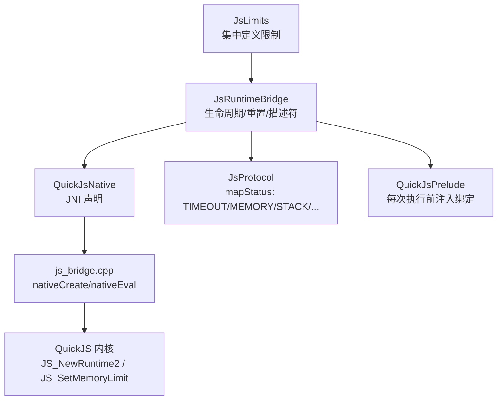
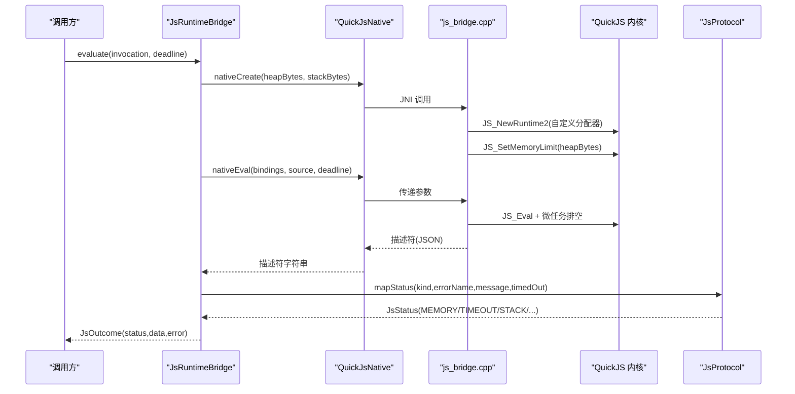
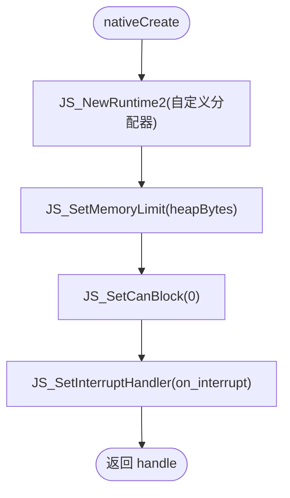
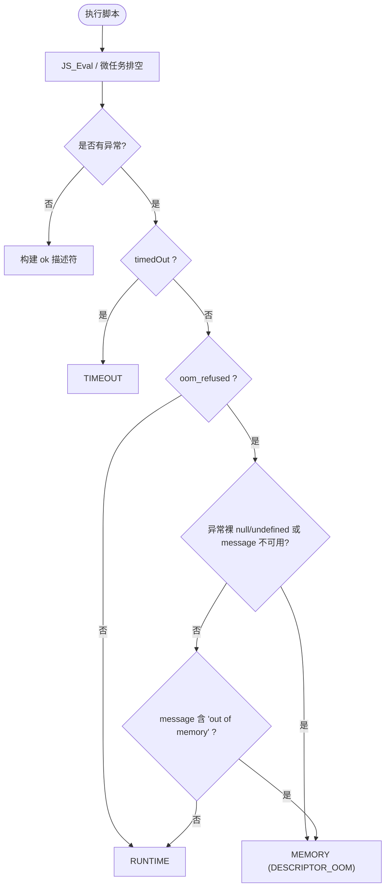
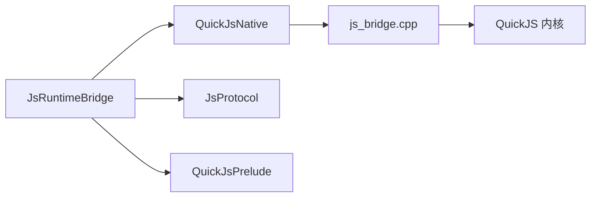

# 堆内存上限控制

<cite>
**本文引用的文件**
- [JsLimits.kt](file://lib_book_source/src/main/java/com/ebook/source/sandbox/JsLimits.kt)
- [QuickJsNative.kt](file://lib_book_source/src/main/java/com/ebook/source/sandbox/QuickJsNative.kt)
- [js_bridge.cpp](file://lib_book_source/src/main/cpp/bridge/js_bridge.cpp)
- [JsRuntimeBridge.kt](file://lib_book_source/src/main/java/com/ebook/source/sandbox/JsRuntimeBridge.kt)
- [JsProtocol.kt](file://lib_book_source/src/main/java/com/ebook/source/sandbox/JsProtocol.kt)
- [QuickJsPrelude.kt](file://lib_book_source/src/main/java/com/ebook/source/sandbox/QuickJsPrelude.kt)
- [JsProtocolTest.kt](file://lib_book_source/src/test/java/com/ebook/source/sandbox/JsProtocolTest.kt)
</cite>

## 目录
1. [简介](#简介)
2. [项目结构](#项目结构)
3. [核心组件](#核心组件)
4. [架构总览](#架构总览)
5. [详细组件分析](#详细组件分析)
6. [依赖关系分析](#依赖关系分析)
7. [性能考量](#性能考量)
8. [故障排查指南](#故障排查指南)
9. [结论](#结论)
10. [附录](#附录)

## 简介
本文面向“脚本执行沙箱”的堆内存上限控制，围绕 heapBytes（默认 8MB）的设计、QuickJS 堆内存管理机制、堆耗尽检测与状态映射、以及进程内存与响应帧上限的关系进行系统说明。同时给出不同脚本模式的内存占用特征、监控方法与泄漏检测建议，帮助读者在工程实践中安全、可控地运行不受信任的脚本。

## 项目结构
与堆内存控制直接相关的代码分布在以下位置：
- 配置与常量：JsLimits（集中定义堆/栈/报文等限制）
- Kotlin 侧桥接：QuickJsNative（JNI 声明）、JsRuntimeBridge（运行时管理、描述符解码、失败重置）
- C++ 侧内核桥：js_bridge.cpp（自定义分配器、堆限设置、栈预算、异常分类兜底）
- 协议与模式：JsProtocol（超时/内存/栈/语法/运行时等状态归类）
- 垫片与绑定：QuickJsPrelude（每次执行前注入绑定与宿主能力）

**图表来源**
- [JsLimits.kt:13-58](file://lib_book_source/src/main/java/com/ebook/source/sandbox/JsLimits.kt#L13-L58)
- [JsRuntimeBridge.kt:21-113](file://lib_book_source/src/main/java/com/ebook/source/sandbox/JsRuntimeBridge.kt#L21-L113)
- [QuickJsNative.kt:15-59](file://lib_book_source/src/main/java/com/ebook/source/sandbox/QuickJsNative.kt#L15-L59)
- [js_bridge.cpp:696-718](file://lib_book_source/src/main/cpp/bridge/js_bridge.cpp#L696-L718)
- [JsProtocol.kt:186-202](file://lib_book_source/src/main/java/com/ebook/source/sandbox/JsProtocol.kt#L186-L202)
- [QuickJsPrelude.kt:21-255](file://lib_book_source/src/main/java/com/ebook/source/sandbox/QuickJsPrelude.kt#L21-L255)

**章节来源**
- [JsLimits.kt:13-58](file://lib_book_source/src/main/java/com/ebook/source/sandbox/JsLimits.kt#L13-L58)
- [JsRuntimeBridge.kt:21-113](file://lib_book_source/src/main/java/com/ebook/source/sandbox/JsRuntimeBridge.kt#L21-L113)
- [QuickJsNative.kt:15-59](file://lib_book_source/src/main/java/com/ebook/source/sandbox/QuickJsNative.kt#L15-L59)
- [js_bridge.cpp:696-718](file://lib_book_source/src/main/cpp/bridge/js_bridge.cpp#L696-L718)
- [JsProtocol.kt:186-202](file://lib_book_source/src/main/java/com/ebook/source/sandbox/JsProtocol.kt#L186-L202)
- [QuickJsPrelude.kt:21-255](file://lib_book_source/src/main/java/com/ebook/source/sandbox/QuickJsPrelude.kt#L21-L255)

## 核心组件
- JsLimits：四项资源限制的唯一来源，包含 heapBytes=8MB、stackBytes=1MB、请求/响应/回调帧上限等。注释明确 heapBytes 是 QuickJS 堆上限，为正文字符串留足空间并覆盖正则回溯所需余量。
- QuickJsNative：Kotlin 对 nativeCreate/nativeReset/nativeEval/nativeDestroy 的 external 声明；nativeCreate 接收 heapBytes 与 stackBytes。
- js_bridge.cpp：实现自定义分配器（拦截 malloc/realloc/free），注册到 QuickJS runtime；nativeCreate 调用 JS_NewRuntime2 并设置 JS_SetMemoryLimit；nativeEval 每轮刷新栈预算并执行脚本；take_exception_descriptor 将 OOM 等异常归一为描述符，并在极端 OOM 时返回预置 JSON。
- JsRuntimeBridge：封装 runtime 生命周期、ensureRuntime（传入 limits.heapBytes/limits.stackBytes）、evaluate（构造绑定、执行、解码描述符）、reset（任务边界强制重建 context）。
- JsProtocol：mapStatus 将 kind/errorName/message/timedOut 映射为 JsStatus（TIMEOUT/MEMORY/STACK/SYNTAX/RUNTIME/UNSUPPORTED_API/TOO_LARGE/OK/UNAVAILABLE）。decodeOutcome 先做 UTF-8 长度检查再解析，避免把超限文本交给解析器。
- QuickJsPrelude：每次执行前置注入绑定与宿主能力，确保脚本只通过受控 API 访问主进程。

**章节来源**
- [JsLimits.kt:13-58](file://lib_book_source/src/main/java/com/ebook/source/sandbox/JsLimits.kt#L13-L58)
- [QuickJsNative.kt:15-59](file://lib_book_source/src/main/java/com/ebook/source/sandbox/QuickJsNative.kt#L15-L59)
- [js_bridge.cpp:91-107](file://lib_book_source/src/main/cpp/bridge/js_bridge.cpp#L91-L107)
- [js_bridge.cpp:139-212](file://lib_book_source/src/main/cpp/bridge/js_bridge.cpp#L139-L212)
- [js_bridge.cpp:696-718](file://lib_book_source/src/main/cpp/bridge/js_bridge.cpp#L696-L718)
- [js_bridge.cpp:466-520](file://lib_book_source/src/main/cpp/bridge/js_bridge.cpp#L466-L520)
- [JsRuntimeBridge.kt:41-113](file://lib_book_source/src/main/java/com/ebook/source/sandbox/JsRuntimeBridge.kt#L41-L113)
- [JsProtocol.kt:159-202](file://lib_book_source/src/main/java/com/ebook/source/sandbox/JsProtocol.kt#L159-L202)
- [QuickJsPrelude.kt:21-255](file://lib_book_source/src/main/java/com/ebook/source/sandbox/QuickJsPrelude.kt#L21-L255)

## 架构总览
从“主进程发起执行”到“内核执行与内存受限”，再到“结果归一化返回”的完整链路如下：

**图表来源**
- [JsRuntimeBridge.kt:41-113](file://lib_book_source/src/main/java/com/ebook/source/sandbox/JsRuntimeBridge.kt#L41-L113)
- [QuickJsNative.kt:32-58](file://lib_book_source/src/main/java/com/ebook/source/sandbox/QuickJsNative.kt#L32-L58)
- [js_bridge.cpp:696-718](file://lib_book_source/src/main/cpp/bridge/js_bridge.cpp#L696-L718)
- [js_bridge.cpp:764-820](file://lib_book_source/src/main/cpp/bridge/js_bridge.cpp#L764-L820)
- [JsProtocol.kt:186-202](file://lib_book_source/src/main/java/com/ebook/source/sandbox/JsProtocol.kt#L186-L202)

## 详细组件分析

### 设计考量：heapBytes=8MB 的来源与余量
- 正文估算：小说单章正文通常远小于 8MB；UTF-8 编码下，一页中文约几十 KB，即便整页 HTML 也有限。
- 正则回溯余量：正则引擎在复杂匹配时会产生大量中间对象与回溯栈，需要额外内存缓冲。8MB 提供足够冗余以容纳极端回溯而不频繁触发 OOM。
- 与其他上限的分工：请求/响应/回调帧上限（~900KB）由 binder 事务缓冲约束，用于防止跨进程传输大对象；heapBytes 仅管脚本自身分配，不保护 host call 返回的文本（那是主进程的账）。

**章节来源**
- [JsLimits.kt:16-17](file://lib_book_source/src/main/java/com/ebook/source/sandbox/JsLimits.kt#L16-L17)
- [JsLimits.kt:27-42](file://lib_book_source/src/main/java/com/ebook/source/sandbox/JsLimits.kt#L27-L42)
- [js_bridge.cpp:709-715](file://lib_book_source/src/main/cpp/bridge/js_bridge.cpp#L709-L715)

### QuickJS 堆内存管理：nativeCreate 与自定义分配器
- 创建流程：
  - JsRuntimeBridge.ensureRuntime 调用 QuickJsNative.nativeCreate(limits.heapBytes, limits.stackBytes)。
  - C++ 侧 JS_NewRuntime2 使用自定义分配函数集 BRIDGE_MALLOC_FUNCS，并将 Bridge 指针作为 opaque 传入，使分配器能定位本次执行的上下文。
  - JS_SetMemoryLimit(rt, heapBytes) 设置堆上限。
  - JS_SetCanBlock(rt, 0) 禁用阻塞原语，避免执行器线程挂起。
  - JS_SetInterruptHandler(rt, on_interrupt, b) 安装中断器，按截止时间打断解释器循环。
- 自定义分配器：
  - bridge_malloc/bridge_realloc/bridge_free 逐条复刻内核默认分配行为，并在拒绝分配路径上记录 oom_refused（本次执行至少有一次分配被拒）。
  - 使用 malloc_usable_size + MALLOC_OVERHEAD_BYTES 记账，口径与上游一致，避免限值漂移。
  - 当 s->malloc_size + size > s->malloc_limit 时直接返回 nullptr 并记票，达到“分配即限额”的强约束。

**图表来源**
- [js_bridge.cpp:696-718](file://lib_book_source/src/main/cpp/bridge/js_bridge.cpp#L696-L718)
- [js_bridge.cpp:139-212](file://lib_book_source/src/main/cpp/bridge/js_bridge.cpp#L139-L212)

**章节来源**
- [JsRuntimeBridge.kt:93-102](file://lib_book_source/src/main/java/com/ebook/source/sandbox/JsRuntimeBridge.kt#L93-L102)
- [QuickJsNative.kt:32-38](file://lib_book_source/src/main/java/com/ebook/source/sandbox/QuickJsNative.kt#L32-L38)
- [js_bridge.cpp:696-718](file://lib_book_source/src/main/cpp/bridge/js_bridge.cpp#L696-L718)
- [js_bridge.cpp:139-212](file://lib_book_source/src/main/cpp/bridge/js_bridge.cpp#L139-L212)

### 堆耗尽检测：从分配拒绝到 MEMORY 状态
- 分配拒绝标记：每当分配器拒绝分配（包括扩展 realloc），都会设置 oom_refused=1。这是“堆到过限”的直接证据。
- 异常描述符归一：
  - take_exception_descriptor 在取异常后优先判断是否超时；若非超时且 oom_refused 为真，则进一步判断异常是否为裸 null/undefined 或 message 无法获取/为空。
  - 若满足条件，返回预置的 DESCRIPTOR_OOM（kind=exception, errorName=InternalError, errorMessage="out of memory"）。
- 主进程状态映射：
  - JsProtocol.mapStatus 看到 errorMessage 包含 "out of memory" 时映射为 JsStatus.MEMORY。
  - 如果完成值已拿到但 timedOut=true，仍判定为 TIMEOUT（超时优先）。
- 任务边界重置：
  - JsRuntimeBridge.evaluate 在 TIME_OUT/MEMORY/STACK/UNSUPPORTED_API/SYNTAX 等失败后调用 reset()，销毁并重建 context，避免携带上一条的残留状态继续执行。

**图表来源**
- [js_bridge.cpp:466-520](file://lib_book_source/src/main/cpp/bridge/js_bridge.cpp#L466-L520)
- [JsProtocol.kt:186-202](file://lib_book_source/src/main/java/com/ebook/source/sandbox/JsProtocol.kt#L186-L202)
- [JsRuntimeBridge.kt:58-67](file://lib_book_source/src/main/java/com/ebook/source/sandbox/JsRuntimeBridge.kt#L58-L67)

**章节来源**
- [js_bridge.cpp:466-520](file://lib_book_source/src/main/cpp/bridge/js_bridge.cpp#L466-L520)
- [JsProtocol.kt:186-202](file://lib_book_source/src/main/java/com/ebook/source/sandbox/JsProtocol.kt#L186-L202)
- [JsRuntimeBridge.kt:58-67](file://lib_book_source/src/main/java/com/ebook/source/sandbox/JsRuntimeBridge.kt#L58-L67)

### 堆内存与进程内存的关系：为何不与响应帧上限同步放大
- 职责分离：heapBytes 仅限制脚本自身的内存分配；host call 返回的数据（如整页 HTML）在主进程侧处理，不受堆限保护。因此不应把 heapBytes 与响应帧上限（maxOutcomeBytes）等同放大，否则会在执行器内先构建巨型字符串，绕过 binder 层面的帧大小保护。
- 帧上限的意义：请求/响应/回调帧上限由 binder 事务缓冲约束（约 1MB），放在本地判掉大报文可给出更友好的错误提示，而非抛出未类型化的 TransactionTooLargeException。
- 实践建议：对可能产生大文本的场景（如整页 HTML），应在主进程侧做流式处理或分块处理，而不是让脚本一次性拼装超大字符串。

**章节来源**
- [JsLimits.kt:27-42](file://lib_book_source/src/main/java/com/ebook/source/sandbox/JsLimits.kt#L27-L42)
- [js_bridge.cpp:709-715](file://lib_book_source/src/main/cpp/bridge/js_bridge.cpp#L709-L715)
- [JsProtocol.kt:159-168](file://lib_book_source/src/main/java/com/ebook/source/sandbox/JsProtocol.kt#L159-L168)

### 栈预算与堆预算的配合
- 栈预算每次执行前计算：根据本线程剩余栈与配置的天花板（stackBytes）取较小者，并减去固定余量（避免 JNI/ART/Kotlin 帧导致 SIGSEGV）。
- 堆预算与栈预算共同作用：堆防指数分配，栈防无限递归；两者配合避免深递归+大对象组合导致的崩溃。
- 注意：栈限只在宽裕线程上稳定生效；窄栈线程（如某些 Java 新建线程）会提前触顶，属于预期行为。

**章节来源**
- [JsLimits.kt:18-26](file://lib_book_source/src/main/java/com/ebook/source/sandbox/JsLimits.kt#L18-L26)
- [js_bridge.cpp:227-270](file://lib_book_source/src/main/cpp/bridge/js_bridge.cpp#L227-L270)
- [js_bridge.cpp:779-784](file://lib_book_source/src/main/cpp/bridge/js_bridge.cpp#L779-L784)

### 不同脚本模式的内存占用特征
- 文本处理模式（@js: 段、bodyJs）：主要消耗在字符串拼接与正则匹配。需关注正则回溯带来的临时对象增长；合理拆分处理、避免贪婪匹配与嵌套重复。
- 数据结构构建模式（init、URL 选项改写）：可能构建较大对象图，注意对象引用链长度与循环引用（会导致 stringify 失败，桥接层有兜底描述符）。
- URL 选项与正文二次处理：尽量增量处理，避免一次性加载整页内容。

[本节为概念性总结，不直接分析具体文件]

## 依赖关系分析
- JsRuntimeBridge 依赖 QuickJsNative 的 JNI 接口，后者依赖 js_bridge.cpp 的实现。
- js_bridge.cpp 依赖 vendored QuickJS 内核（third_party/quickjs/quickjs.h/.c），并通过自定义分配器接管内存分配。
- JsProtocol 负责跨进程协议编解码与状态映射，独立于原生实现，便于测试与演进。
- QuickJsPrelude 每次执行注入绑定与宿主能力，与 JsRuntimeBridge 的执行流程紧密耦合。

**图表来源**
- [JsRuntimeBridge.kt:41-113](file://lib_book_source/src/main/java/com/ebook/source/sandbox/JsRuntimeBridge.kt#L41-L113)
- [QuickJsNative.kt:15-59](file://lib_book_source/src/main/java/com/ebook/source/sandbox/QuickJsNative.kt#L15-L59)
- [js_bridge.cpp:696-718](file://lib_book_source/src/main/cpp/bridge/js_bridge.cpp#L696-L718)
- [JsProtocol.kt:159-202](file://lib_book_source/src/main/java/com/ebook/source/sandbox/JsProtocol.kt#L159-L202)
- [QuickJsPrelude.kt:21-255](file://lib_book_source/src/main/java/com/ebook/source/sandbox/QuickJsPrelude.kt#L21-L255)

**章节来源**
- [JsRuntimeBridge.kt:41-113](file://lib_book_source/src/main/java/com/ebook/source/sandbox/JsRuntimeBridge.kt#L41-L113)
- [QuickJsNative.kt:15-59](file://lib_book_source/src/main/java/com/ebook/source/sandbox/QuickJsNative.kt#L15-L59)
- [js_bridge.cpp:696-718](file://lib_book_source/src/main/cpp/bridge/js_bridge.cpp#L696-L718)
- [JsProtocol.kt:159-202](file://lib_book_source/src/main/java/com/ebook/source/sandbox/JsProtocol.kt#L159-L202)
- [QuickJsPrelude.kt:21-255](file://lib_book_source/src/main/java/com/ebook/source/sandbox/QuickJsPrelude.kt#L21-L255)

## 性能考量
- 堆限与正则回溯：8MB 为典型正文与正则回溯留出余量；若源站点 HTML 体积大，应优先在宿主侧预处理，减少脚本侧的大对象拼装。
- 栈预算动态计算：每次执行前刷新栈基线并按线程剩余栈调整，避免在不同线程上出现 SIGSEGV。
- 微任务队列上限：MAX_PENDING_JOBS 限制自驱动 Promise 循环，防止无界排队导致 CPU/内存压力。
- 序列化开销：to_json/stringify 在 OOM 路径可能失败，桥接层已有兜底常量；应避免在规则中制造难以序列化的结构（如循环引用）。

[本节为通用性能建议，不直接分析具体文件]

## 故障排查指南
- 症状：脚本报 MEMORY 或内部错误且无明确消息
  - 检查是否触发分配拒绝（分配器记录 oom_refused），确认 heapBytes 是否过小。
  - 查看是否存在循环引用或巨型字符串拼接；必要时拆分为流式处理。
- 症状：脚本报 STACK 或 “too deep”
  - 降低递归深度或改为迭代；确认线程栈大小是否过窄。
- 症状：响应过大导致 TOO_LARGE
  - 调小 maxOutcomeBytes 或在宿主侧做分页/过滤；避免脚本内拼装整页内容。
- 调试手段：
  - 使用单元测试验证 mapStatus 与 utf8Length，确保状态归类与长度计算符合预期（参考 JsProtocolTest）。
  - 观察 reset 调用时机，确保失败后重建 context，避免状态污染。

**章节来源**
- [JsProtocolTest.kt:68-101](file://lib_book_source/src/test/java/com/ebook/source/sandbox/JsProtocolTest.kt#L68-L101)
- [JsProtocolTest.kt:123-154](file://lib_book_source/src/test/java/com/ebook/source/sandbox/JsProtocolTest.kt#L123-L154)
- [JsRuntimeBridge.kt:58-67](file://lib_book_source/src/main/java/com/ebook/source/sandbox/JsRuntimeBridge.kt#L58-L67)

## 结论
本项目通过集中式限制配置（JsLimits）、自定义分配器与状态归一化，实现了对外部脚本的严格内存与安全控制。heapBytes=8MB 兼顾正文与正则回溯需求；栈预算按线程现算，避免深层递归引发崩溃；响应帧上限与堆限各司其职，防止跨进程与大对象风险。结合任务边界重置与微任务上限，系统在真实设备与模拟器上具备鲁棒性与可观测性。实践中建议遵循“宿主侧处理大文本、脚本侧轻量计算”的原则，持续优化正则与数据构建模式，降低内存峰值与泄漏风险。

## 附录
- 关键配置项速查：
  - heapBytes：8MB（QuickJS 堆上限）
  - stackBytes：1MB（栈上限天花板）
  - maxRequestBytes/maxOutcomeBytes/maxHostReplyBytes：约 900KB（binder 事务缓冲约束）
- 相关实现入口：
  - nativeCreate：设置堆限、栈限、中断器
  - nativeEval：刷新栈预算、执行脚本、排空微任务
  - take_exception_descriptor：异常描述符归一与 OOM 兜底
  - JsProtocol.mapStatus：状态映射（TIMEOUT/MEMORY/STACK/...）

[本节为补充信息，不直接分析具体文件]