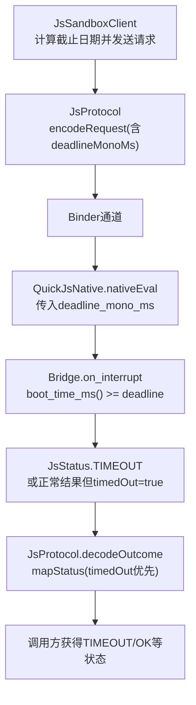
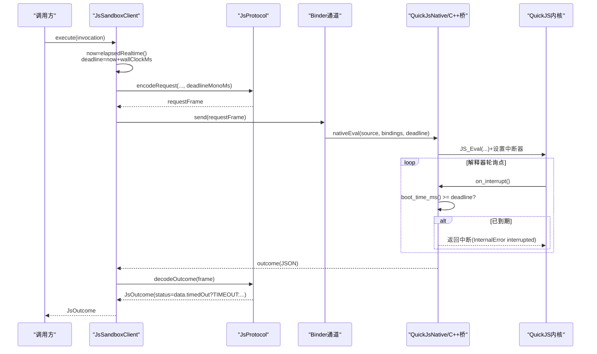
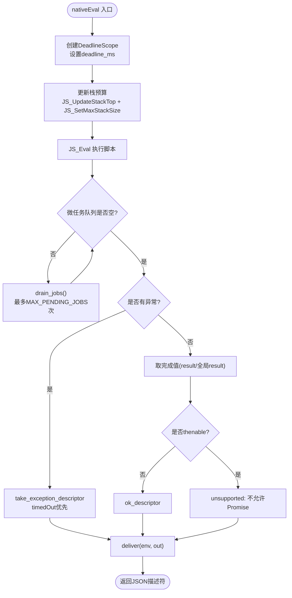
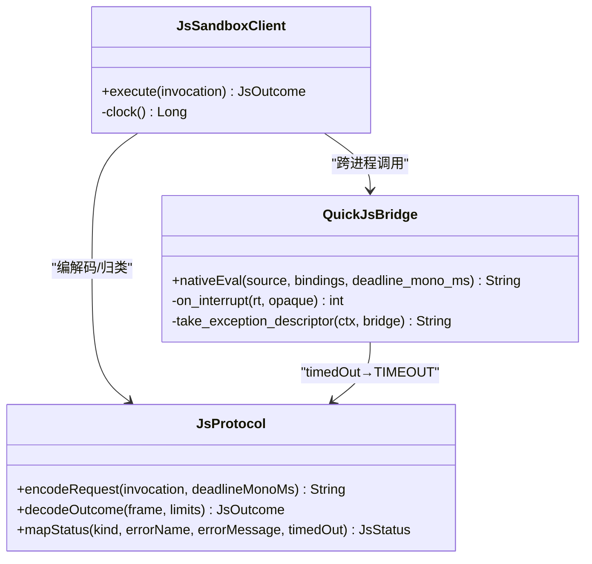
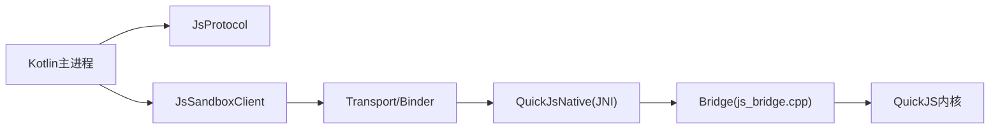

# 挂钟超时限制

<cite>
**本文引用的文件**
- [JsLimits.kt](file://lib_book_source/src/main/java/com/ebook/source/sandbox/JsLimits.kt)
- [JsSandboxClient.kt](file://lib_book_source/src/main/java/com/ebook/source/sandbox/JsSandboxClient.kt)
- [JsProtocol.kt](file://lib_book_source/src/main/java/com/ebook/source/sandbox/JsProtocol.kt)
- [js_bridge.cpp](file://lib_book_source/src/main/cpp/bridge/js_bridge.cpp)
- [0028-untrusted-js-sandbox.md](file://docs/adr/0028-untrusted-js-sandbox.md)
- [JsSandboxClientTest.kt](file://lib_book_source/src/test/java/com/ebook/source/sandbox/JsSandboxClientTest.kt)
- [JsCallbackProxyTest.kt](file://lib_book_source/src/test/java/com/ebook/source/sandbox/JsCallbackProxyTest.kt)
- [DirectJsRuntime.kt](file://lib_book_source/src/test/java/com/ebook/source/sandbox/DirectJsRuntime.kt)
</cite>

## 目录
1. [简介](#简介)
2. [项目结构（与超时相关）](#项目结构与超时相关)
3. [核心组件](#核心组件)
4. [架构总览](#架构总览)
5. [详细组件分析](#详细组件分析)
6. [依赖关系分析](#依赖关系分析)
7. [性能考虑](#性能考虑)
8. [故障排查指南](#故障排查指南)
9. [结论](#结论)
10. [附录](#附录)

## 简介
本文件聚焦“挂钟超时限制”的完整实现与使用：解释 wallClockMs 配置项如何生效、SystemClock.elapsedRealtime() 单调时钟为何被选用、内核中断处理器 JS_SetInterruptHandler 的配置过程与超时判定逻辑；阐述沙箱任务的执行时间监控（请求帧 deadlineMonoMs 传递、执行器侧 now() 注入与检查点）、超时状态码 JsStatus.TIMEOUT 的生成与传播路径，以及超时后的上下文重置策略。同时区分“超时”与“堆/栈超限”的不同语义：超时是主动打断而非被动崩溃，并提供阈值调优建议、不同书源类型的合理超时设置、调试方法与日志分析技巧。

## 项目结构（与超时相关）
围绕挂钟超时的关键代码分布在 Kotlin 主进程侧与 C++ 执行器侧：
- 主进程侧
  - JsLimits：集中定义 wallClockMs、堆/栈/报文上限等所有限制参数
  - JsSandboxClient：计算截止日期、串行执行、host 回调中继、主线程守卫
  - JsProtocol：请求/响应帧编解码、status 归类、deadline 字段契约
- 执行器侧（C++）
  - js_bridge.cpp：QuickJS runtime/context 管理、分配器接管、栈预算、中断器 on_interrupt、deadline 比较、微任务队列保护、完成值序列化与异常描述符构造
- 文档
  - ADR-0028：不可信 JS 执行的总体决策，含资源限制四件套与协议要点

**图表来源**
- [JsSandboxClient.kt:20-33](file://lib_book_source/src/main/java/com/ebook/source/sandbox/JsSandboxClient.kt#L20-L33)
- [JsProtocol.kt:84-98](file://lib_book_source/src/main/java/com/ebook/source/sandbox/JsProtocol.kt#L84-L98)
- [js_bridge.cpp:109-122](file://lib_book_source/src/main/cpp/bridge/js_bridge.cpp#L109-L122)
- [js_bridge.cpp:272-281](file://lib_book_source/src/main/cpp/bridge/js_bridge.cpp#L272-L281)
- [JsProtocol.kt:186-202](file://lib_book_source/src/main/java/com/ebook/source/sandbox/JsProtocol.kt#L186-L202)

**章节来源**
- [JsLimits.kt:13-58](file://lib_book_source/src/main/java/com/ebook/source/sandbox/JsLimits.kt#L13-L58)
- [JsSandboxClient.kt:20-33](file://lib_book_source/src/main/java/com/ebook/source/sandbox/JsSandboxClient.kt#L20-L33)
- [JsProtocol.kt:84-98](file://lib_book_source/src/main/java/com/ebook/source/sandbox/JsProtocol.kt#L84-L98)
- [js_bridge.cpp:109-122](file://lib_book_source/src/main/cpp/bridge/js_bridge.cpp#L109-L122)
- [js_bridge.cpp:272-281](file://lib_book_source/src/main/cpp/bridge/js_bridge.cpp#L272-L281)
- [JsProtocol.kt:186-202](file://lib_book_source/src/main/java/com/ebook/source/sandbox/JsProtocol.kt#L186-L202)

## 核心组件
- JsLimits：wallClockMs 为单次执行的挂钟上限（毫秒），由执行器线程的中断器逐轮比对。该值用于跨进程统一超时口径。
- JsSandboxClient：以 SystemClock.elapsedRealtime() 作为单调时钟计算 deadline = now + wallClockMs，并将 deadlineMonoMs 放入请求帧；对主线程调用进行拒绝；在 inFlight 锁内串行执行，保证同一时刻仅一帧在飞。
- JsProtocol：请求帧携带 deadlineMonoMs（单调毫秒，BOOTTIME/ELAPSED_REALTIME 同口径）；响应解码时 mapStatus 优先按 timedOut 判定 TIMEOUT，即使返回值为 ok 也视为超时。
- js_bridge.cpp：安装 JS_SetInterruptHandler(on_interrupt)，on_interrupt 中比较 boot_time_ms() 与 deadline；若超时则置位 interrupted；nativeEval 使用 DeadlineScope 设置/清理 deadline；栈预算每次执行前按当前线程剩余栈校准；微任务队列有上限防止自驱动 Promise 循环绕过超时。

**章节来源**
- [JsLimits.kt:13-58](file://lib_book_source/src/main/java/com/ebook/source/sandbox/JsLimits.kt#L13-L58)
- [JsSandboxClient.kt:20-33](file://lib_book_source/src/main/java/com/ebook/source/sandbox/JsSandboxClient.kt#L20-L33)
- [JsProtocol.kt:84-98](file://lib_book_source/src/main/java/com/ebook/source/sandbox/JsProtocol.kt#L84-L98)
- [JsProtocol.kt:186-202](file://lib_book_source/src/main/java/com/ebook/source/sandbox/JsProtocol.kt#L186-L202)
- [js_bridge.cpp:272-281](file://lib_book_source/src/main/cpp/bridge/js_bridge.cpp#L272-L281)
- [js_bridge.cpp:283-296](file://lib_book_source/src/main/cpp/bridge/js_bridge.cpp#L283-L296)
- [js_bridge.cpp:764-820](file://lib_book_source/src/main/cpp/bridge/js_bridge.cpp#L764-L820)

## 架构总览
下图展示了从主进程到执行器的完整超时链路：主进程计算绝对截止时间并随请求帧下发；执行器侧通过内核中断器在每个解释器轮询点检查是否到达截止；若到达，则标记超时并在结果中反映；主进程解码时将 timedOut 优先映射为 TIMEOUT。

**图表来源**
- [JsSandboxClient.kt:65-83](file://lib_book_source/src/main/java/com/ebook/source/sandbox/JsSandboxClient.kt#L65-L83)
- [JsProtocol.kt:127-138](file://lib_book_source/src/main/java/com/ebook/source/sandbox/JsProtocol.kt#L127-L138)
- [js_bridge.cpp:272-281](file://lib_book_source/src/main/cpp/bridge/js_bridge.cpp#L272-L281)
- [js_bridge.cpp:764-820](file://lib_book_source/src/main/cpp/bridge/js_bridge.cpp#L764-L820)
- [JsProtocol.kt:186-202](file://lib_book_source/src/main/java/com/ebook/source/sandbox/JsProtocol.kt#L186-L202)

## 详细组件分析

### JsLimits：wallClockMs 与整体限制
- wallClockMs：默认 5000ms，表示单条脚本执行的最长挂钟时长。注意它不保证打断阻塞中的 host call（host call 时限由主进程侧兜）。
- 其他限制：堆字节上限、栈字节上限、请求/响应/宿主回复最大字节数、回调重入深度、连接绑定超时、每任务网络代理请求次数上限等。这些限制共同构成安全与稳定性边界。

**章节来源**
- [JsLimits.kt:13-58](file://lib_book_source/src/main/java/com/ebook/source/sandbox/JsLimits.kt#L13-L58)

### JsSandboxClient：截止日期计算与执行控制
- 单调时钟：使用 SystemClock.elapsedRealtime()，跨进程可比，避免系统时间回拨导致期限失效。
- 主线程守卫：禁止在主线程调用，否则直接抛异常，避免 ANR。
- 串行化：inFlight 锁确保同一时刻仅一帧在执行，既保护 binder 事务缓冲上限（maxRequestBytes/maxOutcomeBytes）也避免多帧并发导致的时序混乱。
- 请求帧：encodeRequest 时计算 deadlineMonoMs = clock() + wallClockMs，并放入请求帧。

**章节来源**
- [JsSandboxClient.kt:20-33](file://lib_book_source/src/main/java/com/ebook/source/sandbox/JsSandboxClient.kt#L20-L33)
- [JsSandboxClient.kt:65-83](file://lib_book_source/src/main/java/com/ebook/source/sandbox/JsSandboxClient.kt#L65-L83)

### JsProtocol：deadline 字段与超时状态归类
- RequestFrame.deadlineMonoMs：绝对截止时间（毫秒，基于 BOOTTIME/ELAPSED_REALTIME 同口径单调时钟）。
- OutcomeFrame.status：由内核返回的 kind/errorName/message 与 timedOut 标志共同决定最终状态。
- mapStatus 优先级：当 timedOut 为真时，无论 kind 是否为 ok，均归类为 TIMEOUT；随后再按 errorName/message 区分内存/栈/语法/运行时错误。

**章节来源**
- [JsProtocol.kt:84-98](file://lib_book_source/src/main/java/com/ebook/source/sandbox/JsProtocol.kt#L84-L98)
- [JsProtocol.kt:186-202](file://lib_book_source/src/main/java/com/ebook/source/sandbox/JsProtocol.kt#L186-L202)

### C++ 桥接层：中断器、deadline 与上下文重置
- 单调时钟：boot_time_ms() 使用 CLOCK_BOOTTIME（或 Windows GetTickCount64），与主进程的 elapsedRealtime 同口径，休眠期间计时继续计入。
- 中断器 on_interrupt：每个解释器轮询点被调用，若 boot_time_ms() >= deadline 则置位 interrupted 并返回非 0，使当前求值以 InternalError("interrupted") 结束。
- DeadlineScope：每次 nativeEval 进入时设置 deadline，离开时恢复为 INT64_MAX，确保任务间 deadline 隔离。
- 栈预算：每次执行前刷新栈基线并按当前线程剩余栈计算实际可允许的最大栈深，避免 SIGSEGV。
- 微任务队列保护：MAX_PENDING_JOBS 限制自驱动的 Promise 循环绕过超时。
- 异常描述符：take_exception_descriptor 优先判断 timedOut；若堆到限且异常无法表达独立信息，则输出 OOM 描述符；支持 unsupported API 前缀识别。

**图表来源**
- [js_bridge.cpp:283-296](file://lib_book_source/src/main/cpp/bridge/js_bridge.cpp#L283-L296)
- [js_bridge.cpp:764-820](file://lib_book_source/src/main/cpp/bridge/js_bridge.cpp#L764-L820)
- [js_bridge.cpp:466-520](file://lib_book_source/src/main/cpp/bridge/js_bridge.cpp#L466-L520)
- [js_bridge.cpp:522-539](file://lib_book_source/src/main/cpp/bridge/js_bridge.cpp#L522-L539)

**章节来源**
- [js_bridge.cpp:109-122](file://lib_book_source/src/main/cpp/bridge/js_bridge.cpp#L109-L122)
- [js_bridge.cpp:272-281](file://lib_book_source/src/main/cpp/bridge/js_bridge.cpp#L272-L281)
- [js_bridge.cpp:283-296](file://lib_book_source/src/main/cpp/bridge/js_bridge.cpp#L283-L296)
- [js_bridge.cpp:764-820](file://lib_book_source/src/main/cpp/bridge/js_bridge.cpp#L764-L820)
- [js_bridge.cpp:466-520](file://lib_book_source/src/main/cpp/bridge/js_bridge.cpp#L466-L520)

### 超时状态码 JsStatus.TIMEOUT 的生成与传播
- 生成位置：
  - 执行器侧：on_interrupt 置位 interrupted；nativeEval 结束时 take_exception_descriptor 读取 interrupted 或再次比较 deadline，得到 timedOut=true。
  - 主进程侧：JsProtocol.mapStatus 将 timedOut=true 的情况优先映射为 TIMEOUT，即便 kind="ok"。
- 传播路径：
  - 执行器 → 主进程：outcome JSON 包含 status/timedOut/data/error
  - 主进程：decodeOutcome 解析后 mapStatus 得出 JsStatus.TIMEOUT
  - 调用方：根据 JsOutcome.status 进行上层处置（如重试、降级、提示）

**图表来源**
- [JsProtocol.kt:127-138](file://lib_book_source/src/main/java/com/ebook/source/sandbox/JsProtocol.kt#L127-L138)
- [JsProtocol.kt:186-202](file://lib_book_source/src/main/java/com/ebook/source/sandbox/JsProtocol.kt#L186-L202)
- [js_bridge.cpp:272-281](file://lib_book_source/src/main/cpp/bridge/js_bridge.cpp#L272-L281)
- [js_bridge.cpp:466-520](file://lib_book_source/src/main/cpp/bridge/js_bridge.cpp#L466-L520)

**章节来源**
- [JsProtocol.kt:186-202](file://lib_book_source/src/main/java/com/ebook/source/sandbox/JsProtocol.kt#L186-L202)
- [js_bridge.cpp:272-281](file://lib_book_source/src/main/cpp/bridge/js_bridge.cpp#L272-L281)
- [js_bridge.cpp:466-520](file://lib_book_source/src/main/cpp/bridge/js_bridge.cpp#L466-L520)

### 超时与堆/栈超限的区别
- 超时（TIMEOUT）：主动打断。由内核中断器在解释器轮询点检测 deadline 到达而终止执行；即使完成值已经拿到，只要 timedOut=true，仍视为超时。
- 堆/栈超限（MEMORY/STACK）：资源耗尽导致的失败。堆超限由桥接层接管分配器记录 oom_refused；栈超限由栈预算限制与内核栈检查触发。两者属于被动崩溃/失败，而非主动打断。
- 分类优先级：mapStatus 中 timedOut 优先于 memory/stack 文本匹配，避免把超时误报成内存问题。

**章节来源**
- [JsProtocol.kt:186-202](file://lib_book_source/src/main/java/com/ebook/source/sandbox/JsProtocol.kt#L186-L202)
- [js_bridge.cpp:141-205](file://lib_book_source/src/main/cpp/bridge/js_bridge.cpp#L141-L205)
- [js_bridge.cpp:214-270](file://lib_book_source/src/main/cpp/bridge/js_bridge.cpp#L214-L270)
- [js_bridge.cpp:466-520](file://lib_book_source/src/main/cpp/bridge/js_bridge.cpp#L466-L520)

### 超时后的上下文重置策略
- 任务边界：每次 nativeEval 使用 DeadlineScope 设置/清理 deadline；context 在 reset 时被销毁并重建，globalThis、闭包、待办微任务全部清除，避免污染下一条规则。
- 中断标志与 OOM 标记：在 DeadlineScope 构造时清零 interrupted 与 oom_refused，确保本次执行的状态不会泄漏到下一次。
- 栈预算：每次执行前刷新栈基线并重新计算预算，适应不同线程栈大小。

**章节来源**
- [js_bridge.cpp:283-296](file://lib_book_source/src/main/cpp/bridge/js_bridge.cpp#L283-L296)
- [js_bridge.cpp:720-751](file://lib_book_source/src/main/cpp/bridge/js_bridge.cpp#L720-L751)
- [js_bridge.cpp:764-820](file://lib_book_source/src/main/cpp/bridge/js_bridge.cpp#L764-L820)

### 超时阈值的调优建议
- 默认 wallClockMs=5000ms，适用于大多数正则回溯型或中等复杂度的正文解析场景。
- 对于正则回溯密集型源（例如复杂 HTML 抽取、大量正则匹配）：可适当提高至 5000–8000ms，但仍需结合页面大小与网络延迟评估。
- 对于网络请求密集型源（大量 ajax/fetch）：由于 host call 阻塞不在内核中断范围内，需依靠主进程侧的请求级超时与任务级 wallClockMs 联合控制；建议保持 5000ms 左右，并通过 maxRequestsPerTask 限制外呼次数，避免长时间占用。
- 并发与排队：客户端 inFlight 锁串行化执行，排在后面的请求会继承同一个 deadline，等待超时即报 TIMEOUT，这比静默延长执行更真实。

**章节来源**
- [JsLimits.kt:13-58](file://lib_book_source/src/main/java/com/ebook/source/sandbox/JsLimits.kt#L13-L58)
- [JsSandboxClient.kt:20-33](file://lib_book_source/src/main/java/com/ebook/source/sandbox/JsSandboxClient.kt#L20-L33)
- [0028-untrusted-js-sandbox.md:31-36](file://docs/adr/0028-untrusted-js-sandbox.md#L31-L36)

### 调试方法与日志分析技巧
- 确认单调时钟一致性：测试中 DirectJsRuntime 通过二分探针校准 boot_time_ms() 与 deadline 的关系，确保超时判据有效。
- 观察超时事件：JsSandboxClientTest 验证请求帧包含正确的 deadlineMonoMs；JsCallbackProxyTest 验证 host 回调超时返回失败话术且不穿透代理边界。
- 定位超时原因：查看 outcome 的 status 与 error；若为 TIMEOUT，检查脚本是否存在死循环或微任务自驱动循环（MAX_PENDING_JOBS 限制）；若为 MEMORY/STACK，检查堆/栈配置与脚本递归深度。
- 日志关键字：关注桥接层日志（EbookJs）、协议解码失败（帧形态不符）、通道异常（断连重放）、超时与未可用状态。

**章节来源**
- [DirectJsRuntime.kt:87-109](file://lib_book_source/src/test/java/com/ebook/source/sandbox/DirectJsRuntime.kt#L87-L109)
- [JsSandboxClientTest.kt:66-76](file://lib_book_source/src/test/java/com/ebook/source/sandbox/JsSandboxClientTest.kt#L66-L76)
- [JsCallbackProxyTest.kt:226-232](file://lib_book_source/src/test/java/com/ebook/source/sandbox/JsCallbackProxyTest.kt#L226-L232)

## 依赖关系分析
- 主进程侧依赖：
  - JsSandboxClient 依赖 JsProtocol 进行帧编解码与状态归类
  - JsSandboxClient 通过 openChannel 抽象与执行器通信（Binder/Transport）
- 执行器侧依赖：
  - QuickJsNative 暴露 JNI 接口给 Kotlin 调用
  - js_bridge.cpp 依赖 QuickJS 内核头与 Android NDK 接口（pthread/GetTickCount64）
- 外部约束：
  - 单调时钟必须一致：主进程 elapsedRealtime 与执行器 boot_time_ms 同口径
  - 协议兼容性：JsProtocol 严格解码，未知键/模式名会报错，避免静默丢字段

**图表来源**
- [JsSandboxClient.kt:65-83](file://lib_book_source/src/main/java/com/ebook/source/sandbox/JsSandboxClient.kt#L65-L83)
- [JsProtocol.kt:127-138](file://lib_book_source/src/main/java/com/ebook/source/sandbox/JsProtocol.kt#L127-L138)
- [js_bridge.cpp:691-718](file://lib_book_source/src/main/cpp/bridge/js_bridge.cpp#L691-L718)

**章节来源**
- [JsSandboxClient.kt:65-83](file://lib_book_source/src/main/java/com/ebook/source/sandbox/JsSandboxClient.kt#L65-L83)
- [JsProtocol.kt:127-138](file://lib_book_source/src/main/java/com/ebook/source/sandbox/JsProtocol.kt#L127-L138)
- [js_bridge.cpp:691-718](file://lib_book_source/src/main/cpp/bridge/js_bridge.cpp#L691-L718)

## 性能考虑
- wallClockMs 过短会导致频繁超时，过长则可能拖慢整体解析吞吐。建议按书源类型调优：
  - 正则回溯密集型：适当提高上限，但需配合内容大小与网络延迟评估
  - 网络请求密集型：控制 maxRequestsPerTask，避免长时间阻塞 host call
- 串行执行带来的排队效应：inFlight 锁保证正确性，但也会造成后续请求等待；deadline 能如实反映排队等待时间，避免虚假成功。
- 栈预算与堆限制：栈预算按线程剩余栈动态调整，避免 SIGSEGV；堆限制通过分配器接管精确记账，避免漏判。

[本节提供通用指导，不直接分析具体文件]

## 故障排查指南
- 症状：TIMEOUT 频繁出现
  - 检查 wallClockMs 是否过小
  - 查看脚本是否存在死循环或微任务自驱动循环（MAX_PENDING_JOBS 限制）
  - 确认 host call 是否长时间阻塞（主进程侧请求级超时）
- 症状：MEMORY/STACK 错误
  - 检查堆/栈配置是否合理
  - 分析脚本递归深度与对象分配行为
- 日志关键词：
  - “帧形态不符”：两侧构建不同步
  - “断连且重连失败”：通道不稳定
  - “超时”、“未进内核”：deadline 已过或排队超时

**章节来源**
- [JsProtocol.kt:251-255](file://lib_book_source/src/main/java/com/ebook/source/sandbox/JsProtocol.kt#L251-L255)
- [JsSandboxClient.kt:116-135](file://lib_book_source/src/main/java/com/ebook/source/sandbox/JsSandboxClient.kt#L116-L135)
- [js_bridge.cpp:522-539](file://lib_book_source/src/main/cpp/bridge/js_bridge.cpp#L522-L539)

## 结论
挂钟超时限制通过主进程计算绝对截止时间、执行器侧内核中断器定期检查 deadline 的方式实现，确保脚本执行在可控时间内终止。wallClockMs 是统一超时口径的关键参数，配合单调时钟保障跨进程一致性。超时与资源超限（堆/栈）在语义与处理路径上明确区分：超时是主动打断，资源超限是被动失败。通过合理的阈值调优、严格的上下文重置与完善的调试手段，可在保证稳定性的前提下提升书源解析效率。

[本节总结性内容，不直接分析具体文件]

## 附录
- 参考 ADR-0028：不可信 JS 执行的整体设计与资源限制策略
- 测试用例：JsSandboxClientTest、JsCallbackProxyTest、DirectJsRuntime 提供了超时行为的验证与校准方法

**章节来源**
- [0028-untrusted-js-sandbox.md:31-36](file://docs/adr/0028-untrusted-js-sandbox.md#L31-L36)
- [JsSandboxClientTest.kt:66-76](file://lib_book_source/src/test/java/com/ebook/source/sandbox/JsSandboxClientTest.kt#L66-L76)
- [JsCallbackProxyTest.kt:226-232](file://lib_book_source/src/test/java/com/ebook/source/sandbox/JsCallbackProxyTest.kt#L226-L232)
- [DirectJsRuntime.kt:87-109](file://lib_book_source/src/test/java/com/ebook/source/sandbox/DirectJsRuntime.kt#L87-L109)