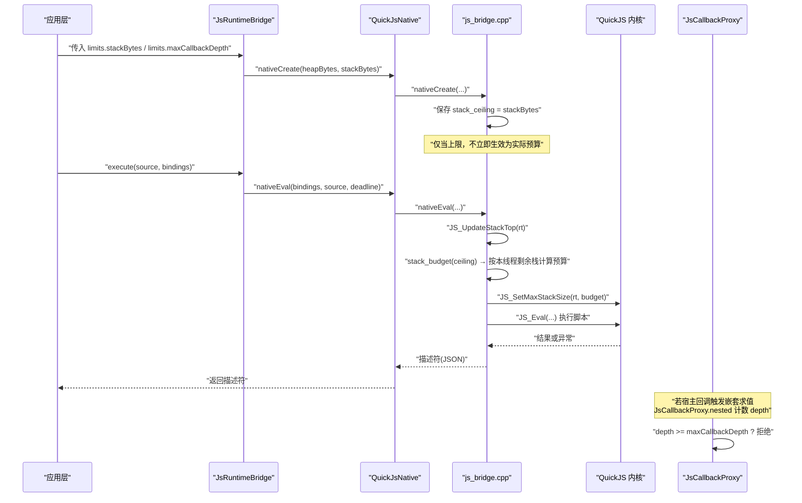
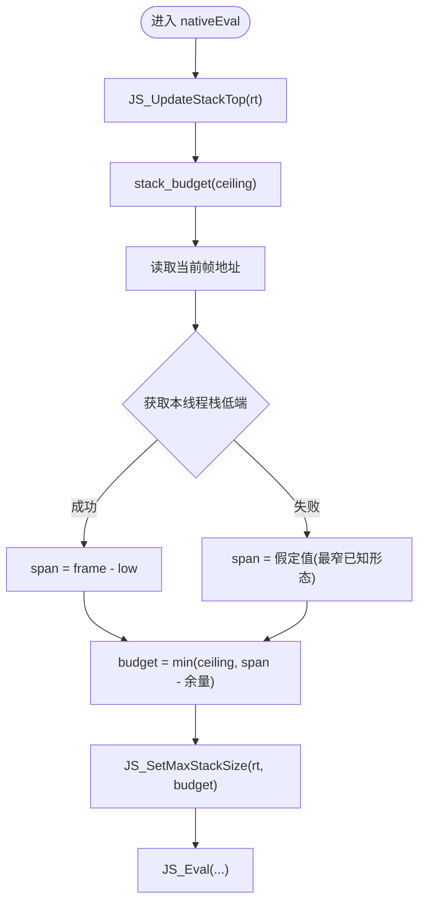
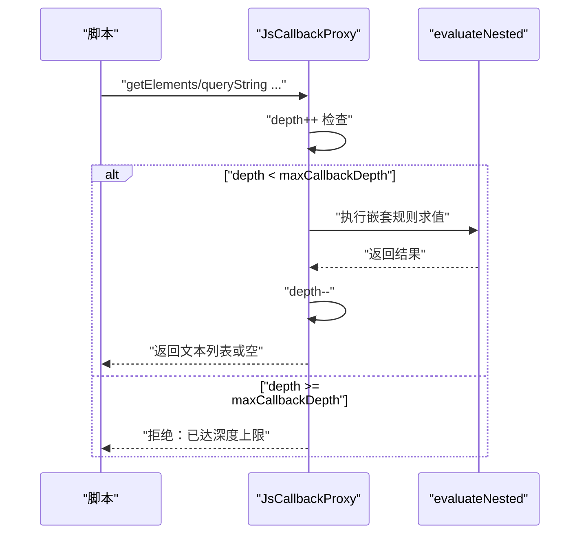
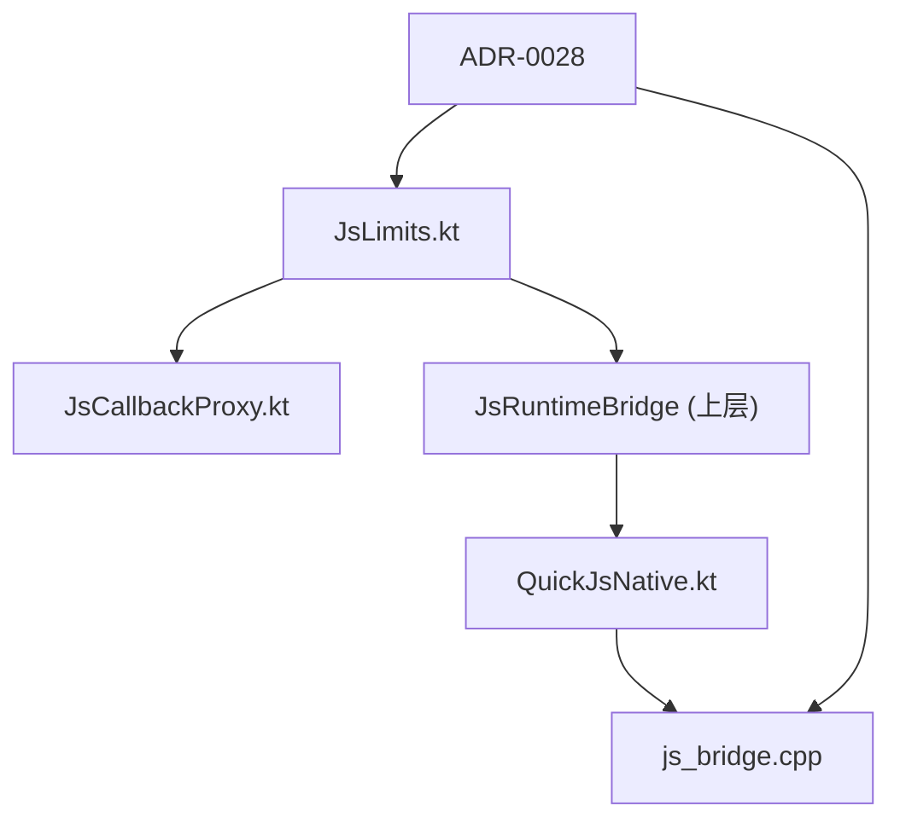

# 栈深度保护

<cite>
**本文引用的文件**
- [js_bridge.cpp](file://lib_book_source/src/main/cpp/bridge/js_bridge.cpp)
- [JsLimits.kt](file://lib_book_source/src/main/java/com/ebook/source/sandbox/JsLimits.kt)
- [JsCallbackProxy.kt](file://lib_book_source/src/main/java/com/ebook/source/sandbox/JsCallbackProxy.kt)
- [QuickJsNative.kt](file://lib_book_source/src/main/java/com/ebook/source/sandbox/QuickJsNative.kt)
- [0028-untrusted-js-sandbox.md](file://docs/adr/0028-untrusted-js-sandbox.md)
</cite>

## 目录
1. [引言](#引言)
2. [项目结构中的相关位置](#项目结构中的相关位置)
3. [核心组件与职责](#核心组件与职责)
4. [架构总览：从配置到崩溃防护的调用链](#架构总览从配置到崩溃防护的调用链)
5. [关键实现详解](#关键实现详解)
6. [依赖关系分析](#依赖关系分析)
7. [性能与行为特性](#性能与行为特性)
8. [故障排查与调试指南](#故障排查与调试指南)
9. [结论](#结论)

## 引言
本文面向“脚本执行器”的栈深度保护机制，围绕 stackBytes 配置项、JS_SetMaxStackSize 的作用方式、原生栈空间检查与 SIGSEGV 风险、不同线程栈大小差异的影响，以及回调重入深度限制 maxCallbackDepth 的协同策略展开。目标是让读者既能理解“天花板与实际剩余栈”的区别，也能在实际问题中定位是内核栈溢出还是回调重入导致的异常路径。

## 项目结构中的相关位置
- 原生桥接与 QuickJS 集成：lib_book_source/src/main/cpp/bridge/js_bridge.cpp
- 沙箱资源限制定义：lib_book_source/src/main/java/com/ebook/source/sandbox/JsLimits.kt
- 回调代理与嵌套求值深度限制：lib_book_source/src/main/java/com/ebook/source/sandbox/JsCallbackProxy.kt
- JNI 入口声明：lib_book_source/src/main/java/com/ebook/source/sandbox/QuickJsNative.kt
- 安全决策背景（含栈上限语义说明）：docs/adr/0028-untrusted-js-sandbox.md

**章节来源**
- [js_bridge.cpp:106-117](file://lib_book_source/src/main/cpp/bridge/js_bridge.cpp#L106-L117)
- [js_bridge.cpp:214-270](file://lib_book_source/src/main/cpp/bridge/js_bridge.cpp#L214-L270)
- [js_bridge.cpp:696-718](file://lib_book_source/src/main/cpp/bridge/js_bridge.cpp#L696-L718)
- [js_bridge.cpp:764-784](file://lib_book_source/src/main/cpp/bridge/js_bridge.cpp#L764-L784)
- [JsLimits.kt:13-26](file://lib_book_source/src/main/java/com/ebook/source/sandbox/JsLimits.kt#L13-L26)
- [JsCallbackProxy.kt:413-430](file://lib_book_source/src/main/java/com/ebook/source/sandbox/JsCallbackProxy.kt#L413-L430)
- [QuickJsNative.kt:38-51](file://lib_book_source/src/main/java/com/ebook/source/sandbox/QuickJsNative.kt#L38-L51)
- [0028-untrusted-js-sandbox.md:31-35](file://docs/adr/0028-untrusted-js-sandbox.md#L31-L35)

## 核心组件与职责
- JsLimits：集中定义沙箱的四项资源限制（挂钟超时、堆上限、栈上限、请求/响应/回调字节上限），并明确 stackBytes 的“天花板”语义与 maxCallbackDepth 的定位。
- js_bridge.cpp：QuickJS 桥接层，负责创建 runtime、设置内存/中断处理、每次执行前刷新栈基线与预算、评估脚本、收集异常描述符。
- JsCallbackProxy：主进程侧回调代理，提供网络/变量/日志等能力，并对“嵌套规则求值”进行深度计数，超过 maxCallbackDepth 直接拒绝。
- QuickJsNative：JNI 声明，将 nativeCreate/nativeEval 暴露给上层调用。

**章节来源**
- [JsLimits.kt:13-26](file://lib_book_source/src/main/java/com/ebook/source/sandbox/JsLimits.kt#L13-L26)
- [JsLimits.kt:43-44](file://lib_book_source/src/main/java/com/ebook/source/sandbox/JsLimits.kt#L43-L44)
- [js_bridge.cpp:91-107](file://lib_book_source/src/main/cpp/bridge/js_bridge.cpp#L91-L107)
- [js_bridge.cpp:696-718](file://lib_book_source/src/main/cpp/bridge/js_bridge.cpp#L696-L718)
- [JsCallbackProxy.kt:89-91](file://lib_book_source/src/main/java/com/ebook/source/sandbox/JsCallbackProxy.kt#L89-L91)
- [QuickJsNative.kt:38-51](file://lib_book_source/src/main/java/com/ebook/source/sandbox/QuickJsNative.kt#L38-L51)

## 架构总览：从配置到崩溃防护的调用链
下图展示了从上层配置到原生栈检查的关键路径，以及回调重入深度限制的并行防线。

**图表来源**
- [js_bridge.cpp:696-718](file://lib_book_source/src/main/cpp/bridge/js_bridge.cpp#L696-L718)
- [js_bridge.cpp:764-784](file://lib_book_source/src/main/cpp/bridge/js_bridge.cpp#L764-L784)
- [js_bridge.cpp:259-270](file://lib_book_source/src/main/cpp/bridge/js_bridge.cpp#L259-L270)
- [JsCallbackProxy.kt:413-430](file://lib_book_source/src/main/java/com/ebook/source/sandbox/JsCallbackProxy.kt#L413-L430)

**章节来源**
- [js_bridge.cpp:696-718](file://lib_book_source/src/main/cpp/bridge/js_bridge.cpp#L696-L718)
- [js_bridge.cpp:764-784](file://lib_book_source/src/main/cpp/bridge/js_bridge.cpp#L764-L784)
- [js_bridge.cpp:259-270](file://lib_book_source/src/main/cpp/bridge/js_bridge.cpp#L259-L270)
- [JsCallbackProxy.kt:413-430](file://lib_book_source/src/main/java/com/ebook/source/sandbox/JsCallbackProxy.kt#L413-L430)

## 关键实现详解

### stackBytes 的语义：“天花板”而非“实际可用栈”
- stackBytes 默认值为 1MB，表示“栈上限天花板”。它不是当前线程可用的全部栈，而是对“距栈顶已用字节数”的上限约束。
- 真正的“剩余栈”取决于“当前运行在哪个线程”。Android 上不同线程档位不同：应用内新建 Java 线程约 512KB；binder 线程与主线程各自有另一档尺寸。同一进程里 binder 每次也可能换线程。
- 如果按 1MB 的天花板去限制一个只有 512KB 栈的线程，深递归会先撞穿 native 栈，触发 SIGSEGV，整个 :js 进程崩溃，来不及抛内核的 stack overflow 异常。因此必须在每次执行前按“本线程剩余栈”再收一道，把配置值当作天花板使用。

**章节来源**
- [JsLimits.kt:18-26](file://lib_book_source/src/main/java/com/ebook/source/sandbox/JsLimits.kt#L18-L26)
- [0028-untrusted-js-sandbox.md:31-35](file://docs/adr/0028-untrusted-js-sandbox.md#L31-L35)
- [js_bridge.cpp:214-226](file://lib_book_source/src/main/cpp/bridge/js_bridge.cpp#L214-L226)

### JS_SetMaxStackSize 的配置机制与原生栈检查原理
- JS_SetMaxStackSize(rt, size) 设置的是“距 stack_top 已用多少字节”即触发栈溢出。quickjs.c 内部维护 stack_limit = stack_top - stack_size。
- 因此“预算”必须结合当前线程的栈基线来计算：
  - 每次执行前调用 JS_UpdateStackTop(rt)，更新当前线程的栈顶。
  - 通过 thread_stack_low 获取当前线程栈低端地址，结合 __builtin_frame_address(0) 得到当前帧指针，估算剩余栈跨度。
  - 减去固定余量 STACK_HEADROOM_BYTES（覆盖 JNI trampoline、ART/Kotlin 帧、每次 JS 调用的 C 帧开销）。
  - 最终取 min(ceiling, span - headroom)，且至少返回 1（避免 0 被内核视为“不限”）。
- 该逻辑在 nativeEval 入口处执行，确保“每次执行都按当前线程的真实栈现算预算”。

**图表来源**
- [js_bridge.cpp:764-784](file://lib_book_source/src/main/cpp/bridge/js_bridge.cpp#L764-L784)
- [js_bridge.cpp:237-270](file://lib_book_source/src/main/cpp/bridge/js_bridge.cpp#L237-L270)

**章节来源**
- [js_bridge.cpp:237-270](file://lib_book_source/src/main/cpp/bridge/js_bridge.cpp#L237-L270)
- [js_bridge.cpp:764-784](file://lib_book_source/src/main/cpp/bridge/js_bridge.cpp#L764-L784)

### 栈溢出防护策略与 SIGSEGV 的原因
- 内核栈检查基于“距 stack_top 已用字节数”，而不是“绝对栈底”。如果配置的 ceiling 大于当前线程实际剩余栈，则深递归会在达到内核检查之前就把 native 栈撞穿，触发 SIGSEGV。
- 设备实测表明：在 512KB 栈的线程上以 1MB 的 ceiling 运行，深递归直接导致 SIGSEGV，来不及抛出“stack overflow”异常。
- 防护要点：
  - 每次执行前刷新栈基线（JS_UpdateStackTop）。
  - 按本线程剩余栈计算预算，扣除 JNI/ART/Kotlin 帧与每步 JS 调用的 C 栈开销。
  - 保证最小预算为 1，避免 0 被内核视为“不限”。

**章节来源**
- [js_bridge.cpp:214-231](file://lib_book_source/src/main/cpp/bridge/js_bridge.cpp#L214-L231)
- [js_bridge.cpp:259-270](file://lib_book_source/src/main/cpp/bridge/js_bridge.cpp#L259-L270)
- [0028-untrusted-js-sandbox.md:31-35](file://docs/adr/0028-untrusted-js-sandbox.md#L31-L35)

### 不同线程栈大小的影响
- 应用内新建 Java 线程约 512KB；binder 线程与主线程各是另一档。
- 由于执行器可能在不同 binder 线程上运行，同一次 runtime 的“上次线程”和“本次线程”栈大小可能不同。因此不能只在创建时设置一次栈限，而应在每次执行前按当前线程重新计算预算。
- 未刷新会导致：1MB 的天花板压在 512KB 栈的线程上，深递归直接 SIGSEGV，而非可控的栈溢出错误。

**章节来源**
- [js_bridge.cpp:214-226](file://lib_book_source/src/main/cpp/bridge/js_bridge.cpp#L214-L226)
- [js_bridge.cpp:779-784](file://lib_book_source/src/main/cpp/bridge/js_bridge.cpp#L779-L784)

### 无限递归场景的检测与预防：maxCallbackDepth 的协同
- 除了内核栈检查，系统还在主进程侧对“嵌套规则求值”进行深度计数。JsCallbackProxy.nested 在进入时判断 depth >= maxCallbackDepth，超过即拒绝，避免“脚本套规则、规则再套脚本”的无限回退。
- 设计意图：
  - 嵌套求值走“关掉 JS 的上下文视图”，防止在同一 runtime 上再次进入 JS 造成双向死锁。
  - maxCallbackDepth 在此充当“绊线”，把“等待 wallClockMs 后出现难以诊断的 TIMEOUT”替换为“当场可诊断的深度超限”。
- 与栈上限的关系：
  - 栈上限负责阻止“单条执行路径过深”导致的崩溃；
  - 回调深度限制负责阻止“跨层嵌套”导致的不可控状态膨胀与潜在死锁。

**图表来源**
- [JsCallbackProxy.kt:413-430](file://lib_book_source/src/main/java/com/ebook/source/sandbox/JsCallbackProxy.kt#L413-L430)

**章节来源**
- [JsCallbackProxy.kt:89-91](file://lib_book_source/src/main/java/com/ebook/source/sandbox/JsCallbackProxy.kt#L89-L91)
- [JsCallbackProxy.kt:413-430](file://lib_book_source/src/main/java/com/ebook/source/sandbox/JsCallbackProxy.kt#L413-L430)
- [JsLimits.kt:43-44](file://lib_book_source/src/main/java/com/ebook/source/sandbox/JsLimits.kt#L43-L44)

## 依赖关系分析
- JsLimits 提供统一的限制常量，被 JsCallbackProxy 与上层装配点消费。
- QuickJsNative 作为 JNI 边界，将 Kotlin 调用映射到 C++ 的 nativeCreate/nativeEval。
- js_bridge.cpp 是安全关键路径：管理 runtime、分配器拦截、中断器、栈预算、异常分类。
- ADR 文档明确了“栈上限是天花板”的决策背景与设备实测依据，指导实现细节（每次执行前刷新栈基线与预算）。

**图表来源**
- [JsLimits.kt:13-26](file://lib_book_source/src/main/java/com/ebook/source/sandbox/JsLimits.kt#L13-L26)
- [JsCallbackProxy.kt:413-430](file://lib_book_source/src/main/java/com/ebook/source/sandbox/JsCallbackProxy.kt#L413-L430)
- [QuickJsNative.kt:38-51](file://lib_book_source/src/main/java/com/ebook/source/sandbox/QuickJsNative.kt#L38-L51)
- [js_bridge.cpp:696-784](file://lib_book_source/src/main/cpp/bridge/js_bridge.cpp#L696-L784)
- [0028-untrusted-js-sandbox.md:31-35](file://docs/adr/0028-untrusted-js-sandbox.md#L31-L35)

**章节来源**
- [JsLimits.kt:13-26](file://lib_book_source/src/main/java/com/ebook/source/sandbox/JsLimits.kt#L13-L26)
- [QuickJsNative.kt:38-51](file://lib_book_source/src/main/java/com/ebook/source/sandbox/QuickJsNative.kt#L38-L51)
- [js_bridge.cpp:696-784](file://lib_book_source/src/main/cpp/bridge/js_bridge.cpp#L696-L784)
- [0028-untrusted-js-sandbox.md:31-35](file://docs/adr/0028-untrusted-js-sandbox.md#L31-L35)

## 性能与行为特性
- 栈预算计算引入少量系统调用与指针运算，但仅在每次执行前执行一次，开销可控。
- 最大 pending jobs 限制用于防止微任务队列自驱动循环绕过 wall-clock 超时。
- 栈溢出由内核栈检查与“本线程剩余栈”双重保障，SIGSEGV 是最后兜底路径，正常应尽可能落在可控异常描述符。
- 回调深度限制在主进程侧，零额外系统调用，成本低且能提前阻断危险嵌套。

[本节为通用讨论，不直接引用具体代码行]

## 故障排查与调试指南
- 现象：深递归直接闪退（SIGSEGV），没有“stack overflow”提示。
  - 可能原因：当前线程栈小于配置的 ceiling，导致 native 栈先撞穿。
  - 排查要点：
    - 确认执行发生在哪类线程（应用线程、binder 线程、主线程）。
    - 确认每次执行前是否调用了 JS_UpdateStackTop 与 JS_SetMaxStackSize。
    - 检查栈预算是否被“剩余栈 - 余量”正确收窄。
- 现象：嵌套规则求值报“已达深度上限”。
  - 可能原因：maxCallbackDepth 被触发，属于预期保护。
  - 排查要点：
    - 查看 JsCallbackProxy.nested 的 depth 计数逻辑。
    - 检查 evaluateNested 是否正确传入“关闭 JS 的上下文”。
- 现象：长时间无响应或超时。
  - 可能原因：微任务队列自驱动循环或 host call 阻塞。
  - 排查要点：
    - 观察 MAX_PENDING_JOBS 限制是否命中。
    - 检查 host call 的超时与队列排空逻辑。

**章节来源**
- [js_bridge.cpp:214-231](file://lib_book_source/src/main/cpp/bridge/js_bridge.cpp#L214-L231)
- [js_bridge.cpp:259-270](file://lib_book_source/src/main/cpp/bridge/js_bridge.cpp#L259-L270)
- [js_bridge.cpp:764-784](file://lib_book_source/src/main/cpp/bridge/js_bridge.cpp#L764-L784)
- [JsCallbackProxy.kt:413-430](file://lib_book_source/src/main/java/com/ebook/source/sandbox/JsCallbackProxy.kt#L413-L430)

## 结论
- stackBytes=1MB 是“栈上限天花板”，不是当前线程的实际可用栈。真正生效的预算需要在每次执行前按本线程剩余栈计算。
- JS_SetMaxStackSize 的内核栈检查基于“距 stack_top 已用字节数”，因此必须配合 JS_UpdateStackTop 与栈预算函数，确保不会因线程栈较小而直接 SIGSEGV。
- 不同线程栈大小差异显著，执行器可能在不同 binder 线程上运行，因此“每次执行前刷新栈基线与预算”是关键。
- 回调重入深度限制 maxCallbackDepth 与栈上限互补：前者防“跨层嵌套”带来的状态膨胀与死锁，后者防“单路径过深”导致的崩溃。
- 遇到闪退或超时问题时，优先检查线程栈、预算刷新、pending jobs 与回调深度计数，逐步缩小问题范围。

[本节为总结性内容，不直接引用具体代码行]