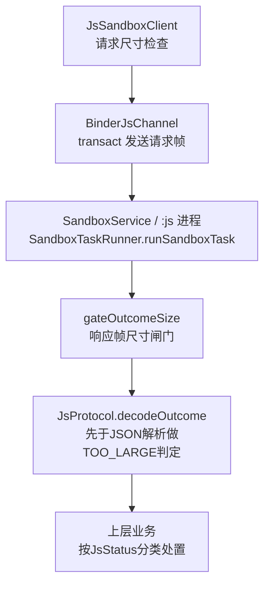
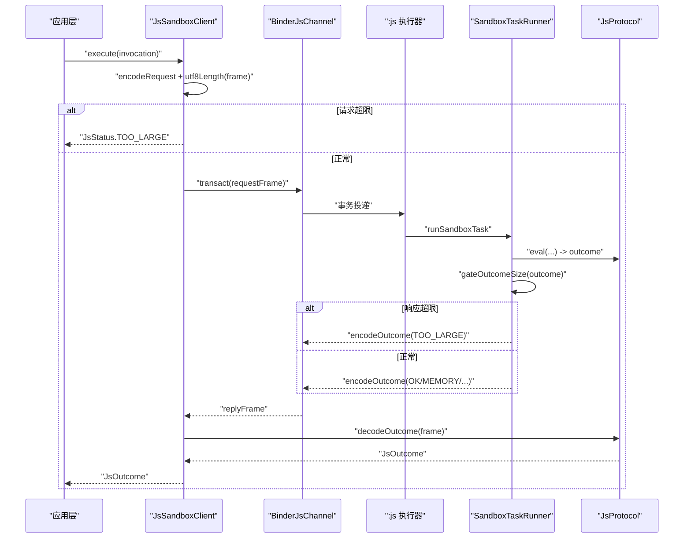
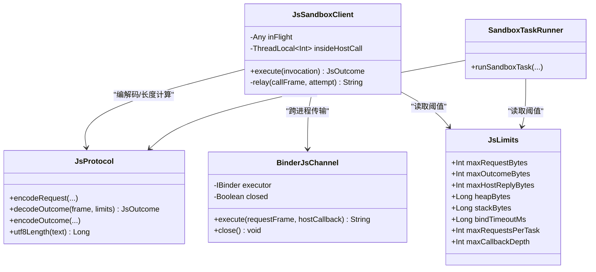
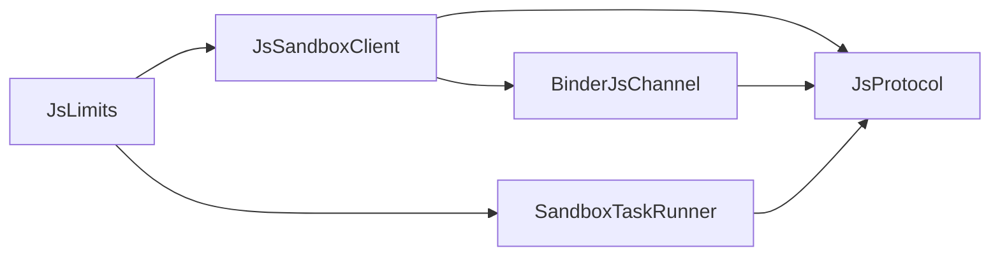
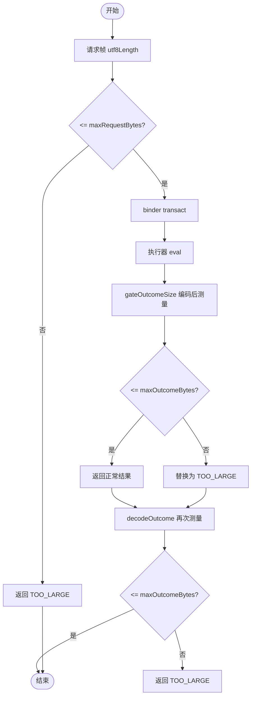

# 请求响应大小限制

<cite>
**本文引用的文件**
- [JsLimits.kt](file://lib_book_source/src/main/java/com/ebook/source/sandbox/JsLimits.kt)
- [JsSandboxClient.kt](file://lib_book_source/src/main/java/com/ebook/source/sandbox/JsSandboxClient.kt)
- [JsProtocol.kt](file://lib_book_source/src/main/java/com/ebook/source/sandbox/JsProtocol.kt)
- [BinderJsChannel.kt](file://lib_book_source/src/main/java/com/ebook/source/sandbox/BinderJsChannel.kt)
- [SandboxTaskRunner.kt](file://lib_book_source/src/main/java/com/ebook/source/sandbox/SandboxTaskRunner.kt)
- [0028-untrusted-js-sandbox.md](file://docs/adr/0028-untrusted-js-sandbox.md)
</cite>

## 目录
1. [简介](#简介)
2. [项目结构](#项目结构)
3. [核心组件](#核心组件)
4. [架构总览](#架构总览)
5. [详细组件分析](#详细组件分析)
6. [依赖关系分析](#依赖关系分析)
7. [性能考量](#性能考量)
8. [故障排查指南](#故障排查指南)
9. [结论](#结论)
10. [附录](#附录)

## 简介
本文围绕“请求/响应大小限制”这一关键安全与稳定性机制，系统性说明三项字节上限（maxRequestBytes、maxOutcomeBytes、maxHostReplyBytes）的设计目标与保护范围；解释 Android Binder 事务缓冲限制为何导致 TransactionTooLargeException 而非静默截断；剖析 gateOutcomeSize 的实现原理与 TOO_LARGE 状态码生成；对比请求帧与响应帧的不同处理路径，并解释为何在请求侧进入 binder 前就进行尺寸检查；结合整页 HTML 绑定的特殊场景，说明报文上限优先于堆上限生效的原因；最后给出监控调优建议与不同书源的数据量特征分析与优化方向。

## 项目结构
该能力位于脚本沙箱执行器通道中，涉及主进程客户端、跨进程协议、binder 传输以及执行器侧任务编排四个层次：
- 资源与阈值定义：集中于一处 JsLimits
- 主进程客户端：负责串行化调用、请求帧尺寸校验、host 回调回复尺寸校验
- 跨进程协议：负责编解码与 TO_LARGE 等状态归类
- binder 通道：承载实际跨进程事务
- 执行器侧任务：对结果帧做最终闸门 gateOutcomeSize 后再返回

**图示来源**
- [JsSandboxClient.kt:65-99](file://lib_book_source/src/main/java/com/ebook/source/sandbox/JsSandboxClient.kt#L65-L99)
- [BinderJsChannel.kt:41-65](file://lib_book_source/src/main/java/com/ebook/source/sandbox/BinderJsChannel.kt#L41-L65)
- [SandboxTaskRunner.kt:13-49](file://lib_book_source/src/main/java/com/ebook/source/sandbox/SandboxTaskRunner.kt#L13-L49)
- [JsProtocol.kt:153-169](file://lib_book_source/src/main/java/com/ebook/source/sandbox/JsProtocol.kt#L153-L169)

**章节来源**
- [JsLimits.kt:13-58](file://lib_book_source/src/main/java/com/ebook/source/sandbox/JsLimits.kt#L13-L58)
- [JsSandboxClient.kt:65-99](file://lib_book_source/src/main/java/com/ebook/source/sandbox/JsSandboxClient.kt#L65-L99)
- [BinderJsChannel.kt:41-65](file://lib_book_source/src/main/java/com/ebook/source/sandbox/BinderJsChannel.kt#L41-L65)
- [SandboxTaskRunner.kt:13-49](file://lib_book_source/src/main/java/com/ebook/source/sandbox/SandboxTaskRunner.kt#L13-L49)
- [JsProtocol.kt:153-169](file://lib_book_source/src/main/java/com/ebook/source/sandbox/JsProtocol.kt#L153-L169)

## 核心组件
- JsLimits：唯一集中定义的沙箱资源限制常量，包含三项字节上限与多项运行时约束（墙钟、堆、栈、绑定超时、外呼次数、回调深度）。
- JsSandboxClient：主进程侧执行入口，负责串行 execute、请求帧 utf8Length 校验、host 回调回复尺寸校验、断连重放策略。
- JsProtocol：跨进程协议编解码、失败归类、utf8Length 实现；decodeOutcome 先于 JSON 解析做响应尺寸检查。
- BinderJsChannel：binder 事务封装，统一捕获 RemoteException（含 TransactionTooLargeException），将“可恢复的通道死亡”与“协议不合”区分开。
- SandboxTaskRunner：执行器侧一次任务的编排，统一产出 outcome 后交给 gateOutcomeSize 做最终闸门。

**章节来源**
- [JsLimits.kt:13-58](file://lib_book_source/src/main/java/com/ebook/source/sandbox/JsLimits.kt#L13-L58)
- [JsSandboxClient.kt:65-99](file://lib_book_source/src/main/java/com/ebook/source/sandbox/JsSandboxClient.kt#L65-L99)
- [JsProtocol.kt:153-169](file://lib_book_source/src/main/java/com/ebook/source/sandbox/JsProtocol.kt#L153-L169)
- [BinderJsChannel.kt:41-65](file://lib_book_source/src/main/java/com/ebook/source/sandbox/BinderJsChannel.kt#L41-L65)
- [SandboxTaskRunner.kt:13-49](file://lib_book_source/src/main/java/com/ebook/source/sandbox/SandboxTaskRunner.kt#L13-L49)

## 架构总览
下图展示从主进程到执行器的完整链路及大小限制落点：

**图示来源**
- [JsSandboxClient.kt:65-99](file://lib_book_source/src/main/java/com/ebook/source/sandbox/JsSandboxClient.kt#L65-L99)
- [BinderJsChannel.kt:41-65](file://lib_book_source/src/main/java/com/ebook/source/sandbox/BinderJsChannel.kt#L41-L65)
- [SandboxTaskRunner.kt:13-49](file://lib_book_source/src/main/java/com/ebook/source/sandbox/SandboxTaskRunner.kt#L13-L49)
- [JsProtocol.kt:153-169](file://lib_book_source/src/main/java/com/ebook/source/sandbox/JsProtocol.kt#L153-L169)

## 详细组件分析

### 三项字节上限的保护范围
- maxRequestBytes（900KB）：保护“主进程→执行器”的请求帧。覆盖整条规则段、表达式、URL/bodyJs、init 等载荷。若请求过大，主进程在进入 binder 之前直接返回 TOO_LARGE，避免占用远端资源与跨进程缓冲。
- maxOutcomeBytes（900KB）：保护“执行器→主进程”的结果帧。由执行器侧 gateOutcomeSize 在 encodeOutcome 之后、返回 binder 之前进行测量，超限则替换为 TOO_LARGE 的小帧，防止大响应进入主进程内存与 binder 缓冲。
- maxHostReplyBytes（900KB）：保护“执行器→主进程”的 host 回调回复（例如网络代理返回的整页 HTML）。在主进程 relay 环节对编码后的 reply 做 utf8Length 检查，超限则以失败回给脚本，避免整页内容通过 binder 传回执行器。

设计要点：三个上限共用同一把“尺子”——utf8Length，保证两侧长度口径一致；且三者都受限于 binder 事务缓冲（约 1MB 进程级共享），并非单纯内存上限。

**章节来源**
- [JsLimits.kt:27-42](file://lib_book_source/src/main/java/com/ebook/source/sandbox/JsLimits.kt#L27-L42)
- [JsSandboxClient.kt:74-80](file://lib_book_source/src/main/java/com/ebook/source/sandbox/JsSandboxClient.kt#L74-L80)
- [JsSandboxClient.kt:174-180](file://lib_book_source/src/main/java/com/ebook/source/sandbox/JsSandboxClient.kt#L174-L180)
- [SandboxTaskRunner.kt:59-69](file://lib_book_source/src/main/java/com/ebook/source/sandbox/SandboxTaskRunner.kt#L59-L69)
- [JsProtocol.kt:258-281](file://lib_book_source/src/main/java/com/ebook/source/sandbox/JsProtocol.kt#L258-L281)

### Android Binder 事务缓冲与 TransactionTooLargeException
- 每个进程的 binder 事务缓冲约 1MB，被该进程所有“在飞”的事务共享（请求帧、结果帧、单次 host 回调各占一档）。
- 当尝试写入超过缓冲容量的数据时，系统不会静默截断，而是抛出未类型化的异常（如 TransactionTooLargeException），因此必须在本地提前判掉超限，以便向调用方返回有语义的状态（TOO_LARGE）与可读错误信息。
- 代码中将 RemoteException 的统一捕获视为“通道不可用”，从而触发重连/重放策略，而不是去区分具体异常类型。

**章节来源**
- [JsLimits.kt:27-38](file://lib_book_source/src/main/java/com/ebook/source/sandbox/JsLimits.kt#L27-L38)
- [BinderJsChannel.kt:54-61](file://lib_book_source/src/main/java/com/ebook/source/sandbox/BinderJsChannel.kt#L54-L61)
- [0028-untrusted-js-sandbox.md:31-35](file://docs/adr/0028-untrusted-js-sandbox.md#L31-L35)

### gateOutcomeSize 的实现原理
- 位置：执行器侧 runSandboxTask 的最后一步。
- 流程：先将 outcome 编码为帧，再计算 utf8Length；如果不超过 maxOutcomeBytes，直接返回；否则丢弃原结果，改返回一个仅含 TOO_LARGE 的小帧，并附带实际字节数用于诊断。
- 关键点：
  - 先编码再测长，确保“闸门只有一处”，避免多处判断不一致。
  - 不防执行器自身内存，堆上限由 8MB heapBytes 负责；此处仅防 binder 缓冲与主进程内存。
  - 使用 utf8Length 零分配统计 UTF-8 字节，避免 toByteArray 二次复制带来的额外峰值。

**章节来源**
- [SandboxTaskRunner.kt:48-69](file://lib_book_source/src/main/java/com/ebook/source/sandbox/SandboxTaskRunner.kt#L48-L69)
- [JsProtocol.kt:258-281](file://lib_book_source/src/main/java/com/ebook/source/sandbox/JsProtocol.kt#L258-L281)

### 请求帧与响应帧的不同处理路径
- 请求帧：在主进程客户端 encodeRequest 后立即用 utf8Length 判断是否超过 maxRequestBytes，超限直接返回 TOO_LARGE，不进 binder。好处是尽早止损、减少远端开销与跨进程压力。
- 响应帧：在执行器侧完成 eval 后，统一经过 gateOutcomeSize 再返回；同时 decodeOutcome 在主进程侧再次以 utf8Length 检查，作为双重保险。
- host 回调回复：主进程收到执行器回调后，调用 HostHandler 处理并在返回前编码 reply，同样做 utf8Length 检查，超限则按失败返回给脚本。

**章节来源**
- [JsSandboxClient.kt:74-80](file://lib_book_source/src/main/java/com/ebook/source/sandbox/JsSandboxClient.kt#L74-L80)
- [JsSandboxClient.kt:174-180](file://lib_book_source/src/main/java/com/ebook/source/sandbox/JsSandboxClient.kt#L174-L180)
- [SandboxTaskRunner.kt:48-69](file://lib_book_source/src/main/java/com/ebook/source/sandbox/SandboxTaskRunner.kt#L48-L69)
- [JsProtocol.kt:153-169](file://lib_book_source/src/main/java/com/ebook/source/sandbox/JsProtocol.kt#L153-L169)

### 为什么请求侧在进 binder 前就检查尺寸
- 避免将超限帧送入 binder，从而避免 TransactionTooLargeException 这种未类型化异常。
- 减少远端不必要的 CPU 与内存消耗（解码、求值、序列化）。
- 保持单一职责：主进程负责“入站准入”，执行器负责“出站把关”。

**章节来源**
- [JsSandboxClient.kt:74-80](file://lib_book_source/src/main/java/com/ebook/source/sandbox/JsSandboxClient.kt#L74-L80)
- [BinderJsChannel.kt:54-61](file://lib_book_source/src/main/java/com/ebook/source/sandbox/BinderJsChannel.kt#L54-L61)

### 整页 HTML 绑定的特殊场景与“报文上限优先于堆上限”
- 典型场景：脚本或宿主回调需要传递整页 HTML（例如 bodyJs 改写、host 代理返回整页）。这类数据往往远超单章文本体积。
- 报文上限优先：因为 binder 缓冲只有约 1MB，任何超过该阈值的帧都会抛异常；而 8MB 堆上限无法阻止“跨进程传输时的瞬时峰值”，所以必须在前置阶段拒绝超大报文。
- 后果：一旦触发 TOO_LARGE，上层可按“这页太大”的策略降级（例如分页加载、按需抓取），避免整页阻塞。

**章节来源**
- [JsLimits.kt:27-42](file://lib_book_source/src/main/java/com/ebook/source/sandbox/JsLimits.kt#L27-L42)
- [0028-untrusted-js-sandbox.md:31-35](file://docs/adr/0028-untrusted-js-sandbox.md#L31-L35)

### 类图：大小限制相关对象与关系

**图示来源**
- [JsLimits.kt:13-58](file://lib_book_source/src/main/java/com/ebook/source/sandbox/JsLimits.kt#L13-L58)
- [JsSandboxClient.kt:65-99](file://lib_book_source/src/main/java/com/ebook/source/sandbox/JsSandboxClient.kt#L65-L99)
- [BinderJsChannel.kt:20-65](file://lib_book_source/src/main/java/com/ebook/source/sandbox/BinderJsChannel.kt#L20-L65)
- [JsProtocol.kt:123-169](file://lib_book_source/src/main/java/com/ebook/source/sandbox/JsProtocol.kt#L123-L169)
- [SandboxTaskRunner.kt:13-49](file://lib_book_source/src/main/java/com/ebook/source/sandbox/SandboxTaskRunner.kt#L13-L49)

## 依赖关系分析
- 耦合性：大小限制强依赖 JsProtocol 的 utf8Length 与 JSON 编解码；客户端与执行器两端共享同一份协议与阈值，降低口径分歧风险。
- 内聚性：JsLimits 集中管理阈值，便于调校；gateOutcomeSize 与客户端的 utf8Length 检查形成对称保障。
- 外部依赖：Android binder 事务缓冲与异常行为；隔离进程模型与零权限环境。
- 循环依赖：无循环；主进程与执行器通过 JsProtocol 解耦。

**图示来源**
- [JsLimits.kt:13-58](file://lib_book_source/src/main/java/com/ebook/source/sandbox/JsLimits.kt#L13-L58)
- [JsSandboxClient.kt:65-99](file://lib_book_source/src/main/java/com/ebook/source/sandbox/JsSandboxClient.kt#L65-L99)
- [SandboxTaskRunner.kt:13-49](file://lib_book_source/src/main/java/com/ebook/source/sandbox/SandboxTaskRunner.kt#L13-L49)
- [JsProtocol.kt:123-169](file://lib_book_source/src/main/java/com/ebook/source/sandbox/JsProtocol.kt#L123-L169)
- [BinderJsChannel.kt:41-65](file://lib_book_source/src/main/java/com/ebook/source/sandbox/BinderJsChannel.kt#L41-L65)

**章节来源**
- [JsLimits.kt:13-58](file://lib_book_source/src/main/java/com/ebook/source/sandbox/JsLimits.kt#L13-L58)
- [JsProtocol.kt:123-169](file://lib_book_source/src/main/java/com/ebook/source/sandbox/JsProtocol.kt#L123-L169)

## 性能考量
- 零分配长度计算：utf8Length 遍历字符串并累计 UTF-8 字节，避免 toByteArray 的额外拷贝，降低峰值内存。
- 早期拦截：请求侧尽早拒收超限，减少跨进程与远端 CPU/内存浪费。
- 串行执行：客户端 inFlight 锁保证“同一时刻只有一帧在飞”，使 900KB 上限具备合理余量（基于 1MB binder 缓冲）。
- 执行器侧复用 runtime：按任务边界重置上下文，避免全局污染，控制堆与栈风险。

[本节为通用指导，不直接分析具体文件]

## 故障排查指南
- 症状：出现 TransactionTooLargeException 或页面解析失败、提示“响应过大”。
- 定位步骤：
  1. 确认是否触达请求侧检查：查看客户端 encodeRequest 后 utf8Length 分支。
  2. 检查执行器侧 gateOutcomeSize：是否将原 outcome 替换为 TOO_LARGE。
  3. 核对 host 回调路径：是否因 maxHostReplyBytes 被拒绝。
  4. 观察日志中的实际字节数（TOO_LARGE 错误信息通常包含实际大小）。
- 常见原因：
  - 整页 HTML 绑定（bodyJs/host 代理返回整页）体积过大。
  - 多页拼接或 CDN 图片嵌入导致响应膨胀。
  - 并发放大：虽然客户端串行，但 binder 线程池可能与其他事务共享缓冲。
- 处置建议：
  - 将整页改为分页/增量加载，或仅在必要时拉取整页。
  - 压缩响应体（服务端或脚本侧预处理）。
  - 调整阈值需谨慎：当前 900KB 基于 1MB 缓冲与单帧假设，盲目放大可能引发 binder 异常。

**章节来源**
- [JsSandboxClient.kt:74-80](file://lib_book_source/src/main/java/com/ebook/source/sandbox/JsSandboxClient.kt#L74-L80)
- [SandboxTaskRunner.kt:59-69](file://lib_book_source/src/main/java/com/ebook/source/sandbox/SandboxTaskRunner.kt#L59-L69)
- [BinderJsChannel.kt:54-61](file://lib_book_source/src/main/java/com/ebook/source/sandbox/BinderJsChannel.kt#L54-L61)
- [0028-untrusted-js-sandbox.md:31-35](file://docs/adr/0028-untrusted-js-sandbox.md#L31-L35)

## 结论
三项字节上限围绕“binder 事务缓冲”这一真实瓶颈构建，分别保护请求、响应与 host 回调三种跨进程数据路径。通过在进入 binder 前与返回主进程前双重检查，配合零分配长度计算与执行器侧统一闸门，既避免了未类型化异常，又保证了可观测性与可控降级。对于整页 HTML 等重型场景，报文上限优先于堆上限是必然选择；后续应重点优化数据形态（分页/压缩/按需加载），并以日志与监控为依据微调阈值与策略。

[本节总结性内容，不直接分析具体文件]

## 附录

### 大小限制流程图（请求/响应/回调）

**图示来源**
- [JsSandboxClient.kt:74-80](file://lib_book_source/src/main/java/com/ebook/source/sandbox/JsSandboxClient.kt#L74-L80)
- [SandboxTaskRunner.kt:59-69](file://lib_book_source/src/main/java/com/ebook/source/sandbox/SandboxTaskRunner.kt#L59-L69)
- [JsProtocol.kt:153-169](file://lib_book_source/src/main/java/com/ebook/source/sandbox/JsProtocol.kt#L153-L169)

### 监控与调优建议
- 指标采集：记录 TOO_LARGE 发生频次、实际字节数分布、触发路径（请求/响应/host）、对应源 URL 与模式。
- 分源画像：统计不同书源的典型数据量特征（整页 HTML、图片嵌入比例、CDN 引用数量），据此制定差异化策略（如强制分页、缓存策略）。
- 阈值调校：谨慎调整 900KB；若频繁误伤，优先考虑优化数据形态而非放宽上限。
- 回归测试：针对整页 HTML 场景构造压测用例，验证 gateOutcomeSize 与 decodeOutcome 的一致性。

[本节为通用指导，不直接分析具体文件]