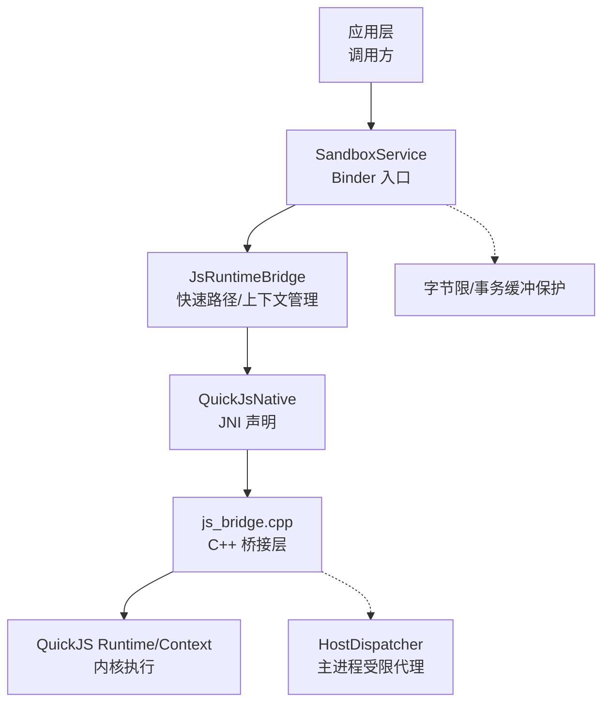
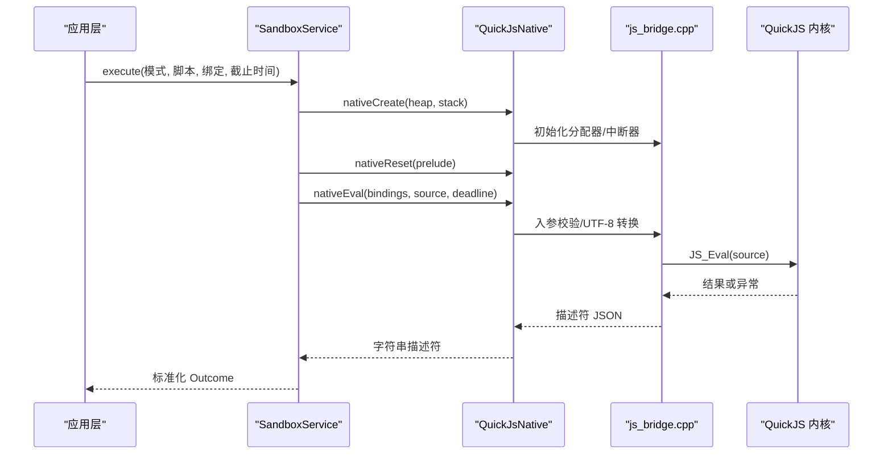
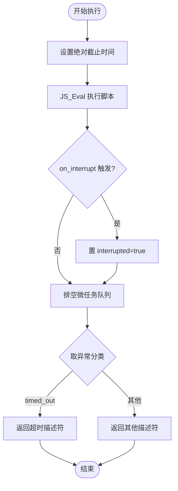
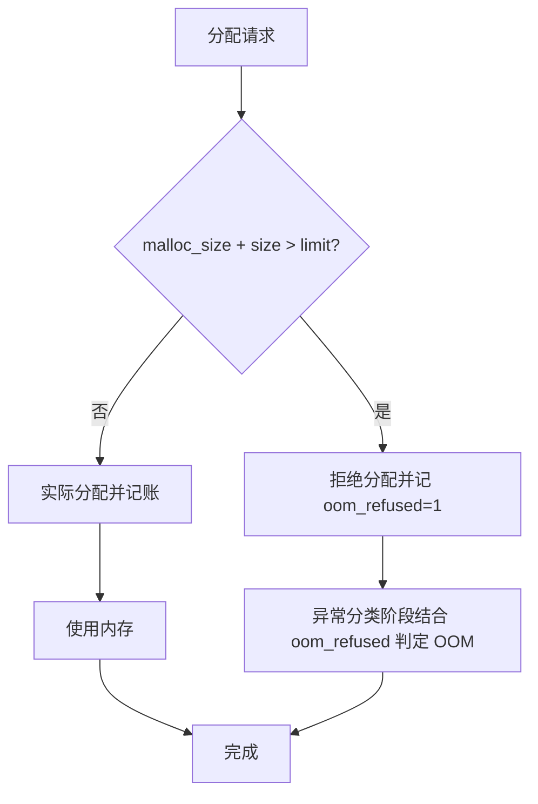
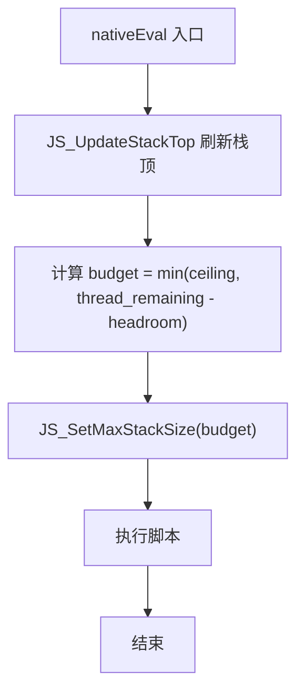
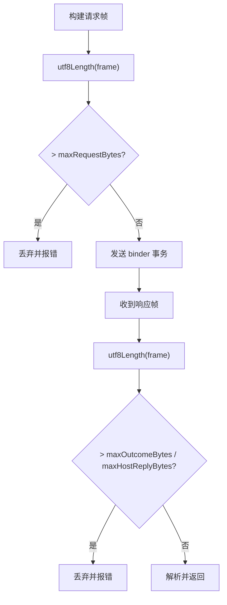
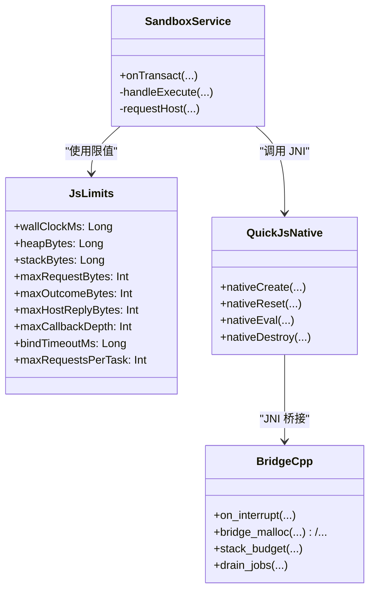

# 资源限制四件套

<cite>
**本文引用的文件**
- [JsLimits.kt](file://lib_book_source/src/main/java/com/ebook/source/sandbox/JsLimits.kt)
- [SandboxService.kt](file://lib_book_source/src/main/java/com/ebook/source/sandbox/SandboxService.kt)
- [QuickJsNative.kt](file://lib_book_source/src/main/java/com/ebook/source/sandbox/QuickJsNative.kt)
- [js_bridge.cpp](file://lib_book_source/src/main/cpp/bridge/js_bridge.cpp)
- [0028-untrusted-js-sandbox.md](file://docs/adr/0028-untrusted-js-sandbox.md)
- [QuickJsBridgeTest.kt](file://lib_book_source/src/androidTest/java/com/ebook/source/sandbox/QuickJsBridgeTest.kt)
- [BitIntentDataManager.kt](file://module_book/src/main/java/com/ebook/book/manager/BitIntentDataManager.kt)
</cite>

## 目录
1. [简介](#简介)
2. [项目结构](#项目结构)
3. [核心组件](#核心组件)
4. [架构总览](#架构总览)
5. [详细组件分析](#详细组件分析)
6. [依赖关系分析](#依赖关系分析)
7. [性能考量](#性能考量)
8. [故障排查指南](#故障排查指南)
9. [结论](#结论)
10. [附录：调优与监控](#附录：调优与监控)

## 简介
本文件系统化阐述“资源限制四件套”的实现与运行机制，覆盖以下四个方面：
- Wall-clock 超时：基于单调时钟的绝对死线、内核中断器回调、微任务队列排空。
- 堆上限控制：自定义内存分配器注册、分配拒绝标记、OOM 异常分类。
- JS 栈上限保护：每执行前按线程剩余栈动态预算、原生栈溢出防护（SIGSEGV）。
- 请求/响应大小限制：字节数计算、TransactionTooLargeException 预防、超限帧丢弃。

并说明四种限制的执行顺序与优先级、超限错误处理与进程恢复策略，以及配置调优建议、性能影响与监控调试技巧。

## 项目结构
资源限制四件套由“Kotlin 配置层 + Android Service 调度层 + C++ 桥接层 + QuickJS 内核”共同构成：
- Kotlin 层提供集中化的限额参数与协议封装（JsLimits、SandboxService）。
- C++ 桥接层负责创建/重置 runtime、设置分配器与中断器、计算栈预算、执行脚本并产出结构化描述符。
- Android Service 层通过 Binder 将主进程的调用转入隔离进程，并对 host 回调进行安全中转。
- QuickJS 内核在受限运行时内执行不可信脚本，受上述四类限制约束。

**图表来源**
- [SandboxService.kt:27-133](file://lib_book_source/src/main/java/com/ebook/source/sandbox/SandboxService.kt#L27-L133)
- [QuickJsNative.kt:15-59](file://lib_book_source/src/main/java/com/ebook/source/sandbox/QuickJsNative.kt#L15-L59)
- [js_bridge.cpp:691-820](file://lib_book_source/src/main/cpp/bridge/js_bridge.cpp#L691-L820)

**章节来源**
- [SandboxService.kt:27-133](file://lib_book_source/src/main/java/com/ebook/source/sandbox/SandboxService.kt#L27-L133)
- [QuickJsNative.kt:15-59](file://lib_book_source/src/main/java/com/ebook/source/sandbox/QuickJsNative.kt#L15-L59)
- [js_bridge.cpp:691-820](file://lib_book_source/src/main/cpp/bridge/js_bridge.cpp#L691-L820)

## 核心组件
- JsLimits：四件套限值的唯一来源，含 wall-clock 超时、堆上限、JS 栈上限、请求/响应/宿主回复字节上限、单次 host 回调次数上限等。
- SandboxService：隔离进程服务，接收 execute/ping，组织执行上下文，并在 host 回调时进行字节与协议校验。
- QuickJsNative：JNI 接口声明，负责 runtime/context 生命周期与 nativeEval 调用。
- js_bridge.cpp：实现所有限制的核心逻辑（分配器、中断器、栈预算、描述符分类、微任务队列）。
- 测试与文档：真机用例验证超时、栈溢出等边界；ADR 记录设计决策与安全权衡。

**章节来源**
- [JsLimits.kt:13-58](file://lib_book_source/src/main/java/com/ebook/source/sandbox/JsLimits.kt#L13-L58)
- [SandboxService.kt:27-133](file://lib_book_source/src/main/java/com/ebook/source/sandbox/SandboxService.kt#L27-L133)
- [QuickJsNative.kt:15-59](file://lib_book_source/src/main/java/com/ebook/source/sandbox/QuickJsNative.kt#L15-L59)
- [js_bridge.cpp:91-117](file://lib_book_source/src/main/cpp/bridge/js_bridge.cpp#L91-L117)

## 架构总览
四件套在一条执行链路中协同工作：
- 主进程通过 SandboxService 发起一次 execute，附带绝对截止时间（毫秒）。
- 隔离进程在服务端读取请求帧，进入 runSandboxTask 流程，随后调用 bridge.evaluate。
- C++ 侧创建/复用 runtime，为本次执行设定 deadline、栈预算、分配器与中断器，执行脚本。
- 执行过程中：
  - 中断器按当前时间与 deadline 判断是否超时。
  - 分配器对每次分配记账并拦截超过堆上限的请求。
  - 每次执行前按当前线程剩余栈计算栈预算，防止 SIGSEGV。
  - 请求/响应字节在 Kotlin 侧以 UTF-8 长度判定，避免 Binder 事务过大。
- 最终返回结构化描述符（ok/exception/unsupported），由主进程统一映射状态。

**图表来源**
- [SandboxService.kt:83-98](file://lib_book_source/src/main/java/com/ebook/source/sandbox/SandboxService.kt#L83-L98)
- [QuickJsNative.kt:32-59](file://lib_book_source/src/main/java/com/ebook/source/sandbox/QuickJsNative.kt#L32-L59)
- [js_bridge.cpp:691-820](file://lib_book_source/src/main/cpp/bridge/js_bridge.cpp#L691-L820)

## 详细组件分析

### Wall-clock 超时机制
- 绝对死线：主进程以 SystemClock.elapsedRealtime() 计算绝对截止时间 ms 传入执行器。
- 内核中断器：C++ 侧安装 on_interrupt(JSRuntime*, void*)，每次解释器轮询点被调用，比较当前 boot_time_ms() 与 deadline。若超时则置 interrupted 标志并返回非 0，使求值以 InternalError("interrupted") 结束。
- 微任务队列：执行结束后 drain_jobs 排空 Promise 队列，最多 MAX_PENDING_JOBS 次；若仍有待处理作业，返回 unsupported 描述符（防自驱动 Promise 循环）。
- 超时优先：take_exception_descriptor 中，先判 timed_out，再判 OOM，确保超时不会被其他异常掩盖。

**图表来源**
- [js_bridge.cpp:272-281](file://lib_book_source/src/main/cpp/bridge/js_bridge.cpp#L272-L281)
- [js_bridge.cpp:522-539](file://lib_book_source/src/main/cpp/bridge/js_bridge.cpp#L522-L539)
- [js_bridge.cpp:466-520](file://lib_book_source/src/main/cpp/bridge/js_bridge.cpp#L466-L520)

**章节来源**
- [SandboxService.kt:83-98](file://lib_book_source/src/main/java/com/ebook/source/sandbox/SandboxService.kt#L83-L98)
- [js_bridge.cpp:272-281](file://lib_book_source/src/main/cpp/bridge/js_bridge.cpp#L272-L281)
- [js_bridge.cpp:522-539](file://lib_book_source/src/main/cpp/bridge/js_bridge.cpp#L522-L539)
- [js_bridge.cpp:466-520](file://lib_book_source/src/main/cpp/bridge/js_bridge.cpp#L466-L520)

### 堆上限控制（自定义分配器）
- 自定义分配器：桥接层替换默认 malloc/free/realloc/malloc_usable_size，逐条记账 s->malloc_size，并在超过 s->malloc_limit 时拒绝分配并记录 oom_refused=1。
- 拒绝语义：当内核因 OOM 抛出裸 null 或无 message 的异常时，结合 oom_refused 判定为内存超限，而非普通运行时异常。
- 兜底常量：极端 OOM 下无法序列化描述符时，返回内置 DESCRIPTOR_OOM 字符串，避免崩溃传播。

**图表来源**
- [js_bridge.cpp:141-212](file://lib_book_source/src/main/cpp/bridge/js_bridge.cpp#L141-L212)
- [js_bridge.cpp:466-520](file://lib_book_source/src/main/cpp/bridge/js_bridge.cpp#L466-L520)
- [js_bridge.cpp:74-83](file://lib_book_source/src/main/cpp/bridge/js_bridge.cpp#L74-L83)

**章节来源**
- [js_bridge.cpp:141-212](file://lib_book_source/src/main/cpp/bridge/js_bridge.cpp#L141-L212)
- [js_bridge.cpp:466-520](file://lib_book_source/src/main/cpp/bridge/js_bridge.cpp#L466-L520)
- [js_bridge.cpp:74-83](file://lib_book_source/src/main/cpp/bridge/js_bridge.cpp#L74-L83)

### JS 栈上限保护（线程级预算）
- 天花板语义：stackBytes 是配置上限，不是固定值。每次执行前按当前线程剩余栈空间计算 budget = min(ceiling, span - headroom)。
- 原生栈检查：JS_SetMaxStackSize 设置的是距 stack_top 已用字节的上限；若预算大于线程剩余栈，深递归会直接 SIGSEGV。因此必须按当前线程现算预算，避免跨线程差异导致崩溃。
- Headroom：预留约 96KB 给 JNI/ART/Kotlin 帧开销，避免误判。
- 线程差异：binder 线程与应用新建 Java 线程栈大小不同，故每次执行都要重新计算。

**图表来源**
- [js_bridge.cpp:228-270](file://lib_book_source/src/main/cpp/bridge/js_bridge.cpp#L228-L270)
- [js_bridge.cpp:779-784](file://lib_book_source/src/main/cpp/bridge/js_bridge.cpp#L779-L784)

**章节来源**
- [js_bridge.cpp:228-270](file://lib_book_source/src/main/cpp/bridge/js_bridge.cpp#L228-L270)
- [js_bridge.cpp:779-784](file://lib_book_source/src/main/cpp/bridge/js_bridge.cpp#L779-L784)

### 请求/响应大小限制（Binder 事务缓冲）
- 字节上限：maxRequestBytes、maxOutcomeBytes、maxHostReplyBytes 均为 900 KB 级别，基于 Binder 事务缓冲约 1 MB 的口径设计，留出余量。
- 字节计算：Kotlin 侧以 UTF-8 编码长度判断；C++ 侧对 __host_call 往返也做长度检查。
- 预防 TLE：若写入超大数据会现场抛 TransactionTooLargeException；本地预判可转化为明确错误信息。
- 串行化前提：同一时刻只有一帧在飞（客户端 inFlight 锁），保证字节上限可设得相对宽松。

**图表来源**
- [SandboxService.kt:165-208](file://lib_book_source/src/main/java/com/ebook/source/sandbox/SandboxService.kt#L165-L208)
- [JsLimits.kt:27-44](file://lib_book_source/src/main/java/com/ebook/source/sandbox/JsLimits.kt#L27-L44)

**章节来源**
- [SandboxService.kt:165-208](file://lib_book_source/src/main/java/com/ebook/source/sandbox/SandboxService.kt#L165-L208)
- [JsLimits.kt:27-44](file://lib_book_source/src/main/java/com/ebook/source/sandbox/JsLimits.kt#L27-L44)

### 执行顺序与优先级
- 执行顺序：
  1) 栈预算设置（防止 SIGSEGV）
  2) 分配器记账（阻止堆溢出）
  3) 中断器轮询（wall-clock 超时）
  4) 微任务队列排空（防止自驱动循环）
  5) 描述符分类（超时优先于 OOM）
- 优先级：
  - Wall-clock 超时最高优先（timed_out 先判）
  - OOM 次之（需结合分配器拒绝标记与异常语义）
  - 栈溢出通过栈预算前置避免（不依赖内核栈溢出异常）
  - 字节超限在 Kotlin 侧尽早丢弃（避免 TLE）

**章节来源**
- [js_bridge.cpp:466-520](file://lib_book_source/src/main/cpp/bridge/js_bridge.cpp#L466-L520)
- [js_bridge.cpp:779-784](file://lib_book_source/src/main/cpp/bridge/js_bridge.cpp#L779-L784)
- [js_bridge.cpp:522-539](file://lib_book_source/src/main/cpp/bridge/js_bridge.cpp#L522-L539)

### 超限错误处理与进程恢复
- 超时：返回超时描述符，主进程映射为 TIMEOUT；不影响后续执行（context 重置）。
- OOM：返回 OOM 描述符；若严重到无法序列化，返回内置 DESCRIPTOR_OOM。
- 栈溢出：通过预算避免 SIGSEGV；若仍发生，视为致命错误，进程恢复由上层断连检测触发。
- 字节超限：本地丢弃并返回明确错误；避免 TLE 造成未类型化失败。
- 进程恢复：隔离进程崩溃由主进程感知断连后自动重启；任务边界强制重置 context，避免全局污染。

**章节来源**
- [js_bridge.cpp:553-578](file://lib_book_source/src/main/cpp/bridge/js_bridge.cpp#L553-L578)
- [js_bridge.cpp:691-820](file://lib_book_source/src/main/cpp/bridge/js_bridge.cpp#L691-L820)
- [0028-untrusted-js-sandbox.md:31-35](file://docs/adr/0028-untrusted-js-sandbox.md#L31-L35)

## 依赖关系分析
- Kotlin 层依赖 JsLimits 提供统一限值；SandboxService 依赖 QuickJsNative 暴露的 JNI 接口。
- C++ 桥接层依赖 QuickJS 内核 API，并通过 HostDispatcher 与主进程交互。
- 测试用例覆盖关键边界（超时、栈溢出、编码等），保障行为稳定。

**图表来源**
- [JsLimits.kt:13-58](file://lib_book_source/src/main/java/com/ebook/source/sandbox/JsLimits.kt#L13-L58)
- [SandboxService.kt:27-133](file://lib_book_source/src/main/java/com/ebook/source/sandbox/SandboxService.kt#L27-L133)
- [QuickJsNative.kt:15-59](file://lib_book_source/src/main/java/com/ebook/source/sandbox/QuickJsNative.kt#L15-L59)
- [js_bridge.cpp:141-212](file://lib_book_source/src/main/cpp/bridge/js_bridge.cpp#L141-L212)

**章节来源**
- [JsLimits.kt:13-58](file://lib_book_source/src/main/java/com/ebook/source/sandbox/JsLimits.kt#L13-L58)
- [SandboxService.kt:27-133](file://lib_book_source/src/main/java/com/ebook/source/sandbox/SandboxService.kt#L27-L133)
- [QuickJsNative.kt:15-59](file://lib_book_source/src/main/java/com/ebook/source/sandbox/QuickJsNative.kt#L15-L59)
- [js_bridge.cpp:141-212](file://lib_book_source/src/main/cpp/bridge/js_bridge.cpp#L141-L212)

## 性能考量
- 分配器记账有额外开销：每次分配需记账与判断，但能精确控制堆使用；MALLOC_OVERHEAD_BYTES 对齐上游口径，避免偏差。
- 中断器仅在内核轮询点触发，不会打断阻塞的原生调用；host call 的时限由主进程侧兜。
- 栈预算每次执行前计算，避免跨线程差异导致的误判；headroom 预留减少误杀。
- 字节上限在 Kotlin 侧尽早丢弃，避免昂贵的 Binder 传输失败。
- 微任务队列排空上限防止 Promise 自驱动循环占用 CPU。

[本节为通用性能讨论，无需具体文件引用]

## 故障排查指南
- 超时问题：确认主进程传递的截止时间是否正确（elapsedRealtime 同口径）；检查 on_interrupt 是否被触发；查看微任务队列是否过多。
- OOM 问题：关注分配器拒绝标记 oom_refused；确认 heapBytes 合理；检查是否有异常信息丢失（裸 null 或无 message）。
- 栈溢出：确认 stackBytes 与线程栈大小匹配；观察是否在窄栈线程上执行；调整 headroom 与预算。
- 字节超限：检查请求/响应帧 UTF-8 长度；避免整页 HTML 过大；必要时拆分传输或使用缓存。
- Binder 事务过大：使用 BitIntentDataManager 暂存大对象，避免 Intent extra 过大；保持单帧串行。

**章节来源**
- [js_bridge.cpp:272-281](file://lib_book_source/src/main/cpp/bridge/js_bridge.cpp#L272-L281)
- [js_bridge.cpp:466-520](file://lib_book_source/src/main/cpp/bridge/js_bridge.cpp#L466-L520)
- [js_bridge.cpp:228-270](file://lib_book_source/src/main/cpp/bridge/js_bridge.cpp#L228-L270)
- [SandboxService.kt:165-208](file://lib_book_source/src/main/java/com/ebook/source/sandbox/SandboxService.kt#L165-L208)
- [BitIntentDataManager.kt:5-23](file://module_book/src/main/java/com/ebook/book/manager/BitIntentDataManager.kt#L5-L23)

## 结论
资源限制四件套通过“配置集中、边界清晰、多层防御”的方式，确保不可信脚本在隔离进程中安全执行。Wall-clock 超时、堆上限、JS 栈上限与字节上限相互配合，形成从时间、内存、栈深度到数据规模的全面保护。执行顺序与优先级设计确保了最关键的威胁优先阻断，错误处理与进程恢复策略保障了系统的鲁棒性。

[本节为总结，无需具体文件引用]

## 附录：调优与监控
- 调优建议：
  - wallClockMs：根据源复杂度与网络延迟调优，避免过短导致误杀。
  - heapBytes：8 MB 起步，针对正则回溯较多的源适当放宽。
  - stackBytes：1 MB 作为天花板，注意窄栈线程上的有效深度。
  - 字节上限：900 KB 适配 Binder 缓冲，确保单帧串行。
- 监控方法：
  - 日志：记录超时、OOM、栈预算、字节超限事件。
  - 指标：统计各限制的触发频率与持续时间分布。
  - 测试：使用真机用例验证边界行为（超时、栈溢出、编码等）。

**章节来源**
- [JsLimits.kt:13-58](file://lib_book_source/src/main/java/com/ebook/source/sandbox/JsLimits.kt#L13-L58)
- [QuickJsBridgeTest.kt:82-97](file://lib_book_source/src/androidTest/java/com/ebook/source/sandbox/QuickJsBridgeTest.kt#L82-L97)
- [0028-untrusted-js-sandbox.md:31-35](file://docs/adr/0028-untrusted-js-sandbox.md#L31-L35)