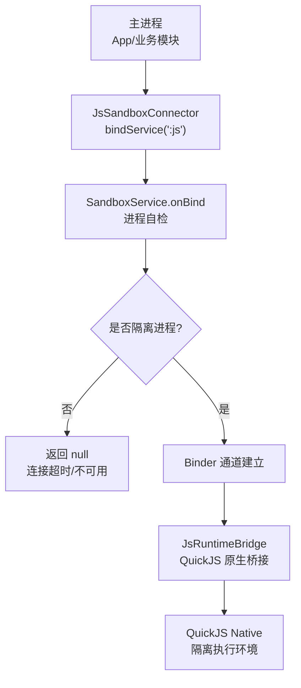
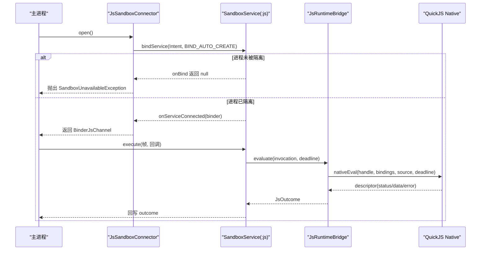
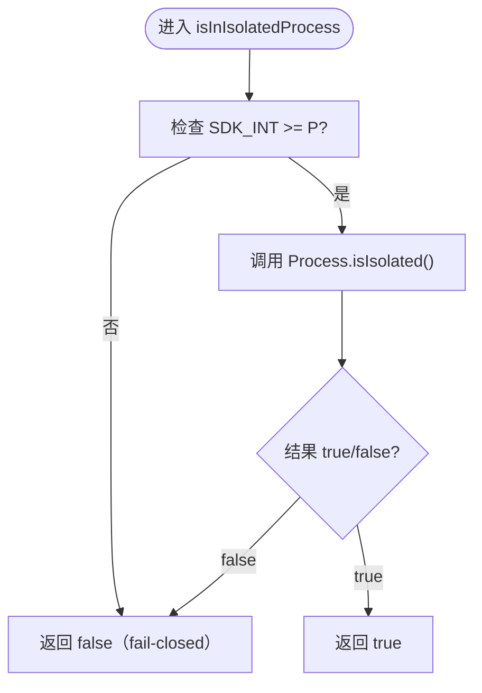
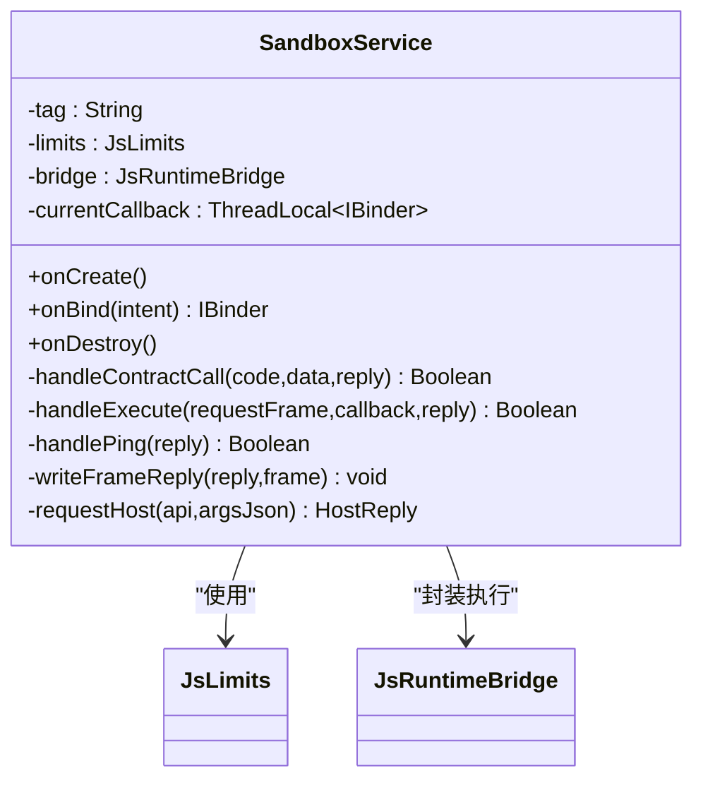
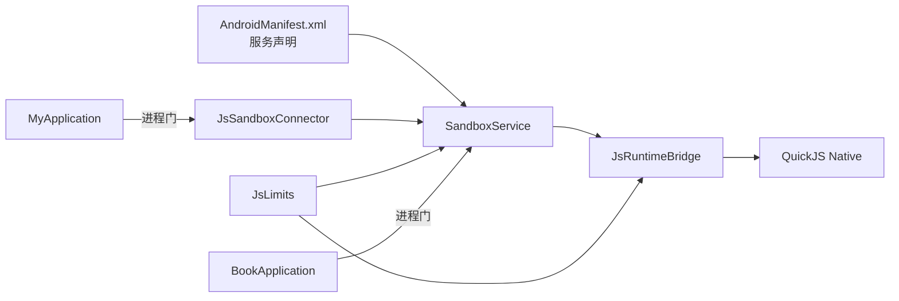

# 隔离进程安全模型

<cite>
**本文引用的文件**   
- [SandboxService.kt](file://lib_book_source/src/main/java/com/ebook/source/sandbox/SandboxService.kt)
- [SandboxProcess.kt](file://lib_book_source/src/main/java/com/ebook/source/sandbox/SandboxProcess.kt)
- [AndroidManifest.xml（lib_book_source）](file://lib_book_source/src/main/AndroidManifest.xml)
- [JsSandboxConnector.kt](file://lib_book_source/src/main/java/com/ebook/source/sandbox/JsSandboxConnector.kt)
- [JsRuntimeBridge.kt](file://lib_book_source/src/main/java/com/ebook/source/sandbox/JsRuntimeBridge.kt)
- [JsLimits.kt](file://lib_book_source/src/main/java/com/ebook/source/sandbox/JsLimits.kt)
- [0028-untrusted-js-sandbox.md](file://docs/adr/0028-untrusted-js-sandbox.md)
- [MyApplication.kt](file://module_app/src/main/java/com/ebook/MyApplication.kt)
- [BookApplication.kt](file://lib_book_common/src/main/java/com/ebook/common/BookApplication.kt)
</cite>

## 目录
1. [引言](#引言)
2. [项目结构](#项目结构)
3. [核心组件](#核心组件)
4. [架构总览](#架构总览)
5. [详细组件分析](#详细组件分析)
6. [依赖关系分析](#依赖关系分析)
7. [性能与资源限制](#性能与资源限制)
8. [故障排查指南](#故障排查指南)
9. [结论](#结论)

## 引言
本文面向“不可信 JS 执行”的安全边界，系统性阐述基于 Android isolatedProcess 的零权限隔离进程模型：内核级独立 uid、受限 SELinux 域、无网络与本地文件访问能力；并聚焦沙箱执行器在绑定阶段的进程自检逻辑（包括 SDK 版本兼容与 fail-closed 策略），解释为何选择 isolatedProcess 而非普通独立进程，以及清单属性与运行时双重检查如何防止降级为普通进程。同时给出隔离进程的生命周期管理、资源清理、错误恢复策略与调试建议。

## 项目结构
隔离进程相关代码集中在 lib_book_source 模块的沙箱子包，配合应用层 Application 与库基类中的进程门，形成“声明式隔离 + 运行时校验”的双保险。

图表来源
- [AndroidManifest.xml（lib_book_source）:17-21](file://lib_book_source/src/main/AndroidManifest.xml#L17-L21)
- [SandboxService.kt:147-153](file://lib_book_source/src/main/java/com/ebook/source/sandbox/SandboxService.kt#L147-L153)
- [JsSandboxConnector.kt:37-60](file://lib_book_source/src/main/java/com/ebook/source/sandbox/JsSandboxConnector.kt#L37-L60)
- [JsRuntimeBridge.kt:41-67](file://lib_book_source/src/main/java/com/ebook/source/sandbox/JsRuntimeBridge.kt#L41-L67)

章节来源
- [AndroidManifest.xml（lib_book_source）:1-23](file://lib_book_source/src/main/AndroidManifest.xml#L1-L23)
- [SandboxService.kt:1-210](file://lib_book_source/src/main/java/com/ebook/source/sandbox/SandboxService.kt#L1-L210)
- [JsSandboxConnector.kt:1-143](file://lib_book_source/src/main/java/com/ebook/source/sandbox/JsSandboxConnector.kt#L1-L143)

## 核心组件
- 进程门禁：SandboxProcess.isInIsolatedProcess 提供唯一判据，使用 Build.VERSION.SDK_INT 与 Process.isIsolated() 组合，API 28+ 才启用检测，minSdk 26/27 下走 fail-closed。
- 服务入口：SandboxService.onBind 拒绝非隔离进程，返回 null 使连接失败；协议处理、Ping 探活、Host 回调转发均在该 Service 内完成。
- 连接客户端：JsSandboxConnector 负责 bindService、等待 binder、超时与异常归一化为“不可用”，避免误重放一次未成功的调用。
- 执行桥接：JsRuntimeBridge 负责 QuickJS runtime 生命周期、任务边界重置、状态映射与资源释放。
- 资源限额：JsLimits 集中定义 wall-clock、堆、栈、请求/响应大小、host 回调大小、回调深度、绑定超时、单任务网络次数等阈值。
- 应用进程门：BookApplication 与 MyApplication 在 onCreate 中尽早跳过隔离进程的初始化，避免读取不到应用数据目录导致的 IO 失败。

章节来源
- [SandboxProcess.kt:6-28](file://lib_book_source/src/main/java/com/ebook/source/sandbox/SandboxProcess.kt#L6-L28)
- [SandboxService.kt:125-153](file://lib_book_source/src/main/java/com/ebook/source/sandbox/SandboxService.kt#L125-L153)
- [JsSandboxConnector.kt:13-60](file://lib_book_source/src/main/java/com/ebook/source/sandbox/JsSandboxConnector.kt#L13-L60)
- [JsRuntimeBridge.kt:21-113](file://lib_book_source/src/main/java/com/ebook/source/sandbox/JsRuntimeBridge.kt#L21-L113)
- [JsLimits.kt:1-58](file://lib_book_source/src/main/java/com/ebook/source/sandbox/JsLimits.kt#L1-L58)
- [BookApplication.kt:17-49](file://lib_book_common/src/main/java/com/ebook/common/BookApplication.kt#L17-L49)
- [MyApplication.kt:24-44](file://module_app/src/main/java/com/ebook/MyApplication.kt#L24-L44)

## 架构总览
隔离进程安全模型由三层构成：
- 系统强制层：isolatedProcess 将执行器置于独立 uid 与受限 SELinux 域，默认拒绝网络与文件访问。
- 进程门层：清单声明 + 运行时验证，确保只有真正被隔离的进程才提供服务端点。
- 执行控制层：协议版本校验、资源限额、任务边界重置、崩溃/超时后的重建或重启。

图表来源
- [JsSandboxConnector.kt:37-60](file://lib_book_source/src/main/java/com/ebook/source/sandbox/JsSandboxConnector.kt#L37-L60)
- [SandboxService.kt:50-81](file://lib_book_source/src/main/java/com/ebook/source/sandbox/SandboxService.kt#L50-L81)
- [JsRuntimeBridge.kt:41-67](file://lib_book_source/src/main/java/com/ebook/source/sandbox/JsRuntimeBridge.kt#L41-L67)

## 详细组件分析

### 进程门禁与 SDK 兼容性
- 判据：仅在 API 28+ 调用 Process.isIsolated()，避免在 minSdk 26/27 设备上因方法缺失导致崩溃。
- 行为：若不在隔离进程，统一视为不可用，走 fail-closed 策略。
- 作用范围：用于 Service 绑定拒绝、Application 初始化门控等关键路径。

图表来源
- [SandboxProcess.kt:23-28](file://lib_book_source/src/main/java/com/ebook/source/sandbox/SandboxProcess.kt#L23-L28)

章节来源
- [SandboxProcess.kt:6-28](file://lib_book_source/src/main/java/com/ebook/source/sandbox/SandboxProcess.kt#L6-L28)

### SandboxService 绑定阶段自检
- 清单属性：服务声明 android:isolatedProcess="true"，且 exported=false，仅本应用可绑定。
- 运行时验证：onBind 内部通过 SandboxProcess.isInIsolatedProcess 再次确认，非隔离直接返回 null，使连接方收到“不可用”。
- 事务处理：onTransact 先校验接口标识与协议版本，再分派 TX_EXECUTE/TX_PING；PING 不建 runtime，只返回就绪位。
- 资源清理：onDestroy 中清理 HostDispatcher 中继、移除 ThreadLocal、关闭 bridge。

图表来源
- [SandboxService.kt:27-153](file://lib_book_source/src/main/java/com/ebook/source/sandbox/SandboxService.kt#L27-L153)
- [JsLimits.kt:13-58](file://lib_book_source/src/main/java/com/ebook/source/sandbox/JsLimits.kt#L13-L58)
- [JsRuntimeBridge.kt:21-113](file://lib_book_source/src/main/java/com/ebook/source/sandbox/JsRuntimeBridge.kt#L21-L113)

章节来源
- [AndroidManifest.xml（lib_book_source）:10-22](file://lib_book_source/src/main/AndroidManifest.xml#L10-L22)
- [SandboxService.kt:50-153](file://lib_book_source/src/main/java/com/ebook/source/sandbox/SandboxService.kt#L50-L153)

### 连接客户端与容错
- 连接方式：bindService + BIND_AUTO_CREATE，每次 open 创建独立 Connection，close 时解绑，避免旧 binder 干扰新连接。
- 超时与失败：await 带超时；失败或中断统一转为 SandboxUnavailableException，避免无意义重放。
- 兼容 API 28 以下：onNullBinding 与 onServiceConnected(null) 两种路径语义一致，保证不同系统版本的错误信息一致。

章节来源
- [JsSandboxConnector.kt:13-60](file://lib_book_source/src/main/java/com/ebook/source/sandbox/JsSandboxConnector.kt#L13-L60)
- [JsSandboxConnector.kt:75-141](file://lib_book_source/src/main/java/com/ebook/source/sandbox/JsSandboxConnector.kt#L75-L141)

### 执行桥接与资源管理
- Runtime 创建与重置：evaluate 前 ensureRuntime 创建 handle；超时/内存/栈溢出后 reset 销毁并重建 context，防止残留污染。
- 关闭与清理：close 销毁 handle；onDestroy 中调用 close，确保进程退出时释放原生资源。
- 状态映射：native 描述符解码为 JsOutcome，区分 OK/TIMEOUT/MEMORY/STACK/UNAVAILABLE 等状态。

章节来源
- [JsRuntimeBridge.kt:41-113](file://lib_book_source/src/main/java/com/ebook/source/sandbox/JsRuntimeBridge.kt#L41-L113)
- [SandboxService.kt:125-136](file://lib_book_source/src/main/java/com/ebook/source/sandbox/SandboxService.kt#L125-L136)

### 应用进程门（Application 初始化保护）
- BookApplication：在 super.onCreate() 之后立即判断 isInIsolatedProcess，若是则跳过主题装配与 ThemeModeManager 持久化，避免读取不到 SharedPreferences。
- MyApplication：同样在 super.onCreate() 之后尽早 return，防止 Hilt 注入的内容仓库在隔离进程中初始化失败。

章节来源
- [BookApplication.kt:17-49](file://lib_book_common/src/main/java/com/ebook/common/BookApplication.kt#L17-L49)
- [MyApplication.kt:24-44](file://module_app/src/main/java/com/ebook/MyApplication.kt#L24-L44)

## 依赖关系分析
- 清单与服务：lib_book_source 的 AndroidManifest.xml 声明 :js 服务为 isolatedProcess 与 exported=false，确保服务仅在本应用内可用且运行于隔离进程。
- 客户端到服务端：JsSandboxConnector 通过 Intent 绑定 SandboxService，建立 Binder 通道；SandboxService 内部通过 JsRuntimeBridge 调用 QuickJS 原生执行。
- 资源与限额：JsLimits 作为单一事实源，贯穿执行、请求/响应大小、host 回调大小、绑定超时、单任务网络次数等。
- 应用初始化：BookApplication 与 MyApplication 通过同一进程门禁避免在隔离进程中进行 UI/存储相关初始化。

图表来源
- [AndroidManifest.xml（lib_book_source）:17-21](file://lib_book_source/src/main/AndroidManifest.xml#L17-L21)
- [JsSandboxConnector.kt:37-60](file://lib_book_source/src/main/java/com/ebook/source/sandbox/JsSandboxConnector.kt#L37-L60)
- [SandboxService.kt:125-153](file://lib_book_source/src/main/java/com/ebook/source/sandbox/SandboxService.kt#L125-L153)
- [JsRuntimeBridge.kt:41-113](file://lib_book_source/src/main/java/com/ebook/source/sandbox/JsRuntimeBridge.kt#L41-L113)
- [JsLimits.kt:13-58](file://lib_book_source/src/main/java/com/ebook/source/sandbox/JsLimits.kt#L13-L58)
- [BookApplication.kt:17-49](file://lib_book_common/src/main/java/com/ebook/common/BookApplication.kt#L17-L49)
- [MyApplication.kt:24-44](file://module_app/src/main/java/com/ebook/MyApplication.kt#L24-L44)

章节来源
- [AndroidManifest.xml（lib_book_source）:1-23](file://lib_book_source/src/main/AndroidManifest.xml#L1-L23)
- [JsSandboxConnector.kt:1-143](file://lib_book_source/src/main/java/com/ebook/source/sandbox/JsSandboxConnector.kt#L1-L143)
- [SandboxService.kt:1-210](file://lib_book_source/src/main/java/com/ebook/source/sandbox/SandboxService.kt#L1-L210)
- [JsRuntimeBridge.kt:1-113](file://lib_book_source/src/main/java/com/ebook/source/sandbox/JsRuntimeBridge.kt#L1-L113)
- [JsLimits.kt:1-58](file://lib_book_source/src/main/java/com/ebook/source/sandbox/JsLimits.kt#L1-L58)
- [BookApplication.kt:1-64](file://lib_book_common/src/main/java/com/ebook/common/BookApplication.kt#L1-L64)
- [MyApplication.kt:1-66](file://module_app/src/main/java/com/ebook/MyApplication.kt#L1-L66)

## 性能与资源限制
- 挂钟超时：wallClockMs 控制单次执行时间上限，由执行器线程中断器逐轮比对。
- 堆与栈：heapBytes 与 stackBytes 分别限制内存分配与递归深度；栈上限为天花板值，需结合当前线程剩余栈进行预算收敛。
- 报文大小：maxRequestBytes、maxOutcomeBytes、maxHostReplyBytes 以 binder 事务缓冲为尺子（约 1 MB 共享缓冲），超限在本地拦截以避免 TransactionTooLargeException。
- 绑定超时：bindTimeoutMs 单独设置，冷启动连接失败应快速失败，避免占用规则执行预算。
- 单任务网络次数：maxRequestsPerTask 限制一轮解析的外呼次数，超出即判定为异常模式。
- 回调深度：maxCallbackDepth 限制脚本嵌套层级，防止深递归绕过栈限。

章节来源
- [JsLimits.kt:13-58](file://lib_book_source/src/main/java/com/ebook/source/sandbox/JsLimits.kt#L13-L58)

## 故障排查指南
- 连接超时/不可用
  - 现象：open() 抛出 SandboxUnavailableException，日志提示绑定失败或服务不存在。
  - 可能原因：服务未声明 isolatedProcess、exported 配置错误、进程未被隔离导致 onBind 返回 null。
  - 定位要点：核对合并后的 Manifest 中 service 的 isolatedProcess 与 process 属性；查看连接侧 await 超时日志。
  - 参考路径：[JsSandboxConnector.kt:37-60](file://lib_book_source/src/main/java/com/ebook/source/sandbox/JsSandboxConnector.kt#L37-L60)、[JsSandboxConnector.kt:75-141](file://lib_book_source/src/main/java/com/ebook/source/sandbox/JsSandboxConnector.kt#L75-L141)

- 协议版本不合
  - 现象：服务端返回 UNAVAILABLE，日志包含协议版本不一致。
  - 可能原因：宿主与执行器构建产物不同步，协议版本常量未对齐。
  - 参考路径：[SandboxService.kt:63-81](file://lib_book_source/src/main/java/com/ebook/source/sandbox/SandboxService.kt#L63-L81)

- .so 加载失败
  - 现象：isReady=false，evaluate 返回 UNAVAILABLE，日志提示 libebook_js.so 未加载。
  - 可能原因：ABI 不匹配、NDK/CMake 版本漂移、R8 混淆移除了反射入口。
  - 参考路径：[JsRuntimeBridge.kt:41-67](file://lib_book_source/src/main/java/com/ebook/source/sandbox/JsRuntimeBridge.kt#L41-L67)

- 超时/内存/栈溢出
  - 现象：execute 返回 TIMEOUT/MEMORY/STACK，runtime 被重置。
  - 可能原因：脚本死循环、指数分配、无限递归；需调整 JsLimits 或优化脚本。
  - 参考路径：[JsRuntimeBridge.kt:41-67](file://lib_book_source/src/main/java/com/ebook/source/sandbox/JsRuntimeBridge.kt#L41-L67)

- 主进程误判导致无法初始化
  - 现象：应用启动正常但功能未初始化，疑似进程门误判。
  - 可能原因：SandboxProcess.isInIsolatedProcess 实现被改动，或 Application 初始化顺序不当。
  - 参考路径：[SandboxProcess.kt:23-28](file://lib_book_source/src/main/java/com/ebook/source/sandbox/SandboxProcess.kt#L23-L28)、[BookApplication.kt:17-49](file://lib_book_common/src/main/java/com/ebook/common/BookApplication.kt#L17-L49)、[MyApplication.kt:24-44](file://module_app/src/main/java/com/ebook/MyApplication.kt#L24-L44)

## 结论
本项目采用 isolatedProcess 将不可信 JS 执行下沉至内核强制的零权限进程，并通过清单属性与运行时双重检查防止降级为普通进程。SandboxService 的 onBind 自检、JsSandboxConnector 的连接容错、JsRuntimeBridge 的任务边界重置与 JsLimits 的资源限额共同构成多层防御。Application 进程门确保隔离进程不执行无关初始化，提升稳定性与安全性。整体方案从“代码约定”升级为“操作系统强制”，为脚本书源生态提供了坚实的安全基础。